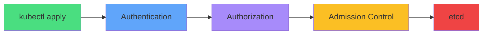
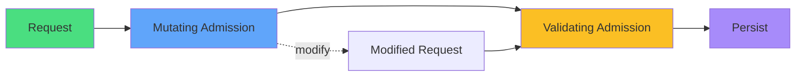
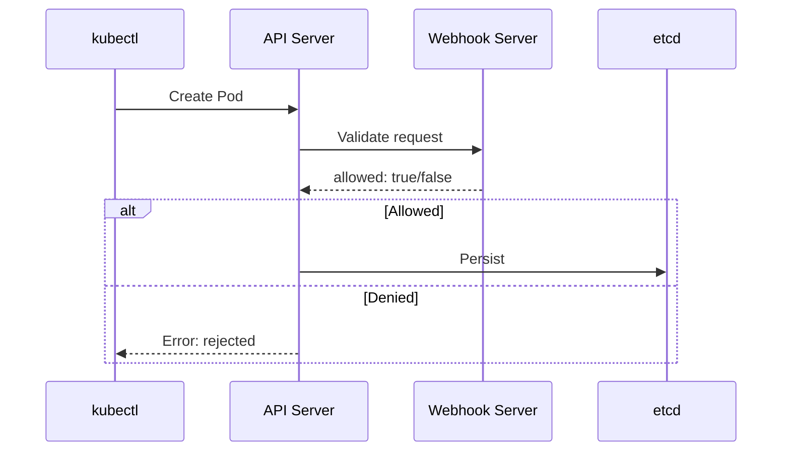
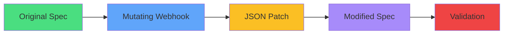
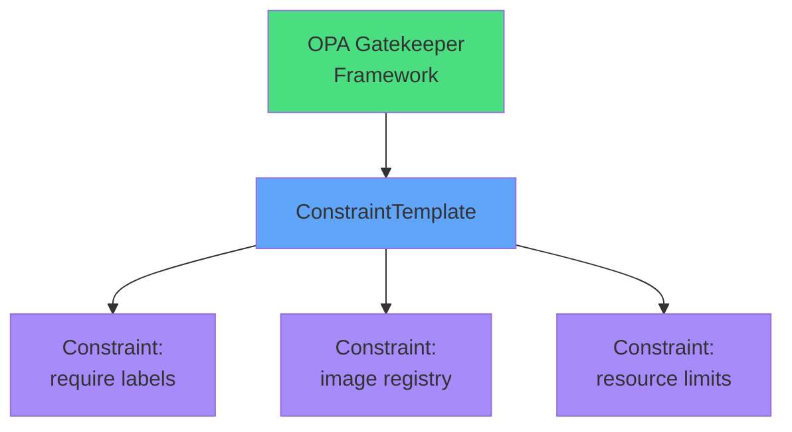
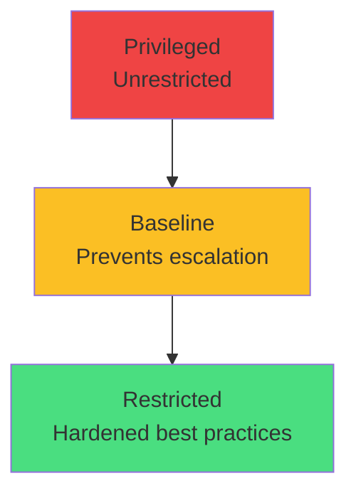
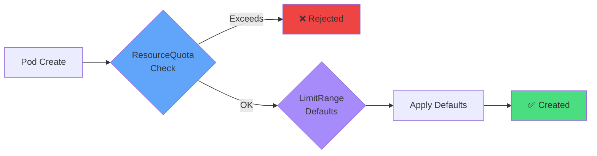
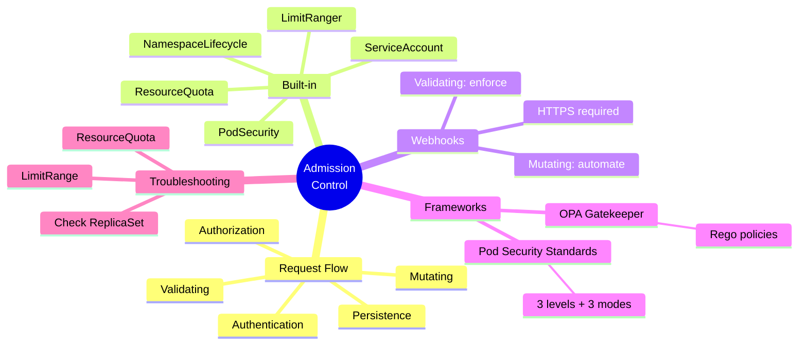

# Admission Control

<div class="abs-br m-6 flex gap-2">
  <carbon-security class="text-6xl text-blue-400" />
</div>

<!--
METADATA:
sentence: Admission control sits between the Kubernetes API server and resource persistence. It's the final gatekeeper that can validate, mutate, or reject your resource requests before they're stored in etcd.
search_anchor: final gatekeeper
-->
<div v-click class="mt-8 text-xl opacity-80">
The final gatekeeper between API and etcd
</div>

<!--
METADATA:
sentence: This advanced topic, while beyond core CKAD requirements, is crucial for understanding how Kubernetes enforces policies and validates resources.
search_anchor: advanced topic, while beyond core CKAD
-->
<div v-click class="mt-4 text-lg opacity-60">
Advanced topic for understanding policy enforcement
</div>

---
layout: center
---

# Admission Control in API Flow

<!--
METADATA:
sentence: To understand admission control, let's trace what happens when you run kubectl apply.
search_anchor: trace what happens when you run kubectl apply
-->
<div v-click="1">



</div>

<!--
METADATA:
sentence: First, your request reaches the API server and goes through **authentication** - proving who you are.
search_anchor: goes through authentication
-->
<div v-click="2" class="mt-6 text-center">
<carbon-credential class="inline-block text-3xl text-blue-400" /> Authentication: Who are you?
</div>

<!--
METADATA:
sentence: Then **authorization** checks what you're allowed to do using RBAC or other authorization modes.
search_anchor: authorization checks what you're allowed to do
-->
<div v-click="3" class="text-center mt-2">
<carbon-locked class="inline-block text-3xl text-purple-400" /> Authorization: What can you do?
</div>

<!--
METADATA:
sentence: After passing authentication and authorization, your request enters the **admission control phase**.
search_anchor: admission control phase
-->
<div v-click="4" class="text-center mt-2">
<carbon-security class="inline-block text-3xl text-yellow-400" /> Admission: Should this be allowed?
</div>

<!--
METADATA:
sentence: Only after passing all admission controllers is the object **persisted to etcd**.
search_anchor: persisted to etcd
-->
<div v-click="5" class="text-center mt-2">
<carbon-data-base class="inline-block text-3xl text-red-400" /> Persistence: Store in etcd
</div>

---
layout: center
---

# Two-Phase Admission

<!--
METADATA:
sentence: There are two types: **mutating admission** runs first and can modify the object, like injecting sidecar containers or adding default values.
search_anchor: mutating admission runs first
-->
<div v-click="1">



</div>

<!--
METADATA:
sentence: There are two types: **mutating admission** runs first and can modify the object, like injecting sidecar containers or adding default values.
search_anchor: mutating admission runs first
-->
<div v-click="2" class="mt-8 flex justify-around">
<div class="text-center">
<carbon-upgrade class="text-5xl text-blue-400 mb-2" />
<div class="font-semibold">Mutating</div>
<div class="text-sm opacity-80">Runs first, can modify</div>
</div>
<!--
METADATA:
sentence: Then **validating admission** runs and can accept or reject the object based on policies.
search_anchor: validating admission runs
-->
<div v-click="3" class="text-center">
<carbon-checkmark class="text-5xl text-yellow-400 mb-2" />
<div class="font-semibold">Validating</div>
<div class="text-sm opacity-80">Runs second, accept/reject</div>
</div>
</div>

<!--
METADATA:
sentence: This means admission control is your last line of defense - it can prevent invalid or insecure configurations from entering your cluster.
search_anchor: last line of defense
-->
<div v-click="4" class="mt-6 text-center text-lg">
Last line of defense before persistence
</div>

---
layout: center
---

# Why Admission Control?

<div class="grid grid-cols-2 gap-6 mt-8">
<!--
METADATA:
sentence: **Security enforcement**: You can require all containers to run as non-root users, block privileged containers, or enforce image registries. This prevents dangerous configurations from being deployed.
search_anchor: Security enforcement
-->
<div v-click="1">
<carbon-security class="text-5xl text-red-400 mb-3" />
<div class="font-semibold text-lg">Security Enforcement</div>
<div class="text-sm opacity-80">Block privileged containers<br/>Require non-root users<br/>Enforce image registries</div>
</div>

<!--
METADATA:
sentence: **Policy compliance**: Ensure all resources have required labels, stay within resource limits, or follow naming conventions. This maintains organizational standards.
search_anchor: Policy compliance
-->
<div v-click="2">
<carbon-rule class="text-5xl text-blue-400 mb-3" />
<div class="font-semibold text-lg">Policy Compliance</div>
<div class="text-sm opacity-80">Required labels<br/>Resource limits<br/>Naming conventions</div>
</div>

<!--
METADATA:
sentence: **Automatic configuration**: Inject environment variables, add sidecar containers for logging or monitoring, or apply default resource limits. This reduces manual configuration and ensures consistency.
search_anchor: Automatic configuration
-->
<div v-click="3">
<carbon-automation class="text-5xl text-green-400 mb-3" />
<div class="font-semibold text-lg">Auto Configuration</div>
<div class="text-sm opacity-80">Inject sidecars<br/>Add env vars<br/>Apply defaults</div>
</div>

<!--
METADATA:
sentence: **Multi-tenancy**: Prevent teams from interfering with each other by enforcing namespace quotas, network policies, or resource limits.
search_anchor: Multi-tenancy
-->
<div v-click="4">
<carbon-user-multiple class="text-5xl text-purple-400 mb-3" />
<div class="font-semibold text-lg">Multi-tenancy</div>
<div class="text-sm opacity-80">Namespace quotas<br/>Network policies<br/>Resource isolation</div>
</div>
</div>

<!--
METADATA:
sentence: For CKAD, you won't implement admission controllers, but you will encounter scenarios where admission policies block your deployments. Understanding how they work helps you troubleshoot these issues quickly.
search_anchor: For CKAD, you won't implement
-->
<div v-click="5" class="mt-6 text-center text-yellow-400">
<carbon-information class="inline-block text-2xl" /> For CKAD: Understand to troubleshoot failures
</div>

---
layout: center
---

# Built-in Admission Controllers

<div class="grid grid-cols-2 gap-4 mt-6 text-sm">
<!--
METADATA:
sentence: **NamespaceLifecycle** prevents operations in namespaces that are being deleted or don't exist. This is why you can't create resources in terminating namespaces.
search_anchor: NamespaceLifecycle prevents operations
-->
<div v-click="1">
<carbon-namespace class="inline-block text-3xl text-blue-400" />
<div class="font-semibold">NamespaceLifecycle</div>
<div class="opacity-80">Prevents ops in terminating namespaces</div>
</div>

<!--
METADATA:
sentence: **LimitRanger** enforces LimitRange constraints, applying default resource requests and limits to containers that don't specify them.
search_anchor: LimitRanger enforces LimitRange constraints
-->
<div v-click="2">
<carbon-edge-node class="inline-block text-3xl text-green-400" />
<div class="font-semibold">LimitRanger</div>
<div class="opacity-80">Applies default resource limits</div>
</div>

<!--
METADATA:
sentence: **ResourceQuota** enforces namespace quotas on CPU, memory, Pod count, and other resources. It's why deployments sometimes fail with "exceeded quota" errors.
search_anchor: ResourceQuota enforces namespace quotas
-->
<div v-click="3">
<carbon-dashboard class="inline-block text-3xl text-yellow-400" />
<div class="font-semibold">ResourceQuota</div>
<div class="opacity-80">Enforces namespace quotas</div>
</div>

<!--
METADATA:
sentence: **ServiceAccount** automatically injects the default service account into Pods that don't specify one. This is why every Pod has credentials to access the Kubernetes API.
search_anchor: ServiceAccount automatically injects
-->
<div v-click="4">
<carbon-user-access class="inline-block text-3xl text-purple-400" />
<div class="font-semibold">ServiceAccount</div>
<div class="opacity-80">Auto-injects default service account</div>
</div>

<!--
METADATA:
sentence: **PodSecurity** enforces Pod Security Standards (baseline, restricted, privileged), replacing the deprecated PodSecurityPolicy. This is increasingly important for security.
search_anchor: PodSecurity enforces Pod Security Standards
-->
<div v-click="5">
<carbon-security-services class="inline-block text-3xl text-red-400" />
<div class="font-semibold">PodSecurity</div>
<div class="opacity-80">Enforces Pod Security Standards</div>
</div>
</div>

<!--
METADATA:
sentence: These controllers run automatically. As a developer, you see their effects when deployments are rejected or modified.
search_anchor: These controllers run automatically
-->
<div v-click="6" class="mt-8 text-center text-lg opacity-80">
These run automatically - you see their effects
</div>

---
layout: center
---

# Validating Webhooks

<!--
METADATA:
sentence: Validating admission webhooks are custom HTTP servers that can accept or reject resource requests based on your organization's policies.
search_anchor: Validating admission webhooks are custom HTTP servers
-->
<div v-click="1">



</div>

<div class="grid grid-cols-3 gap-4 mt-6 text-sm">
<!--
METADATA:
sentence: Common use cases include: - Requiring specific labels on all resources
search_anchor: Requiring specific labels
-->
<div v-click="2" class="text-center">
<carbon-tag class="text-3xl text-blue-400 mb-2" />
<div>Require labels</div>
</div>
<!--
METADATA:
sentence: - Enforcing image registry whitelists
search_anchor: Enforcing image registry whitelists
-->
<div v-click="3" class="text-center">
<carbon-container-registry class="text-3xl text-green-400 mb-2" />
<div>Image whitelists</div>
</div>
<!--
METADATA:
sentence: - Checking that security contexts are properly configured
search_anchor: security contexts are properly configured
-->
<div v-click="4" class="text-center">
<carbon-security class="text-3xl text-purple-400 mb-2" />
<div>Security contexts</div>
</div>
</div>

<!--
METADATA:
sentence: The webhook must be served over HTTPS with a valid TLS certificate - Kubernetes won't call insecure webhooks.
search_anchor: served over HTTPS with a valid TLS certificate
-->
<div v-click="5" class="mt-6 text-center">
<carbon-locked class="inline-block text-2xl text-red-400" /> Must use HTTPS with valid TLS
</div>

---
layout: center
---

# Mutating Webhooks

<!--
METADATA:
sentence: While validating webhooks say "yes" or "no," mutating webhooks can actually modify the resource before it's created.
search_anchor: mutating webhooks can actually modify
-->
<div v-click="1">



</div>

<div class="mt-8">
<!--
METADATA:
sentence: - Injecting sidecar containers for logging, monitoring, or service mesh
search_anchor: Injecting sidecar containers
-->
<div v-click="2" class="mb-4">
<carbon-side-panel-open class="inline-block text-3xl text-blue-400" /> Inject sidecar containers (Istio)
</div>
<!--
METADATA:
sentence: - Adding environment variables or volume mounts
search_anchor: Adding environment variables
-->
<div v-click="3" class="mb-4">
<carbon-list class="inline-block text-3xl text-green-400" /> Add environment variables
</div>
<!--
METADATA:
sentence: - Setting default security contexts or resource limits
search_anchor: Setting default security contexts
-->
<div v-click="4" class="mb-4">
<carbon-security class="inline-block text-3xl text-purple-400" /> Set default security contexts
</div>
<!--
METADATA:
sentence: - Adding labels or annotations automatically
search_anchor: Adding labels or annotations automatically
-->
<div v-click="5" class="mb-4">
<carbon-tag class="inline-block text-3xl text-yellow-400" /> Add labels or annotations
</div>
<!--
METADATA:
sentence: - Rewriting image references to use a local registry
search_anchor: Rewriting image references
-->
<div v-click="6" class="mb-4">
<carbon-container-registry class="inline-block text-3xl text-orange-400" /> Rewrite image references
</div>
</div>

<!--
METADATA:
sentence: The key difference: validating webhooks are about enforcement, mutating webhooks are about automation. Both are powerful tools for cluster administrators to ensure consistency and security.
search_anchor: validating webhooks are about enforcement
-->
<div v-click="7" class="mt-6 text-center text-lg font-semibold">
Validating = enforcement | Mutating = automation
</div>

---
layout: center
---

# Webhook Configuration

<!--
METADATA:
sentence: Configuring admission webhooks requires creating ValidatingWebhookConfiguration or MutatingWebhookConfiguration resources.
search_anchor: Configuring admission webhooks
-->
<div v-click="1" class="mb-6">

```yaml
apiVersion: admissionregistration.k8s.io/v1
kind: ValidatingWebhookConfiguration
metadata:
  name: my-webhook
webhooks:
- name: validate.example.com
  rules:
  - operations: ["CREATE", "UPDATE"]
    resources: ["pods"]
  clientConfig:
    service:
      name: webhook-service
    caBundle: <cert>
  failurePolicy: Fail
```

</div>

<div class="grid grid-cols-2 gap-4 text-sm">
<!--
METADATA:
sentence: - **Which resources and operations trigger the webhook** - like Pods on CREATE and UPDATE
search_anchor: Which resources and operations trigger the webhook
-->
<div v-click="2">
<carbon-rule class="inline-block text-2xl text-blue-400" /> Which resources trigger
</div>
<!--
METADATA:
sentence: - **The webhook server endpoint** - typically a ClusterIP Service URL
search_anchor: webhook server endpoint
-->
<div v-click="3">
<carbon-network-3 class="inline-block text-2xl text-green-400" /> Webhook endpoint
</div>
<!--
METADATA:
sentence: - **Namespace and object selectors** - to limit which resources are affected
search_anchor: Namespace and object selectors
-->
<div v-click="4">
<carbon-filter class="inline-block text-2xl text-purple-400" /> Namespace selectors
</div>
<!--
METADATA:
sentence: - **Failure policy** - what happens if the webhook server is unavailable (Ignore or Fail)
search_anchor: Failure policy
-->
<div v-click="5">
<carbon-warning class="inline-block text-2xl text-red-400" /> Failure policy
</div>
</div>

<!--
METADATA:
sentence: A critical consideration is the **failure policy**. If set to Fail and your webhook server is down, no resources matching the rules can be created. This can lock you out of your cluster.
search_anchor: This can lock you out of your cluster
-->
<div v-click="6" class="mt-6 text-center text-yellow-400">
<carbon-warning class="inline-block text-2xl" /> Fail policy can lock you out if webhook is down!
</div>

---
layout: center
---

# OPA Gatekeeper

<!--
METADATA:
sentence: Open Policy Agent (OPA) Gatekeeper is a popular policy framework that implements admission control using a declarative policy language called Rego.
search_anchor: OPA Gatekeeper is a popular policy framework
-->
<div v-click="1">



</div>

<!--
METADATA:
sentence: Rather than writing custom webhook servers in Python, Go, or Node.js, you write policies in Rego.
search_anchor: write policies in Rego
-->
<div v-click="2" class="mt-8 text-center">
<carbon-document class="inline-block text-4xl text-blue-400" /> Write policies in Rego
</div>

<!--
METADATA:
sentence: Rather than writing custom webhook servers in Python, Go, or Node.js, you write policies in Rego. Gatekeeper provides the webhook infrastructure, you just provide the policies.
search_anchor: Gatekeeper provides the webhook infrastructure
-->
<div v-click="3" class="mt-4 text-center">
<carbon-rule class="inline-block text-4xl text-green-400" /> Not custom webhook code
</div>

<!--
METADATA:
sentence: The advantage is discoverability. Custom webhooks are black boxes - you don't know what policies exist without external documentation. Gatekeeper constraints are Kubernetes resources you can list and describe, making policies visible and manageable through kubectl.
search_anchor: policies visible and manageable through kubectl
-->
<div v-click="4" class="mt-8 flex justify-around">
<div class="text-center">
<carbon-view class="text-4xl text-purple-400 mb-2" />
<div class="text-sm">Discoverable via kubectl</div>
</div>
<!--
METADATA:
sentence: Gatekeeper also provides audit functionality, showing existing resources that violate policies. This helps you understand policy impact before enforcement.
search_anchor: audit functionality, showing existing resources that violate policies
-->
<div v-click="5" class="text-center">
<carbon-search class="text-4xl text-yellow-400 mb-2" />
<div class="text-sm">Audit existing violations</div>
</div>
</div>

---
layout: center
---

# Pod Security Standards

<!--
METADATA:
sentence: Pod Security Standards (PSS) are a modern, built-in admission control mechanism for enforcing Pod security policies.
search_anchor: Pod Security Standards (PSS) are a modern
-->
<div v-click="1">



</div>

<div class="grid grid-cols-3 gap-4 mt-8 text-sm">
<!--
METADATA:
sentence: Three modes of enforcement: - **enforce** - violations are rejected
search_anchor: enforce - violations are rejected
-->
<div v-click="2" class="text-center">
<carbon-locked class="text-4xl text-red-400 mb-2" />
<div class="font-semibold">enforce</div>
<div class="opacity-80">Violations rejected</div>
</div>
<!--
METADATA:
sentence: - **audit** - violations are allowed but logged
search_anchor: audit - violations are allowed but logged
-->
<div v-click="3" class="text-center">
<carbon-document class="text-4xl text-yellow-400 mb-2" />
<div class="font-semibold">audit</div>
<div class="opacity-80">Violations logged</div>
</div>
<!--
METADATA:
sentence: - **warn** - violations are allowed but user sees a warning
search_anchor: warn - violations are allowed but user sees a warning
-->
<div v-click="4" class="text-center">
<carbon-warning class="text-4xl text-blue-400 mb-2" />
<div class="font-semibold">warn</div>
<div class="opacity-80">User sees warning</div>
</div>
</div>

<!--
METADATA:
sentence: PSS is applied at the namespace level using labels.
search_anchor: applied at the namespace level using labels
-->
<div v-click="5" class="mt-8 text-center text-sm opacity-80">
Applied via namespace labels:
</div>

<!--
METADATA:
sentence: For example: pod-security.kubernetes.io/enforce=baseline
search_anchor: pod-security.kubernetes.io/enforce=baseline
-->
<div v-click="6" class="text-center text-xs">
pod-security.kubernetes.io/enforce=baseline
</div>

<!--
METADATA:
sentence: PSS replaced PodSecurityPolicy, which was deprecated and removed in Kubernetes 1.25. For CKAD, understand PSS basics and recognize pod security errors.
search_anchor: PSS replaced PodSecurityPolicy
-->
<div v-click="7" class="mt-4 text-center">
<carbon-information class="inline-block text-2xl text-green-400" /> Replaced PodSecurityPolicy in K8s 1.25
</div>

---
layout: center
---

# ResourceQuota & LimitRange

<!--
METADATA:
sentence: ResourceQuota and LimitRange are built-in admission controllers that manage resource consumption.
search_anchor: ResourceQuota and LimitRange are built-in admission controllers
-->
<div v-click="1">



</div>

<div class="grid grid-cols-2 gap-6 mt-8 text-sm">
<!--
METADATA:
sentence: **ResourceQuota** enforces namespace-level limits on resources. When you try to create a Pod that would exceed the quota, the admission controller rejects it with a clear error message.
search_anchor: ResourceQuota enforces namespace-level limits
-->
<div v-click="2">
<div class="font-semibold text-lg mb-2"><carbon-dashboard class="inline-block text-3xl text-blue-400" /> ResourceQuota</div>
<div class="opacity-80">
• Max pods<br/>
• Total requests.cpu / requests.memory<br/>
• Total limits.cpu / limits.memory<br/>
• PVC count
</div>
</div>

<!--
METADATA:
sentence: **LimitRange** enforces per-resource constraints and can set defaults. It defines minimum, maximum, and default values for resource requests and limits. When you create a container without specifying resources, LimitRange applies defaults automatically.
search_anchor: LimitRange enforces per-resource constraints
-->
<div v-click="3">
<div class="font-semibold text-lg mb-2"><carbon-edge-node class="inline-block text-3xl text-purple-400" /> LimitRange</div>
<div class="opacity-80">
• Min/max per container<br/>
• Default requests/limits<br/>
• Auto-applies defaults
</div>
</div>
</div>

<!--
METADATA:
sentence: These are among the most common causes of mysterious deployment failures.
search_anchor: most common causes of mysterious deployment failures
-->
<div v-click="4" class="mt-6 text-center text-yellow-400">
<carbon-warning class="inline-block text-2xl" /> Most common cause of mysterious failures
</div>

---
layout: center
---

# Troubleshooting Admission Failures

<!--
METADATA:
sentence: When admission controllers reject your resources, quick troubleshooting is essential.
search_anchor: quick troubleshooting is essential
-->
<div v-click="1" class="mb-6 text-center">
<carbon-warning class="inline-block text-6xl text-red-400" />
<div class="text-xl mt-2">Deployment creates but Pods don't?</div>
</div>

<!--
METADATA:
sentence: Symptom: Deployment creates but Pods don't. First, check the ReplicaSet: kubectl describe rs -l app=myapp
search_anchor: check the ReplicaSet
-->
<div v-click="2" class="mb-4">
<carbon-search class="inline-block text-3xl text-blue-400" /> Check ReplicaSet events
<div class="text-sm opacity-80 ml-10">kubectl describe rs -l app=myapp</div>
</div>

<!--
METADATA:
sentence: 3. Check ResourceQuota: kubectl describe resourcequota -n namespace
search_anchor: Check ResourceQuota
-->
<div v-click="3" class="mb-4">
<carbon-dashboard class="inline-block text-3xl text-green-400" /> Check ResourceQuota
<div class="text-sm opacity-80 ml-10">kubectl describe resourcequota</div>
</div>

<!--
METADATA:
sentence: 4. Check LimitRange: kubectl describe limitrange -n namespace
search_anchor: Check LimitRange
-->
<div v-click="4" class="mb-4">
<carbon-edge-node class="inline-block text-3xl text-purple-400" /> Check LimitRange
<div class="text-sm opacity-80 ml-10">kubectl describe limitrange</div>
</div>

<!--
METADATA:
sentence: 2. Check namespace labels for Pod Security Standards
search_anchor: Check namespace labels for Pod Security Standards
-->
<div v-click="5" class="mb-4">
<carbon-security class="inline-block text-3xl text-yellow-400" /> Check Pod Security labels
<div class="text-sm opacity-80 ml-10">kubectl get ns --show-labels</div>
</div>

<!--
METADATA:
sentence: 5. List webhook configurations: kubectl get validatingwebhookconfiguration
search_anchor: List webhook configurations
-->
<div v-click="6" class="mb-4">
<carbon-webhook class="inline-block text-3xl text-red-400" /> List webhook configs
<div class="text-sm opacity-80 ml-10">kubectl get validatingwebhookconfiguration</div>
</div>

<!--
METADATA:
sentence: The key skill is recognizing admission errors versus other failure types, then using the right kubectl commands to investigate.
search_anchor: recognizing admission errors versus other failure types
-->
<div v-click="7" class="mt-6 text-center text-lg font-semibold">
<carbon-idea class="inline-block text-3xl text-yellow-400" /> Read error messages carefully!
</div>

---
layout: center
---

# Summary

<!--
METADATA:
sentence: Let's summarize admission control concepts.
search_anchor: summarize admission control concepts
-->
<div v-click="1">



</div>

---
layout: center
---

# Key CKAD Takeaways

<div class="grid grid-cols-2 gap-6 mt-6">
<!--
METADATA:
sentence: **Admission controllers** sit between authorization and persistence, providing the final check on resource requests. They can validate, mutate, or reject operations.
search_anchor: sit between authorization and persistence
-->
<div v-click="1">
<carbon-information class="text-4xl text-blue-400 mb-2" />
<div class="text-sm">Admission = final gatekeeper before etcd</div>
</div>

<!--
METADATA:
sentence: For CKAD: You won't implement admission control, but you must troubleshoot when it blocks your deployments. Remember: check ReplicaSet events for admission errors
search_anchor: check ReplicaSet events for admission errors
-->
<div v-click="2">
<carbon-debug class="text-4xl text-red-400 mb-2" />
<div class="text-sm">Check ReplicaSet events for admission errors</div>
</div>

<!--
METADATA:
sentence: understand ResourceQuota and LimitRange
search_anchor: understand ResourceQuota and LimitRange
-->
<div v-click="3">
<carbon-dashboard class="text-4xl text-green-400 mb-2" />
<div class="text-sm">ResourceQuota causes most failures</div>
</div>

<!--
METADATA:
sentence: **Pod Security Standards** are the modern approach to Pod security, replacing PodSecurityPolicy. Know the three levels: privileged, baseline, restricted.
search_anchor: Know the three levels: privileged, baseline, restricted
-->
<div v-click="4">
<carbon-security class="text-4xl text-purple-400 mb-2" />
<div class="text-sm">Know Pod Security Standards: privileged, baseline, restricted</div>
</div>

<!--
METADATA:
sentence: There are two types: **mutating admission** runs first and can modify the object, like injecting sidecar containers or adding default values.
search_anchor: mutating admission runs first
-->
<div v-click="5">
<carbon-upgrade class="text-4xl text-yellow-400 mb-2" />
<div class="text-sm">Mutating runs before Validating</div>
</div>

<!--
METADATA:
sentence: For CKAD: You won't implement admission control, but you must troubleshoot when it blocks your deployments.
search_anchor: You won't implement admission control
-->
<div v-click="6">
<carbon-tools class="text-4xl text-orange-400 mb-2" />
<div class="text-sm">Won't implement, but must troubleshoot</div>
</div>
</div>

<!--
METADATA:
sentence: Thank you for following along. The next session provides hands-on practice with these concepts.
search_anchor: next session provides hands-on practice
-->
<div v-click="7" class="mt-8 text-center text-xl">
Next: Hands-on admission control practice <carbon-arrow-right class="inline-block text-2xl" />
</div>
