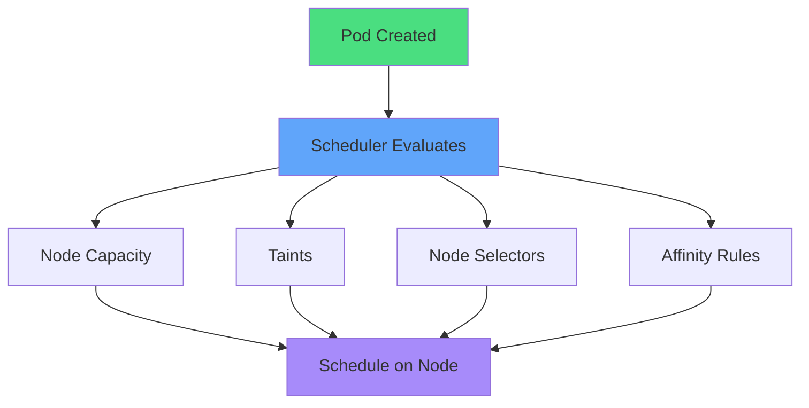
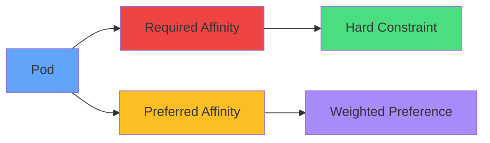
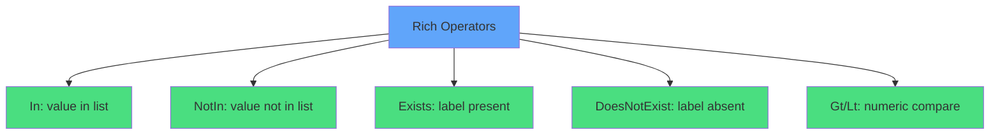
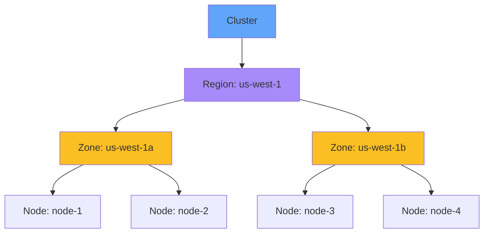
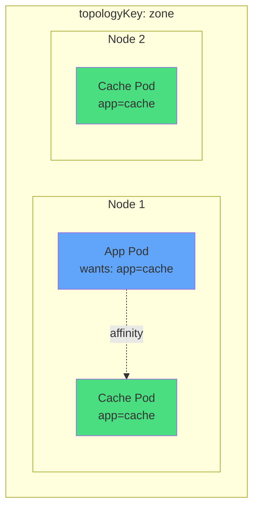
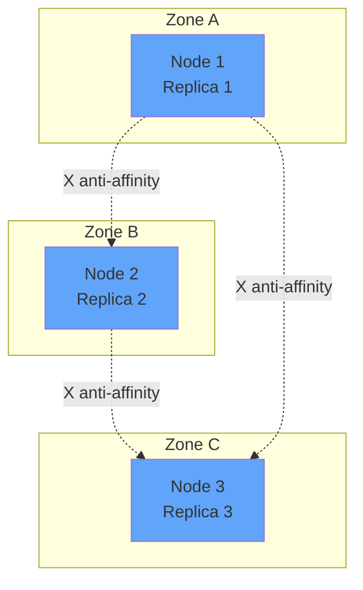
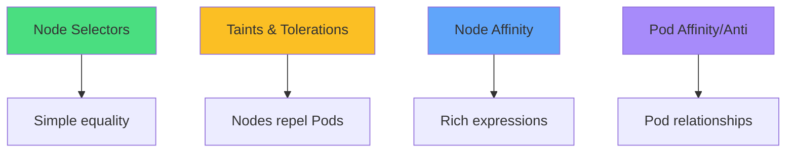
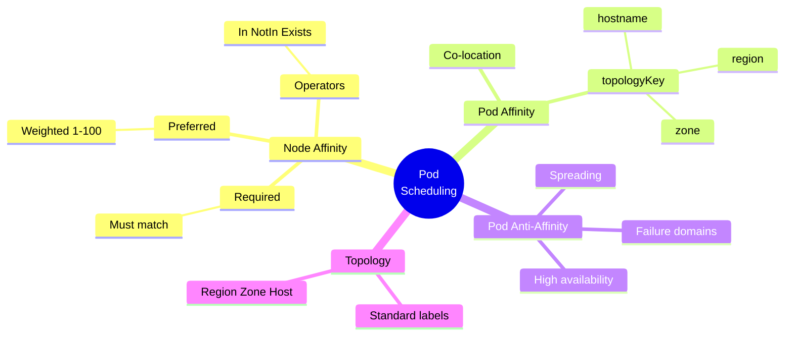

# Pod Scheduling with Affinity

<div class="abs-br m-6 flex gap-2">
  <carbon-network-3 class="text-6xl text-blue-400" />
</div>

<!--
METADATA:
sentence: We'll cover three main topics: Node affinity - controlling Pod placement based on node characteristics, Pod affinity - placing Pods near other Pods, and Pod anti-affinity - spreading Pods across your infrastructure.
search_anchor: controlling Pod placement based on node characteristics
-->
<div v-click class="mt-8 text-xl opacity-80">
Advanced control over Pod placement
</div>

<!--
METADATA:
sentence: We'll cover three main topics: Node affinity - controlling Pod placement based on node characteristics, Pod affinity - placing Pods near other Pods, and Pod anti-affinity - spreading Pods across your infrastructure.
search_anchor: Node affinity, Pod affinity, and anti-affinity
-->
<div v-click class="mt-4 text-lg opacity-60">
Node affinity, Pod affinity, and anti-affinity
</div>

---
layout: center
---

# Why Pod Placement Matters

<div class="grid grid-cols-2 gap-6 mt-8">
<!--
METADATA:
sentence: First, **performance optimization**. You might want to place database Pods on nodes with fast SSD storage, or machine learning workloads on nodes with GPU accelerators.
search_anchor: performance optimization
-->
<div v-click="1">
<carbon-dashboard class="text-5xl text-blue-400 mb-3" />
<div class="font-semibold text-lg">Performance Optimization</div>
<div class="text-sm opacity-80">GPU nodes, SSD storage<br/>ML workloads, databases</div>
</div>

<!--
METADATA:
sentence: Second, **high availability**. By spreading replicas across different failure zones, you ensure your application survives infrastructure failures.
search_anchor: high availability
-->
<div v-click="2">
<carbon-network-overlay class="text-5xl text-green-400 mb-3" />
<div class="font-semibold text-lg">High Availability</div>
<div class="text-sm opacity-80">Spread replicas<br/>Survive infrastructure failures</div>
</div>

<!--
METADATA:
sentence: Third, **co-location for efficiency**. Sometimes you want related Pods close together - like placing a cache Pod on the same node as the application using it, reducing network latency.
search_anchor: co-location for efficiency
-->
<div v-click="3">
<carbon-location class="text-5xl text-purple-400 mb-3" />
<div class="font-semibold text-lg">Co-location Efficiency</div>
<div class="text-sm opacity-80">Cache near application<br/>Reduce network latency</div>
</div>

<!--
METADATA:
sentence: Finally, **isolation and compliance**. You might need to separate sensitive workloads onto dedicated nodes for security or compliance reasons.
search_anchor: isolation and compliance
-->
<div v-click="4">
<carbon-security class="text-5xl text-red-400 mb-3" />
<div class="font-semibold text-lg">Isolation & Compliance</div>
<div class="text-sm opacity-80">Dedicated nodes<br/>Security requirements</div>
</div>
</div>

---
layout: center
---

# Scheduling Basics Recap

<!--
METADATA:
sentence: Let's quickly review how Kubernetes schedules Pods. When you create a Pod, the Kubernetes scheduler determines which node should run it.
search_anchor: Kubernetes scheduler determines which node
-->
<div v-click="1">



</div>

<!--
METADATA:
sentence: Node capacity - does the node have enough CPU and memory?
search_anchor: does the node have enough CPU and memory
-->
<div v-click="2" class="mt-6 text-center">
<carbon-dashboard class="inline-block text-3xl text-blue-400" /> Does node have capacity?
</div>

<!--
METADATA:
sentence: Node taints - does the Pod tolerate any node taints?
search_anchor: does the Pod tolerate any node taints
-->
<div v-click="3" class="text-center mt-2">
<carbon-close class="inline-block text-3xl text-red-400" /> Does Pod tolerate taints?
</div>

<!--
METADATA:
sentence: Node selectors - do the node's labels match what the Pod requires?
search_anchor: do the node's labels match
-->
<div v-click="4" class="text-center mt-2">
<carbon-tag class="inline-block text-3xl text-green-400" /> Do node labels match selectors?
</div>

<!--
METADATA:
sentence: Affinity rules - what are the Pod's placement preferences?
search_anchor: what are the Pod's placement preferences
-->
<div v-click="5" class="text-center mt-2">
<carbon-rule class="inline-block text-3xl text-purple-400" /> Do affinity rules match?
</div>

---
layout: center
---

# Node Affinity Overview

<!--
METADATA:
sentence: Node affinity is like node selectors on steroids. It allows you to specify rules about where Pods should run based on node labels, but with much more expressive power.
search_anchor: node selectors on steroids
-->
<div v-click="1" class="text-center mb-6">
Node selectors on steroids
</div>

<!--
METADATA:
sentence: There are two types of node affinity: Required affinity - hard constraints that must be met, and Preferred affinity - soft preferences that the scheduler tries to honor.
search_anchor: two types of node affinity
-->
<div v-click="2">



</div>

<div class="grid grid-cols-2 gap-6 mt-8">
<!--
METADATA:
sentence: Required affinity - hard constraints that must be met.
search_anchor: hard constraints that must be met
-->
<div v-click="3">
<carbon-locked class="text-4xl text-red-400 mb-2" />
<div class="font-semibold">Required</div>
<div class="text-sm opacity-80">Must be met</div>
</div>
<!--
METADATA:
sentence: Preferred affinity - soft preferences that the scheduler tries to honor.
search_anchor: soft preferences that the scheduler tries to honor
-->
<div v-click="4">
<carbon-star class="text-4xl text-yellow-400 mb-2" />
<div class="font-semibold">Preferred</div>
<div class="text-sm opacity-80">Try to honor</div>
</div>
</div>

<!--
METADATA:
sentence: The key part is "IgnoredDuringExecution" - this means if a node's labels change after a Pod is running, the Pod won't be evicted. The rules only apply during initial scheduling.
search_anchor: IgnoredDuringExecution
-->
<div v-click="5" class="mt-6 text-center text-sm opacity-60">
*DuringSchedulingIgnoredDuringExecution = rules only apply at scheduling
</div>

---
layout: center
---

# Required vs Preferred Affinity

<!--
METADATA:
sentence: Let's understand the difference between required and preferred affinity with an example.
search_anchor: difference between required and preferred affinity
-->
<div v-click="1" class="mb-4">

```yaml
nodeAffinity:
  requiredDuringSchedulingIgnoredDuringExecution:
    - matchExpressions:
      - key: kubernetes.io/os
        operator: In
        values: [linux]
  preferredDuringSchedulingIgnoredDuringExecution:
    - weight: 80
      preference:
        - key: disktype
          operator: In
          values: [ssd]
```

</div>

<!--
METADATA:
sentence: Imagine you're deploying a data processing application. You **require** it to run on Linux nodes - that's non-negotiable. So you use required affinity with the kubernetes.io/os label set to linux.
search_anchor: require it to run on Linux nodes
-->
<div v-click="2" class="text-center mb-4">
<carbon-locked class="inline-block text-4xl text-red-400" /> Required: Must run on Linux
</div>

<!--
METADATA:
sentence: But you also **prefer** nodes with SSD storage for better performance. This isn't mandatory - if no SSD nodes are available, regular disk is acceptable. So you use preferred affinity with a weight of 80 for nodes labeled disktype equals ssd.
search_anchor: prefer nodes with SSD storage
-->
<div v-click="3" class="text-center mb-4">
<carbon-star class="inline-block text-4xl text-yellow-400" /> Preferred: Would like SSD (weight 80)
</div>

<!--
METADATA:
sentence: The scheduler will first filter nodes matching the required rules, then among those, it will prefer nodes matching your preferences.
search_anchor: filter nodes matching the required rules
-->
<div v-click="4" class="mt-6 text-center text-lg">
Filter by required → Score by preferred
</div>

---
layout: center
---

# Affinity Operators

<!--
METADATA:
sentence: Node affinity supports several powerful operators that make your rules expressive.
search_anchor: several powerful operators
-->
<div v-click="1">



</div>

<div class="mt-6">
<!--
METADATA:
sentence: The **In** operator checks if a label value is in a list. For example, zone In [us-west-1a, us-west-1b] matches nodes in either zone.
search_anchor: In operator checks if a label value is in a list
-->
<div v-click="2" class="mb-3">
<carbon-checkmark class="inline-block text-2xl text-green-400" /> zone <strong>In</strong> [us-west-1a, us-west-1b]
</div>
<!--
METADATA:
sentence: The **NotIn** operator is the inverse - disktype NotIn [hdd] excludes nodes with hard disk drives.
search_anchor: NotIn operator is the inverse
-->
<div v-click="3" class="mb-3">
<carbon-close class="inline-block text-2xl text-red-400" /> disktype <strong>NotIn</strong> [hdd]
</div>
<!--
METADATA:
sentence: The **Exists** operator checks for label presence regardless of value - gpu Exists matches any node with a gpu label.
search_anchor: Exists operator checks for label presence
-->
<div v-click="4" class="mb-3">
<carbon-tag class="inline-block text-2xl text-blue-400" /> gpu <strong>Exists</strong>
</div>
<!--
METADATA:
sentence: The **DoesNotExist** operator checks for label absence - spot DoesNotExist ensures your Pod avoids spot instances.
search_anchor: DoesNotExist operator checks for label absence
-->
<div v-click="5" class="mb-3">
<carbon-subtract class="inline-block text-2xl text-yellow-400" /> spot <strong>DoesNotExist</strong>
</div>
</div>

<!--
METADATA:
sentence: You can combine multiple expressions with AND logic within a match term, or provide multiple terms with OR logic.
search_anchor: combine multiple expressions
-->
<div v-click="6" class="mt-6 text-center text-sm opacity-80">
Multiple expressions = AND | Multiple terms = OR
</div>

---
layout: center
---

# Node Topology & Standard Labels

<!--
METADATA:
sentence: Kubernetes clusters have a concept called topology - the physical or logical layout of your infrastructure.
search_anchor: concept called topology
-->
<div v-click="1">



</div>

<div class="grid grid-cols-3 gap-4 mt-8 text-sm">
<!--
METADATA:
sentence: There's also a **region** label - topology.kubernetes.io/region - identifying the broader geographic region.
search_anchor: region label
-->
<div v-click="2" class="text-center">
<carbon-location class="text-3xl text-purple-400 mb-2" />
<div class="font-semibold">Region</div>
<div class="text-xs opacity-80">topology.kubernetes.io/region</div>
</div>
<!--
METADATA:
sentence: Cloud providers typically add **zone** labels - topology.kubernetes.io/zone - identifying which availability zone the node is in.
search_anchor: zone labels
-->
<div v-click="3" class="text-center">
<carbon-grid class="text-3xl text-yellow-400 mb-2" />
<div class="font-semibold">Zone</div>
<div class="text-xs opacity-80">topology.kubernetes.io/zone</div>
</div>
<!--
METADATA:
sentence: Every node gets a **hostname** label - kubernetes.io/hostname - which uniquely identifies that specific machine.
search_anchor: hostname label
-->
<div v-click="4" class="text-center">
<carbon-virtual-machine class="text-3xl text-blue-400 mb-2" />
<div class="font-semibold">Hostname</div>
<div class="text-xs opacity-80">kubernetes.io/hostname</div>
</div>
</div>

<!--
METADATA:
sentence: Zones are failure domains within a region - each has independent power and networking.
search_anchor: Zones are failure domains
-->
<div v-click="5" class="mt-6 text-center text-lg">
Zones = independent failure domains
</div>

---
layout: center
---

# Pod Affinity Introduction

<!--
METADATA:
sentence: Now let's shift from node affinity to Pod affinity. While node affinity controls placement based on node characteristics, Pod affinity controls placement based on what other Pods are already running.
search_anchor: Pod affinity controls placement based on what other Pods
-->
<div v-click="1" class="text-center mb-6">
Placement based on <strong>other Pods</strong>, not nodes
</div>

<!--
METADATA:
sentence: Pod affinity lets you say: "schedule my Pod on nodes where Pods matching these labels are running." This is perfect for co-location scenarios.
search_anchor: schedule my Pod on nodes where Pods matching these labels
-->
<div v-click="2">



</div>

<!--
METADATA:
sentence: The key concept here is the **topology key**. This specifies the scope of "near."
search_anchor: topology key
-->
<div v-click="3" class="mt-6 text-center">
<carbon-location class="inline-block text-3xl text-green-400" /> topologyKey defines "near"
</div>

<!--
METADATA:
sentence: When you use topology key kubernetes.io/hostname, you're saying "on the same physical host." When you use topology.kubernetes.io/zone, you're saying "in the same availability zone, but not necessarily the same host."
search_anchor: on the same physical host
-->
<div v-click="4" class="text-center mt-2">
hostname = same node | zone = same zone
</div>

---
layout: center
---

# Pod Anti-Affinity for HA

<!--
METADATA:
sentence: Pod anti-affinity is the inverse of Pod affinity - it's used to keep Pods away from each other.
search_anchor: Pod anti-affinity is the inverse
-->
<div v-click="1" class="text-center mb-6">
Keep Pods <strong>away</strong> from each other
</div>

<!--
METADATA:
sentence: Consider a web application with three replicas. If all three Pods end up on the same node, a single node failure takes down your entire application.
search_anchor: three replicas
-->
<div v-click="2">



</div>

<!--
METADATA:
sentence: By specifying required anti-affinity with topology key kubernetes.io/hostname, you tell Kubernetes: "don't schedule two Pods with the same app label on the same host." This ensures each replica runs on a different node.
search_anchor: don't schedule two Pods with the same app label
-->
<div v-click="3" class="mt-6 text-center">
<carbon-checkmark class="inline-block text-3xl text-green-400" /> Spreads replicas across nodes/zones
</div>

<!--
METADATA:
sentence: You can also use zone-level anti-affinity to spread across availability zones for even better resilience.
search_anchor: zone-level anti-affinity
-->
<div v-click="4" class="text-center mt-2">
<carbon-network-overlay class="inline-block text-2xl text-blue-400" /> Single node failure doesn't kill app
</div>

<!--
METADATA:
sentence: A common pattern is combining required affinity at the region level with preferred anti-affinity at the zone level: "must be in the same region, but prefer spreading across zones."
search_anchor: must be in the same region
-->
<div v-click="5" class="mt-4 text-center text-sm opacity-80">
Combine: required at region + preferred at zone
</div>

---
layout: center
---

# Practical Use Cases

<div class="grid grid-cols-2 gap-6 mt-6">
<!--
METADATA:
sentence: **High availability deployments**: Use Pod anti-affinity to spread replicas across nodes or zones, ensuring your application survives infrastructure failures.
search_anchor: High availability deployments
-->
<div v-click="1">
<carbon-network-overlay class="text-4xl text-green-400 mb-2" />
<div class="font-semibold">HA Deployments</div>
<div class="text-sm opacity-80">Anti-affinity across zones</div>
</div>

<!--
METADATA:
sentence: **Performance optimization**: Use Pod affinity to co-locate a web frontend with its Redis cache on the same node, reducing network latency to microseconds.
search_anchor: Performance optimization
-->
<div v-click="2">
<carbon-lightning class="text-4xl text-yellow-400 mb-2" />
<div class="font-semibold">Performance</div>
<div class="text-sm opacity-80">Co-locate app with cache</div>
</div>

<!--
METADATA:
sentence: **Resource specialization**: Use node affinity to place GPU-intensive workloads on GPU-equipped nodes, or database Pods on high-IOPS storage nodes.
search_anchor: Resource specialization
-->
<div v-click="3">
<carbon-chip class="text-4xl text-purple-400 mb-2" />
<div class="font-semibold">Resource Specialization</div>
<div class="text-sm opacity-80">GPU nodes, high-IOPS storage</div>
</div>

<!--
METADATA:
sentence: **Avoiding noisy neighbors**: Use Pod anti-affinity to keep latency-sensitive applications away from batch processing jobs that consume lots of resources.
search_anchor: Avoiding noisy neighbors
-->
<div v-click="4">
<carbon-close class="text-4xl text-red-400 mb-2" />
<div class="font-semibold">Avoid Noisy Neighbors</div>
<div class="text-sm opacity-80">Separate latency-sensitive apps</div>
</div>

<!--
METADATA:
sentence: **Compliance and security**: Use node affinity to ensure sensitive workloads only run on nodes in specific compliance zones or security groups.
search_anchor: Compliance and security
-->
<div v-click="5">
<carbon-security class="text-4xl text-blue-400 mb-2" />
<div class="font-semibold">Compliance & Security</div>
<div class="text-sm opacity-80">Dedicated compliance zones</div>
</div>

<!--
METADATA:
sentence: **Multi-tenancy**: Use a combination of affinity rules and taints to dedicate certain nodes to specific teams or projects.
search_anchor: Multi-tenancy
-->
<div v-click="6">
<carbon-user-multiple class="text-4xl text-orange-400 mb-2" />
<div class="font-semibold">Multi-tenancy</div>
<div class="text-sm opacity-80">Team-specific nodes</div>
</div>
</div>

---
layout: center
---

# Affinity vs Selectors vs Taints

<!--
METADATA:
sentence: You might be wondering: when should I use affinity, node selectors, or taints and tolerations? Let's compare these mechanisms.
search_anchor: when should I use affinity
-->
<div v-click="1">



</div>

<div class="mt-8">
<!--
METADATA:
sentence: **Node selectors** are the simplest - just a map of label requirements. Use them for straightforward cases like "only run on Linux nodes." However, they only support equality checks and can't express preferences.
search_anchor: Node selectors are the simplest
-->
<div v-click="2" class="mb-3">
<carbon-tag class="inline-block text-2xl text-green-400" /> <strong>Node Selectors:</strong> Simple, equality only
</div>
<!--
METADATA:
sentence: **Taints and tolerations** work in the opposite direction - nodes repel Pods unless the Pod tolerates the taint.
search_anchor: Taints and tolerations work in the opposite direction
-->
<div v-click="3" class="mb-3">
<carbon-close class="inline-block text-2xl text-yellow-400" /> <strong>Taints:</strong> Nodes repel, Pods tolerate
</div>
<!--
METADATA:
sentence: **Node affinity** is more powerful than node selectors, supporting complex expressions, multiple operators, and preferences with weights.
search_anchor: Node affinity is more powerful
-->
<div v-click="4" class="mb-3">
<carbon-rule class="inline-block text-2xl text-blue-400" /> <strong>Node Affinity:</strong> Flexible with preferences
</div>
<!--
METADATA:
sentence: **Pod affinity and anti-affinity** are about relationships between Pods. Use them when your scheduling decisions depend on what's already running in the cluster.
search_anchor: Pod affinity and anti-affinity are about relationships
-->
<div v-click="5" class="mb-3">
<carbon-network-3 class="inline-block text-2xl text-purple-400" /> <strong>Pod Affinity:</strong> Based on other Pods
</div>
</div>

<!--
METADATA:
sentence: Often, you'll combine these mechanisms. For example, a Pod might have node affinity for Linux nodes, a toleration for the dedicated equals database taint, and Pod anti-affinity to spread across zones.
search_anchor: Often, you'll combine these mechanisms
-->
<div v-click="6" class="mt-6 text-center text-lg">
<carbon-idea class="inline-block text-3xl text-yellow-400" /> Often combined together!
</div>

---
layout: center
---

# Summary

<!--
METADATA:
sentence: Let's summarize what we've covered about Pod scheduling with affinity.
search_anchor: Let's summarize
-->
<div v-click="1">



</div>

---
layout: center
---

# Key Takeaways

<div class="grid grid-cols-2 gap-6 mt-6">
<!--
METADATA:
sentence: **Node affinity** allows expressive control over which nodes run your Pods, supporting both hard requirements and weighted preferences.
search_anchor: Node affinity allows expressive control
-->
<div v-click="1">
<carbon-rule class="text-4xl text-blue-400 mb-2" />
<div class="font-semibold">Node Affinity</div>
<div class="text-sm opacity-80">Expressive control, required + preferred</div>
</div>

<!--
METADATA:
sentence: **Pod affinity** enables co-location strategies, placing related Pods near each other based on topology.
search_anchor: Pod affinity enables co-location strategies
-->
<div v-click="2">
<carbon-network-3 class="text-4xl text-green-400 mb-2" />
<div class="font-semibold">Pod Affinity</div>
<div class="text-sm opacity-80">Co-location based on topology</div>
</div>

<!--
METADATA:
sentence: **Pod anti-affinity** enables spreading strategies, keeping replicas separated for high availability and resilience.
search_anchor: Pod anti-affinity enables spreading strategies
-->
<div v-click="3">
<carbon-arrows-horizontal class="text-4xl text-red-400 mb-2" />
<div class="font-semibold">Pod Anti-Affinity</div>
<div class="text-sm opacity-80">Spreading for resilience</div>
</div>

<!--
METADATA:
sentence: The **topology key** defines the scope of "near" or "far" - hostname for same-node, zone for same-availability-zone, region for same-geographic-region.
search_anchor: topology key defines the scope
-->
<div v-click="4">
<carbon-location class="text-4xl text-purple-400 mb-2" />
<div class="font-semibold">Topology Key</div>
<div class="text-sm opacity-80">Defines scope of near/far</div>
</div>

<!--
METADATA:
sentence: **Required affinity** creates hard constraints that must be met - Pods stay Pending if constraints can't be satisfied.
search_anchor: Required affinity creates hard constraints
-->
<div v-click="5">
<carbon-locked class="text-4xl text-yellow-400 mb-2" />
<div class="font-semibold">Required</div>
<div class="text-sm opacity-80">Hard constraints, Pending if not met</div>
</div>

<!--
METADATA:
sentence: **Preferred affinity** uses weighted preferences - the scheduler tries to honor them but will schedule anyway if it can't.
search_anchor: Preferred affinity uses weighted preferences
-->
<div v-click="6">
<carbon-star class="text-4xl text-orange-400 mb-2" />
<div class="font-semibold">Preferred</div>
<div class="text-sm opacity-80">Best effort with weights</div>
</div>
</div>

<!--
METADATA:
sentence: In practice, you'll often combine multiple affinity types to express sophisticated placement strategies like "must be in the same region, prefer spreading across zones, prefer co-location with cache, and prefer nodes with SSDs."
search_anchor: combine multiple affinity types
-->
<div v-click="7" class="mt-8 text-center text-lg">
Next: Hands-on affinity practice <carbon-arrow-right class="inline-block text-2xl" />
</div>
