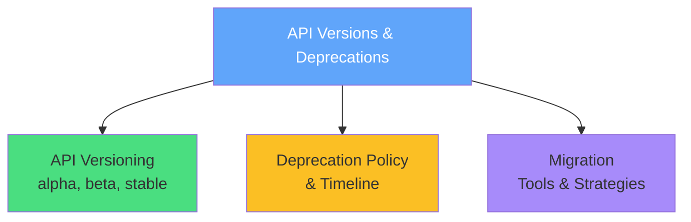
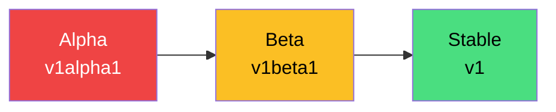
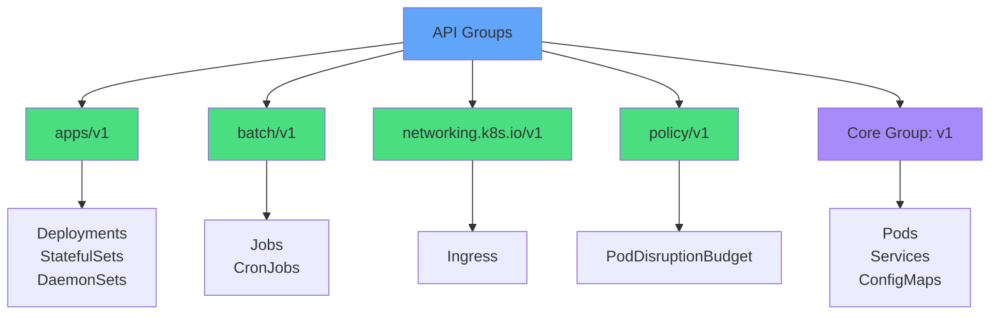
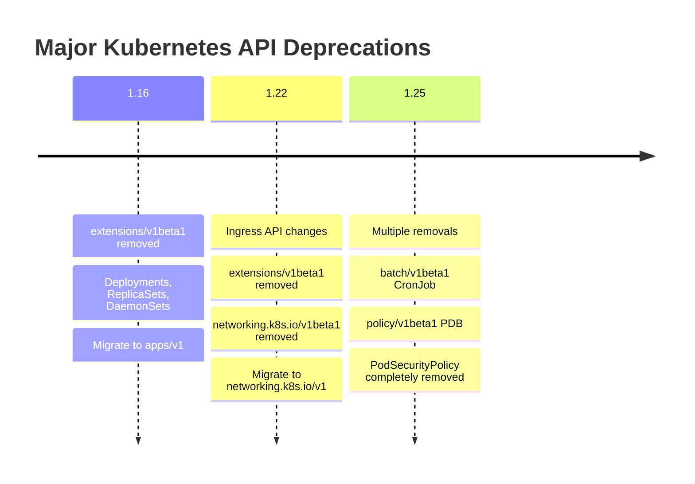
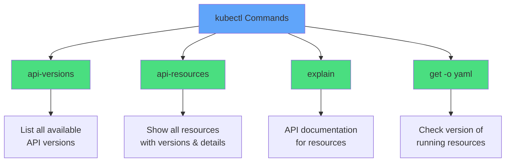
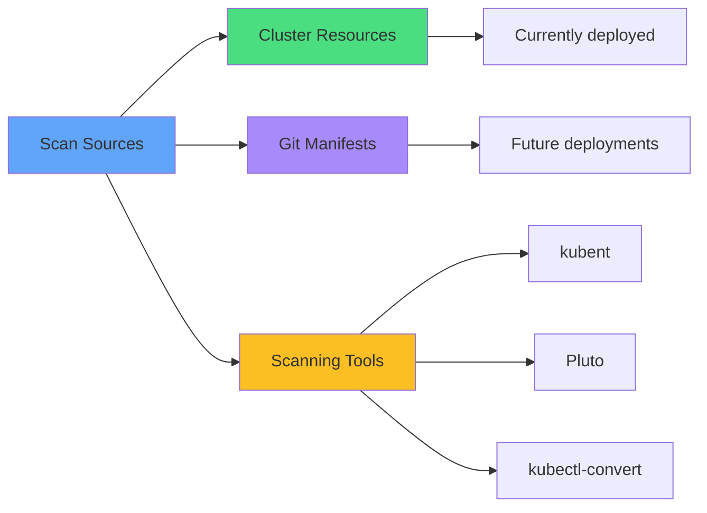
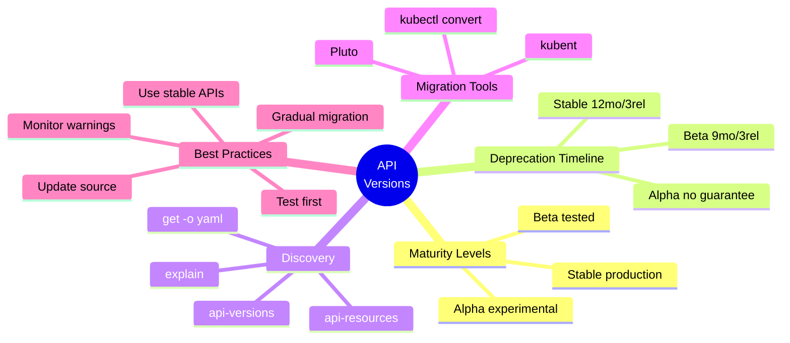
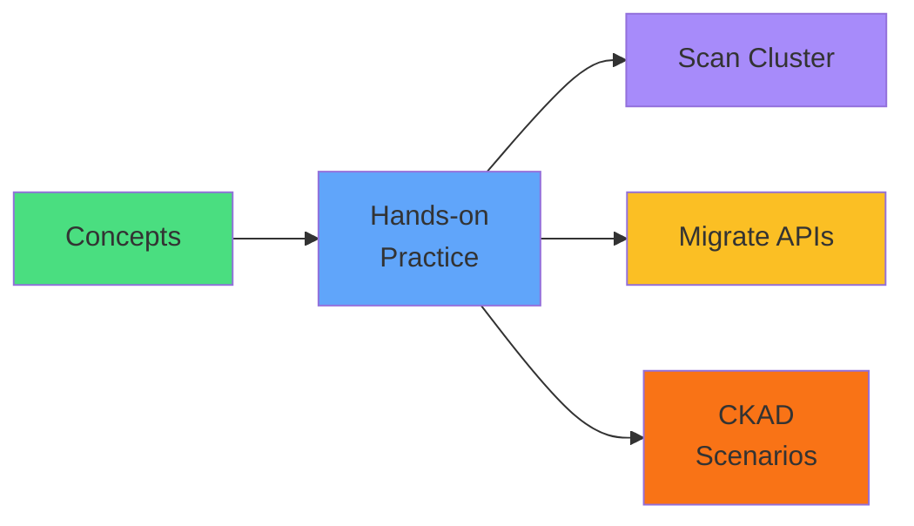

# API Versions & Deprecations

<div class="abs-br m-6 flex gap-2">
  <carbon-api class="text-6xl text-blue-400" />
</div>

<!--
METADATA:
sentence: This is a critical topic for the CKAD exam and real-world Kubernetes operations.
search_anchor: critical topic for the CKAD exam
-->
<div v-click class="mt-8 text-xl opacity-80">
Critical topic for CKAD exam and real-world operations
</div>

---
layout: center
---

# Session Overview

<!--
METADATA:
sentence: In this slideshow, we'll cover three main areas: How Kubernetes API versioning works - alpha, beta, and stable; The deprecation policy and timeline; and How to identify and migrate deprecated APIs.
search_anchor: we'll cover three main areas
-->
<div v-click="1">



</div>

<!--
METADATA:
sentence: This knowledge will help you avoid breaking deployments during cluster upgrades and ensure your manifests remain compatible with newer Kubernetes versions.
search_anchor: avoid breaking deployments during cluster upgrades
-->
<div v-click="2" class="mt-8 text-center text-lg opacity-80">
<carbon-document class="inline-block text-3xl text-blue-400" /> Avoid breaking deployments during upgrades
</div>

<!--
METADATA:
sentence: This knowledge will help you avoid breaking deployments during cluster upgrades and ensure your manifests remain compatible with newer Kubernetes versions.
search_anchor: manifests remain compatible with newer Kubernetes versions
-->
<div v-click="3" class="text-center text-lg opacity-80">
<carbon-checkmark class="inline-block text-3xl text-green-400" /> Ensure manifest compatibility across versions
</div>

---
layout: center
---

# Why API Versioning Matters

<!--
METADATA:
sentence: First, cluster upgrades can break applications. If your manifests use deprecated APIs that have been removed in the new cluster version, your deployments will fail.
search_anchor: cluster upgrades can break applications
-->
<div v-click="1" class="mb-4">
<carbon-warning class="text-5xl text-red-400 mb-2" />
<strong>Cluster Upgrades Can Break Applications</strong>
</div>

<!--
METADATA:
sentence: If your manifests use deprecated APIs that have been removed in the new cluster version, your deployments will fail. This is a common problem in production environments.
search_anchor: deprecated APIs removed in new versions
-->
<div v-click="2" class="text-center text-sm opacity-80 mb-4">
Deprecated APIs removed in new versions cause deployment failures
</div>

<!--
METADATA:
sentence: Second, CKAD exam compatibility. The exam may test your ability to identify deprecated APIs and migrate resources to current versions.
search_anchor: CKAD exam compatibility
-->
<div v-click="3" class="mb-4">
<carbon-certificate class="text-5xl text-blue-400 mb-2" />
<strong>CKAD Exam Compatibility</strong>
</div>

<!--
METADATA:
sentence: The exam may test your ability to identify deprecated APIs and migrate resources to current versions. You need to know the tools and commands.
search_anchor: identify deprecated APIs and migrate resources
-->
<div v-click="4" class="text-center text-sm opacity-80 mb-4">
Identify deprecated APIs and migrate resources to current versions
</div>

<!--
METADATA:
sentence: Third, best practices. Using stable APIs instead of beta or alpha versions ensures your applications are production-ready and won't break unexpectedly.
search_anchor: best practices
-->
<div v-click="5" class="mb-4">
<carbon-checkmark class="text-5xl text-green-400 mb-2" />
<strong>Best Practices</strong>
</div>

<!--
METADATA:
sentence: Using stable APIs instead of beta or alpha versions ensures your applications are production-ready and won't break unexpectedly.
search_anchor: stable APIs ensure production-ready applications
-->
<div v-click="6" class="text-center text-sm opacity-80 mb-4">
Stable APIs ensure production-ready applications
</div>

<!--
METADATA:
sentence: Finally, troubleshooting. When you see errors like "no matches for kind Ingress in version networking.k8s.io/v1beta1," you need to quickly identify this as a deprecation issue and know how to fix it.
search_anchor: troubleshooting
-->
<div v-click="7" class="mb-4">
<carbon-debug class="text-5xl text-purple-400 mb-2" />
<strong>Troubleshooting</strong>
</div>

<!--
METADATA:
sentence: When you see errors like "no matches for kind Ingress in version networking.k8s.io/v1beta1," you need to quickly identify this as a deprecation issue and know how to fix it.
search_anchor: no matches for kind Ingress in version
-->
<div v-click="8" class="text-center text-sm opacity-80">
Fix "no matches for kind Ingress in version networking.k8s.io/v1beta1" errors
</div>

---
layout: center
---

# API Maturity Levels

<!--
METADATA:
sentence: Kubernetes APIs go through three maturity levels: alpha, beta, and stable.
search_anchor: three maturity levels
-->
<div v-click="1">



</div>

<div class="grid grid-cols-3 gap-6 mt-8 text-sm">
<!--
METADATA:
sentence: Alpha APIs have version names like v1alpha1 or v1alpha2.
search_anchor: Alpha APIs have version names
-->
<div v-click="2">
<carbon-close class="text-5xl text-red-400 mb-2" />
<strong>Alpha APIs</strong>
</div>
<!--
METADATA:
sentence: These are experimental features that may be buggy or incomplete.
search_anchor: experimental features that may be buggy
-->
<div v-click="3">
<span class="text-xs opacity-80">v1alpha1, v1alpha2</span><br/>
<span class="text-xs opacity-60">Experimental, may be buggy</span>
</div>
<!--
METADATA:
sentence: They can be removed at any time without notice. Alpha APIs are disabled by default in most clusters and should never be used in production.
search_anchor: disabled by default and should never be used in production
-->
<div v-click="4">
<span class="text-xs text-red-400">Disabled by default</span><br/>
<span class="text-xs text-red-400">Can be removed anytime</span><br/>
<span class="text-xs text-red-400">Never use in production</span>
</div>

<!--
METADATA:
sentence: Beta APIs have version names like v1beta1 or v1beta2.
search_anchor: Beta APIs have version names
-->
<div v-click="5">
<carbon-warning class="text-5xl text-yellow-400 mb-2" />
<strong>Beta APIs</strong>
</div>
<!--
METADATA:
sentence: These are well-tested features considered safe for use, but details may still change.
search_anchor: well-tested features considered safe for use
-->
<div v-click="6">
<span class="text-xs opacity-80">v1beta1, v1beta2</span><br/>
<span class="text-xs opacity-60">Well-tested, safe for use</span>
</div>
<!--
METADATA:
sentence: Beta APIs are enabled by default. Kubernetes guarantees support for at least one release after deprecation. You can use beta APIs in production with caution, but plan to migrate to stable versions.
search_anchor: enabled by default and use with caution in production
-->
<div v-click="7">
<span class="text-xs text-yellow-600">Enabled by default</span><br/>
<span class="text-xs text-yellow-600">Supported for 1+ release</span><br/>
<span class="text-xs text-yellow-600">Use with caution in prod</span>
</div>

<!--
METADATA:
sentence: Stable APIs have version names like v1 or v2.
search_anchor: Stable APIs have version names
-->
<div v-click="8">
<carbon-checkmark class="text-5xl text-green-400 mb-2" />
<strong>Stable APIs</strong>
</div>
<!--
METADATA:
sentence: These are production-ready, widely adopted, and will be supported for many releases.
search_anchor: production-ready, widely adopted
-->
<div v-click="9">
<span class="text-xs opacity-80">v1, v2</span><br/>
<span class="text-xs opacity-60">Production-ready</span>
</div>
<!--
METADATA:
sentence: Stable APIs are the recommended choice for all production workloads. Once an API reaches stable status, it follows a strict deprecation policy before any removal.
search_anchor: recommended choice for all production workloads
-->
<div v-click="10">
<span class="text-xs text-green-600">Widely adopted</span><br/>
<span class="text-xs text-green-600">Long-term support</span><br/>
<span class="text-xs text-green-600">Recommended for all workloads</span>
</div>
</div>

---
layout: center
---

# API Groups and Versions

<!--
METADATA:
sentence: Kubernetes organizes APIs into groups to manage related resources together. Understanding the structure helps you read manifests and troubleshoot issues. The apiVersion field in YAML has the format group slash version.
search_anchor: apiVersion field in YAML has the format group slash version
-->
<div v-click="1" class="mb-4">
<carbon-api class="inline-block text-4xl text-blue-400" />
<strong class="ml-2">apiVersion Format: group/version</strong>
</div>

<!--
METADATA:
sentence: For example, apps/v1 means the apps group, version 1. Some examples: apps/v1 for Deployments, StatefulSets, DaemonSets; batch/v1 for Jobs and CronJobs; networking.k8s.io/v1 for Ingress; and policy/v1 for PodDisruptionBudget.
search_anchor: apps/v1 means the apps group, version 1
-->
<div v-click="2">



</div>

<!--
METADATA:
sentence: The core group is special - it has no group name in the apiVersion field. You just see v1 for Pods, Services, ConfigMaps, and other core resources.
search_anchor: core group is special
-->
<div v-click="3" class="mt-6 text-center text-sm opacity-80">
<carbon-document class="inline-block text-2xl text-blue-400" /> Core group is special - no group name, just v1
</div>

<!--
METADATA:
sentence: Cloud providers and third-party tools can add custom API groups. For example, cert-manager.io/v1 for certificate management resources.
search_anchor: Cloud providers and third-party tools can add custom API groups
-->
<div v-click="4" class="text-center text-sm opacity-80">
<carbon-plugin class="inline-block text-2xl text-purple-400" /> Cloud providers can add custom groups (e.g., cert-manager.io/v1)
</div>

---
layout: center
---

# Deprecation Policy and Timeline

<!--
METADATA:
sentence: Kubernetes follows a formal deprecation policy to give users time to migrate before APIs are removed.
search_anchor: formal deprecation policy
-->
<div v-click="1">


</div>

<div class="grid grid-cols-3 gap-6 mt-8">
<!--
METADATA:
sentence: For stable APIs (v1, v2, etc.), deprecated versions are supported for 12 months or 3 releases, whichever is longer.
search_anchor: stable APIs supported for 12 months or 3 releases
-->
<div v-click="2">
<carbon-checkmark class="text-5xl text-green-400 mb-2" />
<strong>Stable APIs</strong>
</div>
<!--
METADATA:
sentence: For stable APIs (v1, v2, etc.), deprecated versions are supported for 12 months or 3 releases, whichever is longer.
search_anchor: 12 months or 3 releases
-->
<div v-click="3">
<span class="text-sm">12 months or 3 releases</span><br/>
<span class="text-xs opacity-60">(whichever is longer)</span>
</div>
<!--
METADATA:
sentence: This gives you ample time to update your manifests.
search_anchor: ample time to update your manifests
-->
<div v-click="4">
<span class="text-sm text-green-600">Ample time to update manifests</span>
</div>

<!--
METADATA:
sentence: For beta APIs (v1beta1, v1beta2), the support window is 9 months or 3 releases.
search_anchor: beta APIs support window is 9 months or 3 releases
-->
<div v-click="5">
<carbon-warning class="text-5xl text-yellow-400 mb-2" />
<strong>Beta APIs</strong>
</div>
<!--
METADATA:
sentence: For beta APIs (v1beta1, v1beta2), the support window is 9 months or 3 releases.
search_anchor: 9 months or 3 releases
-->
<div v-click="6">
<span class="text-sm">9 months or 3 releases</span><br/>
<span class="text-xs opacity-60">(whichever is longer)</span>
</div>
<!--
METADATA:
sentence: This shorter timeline reflects that beta APIs are not considered fully stable.
search_anchor: shorter timeline reflects that beta APIs are not considered fully stable
-->
<div v-click="7">
<span class="text-sm text-yellow-600">Shorter timeline - not fully stable</span>
</div>

<!--
METADATA:
sentence: For alpha APIs (v1alpha1, v1alpha2), there's no guaranteed support timeline. They can be removed in any release.
search_anchor: alpha APIs no guaranteed support timeline
-->
<div v-click="8">
<carbon-close class="text-5xl text-red-400 mb-2" />
<strong>Alpha APIs</strong>
</div>
<!--
METADATA:
sentence: For alpha APIs (v1alpha1, v1alpha2), there's no guaranteed support timeline. They can be removed in any release.
search_anchor: can be removed in any release
-->
<div v-click="9">
<span class="text-sm">No guarantees</span><br/>
<span class="text-xs opacity-60">(removed in any release)</span>
</div>
<!--
METADATA:
sentence: This is why alpha APIs should never be used in production.
search_anchor: alpha APIs should never be used in production
-->
<div v-click="10">
<span class="text-sm text-red-400">Never use in production</span>
</div>
</div>

<!--
METADATA:
sentence: The key takeaway: always monitor release notes before upgrading your cluster, and proactively migrate away from deprecated APIs.
search_anchor: always monitor release notes before upgrading
-->
<div v-click="11" class="mt-8 text-center text-lg">
<carbon-idea class="inline-block text-3xl text-blue-400" /> Monitor release notes before cluster upgrades
</div>

<!--
METADATA:
sentence: When an API version is deprecated, Kubernetes announces it in release notes. The old version continues working during the deprecation window, giving you time to migrate.
search_anchor: old version continues working during the deprecation window
-->
<div v-click="12" class="text-center text-sm opacity-80">
Old version continues working during deprecation window
</div>

---
layout: center
---

# Common Deprecated APIs

<!--
METADATA:
sentence: Let's look at some historically significant API deprecations that affected many users. Understanding these helps you recognize deprecation patterns.
search_anchor: historically significant API deprecations
-->
<div v-click="1" class="text-center mb-4 text-lg">
<carbon-document class="inline-block text-3xl text-blue-400" /> Historical API Deprecations
</div>

<!--
METADATA:
sentence: Kubernetes 1.16 removed extensions/v1beta1 for Deployments, ReplicaSets, and DaemonSets. Users had to migrate to apps/v1.
search_anchor: Kubernetes 1.16 removed extensions/v1beta1
-->
<div v-click="2">



</div>

<!--
METADATA:
sentence: This was a major change that broke many clusters during upgrades.
search_anchor: broke many clusters during upgrades
-->
<div v-click="3" class="mt-6 text-center text-sm">
<carbon-warning class="inline-block text-2xl text-red-400" /> v1.16: extensions/v1beta1 → apps/v1 broke many clusters
</div>

<!--
METADATA:
sentence: Kubernetes 1.22 removed extensions/v1beta1 and networking.k8s.io/v1beta1 for Ingress. The stable networking.k8s.io/v1 became the only option. The v1 Ingress also changed its schema, requiring updates to pathType and other fields.
search_anchor: v1 Ingress changed its schema
-->
<div v-click="4" class="text-center text-sm">
<carbon-network-3 class="inline-block text-2xl text-yellow-400" /> v1.22: Ingress schema changed (pathType required)
</div>

<!--
METADATA:
sentence: Kubernetes 1.25 removed batch/v1beta1 for CronJob and policy/v1beta1 for PodDisruptionBudget. Users had to migrate to batch/v1 and policy/v1 respectively.
search_anchor: Kubernetes 1.25 removed batch/v1beta1
-->
<div v-click="5" class="text-center text-sm">
<carbon-timer class="inline-block text-2xl text-purple-400" /> v1.25: batch/v1beta1 → batch/v1 for CronJob
</div>

<!--
METADATA:
sentence: Kubernetes 1.25 also completely removed PodSecurityPolicy, replacing it with Pod Security Standards. This was a fundamental shift in security policy enforcement.
search_anchor: completely removed PodSecurityPolicy
-->
<div v-click="6" class="text-center text-sm">
<carbon-security class="inline-block text-2xl text-blue-400" /> v1.25: PSP → Pod Security Standards (fundamental shift)
</div>

<!--
METADATA:
sentence: These historical changes teach us an important lesson: major deprecations happen regularly, and you must stay current with your API versions.
search_anchor: major deprecations happen regularly
-->
<div v-click="7" class="mt-6 text-center text-lg text-yellow-400">
<carbon-idea class="inline-block text-2xl" /> Major deprecations happen regularly - stay current!
</div>

---
layout: center
---

# Discovering API Versions

<!--
METADATA:
sentence: How do you know which API versions your cluster supports? Kubectl provides several commands to discover this information.
search_anchor: which API versions your cluster supports
-->
<div v-click="1" class="text-center mb-4">
<carbon-terminal class="inline-block text-5xl text-blue-400" />
<strong class="text-xl">kubectl Discovery Commands</strong>
</div>

<!--
METADATA:
sentence: The kubectl api-versions command lists all API versions available in your cluster. You'll see entries like apps/v1, batch/v1, networking.k8s.io/v1.
search_anchor: kubectl api-versions command lists all API versions
-->
<div v-click="2">



</div>

<div class="grid grid-cols-2 gap-4 mt-6 text-sm">
<!--
METADATA:
sentence: The kubectl api-versions command lists all API versions available in your cluster.
search_anchor: kubectl api-versions
-->
<div v-click="3">
<carbon-list class="inline-block text-2xl text-green-400" /> <code>kubectl api-versions</code>
</div>
<!--
METADATA:
sentence: This shows what the cluster can accept.
search_anchor: shows what the cluster can accept
-->
<div v-click="4">
<span class="text-xs opacity-60">Shows what cluster can accept</span><br/>
<span class="text-xs opacity-60">e.g., apps/v1, batch/v1, networking.k8s.io/v1</span>
</div>

<!--
METADATA:
sentence: The kubectl api-resources command is even more useful. It shows every resource type, its API version, whether it's namespaced, and its short name.
search_anchor: kubectl api-resources command is even more useful
-->
<div v-click="5">
<carbon-document class="inline-block text-2xl text-blue-400" /> <code>kubectl api-resources</code>
</div>
<!--
METADATA:
sentence: For example, you'll see that deployments use apps/v1, are namespaced, and have the short name deploy.
search_anchor: deployments use apps/v1
-->
<div v-click="6">
<span class="text-xs opacity-60">Resource type, API version, namespaced, short name</span><br/>
<span class="text-xs opacity-60">grep to find specific resources</span>
</div>

<!--
METADATA:
sentence: To check what API version a running resource is using, use kubectl get with output YAML or JSON.
search_anchor: check what API version a running resource is using
-->
<div v-click="7">
<carbon-view class="inline-block text-2xl text-purple-400" /> <code>kubectl get deployment myapp -o yaml</code>
</div>
<!--
METADATA:
sentence: To check what API version a running resource is using, use kubectl get with output YAML or JSON.
search_anchor: kubectl get with output YAML
-->
<div v-click="8">
<span class="text-xs opacity-60">Check version of deployed resources</span><br/>
<span class="text-xs opacity-60">grep apiVersion for quick check</span>
</div>

<!--
METADATA:
sentence: For understanding the structure of an API, kubectl explain is invaluable.
search_anchor: kubectl explain is invaluable
-->
<div v-click="9">
<carbon-help class="inline-block text-2xl text-yellow-400" /> <code>kubectl explain ingress</code>
</div>
<!--
METADATA:
sentence: These commands are essential for CKAD exam success and day-to-day Kubernetes work.
search_anchor: essential for CKAD exam success
-->
<div v-click="10">
<span class="text-xs opacity-60">Show API structure and documentation</span><br/>
<span class="text-xs opacity-60">Essential for CKAD exam</span>
</div>
</div>

---
layout: center
---

# Identifying Deprecated APIs

<!--
METADATA:
sentence: Before upgrading a cluster, you need to identify which of your resources use deprecated APIs. Kubernetes provides warnings, and several tools can help.
search_anchor: identify which of your resources use deprecated APIs
-->
<div v-click="1" class="text-center mb-4">
<carbon-view class="inline-block text-5xl text-blue-400" />
<strong class="text-xl">Find Deprecated APIs Before Upgrading</strong>
</div>

<!--
METADATA:
sentence: When you kubectl apply a manifest with a deprecated API, kubectl shows a warning message.
search_anchor: kubectl apply shows a warning message
-->
<div v-click="2" class="mb-4">
<carbon-warning class="text-4xl text-yellow-400 mb-2" />
<strong>kubectl Warnings</strong>
</div>

<!--
METADATA:
sentence: For example: "Warning: extensions/v1beta1 Deployment is deprecated in v1.9+, unavailable in v1.16+". Pay attention to these warnings.
search_anchor: Pay attention to these warnings
-->
<div v-click="3" class="text-sm opacity-80 mb-4">
kubectl apply shows deprecation messages<br/>
"Warning: extensions/v1beta1 Deployment is deprecated in v1.9+, unavailable in v1.16+"
</div>

<!--
METADATA:
sentence: You can scan all resources in your cluster to find their API versions.
search_anchor: scan all resources in your cluster
-->
<div v-click="4">



</div>

<!--
METADATA:
sentence: You can scan all resources in your cluster to find their API versions.
search_anchor: kubectl get all --all-namespaces
-->
<div v-click="5" class="mt-6 text-center text-sm">
<carbon-search class="inline-block text-2xl text-green-400" /> <code>kubectl get all --all-namespaces -o json | grep apiVersion</code>
</div>

<!--
METADATA:
sentence: However, this only shows what's currently deployed. Your Git repository might have manifests using deprecated APIs that haven't been applied yet.
search_anchor: only shows what's currently deployed
-->
<div v-click="6" class="text-center text-sm opacity-80">
Shows deployed resources, but not undeployed manifests in Git
</div>

<div class="grid grid-cols-3 gap-4 mt-6 text-sm">
<!--
METADATA:
sentence: Several open-source tools help identify deprecated APIs: kubent (Kubernetes No Trouble) scans your cluster for deprecated APIs.
search_anchor: kubent scans your cluster
-->
<div v-click="7" class="text-center">
<carbon-tool-box class="text-3xl text-blue-400 mb-2" />
<strong>kubent</strong><br/>
<span class="text-xs opacity-60">Kubernetes No Trouble<br/>scans cluster</span>
</div>
<!--
METADATA:
sentence: Pluto detects deprecated API versions in files and Helm charts.
search_anchor: Pluto detects deprecated API versions
-->
<div v-click="8" class="text-center">
<carbon-document class="text-3xl text-purple-400 mb-2" />
<strong>Pluto</strong><br/>
<span class="text-xs opacity-60">Detects deprecated APIs<br/>in files & Helm charts</span>
</div>
<!--
METADATA:
sentence: kubectl-convert helps migrate manifests to newer versions.
search_anchor: kubectl-convert helps migrate manifests
-->
<div v-click="9" class="text-center">
<carbon-arrows-horizontal class="text-3xl text-green-400 mb-2" />
<strong>kubectl-convert</strong><br/>
<span class="text-xs opacity-60">Migrates manifests<br/>to newer versions</span>
</div>
</div>

<!--
METADATA:
sentence: The Kubernetes deprecation guide in the official documentation lists all deprecated APIs by version. Check this before any cluster upgrade.
search_anchor: Kubernetes deprecation guide
-->
<div v-click="10" class="mt-6 text-center text-lg text-blue-400">
<carbon-idea class="inline-block text-2xl" /> Check Kubernetes deprecation guide before upgrades
</div>

---
layout: center
---

# The kubectl convert Tool

<!--
METADATA:
sentence: The kubectl convert plugin helps you migrate YAML manifests to newer API versions. This tool is essential for managing API deprecations.
search_anchor: kubectl convert plugin helps you migrate YAML manifests
-->
<div v-click="1" class="text-center mb-4">
<carbon-arrows-horizontal class="inline-block text-5xl text-blue-400" />
<strong class="text-xl">Migrate YAML to Newer API Versions</strong>
</div>

<!--
METADATA:
sentence: kubectl convert is a separate plugin, not included in the standard kubectl binary. You need to install it separately using your package manager or by downloading from the Kubernetes release page.
search_anchor: kubectl convert is a separate plugin
-->
<div v-click="2" class="mb-4">

```yaml
# Old manifest (networking.k8s.io/v1beta1)
apiVersion: networking.k8s.io/v1beta1
kind: Ingress
metadata:
  name: my-ingress
```

</div>

<!--
METADATA:
sentence: The basic usage is: kubectl convert -f old-manifest.yaml --output-version apps/v1
search_anchor: basic usage is
-->
<div v-click="3" class="text-center mb-4">
<carbon-arrow-down class="text-4xl text-blue-400" />
</div>

<!--
METADATA:
sentence: The basic usage is: kubectl convert -f old-manifest.yaml --output-version apps/v1
search_anchor: kubectl convert -f old-manifest.yaml
-->
<div v-click="4" class="mb-4">

```bash
kubectl convert -f old-manifest.yaml --output-version networking.k8s.io/v1
```

</div>

<!--
METADATA:
sentence: This reads the old manifest and outputs the converted version using the specified API version. You can redirect the output to a new file or pipe it directly to kubectl apply.
search_anchor: outputs the converted version
-->
<div v-click="5" class="text-center mb-4">
<carbon-arrow-down class="text-4xl text-blue-400" />
</div>

<!--
METADATA:
sentence: Important note: kubectl convert handles structural changes in the API, not just version numbers. For example, when converting Ingress from networking.k8s.io/v1beta1 to networking.k8s.io/v1, it updates the schema changes like adding pathType fields.
search_anchor: kubectl convert handles structural changes
-->
<div v-click="6" class="mb-4">

```yaml
# New manifest (networking.k8s.io/v1)
apiVersion: networking.k8s.io/v1
kind: Ingress
metadata:
  name: my-ingress
spec:
  # Updated schema with pathType, ingressClassName, etc.
```

</div>

<div class="grid grid-cols-2 gap-6 mt-4 text-sm">
<!--
METADATA:
sentence: kubectl convert is a separate plugin, not included in the standard kubectl binary.
search_anchor: separate plugin - install separately
-->
<div v-click="7">
<carbon-document class="inline-block text-2xl text-yellow-400" /> Separate plugin - install separately
</div>
<!--
METADATA:
sentence: kubectl convert handles structural changes in the API, not just version numbers.
search_anchor: Handles structural API changes
-->
<div v-click="8">
<carbon-checkmark class="inline-block text-2xl text-green-400" /> Handles structural API changes
</div>
<!--
METADATA:
sentence: You can redirect the output to a new file or pipe it directly to kubectl apply.
search_anchor: redirect the output to a new file
-->
<div v-click="9">
<carbon-arrow-right class="inline-block text-2xl text-blue-400" /> Redirect output or pipe to kubectl apply
</div>
<!--
METADATA:
sentence: Always review the converted YAML and test it before applying to production.
search_anchor: Always review the converted YAML
-->
<div v-click="10">
<carbon-warning class="inline-block text-2xl text-red-400" /> Always review converted YAML before applying
</div>
</div>

<!--
METADATA:
sentence: However, kubectl convert has limitations. It can't always automatically convert complex changes, especially when significant schema modifications occurred.
search_anchor: kubectl convert has limitations
-->
<div v-click="11" class="mt-6 text-center text-sm opacity-80">
Has limitations - can't always auto-convert complex schema changes
</div>

---
layout: center
---

# Migration Strategies

<!--
METADATA:
sentence: Let's discuss strategies for successfully managing API migrations in real-world environments.
search_anchor: strategies for successfully managing API migrations
-->
<div v-click="1" class="text-center mb-6">
<carbon-flow class="inline-block text-5xl text-blue-400" />
<strong class="text-xl">Successfully Managing API Migrations</strong>
</div>

<!--
METADATA:
sentence: Strategy 1: Proactive monitoring. Don't wait for cluster upgrades to discover deprecated APIs.
search_anchor: Strategy 1: Proactive monitoring
-->
<div v-click="2" class="mb-4">
<carbon-view class="text-4xl text-green-400 mb-2" />
<strong>Strategy 1: Proactive Monitoring</strong>
</div>

<!--
METADATA:
sentence: Regularly scan your cluster and manifests using tools like kubent or Pluto. Make API updates part of your routine maintenance.
search_anchor: Regularly scan your cluster and manifests
-->
<div v-click="3" class="text-sm opacity-80 mb-4">
Don't wait for upgrades - regularly scan cluster and manifests<br/>
Make API updates part of routine maintenance
</div>

<!--
METADATA:
sentence: Strategy 2: Test before production. Always test API migrations in a development or staging environment before touching production.
search_anchor: Strategy 2: Test before production
-->
<div v-click="4" class="mb-4">
<carbon-test-tool class="text-4xl text-blue-400 mb-2" />
<strong>Strategy 2: Test Before Production</strong>
</div>

<!--
METADATA:
sentence: Some API changes involve schema modifications that might break your workflows.
search_anchor: schema modifications that might break your workflows
-->
<div v-click="5" class="text-sm opacity-80 mb-4">
Always test in dev/staging first<br/>
Schema modifications might break workflows
</div>

<!--
METADATA:
sentence: Strategy 3: Update source of truth. If you use GitOps or store manifests in Git, update those source files, not just the running cluster.
search_anchor: Strategy 3: Update source of truth
-->
<div v-click="6" class="mb-4">
<carbon-document class="text-4xl text-purple-400 mb-2" />
<strong>Strategy 3: Update Source of Truth</strong>
</div>

<!--
METADATA:
sentence: Otherwise, the next deployment will reintroduce the old API version.
search_anchor: next deployment will reintroduce the old API version
-->
<div v-click="7" class="text-sm opacity-80 mb-4">
Update Git manifests, not just running cluster<br/>
Otherwise next deployment reintroduces old API
</div>

<!--
METADATA:
sentence: Strategy 4: Gradual migration. For large deployments, migrate applications incrementally rather than all at once.
search_anchor: Strategy 4: Gradual migration
-->
<div v-click="8" class="mb-4">
<carbon-arrow-up-right class="text-4xl text-yellow-400 mb-2" />
<strong>Strategy 4: Gradual Migration</strong>
</div>

<!--
METADATA:
sentence: This reduces risk and makes troubleshooting easier.
search_anchor: reduces risk and makes troubleshooting easier
-->
<div v-click="9" class="text-sm opacity-80 mb-4">
Migrate incrementally for large deployments<br/>
Reduces risk and eases troubleshooting
</div>

<!--
METADATA:
sentence: Strategy 5: Use stable APIs. When deploying new applications, always use stable API versions (v1, v2), not beta versions.
search_anchor: Strategy 5: Use stable APIs
-->
<div v-click="10" class="mb-4">
<carbon-checkmark class="text-4xl text-green-400 mb-2" />
<strong>Strategy 5: Use Stable APIs</strong>
</div>

<!--
METADATA:
sentence: This minimizes future migration work.
search_anchor: minimizes future migration work
-->
<div v-click="11" class="text-sm opacity-80">
Always use v1, v2 for new applications<br/>
Minimizes future migration work
</div>

---
layout: center
---

# CKAD Exam Focus

<!--
METADATA:
sentence: For CKAD exam success, know how to identify deprecated APIs using kubectl commands, understand the difference between alpha, beta, and stable, and practice converting manifests to newer versions.
search_anchor: CKAD exam success
-->
<div v-click="1" class="text-center mb-6">
<carbon-certificate class="inline-block text-6xl text-blue-400" />
</div>

<div class="grid grid-cols-2 gap-4 text-sm">
<!--
METADATA:
sentence: For CKAD exam success, know how to identify deprecated APIs using kubectl commands.
search_anchor: identify deprecated APIs using kubectl commands
-->
<div v-click="2">
<carbon-api class="inline-block text-2xl text-green-400" /> Identify deprecated APIs
</div>
<!--
METADATA:
sentence: Master kubectl api-resources for the CKAD exam.
search_anchor: kubectl api-resources for the CKAD exam
-->
<div v-click="3">
<carbon-terminal class="inline-block text-2xl text-green-400" /> kubectl api-resources
</div>
<!--
METADATA:
sentence: Master kubectl api-versions for the CKAD exam.
search_anchor: kubectl api-versions for the CKAD exam
-->
<div v-click="4">
<carbon-list class="inline-block text-2xl text-green-400" /> kubectl api-versions
</div>
<!--
METADATA:
sentence: Master kubectl explain for the CKAD exam.
search_anchor: kubectl explain for the CKAD exam
-->
<div v-click="5">
<carbon-help class="inline-block text-2xl text-green-400" /> kubectl explain
</div>
<!--
METADATA:
sentence: Practice converting manifests to newer versions.
search_anchor: converting manifests to newer versions
-->
<div v-click="6">
<carbon-edit class="inline-block text-2xl text-green-400" /> Convert manifests to current versions
</div>
<!--
METADATA:
sentence: Understand the difference between alpha, beta, and stable.
search_anchor: difference between alpha, beta, and stable
-->
<div v-click="7">
<carbon-flow class="inline-block text-2xl text-green-400" /> Alpha vs beta vs stable
</div>
<!--
METADATA:
sentence: Understand deprecation timelines.
search_anchor: deprecation timelines
-->
<div v-click="8">
<carbon-timer class="inline-block text-2xl text-green-400" /> Deprecation timeline understanding
</div>
<!--
METADATA:
sentence: For the CKAD exam, you should understand what kubectl convert does and know the basic syntax.
search_anchor: kubectl convert basic syntax
-->
<div v-click="9">
<carbon-arrows-horizontal class="inline-block text-2xl text-green-400" /> kubectl convert basic syntax
</div>
</div>

<!--
METADATA:
sentence: Always check the Kubernetes deprecation guide before cluster upgrades.
search_anchor: check the Kubernetes deprecation guide before cluster upgrades
-->
<div v-click="10" class="mt-8 text-center text-lg">
<carbon-idea class="inline-block text-3xl text-blue-400" /> Check deprecation guide before upgrades
</div>

<!--
METADATA:
sentence: Practice identifying and fixing deprecated APIs under time pressure.
search_anchor: Practice under time pressure
-->
<div v-click="11" class="mt-4 text-center text-lg">
<carbon-flash class="inline-block text-3xl text-yellow-400" /> Practice under time pressure
</div>

---
layout: center
---

# Summary

<!--
METADATA:
sentence: Let's summarize the key concepts about Kubernetes API versions and deprecations.
search_anchor: summarize the key concepts
-->
<div v-click="1">



</div>

---
layout: center
---

# Key Takeaways

<!--
METADATA:
sentence: API maturity levels: Alpha is experimental and unstable, beta is tested but may change, stable is production-ready and supported long-term.
search_anchor: API maturity levels
-->
<div v-click="1" class="mb-4">
<carbon-api class="text-5xl text-blue-400 mb-2" />
<strong>API Maturity Levels</strong>
</div>

<!--
METADATA:
sentence: Always prefer stable APIs for production workloads.
search_anchor: Always prefer stable APIs for production workloads
-->
<div v-click="2" class="text-sm opacity-80 mb-6">
Alpha → Beta → Stable progression<br/>
Always prefer stable APIs for production workloads
</div>

<!--
METADATA:
sentence: Deprecation timeline: Stable APIs get 12 months or 3 releases of support, beta gets 9 months or 3 releases, alpha has no guarantees.
search_anchor: Deprecation timeline
-->
<div v-click="3" class="mb-4">
<carbon-timer class="text-5xl text-green-400 mb-2" />
<strong>Deprecation Timeline</strong>
</div>

<!--
METADATA:
sentence: Plan migrations well in advance.
search_anchor: Plan migrations well in advance
-->
<div v-click="4" class="text-sm opacity-80 mb-6">
Stable: 12 months or 3 releases<br/>
Beta: 9 months or 3 releases<br/>
Plan migrations well in advance
</div>

<!--
METADATA:
sentence: Discovery commands: kubectl api-versions shows available versions, kubectl api-resources shows resource details, kubectl explain provides documentation.
search_anchor: Discovery commands
-->
<div v-click="5" class="mb-4">
<carbon-terminal class="text-5xl text-purple-400 mb-2" />
<strong>Discovery Commands</strong>
</div>

<!--
METADATA:
sentence: Master these for the CKAD exam.
search_anchor: Master these for the CKAD exam
-->
<div v-click="6" class="text-sm opacity-80 mb-6">
api-versions, api-resources, explain<br/>
Master these for CKAD exam success
</div>

<!--
METADATA:
sentence: Migration tools: kubectl convert helps migrate manifests, kubent and Pluto scan for deprecated APIs.
search_anchor: Migration tools
-->
<div v-click="7" class="mb-4">
<carbon-tool-box class="text-5xl text-yellow-400 mb-2" />
<strong>Migration Tools</strong>
</div>

<!--
METADATA:
sentence: Use these proactively before cluster upgrades.
search_anchor: Use these proactively before cluster upgrades
-->
<div v-click="8" class="text-sm opacity-80 mb-6">
kubectl convert, kubent, Pluto<br/>
Use proactively before cluster upgrades
</div>

<!--
METADATA:
sentence: Best practices: Monitor deprecation warnings, test migrations in non-production first, update source of truth in Git, and always use stable APIs for new deployments.
search_anchor: Best practices
-->
<div v-click="9" class="text-center text-lg">
<carbon-checkmark class="inline-block text-3xl text-green-400" /> Monitor deprecations, test migrations, use stable APIs
</div>

---
layout: center
---

# Next Steps

<!--
METADATA:
sentence: Now that you understand the concepts, it's time for hands-on practice.
search_anchor: time for hands-on practice
-->
<div v-click="1" class="text-center mb-8">
<carbon-education class="inline-block text-6xl text-blue-400" />
</div>

<!--
METADATA:
sentence: The next session will provide hands-on practice with these concepts.
search_anchor: hands-on practice with these concepts
-->
<div v-click="2">



</div>

<!--
METADATA:
sentence: Thank you for following along. The next session will provide hands-on practice with these concepts.
search_anchor: Thank you for following along
-->
<div v-click="3" class="mt-8 text-center text-xl">
Let's practice with hands-on exercises! <carbon-arrow-right class="inline-block text-2xl" />
</div>
