# Kubernetes Clusters

<div class="abs-br m-6 flex gap-2">
  <carbon-kubernetes class="text-6xl text-blue-400" />
</div>

<!--
METADATA:
sentence: This session covers multi-node cluster architecture, components, and setup options. While cluster setup is beyond CKAD scope, understanding architecture helps with troubleshooting and operations.
search_anchor: understanding architecture helps with troubleshooting and operations
-->
<div v-click class="mt-8 text-xl opacity-80">
Multi-node architecture, components, and maintenance
</div>

---
layout: center
---

# Session Overview

<!--
METADATA:
sentence: Topics: Control plane vs worker nodes, cluster components, taints and tolerations, node maintenance, multi-node considerations.
search_anchor: Control plane vs worker nodes
-->
<div v-click="1" class="text-center mb-4 text-lg">
<carbon-kubernetes class="inline-block text-5xl text-blue-400" />
</div>

<!--
METADATA:
sentence: While cluster setup is beyond CKAD scope, understanding architecture helps with troubleshooting and operations.
search_anchor: cluster setup is beyond CKAD scope
-->
<div v-click="2" class="text-center text-sm opacity-80 mb-6">
Understanding cluster architecture helps with troubleshooting and operations
</div>

<!--
METADATA:
sentence: Topics: Control plane vs worker nodes, cluster components, taints and tolerations, node maintenance, multi-node considerations.
search_anchor: cluster components, taints and tolerations
-->
<div v-click="3">

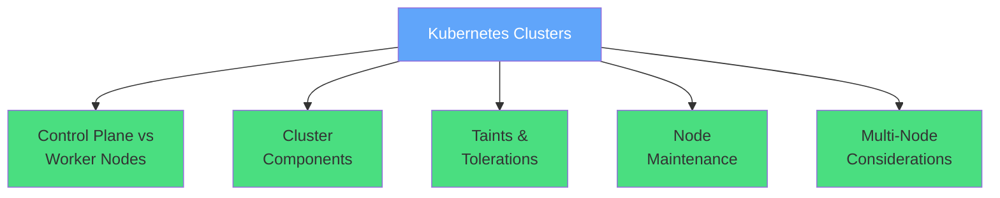

</div>

<!--
METADATA:
sentence: While cluster setup is beyond CKAD scope, understanding architecture helps with troubleshooting and operations.
search_anchor: beyond CKAD scope
-->
<div v-click="4" class="mt-6 text-center text-sm opacity-80">
<carbon-warning class="inline-block text-2xl text-yellow-400" /> Cluster setup beyond CKAD scope
</div>

<!--
METADATA:
sentence: While cluster setup is beyond CKAD scope, understanding architecture helps with troubleshooting and operations.
search_anchor: Focus on architecture and operations
-->
<div v-click="5" class="text-center text-sm opacity-80">
<carbon-checkmark class="inline-block text-2xl text-green-400" /> Focus on architecture and operations
</div>

---
layout: center
---

# Single vs Multi-Node Clusters

<!--
METADATA:
sentence: Single-node clusters (Docker Desktop, Minikube) are fine for learning, but production requires multi-node for high availability and scale.
search_anchor: Single-node clusters
-->
<div v-click="1" class="mb-4">
<carbon-container-software class="text-5xl text-blue-400 mb-2" />
<strong>Single-Node Clusters</strong>
</div>

<!--
METADATA:
sentence: Single-node clusters (Docker Desktop, Minikube) are fine for learning, but production requires multi-node for high availability and scale.
search_anchor: Docker Desktop, Minikube
-->
<div v-click="2" class="text-sm opacity-80 mb-4">
Docker Desktop, Minikube - fine for learning
</div>

<!--
METADATA:
sentence: Single-node clusters (Docker Desktop, Minikube) are fine for learning, but production requires multi-node for high availability and scale.
search_anchor: fine for learning
-->
<div v-click="3">

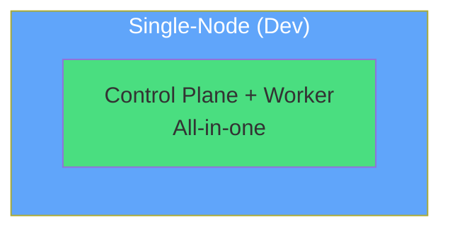

</div>

<!--
METADATA:
sentence: Single-node clusters (Docker Desktop, Minikube) are fine for learning, but production requires multi-node for high availability and scale.
search_anchor: production requires multi-node
-->
<div v-click="4" class="mt-6 mb-4">
<carbon-kubernetes class="text-5xl text-green-400 mb-2" />
<strong>Multi-Node Clusters</strong>
</div>

<!--
METADATA:
sentence: Single-node clusters (Docker Desktop, Minikube) are fine for learning, but production requires multi-node for high availability and scale.
search_anchor: high availability and scale
-->
<div v-click="5" class="text-sm opacity-80 mb-4">
Production requires multi-node for high availability and scale
</div>

<!--
METADATA:
sentence: Typical production cluster: 3+ control plane nodes (for HA), 10-100+ worker nodes (for capacity).
search_anchor: Typical production cluster
-->
<div v-click="6">

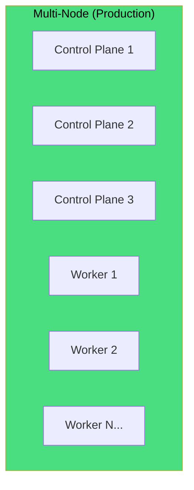

</div>

<!--
METADATA:
sentence: Typical production cluster: 3+ control plane nodes (for HA), 10-100+ worker nodes (for capacity).
search_anchor: 3+ control plane nodes
-->
<div v-click="7" class="mt-6 text-center text-lg">
<strong>Typical Production:</strong> 3+ control plane nodes, 10-100+ workers
</div>

<!--
METADATA:
sentence: Control plane runs Kubernetes components, workers run your applications.
search_anchor: Control plane runs Kubernetes components
-->
<div v-click="8" class="text-center text-sm opacity-80">
Control plane runs Kubernetes components, workers run your applications
</div>

---
layout: center
---

# Control Plane Components

<!--
METADATA:
sentence: Control plane runs: **API Server**: Front-end for Kubernetes, handles all API requests, **etcd**: Distributed key-value store, cluster database, **Scheduler**: Assigns Pods to nodes, **Controller Manager**: Runs controllers (Deployment, ReplicaSet, etc.), **Cloud Controller Manager**: Integrates with cloud providers.
search_anchor: Control plane runs
-->
<div v-click="1" class="text-center mb-4">
<carbon-api class="inline-block text-5xl text-blue-400" />
<strong class="text-xl">The Brain of Kubernetes</strong>
</div>

<!--
METADATA:
sentence: Control plane runs: **API Server**: Front-end for Kubernetes, handles all API requests, **etcd**: Distributed key-value store, cluster database, **Scheduler**: Assigns Pods to nodes, **Controller Manager**: Runs controllers (Deployment, ReplicaSet, etc.), **Cloud Controller Manager**: Integrates with cloud providers.
search_anchor: API Server, etcd, Scheduler
-->
<div v-click="2">

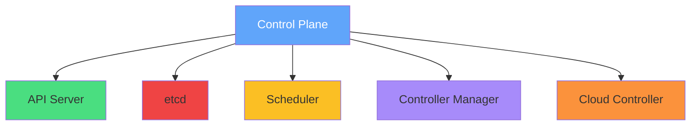

</div>

<!--
METADATA:
sentence: **API Server**: Front-end for Kubernetes, handles all API requests
search_anchor: API Server
-->
<div v-click="3" class="mb-4">
<carbon-api class="text-4xl text-green-400 mb-2" />
<strong>API Server</strong>
</div>

<!--
METADATA:
sentence: **API Server**: Front-end for Kubernetes, handles all API requests
search_anchor: Front-end for Kubernetes, handles all API requests
-->
<div v-click="4" class="text-sm opacity-80 mb-4">
Front-end for Kubernetes - handles all API requests
</div>

<!--
METADATA:
sentence: **etcd**: Distributed key-value store, cluster database
search_anchor: etcd
-->
<div v-click="5" class="mb-4">
<carbon-data-base class="text-4xl text-red-400 mb-2" />
<strong>etcd</strong>
</div>

<!--
METADATA:
sentence: **etcd**: Distributed key-value store, cluster database
search_anchor: Distributed key-value store, cluster database
-->
<div v-click="6" class="text-sm opacity-80 mb-4">
Distributed key-value store - the cluster database
</div>

<!--
METADATA:
sentence: **Scheduler**: Assigns Pods to nodes
search_anchor: Scheduler
-->
<div v-click="7" class="mb-4">
<carbon-category-and class="text-4xl text-yellow-400 mb-2" />
<strong>Scheduler</strong>
</div>

<!--
METADATA:
sentence: **Scheduler**: Assigns Pods to nodes
search_anchor: Assigns Pods to nodes
-->
<div v-click="8" class="text-sm opacity-80 mb-4">
Assigns Pods to nodes
</div>

<!--
METADATA:
sentence: **Controller Manager**: Runs controllers (Deployment, ReplicaSet, etc.)
search_anchor: Controller Manager
-->
<div v-click="9" class="mb-4">
<carbon-settings class="text-4xl text-purple-400 mb-2" />
<strong>Controller Manager</strong>
</div>

<!--
METADATA:
sentence: **Controller Manager**: Runs controllers (Deployment, ReplicaSet, etc.)
search_anchor: Runs controllers (Deployment, ReplicaSet, etc.)
-->
<div v-click="10" class="text-sm opacity-80 mb-4">
Runs controllers - Deployment, ReplicaSet, etc.
</div>

<!--
METADATA:
sentence: **Cloud Controller Manager**: Integrates with cloud providers
search_anchor: Cloud Controller Manager
-->
<div v-click="11" class="mb-4">
<carbon-cloud class="text-4xl text-orange-400 mb-2" />
<strong>Cloud Controller Manager</strong>
</div>

<!--
METADATA:
sentence: **Cloud Controller Manager**: Integrates with cloud providers
search_anchor: Integrates with cloud providers
-->
<div v-click="12" class="text-sm opacity-80 mb-4">
Integrates with cloud providers
</div>

<!--
METADATA:
sentence: These components are typically replicated across 3 or 5 nodes for fault tolerance.
search_anchor: replicated across 3 or 5 nodes for fault tolerance
-->
<div v-click="13" class="mt-6 text-center text-lg text-blue-400">
<carbon-deployment-unit-technical-execution class="inline-block text-3xl" /> Replicated across 3 or 5 nodes for fault tolerance
</div>

---
layout: center
---

# Worker Node Components

<!--
METADATA:
sentence: Each worker node runs: **kubelet**: Agent that manages Pods on the node, **Container runtime**: Docker, containerd, or CRI-O, **kube-proxy**: Network proxy for Services.
search_anchor: Each worker node runs
-->
<div v-click="1" class="text-center mb-4">
<carbon-container-software class="inline-block text-5xl text-blue-400" />
<strong class="text-xl">Where Your Workloads Run</strong>
</div>

<!--
METADATA:
sentence: Each worker node runs: **kubelet**: Agent that manages Pods on the node, **Container runtime**: Docker, containerd, or CRI-O, **kube-proxy**: Network proxy for Services.
search_anchor: kubelet, Container runtime, kube-proxy
-->
<div v-click="2">

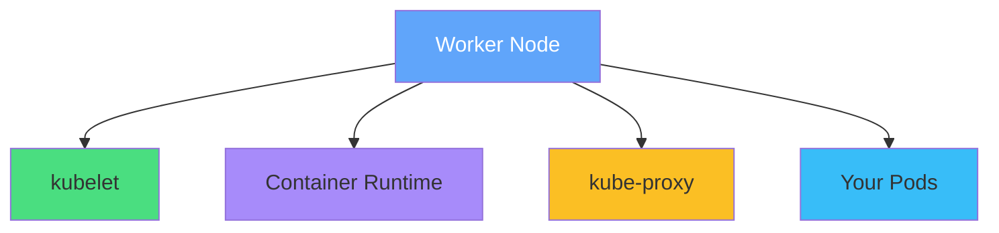

</div>

<!--
METADATA:
sentence: **kubelet**: Agent that manages Pods on the node
search_anchor: kubelet
-->
<div v-click="3" class="mb-4">
<carbon-container-software class="text-4xl text-green-400 mb-2" />
<strong>kubelet</strong>
</div>

<!--
METADATA:
sentence: **kubelet**: Agent that manages Pods on the node
search_anchor: Agent that manages Pods on the node
-->
<div v-click="4" class="text-sm opacity-80 mb-4">
Agent that manages Pods on the node
</div>

<!--
METADATA:
sentence: **Container runtime**: Docker, containerd, or CRI-O
search_anchor: Container runtime
-->
<div v-click="5" class="mb-4">
<carbon-virtual-machine class="text-4xl text-purple-400 mb-2" />
<strong>Container Runtime</strong>
</div>

<!--
METADATA:
sentence: **Container runtime**: Docker, containerd, or CRI-O
search_anchor: Docker, containerd, or CRI-O
-->
<div v-click="6" class="text-sm opacity-80 mb-4">
Docker, containerd, or CRI-O
</div>

<!--
METADATA:
sentence: **kube-proxy**: Network proxy for Services
search_anchor: kube-proxy
-->
<div v-click="7" class="mb-4">
<carbon-network-3 class="text-4xl text-yellow-400 mb-2" />
<strong>kube-proxy</strong>
</div>

<!--
METADATA:
sentence: **kube-proxy**: Network proxy for Services
search_anchor: Network proxy for Services
-->
<div v-click="8" class="text-sm opacity-80 mb-4">
Network proxy for Services
</div>

<!--
METADATA:
sentence: Workers execute the actual workload - your Pods run here.
search_anchor: Workers execute the actual workload
-->
<div v-click="9" class="mt-6 text-center text-lg">
<carbon-deployment-unit-data class="inline-block text-3xl text-blue-400" /> Workers execute the actual workload
</div>

<!--
METADATA:
sentence: Nodes can be physical servers, VMs, or cloud instances.
search_anchor: Nodes can be physical servers, VMs, or cloud instances
-->
<div v-click="10" class="text-center text-sm opacity-80">
Nodes can be physical servers, VMs, or cloud instances
</div>

---
layout: center
---

# Taints and Tolerations

<!--
METADATA:
sentence: **Taints** mark nodes as special - they repel Pods unless the Pod tolerates the taint.
search_anchor: Taints and Tolerations
-->
<div v-click="1" class="text-center mb-4">
<carbon-rule class="inline-block text-5xl text-blue-400" />
<strong class="text-xl">Node Isolation Mechanism</strong>
</div>

<!--
METADATA:
sentence: **Taints** mark nodes as special - they repel Pods unless the Pod tolerates the taint.
search_anchor: Taints
-->
<div v-click="2" class="mb-4">
<carbon-warning class="text-4xl text-yellow-400 mb-2" />
<strong>Taints</strong>
</div>

<!--
METADATA:
sentence: **Taints** mark nodes as special - they repel Pods unless the Pod tolerates the taint.
search_anchor: repel Pods unless the Pod tolerates the taint
-->
<div v-click="3" class="text-sm opacity-80 mb-4">
Mark nodes as special - they repel Pods unless the Pod tolerates the taint
</div>

<!--
METADATA:
sentence: **Taints** mark nodes as special - they repel Pods unless the Pod tolerates the taint.
search_anchor: mark nodes as special
-->
<div v-click="4">

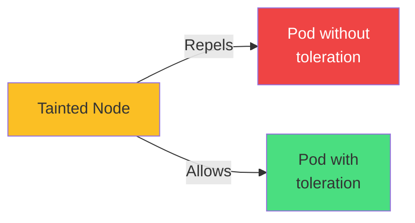

</div>

<!--
METADATA:
sentence: Format: `key=value:Effect`
search_anchor: key=value:Effect
-->
<div v-click="5" class="mt-6 mb-4 text-center">
<strong>Format:</strong> <code>key=value:Effect</code>
</div>

<div class="grid grid-cols-3 gap-6 text-sm">
<!--
METADATA:
sentence: Effects: NoSchedule (no new Pods), PreferNoSchedule (avoid if possible), NoExecute (evict existing Pods).
search_anchor: NoSchedule
-->
<div v-click="6">
<carbon-close class="text-4xl text-red-400 mb-2" />
<strong>NoSchedule</strong>
</div>
<!--
METADATA:
sentence: Effects: NoSchedule (no new Pods), PreferNoSchedule (avoid if possible), NoExecute (evict existing Pods).
search_anchor: no new Pods
-->
<div v-click="7">
<span class="text-xs opacity-80">No new Pods can be scheduled</span>
</div>
<!--
METADATA:
sentence: Effects: NoSchedule (no new Pods), PreferNoSchedule (avoid if possible), NoExecute (evict existing Pods).
search_anchor: Existing Pods remain
-->
<div v-click="8">
<span class="text-xs text-red-400">Existing Pods remain</span>
</div>

<!--
METADATA:
sentence: Effects: NoSchedule (no new Pods), PreferNoSchedule (avoid if possible), NoExecute (evict existing Pods).
search_anchor: PreferNoSchedule
-->
<div v-click="9">
<carbon-warning class="text-4xl text-yellow-400 mb-2" />
<strong>PreferNoSchedule</strong>
</div>
<!--
METADATA:
sentence: Effects: NoSchedule (no new Pods), PreferNoSchedule (avoid if possible), NoExecute (evict existing Pods).
search_anchor: avoid if possible
-->
<div v-click="10">
<span class="text-xs opacity-80">Avoid scheduling if possible</span>
</div>
<!--
METADATA:
sentence: Effects: NoSchedule (no new Pods), PreferNoSchedule (avoid if possible), NoExecute (evict existing Pods).
search_anchor: Soft constraint
-->
<div v-click="11">
<span class="text-xs text-yellow-600">Soft constraint</span>
</div>

<!--
METADATA:
sentence: Effects: NoSchedule (no new Pods), PreferNoSchedule (avoid if possible), NoExecute (evict existing Pods).
search_anchor: NoExecute
-->
<div v-click="12">
<carbon-power class="text-4xl text-purple-400 mb-2" />
<strong>NoExecute</strong>
</div>
<!--
METADATA:
sentence: Effects: NoSchedule (no new Pods), PreferNoSchedule (avoid if possible), NoExecute (evict existing Pods).
search_anchor: evict existing Pods
-->
<div v-click="13">
<span class="text-xs opacity-80">Evict existing Pods</span>
</div>
<!--
METADATA:
sentence: Effects: NoSchedule (no new Pods), PreferNoSchedule (avoid if possible), NoExecute (evict existing Pods).
search_anchor: Strongest constraint
-->
<div v-click="14">
<span class="text-xs text-purple-600">Strongest constraint</span>
</div>
</div>

<!--
METADATA:
sentence: **Tolerations** on Pods allow scheduling on tainted nodes.
search_anchor: Tolerations
-->
<div v-click="15" class="mt-6 mb-4">
<carbon-checkmark class="text-4xl text-green-400 mb-2" />
<strong>Tolerations</strong>
</div>

<!--
METADATA:
sentence: **Tolerations** on Pods allow scheduling on tainted nodes.
search_anchor: allow scheduling on tainted nodes
-->
<div v-click="16" class="text-sm opacity-80 mb-4">
On Pods - allow scheduling on tainted nodes
</div>

<!--
METADATA:
sentence: Control plane nodes are typically tainted to prevent user workloads.
search_anchor: Control plane nodes are typically tainted to prevent user workloads
-->
<div v-click="17" class="text-center text-lg text-blue-400">
<carbon-security class="inline-block text-2xl" /> Control plane nodes typically tainted to prevent user workloads
</div>

---
layout: center
---

# Node Labels and Selectors

<!--
METADATA:
sentence: Standard labels applied automatically: `kubernetes.io/hostname`: node name, `kubernetes.io/os`: linux or windows, `kubernetes.io/arch`: amd64, arm64, etc., `topology.kubernetes.io/zone`: availability zone, `topology.kubernetes.io/region`: cloud region.
search_anchor: Node Labels and Selectors
-->
<div v-click="1" class="text-center mb-4">
<carbon-tag class="inline-block text-5xl text-blue-400" />
<strong class="text-xl">Organizing and Targeting Nodes</strong>
</div>

<!--
METADATA:
sentence: Standard labels applied automatically: `kubernetes.io/hostname`: node name, `kubernetes.io/os`: linux or windows, `kubernetes.io/arch`: amd64, arm64, etc., `topology.kubernetes.io/zone`: availability zone, `topology.kubernetes.io/region`: cloud region.
search_anchor: Standard labels applied automatically
-->
<div v-click="2" class="mb-4">
<strong>Standard Labels Applied Automatically:</strong>
</div>

<!--
METADATA:
sentence: Standard labels applied automatically: `kubernetes.io/hostname`: node name, `kubernetes.io/os`: linux or windows, `kubernetes.io/arch`: amd64, arm64, etc., `topology.kubernetes.io/zone`: availability zone, `topology.kubernetes.io/region`: cloud region.
search_anchor: kubernetes.io/hostname, kubernetes.io/os, kubernetes.io/arch
-->
<div v-click="3">

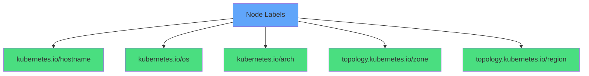

</div>

<div class="grid grid-cols-2 gap-4 mt-6 text-sm">
<!--
METADATA:
sentence: `kubernetes.io/hostname`: node name
search_anchor: kubernetes.io/hostname
-->
<div v-click="4">
<carbon-server class="inline-block text-2xl text-green-400" /> <code>kubernetes.io/hostname</code>
</div>
<!--
METADATA:
sentence: `kubernetes.io/hostname`: node name
search_anchor: node name
-->
<div v-click="5">
<span class="text-xs opacity-60">Node name</span>
</div>

<!--
METADATA:
sentence: `kubernetes.io/os`: linux or windows
search_anchor: kubernetes.io/os
-->
<div v-click="6">
<carbon-virtual-machine class="inline-block text-2xl text-blue-400" /> <code>kubernetes.io/os</code>
</div>
<!--
METADATA:
sentence: `kubernetes.io/os`: linux or windows
search_anchor: linux or windows
-->
<div v-click="7">
<span class="text-xs opacity-60">linux or windows</span>
</div>

<!--
METADATA:
sentence: `kubernetes.io/arch`: amd64, arm64, etc.
search_anchor: kubernetes.io/arch
-->
<div v-click="8">
<carbon-chip class="inline-block text-2xl text-purple-400" /> <code>kubernetes.io/arch</code>
</div>
<!--
METADATA:
sentence: `kubernetes.io/arch`: amd64, arm64, etc.
search_anchor: amd64, arm64, etc.
-->
<div v-click="9">
<span class="text-xs opacity-60">amd64, arm64, etc.</span>
</div>

<!--
METADATA:
sentence: `topology.kubernetes.io/zone`: availability zone
search_anchor: topology.kubernetes.io/zone
-->
<div v-click="10">
<carbon-location class="inline-block text-2xl text-yellow-400" /> <code>topology.kubernetes.io/zone</code>
</div>
<!--
METADATA:
sentence: `topology.kubernetes.io/zone`: availability zone
search_anchor: availability zone
-->
<div v-click="11">
<span class="text-xs opacity-60">Availability zone</span>
</div>

<!--
METADATA:
sentence: `topology.kubernetes.io/region`: cloud region
search_anchor: topology.kubernetes.io/region
-->
<div v-click="12">
<carbon-earth class="inline-block text-2xl text-orange-400" /> <code>topology.kubernetes.io/region</code>
</div>
<!--
METADATA:
sentence: `topology.kubernetes.io/region`: cloud region
search_anchor: cloud region
-->
<div v-click="13">
<span class="text-xs opacity-60">Cloud region</span>
</div>

<!--
METADATA:
sentence: Use nodeSelector or affinity to place Pods on specific nodes. Custom labels for hardware types (ssd, gpu, etc.).
search_anchor: Custom labels
-->
<div v-click="14">
<carbon-settings class="inline-block text-2xl text-red-400" /> <strong>Custom Labels</strong>
</div>
<!--
METADATA:
sentence: Use nodeSelector or affinity to place Pods on specific nodes. Custom labels for hardware types (ssd, gpu, etc.).
search_anchor: disktype=ssd, gpu=true
-->
<div v-click="15">
<span class="text-xs opacity-60">disktype=ssd, gpu=true, etc.</span>
</div>
</div>

<!--
METADATA:
sentence: Use nodeSelector or affinity to place Pods on specific nodes.
search_anchor: Use nodeSelector or affinity to place Pods on specific nodes
-->
<div v-click="16" class="mt-6 text-center text-lg">
<carbon-filter class="inline-block text-3xl text-blue-400" /> Use nodeSelector or affinity to place Pods on specific nodes
</div>

---
layout: center
---

# Cluster Setup Options

<!--
METADATA:
sentence: **Kubeadm**: Manual cluster setup on VMs or bare metal, **Managed services**: AKS (Azure), EKS (AWS), GKE (Google), **Local dev**: Docker Desktop, k3d, Kind, Minikube.
search_anchor: Cluster Setup Options
-->
<div v-click="1" class="text-center mb-4">
<carbon-deployment-pattern class="inline-block text-5xl text-blue-400" />
<strong class="text-xl">Different Ways to Run Kubernetes</strong>
</div>

<!--
METADATA:
sentence: **Kubeadm**: Manual cluster setup on VMs or bare metal, **Managed services**: AKS (Azure), EKS (AWS), GKE (Google), **Local dev**: Docker Desktop, k3d, Kind, Minikube.
search_anchor: Kubeadm, Managed services, Local dev
-->
<div v-click="2">

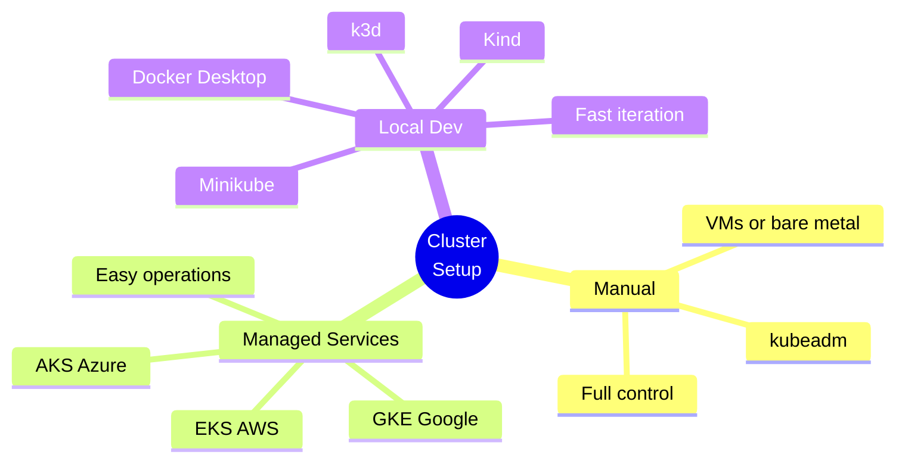

</div>

<div class="grid grid-cols-3 gap-6 mt-6 text-sm">
<!--
METADATA:
sentence: **Kubeadm**: Manual cluster setup on VMs or bare metal
search_anchor: Kubeadm
-->
<div v-click="3" class="text-center">
<carbon-tool-box class="text-4xl text-blue-400 mb-2" />
<strong>Kubeadm</strong><br/>
<span class="text-xs opacity-60">Manual cluster setup<br/>VMs or bare metal</span>
</div>
<!--
METADATA:
sentence: **Managed services**: AKS (Azure), EKS (AWS), GKE (Google)
search_anchor: Managed services
-->
<div v-click="4" class="text-center">
<carbon-cloud class="text-4xl text-green-400 mb-2" />
<strong>Managed</strong><br/>
<span class="text-xs opacity-60">AKS, EKS, GKE<br/>Cloud providers</span>
</div>
<!--
METADATA:
sentence: **Local dev**: Docker Desktop, k3d, Kind, Minikube
search_anchor: Local dev
-->
<div v-click="5" class="text-center">
<carbon-container-software class="text-4xl text-purple-400 mb-2" />
<strong>Local Dev</strong><br/>
<span class="text-xs opacity-60">Docker Desktop<br/>k3d, Kind, Minikube</span>
</div>
</div>

<!--
METADATA:
sentence: For CKAD: Focus on kubectl commands, not cluster setup.
search_anchor: For CKAD: Focus on kubectl commands
-->
<div v-click="6" class="mt-8 text-center text-lg text-yellow-400">
<carbon-warning class="inline-block text-3xl" /> For CKAD: Focus on kubectl commands, not cluster setup
</div>

<!--
METADATA:
sentence: Know the architecture and how to query cluster state.
search_anchor: Know the architecture and how to query cluster state
-->
<div v-click="7" class="text-center text-sm opacity-80">
Know the architecture and how to query cluster state
</div>

---
layout: center
---

# API Version Compatibility

<!--
METADATA:
sentence: Different Kubernetes versions support different API versions.
search_anchor: API Version Compatibility
-->
<div v-click="1" class="text-center mb-4">
<carbon-api class="inline-block text-5xl text-blue-400" />
<strong class="text-xl">Kubernetes Versions and API Support</strong>
</div>

<!--
METADATA:
sentence: Different Kubernetes versions support different API versions.
search_anchor: Different Kubernetes versions support different API versions
-->
<div v-click="2" class="text-center text-sm opacity-80 mb-6">
Different Kubernetes versions support different API versions
</div>

<!--
METADATA:
sentence: Upgrading clusters may break old manifests.
search_anchor: Upgrading clusters may break old manifests
-->
<div v-click="3" class="mb-4">
<carbon-warning class="text-4xl text-red-400 mb-2" />
<strong>Upgrading clusters may break old manifests</strong>
</div>

<!--
METADATA:
sentence: Upgrading clusters may break old manifests.
search_anchor: break old manifests
-->
<div v-click="4">

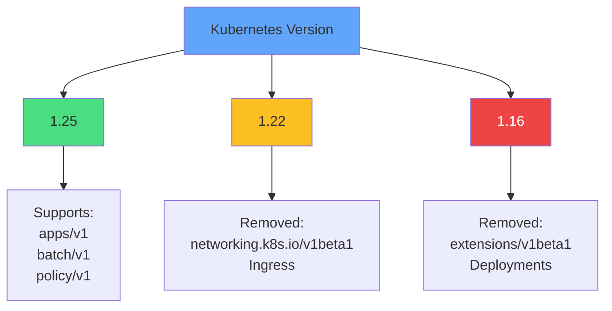

</div>

<!--
METADATA:
sentence: Always check Kubernetes deprecation guide before upgrades.
search_anchor: Always check Kubernetes deprecation guide before upgrades
-->
<div v-click="5" class="mt-6 text-center text-lg">
<carbon-document class="inline-block text-3xl text-blue-400" /> Always check Kubernetes deprecation guide before upgrades
</div>

<!--
METADATA:
sentence: Test applications against new versions in staging before production.
search_anchor: Test applications against new versions in staging before production
-->
<div v-click="6" class="text-center text-sm opacity-80">
Test applications against new versions in staging before production
</div>

<!--
METADATA:
sentence: k3d useful for testing different Kubernetes versions locally.
search_anchor: k3d useful for testing different Kubernetes versions locally
-->
<div v-click="7" class="mt-4 text-center">
<carbon-container-software class="inline-block text-2xl text-purple-400" /> k3d useful for testing different K8s versions locally
</div>

---
layout: center
---

# Node Maintenance

<!--
METADATA:
sentence: **Cordon**: Mark node unschedulable (`kubectl cordon`), **Drain**: Evict all Pods gracefully (`kubectl drain --ignore-daemonsets`), **Uncordon**: Re-enable scheduling (`kubectl uncordon`).
search_anchor: Node Maintenance
-->
<div v-click="1" class="text-center mb-4">
<carbon-settings class="inline-block text-5xl text-blue-400" />
<strong class="text-xl">Safely Taking Nodes Offline</strong>
</div>

<!--
METADATA:
sentence: Workflow: Cordon → Drain → Maintenance → Uncordon
search_anchor: Workflow: Cordon → Drain → Maintenance → Uncordon
-->
<div v-click="2">

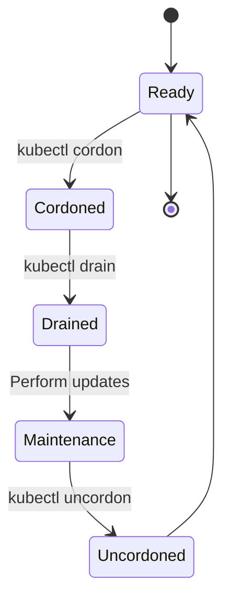

</div>

<!--
METADATA:
sentence: **Cordon**: Mark node unschedulable (`kubectl cordon`)
search_anchor: Cordon
-->
<div v-click="3" class="mt-6 mb-4">
<carbon-close class="text-4xl text-yellow-400 mb-2" />
<strong>Cordon</strong>
</div>

<!--
METADATA:
sentence: **Cordon**: Mark node unschedulable (`kubectl cordon`)
search_anchor: Mark node unschedulable
-->
<div v-click="4" class="text-sm opacity-80 mb-4">
Mark node unschedulable - <code>kubectl cordon</code>
</div>

<!--
METADATA:
sentence: **Drain**: Evict all Pods gracefully (`kubectl drain --ignore-daemonsets`)
search_anchor: Drain
-->
<div v-click="5" class="mb-4">
<carbon-power class="text-4xl text-red-400 mb-2" />
<strong>Drain</strong>
</div>

<!--
METADATA:
sentence: **Drain**: Evict all Pods gracefully (`kubectl drain --ignore-daemonsets`)
search_anchor: Evict all Pods gracefully
-->
<div v-click="6" class="text-sm opacity-80 mb-4">
Evict all Pods gracefully - <code>kubectl drain --ignore-daemonsets</code>
</div>

<!--
METADATA:
sentence: **Uncordon**: Re-enable scheduling (`kubectl uncordon`)
search_anchor: Uncordon
-->
<div v-click="7" class="mb-4">
<carbon-checkmark class="text-4xl text-green-400 mb-2" />
<strong>Uncordon</strong>
</div>

<!--
METADATA:
sentence: **Uncordon**: Re-enable scheduling (`kubectl uncordon`)
search_anchor: Re-enable scheduling
-->
<div v-click="8" class="text-sm opacity-80 mb-4">
Re-enable scheduling - <code>kubectl uncordon</code>
</div>

<!--
METADATA:
sentence: Workflow: Cordon → Drain → Maintenance → Uncordon
search_anchor: Cordon → Drain → Maintenance → Uncordon
-->
<div v-click="9" class="mt-6 text-center text-lg">
<strong>Workflow:</strong> Cordon → Drain → Maintenance → Uncordon
</div>

<!--
METADATA:
sentence: Pods don't automatically rebalance after uncordon - they stay where rescheduled.
search_anchor: Pods don't automatically rebalance after uncordon
-->
<div v-click="10" class="text-center text-sm text-yellow-400">
<carbon-warning class="inline-block text-2xl" /> Pods don't automatically rebalance after uncordon
</div>

<!--
METADATA:
sentence: Pods don't automatically rebalance after uncordon - they stay where rescheduled.
search_anchor: they stay where rescheduled
-->
<div v-click="11" class="text-center text-sm opacity-80">
They stay where they were rescheduled
</div>

---
layout: center
---

# CKAD Exam Focus

<!--
METADATA:
sentence: For CKAD: Know how to query node information, understand why Pods don't schedule, perform basic node maintenance.
search_anchor: CKAD Exam Focus
-->
<div v-click="1" class="text-center mb-6">
<carbon-certificate class="inline-block text-6xl text-blue-400" />
</div>

<div class="grid grid-cols-2 gap-4 text-sm">
<!--
METADATA:
sentence: For CKAD: Know how to query node information, understand why Pods don't schedule, perform basic node maintenance.
search_anchor: query node information
-->
<div v-click="2">
<carbon-view class="inline-block text-2xl text-green-400" /> Query node information
</div>
<!--
METADATA:
sentence: Commands to remember: `kubectl get nodes`, `kubectl describe node`, `kubectl cordon/drain/uncordon`, `kubectl label node`.
search_anchor: kubectl get nodes
-->
<div v-click="3">
<carbon-terminal class="inline-block text-2xl text-green-400" /> kubectl get nodes
</div>
<!--
METADATA:
sentence: Commands to remember: `kubectl get nodes`, `kubectl describe node`, `kubectl cordon/drain/uncordon`, `kubectl label node`.
search_anchor: kubectl describe node
-->
<div v-click="4">
<carbon-document class="inline-block text-2xl text-green-400" /> kubectl describe node
</div>
<!--
METADATA:
sentence: Commands to remember: `kubectl get nodes`, `kubectl describe node`, `kubectl cordon/drain/uncordon`, `kubectl label node`.
search_anchor: kubectl label node
-->
<div v-click="5">
<carbon-tag class="inline-block text-2xl text-green-400" /> Use node labels for scheduling
</div>
<!--
METADATA:
sentence: For CKAD: Know how to query node information, understand why Pods don't schedule, perform basic node maintenance.
search_anchor: understand why Pods don't schedule
-->
<div v-click="6">
<carbon-rule class="inline-block text-2xl text-green-400" /> Understand taints/tolerations
</div>
<!--
METADATA:
sentence: For CKAD: Know how to query node information, understand why Pods don't schedule, perform basic node maintenance.
search_anchor: Troubleshoot why Pods don't schedule
-->
<div v-click="7">
<carbon-debug class="inline-block text-2xl text-green-400" /> Troubleshoot why Pods don't schedule
</div>
<!--
METADATA:
sentence: For CKAD: Know how to query node information, understand why Pods don't schedule, perform basic node maintenance.
search_anchor: perform basic node maintenance
-->
<div v-click="8">
<carbon-settings class="inline-block text-2xl text-green-400" /> Perform node maintenance
</div>
<!--
METADATA:
sentence: Commands to remember: `kubectl get nodes`, `kubectl describe node`, `kubectl cordon/drain/uncordon`, `kubectl label node`.
search_anchor: kubectl cordon/drain/uncordon
-->
<div v-click="9">
<carbon-edit class="inline-block text-2xl text-green-400" /> kubectl cordon/drain/uncordon
</div>
</div>

<!--
METADATA:
sentence: For CKAD: Know how to query node information, understand why Pods don't schedule, perform basic node maintenance.
search_anchor: Know architecture and operations
-->
<div v-click="10" class="mt-8 text-center text-lg">
<carbon-checkmark class="inline-block text-3xl text-green-400" /> Know architecture and operations
</div>

<!--
METADATA:
sentence: For CKAD: Focus on kubectl commands, not cluster setup.
search_anchor: Cluster setup beyond CKAD scope
-->
<div v-click="11" class="text-center text-lg text-yellow-400">
<carbon-warning class="inline-block text-3xl" /> Cluster setup beyond CKAD scope
</div>

---
layout: center
---

# Key Commands

<div class="grid grid-cols-2 gap-6 mt-4 text-sm">
<!--
METADATA:
sentence: Commands to remember: `kubectl get nodes`, `kubectl describe node`, `kubectl cordon/drain/uncordon`, `kubectl label node`.
search_anchor: View Nodes
-->
<div v-click="1">
<carbon-view class="text-3xl text-blue-400 mb-2" />
<strong>View Nodes</strong>
</div>
<!--
METADATA:
sentence: Commands to remember: `kubectl get nodes`, `kubectl describe node`, `kubectl cordon/drain/uncordon`, `kubectl label node`.
search_anchor: kubectl get nodes command
-->
<div v-click="2">
```bash
kubectl get nodes
kubectl get nodes -o wide
```
</div>

<!--
METADATA:
sentence: Commands to remember: `kubectl get nodes`, `kubectl describe node`, `kubectl cordon/drain/uncordon`, `kubectl label node`.
search_anchor: Node Details
-->
<div v-click="3">
<carbon-document class="text-3xl text-green-400 mb-2" />
<strong>Node Details</strong>
</div>
<!--
METADATA:
sentence: Commands to remember: `kubectl get nodes`, `kubectl describe node`, `kubectl cordon/drain/uncordon`, `kubectl label node`.
search_anchor: kubectl describe node command
-->
<div v-click="4">
```bash
kubectl describe node <name>
```
</div>

<!--
METADATA:
sentence: Commands to remember: `kubectl get nodes`, `kubectl describe node`, `kubectl cordon/drain/uncordon`, `kubectl label node`.
search_anchor: Label Nodes
-->
<div v-click="5">
<carbon-tag class="text-3xl text-purple-400 mb-2" />
<strong>Label Nodes</strong>
</div>
<!--
METADATA:
sentence: Commands to remember: `kubectl get nodes`, `kubectl describe node`, `kubectl cordon/drain/uncordon`, `kubectl label node`.
search_anchor: kubectl label node command
-->
<div v-click="6">
```bash
kubectl label node <name> key=value
```
</div>

<!--
METADATA:
sentence: Commands to remember: `kubectl get nodes`, `kubectl describe node`, `kubectl cordon/drain/uncordon`, `kubectl label node`.
search_anchor: Maintenance commands
-->
<div v-click="7">
<carbon-settings class="text-3xl text-yellow-400 mb-2" />
<strong>Maintenance</strong>
</div>
<!--
METADATA:
sentence: Commands to remember: `kubectl get nodes`, `kubectl describe node`, `kubectl cordon/drain/uncordon`, `kubectl label node`.
search_anchor: kubectl cordon drain uncordon
-->
<div v-click="8">
```bash
kubectl cordon <node>
kubectl drain <node> --ignore-daemonsets
kubectl uncordon <node>
```
</div>
</div>

---
layout: center
---

# Summary

<!--
METADATA:
sentence: Key concepts: Control plane vs workers, taints/tolerations for node isolation, labels for Pod placement, maintenance with cordon/drain.
search_anchor: Key concepts
-->
<div v-click="1">

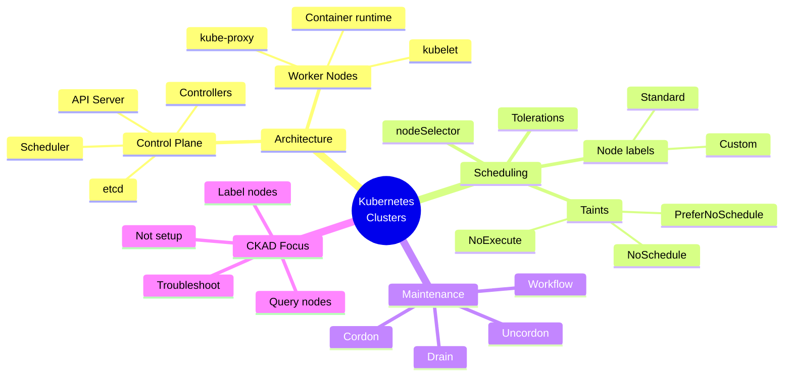

</div>

---
layout: center
---

# Key Takeaways

<!--
METADATA:
sentence: Key concepts: Control plane vs workers, taints/tolerations for node isolation, labels for Pod placement, maintenance with cordon/drain.
search_anchor: Control plane vs workers
-->
<div v-click="1" class="mb-4">
<carbon-kubernetes class="text-5xl text-blue-400 mb-2" />
<strong>Control Plane vs Workers</strong>
</div>

<!--
METADATA:
sentence: Key concepts: Control plane vs workers, taints/tolerations for node isolation, labels for Pod placement, maintenance with cordon/drain.
search_anchor: Brain vs execution layer
-->
<div v-click="2" class="text-sm opacity-80 mb-6">
Brain vs execution layer - understand the components and roles
</div>

<!--
METADATA:
sentence: Key concepts: Control plane vs workers, taints/tolerations for node isolation, labels for Pod placement, maintenance with cordon/drain.
search_anchor: taints/tolerations for node isolation
-->
<div v-click="3" class="mb-4">
<carbon-rule class="text-5xl text-green-400 mb-2" />
<strong>Taints and Tolerations</strong>
</div>

<!--
METADATA:
sentence: Key concepts: Control plane vs workers, taints/tolerations for node isolation, labels for Pod placement, maintenance with cordon/drain.
search_anchor: control where Pods can schedule
-->
<div v-click="4" class="text-sm opacity-80 mb-6">
Node isolation mechanism - control where Pods can schedule
</div>

<!--
METADATA:
sentence: Key concepts: Control plane vs workers, taints/tolerations for node isolation, labels for Pod placement, maintenance with cordon/drain.
search_anchor: labels for Pod placement
-->
<div v-click="5" class="mb-4">
<carbon-tag class="text-5xl text-purple-400 mb-2" />
<strong>Labels for Pod Placement</strong>
</div>

<!--
METADATA:
sentence: Use nodeSelector or affinity to place Pods on specific nodes.
search_anchor: nodeSelector and affinity to target specific nodes
-->
<div v-click="6" class="text-sm opacity-80 mb-6">
Use nodeSelector and affinity to target specific nodes
</div>

<!--
METADATA:
sentence: Key concepts: Control plane vs workers, taints/tolerations for node isolation, labels for Pod placement, maintenance with cordon/drain.
search_anchor: maintenance with cordon/drain
-->
<div v-click="7" class="mb-4">
<carbon-settings class="text-5xl text-yellow-400 mb-2" />
<strong>Node Maintenance Workflow</strong>
</div>

<!--
METADATA:
sentence: Workflow: Cordon → Drain → Maintenance → Uncordon
search_anchor: Cordon → Drain → Maintenance → Uncordon workflow
-->
<div v-click="8" class="text-sm opacity-80 mb-6">
Cordon → Drain → Maintenance → Uncordon
</div>

<!--
METADATA:
sentence: For CKAD: Focus on kubectl commands, not cluster setup.
search_anchor: Focus on operations, not cluster setup
-->
<div v-click="9" class="text-center text-lg">
<carbon-terminal class="inline-block text-3xl text-blue-400" /> Focus on operations, not cluster setup
</div>

---
layout: center
---

# Next Steps

<!--
METADATA:
sentence: Key concepts: Control plane vs workers, taints/tolerations for node isolation, labels for Pod placement, maintenance with cordon/drain.
search_anchor: Next Steps
-->
<div v-click="1" class="text-center mb-8">
<carbon-education class="inline-block text-6xl text-blue-400" />
</div>

<!--
METADATA:
sentence: For CKAD: Know how to query node information, understand why Pods don't schedule, perform basic node maintenance.
search_anchor: Hands-on Practice
-->
<div v-click="2">

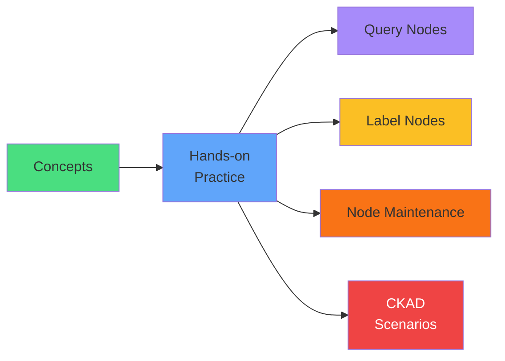

</div>

<!--
METADATA:
sentence: For CKAD: Know how to query node information, understand why Pods don't schedule, perform basic node maintenance.
search_anchor: Let's explore cluster operations
-->
<div v-click="3" class="mt-8 text-center text-xl">
Let's explore cluster operations! <carbon-arrow-right class="inline-block text-2xl" />
</div>
