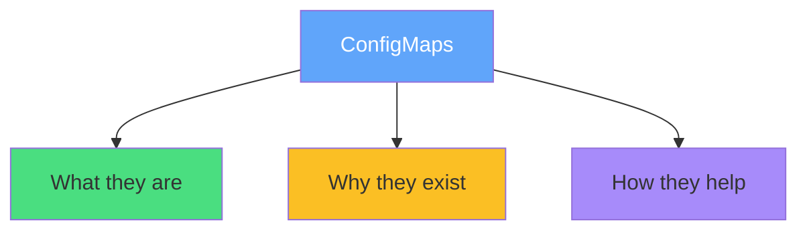
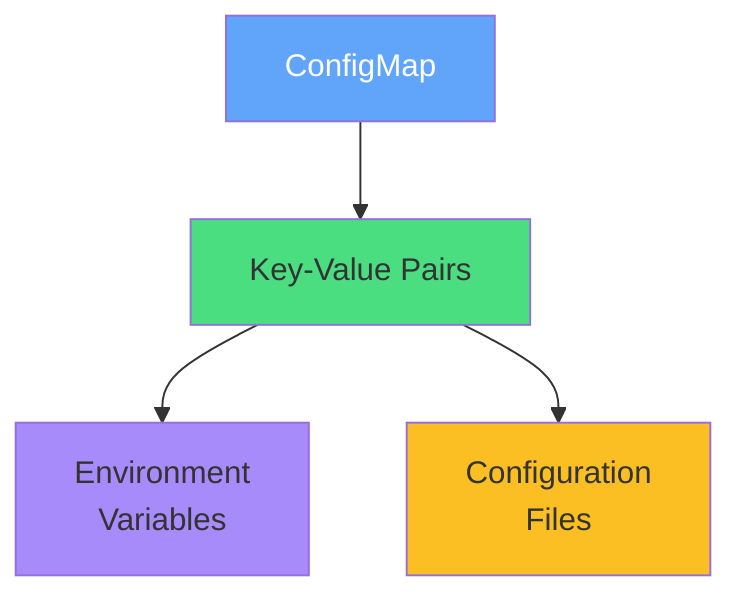
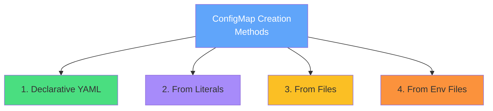
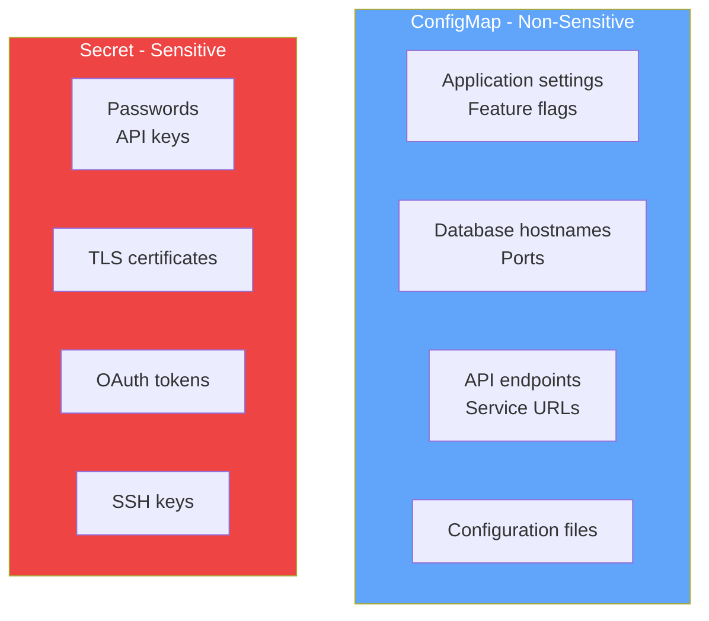
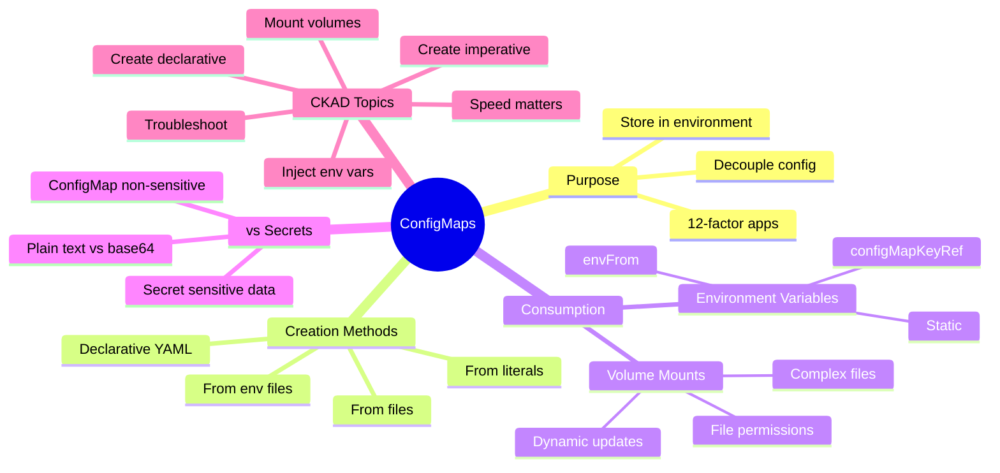
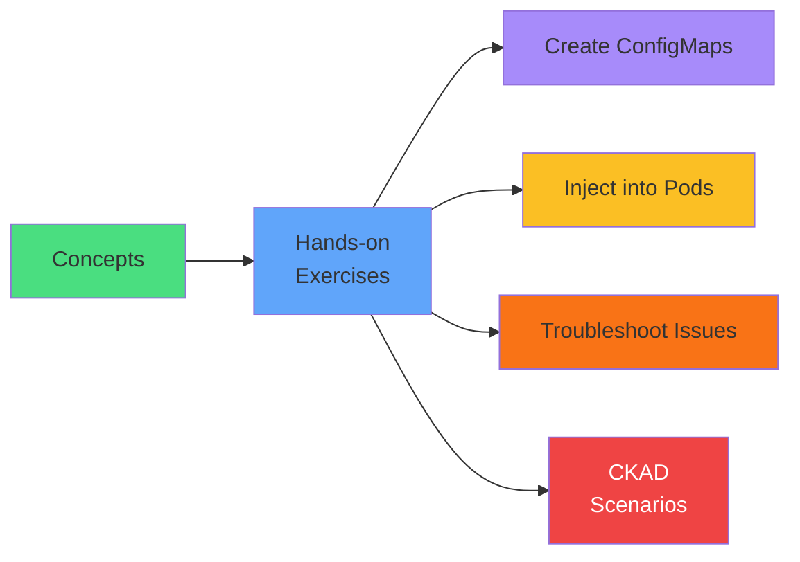

# ConfigMaps

<div class="abs-br m-6 flex gap-2">
  <carbon-settings class="text-6xl text-blue-400" />
</div>

<!--
METADATA:
sentence: ConfigMaps are a core CKAD exam topic, and understanding them is essential for managing application configuration in production environments.
search_anchor: core CKAD exam topic
-->
<div v-click class="mt-8 text-xl opacity-80">
Decoupling configuration from container images
</div>

---
layout: center
---

# Introduction

<!--
METADATA:
sentence: Welcome to this introduction to ConfigMaps in Kubernetes.
search_anchor: Welcome to this introduction to ConfigMaps
-->
<div v-click="1" class="text-center mb-4">
<carbon-settings class="inline-block text-5xl text-blue-400" />
</div>

<!--
METADATA:
sentence: ConfigMaps are a core CKAD exam topic, and understanding them is essential for managing application configuration in production environments.
search_anchor: essential for managing application configuration
-->
<div v-click="2" class="text-center text-lg mb-6">
Core CKAD exam topic - essential for production environments
</div>

<!--
METADATA:
sentence: In this presentation, we'll explore what ConfigMaps are, why they exist, and how they help you build cloud-native applications that follow the twelve-factor app methodology.
search_anchor: explore what ConfigMaps are
-->
<div v-click="3">



</div>

<!--
METADATA:
sentence: In this presentation, we'll explore what ConfigMaps are, why they exist, and how they help you build cloud-native applications that follow the twelve-factor app methodology.
search_anchor: twelve-factor app methodology
-->
<div v-click="4" class="mt-6 text-center text-sm opacity-80">
<carbon-idea class="inline-block text-2xl text-blue-400" /> Build cloud-native apps following twelve-factor methodology
</div>

---
layout: center
---

# The Configuration Challenge

<!--
METADATA:
sentence: Let's start with a problem you've probably faced: how do you manage configuration for applications running in different environments?
search_anchor: how do you manage configuration
-->
<div v-click="1" class="mb-4">
<carbon-warning class="text-5xl text-red-400 mb-2" />
<strong>How do you manage configuration across different environments?</strong>
</div>

<!--
METADATA:
sentence: Traditional applications often hardcode configuration values directly in the code, or bundle environment-specific config files inside container images.
search_anchor: hardcode configuration values directly
-->
<div v-click="2" class="mb-4">
<carbon-close class="text-4xl text-yellow-400 mb-2" />
<strong>Problem 1: Hardcoded Configuration</strong>
</div>

<!--
METADATA:
sentence: Traditional applications often hardcode configuration values directly in the code, or bundle environment-specific config files inside container images.
search_anchor: bundle environment-specific config files
-->
<div v-click="3" class="text-sm opacity-80 mb-4">
Values hardcoded in code or bundled in container images
</div>

<!--
METADATA:
sentence: First, it violates the separation of concerns principle - configuration shouldn't be mixed with application code.
search_anchor: violates the separation of concerns principle
-->
<div v-click="4" class="text-sm text-red-400 mb-4">
✗ Violates separation of concerns - config mixed with code
</div>

<!--
METADATA:
sentence: Second, it means you need different container images for each environment - one for development, another for staging, yet another for production.
search_anchor: different container images for each environment
-->
<div v-click="5" class="mb-4">
<carbon-image class="text-4xl text-yellow-400 mb-2" />
<strong>Problem 2: Multiple Images</strong>
</div>

<!--
METADATA:
sentence: Second, it means you need different container images for each environment - one for development, another for staging, yet another for production.
search_anchor: one for development, another for staging
-->
<div v-click="6" class="text-sm opacity-80 mb-4">
Different container images for dev, staging, production
</div>

<!--
METADATA:
sentence: This defeats the purpose of containers, which should be portable and immutable.
search_anchor: defeats the purpose of containers
-->
<div v-click="7" class="text-sm text-red-400 mb-4">
✗ Defeats purpose of containers - should be portable and immutable
</div>

<!--
METADATA:
sentence: Third, changing a simple configuration value requires rebuilding the entire application image, which is time-consuming and error-prone.
search_anchor: rebuilding the entire application image
-->
<div v-click="8" class="mb-4">
<carbon-renew class="text-4xl text-yellow-400 mb-2" />
<strong>Problem 3: Rebuild Required</strong>
</div>

<!--
METADATA:
sentence: Third, changing a simple configuration value requires rebuilding the entire application image, which is time-consuming and error-prone.
search_anchor: changing a simple configuration value
-->
<div v-click="9" class="text-sm opacity-80 mb-4">
Changing simple config values requires rebuilding entire image
</div>

<!--
METADATA:
sentence: Third, changing a simple configuration value requires rebuilding the entire application image, which is time-consuming and error-prone.
search_anchor: time-consuming and error-prone
-->
<div v-click="10" class="text-sm text-red-400 mb-4">
✗ Time-consuming and error-prone
</div>

<!--
METADATA:
sentence: The twelve-factor app methodology explicitly addresses this in factor three: "Store config in the environment."
search_anchor: Store config in the environment
-->
<div v-click="11" class="mt-6 text-center text-lg">
<carbon-idea class="inline-block text-3xl text-blue-400" /> 12-Factor App, Factor 3: "Store config in the environment"
</div>

<!--
METADATA:
sentence: Kubernetes ConfigMaps are designed to solve this exact problem.
search_anchor: solve this exact problem
-->
<div v-click="12" class="text-center text-sm opacity-80">
Kubernetes ConfigMaps solve this exact problem
</div>

---
layout: center
---

# What Are ConfigMaps?

<!--
METADATA:
sentence: A ConfigMap is a Kubernetes API object that stores non-confidential configuration data as key-value pairs.
search_anchor: Kubernetes API object
-->
<div v-click="1" class="text-center mb-4">
<carbon-settings class="inline-block text-5xl text-blue-400" />
<strong class="text-xl">Kubernetes API Object</strong>
</div>

<!--
METADATA:
sentence: A ConfigMap is a Kubernetes API object that stores non-confidential configuration data as key-value pairs.
search_anchor: stores non-confidential configuration data
-->
<div v-click="2" class="text-center text-lg mb-6">
Stores non-confidential configuration data as key-value pairs
</div>

<!--
METADATA:
sentence: Think of it as a dictionary or hash map that lives in your Kubernetes cluster.
search_anchor: dictionary or hash map
-->
<div v-click="3" class="text-center text-sm opacity-80 mb-6">
Think: dictionary or hash map living in your cluster
</div>

<!--
METADATA:
sentence: ConfigMaps decouple configuration from your container images, allowing you to: Use the same container image across multiple environments, Update configuration without rebuilding images, Manage configuration declaratively using YAML, Version control your configuration separately from code.
search_anchor: decouple configuration from your container images
-->
<div v-click="4">



</div>

<!--
METADATA:
sentence: ConfigMaps decouple configuration from your container images, allowing you to: Use the same container image across multiple environments, Update configuration without rebuilding images, Manage configuration declaratively using YAML, Version control your configuration separately from code.
search_anchor: ConfigMaps decouple configuration
-->
<div v-click="5" class="mt-6 mb-2">
<carbon-checkmark class="text-3xl text-green-400 mb-2" />
<strong>ConfigMaps Decouple Configuration:</strong>
</div>

<div class="grid grid-cols-2 gap-4 text-sm">
<!--
METADATA:
sentence: ConfigMaps decouple configuration from your container images, allowing you to: Use the same container image across multiple environments, Update configuration without rebuilding images, Manage configuration declaratively using YAML, Version control your configuration separately from code.
search_anchor: same container image across multiple environments
-->
<div v-click="6">
<carbon-image class="inline-block text-2xl text-blue-400" /> Same image across environments
</div>
<!--
METADATA:
sentence: ConfigMaps decouple configuration from your container images, allowing you to: Use the same container image across multiple environments, Update configuration without rebuilding images, Manage configuration declaratively using YAML, Version control your configuration separately from code.
search_anchor: Update configuration without rebuilding images
-->
<div v-click="7">
<carbon-edit class="inline-block text-2xl text-green-400" /> Update config without rebuilding
</div>
<!--
METADATA:
sentence: ConfigMaps decouple configuration from your container images, allowing you to: Use the same container image across multiple environments, Update configuration without rebuilding images, Manage configuration declaratively using YAML, Version control your configuration separately from code.
search_anchor: Manage configuration declaratively using YAML
-->
<div v-click="8">
<carbon-document class="inline-block text-2xl text-purple-400" /> Manage declaratively with YAML
</div>
<!--
METADATA:
sentence: ConfigMaps decouple configuration from your container images, allowing you to: Use the same container image across multiple environments, Update configuration without rebuilding images, Manage configuration declaratively using YAML, Version control your configuration separately from code.
search_anchor: Version control your configuration separately
-->
<div v-click="9">
<carbon-version class="inline-block text-2xl text-yellow-400" /> Version control separately
</div>
</div>

<!--
METADATA:
sentence: ConfigMaps store two types of data: simple key-value pairs that you'll typically surface as environment variables, and larger text data like configuration files that you'll surface as files in the container filesystem.
search_anchor: two types of data
-->
<div v-click="10" class="mt-6 mb-2">
<carbon-list class="text-3xl text-blue-400 mb-2" />
<strong>Two Types of Data:</strong>
</div>

<!--
METADATA:
sentence: ConfigMaps store two types of data: simple key-value pairs that you'll typically surface as environment variables, and larger text data like configuration files that you'll surface as files in the container filesystem.
search_anchor: simple key-value pairs that you'll typically surface as environment variables
-->
<div v-click="11" class="text-sm opacity-80">
1. Simple key-value pairs → surface as environment variables
</div>

<!--
METADATA:
sentence: ConfigMaps store two types of data: simple key-value pairs that you'll typically surface as environment variables, and larger text data like configuration files that you'll surface as files in the container filesystem.
search_anchor: larger text data like configuration files
-->
<div v-click="12" class="text-sm opacity-80">
2. Larger text data (config files) → surface as files in container filesystem
</div>

<!--
METADATA:
sentence: It's important to note that ConfigMaps are designed for non-sensitive data. For passwords, API keys, and other secrets, Kubernetes provides a separate Secret resource.
search_anchor: designed for non-sensitive data
-->
<div v-click="13" class="mt-6 text-center text-lg text-red-400">
<carbon-warning class="inline-block text-2xl" /> Non-sensitive data only! Use Secrets for passwords, API keys
</div>

---
layout: center
---

# Creating ConfigMaps - Four Methods

<!--
METADATA:
sentence: Kubernetes gives you flexibility in how you create ConfigMaps. Let's explore the four main methods.
search_anchor: four main methods
-->
<div v-click="1">



</div>

<!--
METADATA:
sentence: Method One: Declarative YAML. This is the most common approach in production.
search_anchor: Declarative YAML
-->
<div v-click="2" class="mt-8 mb-4">
<carbon-document class="text-4xl text-green-400 mb-2" />
<strong>Method 1: Declarative YAML</strong>
</div>

<!--
METADATA:
sentence: This is the most common approach in production. You define your ConfigMap in a YAML manifest that looks like this:
search_anchor: most common approach in production
-->
<div v-click="3" class="text-sm opacity-80 mb-4">
Most common in production - version control and kubectl apply
</div>

<!--
METADATA:
sentence: The data section contains your key-value pairs. This method works great because you can version control the YAML and apply it with kubectl apply.
search_anchor: data section contains your key-value pairs
-->
<div v-click="4" class="mb-4">

```yaml
apiVersion: v1
kind: ConfigMap
metadata:
  name: app-config
data:
  database_host: mysql.default.svc.cluster.local
  database_port: "3306"
  log_level: info
```

</div>

<!--
METADATA:
sentence: Method Two: From Literal Values. For quick testing or simple cases, you can create ConfigMaps directly from the command line:
search_anchor: From Literal Values
-->
<div v-click="5" class="mb-4">
<carbon-terminal class="text-4xl text-purple-400 mb-2" />
<strong>Method 2: From Literal Values</strong>
</div>

<!--
METADATA:
sentence: This is fast but doesn't provide the benefits of version control.
search_anchor: fast but doesn't provide the benefits
-->
<div v-click="6" class="text-sm opacity-80 mb-2">
Quick testing - fast but no version control
</div>

<!--
METADATA:
sentence: For quick testing or simple cases, you can create ConfigMaps directly from the command line:
search_anchor: directly from the command line
-->
<div v-click="7" class="mb-4">

```bash
kubectl create configmap app-config \
  --from-literal=database_host=mysql \
  --from-literal=database_port=3306
```

</div>

<!--
METADATA:
sentence: Method Three: From Files. If you have existing configuration files, you can create ConfigMaps directly from them:
search_anchor: From Files
-->
<div v-click="8" class="mb-4">
<carbon-document-attachment class="text-4xl text-yellow-400 mb-2" />
<strong>Method 3: From Files</strong>
</div>

<!--
METADATA:
sentence: The filename becomes the key, and the file contents become the value. You can even load entire directories at once.
search_anchor: filename becomes the key
-->
<div v-click="9" class="text-sm opacity-80 mb-2">
Existing config files - filename becomes key, contents become value
</div>

<!--
METADATA:
sentence: If you have existing configuration files, you can create ConfigMaps directly from them:
search_anchor: existing configuration files
-->
<div v-click="10" class="mb-4">

```bash
kubectl create configmap nginx-config --from-file=nginx.conf
```

</div>

<!--
METADATA:
sentence: Method Four: From Environment Files. For .env file formats, you can use:
search_anchor: From Environment Files
-->
<div v-click="11" class="mb-2">
<carbon-list class="text-4xl text-orange-400 mb-2" />
<strong>Method 4: From Environment Files</strong>
</div>

<!--
METADATA:
sentence: This parses the file and creates one key-value pair per line.
search_anchor: parses the file and creates one key-value pair
-->
<div v-click="12" class="text-sm opacity-80 mb-2">
.env file format - parses KEY=value per line
</div>

<!--
METADATA:
sentence: For .env file formats, you can use:
search_anchor: .env file formats
-->
<div v-click="13">

```bash
kubectl create configmap app-config --from-env-file=app.env
```

</div>

---
layout: center
---

# Consuming ConfigMaps - Environment Variables

<!--
METADATA:
sentence: Once you've created a ConfigMap, you need to inject it into your Pods. The first method is through environment variables.
search_anchor: inject it into your Pods
-->
<div v-click="1" class="text-center mb-4">
<carbon-list class="inline-block text-5xl text-blue-400" />
<strong class="text-xl">Method 1: Environment Variables</strong>
</div>

<!--
METADATA:
sentence: Loading All Keys. You can load all keys from a ConfigMap into environment variables using envFrom:
search_anchor: Loading All Keys
-->
<div v-click="2" class="mb-4">
<carbon-flow class="text-4xl text-green-400 mb-2" />
<strong>Loading All Keys with envFrom:</strong>
</div>

<!--
METADATA:
sentence: You can load all keys from a ConfigMap into environment variables using envFrom:
search_anchor: using envFrom
-->
<div v-click="3" class="mb-4">

```yaml
spec:
  containers:
  - name: app
    image: myapp:1.0
    envFrom:
    - configMapRef:
        name: app-config
```

</div>

<!--
METADATA:
sentence: This takes every key-value pair in the ConfigMap and creates a corresponding environment variable in the container.
search_anchor: takes every key-value pair
-->
<div v-click="4" class="text-sm opacity-80 mb-6">
Takes every key-value pair and creates corresponding environment variable
</div>

<!--
METADATA:
sentence: Loading Individual Keys. For more control, you can selectively load specific keys and even rename them:
search_anchor: Loading Individual Keys
-->
<div v-click="5" class="mb-4">
<carbon-filter class="text-4xl text-blue-400 mb-2" />
<strong>Loading Individual Keys (selective and rename):</strong>
</div>

<!--
METADATA:
sentence: For more control, you can selectively load specific keys and even rename them:
search_anchor: selectively load specific keys
-->
<div v-click="6" class="mb-4">

```yaml
env:
- name: DATABASE_HOST
  valueFrom:
    configMapKeyRef:
      name: app-config
      key: database_host
```

</div>

<!--
METADATA:
sentence: This gives you fine-grained control over which configuration values your application sees.
search_anchor: fine-grained control
-->
<div v-click="7" class="text-sm opacity-80 mb-6">
Fine-grained control over which values your application sees
</div>

<div class="grid grid-cols-2 gap-6 text-sm">
<!--
METADATA:
sentence: Environment variables are great for simple values and feature flags, but they have limitations.
search_anchor: great for simple values and feature flags
-->
<div v-click="8">
<carbon-checkmark class="text-3xl text-green-400 mb-2" />
<strong>Good for:</strong><br/>
<span class="opacity-80">Simple values, feature flags</span>
</div>
<!--
METADATA:
sentence: They're visible to all processes in the container, they can collide with system variables, and they're only read when the container starts.
search_anchor: visible to all processes in the container
-->
<div v-click="9">
<carbon-warning class="text-3xl text-yellow-400 mb-2" />
<strong>Limitations:</strong><br/>
<span class="opacity-80">Visible to all processes<br/>Can collide with system vars<br/>Only read at container start</span>
</div>
</div>

---
layout: center
---

# Consuming ConfigMaps - Volume Mounts

<!--
METADATA:
sentence: The second method for consuming ConfigMaps is through volume mounts, which surface configuration as files in the container filesystem.
search_anchor: volume mounts, which surface configuration as files
-->
<div v-click="1" class="text-center mb-4">
<carbon-data-volume class="inline-block text-5xl text-blue-400" />
<strong class="text-xl">Method 2: Volume Mounts</strong>
</div>

<!--
METADATA:
sentence: The second method for consuming ConfigMaps is through volume mounts, which surface configuration as files in the container filesystem.
search_anchor: surface configuration as files in the container filesystem
-->
<div v-click="2" class="text-center text-sm opacity-80 mb-6">
Surface configuration as files in container filesystem
</div>

<!--
METADATA:
sentence: Here's how it works:
search_anchor: Here's how it works
-->
<div v-click="3" class="mb-4">

```yaml
spec:
  containers:
  - name: app
    image: myapp:1.0
    volumeMounts:
    - name: config-volume
      mountPath: /config
      readOnly: true
  volumes:
  - name: config-volume
    configMap:
      name: app-config
```

</div>

<!--
METADATA:
sentence: With this approach, every key in the ConfigMap becomes a file in the /config directory. The key is the filename, and the value is the file contents.
search_anchor: every key in the ConfigMap becomes a file
-->
<div v-click="4" class="text-sm opacity-80 mb-6">
Every key becomes a file in /config directory<br/>
Key = filename, Value = file contents
</div>

<!--
METADATA:
sentence: Volume mounts have several advantages over environment variables: First, they support complex configuration formats like JSON, YAML, or XML files.
search_anchor: support complex configuration formats
-->
<div v-click="5" class="mb-4">
<carbon-checkmark class="text-4xl text-green-400 mb-2" />
<strong>Advantage 1: Complex Formats</strong>
</div>

<!--
METADATA:
sentence: Your application can read these files just as it would in a traditional deployment.
search_anchor: read these files just as it would
-->
<div v-click="6" class="text-sm opacity-80 mb-4">
Support JSON, YAML, XML files - app reads them like traditional deployment
</div>

<!--
METADATA:
sentence: Second, they provide better security through file permissions. You can set read-only access and control which users can access the files.
search_anchor: better security through file permissions
-->
<div v-click="7" class="mb-4">
<carbon-security class="text-4xl text-blue-400 mb-2" />
<strong>Advantage 2: Better Security</strong>
</div>

<!--
METADATA:
sentence: You can set read-only access and control which users can access the files.
search_anchor: read-only access and control which users
-->
<div v-click="8" class="text-sm opacity-80 mb-4">
File permissions control, read-only access
</div>

<!--
METADATA:
sentence: Third, and this is crucial: volume-mounted ConfigMaps can be updated dynamically.
search_anchor: volume-mounted ConfigMaps can be updated dynamically
-->
<div v-click="9" class="mb-4">
<carbon-renew class="text-4xl text-purple-400 mb-2" />
<strong>Advantage 3: Dynamic Updates</strong>
</div>

<!--
METADATA:
sentence: When you update a ConfigMap that's mounted as a volume, Kubernetes automatically propagates the changes to the Pod within about 60 seconds. Environment variables, by contrast, are static and require a Pod restart to pick up changes.
search_anchor: Kubernetes automatically propagates the changes
-->
<div v-click="10" class="text-sm opacity-80 mb-4">
Kubernetes auto-propagates changes within ~60 seconds<br/>
Environment variables are static and require Pod restart
</div>

<!--
METADATA:
sentence: There is one gotcha to watch out for: volume mounts replace the entire target directory.
search_anchor: volume mounts replace the entire target directory
-->
<div v-click="11" class="mt-6 text-center text-lg text-red-400">
<carbon-warning class="inline-block text-2xl" /> Gotcha: Volume mounts replace entire directory!
</div>

<!--
METADATA:
sentence: If you mount a ConfigMap to /app, it overwrites everything in that directory, which can break your application. The solution is to use subPath to mount individual files instead of entire directories.
search_anchor: mount a ConfigMap to /app, it overwrites everything
-->
<div v-click="12" class="text-center text-sm opacity-80">
Mounting to /app overwrites everything - use subPath for individual files
</div>

---
layout: center
---

# ConfigMaps vs Secrets

<!--
METADATA:
sentence: Let's clarify the distinction between ConfigMaps and Secrets, as this is a common point of confusion.
search_anchor: distinction between ConfigMaps and Secrets
-->
<div v-click="1" class="text-center mb-6">
<carbon-rule class="inline-block text-5xl text-blue-400" />
<strong class="text-xl">Understanding the Distinction</strong>
</div>

<!--
METADATA:
sentence: ConfigMaps are designed for non-sensitive configuration data like: Application settings and feature flags, Database hostnames and ports, API endpoints and service URLs, Configuration files.
search_anchor: non-sensitive configuration data
-->
<div v-click="2">



</div>

<div class="grid grid-cols-2 gap-6 mt-8">
<!--
METADATA:
sentence: ConfigMaps are stored in plain text in etcd and are easily readable by anyone with cluster access.
search_anchor: stored in plain text in etcd
-->
<div v-click="3">
<carbon-settings class="text-4xl text-blue-400 mb-2" />
<strong>ConfigMaps</strong>
</div>
<!--
METADATA:
sentence: ConfigMaps are stored in plain text in etcd and are easily readable by anyone with cluster access.
search_anchor: easily readable by anyone with cluster access
-->
<div v-click="4">
<span class="text-sm opacity-80">Stored in plain text in etcd<br/>Easily readable by anyone with cluster access</span>
</div>

<!--
METADATA:
sentence: Secrets, on the other hand, are designed for sensitive data like: Passwords and API keys, TLS certificates, OAuth tokens, SSH keys.
search_anchor: designed for sensitive data
-->
<div v-click="5">
<carbon-locked class="text-4xl text-red-400 mb-2" />
<strong>Secrets</strong>
</div>
<!--
METADATA:
sentence: While Secrets are base64-encoded, they're not encrypted by default. However, Kubernetes provides mechanisms to encrypt Secrets at rest in etcd, and they're handled more carefully throughout the system.
search_anchor: base64-encoded, they're not encrypted by default
-->
<div v-click="6">
<span class="text-sm opacity-80">Base64-encoded (not encrypted by default)<br/>Can enable encryption at rest in etcd<br/>Handled more carefully throughout system</span>
</div>
</div>

<!--
METADATA:
sentence: The rule of thumb is simple: if you wouldn't commit it to a public Git repository, don't put it in a ConfigMap. Use a Secret instead.
search_anchor: rule of thumb is simple
-->
<div v-click="7" class="mt-8 text-center text-xl">
<carbon-rule class="inline-block text-3xl text-yellow-400" /> Simple Rule:
</div>

<!--
METADATA:
sentence: The rule of thumb is simple: if you wouldn't commit it to a public Git repository, don't put it in a ConfigMap. Use a Secret instead.
search_anchor: wouldn't commit it to a public Git repository
-->
<div v-click="8" class="text-center text-lg">
Wouldn't commit to public Git? Don't put in ConfigMap - use Secret
</div>

---
layout: center
---

# CKAD Exam Relevance

<!--
METADATA:
sentence: ConfigMaps are a core CKAD exam topic, and you should expect multiple questions testing your understanding.
search_anchor: core CKAD exam topic
-->
<div v-click="1" class="text-center mb-6">
<carbon-certificate class="inline-block text-6xl text-blue-400" />
<strong class="text-xl">Core CKAD Exam Topic</strong>
</div>

<!--
METADATA:
sentence: ConfigMaps are a core CKAD exam topic, and you should expect multiple questions testing your understanding.
search_anchor: expect multiple questions
-->
<div v-click="2" class="text-center text-sm opacity-80 mb-6">
Expect multiple questions testing your understanding
</div>

<!--
METADATA:
sentence: Creation methods - You'll need to know how to create ConfigMaps imperatively with kubectl create and declaratively with YAML. Practice both approaches until they're second nature.
search_anchor: Creation methods
-->
<div v-click="3" class="mb-4">
<carbon-edit class="text-4xl text-green-400 mb-2" />
<strong>Creation Methods</strong>
</div>

<!--
METADATA:
sentence: You'll need to know how to create ConfigMaps imperatively with kubectl create and declaratively with YAML. Practice both approaches until they're second nature.
search_anchor: Practice both approaches until they're second nature
-->
<div v-click="4" class="text-sm opacity-80 mb-4">
kubectl create (imperative) AND YAML (declarative)<br/>
Practice both until second nature
</div>

<!--
METADATA:
sentence: Consumption patterns - Be comfortable with both environment variable and volume mount approaches. Know when to use each method.
search_anchor: Consumption patterns
-->
<div v-click="5" class="mb-4">
<carbon-list class="text-4xl text-blue-400 mb-2" />
<strong>Consumption Patterns</strong>
</div>

<!--
METADATA:
sentence: Be comfortable with both environment variable and volume mount approaches. Know when to use each method.
search_anchor: Know when to use each method
-->
<div v-click="6" class="text-sm opacity-80 mb-4">
Environment variables AND volume mounts<br/>
Know when to use each method
</div>

<!--
METADATA:
sentence: Troubleshooting - You'll need to debug common issues like missing ConfigMaps, incorrect key names, and volume mount problems. The describe and logs commands are your friends here.
search_anchor: Troubleshooting
-->
<div v-click="7" class="mb-4">
<carbon-debug class="text-4xl text-purple-400 mb-2" />
<strong>Troubleshooting</strong>
</div>

<!--
METADATA:
sentence: You'll need to debug common issues like missing ConfigMaps, incorrect key names, and volume mount problems. The describe and logs commands are your friends here.
search_anchor: describe and logs commands are your friends
-->
<div v-click="8" class="text-sm opacity-80 mb-4">
Missing ConfigMaps, incorrect keys, volume mount issues<br/>
kubectl describe and kubectl logs are your friends
</div>

<!--
METADATA:
sentence: Update behavior - Understand that environment variables don't update automatically but volume mounts do. Know when you need to restart Pods.
search_anchor: Update behavior
-->
<div v-click="9" class="mb-4">
<carbon-renew class="text-4xl text-yellow-400 mb-2" />
<strong>Update Behavior</strong>
</div>

<!--
METADATA:
sentence: Understand that environment variables don't update automatically but volume mounts do. Know when you need to restart Pods.
search_anchor: environment variables don't update automatically
-->
<div v-click="10" class="text-sm opacity-80 mb-4">
Env vars don't update automatically, volumes do<br/>
Know when to restart Pods
</div>

<!--
METADATA:
sentence: Speed matters in the CKAD exam. You should be able to create a ConfigMap and inject it into a Pod in under two minutes.
search_anchor: Speed matters in the CKAD exam
-->
<div v-click="11" class="mt-6 text-center text-xl text-red-400">
<carbon-timer class="inline-block text-3xl" /> Speed Matters!
</div>

<!--
METADATA:
sentence: You should be able to create a ConfigMap and inject it into a Pod in under two minutes.
search_anchor: create a ConfigMap and inject it into a Pod in under two minutes
-->
<div v-click="12" class="text-center text-lg">
Create ConfigMap + inject into Pod in under 2 minutes
</div>

<!--
METADATA:
sentence: The imperative kubectl create commands are often faster than writing YAML from scratch, so know both approaches.
search_anchor: imperative kubectl create commands are often faster
-->
<div v-click="13" class="text-center text-sm opacity-80">
Imperative kubectl commands often faster than YAML from scratch
</div>

---
layout: center
---

# Best Practices

<!--
METADATA:
sentence: Before we wrap up, let's cover some best practices for working with ConfigMaps. Naming and Organization - Use descriptive names like app-config or nginx-config.
search_anchor: Naming and Organization
-->
<div v-click="1" class="mb-4">
<carbon-tag class="text-4xl text-blue-400 mb-2" />
<strong>Naming and Organization</strong>
</div>

<!--
METADATA:
sentence: Use descriptive names like app-config or nginx-config. One ConfigMap per application or component. For immutable ConfigMaps, include version numbers in the name.
search_anchor: descriptive names like app-config
-->
<div v-click="2" class="text-sm opacity-80 mb-4">
• Descriptive names: app-config, nginx-config<br/>
• One ConfigMap per application or component<br/>
• Include version numbers for immutable ConfigMaps
</div>

<!--
METADATA:
sentence: Size Management - Keep ConfigMaps under 1 MiB total. Split large configurations into multiple ConfigMaps. Consider external configuration stores for very large files.
search_anchor: Size Management
-->
<div v-click="3" class="mb-4">
<carbon-dashboard class="text-4xl text-green-400 mb-2" />
<strong>Size Management</strong>
</div>

<!--
METADATA:
sentence: Keep ConfigMaps under 1 MiB total. Split large configurations into multiple ConfigMaps. Consider external configuration stores for very large files.
search_anchor: Keep ConfigMaps under 1 MiB total
-->
<div v-click="4" class="text-sm opacity-80 mb-4">
• Keep under 1 MiB total<br/>
• Split large configs into multiple ConfigMaps<br/>
• Consider external stores for very large files
</div>

<!--
METADATA:
sentence: Security - Always use readOnly: true for volume mounts. Set appropriate file permissions with defaultMode. Never store sensitive data in ConfigMaps.
search_anchor: Security
-->
<div v-click="5" class="mb-4">
<carbon-security class="text-4xl text-purple-400 mb-2" />
<strong>Security</strong>
</div>

<!--
METADATA:
sentence: Always use readOnly: true for volume mounts. Set appropriate file permissions with defaultMode. Never store sensitive data in ConfigMaps.
search_anchor: Always use readOnly: true
-->
<div v-click="6" class="text-sm opacity-80 mb-4">
• Always use readOnly: true for volume mounts<br/>
• Set appropriate file permissions with defaultMode<br/>
• Never store sensitive data in ConfigMaps
</div>

<!--
METADATA:
sentence: Update Strategy - Use immutable ConfigMaps in production for safety and performance. Version your ConfigMaps and use Deployment rolling updates. Understand your application's configuration reload behavior.
search_anchor: Update Strategy
-->
<div v-click="7" class="mb-4">
<carbon-version class="text-4xl text-yellow-400 mb-2" />
<strong>Update Strategy</strong>
</div>

<!--
METADATA:
sentence: Use immutable ConfigMaps in production for safety and performance. Version your ConfigMaps and use Deployment rolling updates. Understand your application's configuration reload behavior.
search_anchor: immutable ConfigMaps in production
-->
<div v-click="8" class="text-sm opacity-80 mb-4">
• Use immutable ConfigMaps in production (safety + performance)<br/>
• Version your ConfigMaps, use Deployment rolling updates<br/>
• Understand your app's configuration reload behavior
</div>

---
layout: center
---

# Summary

<!--
METADATA:
sentence: Let's recap what we've covered today. ConfigMaps are Kubernetes objects that store non-sensitive configuration data, decoupling it from container images. You can create them from YAML, literals, files, or environment files. You consume them through environment variables or volume mounts, each with different trade-offs. ConfigMaps are fundamental to building cloud-native applications and are essential CKAD exam knowledge.
search_anchor: Let's recap what we've covered today
-->
<div v-click="1">



</div>

---
layout: center
---

# Key Takeaways

<!--
METADATA:
sentence: ConfigMaps are Kubernetes objects that store non-sensitive configuration data, decoupling it from container images.
search_anchor: ConfigMaps are Kubernetes objects that store non-sensitive configuration data
-->
<div v-click="1" class="mb-4">
<carbon-settings class="text-5xl text-blue-400 mb-2" />
<strong>ConfigMaps Store Non-Sensitive Configuration</strong>
</div>

<!--
METADATA:
sentence: ConfigMaps are Kubernetes objects that store non-sensitive configuration data, decoupling it from container images.
search_anchor: decoupling it from container images
-->
<div v-click="2" class="text-sm opacity-80 mb-6">
Kubernetes API objects for key-value config data<br/>
Decouple configuration from container images
</div>

<!--
METADATA:
sentence: You can create them from YAML, literals, files, or environment files.
search_anchor: create them from YAML, literals, files
-->
<div v-click="3" class="mb-4">
<carbon-edit class="text-5xl text-green-400 mb-2" />
<strong>Four Creation Methods</strong>
</div>

<!--
METADATA:
sentence: You can create them from YAML, literals, files, or environment files.
search_anchor: YAML, literals, files, or environment files
-->
<div v-click="4" class="text-sm opacity-80 mb-6">
YAML, literals, files, env files - know them all
</div>

<!--
METADATA:
sentence: You consume them through environment variables or volume mounts, each with different trade-offs.
search_anchor: consume them through environment variables or volume mounts
-->
<div v-click="5" class="mb-4">
<carbon-list class="text-5xl text-purple-400 mb-2" />
<strong>Two Consumption Methods</strong>
</div>

<!--
METADATA:
sentence: You consume them through environment variables or volume mounts, each with different trade-offs.
search_anchor: each with different trade-offs
-->
<div v-click="6" class="text-sm opacity-80 mb-6">
Env vars (simple, static) vs volume mounts (complex, dynamic)
</div>

<!--
METADATA:
sentence: It's important to note that ConfigMaps are designed for non-sensitive data. For passwords, API keys, and other secrets, Kubernetes provides a separate Secret resource.
search_anchor: For passwords, API keys, and other secrets
-->
<div v-click="7" class="mb-4">
<carbon-locked class="text-5xl text-red-400 mb-2" />
<strong>Use Secrets for Sensitive Data</strong>
</div>

<!--
METADATA:
sentence: For passwords, API keys, and other secrets, Kubernetes provides a separate Secret resource.
search_anchor: passwords, API keys, and other secrets
-->
<div v-click="8" class="text-sm opacity-80 mb-6">
Passwords, keys, certificates - never in ConfigMaps
</div>

<!--
METADATA:
sentence: ConfigMaps are fundamental to building cloud-native applications and are essential CKAD exam knowledge.
search_anchor: essential CKAD exam knowledge
-->
<div v-click="9" class="text-center text-lg">
<carbon-timer class="inline-block text-3xl text-yellow-400" /> Practice speed for CKAD success
</div>

---
layout: center
---

# Next Steps

<!--
METADATA:
sentence: In the next session, we'll get hands-on with practical exercises, creating ConfigMaps and deploying applications that consume them.
search_anchor: get hands-on with practical exercises
-->
<div v-click="1" class="text-center mb-8">
<carbon-education class="inline-block text-6xl text-blue-400" />
</div>

<!--
METADATA:
sentence: In the next session, we'll get hands-on with practical exercises, creating ConfigMaps and deploying applications that consume them. We'll explore real-world scenarios and troubleshoot common issues.
search_anchor: explore real-world scenarios and troubleshoot common issues
-->
<div v-click="2">



</div>

<!--
METADATA:
sentence: Thank you for watching, and I'll see you in the exercises session.
search_anchor: Thank you for watching
-->
<div v-click="3" class="mt-8 text-center text-xl">
Let's get hands-on with practical exercises! <carbon-arrow-right class="inline-block text-2xl" />
</div>
