# DaemonSets

<div class="abs-br m-6 flex gap-2">
  <carbon-network-overlay class="text-6xl text-blue-400" />
</div>

<!--
METADATA:
sentence: Today we'll explore a specialized Pod controller that ensures exactly one Pod runs on each node in your cluster.
search_anchor: exactly one Pod runs on each node
-->
<div v-click class="mt-8 text-xl opacity-80">
Ensuring exactly one Pod runs on every node
</div>

---
layout: center
---

# Introduction to DaemonSets

<!--
METADATA:
sentence: DaemonSets are less common than Deployments or StatefulSets, but they serve a critical role in Kubernetes infrastructure.
search_anchor: critical role in Kubernetes infrastructure
-->
<div v-click="1">

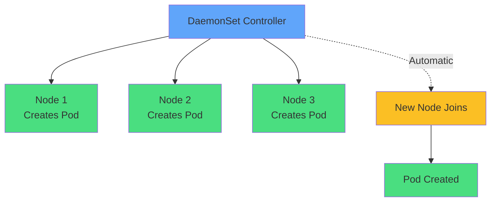

</div>

<!--
METADATA:
sentence: You'll find them managing node-level services like monitoring agents, log collectors, and network plugins.
search_anchor: node-level services like monitoring agents
-->
<div v-click="2" class="mt-8 text-center">
<carbon-network-overlay class="inline-block text-4xl text-blue-400" />
<strong class="ml-2">Specialized Pod controller for node-level services</strong>
</div>

<!--
METADATA:
sentence: While you'll use Deployments for most applications, DaemonSets are essential when you need to run a component on every node, or when your application needs to interact directly with node resources.
search_anchor: run a component on every node
-->
<div v-click="3" class="mt-6 text-center text-sm opacity-80">
Critical for infrastructure: monitoring agents, log collectors, network plugins
</div>

---
layout: center
---

# What Makes DaemonSets Different

<!--
METADATA:
sentence: Let me explain what makes DaemonSets unique compared to other Pod controllers.
search_anchor: what makes DaemonSets unique
-->
<div v-click="1">

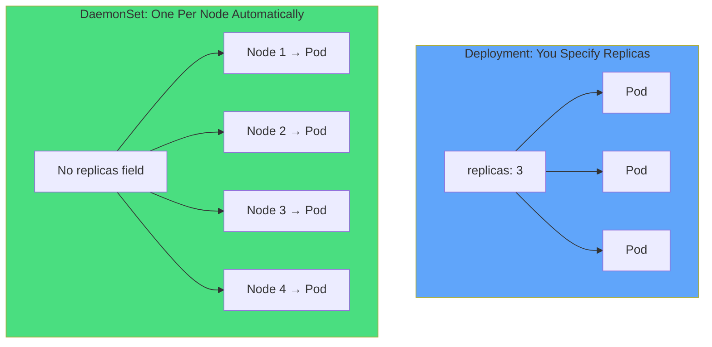

</div>

<!--
METADATA:
sentence: Creating a Pod when a new node joins the cluster
search_anchor: Creating a Pod when a new node joins
-->
<div v-click="2" class="mt-8 text-center text-lg">
<carbon-add class="inline-block text-2xl text-green-400" /> Add node → Pod created automatically
</div>

<!--
METADATA:
sentence: Removing the Pod when a node is removed
search_anchor: Removing the Pod when a node is removed
-->
<div v-click="3" class="mt-4 text-center text-lg">
<carbon-subtract class="inline-block text-2xl text-red-400" /> Remove node → Pod deleted automatically
</div>

<!--
METADATA:
sentence: Ensuring exactly one Pod per node, never more, never less
search_anchor: Ensuring exactly one Pod per node
-->
<div v-click="4" class="mt-4 text-center text-lg">
<carbon-checkmark class="inline-block text-2xl text-blue-400" /> Exactly one Pod per node, never more, never less
</div>

---
layout: center
---

# The "Daemon" Analogy

<!--
METADATA:
sentence: In a cluster with 3 nodes, a DaemonSet creates 3 Pods.
search_anchor: cluster with 3 nodes, a DaemonSet creates 3 Pods
-->
<div v-click="1">

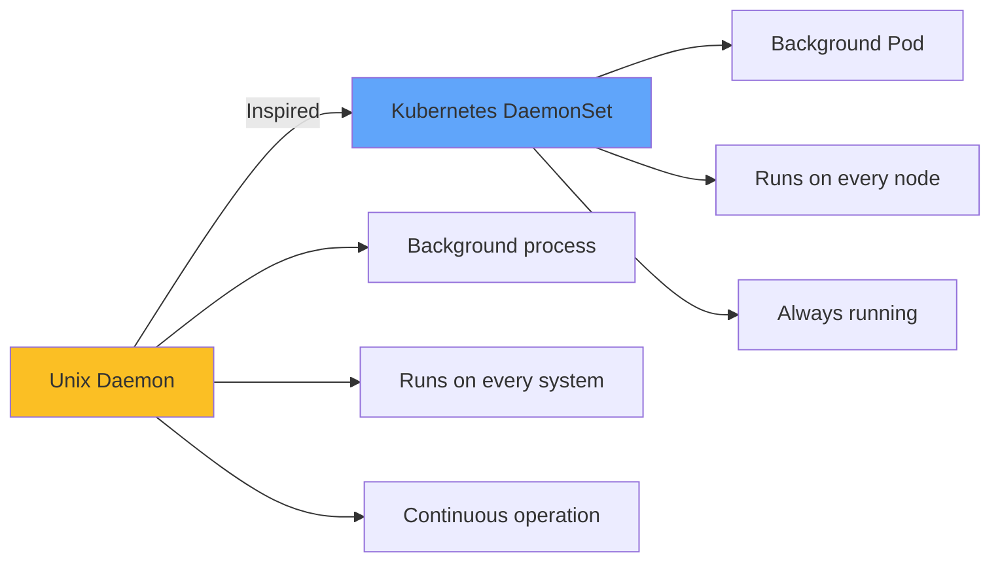

</div>

<!--
METADATA:
sentence: The name comes from Unix daemons - background processes that run continuously on every system.
search_anchor: Unix daemons - background processes
-->
<div v-click="2" class="mt-8 text-center">
<carbon-container-software class="inline-block text-5xl text-purple-400" />
</div>

<!--
METADATA:
sentence: Similarly, DaemonSet Pods are background services running on every Kubernetes node.
search_anchor: background services running on every Kubernetes node
-->
<div v-click="3" class="mt-6 text-center text-xl">
<strong>Background services running continuously on every Kubernetes node</strong>
</div>

---
layout: center
---

# Common DaemonSet Use Cases

<!--
METADATA:
sentence: Let's look at the real-world scenarios where DaemonSets are the right choice.
search_anchor: real-world scenarios where DaemonSets are the right choice
-->
<div v-click="1">

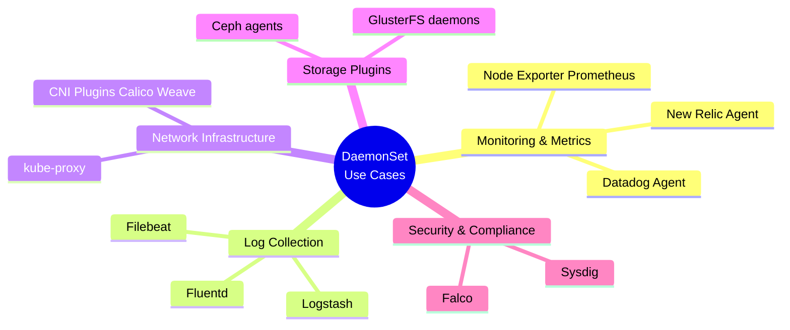

</div>

<!--
METADATA:
sentence: If your application needs to work with node-level resources (logs, metrics, network, storage), consider a DaemonSet.
search_anchor: work with node-level resources
-->
<div v-click="2" class="mt-8 text-center text-lg">
<carbon-rule class="inline-block text-3xl text-yellow-400" /> <strong>Common Pattern:</strong> Node-level resources require DaemonSets
</div>

---
layout: center
---

# Why These Use Cases Need DaemonSets

<div class="grid grid-cols-2 gap-6">
<!--
METADATA:
sentence: Monitoring agents need to run on every node to collect complete cluster metrics.
search_anchor: Monitoring agents need to run on every node
-->
<div v-click="1">
<carbon-dashboard class="text-5xl text-blue-400 mb-2" />
<strong>Monitoring Agents</strong><br/>
<span class="text-sm opacity-80">Collect metrics from every node<br/>Complete cluster visibility</span>
</div>

<!--
METADATA:
sentence: Log collectors need access to node-level log directories and must run wherever containers are running.
search_anchor: Log collectors need access to node-level log directories
-->
<div v-click="2">
<carbon-document class="text-5xl text-green-400 mb-2" />
<strong>Log Collectors</strong><br/>
<span class="text-sm opacity-80">Access node-level log directories<br/>Run wherever containers run</span>
</div>

<!--
METADATA:
sentence: Network plugins must operate at the node level to configure networking for all Pods.
search_anchor: Network plugins must operate at the node level
-->
<div v-click="3">
<carbon-network-3 class="text-5xl text-purple-400 mb-2" />
<strong>Network Plugins</strong><br/>
<span class="text-sm opacity-80">Configure networking per node<br/>Manage pod communication</span>
</div>

<!--
METADATA:
sentence: Security tools need to monitor all activity on every node.
search_anchor: Security tools need to monitor all activity
-->
<div v-click="4">
<carbon-security class="text-5xl text-red-400 mb-2" />
<strong>Security Tools</strong><br/>
<span class="text-sm opacity-80">Monitor all node activity<br/>Runtime security everywhere</span>
</div>
</div>

---
layout: center
---

# DaemonSets vs Deployments

<!--
METADATA:
sentence: Understanding when to use each controller is crucial for the CKAD exam. Let's compare them side by side.
search_anchor: Understanding when to use each controller
-->
<div v-click="1">

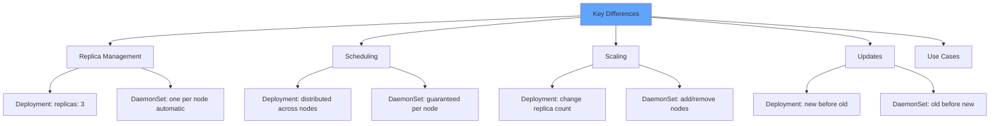

</div>

---
layout: center
---

# When to Use Which Controller

<!--
METADATA:
sentence: Web application serving traffic? → Deployment
search_anchor: Web application serving traffic
-->
<div v-click="1">

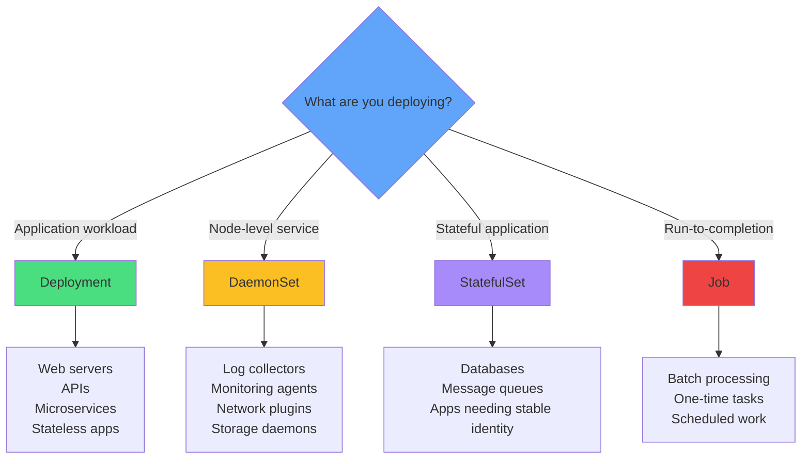

</div>

---
layout: center
---

# Node Selection: Run on All Nodes (Default)

<!--
METADATA:
sentence: One of DaemonSet's most useful features is the ability to target specific nodes. Let me explain the three approaches.
search_anchor: ability to target specific nodes
-->
<div v-click="1">

```yaml
apiVersion: apps/v1
kind: DaemonSet
metadata:
  name: monitoring-agent
spec:
  selector:
    matchLabels:
      app: monitoring
  template:
    metadata:
      labels:
        app: monitoring
    spec:
      containers:
      - name: agent
        image: monitoring-agent:v1
```

</div>

<!--
METADATA:
sentence: No node selection criteria - runs everywhere.
search_anchor: No node selection criteria - runs everywhere
-->
<div v-click="2" class="mt-8 text-center text-lg">
<carbon-network-overlay class="inline-block text-3xl text-blue-400" /> No selection criteria → Runs on every node in the cluster
</div>

---
layout: center
---

# Node Selection: nodeSelector (Simple Filtering)

<!--
METADATA:
sentence: Use node labels to target specific nodes:
search_anchor: Use node labels to target specific nodes
-->
<div v-click="1">

```yaml
spec:
  template:
    spec:
      nodeSelector:
        disktype: ssd
      containers:
      - name: storage-agent
        image: storage-agent:v1
```

</div>

<!--
METADATA:
sentence: Pods only run on nodes labeled `disktype=ssd`.
search_anchor: Pods only run on nodes labeled
-->
<div v-click="2">

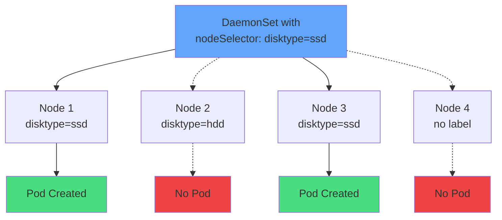

</div>

<!--
METADATA:
sentence: Deploy a DaemonSet only to GPU nodes, or only to production nodes, or only to nodes with SSDs.
search_anchor: GPU nodes, or only to production nodes
-->
<div v-click="3" class="mt-6 text-center">
<strong>Use Cases:</strong> GPU nodes, SSD nodes, production nodes
</div>

---
layout: center
---

# Node Selection: Tolerations (Special Nodes)

<!--
METADATA:
sentence: Some nodes have taints that prevent normal Pod scheduling (like master nodes).
search_anchor: taints that prevent normal Pod scheduling
-->
<div v-click="1">

```yaml
spec:
  template:
    spec:
      tolerations:
      - key: node-role.kubernetes.io/master
        effect: NoSchedule
      containers:
      - name: network-plugin
        image: calico:v1
```

</div>

<!--
METADATA:
sentence: DaemonSets can use tolerations to run on these nodes:
search_anchor: DaemonSets can use tolerations
-->
<div v-click="2">

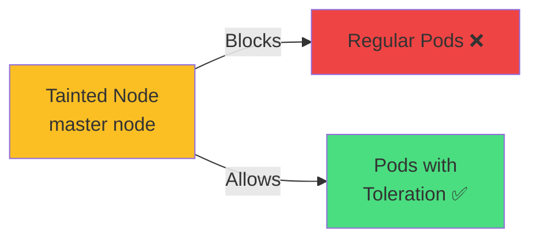

</div>

<!--
METADATA:
sentence: Deploy monitoring or networking DaemonSets that need to run even on control plane nodes.
search_anchor: run even on control plane nodes
-->
<div v-click="3" class="mt-8 text-center">
<carbon-security class="inline-block text-3xl text-blue-400" />
<strong class="ml-2">Run monitoring/networking even on control plane nodes</strong>
</div>

---
layout: center
---

# Dynamic Node Selection

<!--
METADATA:
sentence: When you label a node, matching DaemonSets automatically create Pods on it.
search_anchor: When you label a node
-->
<div v-click="1">

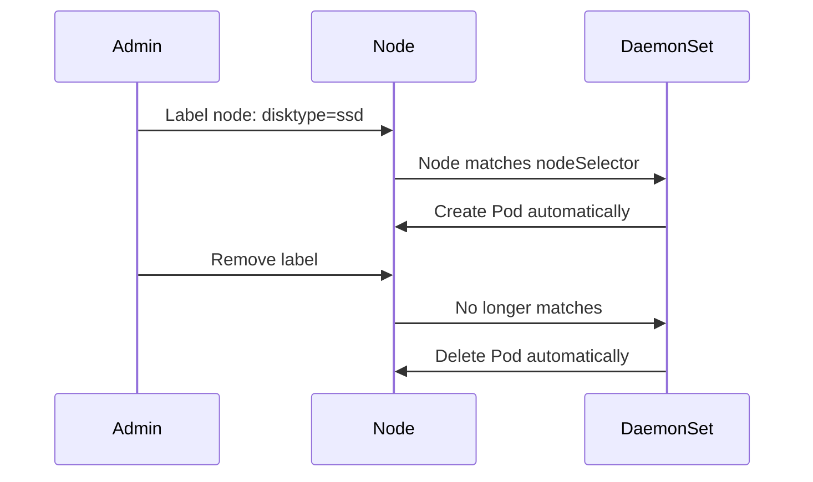

</div>

<!--
METADATA:
sentence: When you label a node, matching DaemonSets automatically create Pods on it.
search_anchor: label a node, matching DaemonSets automatically create Pods
-->
<div v-click="2" class="mt-8 text-center text-lg">
<carbon-tag class="inline-block text-3xl text-green-400" /> Label a node → DaemonSet creates Pod automatically
</div>

<!--
METADATA:
sentence: When you remove a label, the DaemonSet removes its Pod from that node.
search_anchor: remove a label, the DaemonSet removes its Pod
-->
<div v-click="3" class="mt-4 text-center text-lg">
<carbon-close class="inline-block text-3xl text-red-400" /> Remove label → DaemonSet removes Pod automatically
</div>

---
layout: center
---

# HostPath Volumes and Node Access

<!--
METADATA:
sentence: DaemonSets commonly need access to node resources, which is achieved through HostPath volumes. Let me explain this important pattern.
search_anchor: access to node resources, which is achieved through HostPath volumes
-->
<div v-click="1">

```yaml
volumes:
- name: varlog
  hostPath:
    path: /var/log
    type: Directory
```

</div>

<!--
METADATA:
sentence: A HostPath volume mounts a directory or file from the node's filesystem directly into the Pod:
search_anchor: HostPath volume mounts a directory or file
-->
<div v-click="2">

```mermaid
graph TB
    H[Host Node Filesystem]
    H --> V1[/var/log<br/>Container logs]
    H --> V2[/proc<br/>System metrics]
    H --> V3[/sys<br/>Hardware info]
    H --> V4[/var/run/docker.sock<br/>Container runtime]

    V1 --> P[Pod Container]
    V2 --> P
    V3 --> P
    V4 --> P

    style H fill:#60a5fa
    style P fill:#4ade80
```

</div>

<!--
METADATA:
sentence: This gives the Pod access to the node's `/var/log` directory.
search_anchor: gives the Pod access to the node's
-->
<div v-click="3" class="mt-6 text-center text-sm opacity-80">
HostPath volumes mount node directories directly into Pods
</div>

---
layout: center
---

# Common HostPath Use Cases

<div class="grid grid-cols-2 gap-6">
<!--
METADATA:
sentence: Access node and container logs.
search_anchor: Access node and container logs
-->
<div v-click="1">
<carbon-document class="text-4xl text-blue-400 mb-2" />
<strong>Log Collection</strong>
```yaml
hostPath:
  path: /var/log
  type: Directory
```
<span class="text-sm opacity-80">Access node and container logs</span>
</div>

<!--
METADATA:
sentence: Interact with the container runtime (for monitoring or management).
search_anchor: Interact with the container runtime
-->
<div v-click="2">
<carbon-container-software class="text-4xl text-green-400 mb-2" />
<strong>Container Runtime</strong>
```yaml
hostPath:
  path: /var/run/docker.sock
  type: Socket
```
<span class="text-sm opacity-80">Interact with Docker daemon</span>
</div>

<!--
METADATA:
sentence: Collect system-level metrics.
search_anchor: Collect system-level metrics
-->
<div v-click="3">
<carbon-dashboard class="text-4xl text-purple-400 mb-2" />
<strong>System Metrics</strong>
```yaml
hostPath:
  path: /proc
  type: Directory
```
<span class="text-sm opacity-80">Collect system-level metrics</span>
</div>

<!--
METADATA:
sentence: Hardware and kernel data
search_anchor: Hardware and kernel data
-->
<div v-click="4">
<carbon-chart-line class="text-4xl text-yellow-400 mb-2" />
<strong>Hardware Info</strong>
```yaml
hostPath:
  path: /sys
  type: Directory
```
<span class="text-sm opacity-80">Hardware and kernel data</span>
</div>
</div>

---
layout: center
---

# HostPath Security Considerations

<!--
METADATA:
sentence: HostPath volumes are powerful but potentially dangerous:
search_anchor: HostPath volumes are powerful but potentially dangerous
-->
<div v-click="1">

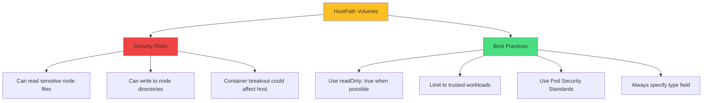

</div>

<!--
METADATA:
sentence: Container breakout could affect the host
search_anchor: Container breakout could affect the host
-->
<div v-click="2" class="mt-8 text-center text-red-400">
<carbon-warning class="inline-block text-3xl" /> <strong>HostPath volumes are powerful but potentially dangerous!</strong>
</div>

---
layout: center
---

# HostPath Types

<div class="grid grid-cols-2 gap-6 text-sm">
<!--
METADATA:
sentence: Directory - must exist as a directory
search_anchor: Directory - must exist as a directory
-->
<div v-click="1">
<carbon-folder class="text-4xl text-blue-400 mb-2" />
<strong>Directory</strong>
```yaml
type: Directory
```
Must exist as a directory
</div>

<!--
METADATA:
sentence: DirectoryOrCreate - create if doesn't exist
search_anchor: DirectoryOrCreate - create if doesn't exist
-->
<div v-click="2">
<carbon-folder-add class="text-4xl text-green-400 mb-2" />
<strong>DirectoryOrCreate</strong>
```yaml
type: DirectoryOrCreate
```
Create if doesn't exist
</div>

<!--
METADATA:
sentence: File - must exist as a file
search_anchor: File - must exist as a file
-->
<div v-click="3">
<carbon-document class="text-4xl text-purple-400 mb-2" />
<strong>File</strong>
```yaml
type: File
```
Must exist as a file
</div>

<!--
METADATA:
sentence: Socket - must exist as a Unix socket
search_anchor: Socket - must exist as a Unix socket
-->
<div v-click="4">
<carbon-network-3 class="text-4xl text-yellow-400 mb-2" />
<strong>Socket</strong>
```yaml
type: Socket
```
Must exist as a Unix socket
</div>
</div>

---
layout: center
---

# Update Strategies: RollingUpdate (Default)

<!--
METADATA:
sentence: DaemonSets support two update strategies that control how Pods are replaced during updates. Understanding these is critical.
search_anchor: two update strategies that control how Pods are replaced
-->
<div v-click="1">

```yaml
spec:
  updateStrategy:
    type: RollingUpdate
    rollingUpdate:
      maxUnavailable: 1
```

</div>

<!--
METADATA:
sentence: When you update the DaemonSet spec, Pods are automatically replaced:
search_anchor: When you update the DaemonSet spec
-->
<div v-click="2">

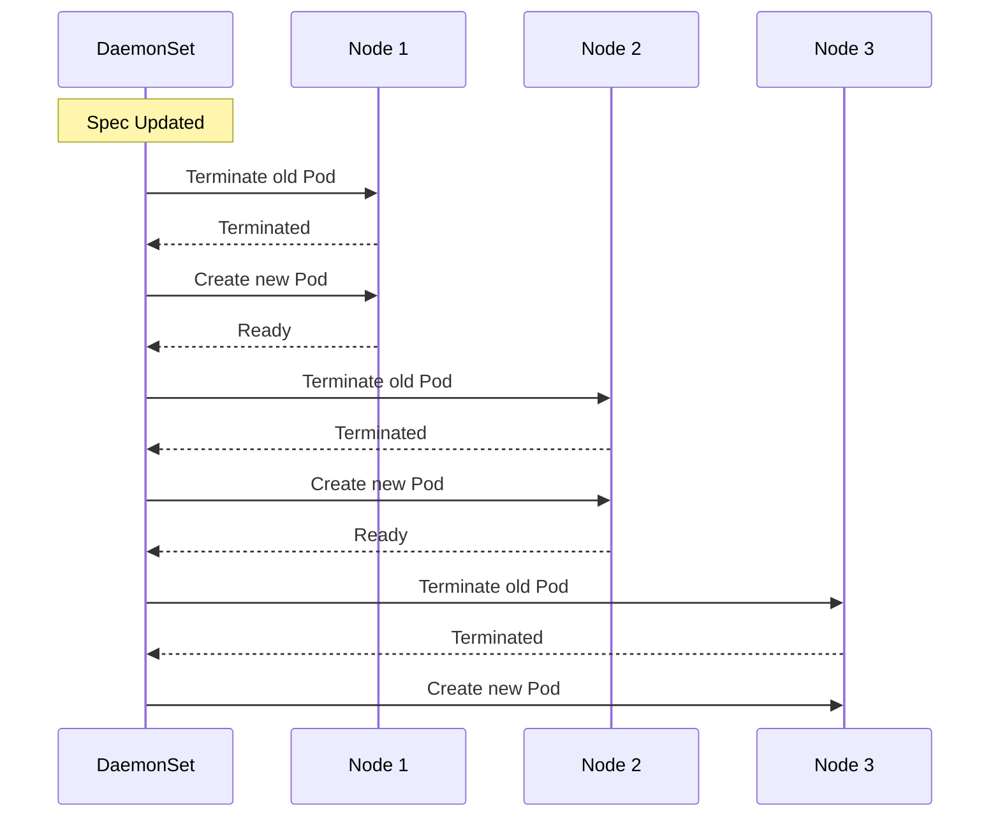

</div>

<!--
METADATA:
sentence: DaemonSets terminate the old Pod before starting the new one on each node.
search_anchor: terminate the old Pod before starting the new one
-->
<div v-click="3" class="mt-6 text-center text-red-400">
<carbon-warning class="inline-block text-2xl" /> <strong>Critical:</strong> Terminates old Pod BEFORE creating new one (unlike Deployments!)
</div>

---
layout: center
---

# maxUnavailable Control

<!--
METADATA:
sentence: maxUnavailable: Controls how many nodes can have their Pod missing during update.
search_anchor: Controls how many nodes can have their Pod missing
-->
<div v-click="1">

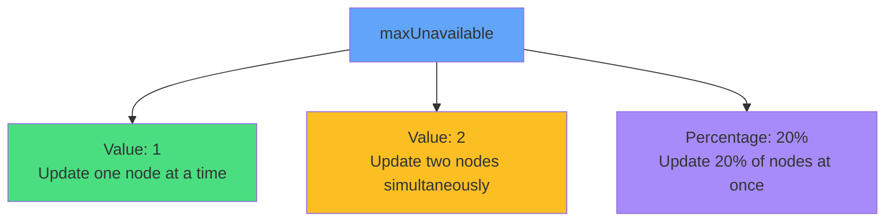

</div>

<!--
METADATA:
sentence: Value of `1` means update one node at a time
search_anchor: Value of `1` means update one node at a time
-->
<div v-click="2" class="mt-8 text-center">
<strong>Controls update speed:</strong> How many nodes can have their Pod missing during update
</div>

<!--
METADATA:
sentence: This means DaemonSet updates can cause brief service interruptions per node.
search_anchor: brief service interruptions per node
-->
<div v-click="3" class="mt-6 text-center text-sm opacity-80">
Brief service interruption per node is possible during updates
</div>

---
layout: center
---

# Update Strategies: OnDelete (Manual Control)

<!--
METADATA:
sentence: With OnDelete, updates don't happen automatically:
search_anchor: OnDelete, updates don't happen automatically
-->
<div v-click="1">

```yaml
spec:
  updateStrategy:
    type: OnDelete
```

</div>

<!--
METADATA:
sentence: You update the DaemonSet spec
search_anchor: You update the DaemonSet spec
-->
<div v-click="2">

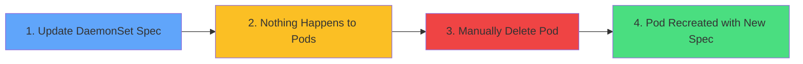

</div>

<!--
METADATA:
sentence: Each deleted Pod is recreated with the new spec
search_anchor: Each deleted Pod is recreated with the new spec
-->
<div v-click="3" class="mt-8 text-center">
<strong>You control when each Pod updates by manually deleting it</strong>
</div>

---
layout: center
---

# OnDelete Use Cases

<div class="grid grid-cols-2 gap-6">
<!--
METADATA:
sentence: Critical infrastructure where you want to control update timing
search_anchor: Critical infrastructure where you want to control update timing
-->
<div v-click="1">
<carbon-rule class="text-4xl text-blue-400 mb-2" />
<strong>Critical Infrastructure</strong><br/>
<span class="text-sm opacity-80">Control update timing for<br/>mission-critical services</span>
</div>

<!--
METADATA:
sentence: Maintenance windows for specific nodes
search_anchor: Maintenance windows for specific nodes
-->
<div v-click="2">
<carbon-timer class="text-4xl text-green-400 mb-2" />
<strong>Maintenance Windows</strong><br/>
<span class="text-sm opacity-80">Update nodes during<br/>scheduled maintenance</span>
</div>

<!--
METADATA:
sentence: Testing updates on one node before rolling out cluster-wide
search_anchor: Testing updates on one node before rolling out
-->
<div v-click="3">
<carbon-test-tool class="text-4xl text-purple-400 mb-2" />
<strong>Testing Updates</strong><br/>
<span class="text-sm opacity-80">Test on one node before<br/>rolling out cluster-wide</span>
</div>

<!--
METADATA:
sentence: Coordinating updates with external systems
search_anchor: Coordinating updates with external systems
-->
<div v-click="4">
<carbon-network-overlay class="text-4xl text-yellow-400 mb-2" />
<strong>External Coordination</strong><br/>
<span class="text-sm opacity-80">Coordinate with external<br/>systems or databases</span>
</div>
</div>

<!--
METADATA:
sentence: If a question asks for "manual control over Pod updates" or "one node at a time at your discretion," use `updateStrategy.type: OnDelete`.
search_anchor: manual control over Pod updates
-->
<div v-click="5" class="mt-8 text-center text-sm">
<carbon-idea class="inline-block text-2xl text-yellow-400" /> <strong>Exam Tip:</strong> "Manual control over Pod updates" = OnDelete
</div>

---
layout: center
---

# Init Containers in DaemonSets

<!--
METADATA:
sentence: Init containers are frequently used with DaemonSets to prepare the node environment before the main container starts.
search_anchor: prepare the node environment before the main container starts
-->
<div v-click="1">

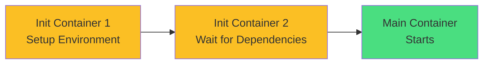

</div>

<!--
METADATA:
sentence: Init containers run to completion before the main container starts, ensuring the environment is properly prepared.
search_anchor: Init containers run to completion before the main container starts
-->
<div v-click="2" class="mt-8 text-center">
Init containers prepare the node environment before the main container starts
</div>

<div class="grid grid-cols-3 gap-4 mt-6 text-sm">
<!--
METADATA:
sentence: Configure kernel parameters or system settings.
search_anchor: Configure kernel parameters or system settings
-->
<div v-click="3" class="text-center">
<carbon-settings class="text-3xl text-blue-400 mb-2" />
<strong>Setup Host Config</strong><br/>
Configure kernel parameters
</div>

<!--
METADATA:
sentence: Ensure required services are available before starting.
search_anchor: Ensure required services are available
-->
<div v-click="4" class="text-center">
<carbon-time class="text-3xl text-green-400 mb-2" />
<strong>Wait for Dependencies</strong><br/>
Ensure services available
</div>

<!--
METADATA:
sentence: Retrieve configuration files before the main application starts.
search_anchor: Retrieve configuration files before the main application starts
-->
<div v-click="5" class="text-center">
<carbon-download class="text-3xl text-purple-400 mb-2" />
<strong>Download Config</strong><br/>
Fetch configuration files
</div>
</div>

---
layout: center
---

# Init Container Patterns

<!--
METADATA:
sentence: Pattern 1: Setup Host Configuration
search_anchor: Pattern 1: Setup Host Configuration
-->
<div v-click="1" class="mb-4 text-sm">

**Pattern 1: Setup Host Configuration**
```yaml
initContainers:
- name: setup
  image: busybox
  command: ['sh', '-c', 'sysctl -w net.ipv4.ip_forward=1']
  securityContext:
    privileged: true
```

</div>

<!--
METADATA:
sentence: Pattern 2: Wait for Dependencies
search_anchor: Pattern 2: Wait for Dependencies
-->
<div v-click="2" class="mb-4 text-sm">

**Pattern 2: Wait for Dependencies**
```yaml
initContainers:
- name: wait-for-service
  image: busybox
  command: ['sh', '-c', 'until nslookup myservice; do sleep 2; done']
```

</div>

<!--
METADATA:
sentence: Pattern 3: Download Configuration
search_anchor: Pattern 3: Download Configuration
-->
<div v-click="3" class="text-sm">

**Pattern 3: Download Configuration**
```yaml
initContainers:
- name: fetch-config
  image: busybox
  command: ['sh', '-c', 'wget http://config-server/config -O /config/app.conf']
  volumeMounts:
  - name: config
    mountPath: /config
```

</div>

---
layout: center
---

# DaemonSet Lifecycle

<!--
METADATA:
sentence: Understanding DaemonSet lifecycle behavior helps with troubleshooting and exam scenarios.
search_anchor: Understanding DaemonSet lifecycle behavior
-->
<div v-click="1">

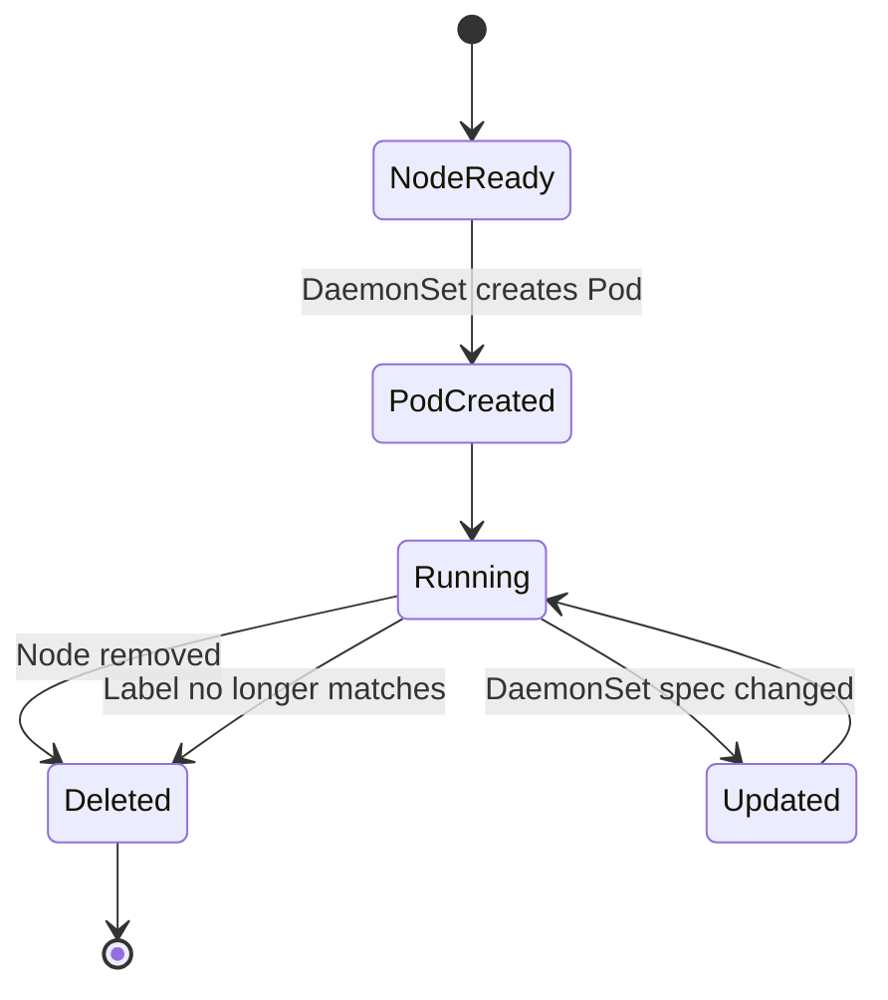

</div>

<!--
METADATA:
sentence: When a node becomes Ready, controller creates a Pod for it
search_anchor: When a node becomes Ready, controller creates a Pod
-->
<div v-click="2" class="mt-8 text-center">
<strong>Pod Creation:</strong> When node becomes Ready, controller creates Pod for it
</div>

<!--
METADATA:
sentence: Node unavailable, label changes, or DaemonSet deleted
search_anchor: Node unavailable, label changes, or DaemonSet deleted
-->
<div v-click="3" class="mt-4 text-center">
<strong>Pod Deletion:</strong> Node unavailable, label changes, or DaemonSet deleted
</div>

<!--
METADATA:
sentence: If a DaemonSet Pod is manually deleted, it's immediately recreated by the controller.
search_anchor: DaemonSet Pod is manually deleted
-->
<div v-click="4" class="mt-4 text-center text-sm opacity-80">
Manually deleted Pods are immediately recreated
</div>

---
layout: center
---

# CKAD Exam Relevance

<!--
METADATA:
sentence: DaemonSets are supplementary material for CKAD, similar to StatefulSets. Let's focus on what you need to know.
search_anchor: DaemonSets are supplementary material for CKAD
-->
<div v-click="1" class="text-center mb-6">
<carbon-certificate class="inline-block text-6xl text-blue-400" />
</div>

<!--
METADATA:
sentence: Approximately 1-2 questions may involve DaemonSets, typically in the "Application Deployment" domain.
search_anchor: Approximately 1-2 questions may involve DaemonSets
-->
<div v-click="2" class="text-center text-yellow-400 mb-6">
<strong>Exam Weight:</strong> 1-2 questions (supplementary material)
</div>

<div class="grid grid-cols-2 gap-4 text-sm">
<!--
METADATA:
sentence: No replicas field - automatic one-per-node
search_anchor: No replicas field - automatic one-per-node
-->
<div v-click="3">
<carbon-checkmark class="inline-block text-2xl text-green-400" /> <strong>Core Concepts:</strong> one-per-node, no replicas field
</div>

<!--
METADATA:
sentence: Update strategies: RollingUpdate vs OnDelete
search_anchor: Update strategies: RollingUpdate vs OnDelete
-->
<div v-click="4">
<carbon-renew class="inline-block text-2xl text-green-400" /> <strong>Update Strategies:</strong> RollingUpdate vs OnDelete
</div>

<!--
METADATA:
sentence: Node selection with nodeSelector
search_anchor: Node selection with nodeSelector
-->
<div v-click="5">
<carbon-filter class="inline-block text-2xl text-green-400" /> <strong>Node Selection:</strong> nodeSelector targeting
</div>

<!--
METADATA:
sentence: Configure HostPath volumes
search_anchor: Configure HostPath volumes
-->
<div v-click="6">
<carbon-data-volume class="inline-block text-2xl text-green-400" /> <strong>HostPath Volumes:</strong> node resource access
</div>

<!--
METADATA:
sentence: Implement init containers
search_anchor: Implement init containers
-->
<div v-click="7">
<carbon-settings class="inline-block text-2xl text-green-400" /> <strong>Init Containers:</strong> setup tasks
</div>

<!--
METADATA:
sentence: kubectl get daemonset
search_anchor: kubectl get daemonset
-->
<div v-click="8">
<carbon-terminal class="inline-block text-2xl text-yellow-400" /> <strong>Commands:</strong> kubectl get/describe ds
</div>
</div>

<!--
METADATA:
sentence: You should be able to create one in 3-4 minutes.
search_anchor: create one in 3-4 minutes
-->
<div v-click="9" class="mt-6 text-center text-lg">
<carbon-timer class="inline-block text-2xl text-red-400" /> <strong>Time Target:</strong> Create in 3-4 minutes
</div>

---
layout: center
---

# Common Exam Scenarios

<div class="grid grid-cols-2 gap-6">
<!--
METADATA:
sentence: Deploy a log collector to all nodes
search_anchor: Deploy a log collector to all nodes
-->
<div v-click="1">
<carbon-document class="text-4xl text-blue-400 mb-2" />
<strong>Deploy Log Collector</strong><br/>
<span class="text-sm opacity-80">Fluentd DaemonSet to all nodes<br/>HostPath: /var/log</span>
</div>

<!--
METADATA:
sentence: Create a monitoring agent DaemonSet
search_anchor: Create a monitoring agent DaemonSet
-->
<div v-click="2">
<carbon-dashboard class="text-4xl text-green-400 mb-2" />
<strong>Monitoring Agent</strong><br/>
<span class="text-sm opacity-80">Create Node Exporter DaemonSet<br/>HostPath: /proc, /sys</span>
</div>

<!--
METADATA:
sentence: Troubleshoot a DaemonSet not scheduling on certain nodes
search_anchor: Troubleshoot a DaemonSet not scheduling
-->
<div v-click="3">
<carbon-debug class="text-4xl text-purple-400 mb-2" />
<strong>Troubleshoot Scheduling</strong><br/>
<span class="text-sm opacity-80">Why not on certain nodes?<br/>Check nodeSelector/taints</span>
</div>

<!--
METADATA:
sentence: Update a DaemonSet with manual control
search_anchor: Update a DaemonSet with manual control
-->
<div v-click="4">
<carbon-edit class="text-4xl text-yellow-400 mb-2" />
<strong>Manual Update Control</strong><br/>
<span class="text-sm opacity-80">Use OnDelete strategy<br/>Control update timing</span>
</div>
</div>

---
layout: center
---

# Quick Commands Reference

<div class="grid grid-cols-2 gap-6 text-sm">
<!--
METADATA:
sentence: kubectl get daemonset      # or 'ds'
search_anchor: kubectl get daemonset
-->
<div v-click="1">
<carbon-view class="text-3xl text-blue-400 mb-2" />
<strong>List DaemonSets</strong>
```bash
kubectl get daemonset
kubectl get ds  # Shorthand
```
</div>

<!--
METADATA:
sentence: kubectl describe ds <name>
search_anchor: kubectl describe ds
-->
<div v-click="2">
<carbon-document class="text-3xl text-green-400 mb-2" />
<strong>Describe DaemonSet</strong>
```bash
kubectl describe ds <name>
```
</div>

<!--
METADATA:
sentence: kubectl rollout status ds/<name>
search_anchor: kubectl rollout status ds
-->
<div v-click="3">
<carbon-renew class="text-3xl text-purple-400 mb-2" />
<strong>Rollout Status</strong>
```bash
kubectl rollout status ds/<name>
```
</div>

<!--
METADATA:
sentence: kubectl rollout undo ds/<name>
search_anchor: kubectl rollout undo ds
-->
<div v-click="4">
<carbon-undo class="text-3xl text-yellow-400 mb-2" />
<strong>Rollback</strong>
```bash
kubectl rollout undo ds/<name>
```
</div>
</div>

---
layout: center
---

# Key Differences from Other Controllers

<!--
METADATA:
sentence: Let's summarize how DaemonSets compare to other Pod controllers to solidify your understanding.
search_anchor: how DaemonSets compare to other Pod controllers
-->
<div v-click="1">

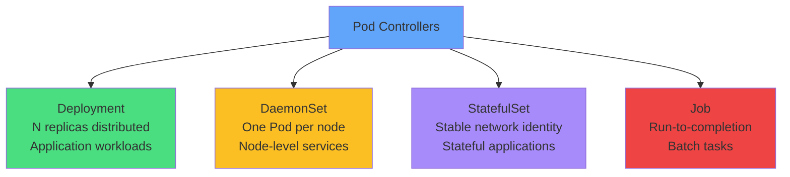

</div>

<!--
METADATA:
sentence: Does it need to run on every node? → Likely DaemonSet
search_anchor: Does it need to run on every node
-->
<div v-click="2" class="mt-8 text-center text-lg">
<carbon-rule class="inline-block text-3xl text-blue-400" /> <strong>Decision Rule:</strong> Node-level resources → DaemonSet
</div>

---
layout: center
---

# Summary

<!--
METADATA:
sentence: Let's recap the essential concepts about DaemonSets for the CKAD exam.
search_anchor: essential concepts about DaemonSets for the CKAD exam
-->
<div v-click="1">

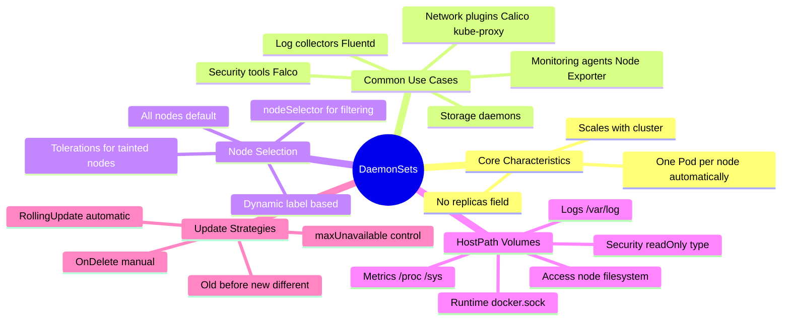

</div>

---
layout: center
---

# Key Takeaways

<div class="grid grid-cols-2 gap-6 mt-6">
<!--
METADATA:
sentence: One Pod per node - automatically maintained by the controller
search_anchor: One Pod per node - automatically maintained
-->
<div v-click="1">
<carbon-network-overlay class="text-4xl text-blue-400 mb-2" />
<strong>One Pod per node</strong><br/>
<span class="text-sm opacity-80">Automatic - no replicas field</span>
</div>

<!--
METADATA:
sentence: Node-level services - monitoring, logging, networking, storage
search_anchor: Node-level services - monitoring, logging, networking, storage
-->
<div v-click="2">
<carbon-dashboard class="text-4xl text-green-400 mb-2" />
<strong>Node-level services</strong><br/>
<span class="text-sm opacity-80">Monitoring, logging, networking</span>
</div>

<!--
METADATA:
sentence: HostPath volumes - commonly used for node resource access
search_anchor: HostPath volumes - commonly used for node resource access
-->
<div v-click="3">
<carbon-data-volume class="text-4xl text-purple-400 mb-2" />
<strong>HostPath volumes</strong><br/>
<span class="text-sm opacity-80">Access node resources securely</span>
</div>

<!--
METADATA:
sentence: Different update behavior - terminates old Pod before creating new one
search_anchor: terminates old Pod before creating new one
-->
<div v-click="4">
<carbon-renew class="text-4xl text-yellow-400 mb-2" />
<strong>Different update behavior</strong><br/>
<span class="text-sm opacity-80">Terminates old Pod first</span>
</div>
</div>

<!--
METADATA:
sentence: Simpler than StatefulSets, less common than Deployments
search_anchor: Simpler than StatefulSets, less common than Deployments
-->
<div v-click="5" class="mt-8 text-center text-lg">
<strong>Simpler than StatefulSets, less common than Deployments</strong>
</div>

<!--
METADATA:
sentence: In our next session, we'll work hands-on with DaemonSets, deploying real examples and exploring their behavior in a live cluster.
search_anchor: Ready for hands-on practice
-->
<div v-click="6" class="mt-4 text-center text-sm opacity-80">
Ready for hands-on practice! <carbon-arrow-right class="inline-block text-xl" />
</div>
