# Kubernetes Deployments

<div class="abs-br m-6 flex gap-2">
  <carbon-deployment-pattern class="text-6xl text-blue-400" />
</div>

<!--
METADATA:
sentence: Deployments are the workload controller you'll use most frequently in Kubernetes, and they're absolutely essential for the CKAD exam.
search_anchor: workload controller you'll use most frequently
-->
<div v-click class="mt-8 text-xl opacity-80">
The workload controller you'll use most frequently
</div>

---
layout: center
---

# Why Not Just Use Pods?

<!--
METADATA:
sentence: In the previous module, we learned about Pods - the smallest deployable unit in Kubernetes. So you might be wondering, why do we need Deployments?
search_anchor: why do we need Deployments
-->
<div v-click="1">

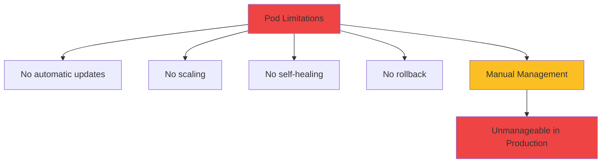

</div>

<div class="grid grid-cols-2 gap-6 mt-8 text-sm">
<!--
METADATA:
sentence: Release application updates without downtime
search_anchor: Release application updates without downtime
-->
<div v-click="2" class="text-center">
<carbon-renew class="text-4xl text-red-400 mb-2" />
<strong>Updates</strong><br/>
Manual Pod replacement
</div>
<!--
METADATA:
sentence: Scale your application up and down based on demand
search_anchor: Scale your application up and down
-->
<div v-click="3" class="text-center">
<carbon-arrow-up-right class="text-4xl text-red-400 mb-2" />
<strong>Scaling</strong><br/>
Create/delete manually
</div>
<!--
METADATA:
sentence: Recover automatically when something goes wrong
search_anchor: Recover automatically when something goes wrong
-->
<div v-click="4" class="text-center">
<carbon-restart class="text-4xl text-red-400 mb-2" />
<strong>Recovery</strong><br/>
No automatic restart
</div>
<!--
METADATA:
sentence: Roll back to previous versions when updates fail
search_anchor: Roll back to previous versions when updates fail
-->
<div v-click="5" class="text-center">
<carbon-undo class="text-4xl text-red-400 mb-2" />
<strong>Rollback</strong><br/>
No version tracking
</div>
</div>

---
layout: center
---

# What is a Deployment?

<!--
METADATA:
sentence: A Deployment is a Kubernetes controller - an object that manages other objects.
search_anchor: Deployment is a Kubernetes controller
-->
<div v-click="1">

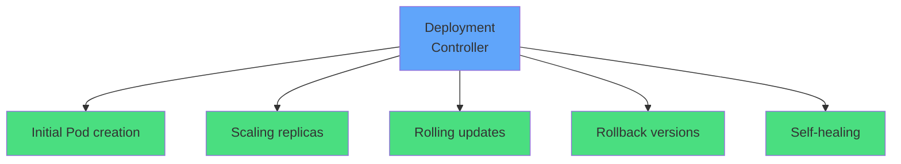

</div>

<!--
METADATA:
sentence: The key concept is declarative configuration. You tell Kubernetes what you want - "I want 3 replicas of this application" - and the Deployment controller works continuously to make that happen.
search_anchor: declarative configuration
-->
<div v-click="2" class="mt-8 text-center mb-4">
<carbon-deployment-pattern class="inline-block text-5xl text-blue-400" />
<div class="text-xl mt-2"><strong>Controller that manages Pods declaratively</strong></div>
</div>

<!--
METADATA:
sentence: You tell Kubernetes what you want - "I want 3 replicas of this application" - and the Deployment controller works continuously to make that happen.
search_anchor: Declare desired state
-->
<div v-click="3" class="text-center text-lg">
<carbon-idea class="inline-block text-3xl text-green-400" /> Declare desired state, Kubernetes makes it happen
</div>

---
layout: center
---

# The Role of ReplicaSets

<!--
METADATA:
sentence: Here's something important to understand: Deployments don't actually create Pods directly. Instead, they use another controller called a ReplicaSet.
search_anchor: Deployments don't actually create Pods directly
-->
<div v-click="1">

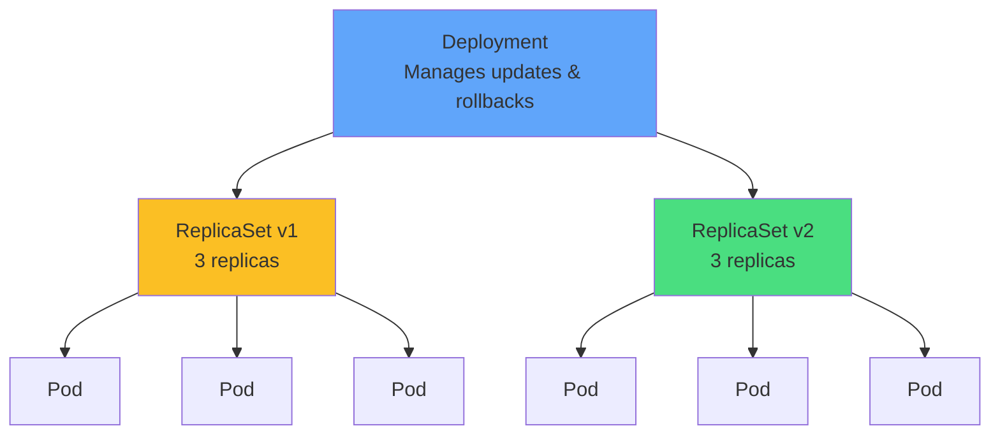

</div>

<!--
METADATA:
sentence: Deployment - Manages ReplicaSets, handles updates and rollbacks
search_anchor: Deployment - Manages ReplicaSets
-->
<div v-click="2" class="mt-6 text-center">
<strong>Deployment</strong> → manages ReplicaSets
</div>
<!--
METADATA:
sentence: ReplicaSet - Manages Pods, ensures the desired number of replicas
search_anchor: ReplicaSet - Manages Pods
-->
<div v-click="3" class="text-center">
<strong>ReplicaSet</strong> → ensures desired number of Pods
</div>
<!--
METADATA:
sentence: Pods - Run your containers
search_anchor: Pods - Run your containers
-->
<div v-click="4" class="text-center">
<strong>Pods</strong> → run your containers
</div>

<!--
METADATA:
sentence: You'll rarely work with ReplicaSets directly, but understanding this layered architecture explains how rolling updates work.
search_anchor: rarely work with ReplicaSets directly
-->
<div v-click="5" class="mt-6 text-center text-sm opacity-80">
You rarely work with ReplicaSets directly
</div>

---
layout: center
---

# Deployment Anatomy

<!--
METADATA:
sentence: Let's look at a basic Deployment specification.
search_anchor: basic Deployment specification
-->
<div v-click="1" class="mb-4">

```yaml
apiVersion: apps/v1
kind: Deployment
metadata:
  name: myapp
spec:
  replicas: 3
  selector:
    matchLabels:
      app: myapp
  template:
    metadata:
      labels:
        app: myapp
    spec:
      containers:
      - name: app
        image: myapp:v1
```

</div>

<div class="grid grid-cols-3 gap-4 text-sm">
<!--
METADATA:
sentence: selector - Defines which Pods this Deployment manages using label matching. This must match the labels in the Pod template.
search_anchor: selector - Defines which Pods
-->
<div v-click="2">
<carbon-filter class="inline-block text-2xl text-blue-400" /> <strong>selector:</strong> Which Pods to manage
</div>
<!--
METADATA:
sentence: replicas - The desired number of Pod copies. Default is 1 if not specified.
search_anchor: replicas - The desired number of Pod copies
-->
<div v-click="3">
<carbon-tag class="inline-block text-2xl text-green-400" /> <strong>replicas:</strong> Desired Pod count
</div>
<!--
METADATA:
sentence: template - The Pod template used to create new Pods. This is exactly the same Pod spec you learned in the Pods module, minus the name field since Deployments generate names automatically.
search_anchor: template - The Pod template
-->
<div v-click="4">
<carbon-document class="inline-block text-2xl text-purple-400" /> <strong>template:</strong> Pod specification
</div>
</div>

---
layout: center
---

# Scaling Applications

<!--
METADATA:
sentence: One of the primary features of Deployments is easy scaling.
search_anchor: easy scaling
-->
<div v-click="1">

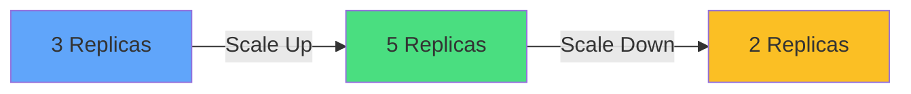

</div>

<!--
METADATA:
sentence: You can scale imperatively with kubectl commands for quick adjustments, or declaratively by updating the YAML specification.
search_anchor: scale imperatively with kubectl commands
-->
<div v-click="2" class="mt-8">

**Imperative (quick):**
```bash
kubectl scale deployment myapp --replicas=5
```

</div>

<!--
METADATA:
sentence: You can scale imperatively with kubectl commands for quick adjustments, or declaratively by updating the YAML specification.
search_anchor: declaratively by updating the YAML specification
-->
<div v-click="3" class="mt-4">

**Declarative (production):**
```yaml
spec:
  replicas: 5
```
```bash
kubectl apply -f deployment.yaml
```

</div>

<!--
METADATA:
sentence: Declarative scaling is preferred for production because your YAML files in source control always match what's running in the cluster.
search_anchor: source control always match
-->
<div v-click="4" class="mt-6 text-center text-green-400">
<carbon-checkmark class="inline-block text-2xl" /> Declarative = source control matches cluster state
</div>

---
layout: center
---

# Scaling Behavior

<!--
METADATA:
sentence: When you scale up: The Deployment tells the ReplicaSet to increase desired replicas
search_anchor: When you scale up
-->
<div v-click="1">

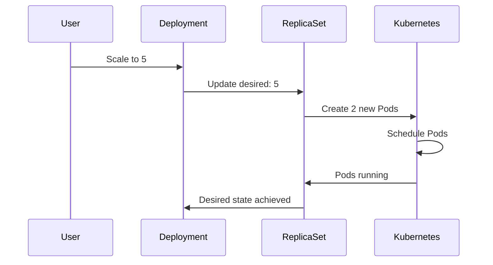

</div>

<div class="grid grid-cols-2 gap-6 mt-6 text-sm">
<!--
METADATA:
sentence: When you scale up: The Deployment tells the ReplicaSet to increase desired replicas. The ReplicaSet creates new Pods from the template. Kubernetes schedules them across available nodes.
search_anchor: scale up
-->
<div v-click="2" class="text-center">
<carbon-arrow-up-right class="text-4xl text-green-400 mb-2" />
<strong>Scale Up</strong><br/>
Create new Pods<br/>Schedule across nodes
</div>
<!--
METADATA:
sentence: When you scale down: The ReplicaSet terminates excess Pods gracefully. Applications receive termination signals to shut down cleanly. The Deployment ensures the correct number remains running.
search_anchor: When you scale down
-->
<div v-click="3" class="text-center">
<carbon-arrow-down-right class="text-4xl text-yellow-400 mb-2" />
<strong>Scale Down</strong><br/>
Terminate excess Pods<br/>Graceful shutdown
</div>
</div>

---
layout: center
---

# Rolling Updates

<!--
METADATA:
sentence: Rolling updates are where Deployments truly shine. This is the default strategy for releasing application updates.
search_anchor: default strategy for releasing application updates
-->
<div v-click="1">

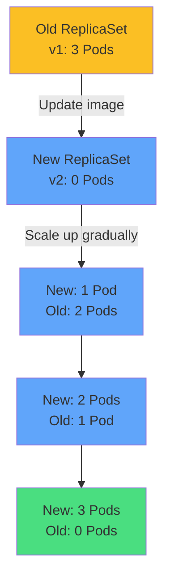

</div>

<!--
METADATA:
sentence: This provides zero-downtime deployments. Your users never experience an outage because some Pods are always serving traffic.
search_anchor: zero-downtime deployments
-->
<div v-click="2" class="mt-6 text-center text-lg">
<carbon-checkmark class="inline-block text-3xl text-green-400" /> Zero-downtime deployments
</div>

<!--
METADATA:
sentence: Your users never experience an outage because some Pods are always serving traffic.
search_anchor: some Pods are always serving traffic
-->
<div v-click="3" class="mt-4 text-center text-sm opacity-80">
Some Pods always available during updates
</div>

---
layout: center
---

# Rolling Update Configuration

<!--
METADATA:
sentence: You can control the rolling update behavior with two parameters:
search_anchor: control the rolling update behavior
-->
<div v-click="1" class="mb-4">

```yaml
spec:
  strategy:
    type: RollingUpdate
    rollingUpdate:
      maxSurge: 25%
      maxUnavailable: 25%
```

</div>

<!--
METADATA:
sentence: maxSurge - Maximum number of Pods above the desired count during updates. Default is 25%.
search_anchor: maxSurge - Maximum number of Pods
-->
<div v-click="2">

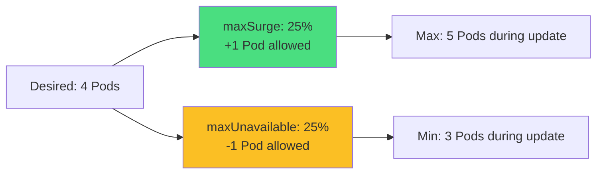

</div>

<div class="grid grid-cols-2 gap-6 mt-6 text-sm">
<!--
METADATA:
sentence: maxSurge - Maximum number of Pods above the desired count during updates. Default is 25%.
search_anchor: maxSurge
-->
<div v-click="3">
<carbon-arrow-up-right class="inline-block text-2xl text-green-400" /> <strong>maxSurge:</strong> Extra Pods above desired
</div>
<!--
METADATA:
sentence: maxUnavailable - Maximum number of Pods that can be unavailable during updates. Default is 25%.
search_anchor: maxUnavailable
-->
<div v-click="4">
<carbon-arrow-down-right class="inline-block text-2xl text-yellow-400" /> <strong>maxUnavailable:</strong> Pods below desired
</div>
</div>

<!--
METADATA:
sentence: Setting maxUnavailable to zero guarantees zero downtime, while maxSurge controls how quickly the update rolls out.
search_anchor: maxUnavailable to zero guarantees zero downtime
-->
<div v-click="5" class="mt-4 text-center text-blue-400">
<carbon-idea class="inline-block text-2xl" /> Set maxUnavailable: 0 for guaranteed zero downtime
</div>

---
layout: center
---

# Recreate Strategy

<!--
METADATA:
sentence: Deployments also support a Recreate strategy.
search_anchor: Recreate strategy
-->
<div v-click="1">

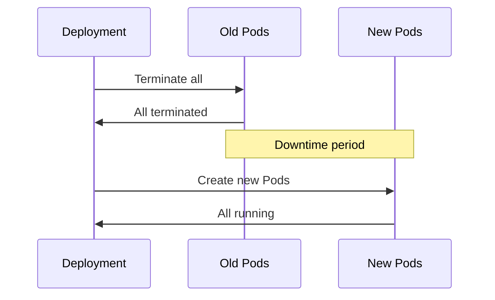

</div>

<!--
METADATA:
sentence: With Recreate: All old Pods are terminated first
search_anchor: With Recreate
-->
<div v-click="2" class="mb-4">

```yaml
spec:
  strategy:
    type: Recreate
```

</div>

<div class="grid grid-cols-2 gap-6 mt-6">
<!--
METADATA:
sentence: All old Pods are terminated first. Only then are new Pods created. This causes downtime but ensures old and new versions never run simultaneously.
search_anchor: All old Pods are terminated first
-->
<div v-click="3" class="text-center">
<carbon-warning class="text-4xl text-red-400 mb-2" />
<strong>Downtime</strong><br/>
<span class="text-sm opacity-80">All old Pods stop first</span>
</div>
<!--
METADATA:
sentence: When would you use Recreate? Your application can't handle multiple versions running together. You're doing database migrations that require exclusive access.
search_anchor: When would you use Recreate
-->
<div v-click="4" class="text-center">
<carbon-rule class="text-4xl text-blue-400 mb-2" />
<strong>When to Use</strong><br/>
<span class="text-sm opacity-80">Can't run multiple versions<br/>Database migrations</span>
</div>
</div>

---
layout: center
---

# Rollback Capabilities

<!--
METADATA:
sentence: One of the most powerful Deployment features is easy rollbacks.
search_anchor: most powerful Deployment features is easy rollbacks
-->
<div v-click="1">

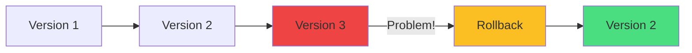

</div>

<!--
METADATA:
sentence: You can: View the rollout history to see all revisions. Inspect specific revisions to see what changed.
search_anchor: View the rollout history
-->
<div v-click="2" class="mt-8">

**View history:**
```bash
kubectl rollout history deployment/myapp
```

</div>

<!--
METADATA:
sentence: Roll back to any previous revision. Roll forward again if needed.
search_anchor: Roll back to any previous revision
-->
<div v-click="3" class="mt-4">

**Rollback:**
```bash
kubectl rollout undo deployment/myapp
kubectl rollout undo deployment/myapp --to-revision=2
```

</div>

<!--
METADATA:
sentence: This is incredibly valuable when deployments go wrong. Instead of scrambling to fix a broken release, you simply roll back with one command and investigate the issue without pressure.
search_anchor: roll back with one command
-->
<div v-click="4" class="mt-6 text-center text-green-400">
<carbon-checkmark class="inline-block text-3xl" /> One command to undo failed deployments
</div>

---
layout: center
---

# How Rollback Works

<!--
METADATA:
sentence: Rollbacks work by scaling up an old ReplicaSet and scaling down the current one - the same process as a regular update, just in reverse.
search_anchor: scaling up an old ReplicaSet
-->
<div v-click="1">

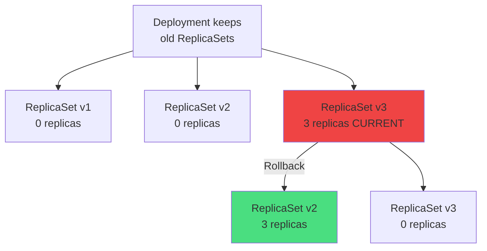

</div>

<!--
METADATA:
sentence: Rollbacks work by scaling up an old ReplicaSet and scaling down the current one - the same process as a regular update, just in reverse.
search_anchor: Rollback = scale up old ReplicaSet
-->
<div v-click="2" class="mt-6 text-center text-sm opacity-80">
Rollback = scale up old ReplicaSet, scale down current one
</div>

<!--
METADATA:
sentence: Keep rollout history - The default is 10 revisions. Adjust based on your needs.
search_anchor: default is 10 revisions
-->
<div v-click="3" class="mt-4 text-center">
Default: Keep last 10 revisions (configurable with <code>revisionHistoryLimit</code>)
</div>

---
layout: center
---

# Deployment Lifecycle

<!--
METADATA:
sentence: Deployments have a lifecycle with different states and conditions.
search_anchor: lifecycle with different states
-->
<div v-click="1">

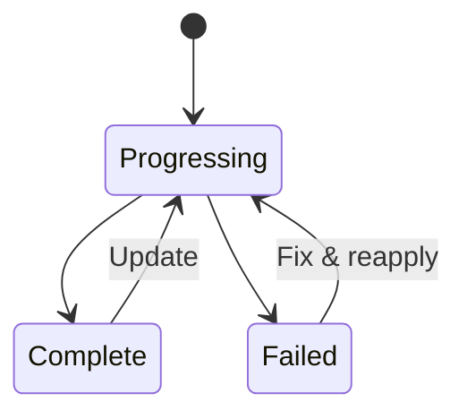

</div>

<div class="grid grid-cols-3 gap-6 mt-8 text-sm">
<!--
METADATA:
sentence: Progressing - The Deployment is actively rolling out changes
search_anchor: Progressing - The Deployment is actively rolling out
-->
<div v-click="2" class="text-center">
<carbon-in-progress class="text-4xl text-blue-400 mb-2" />
<strong>Progressing</strong><br/>
Actively rolling out
</div>
<!--
METADATA:
sentence: Complete - All replicas are updated and available
search_anchor: Complete - All replicas are updated
-->
<div v-click="3" class="text-center">
<carbon-checkmark class="text-4xl text-green-400 mb-2" />
<strong>Complete</strong><br/>
All replicas updated
</div>
<!--
METADATA:
sentence: Failed - The rollout has failed, possibly due to image pull errors or insufficient resources
search_anchor: Failed - The rollout has failed
-->
<div v-click="4" class="text-center">
<carbon-close class="text-4xl text-red-400 mb-2" />
<strong>Failed</strong><br/>
Image pull error, etc.
</div>
</div>

<!--
METADATA:
sentence: Kubernetes provides commands to monitor these states in real-time, which is essential during deployments and critical for troubleshooting in the CKAD exam.
search_anchor: monitor these states in real-time
-->
<div v-click="5" class="mt-6 text-center">

**Monitor rollout:**
```bash
kubectl rollout status deployment/myapp
```

</div>

---
layout: center
---

# Labels and Selectors

<!--
METADATA:
sentence: Deployments rely heavily on labels and selectors.
search_anchor: rely heavily on labels and selectors
-->
<div v-click="1">

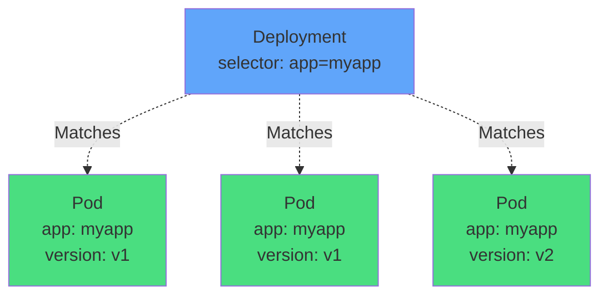

</div>

<!--
METADATA:
sentence: The selector in the Deployment spec uses matchLabels to find Pods it manages. This can be a simple equality match or more complex expressions using matchExpressions.
search_anchor: selector uses matchLabels to find Pods
-->
<div v-click="2" class="mt-8 text-center mb-4">
<carbon-filter class="inline-block text-4xl text-blue-400" />
<div class="text-lg mt-2"><strong>Selector must match labels in Pod template</strong></div>
</div>

<!--
METADATA:
sentence: Why does this matter? Multiple Deployments can run in the same namespace. Services use the same label selectors to find Pods.
search_anchor: Services use the same label selectors
-->
<div v-click="3" class="text-center text-sm opacity-80">
Services use same label selectors to find Pods
</div>

---
layout: center
---

# Best Practice Labels

<!--
METADATA:
sentence: Best practice: Use consistent, meaningful labels like: app: application-name
search_anchor: consistent, meaningful labels
-->
<div v-click="1" class="mb-6">

```yaml
metadata:
  labels:
    app: myapp
    version: v1
    tier: frontend
    environment: production
```

</div>

<div class="grid grid-cols-2 gap-6 text-sm">
<!--
METADATA:
sentence: app: application-name
search_anchor: app: application-name
-->
<div v-click="2">
<carbon-application class="inline-block text-3xl text-blue-400" /> <strong>app:</strong> application-name
</div>
<!--
METADATA:
sentence: version: v1 or v2
search_anchor: version: v1 or v2
-->
<div v-click="3">
<carbon-version class="inline-block text-3xl text-green-400" /> <strong>version:</strong> v1, v2
</div>
<!--
METADATA:
sentence: tier: frontend or backend
search_anchor: tier: frontend or backend
-->
<div v-click="4">
<carbon-category-and class="inline-block text-3xl text-purple-400" /> <strong>tier:</strong> frontend, backend
</div>
<!--
METADATA:
sentence: environment: production or staging
search_anchor: environment: production or staging
-->
<div v-click="5">
<carbon-tag class="inline-block text-3xl text-yellow-400" /> <strong>environment:</strong> prod, staging
</div>
</div>

<!--
METADATA:
sentence: This makes management, troubleshooting, and advanced deployment patterns much easier.
search_anchor: advanced deployment patterns much easier
-->
<div v-click="6" class="mt-8 text-center">
<carbon-idea class="inline-block text-3xl text-blue-400" /> Consistent labels enable advanced deployment patterns
</div>

---
layout: center
---

# Deployment Best Practices

<div class="grid grid-cols-2 gap-6 mt-4">
<!--
METADATA:
sentence: Always use Deployments, not bare Pods - In production, Pods should always be managed by a controller.
search_anchor: Always use Deployments, not bare Pods
-->
<div v-click="1">
<carbon-deployment-pattern class="text-4xl text-blue-400 mb-2" />
<strong>Always use Deployments</strong><br/>
<span class="text-sm opacity-80">Not bare Pods in production</span>
</div>
<!--
METADATA:
sentence: Specify resource requests and limits - Ensures proper scheduling and prevents resource exhaustion.
search_anchor: Specify resource requests and limits
-->
<div v-click="2">
<carbon-dashboard class="text-4xl text-green-400 mb-2" />
<strong>Resource limits</strong><br/>
<span class="text-sm opacity-80">Requests & limits for scheduling</span>
</div>
<!--
METADATA:
sentence: Implement readiness probes - Critical for zero-downtime updates. New Pods won't receive traffic until ready.
search_anchor: Implement readiness probes
-->
<div v-click="3">
<carbon-health-cross class="text-4xl text-purple-400 mb-2" />
<strong>Readiness probes</strong><br/>
<span class="text-sm opacity-80">Critical for zero downtime</span>
</div>
<!--
METADATA:
sentence: Pin image versions - Never use :latest in production. Use specific version tags.
search_anchor: Pin image versions
-->
<div v-click="4">
<carbon-tag class="text-4xl text-yellow-400 mb-2" />
<strong>Pin image versions</strong><br/>
<span class="text-sm opacity-80">Never :latest in production</span>
</div>
<!--
METADATA:
sentence: Set appropriate replica counts - At least 2 for high availability, more based on load.
search_anchor: Set appropriate replica counts
-->
<div v-click="5">
<carbon-rule class="text-4xl text-orange-400 mb-2" />
<strong>Set replica count</strong><br/>
<span class="text-sm opacity-80">At least 2 for HA</span>
</div>
<!--
METADATA:
sentence: Use rolling update strategy with maxUnavailable: 0 - Guarantees zero downtime.
search_anchor: Use rolling update strategy with maxUnavailable: 0
-->
<div v-click="6">
<carbon-renew class="text-4xl text-red-400 mb-2" />
<strong>maxUnavailable: 0</strong><br/>
<span class="text-sm opacity-80">Guaranteed zero downtime</span>
</div>
</div>

---
layout: center
---

# CKAD Exam Requirements

<!--
METADATA:
sentence: For the CKAD exam, Deployments are core material.
search_anchor: CKAD exam, Deployments are core material
-->
<div v-click="1" class="text-center mb-6">
<carbon-certificate class="inline-block text-6xl text-blue-400" />
</div>

<div class="grid grid-cols-2 gap-4 text-sm">
<!--
METADATA:
sentence: Create Deployments from scratch and using imperative commands
search_anchor: Create Deployments from scratch
-->
<div v-click="2">
<carbon-edit class="inline-block text-2xl text-green-400" /> Create Deployments (imperative & declarative)
</div>
<!--
METADATA:
sentence: Scale Deployments declaratively and imperatively
search_anchor: Scale Deployments declaratively and imperatively
-->
<div v-click="3">
<carbon-arrow-up-right class="inline-block text-2xl text-green-400" /> Scale Deployments
</div>
<!--
METADATA:
sentence: Perform rolling updates by changing images or configuration
search_anchor: Perform rolling updates
-->
<div v-click="4">
<carbon-renew class="inline-block text-2xl text-green-400" /> Perform rolling updates
</div>
<!--
METADATA:
sentence: Configure rolling update parameters (maxSurge, maxUnavailable)
search_anchor: Configure rolling update parameters
-->
<div v-click="5">
<carbon-settings class="inline-block text-2xl text-green-400" /> Configure maxSurge/maxUnavailable
</div>
<!--
METADATA:
sentence: Roll back failed deployments
search_anchor: Roll back failed deployments
-->
<div v-click="6">
<carbon-undo class="inline-block text-2xl text-green-400" /> Roll back deployments
</div>
<!--
METADATA:
sentence: View and understand rollout history
search_anchor: View and understand rollout history
-->
<div v-click="7">
<carbon-view class="inline-block text-2xl text-green-400" /> View rollout history
</div>
<!--
METADATA:
sentence: Troubleshoot deployment issues
search_anchor: Troubleshoot deployment issues
-->
<div v-click="8">
<carbon-debug class="inline-block text-2xl text-green-400" /> Troubleshoot deployment issues
</div>
<!--
METADATA:
sentence: Time management is critical in the exam.
search_anchor: Time management is critical
-->
<div v-click="9">
<carbon-timer class="inline-block text-2xl text-red-400" /> Work fast and accurately
</div>
</div>

<!--
METADATA:
sentence: Practice creating Deployments quickly using kubectl create commands to generate YAML, then edit as needed.
search_anchor: kubectl create commands to generate YAML
-->
<div v-click="10" class="mt-6 text-center text-yellow-400">
<carbon-idea class="inline-block text-2xl" /> Use kubectl create to generate YAML, then edit
</div>

---
layout: center
---

# Quick Commands

<div class="grid grid-cols-2 gap-6 mt-4">
<!--
METADATA:
sentence: Create Deployments from scratch and using imperative commands
search_anchor: kubectl create deployment
-->
<div v-click="1">
<carbon-edit class="text-3xl text-blue-400 mb-2" />
<strong>Create</strong>
```bash
kubectl create deployment myapp --image=nginx
kubectl create deployment myapp --image=nginx --replicas=3
```
</div>
<!--
METADATA:
sentence: Scale Deployments declaratively and imperatively
search_anchor: kubectl scale deployment
-->
<div v-click="2">
<carbon-arrow-up-right class="text-3xl text-green-400 mb-2" />
<strong>Scale</strong>
```bash
kubectl scale deployment myapp --replicas=5
```
</div>
<!--
METADATA:
sentence: Perform rolling updates by changing images or configuration
search_anchor: kubectl set image
-->
<div v-click="3">
<carbon-renew class="text-3xl text-purple-400 mb-2" />
<strong>Update image</strong>
```bash
kubectl set image deployment/myapp app=nginx:1.20
```
</div>
<!--
METADATA:
sentence: Roll back failed deployments. View and understand rollout history
search_anchor: kubectl rollout undo
-->
<div v-click="4">
<carbon-undo class="text-3xl text-yellow-400 mb-2" />
<strong>Rollback</strong>
```bash
kubectl rollout undo deployment/myapp
kubectl rollout history deployment/myapp
```
</div>
</div>

<!--
METADATA:
sentence: Know the kubectl shortcuts: "deploy" for Deployment, "rs" for ReplicaSet.
search_anchor: kubectl shortcuts
-->
<div v-click="5" class="mt-6 text-center text-sm opacity-80">
Shorthand: <code>deploy</code> for Deployment, <code>rs</code> for ReplicaSet
</div>

---
layout: center
---

# Zero-Downtime Deployment Pattern

<!--
METADATA:
sentence: Use rolling update strategy with maxUnavailable: 0 - Guarantees zero downtime.
search_anchor: zero-downtime deployment pattern
-->
<div v-click="1" class="mb-4">

```yaml
spec:
  replicas: 3
  strategy:
    type: RollingUpdate
    rollingUpdate:
      maxSurge: 1
      maxUnavailable: 0
  template:
    spec:
      containers:
      - name: app
        image: myapp:v2
        readinessProbe:
          httpGet:
            path: /health
            port: 8080
        resources:
          requests:
            cpu: 100m
            memory: 128Mi
          limits:
            cpu: 200m
            memory: 256Mi
```

</div>

<!--
METADATA:
sentence: Implement readiness probes - Critical for zero-downtime updates. New Pods won't receive traffic until ready.
search_anchor: readiness probe = zero downtime
-->
<div v-click="2" class="text-center text-sm">
<carbon-checkmark class="inline-block text-2xl text-green-400" /> maxUnavailable: 0 + readiness probe = zero downtime
</div>

---
layout: center
---

# Summary

<!--
METADATA:
sentence: Let's recap what we've covered: Deployments are controllers that manage Pods, providing scaling, updates, and rollbacks
search_anchor: Let's recap what we've covered
-->
<div v-click="1">

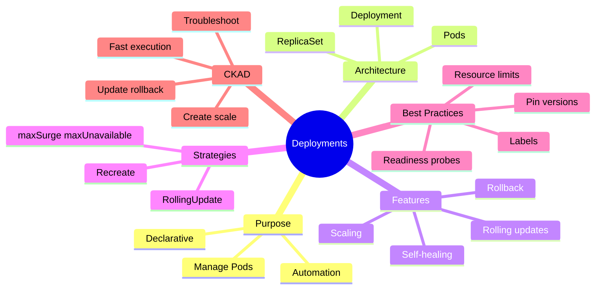

</div>

---
layout: center
---

# Key Takeaways

<div class="grid grid-cols-2 gap-6 mt-6">
<!--
METADATA:
sentence: Deployments are controllers that manage Pods, providing scaling, updates, and rollbacks
search_anchor: controllers that manage Pods
-->
<div v-click="1">
<carbon-deployment-pattern class="text-4xl text-blue-400 mb-2" />
<strong>Controllers manage Pods</strong><br/>
<span class="text-sm opacity-80">Deployments → ReplicaSets → Pods</span>
</div>
<!--
METADATA:
sentence: Rolling updates enable zero-downtime releases by gradually replacing Pods
search_anchor: Rolling updates enable zero-downtime
-->
<div v-click="2">
<carbon-renew class="text-4xl text-green-400 mb-2" />
<strong>Rolling updates</strong><br/>
<span class="text-sm opacity-80">Zero-downtime deployments</span>
</div>
<!--
METADATA:
sentence: Rollback capabilities provide safety for production deployments
search_anchor: Rollback capabilities provide safety
-->
<div v-click="3">
<carbon-undo class="text-4xl text-purple-400 mb-2" />
<strong>Easy rollbacks</strong><br/>
<span class="text-sm opacity-80">Version history & one-command undo</span>
</div>
<!--
METADATA:
sentence: Labels and selectors enable flexible Pod management
search_anchor: Labels and selectors enable flexible
-->
<div v-click="4">
<carbon-tag class="text-4xl text-yellow-400 mb-2" />
<strong>Labels & selectors</strong><br/>
<span class="text-sm opacity-80">Flexible Pod management</span>
</div>
</div>

<!--
METADATA:
sentence: Deployments are fundamental for the CKAD exam
search_anchor: Deployments are fundamental for the CKAD exam
-->
<div v-click="5" class="mt-8 text-center text-lg">
Most important CKAD topic - master it thoroughly <carbon-arrow-right class="inline-block text-2xl" />
</div>

---
layout: center
---

# Next Steps

<!--
METADATA:
sentence: Now that you understand Deployment concepts, it's time for hands-on practice.
search_anchor: time for hands-on practice
-->
<div v-click="1" class="text-center mb-8">
<carbon-education class="inline-block text-6xl text-blue-400" />
</div>

<!--
METADATA:
sentence: In the next video, we'll work through practical exercises where you'll: Create your first Deployment. Scale applications up and down. Perform rolling updates.
search_anchor: practical exercises
-->
<div v-click="2">

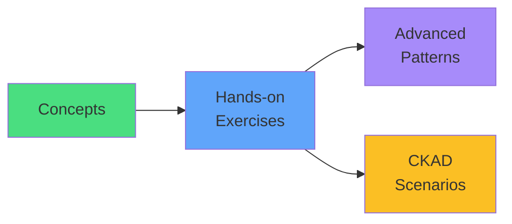

</div>

<!--
METADATA:
sentence: Thank you for watching, and let's move on to the practical demonstrations!
search_anchor: move on to the practical demonstrations
-->
<div v-click="3" class="mt-8 text-center text-xl">
Let's practice with real deployments! <carbon-arrow-right class="inline-block text-2xl" />
</div>
