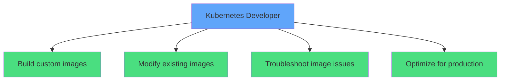
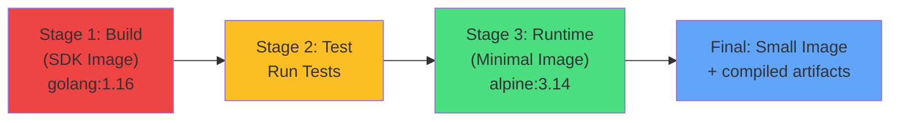
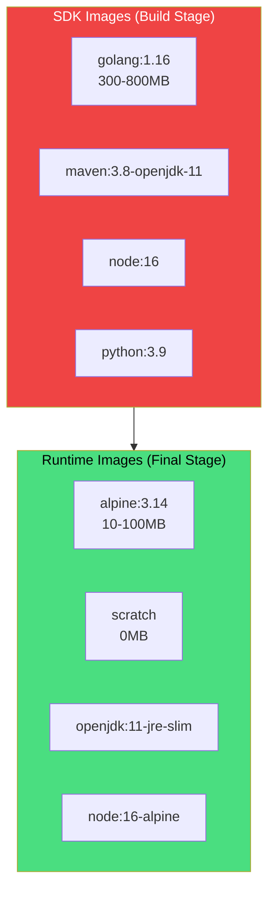
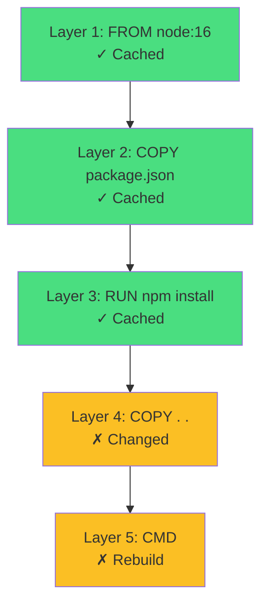
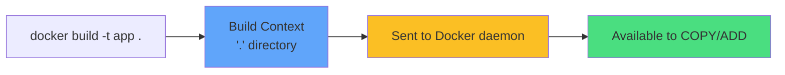
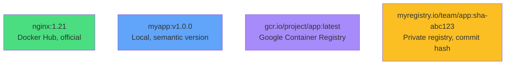
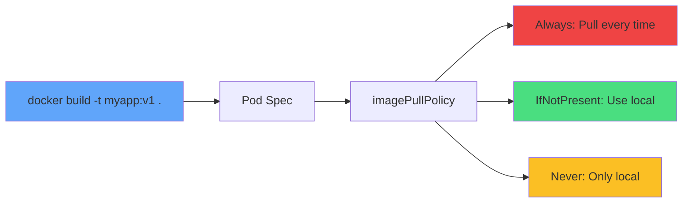
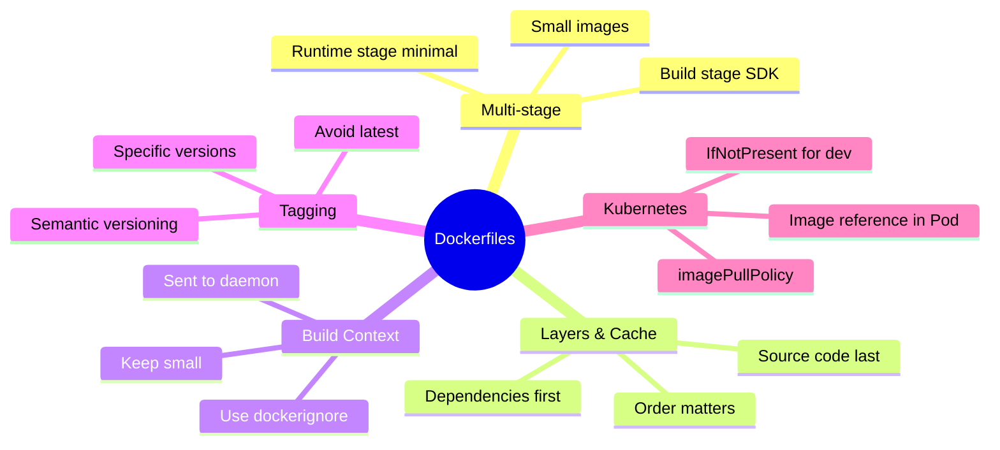

# Container Images and Dockerfiles

<div class="abs-br m-6 flex gap-2">
  <carbon-container-software class="text-6xl text-blue-400" />
</div>

<!--
METADATA:
sentence: Welcome to Container Images and Dockerfiles - a core CKAD topic in "Application Design and Build" (20% of exam).
search_anchor: core CKAD topic in Application Design and Build
-->
<div v-click="1" class="mt-8 text-xl opacity-80">
Application Design and Build • 20% of CKAD exam
</div>

<!--
METADATA:
sentence: Topics: Dockerfile structure, multi-stage builds, image optimization, build context, tagging, and using custom images in Kubernetes.
search_anchor: Dockerfile structure, multi-stage builds
-->
<div v-click="2" class="mt-6 text-lg">
<carbon-edit class="inline-block text-xl text-green-400" /> Dockerfile structure and multi-stage builds
</div>

<!--
METADATA:
sentence: Topics: Dockerfile structure, multi-stage builds, image optimization, build context, tagging, and using custom images in Kubernetes.
search_anchor: image optimization, build context
-->
<div v-click="3" class="mt-2 text-lg">
<carbon-image class="inline-block text-xl text-purple-400" /> Image optimization and build context
</div>

<!--
METADATA:
sentence: You'll need to write or modify Dockerfiles, build images, and reference them correctly in Pod/Deployment specs.
search_anchor: write or modify Dockerfiles
-->
<div v-click="4" class="mt-2 text-lg">
<carbon-tag class="inline-block text-xl text-yellow-400" /> Tagging and using custom images in Kubernetes
</div>

---
layout: center
---

# Why Dockerfiles Matter for CKAD

<!--
METADATA:
sentence: As a Kubernetes developer:
search_anchor: As a Kubernetes developer
-->
<div v-click="1" class="mb-6">



</div>

<div class="grid grid-cols-2 gap-4 mt-6 text-sm">
<!--
METADATA:
sentence: Build custom application images (not just use stock images)
search_anchor: Build custom application images
-->
<div v-click="2">
<carbon-edit class="inline-block text-2xl text-blue-400" /> Write/modify Dockerfiles
</div>
<!--
METADATA:
sentence: Modify existing images (add configuration, tools, customization)
search_anchor: Modify existing images
-->
<div v-click="3">
<carbon-layers class="inline-block text-2xl text-green-400" /> Multi-stage builds
</div>
<!--
METADATA:
sentence: Troubleshoot image issues (layers, caching, build context)
search_anchor: Troubleshoot image issues
-->
<div v-click="4">
<carbon-image class="inline-block text-2xl text-purple-400" /> Build and tag images
</div>
<!--
METADATA:
sentence: CKAD exam may require: writing/modifying Dockerfiles, building images, multi-stage builds, correct image references in specs.
search_anchor: correct image references in specs
-->
<div v-click="5">
<carbon-tag class="inline-block text-2xl text-yellow-400" /> Reference in Pod specs
</div>
</div>

---
layout: center
---

# Dockerfile Basics

<!--
METADATA:
sentence: Core instructions:
search_anchor: Core instructions
-->
<div v-click="1" class="mb-4">

```dockerfile
FROM node:16
WORKDIR /app
COPY package.json .
RUN npm install
COPY . .
ENV NODE_ENV=production
EXPOSE 3000
CMD ["node", "server.js"]
```

</div>

<div class="grid grid-cols-2 gap-4 text-xs">
<!--
METADATA:
sentence: FROM: Base image
search_anchor: FROM: Base image
-->
<div v-click="2">
<carbon-data-base class="inline-block text-2xl text-blue-400" /> <strong>FROM:</strong> Base image
</div>
<!--
METADATA:
sentence: RUN: Execute commands during build
search_anchor: RUN: Execute commands during build
-->
<div v-click="3">
<carbon-terminal class="inline-block text-2xl text-green-400" /> <strong>RUN:</strong> Execute commands
</div>
<!--
METADATA:
sentence: COPY/ADD: Add files from build context
search_anchor: COPY/ADD: Add files from build context
-->
<div v-click="4">
<carbon-document class="inline-block text-2xl text-purple-400" /> <strong>COPY/ADD:</strong> Add files
</div>
<!--
METADATA:
sentence: WORKDIR: Set working directory
search_anchor: WORKDIR: Set working directory
-->
<div v-click="5">
<carbon-folder class="inline-block text-2xl text-yellow-400" /> <strong>WORKDIR:</strong> Set directory
</div>
<!--
METADATA:
sentence: ENV: Set environment variables
search_anchor: ENV: Set environment variables
-->
<div v-click="6">
<carbon-list class="inline-block text-2xl text-red-400" /> <strong>ENV:</strong> Environment variables
</div>
<!--
METADATA:
sentence: EXPOSE: Document port (doesn't publish)
search_anchor: EXPOSE: Document port
-->
<div v-click="7">
<carbon-network-3 class="inline-block text-2xl text-orange-400" /> <strong>EXPOSE:</strong> Document port
</div>
<!--
METADATA:
sentence: CMD: Default command
search_anchor: CMD: Default command
-->
<div v-click="8">
<carbon-play class="inline-block text-2xl text-teal-400" /> <strong>CMD:</strong> Default command
</div>
<!--
METADATA:
sentence: ENTRYPOINT: Main executable
search_anchor: ENTRYPOINT: Main executable
-->
<div v-click="9">
<carbon-terminal class="inline-block text-2xl text-pink-400" /> <strong>ENTRYPOINT:</strong> Main executable
</div>
</div>

<!--
METADATA:
sentence: Each instruction creates a layer. Layers are cached for efficiency.
search_anchor: Each instruction creates a layer
-->
<div v-click="10" class="mt-6 text-center text-sm opacity-80">
<carbon-layers class="inline-block text-2xl text-blue-400" /> Each instruction creates a layer
</div>

---
layout: center
---

# Multi-Stage Builds

<!--
METADATA:
sentence: Multiple FROM statements in one Dockerfile. Each FROM starts a new stage.
search_anchor: Multiple FROM statements in one Dockerfile
-->
<div v-click="1" class="mb-6">



</div>

<!--
METADATA:
sentence: Multiple FROM statements in one Dockerfile. Each FROM starts a new stage.
search_anchor: Each FROM starts a new stage
-->
<div v-click="2" class="text-center mb-4 opacity-80">
Multiple FROM statements • Each FROM starts a new stage
</div>

<div class="grid grid-cols-2 gap-6">
<!--
METADATA:
sentence: Build stage: Use SDK image (large, has compilers)
search_anchor: Build stage: Use SDK image
-->
<div v-click="3">
<carbon-tool-box class="text-4xl text-red-400 mb-2" />
<strong>Build Stage</strong><br/>
<span class="text-sm opacity-80">Large SDK with compilers</span>
</div>
<!--
METADATA:
sentence: Final stage: Use minimal runtime image, copy compiled artifacts
search_anchor: Use minimal runtime image
-->
<div v-click="4">
<carbon-container-software class="text-4xl text-green-400 mb-2" />
<strong>Runtime Stage</strong><br/>
<span class="text-sm opacity-80">Minimal image with artifacts</span>
</div>
</div>

<!--
METADATA:
sentence: Result: Small production image without build tools. Repeatable builds without local toolchains.
search_anchor: Small production image without build tools
-->
<div v-click="5" class="mt-6 text-center text-lg">
<carbon-arrow-down class="inline-block text-2xl text-yellow-400" /> Result: 800MB → 50MB
</div>

---
layout: center
---

# Build Stages and Targets

<!--
METADATA:
sentence: Name stages:
search_anchor: Name stages
-->
<div v-click="1" class="mb-4">

```dockerfile
FROM golang:1.16 AS builder
WORKDIR /app
COPY . .
RUN go build -o myapp

FROM alpine:3.14 AS runtime
COPY --from=builder /app/myapp /usr/local/bin/
CMD ["myapp"]
```

</div>

<div class="grid grid-cols-2 gap-6 mt-8">
<!--
METADATA:
sentence: FROM golang:1.16 AS builder
search_anchor: FROM golang:1.16 AS builder
-->
<div v-click="2">
<carbon-tag class="text-4xl text-blue-400 mb-2" />
<strong>Name stages with AS</strong><br/>
<span class="text-sm opacity-80">Reference in later stages</span>
</div>
<!--
METADATA:
sentence: Build specific stage:
search_anchor: Build specific stage
-->
<div v-click="3">
<carbon-target class="text-4xl text-green-400 mb-2" />
<strong>Build specific stage</strong><br/>
<span class="text-sm opacity-80">docker build --target builder</span>
</div>
</div>

<!--
METADATA:
sentence: BuildKit optimization: Skips unused stages, runs stages in parallel. Enable with `DOCKER_BUILDKIT=1`.
search_anchor: BuildKit optimization: Skips unused stages
-->
<div v-click="4" class="mt-6 text-center">
<carbon-lightning class="inline-block text-3xl text-yellow-400" /> BuildKit: Skip unused stages, run in parallel
</div>

---
layout: center
---

# SDK Images vs Runtime Images

<!--
METADATA:
sentence: SDK images (build stage):
search_anchor: SDK images (build stage)
-->
<div v-click="1">



</div>

<div class="grid grid-cols-2 gap-6 mt-6">
<!--
METADATA:
sentence: SDK images: 300-800MB. Runtime images: 10-100MB. Huge difference!
search_anchor: SDK images: 300-800MB
-->
<div v-click="2">
<carbon-tool-box class="text-4xl text-red-400 mb-2" />
<strong>SDK: 300-800MB</strong><br/>
<span class="text-sm opacity-80">Compilers and build tools</span>
</div>
<!--
METADATA:
sentence: Runtime images: 10-100MB. Huge difference!
search_anchor: Runtime images: 10-100MB
-->
<div v-click="3">
<carbon-container-software class="text-4xl text-green-400 mb-2" />
<strong>Runtime: 10-100MB</strong><br/>
<span class="text-sm opacity-80">Only what's needed</span>
</div>
</div>

---
layout: center
---

# Image Layers and Caching

<!--
METADATA:
sentence: Each Dockerfile instruction creates a layer. Layers are cached based on content.
search_anchor: Layers are cached based on content
-->
<div v-click="1">



</div>

<!--
METADATA:
sentence: Order matters: Put frequently changing content last to maximize cache hits.
search_anchor: Order matters: Put frequently changing content last
-->
<div v-click="2" class="mt-6 text-center opacity-80">
Layers cached based on content • Order matters!
</div>

<div class="grid grid-cols-2 gap-6 mt-6">
<!--
METADATA:
sentence: Good pattern:
search_anchor: Good pattern
-->
<div v-click="3">
<carbon-checkmark class="text-4xl text-green-400 mb-2" />
<strong>Good Pattern</strong><br/>
<span class="text-sm opacity-80">Copy dependencies first<br/>Source code last</span>
</div>
<!--
METADATA:
sentence: Bad pattern:
search_anchor: Bad pattern
-->
<div v-click="4">
<carbon-close class="text-4xl text-red-400 mb-2" />
<strong>Bad Pattern</strong><br/>
<span class="text-sm opacity-80">Copy all files first<br/>Invalidates cache</span>
</div>
</div>

---
layout: center
---

# Build Context

<!--
METADATA:
sentence: Build context: Directory sent to Docker daemon (`.` in `docker build -t app .`).
search_anchor: Build context: Directory sent to Docker daemon
-->
<div v-click="1">



</div>

<!--
METADATA:
sentence: All files in context are sent. Large contexts slow builds.
search_anchor: All files in context are sent
-->
<div v-click="2" class="mt-6 text-center opacity-80">
All files in context are sent • Large contexts slow builds
</div>

<!--
METADATA:
sentence: Use `.dockerignore` to exclude:
search_anchor: Use `.dockerignore` to exclude
-->
<div v-click="3" class="mt-6 mb-4 text-center text-lg">
<carbon-document class="inline-block text-3xl text-blue-400" /> .dockerignore
</div>

<!--
METADATA:
sentence: Use `.dockerignore` to exclude:
search_anchor: node_modules .git *.log
-->
<div v-click="4" class="text-sm">

```
node_modules/
.git/
*.log
.env
.DS_Store
```

</div>

<!--
METADATA:
sentence: For CKAD: Understand build context path matters. `COPY . .` copies from context, not arbitrary locations.
search_anchor: COPY . . copies from context
-->
<div v-click="5" class="mt-6 text-center text-yellow-400">
<carbon-warning class="inline-block text-2xl" /> COPY . . copies from context, not arbitrary locations
</div>

---
layout: center
---

# Image Tagging for Kubernetes

<!--
METADATA:
sentence: Tag format: `[registry/][namespace/]name:tag`
search_anchor: Tag format: [registry/][namespace/]name:tag
-->
<div v-click="1" class="mb-6 text-center text-lg opacity-80">
Tag format: [registry/][namespace/]name:tag
</div>

<!--
METADATA:
sentence: Examples:
search_anchor: Examples of tags
-->
<div v-click="2" class="mb-6">



</div>

<div class="grid grid-cols-2 gap-6">
<!--
METADATA:
sentence: Best practices:
search_anchor: Best practices for tagging
-->
<div v-click="3">
<carbon-checkmark class="text-4xl text-green-400 mb-2" />
<strong>Best Practices</strong><br/>
<span class="text-sm opacity-80">Specific versions<br/>Semantic versioning<br/>Commit SHAs</span>
</div>
<!--
METADATA:
sentence: Use specific versions, not `latest`
search_anchor: Use specific versions, not latest
-->
<div v-click="4">
<carbon-close class="text-4xl text-red-400 mb-2" />
<strong>Avoid</strong><br/>
<span class="text-sm opacity-80">Using :latest<br/>No version tags<br/>Overwriting tags</span>
</div>
</div>

---
layout: center
---

# Using Custom Images in Kubernetes

<!--
METADATA:
sentence: After building:
search_anchor: After building
-->
<div v-click="1" class="mb-4">

```yaml
spec:
  containers:
  - name: app
    image: myapp:v1
    imagePullPolicy: IfNotPresent
```

</div>

<!--
METADATA:
sentence: Reference in Pod:
search_anchor: Reference in Pod
-->
<div v-click="2">



</div>

<div class="grid grid-cols-3 gap-4 mt-6 text-xs">
<!--
METADATA:
sentence: `Always`: Always pull (default for `:latest`)
search_anchor: Always pull (default for :latest)
-->
<div v-click="3" class="text-center">
<carbon-download class="text-3xl text-red-400 mb-1" />
<strong>Always</strong><br/>
Default for :latest
</div>
<!--
METADATA:
sentence: `IfNotPresent`: Use local if available
search_anchor: IfNotPresent: Use local if available
-->
<div v-click="4" class="text-center">
<carbon-checkmark class="text-3xl text-green-400 mb-1" />
<strong>IfNotPresent</strong><br/>
Local development
</div>
<!--
METADATA:
sentence: `Never`: Only use local
search_anchor: Never: Only use local
-->
<div v-click="5" class="text-center">
<carbon-close class="text-3xl text-yellow-400 mb-1" />
<strong>Never</strong><br/>
Local only
</div>
</div>

---
layout: center
---

# Common Issues and Optimization

<div class="grid grid-cols-2 gap-6 mt-4">
<!--
METADATA:
sentence: Common issues:
search_anchor: Common issues
-->
<div v-click="1">
<carbon-warning class="text-4xl text-red-400 mb-2" />
<strong>Common Issues</strong><br/>
<span class="text-sm opacity-80">• Large image sizes<br/>• Slow builds<br/>• ImagePullBackOff<br/>• Build context too large</span>
</div>
<!--
METADATA:
sentence: Optimization tips:
search_anchor: Optimization tips
-->
<div v-click="2">
<carbon-lightning class="text-4xl text-green-400 mb-2" />
<strong>Optimization Tips</strong><br/>
<span class="text-sm opacity-80">• Multi-stage builds<br/>• Alpine/slim variants<br/>• Combine RUN commands<br/>• Use .dockerignore</span>
</div>
</div>

<!--
METADATA:
sentence: Combine RUN commands: `RUN apt-get update && apt-get install -y pkg && rm -rf /var/lib/apt/lists/*`
search_anchor: Combine RUN commands
-->
<div v-click="3" class="mt-8 mb-4 text-center">
<carbon-clean class="inline-block text-3xl text-blue-400" /> Combine cleanup in same layer:
</div>

<!--
METADATA:
sentence: Combine RUN commands: `RUN apt-get update && apt-get install -y pkg && rm -rf /var/lib/apt/lists/*`
search_anchor: apt-get update && apt-get install
-->
<div v-click="4" class="text-xs">

```dockerfile
RUN apt-get update && \
    apt-get install -y pkg && \
    rm -rf /var/lib/apt/lists/*
```

</div>

<!--
METADATA:
sentence: Don't install unnecessary packages
search_anchor: Don't install unnecessary packages
-->
<div v-click="5" class="mt-4 text-center opacity-80">
Don't install unnecessary packages
</div>

---
layout: center
---

# Summary

<!--
METADATA:
sentence: Key concepts: Multi-stage builds separate build/runtime, image layers and caching, build context and .dockerignore, proper tagging, imagePullPolicy.
search_anchor: Key concepts
-->
<div v-click="1">



</div>

<!--
METADATA:
sentence: Key concepts: Multi-stage builds separate build/runtime, image layers and caching, build context and .dockerignore, proper tagging, imagePullPolicy.
search_anchor: Multi-stage builds separate build/runtime
-->
<div v-click="2" class="mt-8 text-center text-lg">
<carbon-checkmark class="inline-block text-2xl text-green-400" /> Multi-stage builds separate build/runtime environments
</div>

<!--
METADATA:
sentence: Key concepts: Multi-stage builds separate build/runtime, image layers and caching, build context and .dockerignore, proper tagging, imagePullPolicy.
search_anchor: image layers and caching
-->
<div v-click="3" class="mt-2 text-center text-lg">
<carbon-checkmark class="inline-block text-2xl text-green-400" /> Layer order matters for cache efficiency
</div>

---
layout: center
---

# CKAD Exam Focus

<!--
METADATA:
sentence: For CKAD: Write basic Dockerfiles, understand multi-stage pattern, build and tag images, reference correctly in Kubernetes specs, troubleshoot image pull issues.
search_anchor: For CKAD
-->
<div v-click="1" class="text-center mb-6">
<carbon-certificate class="inline-block text-6xl text-blue-400" />
</div>

<div class="grid grid-cols-2 gap-4 text-sm">
<!--
METADATA:
sentence: Write basic Dockerfiles, understand multi-stage pattern, build and tag images, reference correctly in Kubernetes specs, troubleshoot image pull issues.
search_anchor: Write basic Dockerfiles
-->
<div v-click="2">
<carbon-edit class="inline-block text-2xl text-green-400" /> Write basic Dockerfiles
</div>
<!--
METADATA:
sentence: understand multi-stage pattern, build and tag images, reference correctly in Kubernetes specs, troubleshoot image pull issues.
search_anchor: understand multi-stage pattern
-->
<div v-click="3">
<carbon-layers class="inline-block text-2xl text-green-400" /> Multi-stage build pattern
</div>
<!--
METADATA:
sentence: build and tag images, reference correctly in Kubernetes specs, troubleshoot image pull issues.
search_anchor: build and tag images
-->
<div v-click="4">
<carbon-terminal class="inline-block text-2xl text-green-400" /> Build and tag images
</div>
<!--
METADATA:
sentence: reference correctly in Kubernetes specs, troubleshoot image pull issues.
search_anchor: reference correctly in Kubernetes specs
-->
<div v-click="5">
<carbon-tag class="inline-block text-2xl text-green-400" /> Reference correctly in specs
</div>
<!--
METADATA:
sentence: troubleshoot image pull issues.
search_anchor: troubleshoot image pull issues
-->
<div v-click="6">
<carbon-debug class="inline-block text-2xl text-green-400" /> Troubleshoot image pull issues
</div>
<!--
METADATA:
sentence: ImagePullPolicy:
search_anchor: ImagePullPolicy
-->
<div v-click="7">
<carbon-settings class="inline-block text-2xl text-green-400" /> Understand imagePullPolicy
</div>
</div>

<!--
METADATA:
sentence: Practice: Build a multi-stage image for your language, understand the output, deploy to Kubernetes.
search_anchor: Practice: Build a multi-stage image
-->
<div v-click="8" class="mt-8 text-center text-lg">
<carbon-terminal class="inline-block text-3xl text-purple-400" /> Practice: Build multi-stage images for your language!
</div>
