# Helm

<div class="abs-br m-6 flex gap-2">
  <carbon-container-software class="text-6xl text-blue-400" />
</div>

<!--
METADATA:
sentence: Welcome to this introduction to Helm, the package manager for Kubernetes.
search_anchor: package manager for Kubernetes
-->
<div v-click="1" class="mt-8 text-xl opacity-80">
The package manager for Kubernetes
</div>

<!--
METADATA:
sentence: Helm is marked as "CKAD Supplementary" material - while it may appear on the exam, understanding Helm is essential for real-world Kubernetes application deployment.
search_anchor: CKAD Supplementary material
-->
<div v-click="2" class="mt-6 text-lg">
<carbon-document class="inline-block text-xl text-yellow-400" /> CKAD Supplementary Material
</div>

<!--
METADATA:
sentence: Helm is marked as "CKAD Supplementary" material - while it may appear on the exam, understanding Helm is essential for real-world Kubernetes application deployment.
search_anchor: essential for real-world deployment
-->
<div v-click="3" class="mt-4 text-sm opacity-60">
May appear on exam • Essential for real-world deployments
</div>

---
layout: center
---

# The Challenge Without Helm

<!--
METADATA:
sentence: Before we dive into Helm, let's understand the problem it solves. When deploying applications to Kubernetes, you typically write YAML manifests for Deployments, Services, ConfigMaps, and other resources.
search_anchor: problem it solves
-->
<div v-click="1">

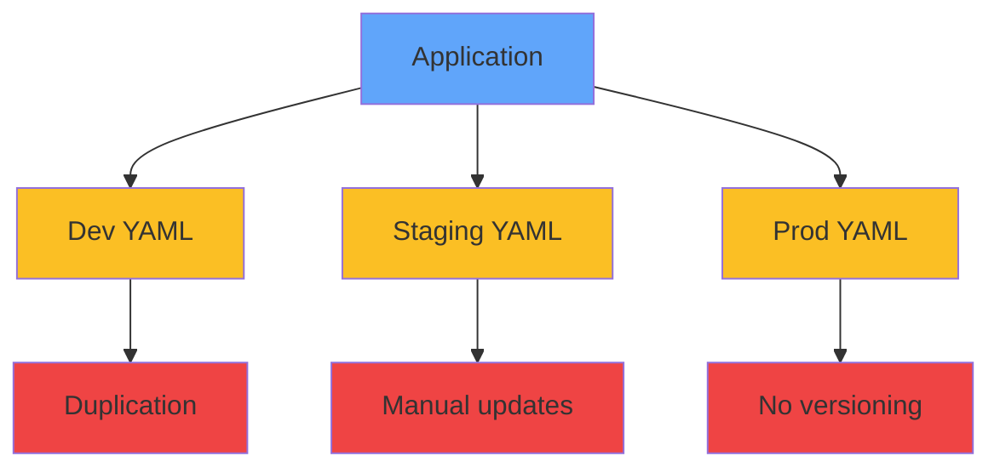

</div>

<div class="grid grid-cols-2 gap-6 mt-8 text-sm">
<!--
METADATA:
sentence: Duplicating YAML files for each environment
search_anchor: Duplicating YAML files
-->
<div v-click="2">
<carbon-document class="text-3xl text-red-400 mb-2" />
Duplicate YAML for each environment
</div>
<!--
METADATA:
sentence: Manually updating image tags and configuration values
search_anchor: Manually updating image tags
-->
<div v-click="3">
<carbon-edit class="text-3xl text-yellow-400 mb-2" />
Manual config updates
</div>
<!--
METADATA:
sentence: No easy way to version or rollback entire application stacks
search_anchor: rollback entire application stacks
-->
<div v-click="4">
<carbon-version class="text-3xl text-purple-400 mb-2" />
No easy rollbacks
</div>
<!--
METADATA:
sentence: Difficult to share and distribute complete applications
search_anchor: share and distribute complete applications
-->
<div v-click="5">
<carbon-share class="text-3xl text-blue-400 mb-2" />
Difficult to share apps
</div>
</div>

<!--
METADATA:
sentence: Helm addresses all these challenges with a templating and packaging system.
search_anchor: Helm addresses all these challenges
-->
<div v-click="6" class="mt-6 text-center text-green-400">
<carbon-checkmark class="inline-block text-2xl" /> Helm solves all these challenges
</div>

---
layout: center
---

# What is Helm?

<!--
METADATA:
sentence: Helm is the package manager for Kubernetes, similar to how apt is for Ubuntu, yum for RedHat, or brew for macOS.
search_anchor: similar to how apt is for Ubuntu
-->
<div v-click="1" class="mb-6">

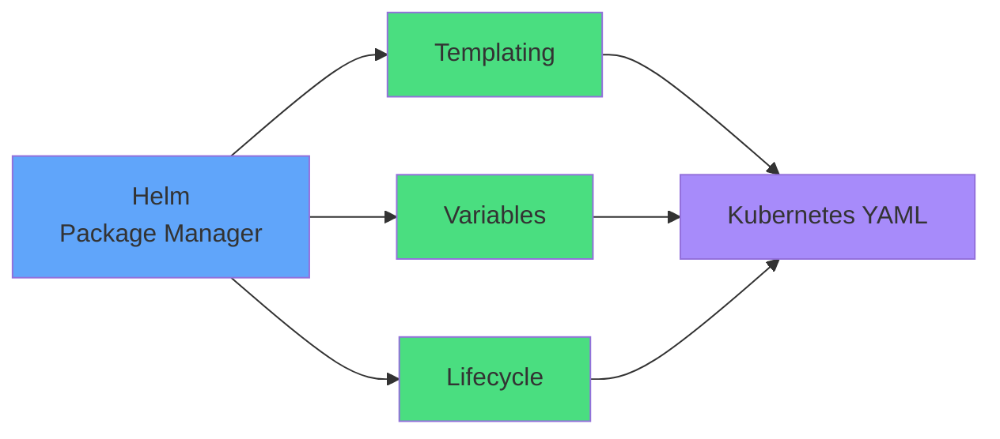

</div>

<div class="grid grid-cols-2 gap-6">
<!--
METADATA:
sentence: Helm is the package manager for Kubernetes, similar to how apt is for Ubuntu, yum for RedHat, or brew for macOS.
search_anchor: Like apt, yum, brew
-->
<div v-click="2">
<carbon-settings class="text-4xl text-blue-400 mb-2" />
<strong>Like apt, yum, brew</strong><br/>
<span class="text-sm opacity-80">But for Kubernetes</span>
</div>
<!--
METADATA:
sentence: Provides a CLI for installing, upgrading, and managing applications
search_anchor: CLI for installing, upgrading
-->
<div v-click="3">
<carbon-terminal class="text-4xl text-green-400 mb-2" />
<strong>CLI tool</strong><br/>
<span class="text-sm opacity-80">No server required (v3+)</span>
</div>
</div>

<!--
METADATA:
sentence: Works with standard Kubernetes resources - no special runtime needed
search_anchor: standard Kubernetes resources
-->
<div v-click="4" class="mt-6 text-center text-yellow-400">
<carbon-checkmark class="inline-block text-2xl" /> Works with standard Kubernetes resources
</div>

---
layout: center
---

# Helm Architecture

<!--
METADATA:
sentence: Let's look at how Helm fits into your Kubernetes workflow. Helm uses the same kubeconfig context as kubectl to connect to your cluster.
search_anchor: same kubeconfig context as kubectl
-->
<div v-click="1">

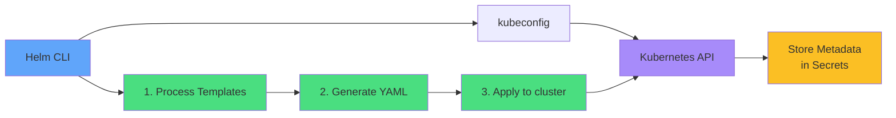

</div>

<!--
METADATA:
sentence: Helm uses the same kubeconfig context as kubectl to connect to your cluster.
search_anchor: Uses same kubeconfig
-->
<div v-click="2" class="mt-6 text-center opacity-80">
Uses same kubeconfig as kubectl
</div>

<div class="grid grid-cols-3 gap-4 mt-6 text-sm">
<!--
METADATA:
sentence: Processes templates with your provided values
search_anchor: Processes templates with your provided values
-->
<div v-click="3" class="text-center">
<carbon-template class="text-3xl text-green-400 mb-1" />
<strong>Process</strong><br/>
Templates + Values
</div>
<!--
METADATA:
sentence: Generates standard Kubernetes YAML
search_anchor: Generates standard Kubernetes YAML
-->
<div v-click="4" class="text-center">
<carbon-document class="text-3xl text-blue-400 mb-1" />
<strong>Generate</strong><br/>
Standard YAML
</div>
<!--
METADATA:
sentence: Applies that YAML to your cluster using the Kubernetes API
search_anchor: Applies that YAML to your cluster
-->
<div v-click="5" class="text-center">
<carbon-kubernetes class="text-3xl text-purple-400 mb-1" />
<strong>Deploy</strong><br/>
To cluster
</div>
</div>

---
layout: center
---

# Core Concepts: Charts

<!--
METADATA:
sentence: The fundamental unit in Helm is the "chart" - a package containing everything needed to deploy an application.
search_anchor: fundamental unit in Helm is the chart
-->
<div v-click="1">

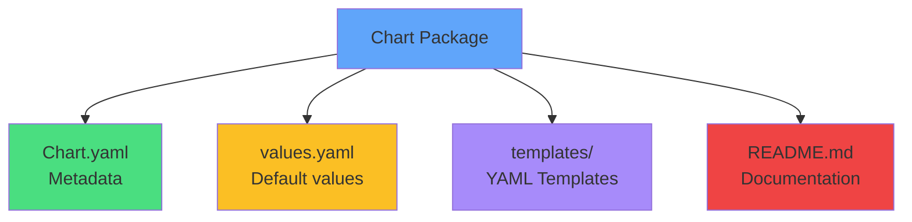

</div>

<!--
METADATA:
sentence: The fundamental unit in Helm is the "chart" - a package containing everything needed to deploy an application.
search_anchor: everything needed to deploy an application
-->
<div v-click="2" class="mt-8 text-center text-lg opacity-80">
Everything needed to deploy an application
</div>

<div class="grid grid-cols-3 gap-4 mt-6 text-sm">
<!--
METADATA:
sentence: Locally in directories
search_anchor: Locally in directories
-->
<div v-click="3" class="text-center">
<carbon-folder class="text-3xl text-green-400 mb-1" />
Local directories
</div>
<!--
METADATA:
sentence: As compressed tar.gz archives
search_anchor: compressed tar.gz archives
-->
<div v-click="4" class="text-center">
<carbon-archive class="text-3xl text-yellow-400 mb-1" />
Tar.gz archives
</div>
<!--
METADATA:
sentence: In remote chart repositories (like Docker Hub for images)
search_anchor: remote chart repositories
-->
<div v-click="5" class="text-center">
<carbon-cloud class="text-3xl text-purple-400 mb-1" />
Remote repositories
</div>
</div>

<!--
METADATA:
sentence: One key advantage: charts contain only templates, not container images.
search_anchor: charts contain only templates
-->
<div v-click="6" class="mt-6 text-center text-green-400">
<carbon-checkmark class="inline-block text-2xl" /> Charts contain templates, not images
</div>

---
layout: center
---

# Core Concepts: Values

<!--
METADATA:
sentence: Values are the variables used in chart templates.
search_anchor: variables used in chart templates
-->
<div v-click="1" class="mb-4">

```yaml
# values.yaml
replicaCount: 3
image:
  repository: nginx
  tag: "1.21"
service:
  type: LoadBalancer
  port: 80
```

</div>

<!--
METADATA:
sentence: The values.yaml file contains default values for your chart. When installing a chart, you can override these defaults in several ways
search_anchor: override these defaults in several ways
-->
<div v-click="2">

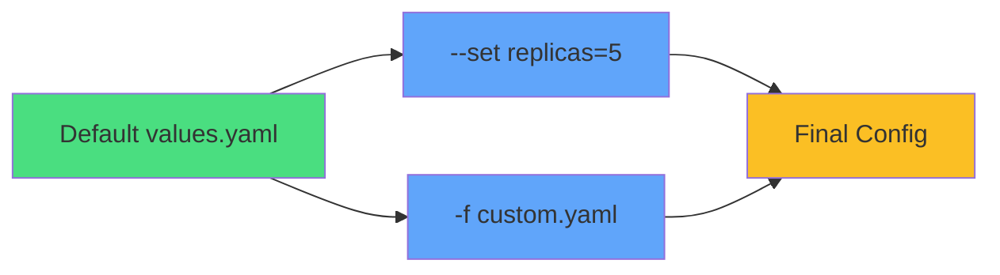

</div>

<div class="grid grid-cols-2 gap-6 mt-6 text-sm">
<!--
METADATA:
sentence: Using the --set flag: helm install myapp --set replicas=3
search_anchor: Using the --set flag
-->
<div v-click="3">
<carbon-settings class="text-3xl text-blue-400 mb-1" />
<strong>Override with --set</strong><br/>
helm install --set replicas=5
</div>
<!--
METADATA:
sentence: Using a custom values file: helm install myapp -f custom-values.yaml
search_anchor: custom values file
-->
<div v-click="4">
<carbon-document class="text-3xl text-green-400 mb-1" />
<strong>Custom values file</strong><br/>
helm install -f prod-values.yaml
</div>
</div>

<!--
METADATA:
sentence: This separation of templates and values is what makes Helm charts reusable across environments.
search_anchor: separation of templates and values
-->
<div v-click="5" class="mt-6 text-center text-purple-400">
<carbon-flow class="inline-block text-2xl" /> Separation makes charts reusable
</div>

---
layout: center
---

# Core Concepts: Templates

<!--
METADATA:
sentence: Templates are Kubernetes YAML files with embedded Go template syntax.
search_anchor: embedded Go template syntax
-->
<div v-click="1" class="mb-4">

```yaml
apiVersion: apps/v1
kind: Deployment
metadata:
  name: {{ .Release.Name }}
spec:
  replicas: {{ .Values.replicaCount }}
  template:
    spec:
      containers:
      - name: {{ .Chart.Name }}
        image: "{{ .Values.image.repository }}:{{ .Values.image.tag }}"
```

</div>

<div class="grid grid-cols-2 gap-6 mt-6">
<!--
METADATA:
sentence: Double curly braces access values: {{ .Values.replicaCount }}
search_anchor: Double curly braces access values
-->
<div v-click="2">
<carbon-template class="text-4xl text-blue-400 mb-2" />
<strong>Go Template Syntax</strong><br/>
<span class="text-sm opacity-80">{{ .Values.field }}</span>
</div>
<!--
METADATA:
sentence: Built-in objects provide context: {{ .Release.Name }}, {{ .Chart.Name }}
search_anchor: Built-in objects provide context
-->
<div v-click="3">
<carbon-flow class="text-4xl text-green-400 mb-2" />
<strong>Built-in Objects</strong><br/>
<span class="text-sm opacity-80">.Release .Chart .Values</span>
</div>
</div>

<!--
METADATA:
sentence: For CKAD purposes, you need to understand how to read templates and provide values, but you likely won't write complex templates from scratch.
search_anchor: read templates and provide values
-->
<div v-click="4" class="mt-6 text-center text-yellow-400">
<carbon-warning class="inline-block text-2xl" /> For CKAD: Read templates, provide values
</div>

---
layout: center
---

# Core Concepts: Releases

<!--
METADATA:
sentence: A release is an instance of a chart deployed to a Kubernetes cluster.
search_anchor: instance of a chart deployed
-->
<div v-click="1">

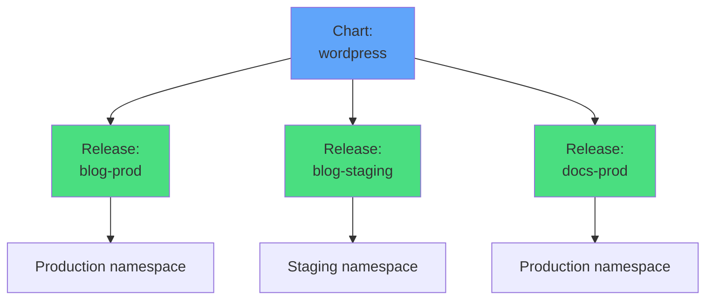

</div>

<!--
METADATA:
sentence: One chart can create multiple releases.
search_anchor: One chart can create multiple releases
-->
<div v-click="2" class="mt-8 text-center opacity-80">
One chart can create multiple releases
</div>

<div class="grid grid-cols-2 gap-6 mt-6">
<!--
METADATA:
sentence: Chart = The application package
search_anchor: Chart = The application package
-->
<div v-click="3" class="text-center">
<carbon-package class="text-4xl text-blue-400 mb-1" />
<strong>Chart</strong><br/>
<span class="text-sm opacity-80">Application package</span>
</div>
<!--
METADATA:
sentence: Release = A running instance of that package
search_anchor: Release = A running instance
-->
<div v-click="4" class="text-center">
<carbon-deployment-pattern class="text-4xl text-green-400 mb-1" />
<strong>Release</strong><br/>
<span class="text-sm opacity-80">Running instance</span>
</div>
</div>

<!--
METADATA:
sentence: The release name is used in Kubernetes object names, ensuring no conflicts between multiple deployments.
search_anchor: release name is used in Kubernetes object names
-->
<div v-click="5" class="mt-6 text-center text-purple-400">
<carbon-tag class="inline-block text-2xl" /> Release name used in Kubernetes object names
</div>

---
layout: center
---

# Chart Repositories

<!--
METADATA:
sentence: Chart repositories are HTTP servers that host packaged charts and an index file listing available charts.
search_anchor: HTTP servers that host packaged charts
-->
<div v-click="1">

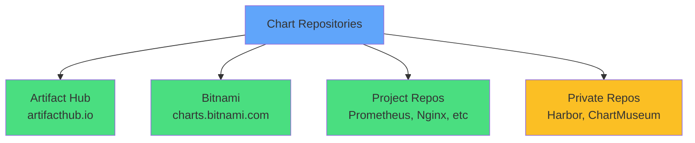

</div>

<div class="grid grid-cols-2 gap-4 mt-6 text-sm">
<!--
METADATA:
sentence: helm repo add: Add a repository
search_anchor: helm repo add
-->
<div v-click="2">
<carbon-terminal class="inline-block text-2xl text-blue-400" /> helm repo add
</div>
<!--
METADATA:
sentence: helm repo update: Refresh the repository index
search_anchor: helm repo update
-->
<div v-click="3">
<carbon-renew class="inline-block text-2xl text-green-400" /> helm repo update
</div>
<!--
METADATA:
sentence: helm search repo: Find charts
search_anchor: helm search repo
-->
<div v-click="4">
<carbon-search class="inline-block text-2xl text-purple-400" /> helm search repo
</div>
<!--
METADATA:
sentence: helm show: Display chart information and values
search_anchor: helm show
-->
<div v-click="5">
<carbon-view class="inline-block text-2xl text-yellow-400" /> helm show values
</div>
</div>

<!--
METADATA:
sentence: Chart repositories are HTTP servers that host packaged charts and an index file listing available charts.
search_anchor: HTTP servers hosting packaged charts
-->
<div v-click="6" class="mt-8 text-center opacity-80">
HTTP servers hosting packaged charts
</div>

---
layout: center
---

# Helm Lifecycle Operations

<!--
METADATA:
sentence: Helm provides commands for the complete application lifecycle.
search_anchor: complete application lifecycle
-->
<div v-click="1">

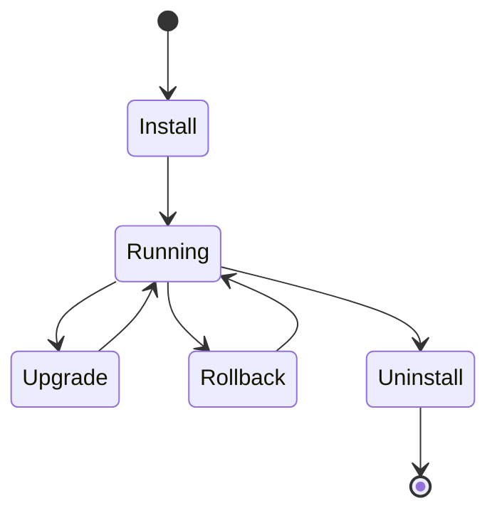

</div>

<div class="grid grid-cols-2 gap-4 mt-6 text-sm">
<!--
METADATA:
sentence: helm install: Deploy a new release
search_anchor: helm install: Deploy a new release
-->
<div v-click="2">
<carbon-add class="inline-block text-2xl text-green-400" /> <strong>install:</strong> Deploy new release
</div>
<!--
METADATA:
sentence: helm upgrade: Update an existing release
search_anchor: helm upgrade: Update an existing release
-->
<div v-click="3">
<carbon-upgrade class="inline-block text-2xl text-blue-400" /> <strong>upgrade:</strong> Update existing release
</div>
<!--
METADATA:
sentence: helm rollback: Revert to a previous revision
search_anchor: helm rollback: Revert to a previous revision
-->
<div v-click="4">
<carbon-reset class="inline-block text-2xl text-yellow-400" /> <strong>rollback:</strong> Revert to previous revision
</div>
<!--
METADATA:
sentence: helm list: Show all releases
search_anchor: helm list: Show all releases
-->
<div v-click="5">
<carbon-list class="inline-block text-2xl text-purple-400" /> <strong>list:</strong> Show all releases
</div>
<!--
METADATA:
sentence: helm status: Display release status and notes
search_anchor: helm status: Display release status
-->
<div v-click="6">
<carbon-information class="inline-block text-2xl text-teal-400" /> <strong>status:</strong> Display release status
</div>
<!--
METADATA:
sentence: helm uninstall: Remove the release
search_anchor: helm uninstall: Remove
-->
<div v-click="7">
<carbon-close class="inline-block text-2xl text-red-400" /> <strong>uninstall:</strong> Remove release
</div>
</div>

---
layout: center
---

# Install and Upgrade

<!--
METADATA:
sentence: helm install: Deploy a new release
search_anchor: Specify name, chart location, and custom values
-->
<div v-click="1" class="mb-4">

```bash
# Install new release
helm install myapp bitnami/nginx --set replicas=3

# Install with custom values file
helm install myapp bitnami/nginx -f prod-values.yaml

# Upgrade with new values
helm upgrade myapp bitnami/nginx --set replicas=5

# Install or upgrade (idempotent)
helm upgrade --install myapp bitnami/nginx
```

</div>

<!--
METADATA:
sentence: Creates a new revision while preserving history
search_anchor: Creates a new revision while preserving history
-->
<div v-click="2">

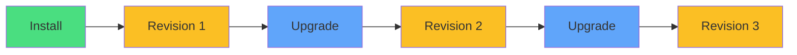

</div>

<!--
METADATA:
sentence: Creates a new revision while preserving history
search_anchor: Each upgrade creates a new revision
-->
<div v-click="3" class="mt-6 text-center text-sm">
<carbon-version class="inline-block text-2xl text-purple-400" /> Each upgrade creates a new revision
</div>

---
layout: center
---

# Rollback and History

<!--
METADATA:
sentence: helm rollback: Revert to a previous revision
search_anchor: Useful when upgrades cause issues
-->
<div v-click="1" class="mb-4">

```bash
# View release history
helm history myapp

# Rollback to previous revision
helm rollback myapp

# Rollback to specific revision
helm rollback myapp 2
```

</div>

<!--
METADATA:
sentence: Useful when upgrades cause issues
search_anchor: Issue detected!
-->
<div v-click="2">

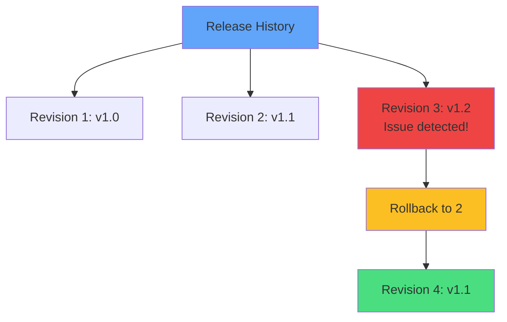

</div>

<!--
METADATA:
sentence: Rollback creates a new revision
search_anchor: Rollback creates a new revision
-->
<div v-click="3" class="mt-6 text-center opacity-80">
Rollback creates a new revision
</div>

<!--
METADATA:
sentence: Each release maintains a complete revision history
search_anchor: complete revision history
-->
<div v-click="4" class="mt-2 text-center text-green-400">
<carbon-checkmark class="inline-block text-2xl" /> Complete revision history preserved
</div>

---
layout: center
---

# When to Use Helm

<div class="grid grid-cols-2 gap-6 mt-4">
<!--
METADATA:
sentence: Helm excels in specific scenarios: Best use cases: Deploying third-party applications (databases, monitoring, message queues)
search_anchor: Helm excels in specific scenarios
-->
<div v-click="1">
<carbon-checkmark class="text-5xl text-green-400 mb-2" />
<strong>Best Use Cases</strong><br/>
<span class="text-sm opacity-80">• Third-party applications<br/>• Complex applications<br/>• Multiple environments<br/>• Sharing across teams<br/>• Frequent upgrades</span>
</div>
<!--
METADATA:
sentence: When to consider alternatives: Very simple applications (single deployment and service)
search_anchor: When to consider alternatives
-->
<div v-click="2">
<carbon-help class="text-5xl text-yellow-400 mb-2" />
<strong>Consider Alternatives</strong><br/>
<span class="text-sm opacity-80">• Very simple apps<br/>• Template-free preference<br/>• Team lacks Go template knowledge<br/>• Need GitOps workflows</span>
</div>
</div>

<!--
METADATA:
sentence: Many teams use both Helm and Kustomize - Helm for third-party apps and packages, Kustomize for their own application configurations.
search_anchor: Many teams use both Helm and Kustomize
-->
<div v-click="3" class="mt-8 text-center text-lg">
<carbon-flow class="inline-block text-3xl text-blue-400" /> Many teams use Helm + Kustomize together
</div>

<!--
METADATA:
sentence: Many teams use both Helm and Kustomize - Helm for third-party apps and packages, Kustomize for their own application configurations.
search_anchor: Helm for third-party apps
-->
<div v-click="4" class="mt-4 text-center text-sm opacity-80">
Helm for third-party apps • Kustomize for custom apps
</div>

---
layout: center
---

# Helm and CKAD

<!--
METADATA:
sentence: For the CKAD exam, you should know:
search_anchor: For the CKAD exam, you should know
-->
<div v-click="1" class="text-center mb-6">
<carbon-certificate class="inline-block text-6xl text-blue-400" />
</div>

<div class="grid grid-cols-2 gap-4 text-sm">
<!--
METADATA:
sentence: Installing the Helm CLI and verifying it works
search_anchor: Installing the Helm CLI
-->
<div v-click="2">
<carbon-terminal class="inline-block text-2xl text-green-400" /> Install Helm CLI
</div>
<!--
METADATA:
sentence: Installing charts from repositories with custom values
search_anchor: Installing charts from repositories
-->
<div v-click="3">
<carbon-add class="inline-block text-2xl text-green-400" /> Install charts with custom values
</div>
<!--
METADATA:
sentence: Using --set flags to override values
search_anchor: Using --set flags to override values
-->
<div v-click="4">
<carbon-settings class="inline-block text-2xl text-green-400" /> Use --set to override values
</div>
<!--
METADATA:
sentence: Upgrading releases with new values
search_anchor: Upgrading releases with new values
-->
<div v-click="5">
<carbon-upgrade class="inline-block text-2xl text-green-400" /> Upgrade releases
</div>
<!--
METADATA:
sentence: Rolling back releases to previous revisions
search_anchor: Rolling back releases to previous revisions
-->
<div v-click="6">
<carbon-reset class="inline-block text-2xl text-green-400" /> Rollback to previous revisions
</div>
<!--
METADATA:
sentence: Listing releases and viewing their status
search_anchor: Listing releases and viewing their status
-->
<div v-click="7">
<carbon-list class="inline-block text-2xl text-green-400" /> List and view status
</div>
<!--
METADATA:
sentence: Using helm template or kubectl to inspect generated YAML
search_anchor: inspect generated YAML
-->
<div v-click="8">
<carbon-view class="inline-block text-2xl text-green-400" /> Inspect generated YAML
</div>
<!--
METADATA:
sentence: The exam is time-constrained, so being comfortable with Helm basics can save precious minutes.
search_anchor: exam is time-constrained
-->
<div v-click="9">
<carbon-timer class="inline-block text-2xl text-yellow-400" /> Practice for speed
</div>
</div>

<!--
METADATA:
sentence: Remember: helm uninstall removes all resources in a release
search_anchor: helm uninstall removes all resources
-->
<div v-click="10" class="mt-8 text-center text-yellow-400">
<carbon-warning class="inline-block text-2xl" /> Remember: helm uninstall removes all resources
</div>

---
layout: center
---

# Summary

<!--
METADATA:
sentence: Let's recap the key concepts: Helm is a package manager for Kubernetes applications
search_anchor: Let's recap the key concepts
-->
<div v-click="1">

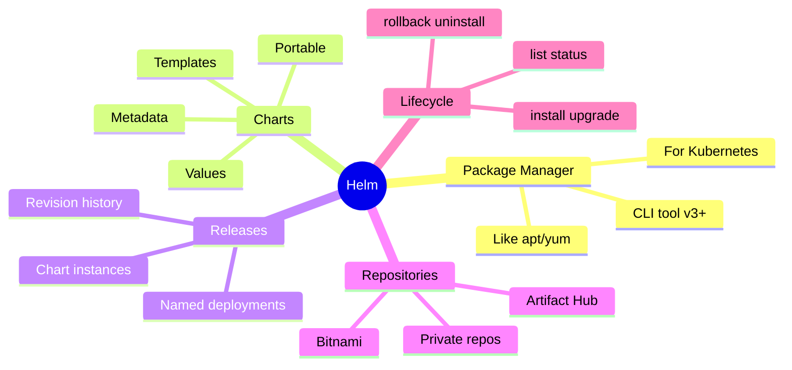

</div>

<!--
METADATA:
sentence: Helm is a package manager for Kubernetes applications
search_anchor: Templating and packaging for Kubernetes
-->
<div v-click="2" class="mt-8 text-center text-lg">
<carbon-checkmark class="inline-block text-2xl text-green-400" /> Templating and packaging for Kubernetes
</div>

<!--
METADATA:
sentence: Values customize charts for different environments
search_anchor: Reusable charts across environments
-->
<div v-click="3" class="mt-2 text-center text-lg">
<carbon-checkmark class="inline-block text-2xl text-green-400" /> Reusable charts across environments
</div>
