# Kubernetes Ingress

<div class="abs-br m-6 flex gap-2">
  <carbon-network-3 class="text-6xl text-blue-400" />
</div>

<!--
METADATA:
sentence: In this presentation, we'll explore how Kubernetes manages external HTTP and HTTPS traffic to services running inside your cluster. Ingress is a critical component for production deployments, and understanding it thoroughly is essential for the CKAD certification exam.
search_anchor: external HTTP and HTTPS traffic to services
-->
<div v-click class="mt-8 text-xl opacity-80">
HTTP/HTTPS routing to services in your cluster
</div>

---
layout: center
---

# The Problem Without Ingress

<!--
METADATA:
sentence: Without Ingress, you have two main options. First, you could use NodePort services, but these expose your applications on non-standard ports like 30000, 30001, and so on. This creates a poor user experience and complicates your firewall rules.
search_anchor: NodePort services, but these expose your applications
-->
<div v-click="1">

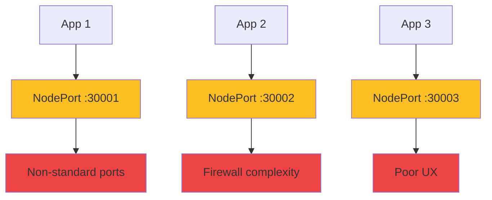

</div>

<!--
METADATA:
sentence: Second, you could use LoadBalancer services, which give you proper port 80 and 443 access. However, each LoadBalancer service typically provisions a separate cloud load balancer, which becomes expensive quickly.
search_anchor: LoadBalancer services, which give you proper port
-->
<div v-click="2" class="mt-8">

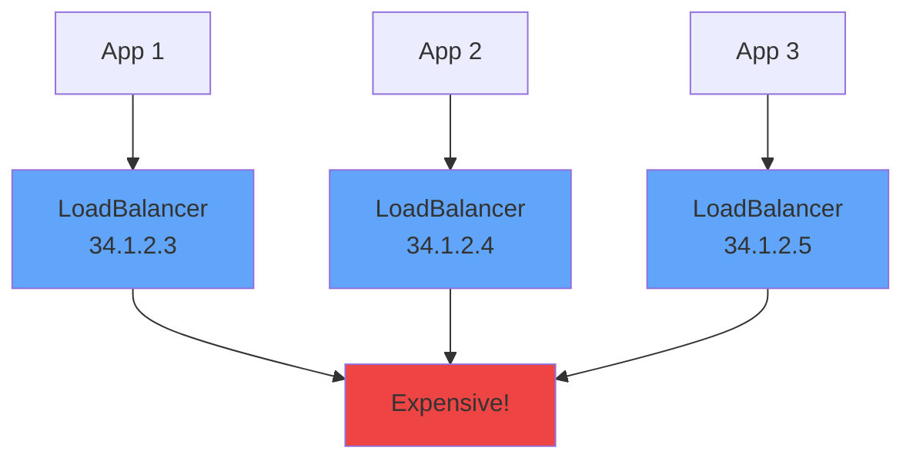

</div>

<!--
METADATA:
sentence: If you have ten applications, you'd need ten load balancers, each with its own public IP address.
search_anchor: ten applications, you'd need ten load balancers
-->
<div v-click="3" class="mt-6 text-center text-yellow-400">
<carbon-warning class="inline-block text-2xl" /> 10 apps = 10 load balancers!
</div>

---
layout: center
---

# What is Ingress?

<!--
METADATA:
sentence: Kubernetes Ingress solves this problem by providing a single entry point for HTTP and HTTPS traffic. Think of it as a smart reverse proxy that routes requests to the appropriate services based on rules you define.
search_anchor: single entry point for HTTP and HTTPS traffic
-->
<div v-click="1">

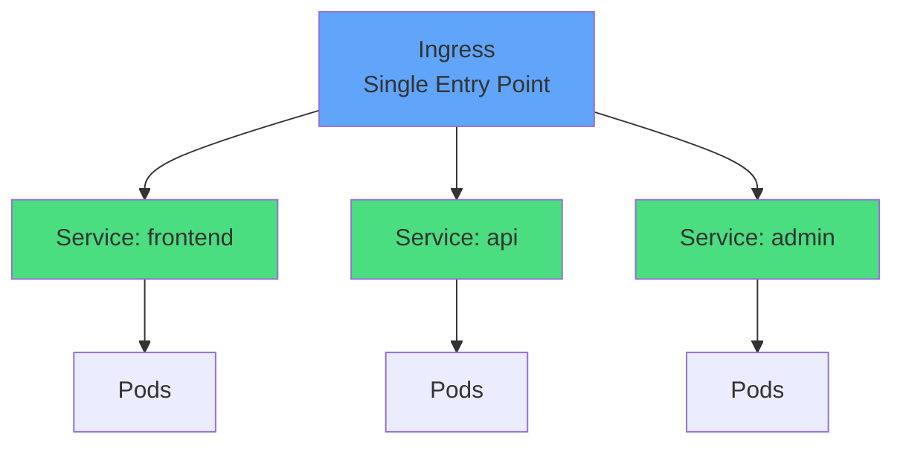

</div>

<div class="grid grid-cols-2 gap-6 mt-8">
<!--
METADATA:
sentence: Think of it as a smart reverse proxy that routes requests to the appropriate services based on rules you define.
search_anchor: smart reverse proxy that routes requests
-->
<div v-click="2">
<carbon-gateway class="text-5xl text-blue-400 mb-2" />
<strong>Smart Reverse Proxy</strong><br/>
<span class="text-sm opacity-80">Routes HTTP/HTTPS traffic</span>
</div>
<!--
METADATA:
sentence: The beauty of this architecture is that you only need one LoadBalancer service for the Ingress Controller, and then all your applications can share that single entry point. This is both cost-effective and operationally simpler.
search_anchor: cost-effective and operationally simpler
-->
<div v-click="3">
<carbon-money class="text-5xl text-green-400 mb-2" />
<strong>Cost Effective</strong><br/>
<span class="text-sm opacity-80">One LoadBalancer for all apps</span>
</div>
</div>

---
layout: center
---

# Ingress Architecture

<!--
METADATA:
sentence: Ingress has two key components.
search_anchor: Ingress has two key components
-->
<div v-click="1">

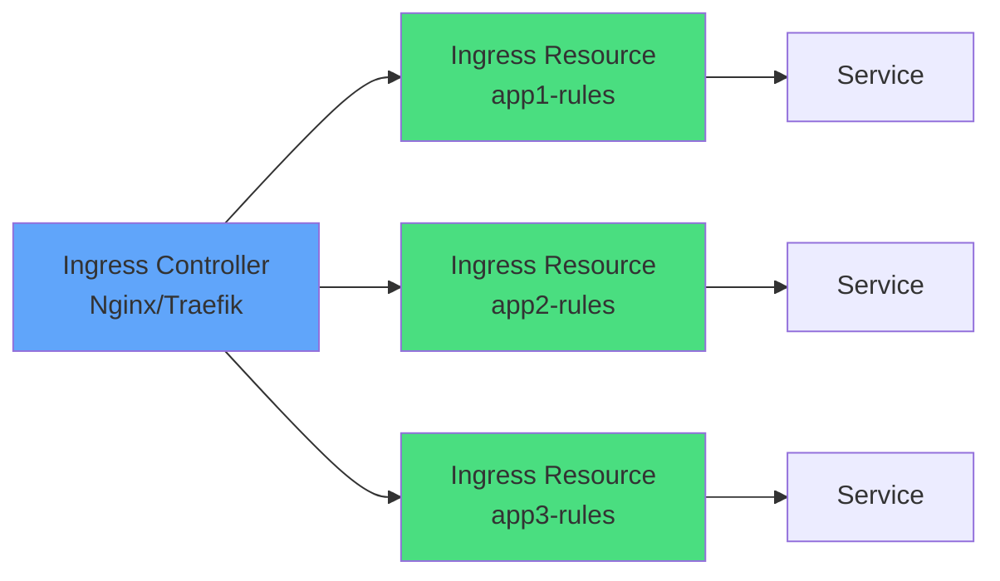

</div>

<div class="grid grid-cols-2 gap-6 mt-8">
<!--
METADATA:
sentence: First, the Ingress Controller, which is the actual reverse proxy handling incoming traffic. This is typically a deployment running software like Nginx, Traefik, or HAProxy.
search_anchor: actual reverse proxy handling incoming traffic
-->
<div v-click="2">
<carbon-container-software class="text-4xl text-blue-400 mb-2" />
<strong>Ingress Controller</strong><br/>
<span class="text-sm opacity-80">Actual reverse proxy (Deployment)</span>
</div>
<!--
METADATA:
sentence: Second, Ingress Resources, which are Kubernetes objects that define routing rules. These are YAML manifests that specify which requests should go to which services.
search_anchor: Kubernetes objects that define routing rules
-->
<div v-click="3">
<carbon-rule class="text-4xl text-green-400 mb-2" />
<strong>Ingress Resources</strong><br/>
<span class="text-sm opacity-80">Routing rules (YAML manifests)</span>
</div>
</div>

<!--
METADATA:
sentence: The controller watches the Kubernetes API for changes and dynamically reconfigures itself.
search_anchor: watches the Kubernetes API for changes
-->
<div v-click="4" class="mt-6 text-center text-yellow-400">
<carbon-checkmark class="inline-block text-2xl" /> Controller watches API, updates config dynamically
</div>

---
layout: center
---

# Ingress Controller Options

<!--
METADATA:
sentence: There are several Ingress Controller implementations available, each with different features and strengths.
search_anchor: several Ingress Controller implementations available
-->
<div v-click="1">

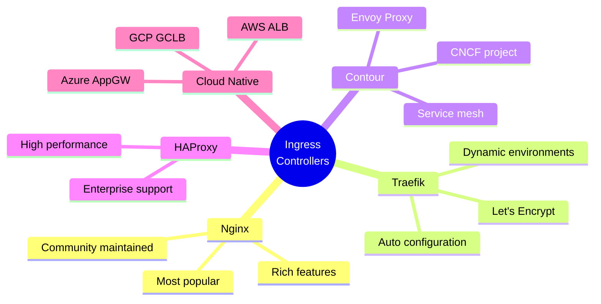

</div>

<!--
METADATA:
sentence: For the CKAD exam, you'll most commonly encounter Nginx, so that's what we'll focus on.
search_anchor: CKAD exam, you'll most commonly encounter Nginx
-->
<div v-click="2" class="mt-8 text-center text-lg">
<carbon-kubernetes class="inline-block text-3xl text-blue-400" /> For CKAD: Focus on <strong>Nginx</strong>
</div>

---
layout: center
---

# Host-Based Routing

<!--
METADATA:
sentence: Let's explore the two main routing strategies, starting with host-based routing. This is sometimes called virtual hosting, similar to what you'd configure in Apache or Nginx directly.
search_anchor: two main routing strategies, starting with host-based routing
-->
<div v-click="1">

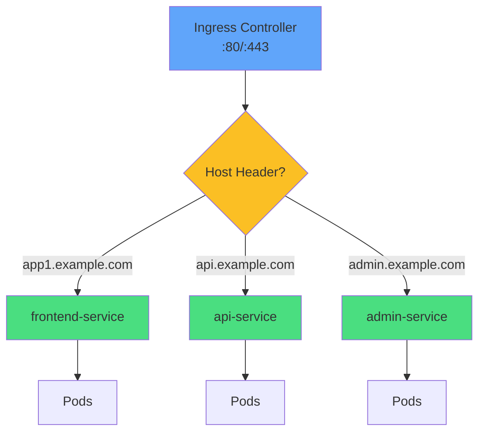

</div>

<!--
METADATA:
sentence: With host-based routing, the Ingress Controller examines the HTTP Host header in each request and routes it accordingly. For example, requests to 'app1.example.com' go to the frontend service, while requests to 'api.example.com' go to the API service, and 'admin.example.com' routes to the admin portal.
search_anchor: examines the HTTP Host header in each request
-->
<div v-click="2" class="mt-8 text-center text-xl">
<carbon-tag class="inline-block text-3xl text-purple-400" /> Different hostname → Different service
</div>

<div class="grid grid-cols-2 gap-6 mt-6 text-sm">
<!--
METADATA:
sentence: This approach is clean and intuitive. Each application gets its own subdomain, and users can bookmark specific applications easily.
search_anchor: clean and intuitive
-->
<div v-click="3">
<carbon-checkmark class="text-3xl text-green-400 mb-1" />
Clean separation, bookmarkable
</div>
<!--
METADATA:
sentence: It also allows you to use different TLS certificates for different hostnames if needed.
search_anchor: different TLS certificates for different hostnames
-->
<div v-click="4">
<carbon-certificate class="text-3xl text-blue-400 mb-1" />
Different TLS certs per host
</div>
</div>

---
layout: center
---

# Path-Based Routing

<!--
METADATA:
sentence: The second routing strategy is path-based routing, where the URL path determines which service receives the request.
search_anchor: path-based routing, where the URL path determines
-->
<div v-click="1">

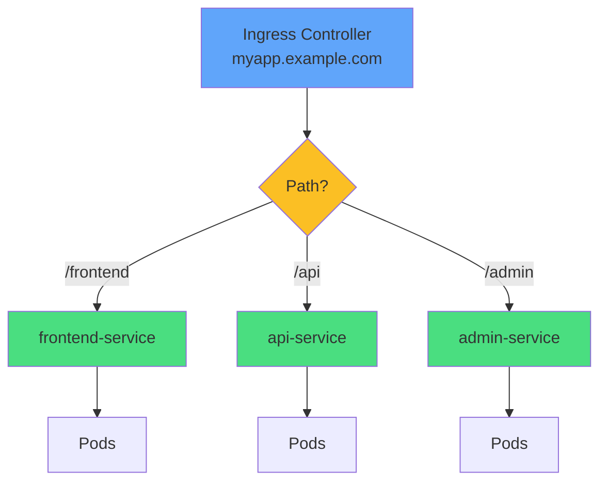

</div>

<!--
METADATA:
sentence: With path-based routing, all requests go to the same hostname, but different URL paths route to different services. For example, 'myapp.example.com/frontend' goes to the frontend service, 'myapp.example.com/api' routes to the API service, and 'myapp.example.com/admin' goes to the admin portal.
search_anchor: same hostname, but different URL paths route
-->
<div v-click="2" class="mt-8 text-center text-xl">
<carbon-network-3 class="inline-block text-3xl text-blue-400" /> Same hostname, different path → Different service
</div>

<div class="grid grid-cols-2 gap-6 mt-6 text-sm">
<!--
METADATA:
sentence: You have two path matching types to choose from. The Prefix type matches the beginning of the path, so '/api' matches '/api/users' and '/api/orders'.
search_anchor: Prefix type matches the beginning of the path
-->
<div v-click="3">
<carbon-rule class="text-3xl text-purple-400 mb-1" />
<strong>Prefix:</strong> /api matches /api/users
</div>
<!--
METADATA:
sentence: The Exact type requires an exact match, so '/health' matches only '/health' and not '/health/check'.
search_anchor: Exact type requires an exact match
-->
<div v-click="4">
<carbon-checkmark class="text-3xl text-green-400 mb-1" />
<strong>Exact:</strong> /health matches only /health
</div>
</div>

---
layout: center
---

# Ingress Resource Structure

<!--
METADATA:
sentence: Let's look at the structure of an Ingress resource. At the top, you specify the API version 'networking.k8s.io/v1' and kind 'Ingress'.
search_anchor: structure of an Ingress resource
-->
<div v-click="1" class="mb-4">

```yaml
apiVersion: networking.k8s.io/v1
kind: Ingress
metadata:
  name: myapp-ingress
spec:
  ingressClassName: nginx
  rules:
  - host: app.example.com
    http:
      paths:
      - path: /api
        pathType: Prefix
        backend:
          service:
            name: api-service
            port:
              number: 8080
```

</div>

<div class="grid grid-cols-2 gap-4 text-xs">
<!--
METADATA:
sentence: First, you can optionally specify an IngressClassName to choose which controller should handle this Ingress. This is important in clusters with multiple controllers installed.
search_anchor: specify an IngressClassName to choose which controller
-->
<div v-click="2">
<carbon-tag class="inline-block text-2xl text-blue-400" /> <strong>ingressClassName:</strong> Which controller
</div>
<!--
METADATA:
sentence: Each rule can specify a host for host-based routing. If you omit the host, it becomes a default catch-all rule.
search_anchor: specify a host for host-based routing
-->
<div v-click="3">
<carbon-network-3 class="inline-block text-2xl text-green-400" /> <strong>host:</strong> Hostname (optional)
</div>
<!--
METADATA:
sentence: Under each rule, the http section contains paths. Each path defines three key things: the path itself like '/api'
search_anchor: path itself like '/api'
-->
<div v-click="4">
<carbon-rule class="inline-block text-2xl text-purple-400" /> <strong>path:</strong> URL path
</div>
<!--
METADATA:
sentence: the pathType which is usually Prefix or Exact
search_anchor: pathType which is usually Prefix or Exact
-->
<div v-click="5">
<carbon-flow class="inline-block text-2xl text-yellow-400" /> <strong>pathType:</strong> Prefix or Exact
</div>
<!--
METADATA:
sentence: and the backend which specifies which service should receive the traffic.
search_anchor: backend which specifies which service should receive
-->
<div v-click="6">
<carbon-container-software class="inline-block text-2xl text-red-400" /> <strong>backend:</strong> Target service
</div>
<!--
METADATA:
sentence: The backend section references a service by name and port. You can reference the port by number like 8080, or by name like 'http' if your service has named ports.
search_anchor: port by number like 8080
-->
<div v-click="7">
<carbon-network-1 class="inline-block text-2xl text-teal-400" /> <strong>port:</strong> Service port
</div>
</div>

---
layout: center
---

# How Ingress Controllers Work

<!--
METADATA:
sentence: Let's understand what happens when a request hits your cluster. The Ingress Controller receives the incoming HTTP or HTTPS request, typically on ports 80 or 443.
search_anchor: request hits your cluster
-->
<div v-click="1">

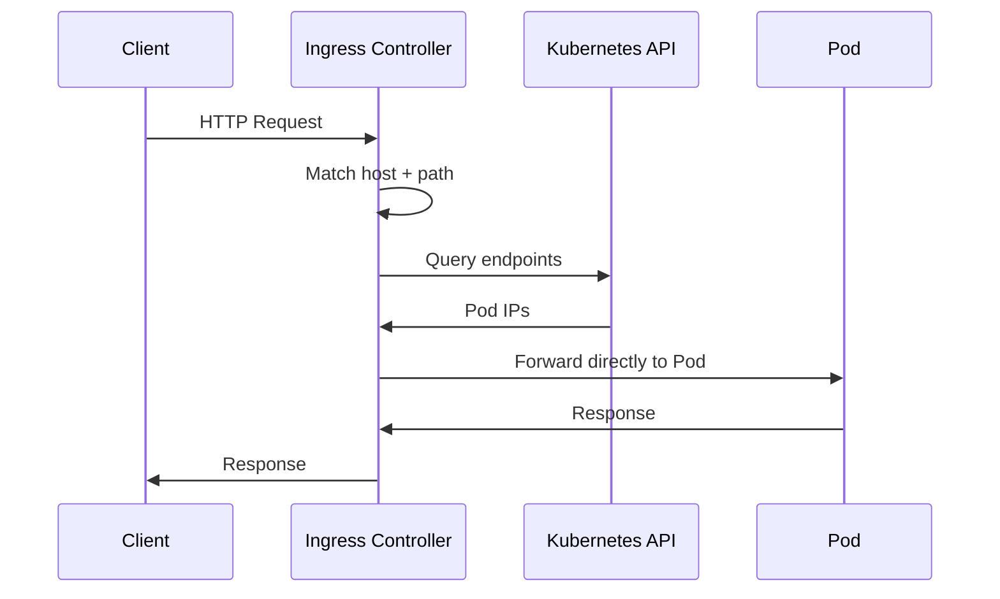

</div>

<!--
METADATA:
sentence: Here's a crucial point: the Ingress Controller doesn't forward the request to the service itself. Instead, it queries the Kubernetes API to get the list of endpoints backing that service - the actual Pod IP addresses. Then it forwards the request directly to one of those Pods, performing its own load balancing.
search_anchor: forwards the request directly to one of those Pods
-->
<div v-click="2" class="mt-8 text-center">
<carbon-lightning class="inline-block text-3xl text-blue-400" /> <strong>Direct-to-Pod routing</strong>
</div>

<!--
METADATA:
sentence: This direct-to-Pod routing is efficient because it avoids an extra network hop through the service.
search_anchor: avoids an extra network hop through the service
-->
<div v-click="3" class="mt-4 text-center text-sm opacity-80">
Bypasses service for efficiency
</div>

<!--
METADATA:
sentence: However, it means the Ingress Controller must have cluster-wide permissions to read service endpoints, which is why you'll see RBAC rules in the controller's deployment manifests.
search_anchor: cluster-wide permissions to read service endpoints
-->
<div v-click="4" class="mt-6 text-center text-yellow-400">
<carbon-warning class="inline-block text-2xl" /> Controller needs RBAC to read endpoints
</div>

---
layout: center
---

# Controller-Specific Features

<!--
METADATA:
sentence: The Ingress API provides a standard set of routing capabilities, but each controller offers additional features through annotations. These are metadata fields that the controller reads to enable advanced functionality.
search_anchor: additional features through annotations
-->
<div v-click="1" class="mb-4">

```yaml
apiVersion: networking.k8s.io/v1
kind: Ingress
metadata:
  name: myapp-ingress
  annotations:
    nginx.ingress.kubernetes.io/rewrite-target: /
    nginx.ingress.kubernetes.io/ssl-redirect: "true"
    nginx.ingress.kubernetes.io/rate-limit: "10"
```

</div>

<div class="grid grid-cols-2 gap-4 text-sm">
<!--
METADATA:
sentence: For the Nginx Ingress Controller, common annotations include response caching to improve performance
search_anchor: response caching to improve performance
-->
<div v-click="2">
<carbon-cache class="text-3xl text-blue-400 mb-1" />
<strong>Caching</strong><br/>
Response caching
</div>
<!--
METADATA:
sentence: rewrite-target to modify request paths before forwarding them to the backend
search_anchor: modify request paths before forwarding them to the backend
-->
<div v-click="3">
<carbon-edit class="text-3xl text-green-400 mb-1" />
<strong>Rewrite</strong><br/>
Path modification
</div>
<!--
METADATA:
sentence: SSL redirect to automatically redirect HTTP requests to HTTPS
search_anchor: automatically redirect HTTP requests to HTTPS
-->
<div v-click="4">
<carbon-locked class="text-3xl text-purple-400 mb-1" />
<strong>SSL Redirect</strong><br/>
HTTP → HTTPS
</div>
<!--
METADATA:
sentence: rate limiting to prevent abuse, and CORS configuration for cross-origin requests.
search_anchor: rate limiting to prevent abuse
-->
<div v-click="5">
<carbon-dashboard class="text-3xl text-yellow-400 mb-1" />
<strong>Rate Limiting</strong><br/>
Prevent abuse
</div>
</div>

<!--
METADATA:
sentence: These annotations are controller-specific. If you switch from Nginx to Traefik, you'll need to update your annotations to use Traefik's syntax.
search_anchor: annotations are controller-specific
-->
<div v-click="6" class="mt-8 text-center text-yellow-400">
<carbon-warning class="inline-block text-2xl" /> Annotations are controller-specific!
</div>

---
layout: center
---

# TLS/HTTPS Configuration

<!--
METADATA:
sentence: You can also specify a TLS section at the spec level to configure HTTPS, which we'll explore in more detail during the practical exercises.
search_anchor: TLS section at the spec level to configure HTTPS
-->
<div v-click="1" class="mb-4">

```yaml
apiVersion: networking.k8s.io/v1
kind: Ingress
metadata:
  name: myapp-ingress
spec:
  tls:
  - hosts:
    - app.example.com
    secretName: app-tls-secret
  rules:
  - host: app.example.com
    http:
      paths:
      - path: /
        pathType: Prefix
        backend:
          service:
            name: app-service
            port:
              number: 80
```

</div>

<!--
METADATA:
sentence: You can also specify a TLS section at the spec level to configure HTTPS, which we'll explore in more detail during the practical exercises.
search_anchor: TLS section at the spec level
-->
<div v-click="2">

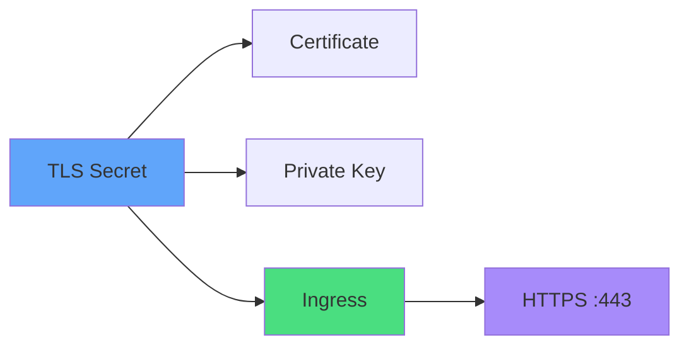

</div>

---
layout: center
---

# Default Backend

<!--
METADATA:
sentence: Finally, let's discuss default backends. When a request doesn't match any Ingress rules, the controller can forward it to a default backend service instead of returning a 404 error.
search_anchor: request doesn't match any Ingress rules
-->
<div v-click="1">

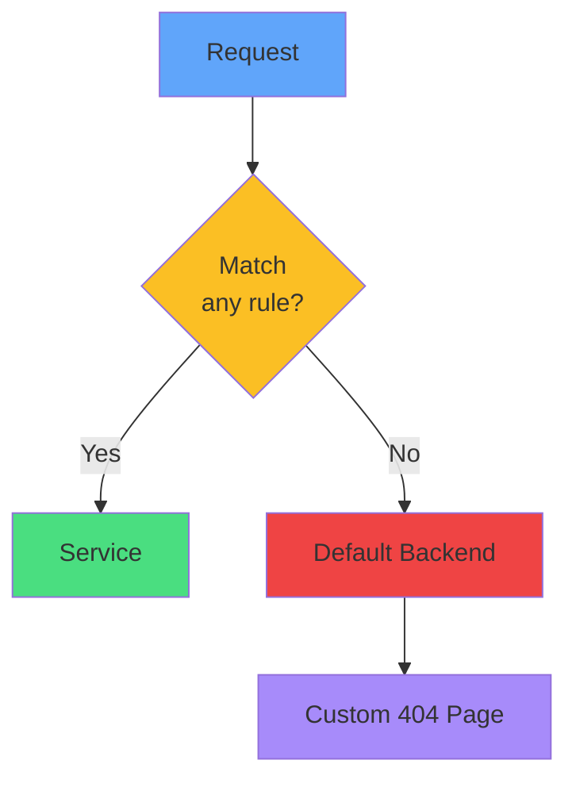

</div>

<!--
METADATA:
sentence: However, you can override this by specifying a defaultBackend section in your Ingress resource, pointing to your own service that provides a custom error page or landing page.
search_anchor: specifying a defaultBackend section in your Ingress resource
-->
<div v-click="2" class="mt-8">

```yaml
spec:
  defaultBackend:
    service:
      name: default-http-backend
      port:
        number: 80
```

</div>

<!--
METADATA:
sentence: This is useful for branding purposes or to provide helpful navigation when users reach an invalid URL.
search_anchor: branding purposes or to provide helpful navigation
-->
<div v-click="3" class="mt-6 text-center">
<carbon-view class="inline-block text-3xl text-purple-400" /> Custom 404 or landing page
</div>

---
layout: center
---

# Multiple Rules Example

<!--
METADATA:
sentence: You can also combine both strategies - using different hostnames with different paths on each hostname.
search_anchor: combine both strategies
-->
<div v-click="1" class="text-xs">

```yaml
apiVersion: networking.k8s.io/v1
kind: Ingress
metadata:
  name: multi-ingress
spec:
  ingressClassName: nginx
  rules:
  - host: app1.example.com
    http:
      paths:
      - path: /
        pathType: Prefix
        backend:
          service:
            name: app1-service
            port:
              number: 80
  - host: app2.example.com
    http:
      paths:
      - path: /api
        pathType: Prefix
        backend:
          service:
            name: app2-api
            port:
              number: 8080
      - path: /web
        pathType: Prefix
        backend:
          service:
            name: app2-web
            port:
              number: 80
```

</div>

<!--
METADATA:
sentence: This gives you maximum routing flexibility for complex applications.
search_anchor: maximum routing flexibility for complex applications
-->
<div v-click="2" class="mt-4 text-center text-sm">
<carbon-flow class="inline-block text-2xl text-blue-400" /> Combine host + path routing
</div>

---
layout: center
---

# Common Patterns

<div class="grid grid-cols-2 gap-6 mt-4">
<!--
METADATA:
sentence: Host-based routing is the most common pattern for multi-tenant applications or when you want clear separation between different services.
search_anchor: most common pattern for multi-tenant applications
-->
<div v-click="1">
<carbon-application class="text-4xl text-blue-400 mb-2" />
<strong>Single App</strong><br/>
<span class="text-sm opacity-80">One host, one service<br/>app.example.com → app-service</span>
</div>
<!--
METADATA:
sentence: Host-based routing is the most common pattern for multi-tenant applications or when you want clear separation between different services.
search_anchor: clear separation between different services
-->
<div v-click="2">
<carbon-apps class="text-4xl text-green-400 mb-2" />
<strong>Multi-App</strong><br/>
<span class="text-sm opacity-80">Multiple hosts<br/>app1.com, app2.com, app3.com</span>
</div>
<!--
METADATA:
sentence: Path-based routing is useful when you want a unified domain for your entire application platform, or when you're constrained on the number of hostnames you can use. It's also common in microservices architectures where you want all services under a single API gateway.
search_anchor: common in microservices architectures
-->
<div v-click="3">
<carbon-flow class="text-4xl text-purple-400 mb-2" />
<strong>Microservices</strong><br/>
<span class="text-sm opacity-80">Path-based routing<br/>/api, /web, /admin</span>
</div>
<!--
METADATA:
sentence: However, the basic routing rules in the spec section remain the same.
search_anchor: basic routing rules in the spec section
-->
<div v-click="4">
<carbon-version class="text-4xl text-yellow-400 mb-2" />
<strong>A/B Testing</strong><br/>
<span class="text-sm opacity-80">Traffic splitting<br/>v1 vs v2 with annotations</span>
</div>
</div>

---
layout: center
---

# Troubleshooting

<!--
METADATA:
sentence: The controller continuously watches the Kubernetes API for changes to Ingress resources, services, and endpoints, dynamically updating its routing configuration without restarts.
search_anchor: watches the Kubernetes API for changes to Ingress resources
-->
<div v-click="1">

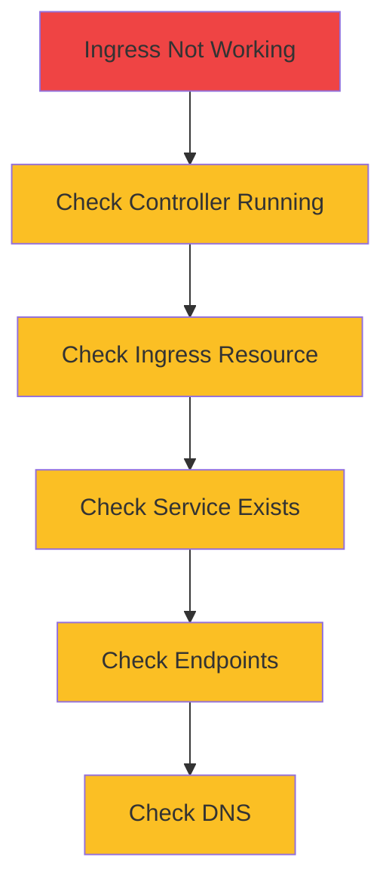

</div>

<div class="grid grid-cols-2 gap-4 mt-6 text-sm">
<!--
METADATA:
sentence: In the CKAD exam, you might need to use annotations for tasks like enabling HTTPS redirects or configuring rewrite rules.
search_anchor: HTTPS redirects or configuring rewrite rules
-->
<div v-click="2">
<carbon-terminal class="inline-block text-2xl text-blue-400" /> kubectl describe ingress
</div>
<!--
METADATA:
sentence: However, it means the Ingress Controller must have cluster-wide permissions to read service endpoints, which is why you'll see RBAC rules in the controller's deployment manifests.
search_anchor: read service endpoints
-->
<div v-click="3">
<carbon-view class="inline-block text-2xl text-green-400" /> kubectl get endpoints
</div>
<!--
METADATA:
sentence: The controller watches the Kubernetes API for changes and dynamically reconfigures itself.
search_anchor: dynamically reconfigures itself
-->
<div v-click="4">
<carbon-debug class="inline-block text-2xl text-purple-400" /> Check controller logs
</div>
<!--
METADATA:
sentence: The Exact type requires an exact match, so '/health' matches only '/health' and not '/health/check'.
search_anchor: '/health' matches only '/health'
-->
<div v-click="5">
<carbon-rule class="inline-block text-2xl text-yellow-400" /> Verify pathType matches
</div>
</div>

---
layout: center
---

# Summary

<!--
METADATA:
sentence: To summarize, Ingress provides HTTP and HTTPS routing for your Kubernetes applications through two components: the Ingress Controller, which is the actual proxy, and Ingress Resources, which define routing rules.
search_anchor: Ingress provides HTTP and HTTPS routing
-->
<div v-click="1">

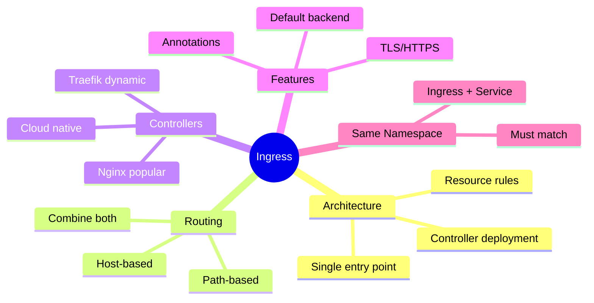

</div>

---
layout: center
---

# CKAD Exam Focus

<!--
METADATA:
sentence: In this presentation, we'll explore how Kubernetes manages external HTTP and HTTPS traffic to services running inside your cluster. Ingress is a critical component for production deployments, and understanding it thoroughly is essential for the CKAD certification exam.
search_anchor: essential for the CKAD certification exam
-->
<div v-click="1" class="text-center mb-6">
<carbon-certificate class="inline-block text-6xl text-blue-400" />
</div>

<div class="grid grid-cols-2 gap-4 text-sm">
<!--
METADATA:
sentence: Let's look at the structure of an Ingress resource. At the top, you specify the API version 'networking.k8s.io/v1' and kind 'Ingress'.
search_anchor: API version 'networking.k8s.io/v1' and kind 'Ingress'
-->
<div v-click="2">
<carbon-edit class="inline-block text-2xl text-green-400" /> Create Ingress resources
</div>
<!--
METADATA:
sentence: With host-based routing, the Ingress Controller examines the HTTP Host header in each request and routes it accordingly.
search_anchor: HTTP Host header in each request
-->
<div v-click="3">
<carbon-network-3 class="inline-block text-2xl text-green-400" /> Host-based routing
</div>
<!--
METADATA:
sentence: The second routing strategy is path-based routing, where the URL path determines which service receives the request.
search_anchor: URL path determines which service receives
-->
<div v-click="4">
<carbon-rule class="inline-block text-2xl text-green-400" /> Path-based routing
</div>
<!--
METADATA:
sentence: You can also specify a TLS section at the spec level to configure HTTPS, which we'll explore in more detail during the practical exercises.
search_anchor: practical exercises
-->
<div v-click="5">
<carbon-locked class="inline-block text-2xl text-green-400" /> Configure TLS
</div>
<!--
METADATA:
sentence: In the CKAD exam, you might need to use annotations for tasks like enabling HTTPS redirects or configuring rewrite rules. The exam environment typically includes documentation, so you can look up the specific annotation syntax during the test.
search_anchor: exam environment typically includes documentation
-->
<div v-click="6">
<carbon-settings class="inline-block text-2xl text-green-400" /> Use annotations
</div>
<!--
METADATA:
sentence: The controller continuously watches the Kubernetes API for changes to Ingress resources, services, and endpoints, dynamically updating its routing configuration without restarts.
search_anchor: Ingress resources, services, and endpoints
-->
<div v-click="7">
<carbon-debug class="inline-block text-2xl text-green-400" /> Troubleshoot routing
</div>
<!--
METADATA:
sentence: You can route traffic based on hostnames, URL paths, or a combination of both. Use annotations for controller-specific features. And remember that Ingress resources and services must be in the same namespace.
search_anchor: Ingress resources and services must be in the same namespace
-->
<div v-click="8">
<carbon-warning class="inline-block text-2xl text-yellow-400" /> Same namespace required
</div>
<!--
METADATA:
sentence: In our next session, we'll put this knowledge into practice with hands-on exercises deploying real applications with Ingress routing.
search_anchor: hands-on exercises deploying real applications
-->
<div v-click="9">
<carbon-timer class="inline-block text-2xl text-red-400" /> Practice YAML quickly
</div>
</div>

---
layout: center
---

# Next Steps

<!--
METADATA:
sentence: In our next session, we'll put this knowledge into practice with hands-on exercises deploying real applications with Ingress routing.
search_anchor: put this knowledge into practice
-->
<div v-click="1" class="text-center mb-8">
<carbon-education class="inline-block text-6xl text-blue-400" />
</div>

<!--
METADATA:
sentence: In our next session, we'll put this knowledge into practice with hands-on exercises deploying real applications with Ingress routing.
search_anchor: deploying real applications with Ingress routing
-->
<div v-click="2">

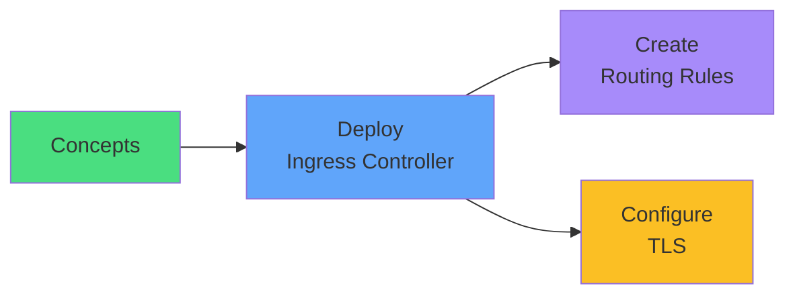

</div>

<!--
METADATA:
sentence: In our next session, we'll put this knowledge into practice with hands-on exercises deploying real applications with Ingress routing. Thank you for watching.
search_anchor: Thank you for watching
-->
<div v-click="3" class="mt-8 text-center text-xl">
Let's route some traffic! <carbon-arrow-right class="inline-block text-2xl" />
</div>
