# Jobs and CronJobs

<div class="abs-br m-6 flex gap-2">
  <carbon-task class="text-6xl text-blue-400" />
</div>

<!--
METADATA:
sentence: Unlike Deployments that keep applications running indefinitely, Jobs are designed for tasks that need to run to completion and then stop.
search_anchor: Jobs are designed for tasks that need to run to completion
-->
<div v-click class="mt-8 text-xl opacity-80">
Running one-off and scheduled workloads in Kubernetes
</div>

---
layout: center
---

# The Problem Jobs Solve

<!--
METADATA:
sentence: Let's understand the problem Jobs solve.
search_anchor: understand the problem Jobs solve
-->
<div v-click="1">

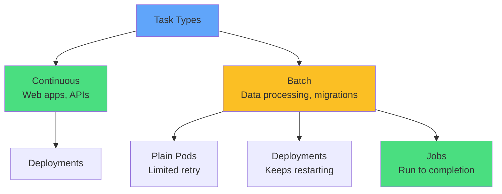

</div>

<div class="grid grid-cols-3 gap-4 mt-8 text-sm">
<!--
METADATA:
sentence: Run a database migration.
search_anchor: database migration
-->
<div v-click="2" class="text-center">
<carbon-data-base class="text-3xl text-blue-400 mb-1" />
Database migrations
</div>
<!--
METADATA:
sentence: Process a batch of data one time.
search_anchor: batch of data one time
-->
<div v-click="3" class="text-center">
<carbon-analytics class="text-3xl text-green-400 mb-1" />
Batch processing
</div>
<!--
METADATA:
sentence: Perform a cleanup task.
search_anchor: Perform a cleanup task
-->
<div v-click="4" class="text-center">
<carbon-clean class="text-3xl text-purple-400 mb-1" />
Cleanup tasks
</div>
</div>

---
layout: center
---

# Job Architecture

<!--
METADATA:
sentence: A Job is a Pod controller - it manages the lifecycle of one or more Pods.
search_anchor: Job is a Pod controller
-->
<div v-click="1">

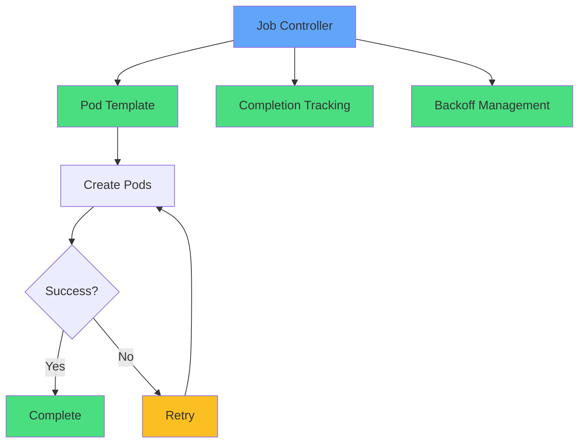

</div>

<!--
METADATA:
sentence: The Job controller ensures your work completes successfully, even if it takes multiple attempts.
search_anchor: ensures your work completes successfully
-->
<div v-click="2" class="mt-8 text-center text-xl">
<carbon-task-complete class="inline-block text-4xl text-green-400" /> Ensures work completes, with retries
</div>

<!--
METADATA:
sentence: Jobs are immutable - you cannot update the Pod template.
search_anchor: Jobs are immutable
-->
<div v-click="3" class="mt-6 text-center text-yellow-400">
<carbon-warning class="inline-block text-2xl" /> Jobs are immutable - cannot update Pod template
</div>

---
layout: center
---

# Job Restart Policies

<!--
METADATA:
sentence: Jobs require specific restart policies - the default Pod behavior of "Always" is not allowed.
search_anchor: Jobs require specific restart policies
-->
<div v-click="1">

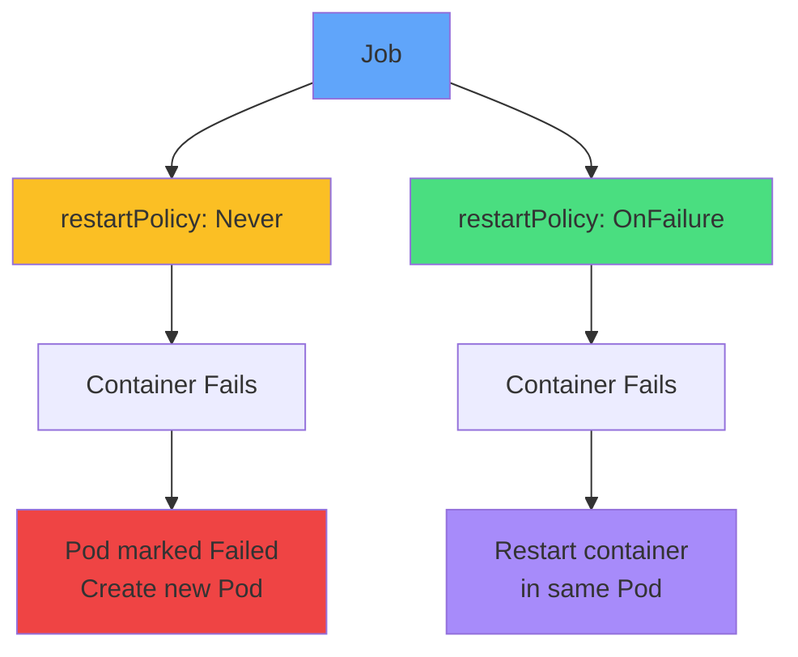

</div>

<div class="grid grid-cols-2 gap-6 mt-8">
<!--
METADATA:
sentence: Never - When a container fails: The Pod is marked as Failed, The Job creates a new Pod, Best for: Network issues, node problems, or when you need a fresh environment.
search_anchor: Never - When a container fails
-->
<div v-click="2">
<carbon-close class="text-4xl text-yellow-400 mb-2" />
<strong>Never</strong><br/>
<span class="text-sm opacity-80">New Pod on failure<br/>Best for node issues</span>
</div>
<!--
METADATA:
sentence: OnFailure - When a container fails: A new container starts in the same Pod, The RESTARTS counter increments, Best for: Quick failures, saving Pod creation overhead.
search_anchor: OnFailure - When a container fails
-->
<div v-click="3">
<carbon-restart class="text-4xl text-green-400 mb-2" />
<strong>OnFailure</strong><br/>
<span class="text-sm opacity-80">Restart in same Pod<br/>Save Pod creation overhead</span>
</div>
</div>

<!--
METADATA:
sentence: Critical exam tip: If you create a Job without specifying a restart policy, it will be rejected.
search_anchor: Critical exam tip
-->
<div v-click="4" class="mt-6 text-center text-red-400">
<carbon-warning class="inline-block text-2xl" /> Always specify restart policy - no default!
</div>

---
layout: center
---

# Completion Modes

<!--
METADATA:
sentence: Jobs can run in different modes depending on your needs.
search_anchor: Jobs can run in different modes
-->
<div v-click="1">

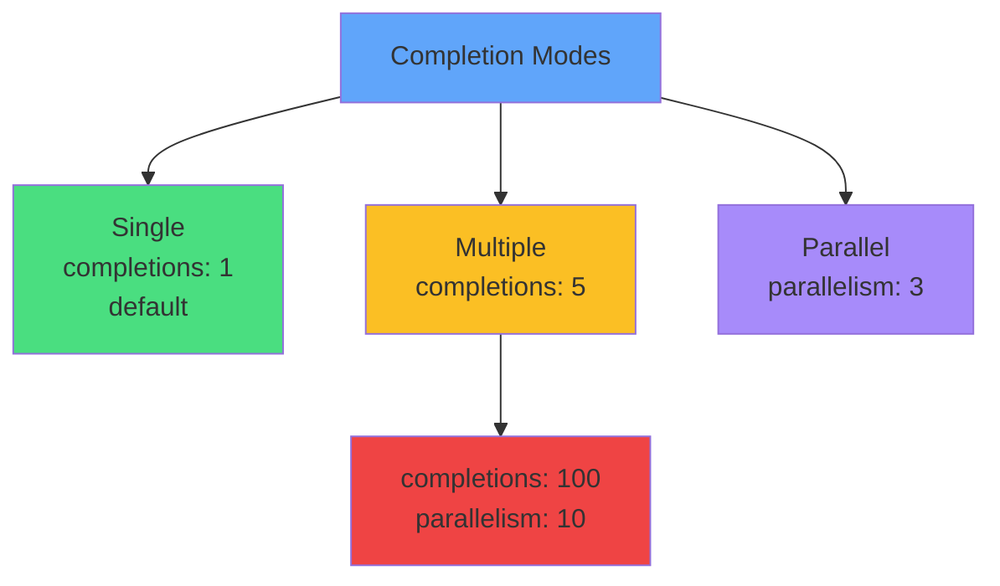

</div>

<div class="grid grid-cols-3 gap-4 mt-8 text-sm">
<!--
METADATA:
sentence: Single Completion (default): Runs one Pod to completion, Perfect for one-off tasks, Example: Database migration.
search_anchor: Single Completion (default)
-->
<div v-click="2" class="text-center">
<carbon-task class="text-3xl text-green-400 mb-1" />
<strong>Single</strong><br/>
One Pod to completion
</div>
<!--
METADATA:
sentence: Multiple Completions: Runs a fixed number of Pods to completion, Specified with completions: 5, Perfect for: Processing a known number of items.
search_anchor: Multiple Completions
-->
<div v-click="3" class="text-center">
<carbon-list class="text-3xl text-yellow-400 mb-1" />
<strong>Multiple</strong><br/>
N Pods sequentially
</div>
<!--
METADATA:
sentence: Parallel Execution: Runs multiple Pods concurrently, Specified with parallelism: 3, Combined with completions for parallel batch processing.
search_anchor: Parallel Execution
-->
<div v-click="4" class="text-center">
<carbon-flow class="text-3xl text-purple-400 mb-1" />
<strong>Parallel</strong><br/>
N Pods concurrently
</div>
</div>

<!--
METADATA:
sentence: Example scenario: Process 100 files - Set completions: 100 - need 100 successful Pods, Set parallelism: 10 - run 10 at a time, Total time = roughly 1/10th of sequential processing.
search_anchor: Example scenario: Process 100 files
-->
<div v-click="5" class="mt-6 text-center">
<carbon-analytics class="inline-block text-2xl text-blue-400" /> completions: 100, parallelism: 10 = 10x faster
</div>

---
layout: center
---

# Backoff Limits and Failure Handling

<!--
METADATA:
sentence: Jobs have sophisticated failure handling through the backoffLimit field.
search_anchor: sophisticated failure handling through the backoffLimit
-->
<div v-click="1">

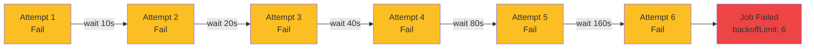

</div>

<!--
METADATA:
sentence: Wait time increases exponentially: 10s, 20s, 40s, up to 6 minutes.
search_anchor: Wait time increases exponentially
-->
<div v-click="2" class="mt-6 text-center text-xl">
<carbon-time class="inline-block text-3xl text-yellow-400" /> Exponential backoff: 10s → 20s → 40s → up to 6 minutes
</div>

<!--
METADATA:
sentence: Default: 6 attempts.
search_anchor: Default: 6 attempts
-->
<div v-click="3" class="mt-4 text-center text-sm">
<strong>backoffLimit:</strong> 6 (default) - Max retry attempts
</div>

---
layout: center
---

# Job YAML Structure

<!--
METADATA:
sentence: This is the YAML example itself showing the structure of a Job specification.
search_anchor: Job YAML example structure
-->
<div v-click="1" class="mb-4">

```yaml
apiVersion: batch/v1
kind: Job
metadata:
  name: data-migration
spec:
  completions: 1
  parallelism: 1
  backoffLimit: 3
  template:
    spec:
      restartPolicy: Never
      containers:
      - name: migrate
        image: myapp:v1
        command: ["python", "migrate.py"]
```

</div>

<div class="grid grid-cols-2 gap-4 text-xs">
<!--
METADATA:
sentence: completions: Total successes needed field specification.
search_anchor: completions: Total successes needed
-->
<div v-click="2">
<carbon-task class="inline-block text-2xl text-blue-400" /> <strong>completions:</strong> Total successes needed
</div>
<!--
METADATA:
sentence: parallelism: Concurrent Pods field specification.
search_anchor: parallelism: Concurrent Pods
-->
<div v-click="3">
<carbon-flow class="inline-block text-2xl text-green-400" /> <strong>parallelism:</strong> Concurrent Pods
</div>
<!--
METADATA:
sentence: backoffLimit: Max retries field specification.
search_anchor: backoffLimit: Max retries
-->
<div v-click="4">
<carbon-reset class="inline-block text-2xl text-yellow-400" /> <strong>backoffLimit:</strong> Max retries
</div>
<!--
METADATA:
sentence: restartPolicy: Never or OnFailure field specification.
search_anchor: restartPolicy: Never or OnFailure
-->
<div v-click="5">
<carbon-restart class="inline-block text-2xl text-purple-400" /> <strong>restartPolicy:</strong> Never or OnFailure
</div>
</div>

---
layout: center
---

# CronJobs Overview

<!--
METADATA:
sentence: CronJobs add scheduling capability to Jobs. They're a controller for Jobs, just as Jobs are a controller for Pods.
search_anchor: CronJobs add scheduling capability to Jobs
-->
<div v-click="1">

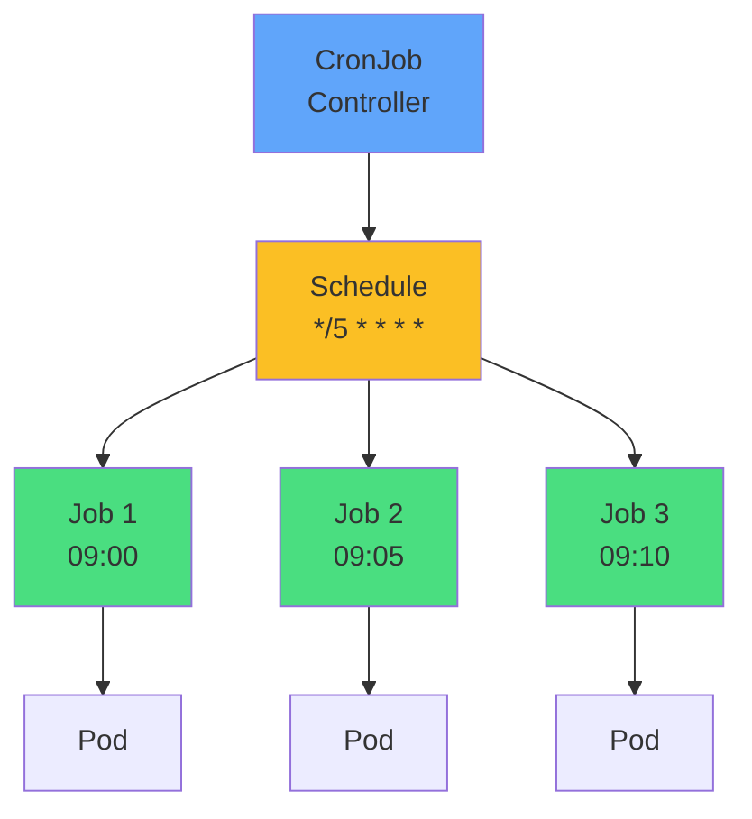

</div>

<!--
METADATA:
sentence: Three-level hierarchy: CronJob → Job → Pod.
search_anchor: Three-level hierarchy
-->
<div v-click="2" class="mt-8 text-center text-xl">
<carbon-time class="inline-block text-4xl text-blue-400" /> CronJob → Job → Pod
</div>

<div class="grid grid-cols-3 gap-4 mt-6 text-sm">
<!--
METADATA:
sentence: Daily backups - common use case for CronJobs.
search_anchor: Daily backups
-->
<div v-click="3" class="text-center">
<carbon-backup class="text-3xl text-green-400 mb-1" />
Daily backups
</div>
<!--
METADATA:
sentence: Periodic cleanup tasks - common use case for CronJobs.
search_anchor: Periodic cleanup tasks
-->
<div v-click="4" class="text-center">
<carbon-clean class="text-3xl text-yellow-400 mb-1" />
Periodic cleanup
</div>
<!--
METADATA:
sentence: Regular report generation - common use case for CronJobs.
search_anchor: Regular report generation
-->
<div v-click="5" class="text-center">
<carbon-report class="text-3xl text-purple-400 mb-1" />
Regular reports
</div>
</div>

---
layout: center
---

# Cron Expression Syntax

<!--
METADATA:
sentence: CronJobs use standard Unix cron syntax with five fields.
search_anchor: standard Unix cron syntax with five fields
-->
<div v-click="1" class="mb-6">

```
┌─────── minute (0-59)
│ ┌─────── hour (0-23)
│ │ ┌─────── day of month (1-31)
│ │ │ ┌─────── month (1-12)
│ │ │ │ ┌─────── day of week (0-6, Sunday=0)
│ │ │ │ │
* * * * *
```

</div>

<!--
METADATA:
sentence: Common patterns you must know: */5 * * * * - Every 5 minutes, 0 * * * * - Every hour (on the hour), 0 2 * * * - Daily at 2 AM, 0 9 * * 1 - Every Monday at 9 AM, 0 0 1 * * - First day of month at midnight, */15 9-17 * * * - Every 15 min, 9 AM-5 PM.
search_anchor: Common patterns you must know
-->
<div v-click="2" class="grid grid-cols-2 gap-4 text-sm">

<div>
<carbon-time class="inline-block text-xl text-blue-400" /> <code>*/5 * * * *</code><br/>
<span class="opacity-80">Every 5 minutes</span>
</div>

<div>
<carbon-time class="inline-block text-xl text-green-400" /> <code>0 * * * *</code><br/>
<span class="opacity-80">Every hour</span>
</div>

<div>
<carbon-time class="inline-block text-xl text-purple-400" /> <code>0 2 * * *</code><br/>
<span class="opacity-80">Daily at 2 AM</span>
</div>

<div>
<carbon-time class="inline-block text-xl text-yellow-400" /> <code>0 9 * * 1</code><br/>
<span class="opacity-80">Monday at 9 AM</span>
</div>

<div>
<carbon-time class="inline-block text-xl text-red-400" /> <code>0 0 1 * *</code><br/>
<span class="opacity-80">1st of month</span>
</div>

<div>
<carbon-time class="inline-block text-xl text-teal-400" /> <code>*/15 9-17 * * *</code><br/>
<span class="opacity-80">Every 15 min, 9AM-5PM</span>
</div>

</div>

<!--
METADATA:
sentence: Important: CronJobs use the timezone of the kube-controller-manager, typically UTC.
search_anchor: timezone of the kube-controller-manager, typically UTC
-->
<div v-click="3" class="mt-6 text-center text-yellow-400">
<carbon-warning class="inline-block text-2xl" /> Timezone = kube-controller-manager (usually UTC)
</div>

---
layout: center
---

# CronJob Concurrency Policies

<!--
METADATA:
sentence: What happens if a new Job is scheduled while the previous one is still running? Three policies.
search_anchor: What happens if a new Job is scheduled
-->
<div v-click="1">

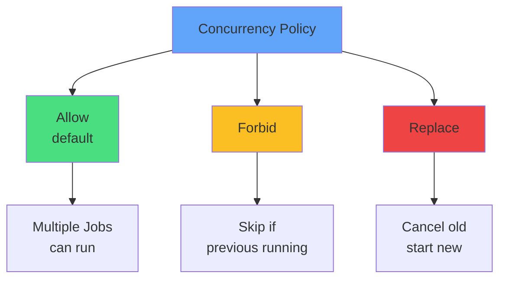

</div>

<div class="grid grid-cols-3 gap-4 mt-8 text-sm">
<!--
METADATA:
sentence: Allow (default) - Multiple Jobs can run concurrently, Good for: Independent tasks, quick jobs.
search_anchor: Allow (default) - Multiple Jobs can run concurrently
-->
<div v-click="2" class="text-center">
<carbon-flow class="text-3xl text-green-400 mb-1" />
<strong>Allow</strong><br/>
Independent tasks
</div>
<!--
METADATA:
sentence: Forbid - Skips new Job if previous still running, Good for: Long-running tasks, resource-intensive jobs.
search_anchor: Forbid - Skips new Job if previous still running
-->
<div v-click="3" class="text-center">
<carbon-locked class="text-3xl text-yellow-400 mb-1" />
<strong>Forbid</strong><br/>
Long-running jobs
</div>
<!--
METADATA:
sentence: Replace - Cancels existing Job and starts new one, Good for: Tasks where latest is more important.
search_anchor: Replace - Cancels existing Job and starts new one
-->
<div v-click="4" class="text-center">
<carbon-renew class="text-3xl text-red-400 mb-1" />
<strong>Replace</strong><br/>
Latest is important
</div>
</div>

<!--
METADATA:
sentence: For database backups, use Forbid. For cache updates, Replace might be appropriate.
search_anchor: For database backups, use Forbid
-->
<div v-click="5" class="mt-6 text-center">
<carbon-backup class="inline-block text-2xl text-blue-400" /> Backups: Forbid · Cache refresh: Replace
</div>

---
layout: center
---

# CronJob YAML Structure

<!--
METADATA:
sentence: This is the CronJob YAML example showing the structure of a CronJob specification.
search_anchor: CronJob YAML example structure
-->
<div v-click="1" class="text-xs">

```yaml
apiVersion: batch/v1
kind: CronJob
metadata:
  name: daily-backup
spec:
  schedule: "0 2 * * *"
  concurrencyPolicy: Forbid
  successfulJobsHistoryLimit: 3
  failedJobsHistoryLimit: 1
  jobTemplate:
    spec:
      template:
        spec:
          restartPolicy: OnFailure
          containers:
          - name: backup
            image: backup-tool:v1
            command: ["./backup.sh"]
```

</div>

<div class="grid grid-cols-2 gap-4 mt-4 text-xs">
<!--
METADATA:
sentence: schedule: Cron expression field specification.
search_anchor: schedule: Cron expression
-->
<div v-click="2">
<carbon-time class="inline-block text-xl text-blue-400" /> <strong>schedule:</strong> Cron expression
</div>
<!--
METADATA:
sentence: concurrencyPolicy: Allow/Forbid/Replace field specification.
search_anchor: concurrencyPolicy: Allow/Forbid/Replace
-->
<div v-click="3">
<carbon-rule class="inline-block text-xl text-green-400" /> <strong>concurrencyPolicy:</strong> Allow/Forbid/Replace
</div>
<!--
METADATA:
sentence: successfulJobsHistoryLimit: 3 (default) field specification.
search_anchor: successfulJobsHistoryLimit: 3 (default)
-->
<div v-click="4">
<carbon-checkmark class="inline-block text-xl text-purple-400" /> <strong>successfulJobsHistoryLimit:</strong> Keep last N
</div>
<!--
METADATA:
sentence: failedJobsHistoryLimit: 1 (default) field specification.
search_anchor: failedJobsHistoryLimit: 1 (default)
-->
<div v-click="5">
<carbon-close class="inline-block text-xl text-red-400" /> <strong>failedJobsHistoryLimit:</strong> Keep failures
</div>
</div>

---
layout: center
---

# Job Immutability

<!--
METADATA:
sentence: This is a critical concept that trips up many CKAD candidates: You CANNOT update a Job's Pod template.
search_anchor: critical concept that trips up many CKAD candidates
-->
<div v-click="1">

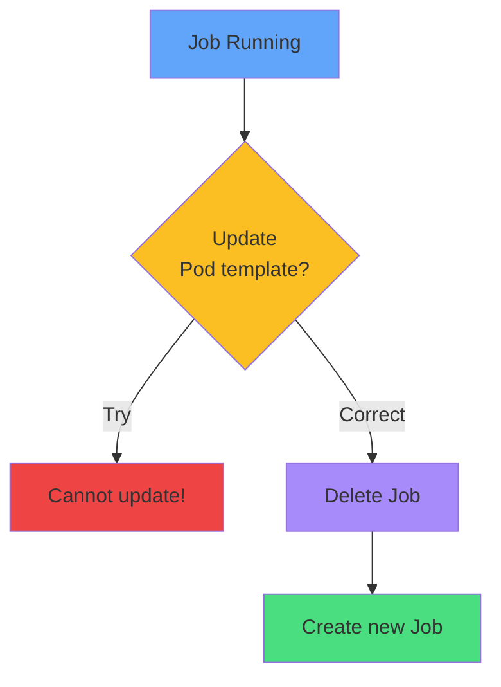

</div>

<!--
METADATA:
sentence: You CANNOT update a Job's Pod template.
search_anchor: You CANNOT update a Job's Pod template
-->
<div v-click="2" class="mt-8 text-center text-xl">
<carbon-locked class="inline-block text-4xl text-red-400" /> Cannot update Pod template
</div>

<div class="grid grid-cols-2 gap-6 mt-8">
<!--
METADATA:
sentence: If you need to change: The container image, Command or arguments, Environment variables, Resource limits, Any other Pod specification.
search_anchor: If you need to change
-->
<div v-click="3">
<carbon-close class="text-4xl text-red-400 mb-2" />
<strong>Cannot Change</strong><br/>
<span class="text-sm opacity-80">Image, command, env vars, resources</span>
</div>
<!--
METADATA:
sentence: You must: 1. Delete the existing Job, 2. Create a new Job with the changes.
search_anchor: You must: 1. Delete the existing Job
-->
<div v-click="4">
<carbon-checkmark class="text-4xl text-green-400 mb-2" />
<strong>Must Do</strong><br/>
<span class="text-sm opacity-80">Delete and recreate</span>
</div>
</div>

<!--
METADATA:
sentence: Practical implication: Get your Job spec right the first time.
search_anchor: Get your Job spec right the first time
-->
<div v-click="5" class="mt-6 text-center text-yellow-400">
<carbon-warning class="inline-block text-2xl" /> Get it right the first time!
</div>

---
layout: center
---

# Job Cleanup and History

<!--
METADATA:
sentence: Jobs don't automatically clean up - this is intentional for debugging and log access. Cleanup strategies.
search_anchor: Jobs don't automatically clean up
-->
<div v-click="1">

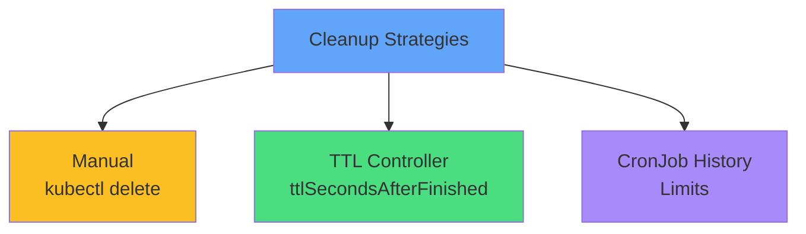

</div>

<!--
METADATA:
sentence: Automatic cleanup with TTL: Use ttlSecondsAfterFinished: 100, Job is deleted 100 seconds after completion.
search_anchor: Automatic cleanup with TTL
-->
<div v-click="2" class="mt-6 mb-4">

```yaml
spec:
  ttlSecondsAfterFinished: 100  # Delete after 100s
```

</div>

<!--
METADATA:
sentence: CronJob history limits: successfulJobsHistoryLimit: 3 (default), failedJobsHistoryLimit: 1 (default), Automatically removes old Jobs.
search_anchor: CronJob history limits
-->
<div v-click="3" class="mb-4">

```yaml
spec:
  successfulJobsHistoryLimit: 3  # Keep last 3 successful
  failedJobsHistoryLimit: 1      # Keep last 1 failed
```

</div>

<!--
METADATA:
sentence: Jobs don't automatically clean up - this is intentional for debugging and log access.
search_anchor: intentional for debugging and log access
-->
<div v-click="4" class="mt-6 text-center text-yellow-400">
<carbon-warning class="inline-block text-2xl" /> Jobs don't auto-cleanup by default!
</div>

---
layout: center
---

# Common Patterns

<div class="grid grid-cols-2 gap-6 mt-4">
<!--
METADATA:
sentence: Database Migration pattern: Job, completions: 1, restartPolicy: Never.
search_anchor: Database Migration pattern
-->
<div v-click="1">
<carbon-data-base class="text-4xl text-blue-400 mb-2" />
<strong>Database Migration</strong><br/>
<span class="text-sm opacity-80">Job, completions: 1<br/>restartPolicy: Never</span>
</div>
<!--
METADATA:
sentence: Batch Processing pattern: Job, completions: 100, parallelism: 10.
search_anchor: Batch Processing pattern
-->
<div v-click="2">
<carbon-analytics class="text-4xl text-green-400 mb-2" />
<strong>Batch Processing</strong><br/>
<span class="text-sm opacity-80">Job, completions: 100<br/>parallelism: 10</span>
</div>
<!--
METADATA:
sentence: Daily Backup pattern: CronJob, schedule: 0 2 * * *, concurrencyPolicy: Forbid.
search_anchor: Daily Backup pattern
-->
<div v-click="3">
<carbon-backup class="text-4xl text-purple-400 mb-2" />
<strong>Daily Backup</strong><br/>
<span class="text-sm opacity-80">CronJob, schedule: 0 2 * * *<br/>concurrencyPolicy: Forbid</span>
</div>
<!--
METADATA:
sentence: Periodic Cleanup pattern: CronJob, schedule: 0 * * * *, concurrencyPolicy: Replace.
search_anchor: Periodic Cleanup pattern
-->
<div v-click="4">
<carbon-clean class="text-4xl text-yellow-400 mb-2" />
<strong>Periodic Cleanup</strong><br/>
<span class="text-sm opacity-80">CronJob, schedule: 0 * * * *<br/>concurrencyPolicy: Replace</span>
</div>
</div>

---
layout: center
---

# Troubleshooting

<!--
METADATA:
sentence: Troubleshooting steps for Jobs that are not completing.
search_anchor: Troubleshooting steps for Jobs
-->
<div v-click="1">

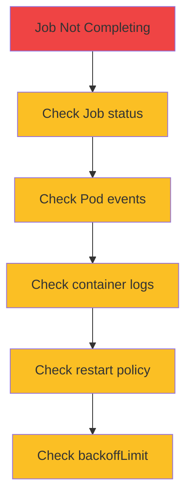

</div>

<div class="grid grid-cols-2 gap-4 mt-6 text-sm">
<!--
METADATA:
sentence: Use kubectl describe job to check Job status and events.
search_anchor: kubectl describe job
-->
<div v-click="2">
<carbon-terminal class="inline-block text-2xl text-blue-400" /> kubectl describe job
</div>
<!--
METADATA:
sentence: Use kubectl get pods -l job-name= to list Pods for a Job.
search_anchor: kubectl get pods -l job-name=
-->
<div v-click="3">
<carbon-view class="inline-block text-2xl text-green-400" /> kubectl get pods -l job-name=
</div>
<!--
METADATA:
sentence: Use kubectl logs job/my-job to view Job logs.
search_anchor: kubectl logs job/my-job
-->
<div v-click="4">
<carbon-document class="inline-block text-2xl text-purple-400" /> kubectl logs job/my-job
</div>
<!--
METADATA:
sentence: Check failed Pod events for detailed error information.
search_anchor: Check failed Pod events
-->
<div v-click="5">
<carbon-debug class="inline-block text-2xl text-yellow-400" /> Check failed Pod events
</div>
</div>

---
layout: center
---

# Summary

<!--
METADATA:
sentence: Summary of Jobs and CronJobs concepts covered in this presentation.
search_anchor: Summary of Jobs and CronJobs concepts
-->
<div v-click="1">

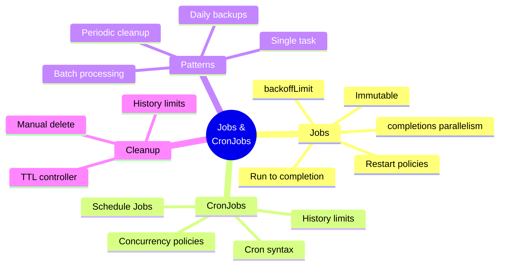

</div>

---
layout: center
---

# CKAD Exam Focus

<!--
METADATA:
sentence: For the CKAD exam, Jobs and CronJobs are important topics to master.
search_anchor: CKAD exam, Jobs and CronJobs are important
-->
<div v-click="1" class="text-center mb-6">
<carbon-certificate class="inline-block text-6xl text-blue-400" />
</div>

<div class="grid grid-cols-2 gap-4 text-sm">
<!--
METADATA:
sentence: Create Job YAML from scratch.
search_anchor: Create Job YAML from scratch
-->
<div v-click="2">
<carbon-edit class="inline-block text-2xl text-green-400" /> Create Job YAML
</div>
<!--
METADATA:
sentence: Set restart policy - this is required for Jobs.
search_anchor: Set restart policy - this is required
-->
<div v-click="3">
<carbon-restart class="inline-block text-2xl text-green-400" /> Set restart policy (required!)
</div>
<!--
METADATA:
sentence: Configure completions and parallelism for batch processing.
search_anchor: Configure completions and parallelism
-->
<div v-click="4">
<carbon-flow class="inline-block text-2xl text-green-400" /> Configure completions/parallelism
</div>
<!--
METADATA:
sentence: Write cron expressions for CronJobs.
search_anchor: Write cron expressions for CronJobs
-->
<div v-click="5">
<carbon-time class="inline-block text-2xl text-green-400" /> Write cron expressions
</div>
<!--
METADATA:
sentence: Set concurrency policy for CronJobs.
search_anchor: Set concurrency policy for CronJobs
-->
<div v-click="6">
<carbon-rule class="inline-block text-2xl text-green-400" /> Set concurrency policy
</div>
<!--
METADATA:
sentence: Troubleshoot Job failures effectively.
search_anchor: Troubleshoot Job failures effectively
-->
<div v-click="7">
<carbon-debug class="inline-block text-2xl text-green-400" /> Troubleshoot failures
</div>
<!--
METADATA:
sentence: Remember: Jobs are immutable - you cannot update them.
search_anchor: Remember: Jobs are immutable
-->
<div v-click="8">
<carbon-warning class="inline-block text-2xl text-yellow-400" /> Remember: Jobs are immutable
</div>
<!--
METADATA:
sentence: Practice Job creation speed for the exam.
search_anchor: Practice Job creation speed
-->
<div v-click="9">
<carbon-timer class="inline-block text-2xl text-red-400" /> Practice Job creation speed
</div>
</div>

---
layout: center
---

# Next Steps

<!--
METADATA:
sentence: Now that we understand the concepts, it's time for hands-on practice.
search_anchor: time for hands-on practice
-->
<div v-click="1" class="text-center mb-8">
<carbon-education class="inline-block text-6xl text-blue-400" />
</div>

<!--
METADATA:
sentence: In the next section, we'll work through hands-on exercises demonstrating these patterns in action.
search_anchor: hands-on exercises demonstrating these patterns
-->
<div v-click="2">

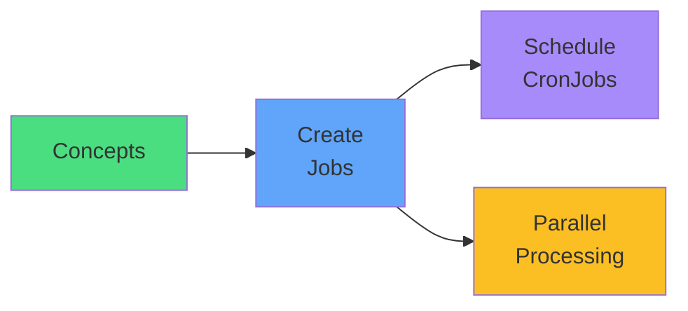

</div>

<!--
METADATA:
sentence: Let's run some batch workloads and see these concepts in action.
search_anchor: run some batch workloads
-->
<div v-click="3" class="mt-8 text-center text-xl">
Let's run some batch workloads! <carbon-arrow-right class="inline-block text-2xl" />
</div>
