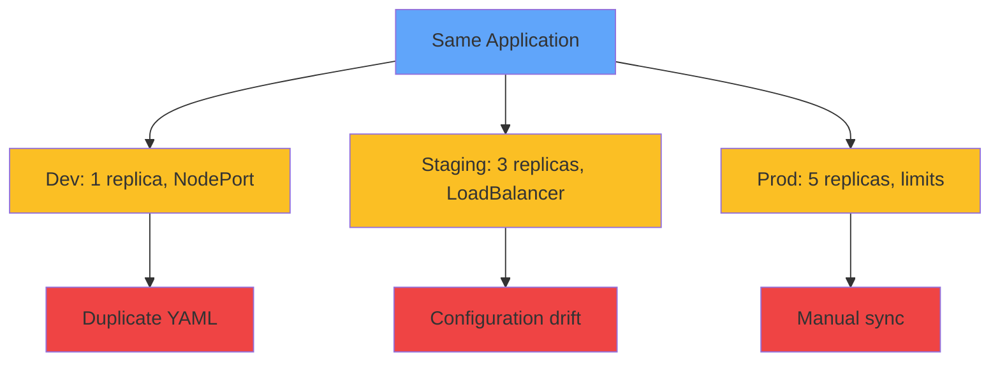
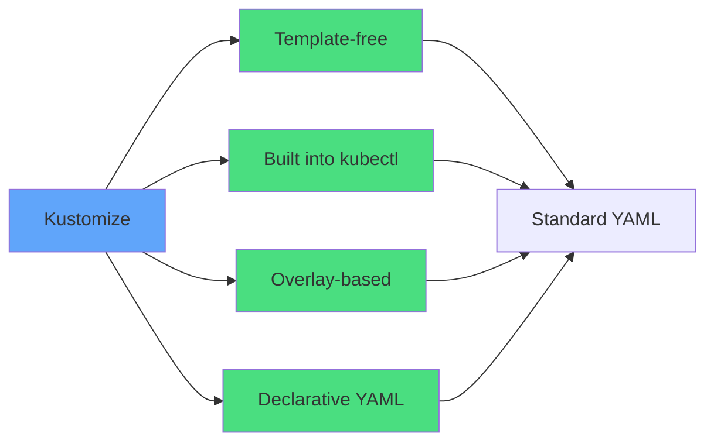
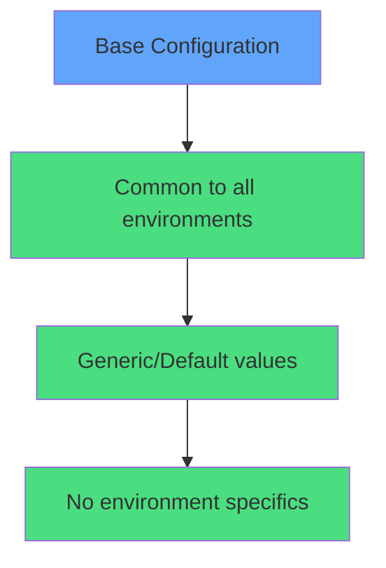
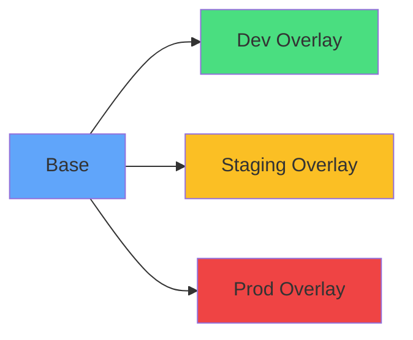
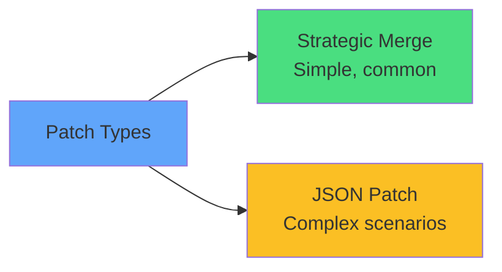
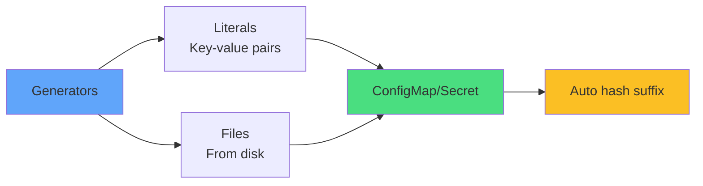
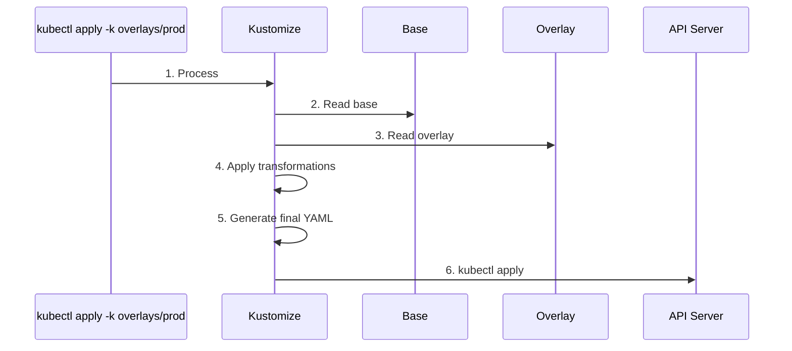
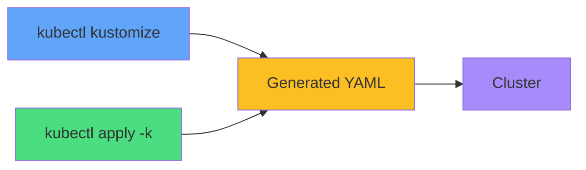
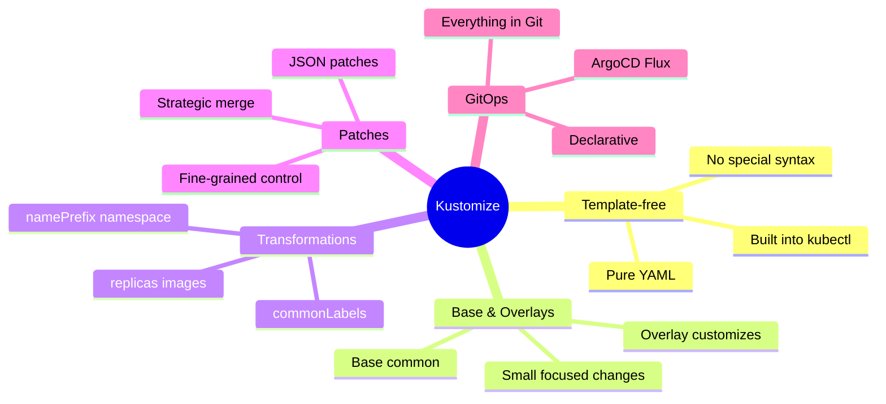

# Kustomize

<div class="abs-br m-6 flex gap-2">
  <carbon-settings class="text-6xl text-blue-400" />
</div>

<!--
METADATA:
sentence: Welcome to this introduction to Kustomize, a template-free way to customize Kubernetes application configurations.
search_anchor: template-free way to customize
-->
<div v-click="1" class="mt-8 text-xl opacity-80">
Template-free configuration management for Kubernetes
</div>

<!--
METADATA:
sentence: Kustomize is a required topic for the CKAD exam.
search_anchor: required topic for the CKAD exam
-->
<div v-click="2" class="mt-6 text-lg">
<carbon-certificate class="inline-block text-xl text-green-400" /> Required topic for CKAD exam
</div>

<!--
METADATA:
sentence: Unlike Helm, which is supplementary, you must understand Kustomize to succeed on the exam.
search_anchor: must understand Kustomize
-->
<div v-click="3" class="mt-4 text-sm opacity-60">
Built into kubectl • Essential for multi-environment configs
</div>

---
layout: center
---

# Configuration Management Challenge

<!--
METADATA:
sentence: Managing Kubernetes applications across multiple environments presents challenges.
search_anchor: Managing Kubernetes applications across multiple environments
-->
<div v-click="1">



</div>

<div class="grid grid-cols-3 gap-4 mt-8 text-sm">
<!--
METADATA:
sentence: Duplicating YAML files for each environment
search_anchor: Duplicating YAML files
-->
<div v-click="2" class="text-center">
<carbon-copy class="text-3xl text-red-400 mb-1" />
Duplicate files
</div>
<!--
METADATA:
sentence: Risk of configuration drift between environments
search_anchor: configuration drift between environments
-->
<div v-click="3" class="text-center">
<carbon-warning class="text-3xl text-yellow-400 mb-1" />
Config drift
</div>
<!--
METADATA:
sentence: Manual effort to keep common configurations synchronized
search_anchor: Manual effort to keep common configurations synchronized
-->
<div v-click="4" class="text-center">
<carbon-sync class="text-3xl text-purple-400 mb-1" />
Manual sync
</div>
</div>

<!--
METADATA:
sentence: Kustomize solves these problems with a declarative, overlay-based approach.
search_anchor: overlay-based approach
-->
<div v-click="5" class="mt-6 text-center text-green-400">
<carbon-checkmark class="inline-block text-2xl" /> Kustomize solves with overlays
</div>

---
layout: center
---

# What is Kustomize?

<!--
METADATA:
sentence: Kustomize is a configuration management tool that works without templates.
search_anchor: configuration management tool that works without templates
-->
<div v-click="1" class="mb-6">



</div>

<!--
METADATA:
sentence: The fundamental principle: define a base configuration, then create overlays that modify that base for specific environments.
search_anchor: define a base configuration
-->
<div v-click="2" class="mt-6 text-center opacity-80">
Define base, then create overlays for environments
</div>

<div class="grid grid-cols-2 gap-6 mt-6">
<!--
METADATA:
sentence: Built into kubectl (version 1.14+) - no separate installation needed
search_anchor: Built into kubectl
-->
<div v-click="3">
<carbon-terminal class="text-4xl text-blue-400 mb-2" />
<strong>Built into kubectl</strong><br/>
<span class="text-sm opacity-80">No installation (v1.14+)</span>
</div>
<!--
METADATA:
sentence: Works with standard Kubernetes YAML files
search_anchor: standard Kubernetes YAML files
-->
<div v-click="4">
<carbon-document class="text-4xl text-green-400 mb-2" />
<strong>Pure YAML</strong><br/>
<span class="text-sm opacity-80">No template syntax</span>
</div>
</div>

<!--
METADATA:
sentence: Importantly, Kustomize doesn't generate or modify your files on disk. It processes them in memory and sends the result to kubectl, keeping your source files clean and readable.
search_anchor: processes them in memory
-->
<div v-click="5" class="mt-6 text-center text-yellow-400">
<carbon-virtual-machine class="inline-block text-2xl" /> Processes in memory, files stay clean
</div>

---
layout: center
---

# Kustomize vs Helm

<div class="grid grid-cols-2 gap-6 mt-4">
<!--
METADATA:
sentence: Let's understand when to use Kustomize versus Helm.
search_anchor: when to use Kustomize versus Helm
-->
<div v-click="1">
<carbon-settings class="text-5xl text-blue-400 mb-2" />
<strong>Kustomize</strong><br/>
<span class="text-sm opacity-80">• Simpler learning curve<br/>• Built into kubectl<br/>• Template-free<br/>• Environment configs<br/>• <strong>CKAD required</strong></span>
</div>
<!--
METADATA:
sentence: **Helm strengths:**
search_anchor: Helm strengths
-->
<div v-click="2">
<carbon-container-software class="text-5xl text-green-400 mb-2" />
<strong>Helm</strong><br/>
<span class="text-sm opacity-80">• Package distribution<br/>• Chart versioning<br/>• Complex templates<br/>• Third-party apps<br/>• CKAD supplementary</span>
</div>
</div>

<!--
METADATA:
sentence: Many teams use both.
search_anchor: Many teams use both
-->
<div v-click="3" class="mt-8 text-center text-lg">
<carbon-flow class="inline-block text-3xl text-purple-400" /> Many teams use both!
</div>

<!--
METADATA:
sentence: Helm for third-party applications (databases, monitoring, message queues) and Kustomize for their own application configurations across environments.
search_anchor: Helm for third-party applications
-->
<div v-click="4" class="mt-4 text-center text-sm opacity-80">
Helm for third-party apps • Kustomize for own applications
</div>

---
layout: center
---

# Core Concept: Base

<!--
METADATA:
sentence: The base is your common configuration that applies to all environments.
search_anchor: common configuration that applies to all environments
-->
<div v-click="1" class="mb-4">

```
base/
├── kustomization.yaml
├── deployment.yaml
└── service.yaml
```

</div>

<!--
METADATA:
sentence: A base contains: Standard Kubernetes YAML files (Deployments, Services, ConfigMaps, etc.) A kustomization.yaml file listing the resources
search_anchor: kustomization.yaml file listing the resources
-->
<div v-click="2" class="mb-4 text-xs">

```yaml
# base/kustomization.yaml
apiVersion: kustomize.config.k8s.io/v1beta1
kind: Kustomization
resources:
  - deployment.yaml
  - service.yaml
```

</div>

<!--
METADATA:
sentence: The base should be generic enough to work in any environment.
search_anchor: generic enough to work in any environment
-->
<div v-click="3">



</div>

<!--
METADATA:
sentence: Think of it as your 'default' or 'reference' configuration.
search_anchor: default or reference configuration
-->
<div v-click="4" class="mt-6 text-center text-yellow-400">
<carbon-warning class="inline-block text-2xl" /> Base should work in ANY environment
</div>

---
layout: center
---

# Core Concept: Overlays

<!--
METADATA:
sentence: Overlays customize the base for specific environments.
search_anchor: Overlays customize the base
-->
<div v-click="1" class="mb-4">

```
overlays/
├── dev/
│   └── kustomization.yaml
├── staging/
│   └── kustomization.yaml
└── prod/
    ├── kustomization.yaml
    └── resources-patch.yaml
```

</div>

<!--
METADATA:
sentence: An overlay: References a base configuration
search_anchor: References a base configuration
-->
<div v-click="2" class="text-xs mb-4">

```yaml
# overlays/prod/kustomization.yaml
apiVersion: kustomize.config.k8s.io/v1beta1
kind: Kustomization
bases:
  - ../../base
namePrefix: prod-
namespace: production
replicas:
  - name: myapp
    count: 5
```

</div>

<!--
METADATA:
sentence: Each overlay's kustomization.yaml references the base and applies customizations
search_anchor: references the base and applies customizations
-->
<div v-click="3">



</div>

<!--
METADATA:
sentence: The beauty: each overlay is small and focused on differences, while the base contains the common configuration.
search_anchor: small and focused on differences
-->
<div v-click="4" class="mt-6 text-center text-green-400">
<carbon-checkmark class="inline-block text-2xl" /> Each overlay: small, focused on differences
</div>

---
layout: center
---

# Core Concept: Patches

<!--
METADATA:
sentence: Patches provide fine-grained control over specific fields.
search_anchor: fine-grained control over specific fields
-->
<div v-click="1" class="mb-4 text-xs">

```yaml
# Strategic Merge Patch
apiVersion: apps/v1
kind: Deployment
metadata:
  name: myapp
spec:
  template:
    spec:
      containers:
      - name: myapp
        resources:
          limits:
            memory: "512Mi"
            cpu: "500m"
```

</div>

<!--
METADATA:
sentence: **JSON Patches (RFC 6902):**
search_anchor: JSON Patches (RFC 6902)
-->
<div v-click="2" class="text-xs mb-4">

```yaml
# JSON Patch (RFC 6902)
- op: replace
  path: /spec/replicas
  value: 3
- op: add
  path: /spec/template/spec/containers/0/env/-
  value:
    name: LOG_LEVEL
    value: debug
```

</div>

<!--
METADATA:
sentence: Strategic merge patches are simpler and more common.
search_anchor: Strategic merge patches are simpler
-->
<div v-click="3">



</div>

<!--
METADATA:
sentence: For CKAD, focus on strategic merge patches - they're more intuitive and cover most use cases.
search_anchor: focus on strategic merge patches
-->
<div v-click="4" class="mt-4 text-center text-yellow-400">
<carbon-warning class="inline-block text-2xl" /> Focus on strategic merge for CKAD
</div>

---
layout: center
---

# Kustomization Features

<!--
METADATA:
sentence: The kustomization.yaml file supports many transformations.
search_anchor: kustomization.yaml file supports many transformations
-->
<div v-click="1" class="text-xs mb-4">

```yaml
apiVersion: kustomize.config.k8s.io/v1beta1
kind: Kustomization

namePrefix: prod-
nameSuffix: -v2
namespace: production

commonLabels:
  environment: production
  team: backend

images:
  - name: myapp
    newTag: v2.0.1

replicas:
  - name: myapp
    count: 5
```

</div>

<div class="grid grid-cols-3 gap-4 text-xs">
<!--
METADATA:
sentence: **namePrefix/nameSuffix:**
search_anchor: namePrefix/nameSuffix
-->
<div v-click="2">
<carbon-text-font class="inline-block text-xl text-blue-400" /> namePrefix/Suffix
</div>
<!--
METADATA:
sentence: **namespace:**
search_anchor: namespace: Set namespace for all resources
-->
<div v-click="3">
<carbon-folder class="inline-block text-xl text-green-400" /> namespace
</div>
<!--
METADATA:
sentence: **commonLabels:**
search_anchor: commonLabels: Add labels
-->
<div v-click="4">
<carbon-tag class="inline-block text-xl text-purple-400" /> commonLabels
</div>
<!--
METADATA:
sentence: **images:**
search_anchor: images: Update container image tags
-->
<div v-click="5">
<carbon-image class="inline-block text-xl text-yellow-400" /> images
</div>
<!--
METADATA:
sentence: **replicas:**
search_anchor: replicas: Set replica counts
-->
<div v-click="6">
<carbon-flow class="inline-block text-xl text-red-400" /> replicas
</div>
</div>

<!--
METADATA:
sentence: These built-in features handle most customization needs without patches.
search_anchor: built-in features handle most customization needs
-->
<div v-click="7" class="mt-6 text-center text-green-400">
<carbon-checkmark class="inline-block text-2xl" /> Prefer built-in features over patches
</div>

---
layout: center
---

# ConfigMap and Secret Generators

<!--
METADATA:
sentence: **configMapGenerator/secretGenerator:** Generate ConfigMaps and Secrets from files or literals
search_anchor: Generate ConfigMaps and Secrets
-->
<div v-click="1" class="text-xs mb-4">

```yaml
apiVersion: kustomize.config.k8s.io/v1beta1
kind: Kustomization

configMapGenerator:
  - name: app-config
    literals:
      - LOG_LEVEL=info
      - MAX_CONNECTIONS=100
    files:
      - config.properties

secretGenerator:
  - name: db-credentials
    literals:
      - username=admin
      - password=secret123
```

</div>

<!--
METADATA:
sentence: Generate ConfigMaps and Secrets from files or literals
search_anchor: from files or literals
-->
<div v-click="2">



</div>

<!--
METADATA:
sentence: Generates unique hash suffix for versioning
search_anchor: unique hash suffix for versioning
-->
<div v-click="3" class="mt-6 text-center text-yellow-400">
<carbon-warning class="inline-block text-2xl" /> Generates unique hash suffix for versioning
</div>

---
layout: center
---

# How Kustomize Works

<!--
METADATA:
sentence: Let's understand the Kustomize workflow.
search_anchor: understand the Kustomize workflow
-->
<div v-click="1">



</div>

<!--
METADATA:
sentence: The key insight: Kustomize processes everything in memory.
search_anchor: processes everything in memory
-->
<div v-click="2" class="mt-6 text-center text-xl">
<carbon-virtual-machine class="inline-block text-3xl text-blue-400" /> All processing in memory
</div>

<!--
METADATA:
sentence: Your source files remain unchanged, making them safe for version control.
search_anchor: source files remain unchanged
-->
<div v-click="3" class="mt-4 text-center text-sm opacity-80">
Source files remain unchanged • Safe for version control
</div>

---
layout: center
---

# Preview Generated YAML

<!--
METADATA:
sentence: You can preview the generated YAML without applying:
search_anchor: preview the generated YAML without applying
-->
<div v-click="1" class="mb-4">

```bash
# Preview without applying
kubectl kustomize overlays/prod/

# Apply to cluster
kubectl apply -k overlays/prod/
```

</div>

<!--
METADATA:
sentence: kubectl kustomize
search_anchor: kubectl kustomize
-->
<div v-click="2">



</div>

<!--
METADATA:
sentence: This shows exactly what will be sent to the cluster - perfect for debugging.
search_anchor: perfect for debugging
-->
<div v-click="3" class="mt-8 text-center">
<carbon-view class="inline-block text-3xl text-green-400" /> Always preview before applying!
</div>

<!--
METADATA:
sentence: Perfect for debugging and validation
search_anchor: debugging and validation
-->
<div v-click="4" class="mt-4 text-center text-sm opacity-80">
Perfect for debugging and validation
</div>

---
layout: center
---

# Kustomize in Practice

<!--
METADATA:
sentence: How do teams typically use Kustomize?
search_anchor: How do teams typically use Kustomize
-->
<div v-click="1" class="mb-4">

```
.
├── base/
│   ├── kustomization.yaml
│   ├── deployment.yaml
│   ├── service.yaml
│   └── configmap.yaml
└── overlays/
    ├── dev/
    │   └── kustomization.yaml
    ├── staging/
    │   ├── kustomization.yaml
    │   └── replica-patch.yaml
    └── prod/
        ├── kustomization.yaml
        ├── replica-patch.yaml
        └── resources-patch.yaml
```

</div>

<!--
METADATA:
sentence: **Deployment workflow:**
search_anchor: Deployment workflow
-->
<div v-click="2" class="text-sm mb-4">

```bash
# Deploy to different environments
kubectl apply -k overlays/dev
kubectl apply -k overlays/staging
kubectl apply -k overlays/prod
```

</div>

<!--
METADATA:
sentence: Everything goes in git.
search_anchor: Everything goes in git
-->
<div v-click="3" class="mt-6 text-center">
<carbon-version class="inline-block text-2xl text-purple-400" /> Everything in Git
</div>

<!--
METADATA:
sentence: Kustomize works perfectly with GitOps tools like ArgoCD and Flux.
search_anchor: GitOps tools like ArgoCD and Flux
-->
<div v-click="4" class="mt-2 text-center text-sm">
<carbon-flow class="inline-block text-xl text-blue-400" /> Perfect for GitOps (ArgoCD, Flux)
</div>

---
layout: center
---

# Best Practices

<div class="grid grid-cols-2 gap-6 mt-4">
<!--
METADATA:
sentence: **Keep the base generic:**
search_anchor: Keep the base generic
-->
<div v-click="1">
<carbon-checkmark class="text-4xl text-green-400 mb-2" />
<strong>Keep base generic</strong><br/>
<span class="text-sm opacity-80">No environment-specific values</span>
</div>
<!--
METADATA:
sentence: **Small, focused overlays:**
search_anchor: Small, focused overlays
-->
<div v-click="2">
<carbon-layers class="text-4xl text-blue-400 mb-2" />
<strong>Small, focused overlays</strong><br/>
<span class="text-sm opacity-80">Only define differences</span>
</div>
<!--
METADATA:
sentence: **Prefer built-in transformations:**
search_anchor: Prefer built-in transformations
-->
<div v-click="3">
<carbon-settings class="text-4xl text-purple-400 mb-2" />
<strong>Prefer built-ins</strong><br/>
<span class="text-sm opacity-80">Use replicas, images over patches</span>
</div>
<!--
METADATA:
sentence: **Test locally:**
search_anchor: Test locally
-->
<div v-click="4">
<carbon-view class="text-4xl text-yellow-400 mb-2" />
<strong>Test locally</strong><br/>
<span class="text-sm opacity-80">kubectl kustomize before apply</span>
</div>
<!--
METADATA:
sentence: **Namespace isolation:**
search_anchor: Namespace isolation
-->
<div v-click="5">
<carbon-folder class="text-4xl text-red-400 mb-2" />
<strong>Namespace isolation</strong><br/>
<span class="text-sm opacity-80">Different namespace per env</span>
</div>
<!--
METADATA:
sentence: **Consistent labeling:**
search_anchor: Consistent labeling
-->
<div v-click="6">
<carbon-tag class="text-4xl text-teal-400 mb-2" />
<strong>Consistent labeling</strong><br/>
<span class="text-sm opacity-80">Use commonLabels</span>
</div>
</div>

---
layout: center
---

# Kustomize and CKAD

<!--
METADATA:
sentence: For the CKAD exam, focus on these essential skills:
search_anchor: CKAD exam, focus on these essential skills
-->
<div v-click="1" class="text-center mb-6">
<carbon-certificate class="inline-block text-6xl text-blue-400" />
</div>

<div class="grid grid-cols-2 gap-4 text-sm">
<!--
METADATA:
sentence: Creating kustomization.yaml files from scratch
search_anchor: Creating kustomization.yaml files from scratch
-->
<div v-click="2">
<carbon-edit class="inline-block text-2xl text-green-400" /> Create kustomization.yaml from scratch
</div>
<!--
METADATA:
sentence: Using kubectl apply -k to deploy
search_anchor: Using kubectl apply -k to deploy
-->
<div v-click="3">
<carbon-terminal class="inline-block text-2xl text-green-400" /> kubectl apply -k
</div>
<!--
METADATA:
sentence: Understanding base/overlay pattern
search_anchor: Understanding base/overlay pattern
-->
<div v-click="4">
<carbon-layers class="inline-block text-2xl text-green-400" /> Base/overlay pattern
</div>
<!--
METADATA:
sentence: Common transformations: namePrefix, namespace, replicas, images
search_anchor: Common transformations
-->
<div v-click="5">
<carbon-settings class="inline-block text-2xl text-green-400" /> Common transformations
</div>
<!--
METADATA:
sentence: Creating simple strategic merge patches
search_anchor: Creating simple strategic merge patches
-->
<div v-click="6">
<carbon-document class="inline-block text-2xl text-green-400" /> Strategic merge patches
</div>
<!--
METADATA:
sentence: Using kubectl kustomize to preview
search_anchor: Using kubectl kustomize to preview
-->
<div v-click="7">
<carbon-view class="inline-block text-2xl text-green-400" /> kubectl kustomize preview
</div>
<!--
METADATA:
sentence: You must know both. Kustomize is required, Helm is supplementary.
search_anchor: Kustomize is required
-->
<div v-click="8">
<carbon-warning class="inline-block text-2xl text-yellow-400" /> Required topic!
</div>
<!--
METADATA:
sentence: Practice creating overlays quickly
search_anchor: Practice creating overlays quickly
-->
<div v-click="9">
<carbon-timer class="inline-block text-2xl text-red-400" /> Practice creating overlays quickly
</div>
</div>

<!--
METADATA:
sentence: Kustomize questions are more likely on the exam.
search_anchor: Kustomize questions are more likely on the exam
-->
<div v-click="10" class="mt-8 text-center text-xl">
<carbon-checkmark class="inline-block text-3xl text-blue-400" /> More likely than Helm on exam
</div>

---
layout: center
---

# Summary

<!--
METADATA:
sentence: Let's recap the key concepts:
search_anchor: recap the key concepts
-->
<div v-click="1">



</div>

<!--
METADATA:
sentence: Kustomize manages configurations without templates
search_anchor: manages configurations without templates
-->
<div v-click="2" class="mt-8 text-center text-lg">
<carbon-checkmark class="inline-block text-2xl text-green-400" /> Configuration management without templates
</div>

<!--
METADATA:
sentence: Overlays customize for specific environments
search_anchor: Overlays customize for specific environments
-->
<div v-click="3" class="mt-2 text-center text-lg">
<carbon-checkmark class="inline-block text-2xl text-green-400" /> Base + overlays for environments
</div>
