# Kubernetes Namespaces

  <carbon-partition-auto class="text-6xl text-blue-400" />

<!--
METADATA:
sentence: Namespaces allow you to partition a single Kubernetes cluster into multiple virtual clusters.
search_anchor: partition a single Kubernetes cluster
-->

Isolating workloads in virtual clusters

<!--
METADATA:
sentence: Run multiple environments (dev, test, prod) on one cluster
search_anchor: Run multiple environments
-->

<carbon-partition-auto class="inline-block text-xl text-green-400" /> Run multiple environments on one cluster

<!--
METADATA:
sentence: Apply resource quotas and limits per namespace
search_anchor: Apply resource quotas and limits per namespace
-->

<carbon-rule class="inline-block text-xl text-purple-400" /> Apply resource quotas and limits

<!--
METADATA:
sentence: Manage access controls at the namespace level
search_anchor: Manage access controls at the namespace level
-->

<carbon-locked class="inline-block text-xl text-blue-400" /> Manage access controls per namespace

<!--
METADATA:
sentence: This is a core CKAD exam topic, so understanding namespaces is essential for both the certification and real-world Kubernetes operations.
search_anchor: core CKAD exam topic
-->

Core CKAD exam topic

---
layout: center
---

# The Multi-Tenancy Problem

<!--
METADATA:
sentence: Imagine you're running a large Kubernetes cluster with: 50 different applications, Multiple teams (platform, data, web, mobile), Different environments (dev, staging, production), Hundreds of Pods, Services, and ConfigMaps
search_anchor: large Kubernetes cluster
-->

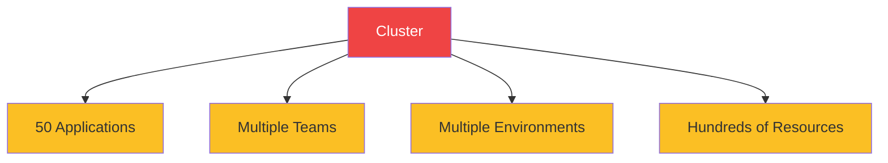

<!--
METADATA:
sentence: Name collisions between applications
search_anchor: Name collisions between applications
-->

<carbon-close class="inline-block text-3xl text-red-400" /> Name collisions

<!--
METADATA:
sentence: Accidental deletion of production resources
search_anchor: Accidental deletion of production resources
-->

<carbon-warning class="inline-block text-3xl text-red-400" /> Accidental deletions

<!--
METADATA:
sentence: Resource contention - one app consuming all cluster resources
search_anchor: Resource contention
-->

<carbon-dashboard class="inline-block text-3xl text-red-400" /> Resource contention

<!--
METADATA:
sentence: Difficult access control - everyone can see everything
search_anchor: Difficult access control
-->

<carbon-unlocked class="inline-block text-3xl text-red-400" /> No access control

<!--
METADATA:
sentence: No cost tracking per team or application
search_anchor: No cost tracking per team
-->

<carbon-currency-dollar class="inline-block text-3xl text-red-400" /> No cost tracking

<!--
METADATA:
sentence: Namespaces solve these problems by providing logical isolation within a single physical cluster.
search_anchor: providing logical isolation
-->

<carbon-partition-auto class="inline-block text-3xl text-green-400" /> Namespaces provide logical isolation

---
layout: center
---

# What Are Namespaces?

<!--
METADATA:
sentence: A namespace is a virtual cluster boundary within your physical cluster.
search_anchor: virtual cluster boundary
-->

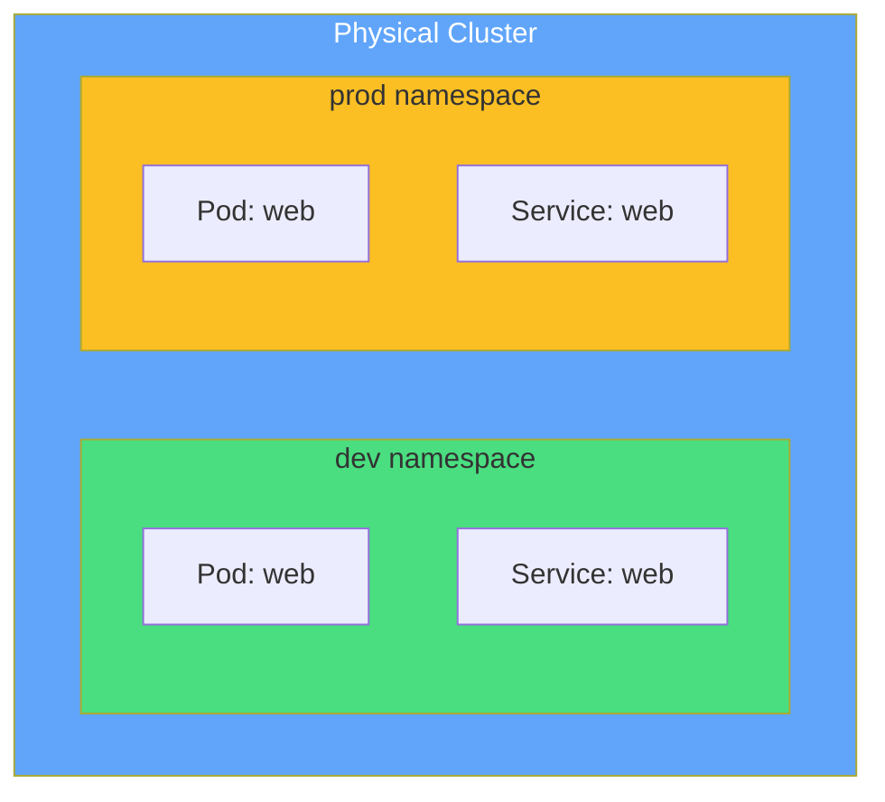

<!--
METADATA:
sentence: A namespace is a virtual cluster boundary within your physical cluster.
search_anchor: within your physical cluster
-->

Virtual cluster boundaries within physical cluster

<!--
METADATA:
sentence: Namespaces contain resources (Pods, Services, ConfigMaps, etc.)
search_anchor: Namespaces contain resources
-->

<carbon-container-software class="inline-block text-2xl text-blue-400" /> Contains resources

<!--
METADATA:
sentence: Resources in one namespace are isolated from another
search_anchor: Resources in one namespace are isolated
-->

<carbon-partition-auto class="inline-block text-2xl text-green-400" /> Logical isolation

<!--
METADATA:
sentence: Names must be unique within a namespace, but can be reused across namespaces
search_anchor: unique within a namespace
-->

<carbon-tag class="inline-block text-2xl text-purple-400" /> Unique names per namespace

<!--
METADATA:
sentence: Namespaces are flat - they cannot be nested
search_anchor: Namespaces are flat
-->

<carbon-rule class="inline-block text-2xl text-yellow-400" /> Flat structure (no nesting)

---
layout: center
---

# Default Namespaces

<!--
METADATA:
sentence: Default namespaces in every cluster:
search_anchor: Default namespaces in every cluster
-->

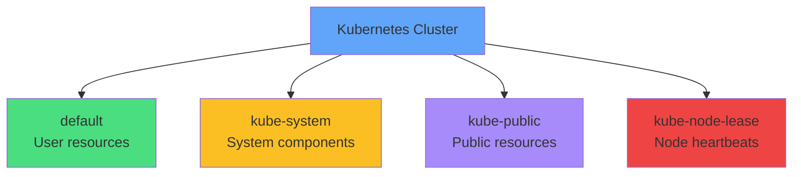

<!--
METADATA:
sentence: default - Where resources go if no namespace is specified
search_anchor: default - Where resources go
-->

<carbon-document class="inline-block text-2xl text-green-400" /> <strong>default:</strong> Resources without -n flag

<!--
METADATA:
sentence: kube-system - Kubernetes system components (DNS, dashboard, etc.)
search_anchor: kube-system - Kubernetes system components
-->

<carbon-kubernetes class="inline-block text-2xl text-yellow-400" /> <strong>kube-system:</strong> DNS, dashboard, controllers

<!--
METADATA:
sentence: kube-public - Publicly readable resources
search_anchor: kube-public - Publicly readable resources
-->

<carbon-view class="inline-block text-2xl text-purple-400" /> <strong>kube-public:</strong> Publicly readable data

<!--
METADATA:
sentence: kube-node-lease - Node heartbeat information (Kubernetes 1.13+)
search_anchor: kube-node-lease - Node heartbeat information
-->

<carbon-activity class="inline-block text-2xl text-red-400" /> <strong>kube-node-lease:</strong> Node health (1.13+)

---
layout: center
---

# Namespace Scoping

<!--
METADATA:
sentence: Not all Kubernetes resources are namespace-scoped. Understanding this distinction is critical.
search_anchor: Not all Kubernetes resources are namespace-scoped
-->

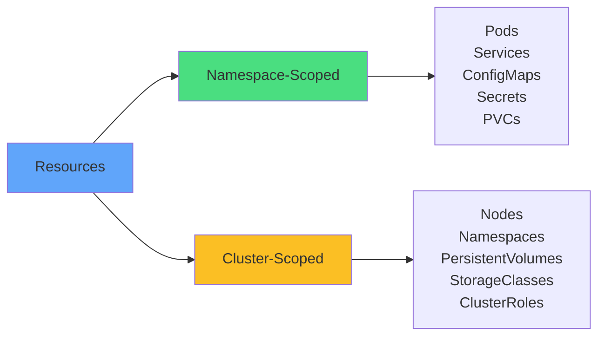

<!--
METADATA:
sentence: Namespace-scoped resources need -n namespace flag
search_anchor: Namespace-scoped resources need -n
-->

<carbon-tag class="text-4xl text-green-400 mb-2" />
<strong>Namespace-scoped</strong> 
Need -n flag to query

<!--
METADATA:
sentence: Cluster-scoped resources are global, visible to all
search_anchor: Cluster-scoped resources are global
-->

<carbon-network-3 class="text-4xl text-yellow-400 mb-2" />
<strong>Cluster-scoped</strong> 
Global, visible to all

<!--
METADATA:
sentence: Use kubectl api-resources --namespaced=true to list all namespace-scoped resources.
search_anchor: kubectl api-resources --namespaced=true
-->

<carbon-terminal class="inline-block text-2xl text-blue-400" /> kubectl api-resources --namespaced=true

---
layout: center
---

# Resource Quotas

<!--
METADATA:
sentence: Resource Quotas limit the total resources that can be consumed in a namespace.
search_anchor: Resource Quotas limit the total resources
-->

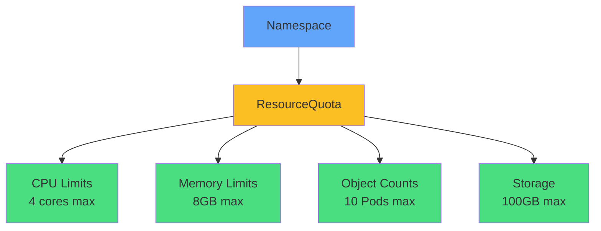

<!--
METADATA:
sentence: Resource Quotas limit the total resources that can be consumed in a namespace.
search_anchor: total resources that can be consumed
-->

Limit total resources consumed in a namespace

<!--
METADATA:
sentence: Compute resources: CPU requests and limits (total across all Pods), Memory requests and limits
search_anchor: Compute resources: CPU requests
-->

<carbon-dashboard class="inline-block text-2xl text-blue-400" /> Compute resources

<!--
METADATA:
sentence: Object counts: Maximum number of Pods, Services, ConfigMaps, Secrets
search_anchor: Object counts: Maximum number of Pods
-->

<carbon-rule class="inline-block text-2xl text-green-400" /> Object counts

<!--
METADATA:
sentence: Storage: Total storage requests across all PVCs, Storage by StorageClass
search_anchor: Storage: Total storage requests
-->

<carbon-data-base class="inline-block text-2xl text-purple-400" /> Storage limits

<!--
METADATA:
sentence: When a namespace has ResourceQuota for CPU or memory, every Pod must specify resource requests and limits, or it will be rejected.
search_anchor: every Pod must specify resource requests and limits
-->

<carbon-warning class="inline-block text-2xl" /> With quotas, Pods MUST specify resources!

---
layout: center
---

# LimitRange

<!--
METADATA:
sentence: LimitRanges work alongside ResourceQuotas but at the Pod/container level.
search_anchor: LimitRanges work alongside ResourceQuotas
-->

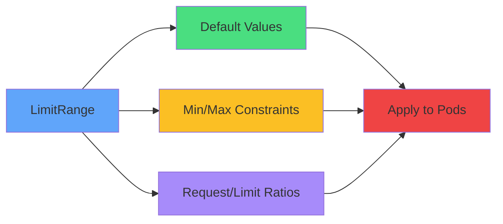

<!--
METADATA:
sentence: LimitRanges work alongside ResourceQuotas but at the Pod/container level.
search_anchor: at the Pod/container level
-->

Per-Pod/container defaults and constraints

<!--
METADATA:
sentence: Default values: If a Pod doesn't specify resources, LimitRange applies defaults
search_anchor: Default values: If a Pod doesn't specify
-->

<carbon-settings class="text-3xl text-green-400 mb-2" />
<strong>Default Values</strong> 
Auto-apply when not specified

<!--
METADATA:
sentence: Min/Max constraints: Enforce minimum resource requests (no tiny containers), Enforce maximum limits (no huge containers)
search_anchor: Min/Max constraints: Enforce minimum
-->

<carbon-rule class="text-3xl text-yellow-400 mb-2" />
<strong>Min/Max Constraints</strong> 
Enforce resource boundaries

<!--
METADATA:
sentence: ResourceQuota: Total resources for the entire namespace, LimitRange: Per-container or per-Pod constraints
search_anchor: ResourceQuota: Total resources for the entire namespace
-->

ResourceQuota = namespace total • LimitRange = per-container

---
layout: center
---

# Cross-Namespace Communication

<!--
METADATA:
sentence: Services are namespace-scoped, but Pods can communicate across namespaces using DNS.
search_anchor: Pods can communicate across namespaces using DNS
-->

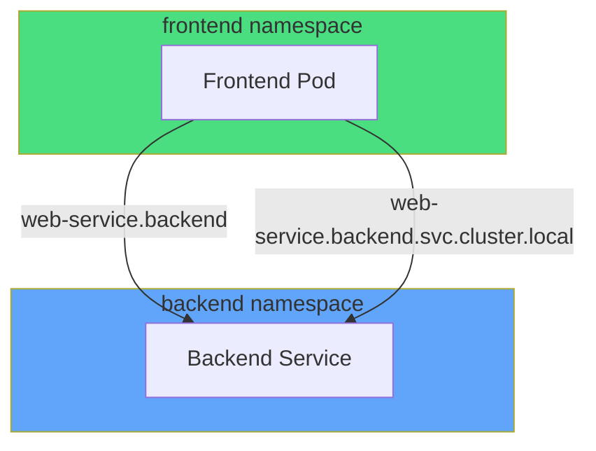

<!--
METADATA:
sentence: Services are namespace-scoped, but Pods can communicate across namespaces using DNS.
search_anchor: Services are namespace-scoped
-->

Services accessible via DNS across namespaces

<!--
METADATA:
sentence: Short name (same namespace only): web-service - Only resolves within the same namespace
search_anchor: Short name (same namespace only)
-->

<carbon-text-font class="text-3xl text-green-400 mb-2" />
<strong>Short name</strong> 
web-service 
Same namespace only

<!--
METADATA:
sentence: Namespace-qualified: web-service.production - Resolves from any namespace
search_anchor: Namespace-qualified: web-service.production
-->

<carbon-network-1 class="text-3xl text-blue-400 mb-2" />
<strong>Qualified</strong> 
web-service.production 
Any namespace

<!--
METADATA:
sentence: Fully-qualified domain name (FQDN): web-service.production.svc.cluster.local - Complete, unambiguous service address
search_anchor: Fully-qualified domain name (FQDN)
-->

<carbon-network-3 class="text-3xl text-purple-400 mb-2" />
<strong>FQDN</strong> 
web.prod.svc.cluster.local 
Fully qualified

<!--
METADATA:
sentence: Kubernetes networking is flat - any Pod can reach any other Pod by IP address, regardless of namespace.
search_anchor: Kubernetes networking is flat
-->

Kubernetes networking is flat - any Pod can reach any Pod by IP

<!--
METADATA:
sentence: For network isolation, use NetworkPolicies - they can restrict traffic based on namespace labels.
search_anchor: For network isolation, use NetworkPolicies
-->

<carbon-security class="inline-block text-2xl" /> For network isolation, use NetworkPolicies

---
layout: center
---

# ConfigMaps & Secrets Scoping

<!--
METADATA:
sentence: ConfigMaps and Secrets are namespace-scoped resources that cannot be shared across namespaces.
search_anchor: ConfigMaps and Secrets are namespace-scoped resources
-->

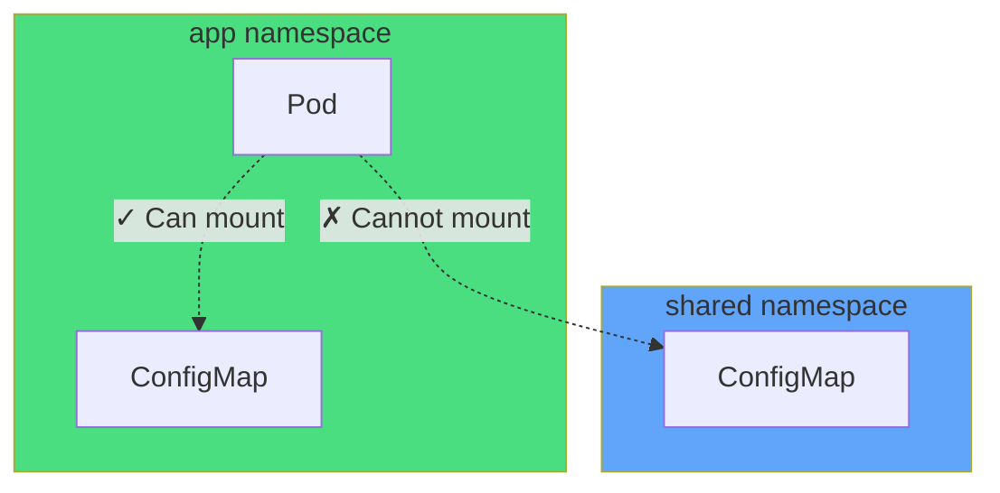

<!--
METADATA:
sentence: ConfigMaps and Secrets are namespace-scoped resources that cannot be shared across namespaces.
search_anchor: cannot be shared across namespaces
-->

<carbon-warning class="inline-block text-3xl" /> ConfigMaps & Secrets cannot cross namespaces

<!--
METADATA:
sentence: Can't reference a ConfigMap from namespace "shared" in a Pod in namespace "app", Must create duplicate ConfigMaps in each namespace
search_anchor: Must create duplicate ConfigMaps in each namespace
-->

<carbon-copy class="text-3xl text-yellow-400 mb-2" />
<strong>Duplicate config</strong> 
Create in each namespace

<!--
METADATA:
sentence: Solution: Use FQDN service names (db.backend.svc.cluster.local)
search_anchor: Use FQDN service names
-->

<carbon-network-3 class="text-3xl text-blue-400 mb-2" />
<strong>Use FQDN for services</strong> 
db.backend.svc.cluster.local

<!--
METADATA:
sentence: Or use tools like Kustomize/Helm to manage duplicates
search_anchor: use tools like Kustomize/Helm
-->

Use Kustomize/Helm to manage duplicates

---
layout: center
---

# Managing Context

<!--
METADATA:
sentence: Every kubectl command operates against a namespace. You can specify it three ways:
search_anchor: Every kubectl command operates against a namespace
-->

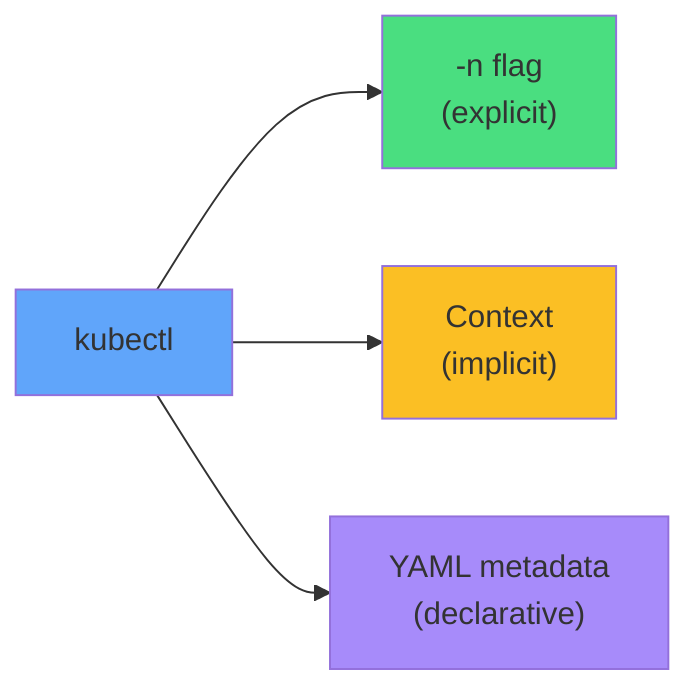

<!--
METADATA:
sentence: Using the -n flag (explicit): kubectl get pods -n production - Pros: Clear and explicit, no mistakes
search_anchor: Using the -n flag (explicit)
-->

<carbon-terminal class="text-3xl text-green-400 mb-2" />
<strong>Flag method</strong> 
kubectl get pods -n prod 
Clear, explicit

<!--
METADATA:
sentence: Setting context namespace (implicit): kubectl config set-context --current --namespace production - Pros: Less typing, cleaner commands
search_anchor: Setting context namespace (implicit)
-->

<carbon-settings class="text-3xl text-yellow-400 mb-2" />
<strong>Context method</strong> 
kubectl config set-context 
Less typing

<!--
METADATA:
sentence: Namespace in YAML (declarative): metadata: name: web-app, namespace: production - Pros: Self-documenting, version-controlled
search_anchor: Namespace in YAML (declarative)
-->

<carbon-document class="text-3xl text-purple-400 mb-2" />
<strong>YAML method</strong> 
metadata: namespace: prod 
Self-documenting

<!--
METADATA:
sentence: Use -n flag when jumping between namespaces to avoid mistakes.
search_anchor: Use -n flag when jumping between namespaces
-->

<carbon-idea class="inline-block text-2xl text-blue-400" /> CKAD tip: Use -n flag when switching to avoid mistakes

---
layout: center
---

# Namespace Lifecycle

<!--
METADATA:
sentence: Namespaces have an important lifecycle behavior to understand:
search_anchor: Namespaces have an important lifecycle behavior
-->

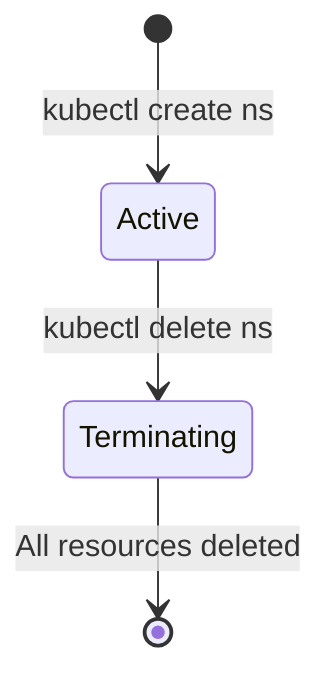

<!--
METADATA:
sentence: WARNING: Deleting a namespace deletes EVERYTHING inside it:
search_anchor: WARNING: Deleting a namespace deletes EVERYTHING
-->

<carbon-warning class="inline-block text-4xl" /> WARNING

<!--
METADATA:
sentence: WARNING: Deleting a namespace deletes EVERYTHING inside it:
search_anchor: deletes EVERYTHING inside it
-->

Deleting a namespace deletes EVERYTHING inside

<!--
METADATA:
sentence: All Pods, Services, Deployments
search_anchor: All Pods, Services, Deployments
-->

<carbon-close class="inline-block text-2xl text-red-400" /> All Pods, Services, Deployments

<!--
METADATA:
sentence: All ConfigMaps, Secrets
search_anchor: All ConfigMaps, Secrets
-->

<carbon-close class="inline-block text-2xl text-red-400" /> All ConfigMaps, Secrets

<!--
METADATA:
sentence: All PersistentVolumeClaims
search_anchor: All PersistentVolumeClaims
-->

<carbon-close class="inline-block text-2xl text-red-400" /> All PersistentVolumeClaims

<!--
METADATA:
sentence: Cannot be undone!
search_anchor: Cannot be undone!
-->

<carbon-warning class="inline-block text-2xl text-red-400" /> Cannot be undone!

<!--
METADATA:
sentence: Namespace deletion is async: Namespace enters "Terminating" state, Kubernetes deletes all resources inside
search_anchor: Namespace deletion is async
-->

Deletion is async - namespace enters "Terminating" state

---
layout: center
---

# Summary

<!--
METADATA:
sentence: Key takeaways participants should understand: Namespaces provide logical isolation within a cluster
search_anchor: Namespaces provide logical isolation within a cluster
-->

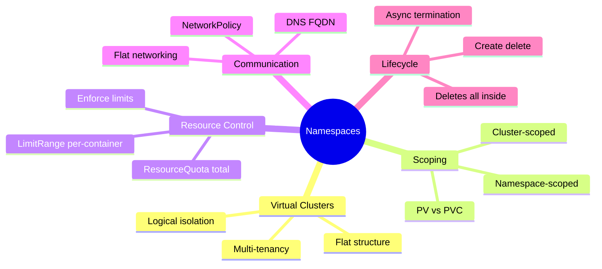

<!--
METADATA:
sentence: Namespaces provide logical isolation within a cluster
search_anchor: logical isolation within a cluster
-->

<carbon-checkmark class="inline-block text-2xl text-green-400" /> Partition cluster into virtual clusters

<!--
METADATA:
sentence: ResourceQuotas limit total resources per namespace, LimitRanges set per-Pod/container defaults and constraints
search_anchor: ResourceQuotas limit total resources per namespace
-->

<carbon-checkmark class="inline-block text-2xl text-green-400" /> Control resources per namespace

