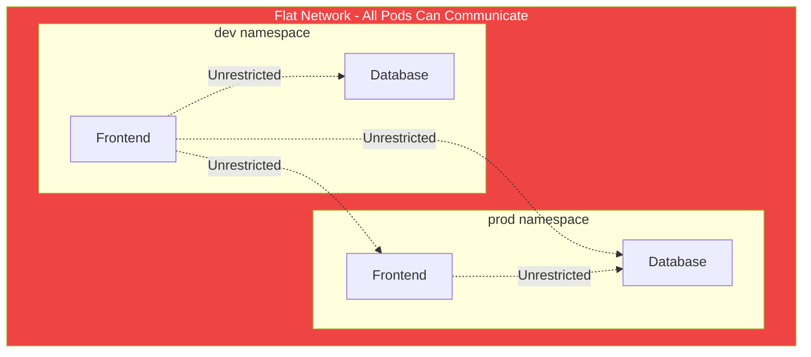
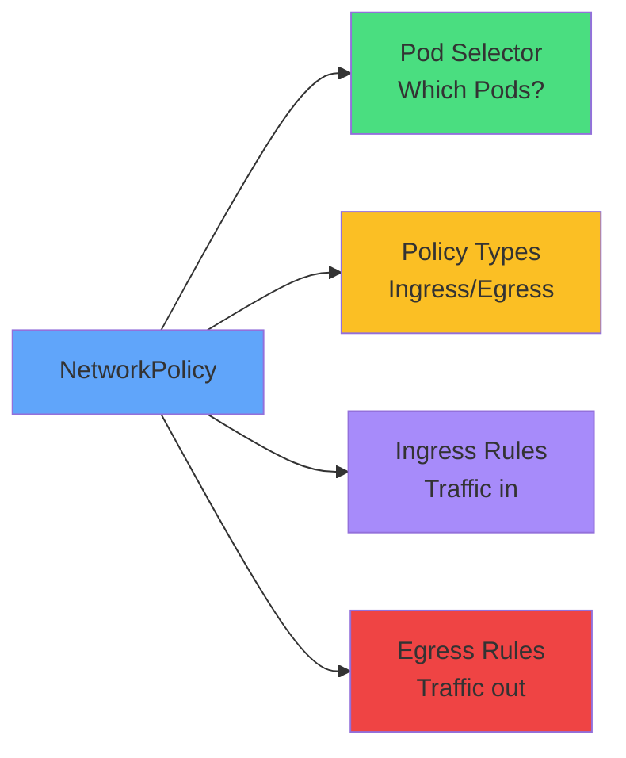
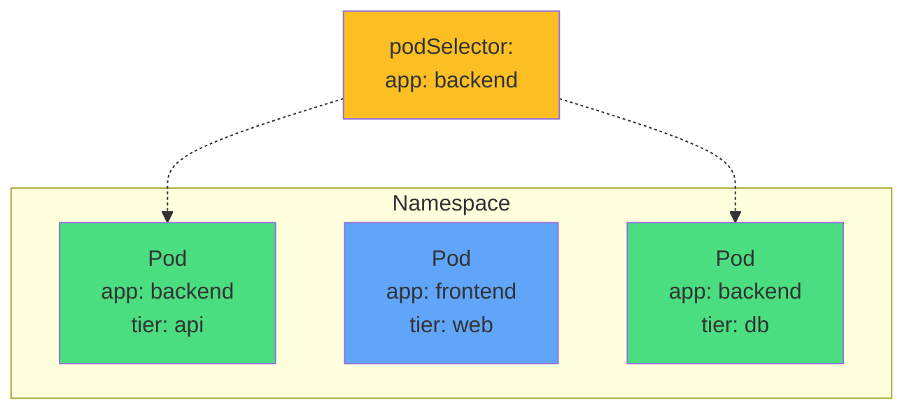
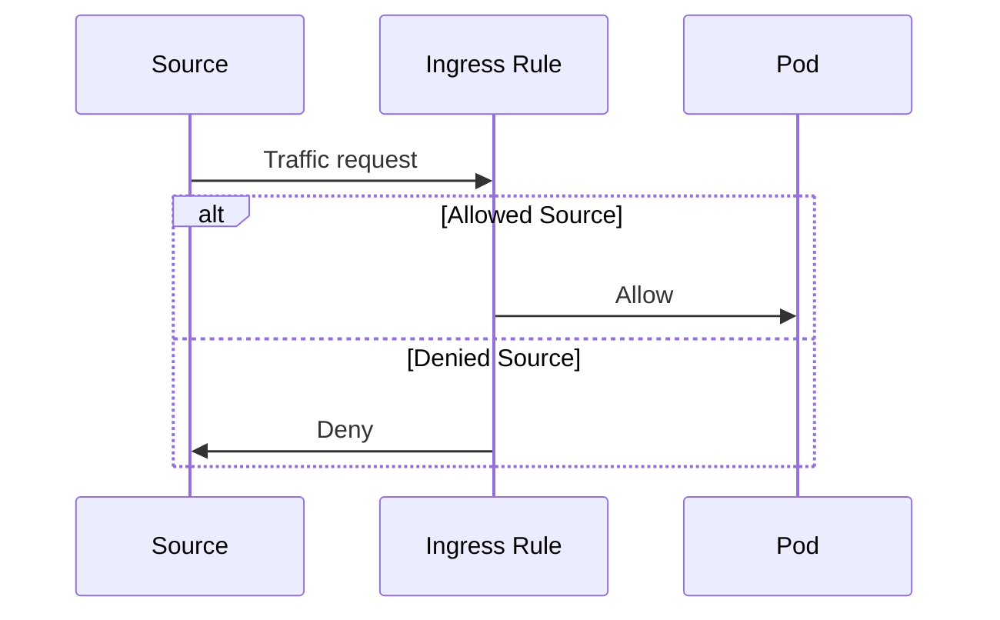
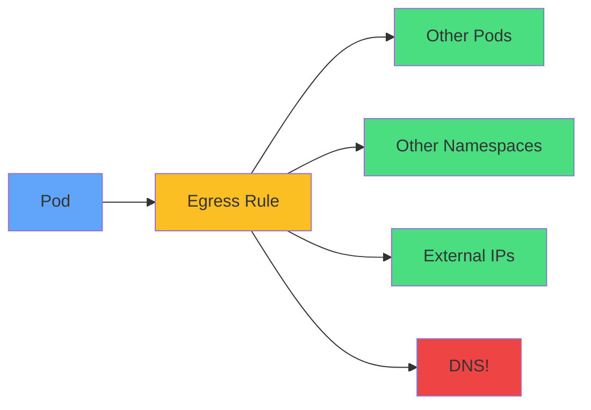
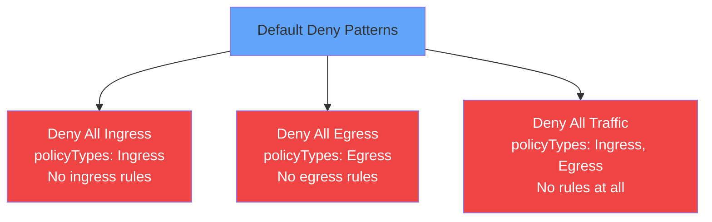
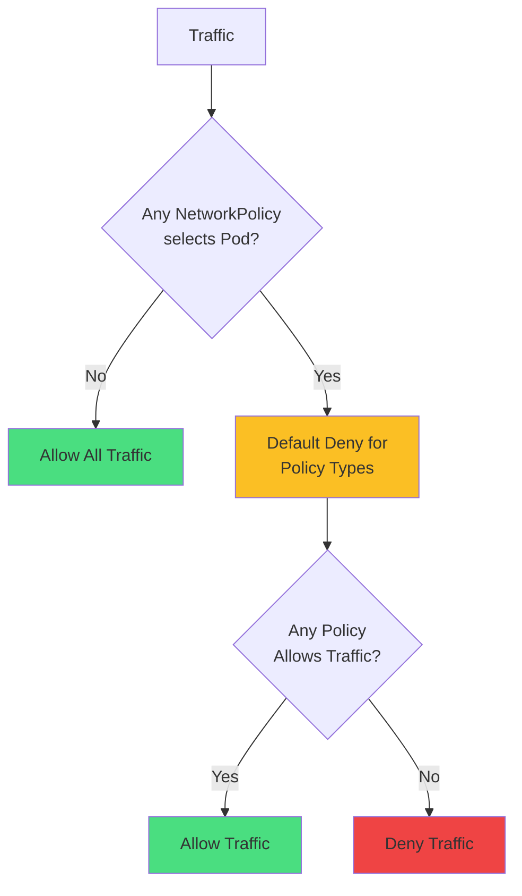
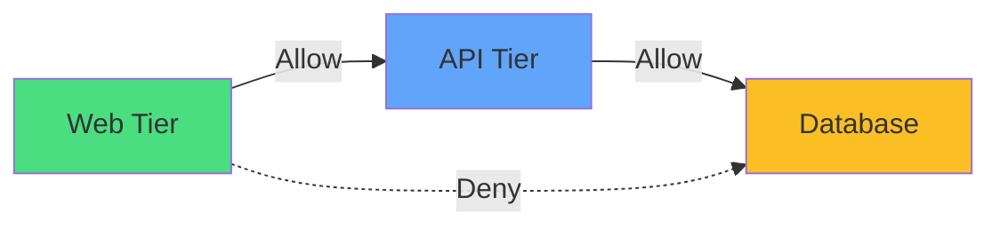
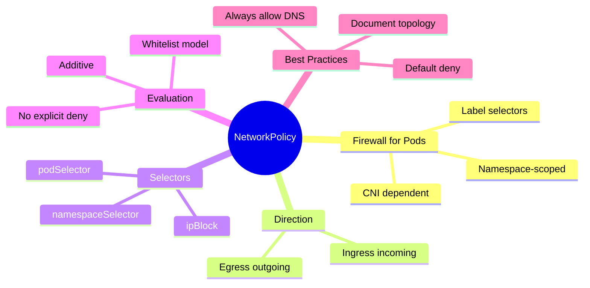

# Network Policy

<div class="abs-br m-6 flex gap-2">
  <carbon-network-3 class="text-6xl text-blue-400" />
</div>

<!--
METADATA:
sentence: In this presentation, we'll explore how NetworkPolicy enables you to control network traffic flow between Pods and external endpoints in your Kubernetes cluster.
search_anchor: control network traffic flow between Pods
-->
<div v-click class="mt-8 text-xl opacity-80">
Controlling network traffic flow between Pods
</div>

<!--
METADATA:
sentence: Network Policy is a supplementary topic for the CKAD exam, and while it may appear on the exam, it's an essential security control that every Kubernetes practitioner should understand.
search_anchor: supplementary topic for the CKAD exam
-->
<div v-click class="mt-4 text-sm text-yellow-400">
<carbon-information class="inline-block text-xl" /> CKAD Supplementary Topic
</div>

---
layout: center
---

# The Problem - Flat Networking

<!--
METADATA:
sentence: By default, Kubernetes uses a flat networking model. This means that every Pod in the cluster can communicate with every other Pod, regardless of which namespace or node they're on.
search_anchor: flat networking model
-->
<div v-click="1">



</div>

<div class="grid grid-cols-2 gap-4 mt-8 text-sm">
<!--
METADATA:
sentence: Without network controls, you cannot: Segregate networks within the cluster
search_anchor: Segregate networks within the cluster
-->
<div v-click="2">
<carbon-unlocked class="inline-block text-3xl text-red-400" /> No network segregation
</div>
<!--
METADATA:
sentence: Without network controls, you cannot: Prevent applications from reaching outside the cluster
search_anchor: Prevent applications from reaching outside the cluster
-->
<div v-click="3">
<carbon-network-3 class="inline-block text-3xl text-red-400" /> No external controls
</div>
<!--
METADATA:
sentence: Without network controls, you cannot: Isolate sensitive workloads from other applications
search_anchor: Isolate sensitive workloads from other applications
-->
<div v-click="4">
<carbon-warning class="inline-block text-3xl text-red-400" /> Cannot isolate workloads
</div>
<!--
METADATA:
sentence: Without network controls, you cannot: Enforce zero-trust network principles
search_anchor: Enforce zero-trust network principles
-->
<div v-click="5">
<carbon-security class="inline-block text-3xl text-red-400" /> No zero-trust
</div>
</div>

<!--
METADATA:
sentence: This is where NetworkPolicy comes in. It allows you to model network access as part of your application deployment, treating network security as code.
search_anchor: NetworkPolicy comes in
-->
<div v-click="6" class="mt-6 text-center text-lg">
<carbon-network-3 class="inline-block text-3xl text-green-400" /> NetworkPolicy provides firewall rules for Pods
</div>

---
layout: center
---

# NetworkPolicy Overview

<!--
METADATA:
sentence: NetworkPolicy is a Kubernetes API resource that specifies how groups of Pods can communicate with each other and with other network endpoints.
search_anchor: specifies how groups of Pods can communicate
-->
<div v-click="1">



</div>

<!--
METADATA:
sentence: Think of it as a firewall for your Pods.
search_anchor: firewall for your Pods
-->
<div v-click="2" class="mt-8 text-center text-lg">
Firewall for Pods using label selectors
</div>

<div class="grid grid-cols-2 gap-6 mt-6 text-sm">
<!--
METADATA:
sentence: Key characteristics of NetworkPolicy: Namespace-scoped: Policies are applied within a namespace
search_anchor: Namespace-scoped: Policies are applied within a namespace
-->
<div v-click="3">
<carbon-tag class="text-4xl text-blue-400 mb-2" />
<strong>Namespace-scoped</strong><br/>
<span class="text-xs opacity-80">Applied within namespace</span>
</div>
<!--
METADATA:
sentence: Key characteristics of NetworkPolicy: Additive: Multiple policies combine to allow traffic - like RBAC
search_anchor: Additive: Multiple policies combine to allow traffic
-->
<div v-click="4">
<carbon-rule class="text-4xl text-green-400 mb-2" />
<strong>Additive</strong><br/>
<span class="text-xs opacity-80">Multiple policies combine</span>
</div>
<!--
METADATA:
sentence: Key characteristics of NetworkPolicy: Whitelist model: Traffic starts denied, you explicitly allow what's needed
search_anchor: Whitelist model: Traffic starts denied
-->
<div v-click="5">
<carbon-checkmark class="text-4xl text-purple-400 mb-2" />
<strong>Whitelist model</strong><br/>
<span class="text-xs opacity-80">Deny by default, allow explicitly</span>
</div>
<!--
METADATA:
sentence: It's important to note that NetworkPolicy depends on your CNI plugin. Not all network plugins enforce policies.
search_anchor: NetworkPolicy depends on your CNI plugin
-->
<div v-click="6">
<carbon-network-3 class="text-4xl text-yellow-400 mb-2" />
<strong>CNI dependent</strong><br/>
<span class="text-xs opacity-80">Requires supporting plugin</span>
</div>
</div>

---
layout: center
---

# Policy Structure & Components

<!--
METADATA:
sentence: Let's look at the structure of a NetworkPolicy resource. Every NetworkPolicy has four main components:
search_anchor: structure of a NetworkPolicy resource
-->
<div v-click="1" class="mb-4">

```yaml
apiVersion: networking.k8s.io/v1
kind: NetworkPolicy
metadata:
  name: api-policy
spec:
  podSelector:
    matchLabels:
      app: api
  policyTypes:
  - Ingress
  - Egress
  ingress:
  - from: [...]
    ports: [...]
  egress:
  - to: [...]
    ports: [...]
```

</div>

<div class="grid grid-cols-2 gap-4 text-sm">
<!--
METADATA:
sentence: First, the podSelector determines which Pods the policy applies to. An empty selector - just curly braces - means the policy applies to all Pods in that namespace.
search_anchor: podSelector determines which Pods the policy applies to
-->
<div v-click="2">
<carbon-tag class="inline-block text-2xl text-blue-400" /> <strong>podSelector:</strong> Which Pods to apply to
</div>
<!--
METADATA:
sentence: Second, policyTypes specifies whether you're controlling Ingress, Egress, or both. This is crucial because if you specify policyTypes, you must include rules for those types, or traffic will be blocked.
search_anchor: policyTypes specifies whether you're controlling Ingress, Egress
-->
<div v-click="3">
<carbon-rule class="inline-block text-2xl text-green-400" /> <strong>policyTypes:</strong> Ingress, Egress, or both
</div>
<!--
METADATA:
sentence: Third, the ingress section contains rules for incoming traffic. These rules specify which sources can reach the selected Pods and on which ports.
search_anchor: ingress section contains rules for incoming traffic
-->
<div v-click="4">
<carbon-arrow-down class="inline-block text-2xl text-yellow-400" /> <strong>ingress:</strong> Incoming traffic rules
</div>
<!--
METADATA:
sentence: Fourth, the egress section contains rules for outgoing traffic. These rules specify which destinations the selected Pods can reach and on which ports.
search_anchor: egress section contains rules for outgoing traffic
-->
<div v-click="5">
<carbon-arrow-up class="inline-block text-2xl text-purple-400" /> <strong>egress:</strong> Outgoing traffic rules
</div>
</div>

<!--
METADATA:
sentence: Remember: if you don't specify any rules under ingress or egress, but you list those policyTypes, you've effectively created a deny-all policy for that direction.
search_anchor: effectively created a deny-all policy for that direction
-->
<div v-click="6" class="mt-6 text-center text-sm text-red-400">
<carbon-warning class="inline-block text-2xl" /> Empty rules with policyTypes = deny all for that direction!
</div>

---
layout: center
---

# Pod Selectors - Choosing Your Target

<!--
METADATA:
sentence: Pod selectors are the foundation of NetworkPolicy. They determine which Pods your policy will affect.
search_anchor: Pod selectors are the foundation of NetworkPolicy
-->
<div v-click="1">



</div>

<!--
METADATA:
sentence: Using the podSelector field, you match Pods based on their labels. For example, a selector with "app: backend" will apply the policy to all Pods labeled with app equals backend in the same namespace.
search_anchor: match Pods based on their labels
-->
<div v-click="2" class="mt-8 text-center text-lg">
Select Pods by labels within the namespace
</div>

<div class="grid grid-cols-2 gap-6 mt-6">
<!--
METADATA:
sentence: For example, a selector with "app: backend" will apply the policy to all Pods labeled with app equals backend in the same namespace.
search_anchor: selector with "app: backend"
-->
<div v-click="3" class="text-center">
<carbon-tag class="text-4xl text-green-400 mb-2" />
<strong>matchLabels</strong><br/>
<span class="text-sm opacity-80">app: backend</span>
</div>
<!--
METADATA:
sentence: An empty podSelector - just empty curly braces - is special. It matches ALL Pods in that namespace. This is commonly used for default deny policies that apply to everything.
search_anchor: empty podSelector - just empty curly braces
-->
<div v-click="4" class="text-center">
<carbon-rule class="text-4xl text-blue-400 mb-2" />
<strong>Empty {}</strong><br/>
<span class="text-sm opacity-80">All Pods in namespace</span>
</div>
</div>

<!--
METADATA:
sentence: The key thing to remember: podSelector operates within the current namespace. To select Pods in other namespaces, you use namespaceSelector, which we'll discuss next.
search_anchor: podSelector operates within the current namespace
-->
<div v-click="5" class="mt-6 text-center text-sm opacity-80">
podSelector operates within current namespace only
</div>

---
layout: center
---

# Ingress Rules - Controlling Incoming Traffic

<!--
METADATA:
sentence: Ingress rules control traffic coming into your Pods. Each ingress rule has two main parts: the source specification and optional port restrictions.
search_anchor: Ingress rules control traffic coming into your Pods
-->
<div v-click="1">



</div>

<!--
METADATA:
sentence: For sources, you have three options:
search_anchor: For sources, you have three options
-->
<div v-click="2" class="mt-8 text-center text-lg">
Control traffic coming INTO selected Pods
</div>

<div class="grid grid-cols-3 gap-4 mt-6 text-xs">
<!--
METADATA:
sentence: podSelector allows traffic from specific Pods in the same namespace. For example, allowing traffic from Pods labeled "app: frontend" to reach your backend Pods.
search_anchor: podSelector allows traffic from specific Pods
-->
<div v-click="3" class="text-center">
<carbon-tag class="text-3xl text-green-400 mb-2" />
<strong>podSelector</strong><br/>
From specific Pods<br/>
<span class="opacity-60">Same namespace</span>
</div>
<!--
METADATA:
sentence: namespaceSelector allows traffic from all Pods in namespaces matching specific labels. This is essential for cross-namespace communication.
search_anchor: namespaceSelector allows traffic from all Pods in namespaces
-->
<div v-click="4" class="text-center">
<carbon-partition-auto class="text-3xl text-blue-400 mb-2" />
<strong>namespaceSelector</strong><br/>
From other namespaces<br/>
<span class="opacity-60">Label-based</span>
</div>
<!--
METADATA:
sentence: ipBlock allows traffic from specific IP address ranges using CIDR notation. This is useful for allowing traffic from specific external networks or blocking certain IP ranges.
search_anchor: ipBlock allows traffic from specific IP address ranges
-->
<div v-click="5" class="text-center">
<carbon-network-3 class="text-3xl text-purple-400 mb-2" />
<strong>ipBlock</strong><br/>
From IP ranges<br/>
<span class="opacity-60">CIDR notation</span>
</div>
</div>

<!--
METADATA:
sentence: You can combine multiple sources in an ingress rule. When they're separate list items - separate dashes - they work as OR conditions. When namespaceSelector and podSelector are in the same list item, they work as an AND condition, requiring both to match.
search_anchor: combine multiple sources in an ingress rule
-->
<div v-click="6" class="mt-6 text-center text-sm">
<carbon-rule class="inline-block text-2xl text-yellow-400" /> Combine: OR (separate items) | AND (same item)
</div>

<!--
METADATA:
sentence: For ports, you specify the protocol - typically TCP or UDP - and the port number. You can list multiple ports in a single rule.
search_anchor: specify the protocol - typically TCP or UDP
-->
<div v-click="7" class="mt-4 text-center text-xs opacity-80">
Specify protocol (TCP/UDP) and ports
</div>

---
layout: center
---

# Egress Rules - Controlling Outgoing Traffic

<!--
METADATA:
sentence: Egress rules control traffic leaving your Pods. The structure mirrors ingress rules, but with a critical addition: DNS.
search_anchor: Egress rules control traffic leaving your Pods
-->
<div v-click="1">



</div>

<!--
METADATA:
sentence: For destinations, you use the same three selector types:
search_anchor: For destinations, you use the same three selector types
-->
<div v-click="2" class="mt-8 text-center text-lg">
Control traffic LEAVING selected Pods
</div>

<div class="grid grid-cols-3 gap-4 mt-6 text-xs">
<!--
METADATA:
sentence: podSelector allows traffic to specific Pods in the same namespace.
search_anchor: podSelector allows traffic to specific Pods in the same namespace
-->
<div v-click="3">
<carbon-tag class="inline-block text-2xl text-green-400" /> podSelector
</div>
<!--
METADATA:
sentence: namespaceSelector allows traffic to Pods in specific namespaces.
search_anchor: namespaceSelector allows traffic to Pods in specific namespaces
-->
<div v-click="4">
<carbon-partition-auto class="inline-block text-2xl text-blue-400" /> namespaceSelector
</div>
<!--
METADATA:
sentence: ipBlock allows traffic to specific IP ranges - often used for external APIs or databases.
search_anchor: ipBlock allows traffic to specific IP ranges
-->
<div v-click="5">
<carbon-network-3 class="inline-block text-2xl text-purple-400" /> ipBlock
</div>
</div>

<!--
METADATA:
sentence: Here's the critical point about egress: if you define ANY egress rules, you must explicitly allow DNS.
search_anchor: critical point about egress
-->
<div v-click="6" class="mt-8 text-center text-2xl text-red-400">
<carbon-warning class="inline-block text-3xl" /> CRITICAL
</div>

<!--
METADATA:
sentence: Most applications need to resolve service names to IP addresses. Without DNS access, your applications will fail with "unknown host" or "bad address" errors.
search_anchor: must explicitly allow DNS
-->
<div v-click="7" class="text-center text-lg mt-4">
Must explicitly allow DNS (UDP port 53 to kube-system)!
</div>

<!--
METADATA:
sentence: This is one of the most common mistakes when implementing NetworkPolicy - forgetting to allow DNS access.
search_anchor: most common mistakes when implementing NetworkPolicy
-->
<div v-click="8" class="text-center text-sm mt-4 opacity-80">
Most common mistake when implementing NetworkPolicy
</div>

---
layout: center
---

# Default Deny Policies

<!--
METADATA:
sentence: Default deny policies are a best practice in network security. The concept is simple: block all traffic by default, then explicitly allow only what's necessary. This follows the principle of least privilege.
search_anchor: Default deny policies are a best practice
-->
<div v-click="1">



</div>

<!--
METADATA:
sentence: There are three common default deny patterns:
search_anchor: three common default deny patterns
-->
<div v-click="2" class="mt-8 text-center text-lg">
Best practice: deny all, then explicitly allow
</div>

<div class="grid grid-cols-3 gap-4 mt-6 text-sm">
<!--
METADATA:
sentence: Deny all ingress creates a policy with policyTypes Ingress but no ingress rules. This blocks all incoming traffic to selected Pods. Traffic can still leave the Pods unless you also restrict egress.
search_anchor: Deny all ingress creates a policy
-->
<div v-click="3" class="text-center">
<carbon-arrow-down class="text-4xl text-red-400 mb-2" />
<strong>Deny ingress</strong><br/>
Block incoming
</div>
<!--
METADATA:
sentence: Deny all egress creates a policy with policyTypes Egress but no egress rules. This blocks all outgoing traffic. Pods can receive traffic but cannot initiate connections or even resolve DNS names.
search_anchor: Deny all egress creates a policy
-->
<div v-click="4" class="text-center">
<carbon-arrow-up class="text-4xl text-red-400 mb-2" />
<strong>Deny egress</strong><br/>
Block outgoing
</div>
<!--
METADATA:
sentence: Deny all traffic combines both - policyTypes includes both Ingress and Egress with no rules for either. This completely isolates Pods from all network communication.
search_anchor: Deny all traffic combines both
-->
<div v-click="5" class="text-center">
<carbon-close class="text-4xl text-red-400 mb-2" />
<strong>Deny all</strong><br/>
Complete isolation
</div>
</div>

<!--
METADATA:
sentence: Once in place, you layer additional policies on top to selectively allow required communication paths.
search_anchor: layer additional policies on top
-->
<div v-click="6" class="mt-6 text-center text-sm opacity-80">
Layer additional policies to selectively allow traffic
</div>

<!--
METADATA:
sentence: These policies typically use an empty podSelector to apply to all Pods in a namespace.
search_anchor: empty podSelector to apply to all Pods
-->
<div v-click="7" class="mt-4 text-center text-xs">
Policies use empty podSelector ({}) to apply to all Pods in namespace
</div>

---
layout: center
---

# Policy Evaluation & Additivity

<!--
METADATA:
sentence: Understanding how Kubernetes evaluates NetworkPolicy is crucial. Here's the evaluation flow:
search_anchor: Understanding how Kubernetes evaluates NetworkPolicy
-->
<div v-click="1">



</div>

<!--
METADATA:
sentence: Then, traffic is evaluated against ALL policies that select the Pod. If any policy allows the traffic, it's permitted. This is the additive nature of NetworkPolicy.
search_anchor: additive nature of NetworkPolicy
-->
<div v-click="2" class="mt-8 text-center text-lg">
Policies are additive - combine to allow traffic
</div>

<div class="grid grid-cols-2 gap-6 mt-6 text-sm">
<!--
METADATA:
sentence: If any policy allows the traffic, it's permitted.
search_anchor: any policy allows the traffic
-->
<div v-click="3">
<carbon-checkmark class="text-3xl text-green-400 mb-2" />
<strong>Any policy allows = traffic flows</strong>
</div>
<!--
METADATA:
sentence: This means you cannot write a policy to explicitly deny traffic. If one policy allows traffic and another doesn't mention it, the traffic is allowed.
search_anchor: cannot write a policy to explicitly deny traffic
-->
<div v-click="4">
<carbon-close class="text-3xl text-red-400 mb-2" />
<strong>No explicit deny possible</strong>
</div>
</div>

<!--
METADATA:
sentence: This behavior is intentional and consistent with RBAC. It encourages a whitelist approach where you explicitly enumerate allowed communication paths rather than trying to block specific patterns.
search_anchor: consistent with RBAC
-->
<div v-click="5" class="mt-6 text-center text-sm opacity-80">
Like RBAC: whitelist approach, enumerate allowed paths
</div>

<!--
METADATA:
sentence: When troubleshooting, always check ALL policies that might select a Pod. Use "kubectl describe networkpolicy" and "kubectl get pods --show-labels" to understand which policies apply to which Pods.
search_anchor: always check ALL policies that might select a Pod
-->
<div v-click="6" class="mt-4 text-center text-xs">
Check ALL policies that select a Pod when troubleshooting
</div>

---
layout: center
---

# Common Patterns & Best Practices

<!--
METADATA:
sentence: Let's look at common NetworkPolicy patterns you'll encounter in production:
search_anchor: common NetworkPolicy patterns you'll encounter in production
-->
<div v-click="1">



</div>

<div class="grid grid-cols-2 gap-6 mt-8">
<!--
METADATA:
sentence: Three-tier application security: For applications with web, API, and database tiers, you create policies that allow web to communicate with API, API to communicate with database, but prevent web from directly accessing database.
search_anchor: Three-tier application security
-->
<div v-click="2">
<carbon-layers class="text-4xl text-blue-400 mb-2" />
<strong>Three-tier security</strong><br/>
<span class="text-sm opacity-80">Web → API → Database only</span>
</div>
<!--
METADATA:
sentence: Namespace isolation: Create a policy in each namespace that only allows traffic from Pods within that same namespace. This prevents cross-namespace communication unless explicitly allowed.
search_anchor: Namespace isolation: Create a policy in each namespace
-->
<div v-click="3">
<carbon-partition-auto class="text-4xl text-green-400 mb-2" />
<strong>Namespace isolation</strong><br/>
<span class="text-sm opacity-80">Traffic within namespace only</span>
</div>
<!--
METADATA:
sentence: External API access: For Pods that need to call external services, use egress policies with ipBlock to allow traffic only to specific IP ranges. This prevents unauthorized external communication and data exfiltration.
search_anchor: External API access: For Pods that need to call external services
-->
<div v-click="4">
<carbon-network-3 class="text-4xl text-purple-400 mb-2" />
<strong>External API access</strong><br/>
<span class="text-sm opacity-80">Egress to specific IPs only</span>
</div>
<!--
METADATA:
sentence: Public-facing services: For services exposed to the internet, create ingress policies that allow traffic from anywhere, but carefully control their egress to prevent them from being used as pivot points if compromised.
search_anchor: Public-facing services: For services exposed to the internet
-->
<div v-click="5">
<carbon-unlocked class="text-4xl text-yellow-400 mb-2" />
<strong>Public services</strong><br/>
<span class="text-sm opacity-80">Allow ingress, restrict egress</span>
</div>
</div>

---
layout: center
---

# Best Practices

<div class="grid grid-cols-2 gap-6 mt-4">
<!--
METADATA:
sentence: Best practices to remember: Start with default deny policies
search_anchor: Start with default deny policies
-->
<div v-click="1">
<carbon-rule class="text-4xl text-red-400 mb-2" />
<strong>Start with default deny</strong><br/>
<span class="text-sm opacity-80">Block all, then allow</span>
</div>
<!--
METADATA:
sentence: Best practices to remember: Always include DNS in egress policies
search_anchor: Always include DNS in egress policies
-->
<div v-click="2">
<carbon-network-3 class="text-4xl text-blue-400 mb-2" />
<strong>Always include DNS</strong><br/>
<span class="text-sm opacity-80">UDP 53 to kube-system</span>
</div>
<!--
METADATA:
sentence: Best practices to remember: Use namespace labels for cross-namespace communication
search_anchor: Use namespace labels for cross-namespace communication
-->
<div v-click="3">
<carbon-tag class="text-4xl text-green-400 mb-2" />
<strong>Use namespace labels</strong><br/>
<span class="text-sm opacity-80">For cross-namespace rules</span>
</div>
<!--
METADATA:
sentence: Best practices to remember: Document your network topology alongside your policies
search_anchor: Document your network topology alongside your policies
-->
<div v-click="4">
<carbon-document class="text-4xl text-purple-400 mb-2" />
<strong>Document topology</strong><br/>
<span class="text-sm opacity-80">Alongside your policies</span>
</div>
<!--
METADATA:
sentence: Best practices to remember: Test connectivity after applying policies
search_anchor: Test connectivity after applying policies
-->
<div v-click="5">
<carbon-network-3 class="text-4xl text-yellow-400 mb-2" />
<strong>Test connectivity</strong><br/>
<span class="text-sm opacity-80">After applying policies</span>
</div>
<!--
METADATA:
sentence: Best practices to remember: Use descriptive names for policies that indicate their purpose
search_anchor: Use descriptive names for policies that indicate their purpose
-->
<div v-click="6">
<carbon-text-font class="text-4xl text-orange-400 mb-2" />
<strong>Descriptive names</strong><br/>
<span class="text-sm opacity-80">Indicate purpose clearly</span>
</div>
</div>

---
layout: center
---

# Summary

<!--
METADATA:
sentence: Let's recap the essential concepts:
search_anchor: recap the essential concepts
-->
<div v-click="1">



</div>

---
layout: center
---

# Key Takeaways

<div class="grid grid-cols-2 gap-6 mt-6">
<!--
METADATA:
sentence: NetworkPolicy is Kubernetes' native network security mechanism. It works at the Pod level using label selectors to control both ingress and egress traffic.
search_anchor: Kubernetes' native network security mechanism
-->
<div v-click="1">
<carbon-network-3 class="text-4xl text-blue-400 mb-2" />
<strong>Pod-level firewall</strong><br/>
<span class="text-sm opacity-80">Control ingress and egress traffic</span>
</div>
<!--
METADATA:
sentence: Policies are additive - multiple policies combine to allow traffic. There's no explicit deny; you control access by not allowing it.
search_anchor: Policies are additive - multiple policies combine
-->
<div v-click="2">
<carbon-rule class="text-4xl text-green-400 mb-2" />
<strong>Additive policies</strong><br/>
<span class="text-sm opacity-80">Multiple policies combine to allow</span>
</div>
<!--
METADATA:
sentence: Pod selectors choose Pods by labels, namespace selectors enable cross-namespace rules, and ipBlock allows CIDR-based restrictions.
search_anchor: Pod selectors choose Pods by labels
-->
<div v-click="3">
<carbon-tag class="text-4xl text-purple-400 mb-2" />
<strong>Label-based selection</strong><br/>
<span class="text-sm opacity-80">Pods, namespaces, IP blocks</span>
</div>
<!--
METADATA:
sentence: Remember the critical points: ingress controls incoming traffic, egress controls outgoing traffic. Always allow DNS when using egress policies.
search_anchor: Always allow DNS when using egress policies
-->
<div v-click="4">
<carbon-warning class="text-4xl text-red-400 mb-2" />
<strong>Don't forget DNS!</strong><br/>
<span class="text-sm opacity-80">Egress requires explicit DNS allow</span>
</div>
</div>

<!--
METADATA:
sentence: NetworkPolicy is supplementary for CKAD, but it's fundamental for production security. Practice creating policies, testing connectivity, and debugging issues. Remember that on the exam, there's no imperative command - you must write YAML.
search_anchor: NetworkPolicy is supplementary for CKAD
-->
<div v-click="5" class="mt-8 text-center text-lg">
<carbon-education class="inline-block text-3xl text-blue-400" /> CKAD supplementary - practice writing YAML!
</div>
