# Kubernetes Operators

<div class="abs-br m-6 flex gap-2">
  <carbon-settings class="text-6xl text-blue-400" />
</div>

<!--
METADATA:
sentence: Welcome to this introduction to Kubernetes Operators. In this session, we'll explore how Operators extend Kubernetes to manage complex, stateful applications with operational intelligence built in.
search_anchor: extend Kubernetes to manage complex, stateful applications
-->
<div v-click class="mt-8 text-xl opacity-80">
Extending Kubernetes with application-specific intelligence
</div>

<!--
METADATA:
sentence: Important note: Operators are marked as "Advanced - Beyond CKAD" in the curriculum. While not required for CKAD certification, understanding Operators is valuable for working with modern Kubernetes applications. However, Custom Resource Definitions (CRDs), which are part of the operator pattern, are CKAD-relevant.
search_anchor: Advanced - Beyond CKAD
-->
<div v-click class="mt-4 text-sm text-yellow-400">
Advanced - Beyond CKAD (CRDs are CKAD-relevant)
</div>

---
layout: center
---

# The Operational Complexity Challenge

<!--
METADATA:
sentence: Consider deploying a complex stateful application like a database cluster:
search_anchor: complex stateful application like a database cluster
-->
<div v-click="1">

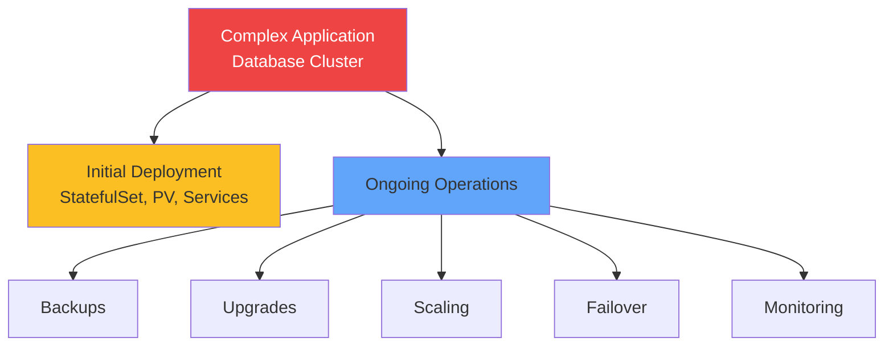

</div>

<!--
METADATA:
sentence: Standard Kubernetes resources handle the deployment well, but they don't understand the operational tasks.
search_anchor: don't understand the operational tasks
-->
<div v-click="2" class="mt-8 text-center text-lg">
Standard Kubernetes handles deployment, not operations
</div>

<!--
METADATA:
sentence: Operators solve this by bringing that operational knowledge into Kubernetes itself.
search_anchor: bringing that operational knowledge into Kubernetes
-->
<div v-click="3" class="mt-4 text-center text-xl">
<carbon-settings class="inline-block text-3xl text-green-400" /> Operators encode operational knowledge
</div>

---
layout: center
---

# What is an Operator?

<!--
METADATA:
sentence: An Operator is a pattern for extending Kubernetes with application-specific operational knowledge.
search_anchor: pattern for extending Kubernetes with application-specific operational knowledge
-->
<div v-click="1">

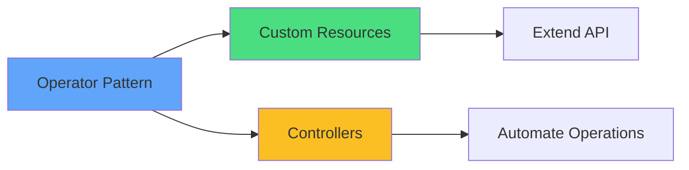

</div>

<!--
METADATA:
sentence: The official definition: "Operators are software extensions to Kubernetes that use custom resources to manage applications and their components."
search_anchor: software extensions to Kubernetes
-->
<div v-click="2" class="mt-8 text-center text-lg">
Software extensions to Kubernetes
</div>

<div class="grid grid-cols-2 gap-6 mt-6 text-sm">
<!--
METADATA:
sentence: Extends Kubernetes API with custom resource types
search_anchor: Extends Kubernetes API with custom resource types
-->
<div v-click="3">
<carbon-api class="text-3xl text-blue-400 mb-2" />
<strong>Extends API</strong><br/>
Custom resource types
</div>
<!--
METADATA:
sentence: Runs continuously in the cluster watching for changes
search_anchor: Runs continuously in the cluster watching for changes
-->
<div v-click="4">
<carbon-activity class="text-3xl text-green-400 mb-2" />
<strong>Runs continuously</strong><br/>
Watches for changes
</div>
<!--
METADATA:
sentence: Encodes operational knowledge in code
search_anchor: Encodes operational knowledge in code
-->
<div v-click="5">
<carbon-settings class="text-3xl text-purple-400 mb-2" />
<strong>Encodes knowledge</strong><br/>
Operational logic in code
</div>
<!--
METADATA:
sentence: Provides self-healing capabilities
search_anchor: Provides self-healing capabilities
-->
<div v-click="6">
<carbon-restart class="text-3xl text-yellow-400 mb-2" />
<strong>Self-healing</strong><br/>
Automatic reconciliation
</div>
</div>

---
layout: center
---

# Custom Resource Definitions (CRDs)

<!--
METADATA:
sentence: Custom Resource Definitions extend the Kubernetes API with new resource types.
search_anchor: Custom Resource Definitions extend the Kubernetes API
-->
<div v-click="1" class="mb-4">

```yaml
apiVersion: apiextensions.k8s.io/v1
kind: CustomResourceDefinition
metadata:
  name: postgresclusters.db.example.com
spec:
  group: db.example.com
  names:
    kind: PostgresCluster
    plural: postgresclusters
  scope: Namespaced
```

</div>

<!--
METADATA:
sentence: The CRD defines what fields are valid, their types, and validation rules. It's just a schema - the CRD itself doesn't do anything beyond allowing Kubernetes to store these resources.
search_anchor: CRD defines what fields are valid
-->
<div v-click="2">

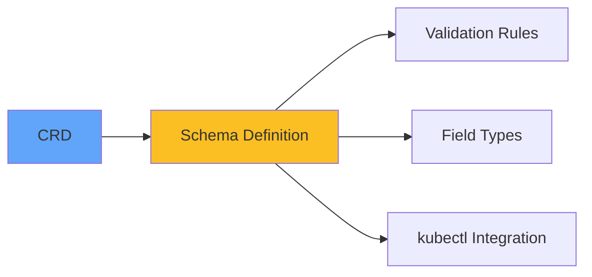

</div>

<!--
METADATA:
sentence: A CRD is a schema that tells Kubernetes about a new resource type you want to store and manage. After installing a CRD, you can create custom resources just like you create Pods or Services.
search_anchor: create custom resources just like you create Pods or Services
-->
<div v-click="3" class="mt-6 text-center text-lg">
Extends Kubernetes API with new resource types
</div>

<!--
METADATA:
sentence: Important note: Operators are marked as "Advanced - Beyond CKAD" in the curriculum. While not required for CKAD certification, understanding Operators is valuable for working with modern Kubernetes applications. However, Custom Resource Definitions (CRDs), which are part of the operator pattern, are CKAD-relevant.
search_anchor: CRDs, which are part of the operator pattern, are CKAD-relevant
-->
<div v-click="4" class="mt-4 text-center text-sm text-green-400">
<carbon-checkmark class="inline-block text-2xl" /> CKAD-relevant skill!
</div>

---
layout: center
---

# Creating Custom Resources

<!--
METADATA:
sentence: After installing this CRD, users can create PostgresCluster resources:
search_anchor: users can create PostgresCluster resources
-->
<div v-click="1" class="mb-6">

```yaml
apiVersion: db.example.com/v1
kind: PostgresCluster
metadata:
  name: my-database
spec:
  version: "14"
  replicas: 3
  storage: 100Gi
```

</div>

<!--
METADATA:
sentence: User creates Custom Resource → CRD validates the resource → Kubernetes stores the resource → Controller sees the new resource → Controller creates Kubernetes objects
search_anchor: User creates Custom Resource
-->
<div v-click="2">

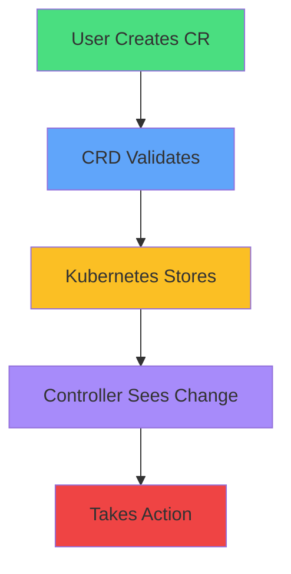

</div>

<!--
METADATA:
sentence: A CRD is a schema that tells Kubernetes about a new resource type you want to store and manage. After installing a CRD, you can create custom resources just like you create Pods or Services.
search_anchor: After installing a CRD, you can create custom resources
-->
<div v-click="3" class="mt-6 text-center text-sm opacity-80">
After CRD is installed, create custom resources like built-in resources
</div>

---
layout: center
---

# Controllers

<!--
METADATA:
sentence: Controllers are the "brains" of an Operator - they watch custom resources and take action.
search_anchor: Controllers are the "brains" of an Operator
-->
<div v-click="1">

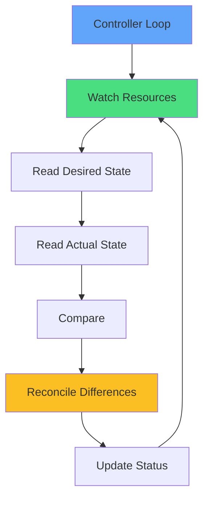

</div>

<!--
METADATA:
sentence: The Controller Loop: Watch for custom resource changes (create, update, delete), Read the desired state from the custom resource, Read the actual state from the cluster, Compare desired vs actual state, Take action to reconcile differences, Update status on the custom resource, Repeat continuously
search_anchor: Read the desired state from the custom resource
-->
<div v-click="2" class="mt-8 text-center text-lg">
The "brains" of an Operator
</div>

<div class="grid grid-cols-2 gap-6 mt-6 text-sm">
<!--
METADATA:
sentence: Controllers run as Deployments in your cluster, continuously watching the Kubernetes API and reconciling state.
search_anchor: continuously watching the Kubernetes API
-->
<div v-click="3">
<carbon-view class="text-3xl text-blue-400 mb-2" />
<strong>Watch custom resources</strong><br/>
Detect changes
</div>
<!--
METADATA:
sentence: The power: controllers can encode complex operational logic that executes automatically.
search_anchor: encode complex operational logic that executes automatically
-->
<div v-click="4">
<carbon-settings class="text-3xl text-green-400 mb-2" />
<strong>Reconcile state</strong><br/>
Make reality match desire
</div>
</div>

---
layout: center
---

# Operator Pattern in Action

<!--
METADATA:
sentence: Let's see how all the pieces work together.
search_anchor: Let's see how all the pieces work together
-->
<div v-click="1">

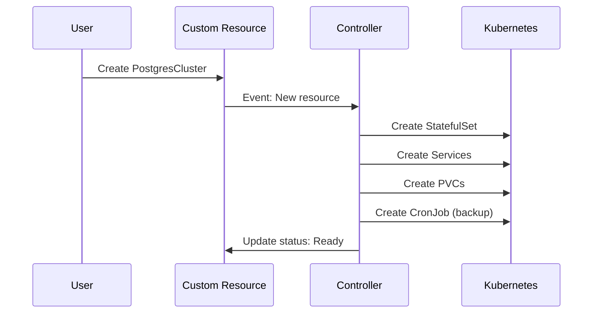

</div>

<!--
METADATA:
sentence: Without an operator, you'd manually create CronJobs and write custom scripts. With an operator, you just declare your intent, and the operator handles everything.
search_anchor: you just declare your intent
-->
<div v-click="2" class="mt-6 text-center text-lg">
Declarative intent → automated operations
</div>

---
layout: center
---

# Operator Benefits

<div class="grid grid-cols-2 gap-6 mt-6">
<!--
METADATA:
sentence: Application-Specific Intelligence: Operators understand your application's specific needs
search_anchor: Operators understand your application's specific needs
-->
<div v-click="1">
<carbon-settings class="text-4xl text-blue-400 mb-2" />
<strong>Application intelligence</strong><br/>
<span class="text-sm opacity-80">Understands app-specific needs</span>
</div>
<!--
METADATA:
sentence: Simplified Management: Users work with high-level abstractions
search_anchor: Users work with high-level abstractions
-->
<div v-click="2">
<carbon-rule class="text-4xl text-green-400 mb-2" />
<strong>Simplified management</strong><br/>
<span class="text-sm opacity-80">High-level abstractions</span>
</div>
<!--
METADATA:
sentence: Self-Healing: Operators continuously reconcile state
search_anchor: Operators continuously reconcile state
-->
<div v-click="3">
<carbon-restart class="text-4xl text-purple-400 mb-2" />
<strong>Self-healing</strong><br/>
<span class="text-sm opacity-80">Continuous reconciliation</span>
</div>
<!--
METADATA:
sentence: Declarative Operations: Operational tasks become Kubernetes resources
search_anchor: Operational tasks become Kubernetes resources
-->
<div v-click="4">
<carbon-document class="text-4xl text-yellow-400 mb-2" />
<strong>Declarative operations</strong><br/>
<span class="text-sm opacity-80">Version control everything</span>
</div>
</div>

<!--
METADATA:
sentence: With operator: Update version field in custom resource. Operator handles the entire upgrade procedure safely.
search_anchor: Operator handles the entire upgrade procedure safely
-->
<div v-click="5" class="mt-8 text-center text-sm">
Example: Update version field → Operator handles entire upgrade safely
</div>

---
layout: center
---

# Common Operator Use Cases

<!--
METADATA:
sentence: Operators are most valuable for complex, stateful applications.
search_anchor: Operators are most valuable for complex, stateful applications
-->
<div v-click="1">

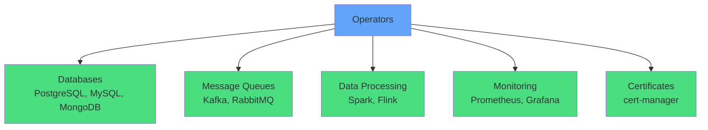

</div>

<!--
METADATA:
sentence: Databases: PostgreSQL, MySQL, MongoDB operators. Handle replication, backups, upgrades. Manage connection pooling and failover. Message Queues: Kafka, RabbitMQ, NATS operators. Data Processing: Spark, Flink operators. Monitoring and Observability: Prometheus, Grafana operators. Certificate Management: Cert-manager for TLS certificates.
search_anchor: Handle replication, backups, upgrades
-->
<div v-click="2" class="mt-8 text-center text-lg">
Most valuable for complex, stateful applications
</div>

<!--
METADATA:
sentence: Key Pattern: If your application needs ongoing operational tasks beyond simple deployment, an operator can help.
search_anchor: ongoing operational tasks beyond simple deployment
-->
<div v-click="3" class="mt-4 text-center text-sm opacity-80">
If your app needs ongoing operational tasks, an operator can help
</div>

---
layout: center
---

# Operator Maturity Levels

<!--
METADATA:
sentence: Not all operators are created equal. The Operator Framework defines capability levels:
search_anchor: Operator Framework defines capability levels
-->
<div v-click="1">

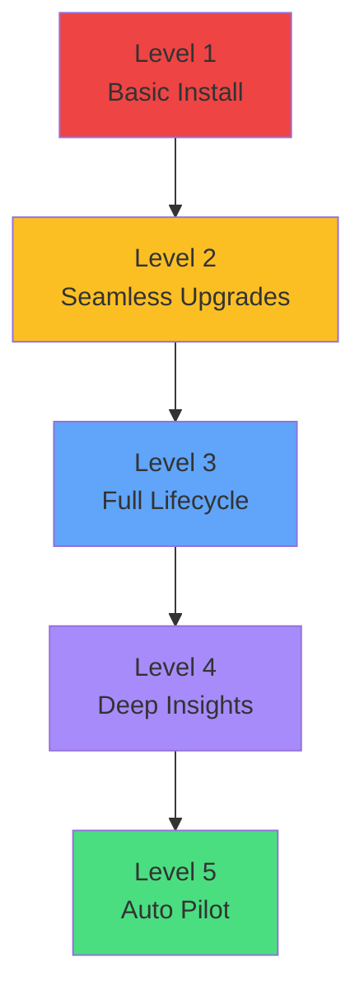

</div>

<div class="grid grid-cols-2 gap-4 mt-6 text-xs">
<!--
METADATA:
sentence: Level 1 - Basic Install: Automated application provisioning
search_anchor: Level 1 - Basic Install
-->
<div v-click="2">
<carbon-document class="inline-block text-2xl text-red-400" /> <strong>L1:</strong> Automated provisioning
</div>
<!--
METADATA:
sentence: Level 2 - Seamless Upgrades: Automated application upgrades
search_anchor: Level 2 - Seamless Upgrades
-->
<div v-click="3">
<carbon-arrow-up class="inline-block text-2xl text-yellow-400" /> <strong>L2:</strong> Automated upgrades
</div>
<!--
METADATA:
sentence: Level 3 - Full Lifecycle: Backup and restore
search_anchor: Level 3 - Full Lifecycle
-->
<div v-click="4">
<carbon-restart class="inline-block text-2xl text-blue-400" /> <strong>L3:</strong> Backup, restore, recovery
</div>
<!--
METADATA:
sentence: Level 4 - Deep Insights: Performance tuning recommendations
search_anchor: Level 4 - Deep Insights
-->
<div v-click="5">
<carbon-view class="inline-block text-2xl text-purple-400" /> <strong>L4:</strong> Performance tuning, insights
</div>
<!--
METADATA:
sentence: Level 5 - Auto Pilot: Automatic scaling
search_anchor: Level 5 - Auto Pilot
-->
<div v-click="6">
<carbon-settings class="inline-block text-2xl text-green-400" /> <strong>L5:</strong> Full automation
</div>
</div>

<!--
METADATA:
sentence: Most operators are Level 2-3. Level 5 operators are rare and application-specific.
search_anchor: Most operators are Level 2-3
-->
<div v-click="7" class="mt-6 text-center text-sm opacity-80">
Most operators are Level 2-3
</div>

---
layout: center
---

# Operator Deployment

<!--
METADATA:
sentence: How do you install and use operators?
search_anchor: How do you install and use operators
-->
<div v-click="1">

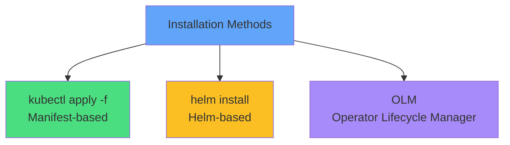

</div>

<!--
METADATA:
sentence: Typical Operator Structure: CRD definitions, RBAC resources (ServiceAccount, Roles, RoleBindings), Operator Deployment, Optional: validation webhooks, conversion webhooks
search_anchor: Typical Operator Structure
-->
<div v-click="2" class="mt-8 text-center text-lg">
Typical operator structure
</div>

<div class="grid grid-cols-2 gap-4 mt-6 text-sm">
<!--
METADATA:
sentence: Typical Operator Structure: CRD definitions
search_anchor: CRD definitions
-->
<div v-click="3">
<carbon-api class="inline-block text-2xl text-blue-400" /> CRD definitions
</div>
<!--
METADATA:
sentence: Typical Operator Structure: RBAC resources (ServiceAccount, Roles, RoleBindings)
search_anchor: RBAC resources
-->
<div v-click="4">
<carbon-locked class="inline-block text-2xl text-green-400" /> RBAC resources
</div>
<!--
METADATA:
sentence: Typical Operator Structure: Operator Deployment
search_anchor: Operator Deployment
-->
<div v-click="5">
<carbon-container-software class="inline-block text-2xl text-purple-400" /> Operator Deployment
</div>
<!--
METADATA:
sentence: Typical Operator Structure: Optional: validation webhooks, conversion webhooks
search_anchor: validation webhooks
-->
<div v-click="6">
<carbon-rule class="inline-block text-2xl text-yellow-400" /> Validation webhooks
</div>
</div>

---
layout: center
---

# RBAC & Security

<!--
METADATA:
sentence: Operators need permissions to manage cluster resources - this requires careful security consideration.
search_anchor: Operators need permissions to manage cluster resources
-->
<div v-click="1" class="mb-4">

```yaml
apiVersion: rbac.authorization.k8s.io/v1
kind: ClusterRole
metadata:
  name: database-operator
rules:
- apiGroups: ["apps"]
  resources: ["statefulsets"]
  verbs: ["get", "list", "create", "update", "delete"]
- apiGroups: ["db.example.com"]
  resources: ["postgresclusters"]
  verbs: ["get", "list", "watch", "update"]
```

</div>

<!--
METADATA:
sentence: Risk Consideration: Operators have significant cluster privileges. Only install operators from trusted sources. Review what resources they can manage.
search_anchor: Operators have significant cluster privileges
-->
<div v-click="2" class="mt-6 text-center text-lg text-red-400">
<carbon-warning class="inline-block text-3xl" /> Operators have significant cluster privileges
</div>

<div class="grid grid-cols-2 gap-6 mt-6 text-sm">
<!--
METADATA:
sentence: Security Best Practices: Use ServiceAccounts with minimal permissions
search_anchor: Use ServiceAccounts with minimal permissions
-->
<div v-click="3">
<carbon-user class="text-3xl text-blue-400 mb-2" />
<strong>ServiceAccounts</strong><br/>
Minimal permissions
</div>
<!--
METADATA:
sentence: Security Best Practices: Review operator permissions before installation
search_anchor: Review operator permissions before installation
-->
<div v-click="4">
<carbon-security class="text-3xl text-yellow-400 mb-2" />
<strong>Review permissions</strong><br/>
Before installation
</div>
</div>

---
layout: center
---

# Building vs Using Operators

<!--
METADATA:
sentence: Should you build your own operator or use existing ones?
search_anchor: Should you build your own operator
-->
<div v-click="1">

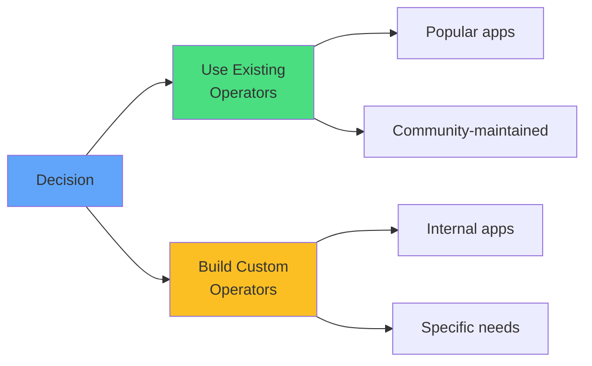

</div>

<div class="grid grid-cols-2 gap-6 mt-8">
<!--
METADATA:
sentence: Use Existing Operators When: Popular applications (databases, message queues, monitoring), Community-maintained operators exist
search_anchor: Use Existing Operators When
-->
<div v-click="2">
<carbon-download class="text-4xl text-green-400 mb-2" />
<strong>Use existing</strong><br/>
<span class="text-sm opacity-80">Databases, queues, monitoring</span>
</div>
<!--
METADATA:
sentence: Build Custom Operators When: Internal applications with specific operational needs, Unique deployment procedures
search_anchor: Build Custom Operators When
-->
<div v-click="3">
<carbon-edit class="text-4xl text-yellow-400 mb-2" />
<strong>Build custom</strong><br/>
<span class="text-sm opacity-80">Internal apps, unique logic</span>
</div>
</div>

<!--
METADATA:
sentence: Operator Development Tools: Operator SDK - Framework for building operators, Kubebuilder - Kubernetes-native SDK, KUDO - Declarative operator creation
search_anchor: Operator Development Tools
-->
<div v-click="4" class="mt-8 text-center text-sm opacity-80">
Tools: Operator SDK, Kubebuilder, KUDO
</div>

---
layout: center
---

# Operators and CKAD

<!--
METADATA:
sentence: Let's clarify what's relevant for CKAD certification.
search_anchor: what's relevant for CKAD certification
-->
<div v-click="1">

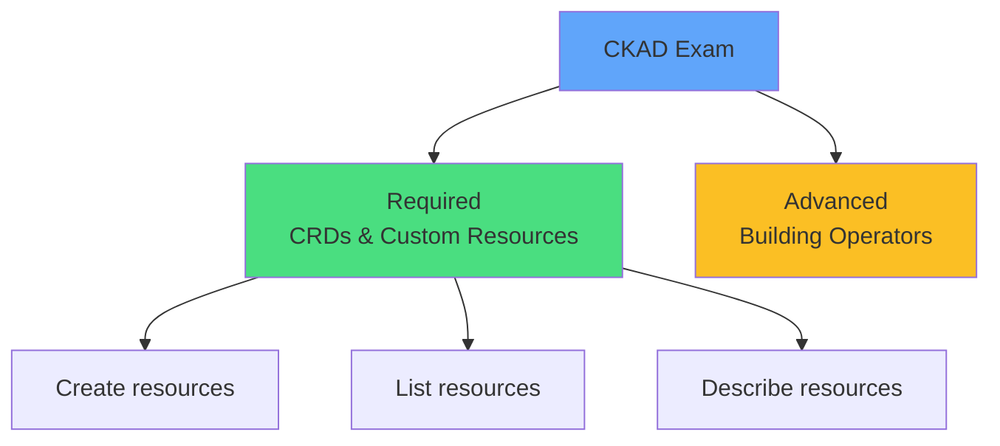

</div>

<div class="grid grid-cols-2 gap-6 mt-8">
<!--
METADATA:
sentence: CKAD Relevant (Required): Understanding Custom Resource Definitions (CRDs), Creating and managing custom resources, Using kubectl with custom resources
search_anchor: CKAD Relevant (Required)
-->
<div v-click="2">
<carbon-checkmark class="text-4xl text-green-400 mb-2" />
<strong>CKAD Required</strong><br/>
<span class="text-sm opacity-80">Work with CRDs and custom resources</span>
</div>
<!--
METADATA:
sentence: Beyond CKAD (Advanced): Building operators, Complex operator development
search_anchor: Beyond CKAD (Advanced)
-->
<div v-click="3">
<carbon-close class="text-4xl text-red-400 mb-2" />
<strong>Beyond CKAD</strong><br/>
<span class="text-sm opacity-80">Building operators, complex development</span>
</div>
</div>

<!--
METADATA:
sentence: You won't build operators or debug operator code. Focus on being a user of operators, not a developer of operators.
search_anchor: Focus on being a user of operators
-->
<div v-click="4" class="mt-8 text-center text-lg">
<carbon-education class="inline-block text-3xl text-blue-400" /> Focus: Be a user of operators, not a developer
</div>

---
layout: center
---

# Summary

<!--
METADATA:
sentence: Let's recap the key concepts:
search_anchor: Let's recap the key concepts
-->
<div v-click="1">

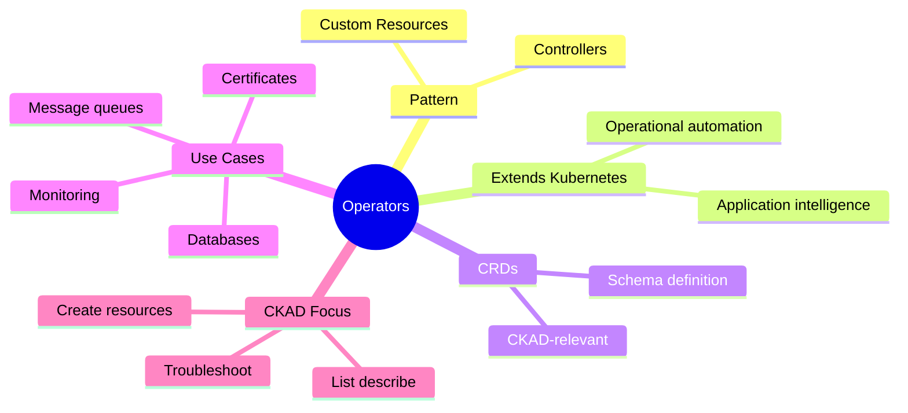

</div>

---
layout: center
---

# Key Takeaways

<div class="grid grid-cols-2 gap-6 mt-6">
<!--
METADATA:
sentence: Operators: Extend Kubernetes with application-specific operational knowledge. Combine Custom Resource Definitions with Controllers
search_anchor: Combine Custom Resource Definitions with Controllers
-->
<div v-click="1">
<carbon-settings class="text-4xl text-blue-400 mb-2" />
<strong>Operator pattern</strong><br/>
<span class="text-sm opacity-80">CRDs + Controllers = automation</span>
</div>
<!--
METADATA:
sentence: Operators: Extend Kubernetes with application-specific operational knowledge. Automate complex deployment and operational tasks
search_anchor: Automate complex deployment and operational tasks
-->
<div v-click="2">
<carbon-api class="text-4xl text-green-400 mb-2" />
<strong>Extends Kubernetes</strong><br/>
<span class="text-sm opacity-80">Application-specific intelligence</span>
</div>
<!--
METADATA:
sentence: CRDs: Extend Kubernetes API with custom resource types. Define schemas for custom resources. CKAD-relevant skill
search_anchor: CKAD-relevant skill
-->
<div v-click="3">
<carbon-document class="text-4xl text-purple-400 mb-2" />
<strong>CRDs are CKAD</strong><br/>
<span class="text-sm opacity-80">Practice creating custom resources</span>
</div>
<!--
METADATA:
sentence: For CKAD: Understand the operator pattern conceptually. Know how to work with CRDs and custom resources. Practice using operator-managed applications.
search_anchor: Practice using operator-managed applications
-->
<div v-click="4">
<carbon-education class="text-4xl text-yellow-400 mb-2" />
<strong>User, not builder</strong><br/>
<span class="text-sm opacity-80">Work with operators, don't build them</span>
</div>
</div>

<!--
METADATA:
sentence: In our next session, we'll work hands-on with operators, deploying NATS message queues and MySQL databases, experiencing how operators simplify complex application management.
search_anchor: operators simplify complex application management
-->
<div v-click="5" class="mt-8 text-center text-lg">
Operators simplify complex application management <carbon-arrow-right class="inline-block text-2xl" />
</div>
