# PersistentVolumes

<div class="abs-br m-6 flex gap-2">
  <carbon-data-volume class="text-6xl text-blue-400" />
</div>

<!--
METADATA:
sentence: Welcome to this session on PersistentVolumes in Kubernetes. Today we'll explore how Kubernetes handles application data storage, from temporary container filesystems to persistent volumes that survive Pod restarts and deletions.
search_anchor: application data storage
-->
<div v-click class="mt-8 text-xl opacity-80">
Storage that survives Pods and containers
</div>

---
layout: center
---

# Storage in Kubernetes

<!--
METADATA:
sentence: Storage is a critical component of any production application. Unlike stateless applications that can be freely moved and restarted, stateful applications need reliable, persistent storage.
search_anchor: critical component of any production application
-->
<div v-click="1">

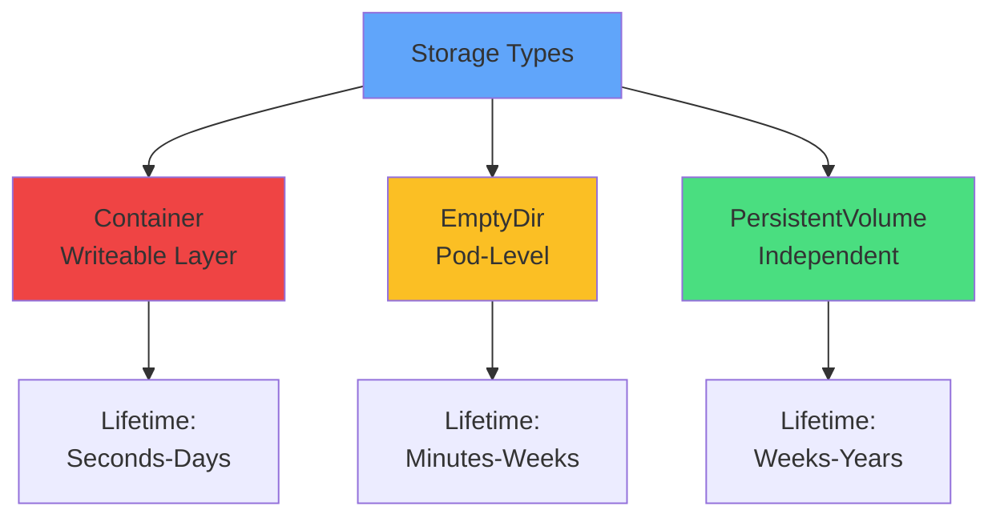

</div>

<!--
METADATA:
sentence: Kubernetes provides a sophisticated storage abstraction that separates storage details from the application layer.
search_anchor: separates storage details from the application layer
-->
<div v-click="2" class="mt-8 text-center text-lg">
Different storage for different needs
</div>

---
layout: center
---

# Container Writeable Layer

<!--
METADATA:
sentence: Every container in Kubernetes has its own writeable filesystem layer. This layer is created when the container starts and allows applications to write files and modify data.
search_anchor: writeable filesystem layer
-->
<div v-click="1">

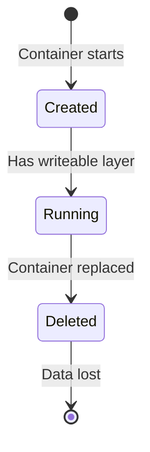

</div>

<!--
METADATA:
sentence: However, there's a critical limitation: the writeable layer has the same lifecycle as the container.
search_anchor: same lifecycle as the container
-->
<div v-click="2" class="mt-8 text-center text-lg text-red-400">
<carbon-warning class="inline-block text-3xl" /> Data lifecycle = Container lifecycle
</div>

<div class="grid grid-cols-2 gap-6 mt-6">
<!--
METADATA:
sentence: It's quick, requires no configuration, and works out of the box.
search_anchor: quick, requires no configuration
-->
<div v-click="3">
<carbon-checkmark class="text-4xl text-green-400 mb-2" />
<strong>Quick & easy</strong><br/>
<span class="text-sm opacity-80">No configuration needed</span>
</div>
<!--
METADATA:
sentence: When a container is replaced—whether due to a crash, an update, or a manual restart—all data in that writeable layer is permanently lost.
search_anchor: permanently lost
-->
<div v-click="4">
<carbon-close class="text-4xl text-red-400 mb-2" />
<strong>Temporary only</strong><br/>
<span class="text-sm opacity-80">Lost on restart</span>
</div>
</div>

---
layout: center
---

# EmptyDir Volumes

<!--
METADATA:
sentence: An EmptyDir volume is created when a Pod is assigned to a node and exists as long as that Pod is running. As the name suggests, it starts as an empty directory.
search_anchor: EmptyDir volume is created
-->
<div v-click="1">

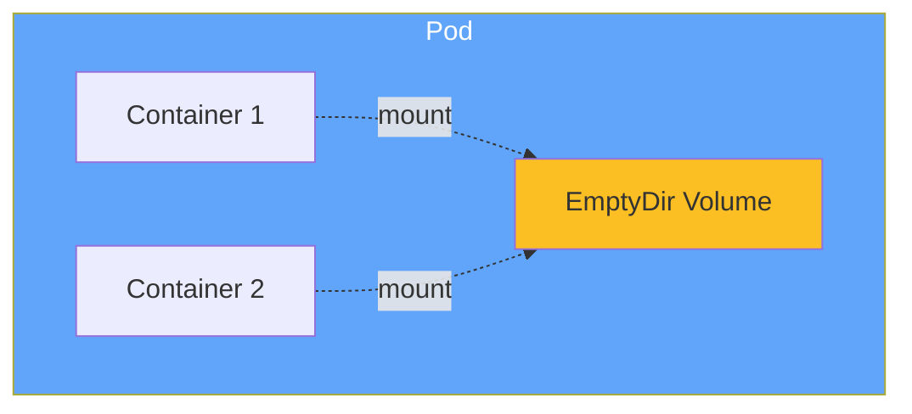

</div>

<!--
METADATA:
sentence: Lifecycle: EmptyDir volumes survive container restarts within the same Pod. If a container crashes and Kubernetes restarts it, the EmptyDir volume and its data remain intact.
search_anchor: survive container restarts within the same Pod
-->
<div v-click="2" class="mt-8 text-center text-lg">
Pod-level storage, survives container restarts
</div>

<div class="grid grid-cols-3 gap-4 mt-6 text-sm">
<!--
METADATA:
sentence: EmptyDir volumes survive container restarts within the same Pod. If a container crashes and Kubernetes restarts it, the EmptyDir volume and its data remain intact.
search_anchor: survive container restarts
-->
<div v-click="3" class="text-center">
<carbon-restart class="text-3xl text-green-400 mb-2" />
<strong>Survives</strong><br/>
Container restarts
</div>
<!--
METADATA:
sentence: All containers within the Pod can mount and access this shared directory.
search_anchor: shared directory
-->
<div v-click="4" class="text-center">
<carbon-network-overlay class="text-3xl text-blue-400 mb-2" />
<strong>Shared</strong><br/>
Multi-container Pods
</div>
<!--
METADATA:
sentence: However, when the Pod itself is deleted or replaced, the EmptyDir volume is deleted with it.
search_anchor: deleted with it
-->
<div v-click="5" class="text-center">
<carbon-close class="text-3xl text-red-400 mb-2" />
<strong>Lost</strong><br/>
Pod deletion
</div>
</div>

<!--
METADATA:
sentence: EmptyDir can be backed by different storage mediums. By default, it uses whatever storage backs the node—typically a disk. However, you can configure it to use memory instead by setting the medium to "Memory," which is faster but limited by available RAM.
search_anchor: backed by different storage mediums
-->
<div v-click="6" class="mt-6 text-center text-sm opacity-80">
Can be backed by disk (default) or memory
</div>

---
layout: center
---

# The Need for Persistent Storage

<!--
METADATA:
sentence: Now we reach the core challenge: what about data that must survive Pod deletions, node failures, or application updates?
search_anchor: data that must survive
-->
<div v-click="1">

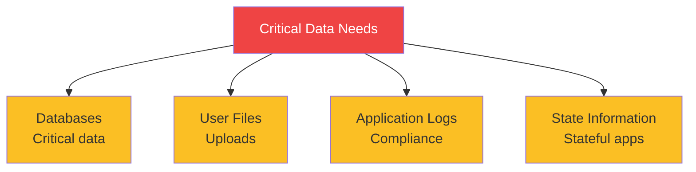

</div>

<!--
METADATA:
sentence: Consider these scenarios: A database that stores critical application data. User-uploaded files that must persist across deployments. Application logs that need to be retained for compliance. State information for stateful applications.
search_anchor: must persist across deployments
-->
<div v-click="2" class="mt-8 text-center text-lg">
Data that must survive Pod deletions and node failures
</div>

<!--
METADATA:
sentence: For these use cases, we need storage that has a lifecycle independent of any Pod or container. This is where PersistentVolumes come in.
search_anchor: lifecycle independent of any Pod
-->
<div v-click="3" class="mt-6 text-center text-xl">
<carbon-data-volume class="inline-block text-3xl text-green-400" /> PersistentVolumes have independent lifecycle
</div>

---
layout: center
---

# Storage Abstraction

<!--
METADATA:
sentence: Kubernetes needs to support various storage systems: local disks, network-attached storage, cloud provider storage like AWS EBS or Azure Disks, distributed filesystems, and more. Each has different characteristics, performance profiles, and capabilities.
search_anchor: various storage systems
-->
<div v-click="1">

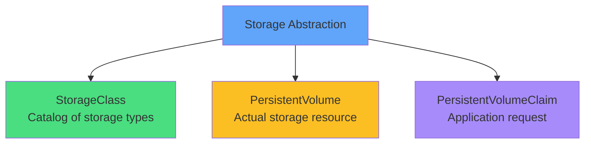

</div>

<!--
METADATA:
sentence: The challenge is providing this diverse storage infrastructure while keeping the complexity away from application developers. This is solved through abstraction.
search_anchor: solved through abstraction
-->
<div v-click="2" class="mt-8 text-center text-lg">
Separate infrastructure details from application needs
</div>

---
layout: center
---

# StorageClasses

<!--
METADATA:
sentence: Kubernetes uses StorageClasses to abstract storage details from applications. A StorageClass describes a "class" of storage that administrators offer in their cluster.
search_anchor: class of storage
-->
<div v-click="1">

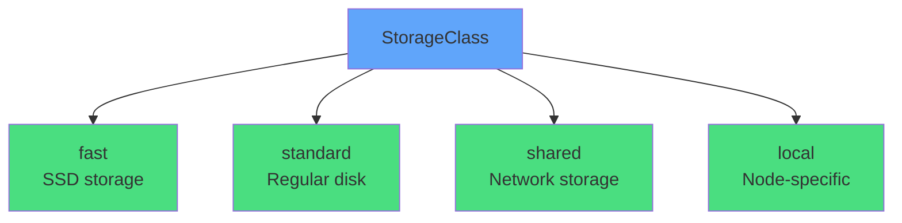

</div>

<!--
METADATA:
sentence: Different classes might represent different quality-of-service levels, backup policies, or storage types.
search_anchor: quality-of-service levels
-->
<div v-click="2" class="mt-8 text-center text-lg">
Catalog of storage types available in cluster
</div>

<div class="grid grid-cols-2 gap-6 mt-6 text-sm">
<!--
METADATA:
sentence: Each StorageClass has a provisioner that knows how to create the actual storage resource.
search_anchor: provisioner that knows how to create
-->
<div v-click="3">
<carbon-settings class="text-3xl text-blue-400 mb-2" />
<strong>Provisioner</strong><br/>
Creates actual storage
</div>
<!--
METADATA:
sentence: Different classes might represent different quality-of-service levels, backup policies, or storage types.
search_anchor: backup policies
-->
<div v-click="4">
<carbon-rule class="text-3xl text-green-400 mb-2" />
<strong>Parameters</strong><br/>
Performance, backup policies
</div>
</div>

<!--
METADATA:
sentence: For example: AWS EBS provisioner creates EBS volumes. Azure Disk provisioner creates Azure managed disks. NFS provisioner creates directories on an NFS server.
search_anchor: AWS EBS provisioner creates EBS volumes
-->
<div v-click="5" class="mt-6 text-center text-sm opacity-80">
Examples: AWS EBS, Azure Disk, NFS, local volumes
</div>

---
layout: center
---

# PersistentVolumeClaim (PVC)

<!--
METADATA:
sentence: Applications request storage through PersistentVolumeClaims (PVCs). A PVC is a request for storage by an application.
search_anchor: Applications request storage through
-->
<div v-click="1" class="mb-4">

```yaml
apiVersion: v1
kind: PersistentVolumeClaim
metadata:
  name: data-claim
spec:
  accessModes:
  - ReadWriteOnce
  resources:
    requests:
      storage: 5Gi
  storageClassName: fast
```

</div>

<!--
METADATA:
sentence: A PVC is a request for storage by an application. It's similar to how a Pod consumes node resources—the PVC consumes storage resources.
search_anchor: request for storage by an application
-->
<div v-click="2" class="mt-6 text-center text-lg">
Application's request for storage
</div>

<div class="grid grid-cols-3 gap-4 mt-6 text-sm">
<!--
METADATA:
sentence: When you create a PVC, you specify: Access Mode: ReadWriteOnce (RWO): The volume can be mounted read-write by a single node. ReadOnlyMany (ROX): The volume can be mounted read-only by many nodes. ReadWriteMany (RWX): The volume can be mounted read-write by many nodes.
search_anchor: Access Mode
-->
<div v-click="3" class="text-center">
<carbon-network-3 class="text-3xl text-blue-400 mb-2" />
<strong>Access Mode</strong><br/>
RWO, ROX, RWX
</div>
<!--
METADATA:
sentence: Storage Size: The amount of storage needed (e.g., 100Mi, 5Gi, 1Ti)
search_anchor: amount of storage needed
-->
<div v-click="4" class="text-center">
<carbon-dashboard class="text-3xl text-green-400 mb-2" />
<strong>Size</strong><br/>
Storage amount
</div>
<!--
METADATA:
sentence: StorageClass (optional): Which class of storage to use, or omit to use the default
search_anchor: Which class of storage to use
-->
<div v-click="5" class="text-center">
<carbon-tag class="text-3xl text-purple-400 mb-2" />
<strong>StorageClass</strong><br/>
Storage type
</div>
</div>

---
layout: center
---

# Access Modes

<!--
METADATA:
sentence: Let's understand access modes in detail, as they're crucial for application design and troubleshooting.
search_anchor: understand access modes in detail
-->
<div v-click="1">

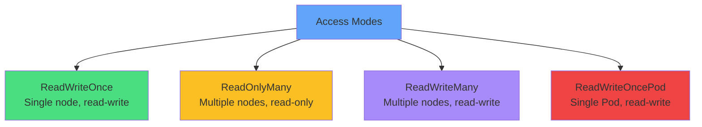

</div>

<div class="grid grid-cols-2 gap-4 mt-6 text-xs">
<!--
METADATA:
sentence: ReadWriteOnce (RWO) - Most Common: The volume can be mounted read-write by Pods on a single node. Multiple Pods on the same node CAN share the volume. Supported by most storage types: AWS EBS, Azure Disk, local volumes. Perfect for: Single-Pod deployments, databases, stateful applications.
search_anchor: ReadWriteOnce (RWO) - Most Common
-->
<div v-click="2">
<carbon-checkmark class="inline-block text-2xl text-green-400" /> <strong>RWO:</strong> Most common, single node (AWS EBS, Azure Disk)
</div>
<!--
METADATA:
sentence: ReadOnlyMany (ROX): The volume can be mounted read-only by Pods on multiple nodes. Useful for sharing configuration or static content. Requires storage that supports multi-node access.
search_anchor: ReadOnlyMany (ROX)
-->
<div v-click="3">
<carbon-view class="inline-block text-2xl text-yellow-400" /> <strong>ROX:</strong> Read-only sharing, multiple nodes
</div>
<!--
METADATA:
sentence: ReadWriteMany (RWX) - Requires Special Storage: The volume can be mounted read-write by Pods on multiple nodes. Requires network storage: NFS, CephFS, GlusterFS, or cloud-specific solutions. NOT supported by block storage like AWS EBS or Azure Disk.
search_anchor: ReadWriteMany (RWX) - Requires Special Storage
-->
<div v-click="4">
<carbon-network-3 class="inline-block text-2xl text-purple-400" /> <strong>RWX:</strong> Requires network storage (NFS, CephFS)
</div>
<!--
METADATA:
sentence: ReadWriteOncePod (RWOP): The volume can be mounted read-write by a single Pod (Kubernetes 1.22+)
search_anchor: ReadWriteOncePod (RWOP)
-->
<div v-click="5">
<carbon-rule class="inline-block text-2xl text-red-400" /> <strong>RWOP:</strong> Single Pod only (K8s 1.22+)
</div>
</div>

<!--
METADATA:
sentence: Common Pitfall: Requesting ReadWriteMany with a StorageClass that only supports ReadWriteOnce. Your PVC will remain in "Pending" state. Always check your StorageClass capabilities.
search_anchor: Common Pitfall: Requesting ReadWriteMany
-->
<div v-click="6" class="mt-6 text-center text-sm text-red-400">
<carbon-warning class="inline-block text-2xl" /> Common pitfall: RWX with RWO-only storage!
</div>

---
layout: center
---

# PersistentVolume (PV)

<!--
METADATA:
sentence: While PVCs represent the application's storage request, PersistentVolumes (PVs) represent the actual storage resources in the cluster.
search_anchor: actual storage resources in the cluster
-->
<div v-click="1">

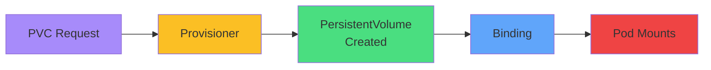

</div>

<!--
METADATA:
sentence: PersistentVolumes (PVs) represent the actual storage resources in the cluster.
search_anchor: actual storage resource in the cluster
-->
<div v-click="2" class="mt-8 text-center text-lg">
Actual storage resource in the cluster
</div>

<div class="grid grid-cols-2 gap-6 mt-6">
<!--
METADATA:
sentence: Dynamic Provisioning (most common): When you create a PVC, the StorageClass provisioner automatically creates a matching PV. This is seamless and requires no administrator intervention.
search_anchor: provisioner automatically creates
-->
<div v-click="3" class="text-center">
<carbon-settings class="text-4xl text-green-400 mb-2" />
<strong>Dynamic Provisioning</strong><br/>
<span class="text-sm opacity-80">Auto-created by provisioner</span>
</div>
<!--
METADATA:
sentence: Static Provisioning: Administrators can pre-create PVs manually. These PVs sit in the cluster waiting to be claimed.
search_anchor: Administrators can pre-create
-->
<div v-click="4" class="text-center">
<carbon-edit class="text-4xl text-blue-400 mb-2" />
<strong>Static Provisioning</strong><br/>
<span class="text-sm opacity-80">Pre-created by admin</span>
</div>
</div>

---
layout: center
---

# Binding Process

<!--
METADATA:
sentence: The Binding Process: Kubernetes matches PVCs to PVs based on: Storage size (PV must have at least the requested size). Access modes (must match). StorageClass (must match if specified). Selectors and labels (if specified).
search_anchor: Kubernetes matches PVCs to PVs
-->
<div v-click="1">

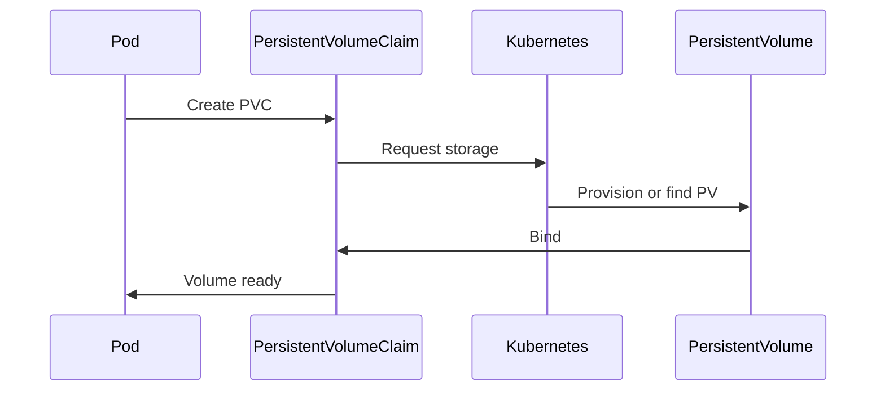

</div>

<!--
METADATA:
sentence: Kubernetes matches PVCs to PVs based on: Storage size (PV must have at least the requested size). Access modes (must match). StorageClass (must match if specified).
search_anchor: Kubernetes matches PVCs to PVs
-->
<div v-click="2" class="mt-6 text-center text-lg">
Kubernetes matches PVCs to PVs
</div>

<div class="grid grid-cols-3 gap-4 mt-6 text-xs">
<!--
METADATA:
sentence: Storage size (PV must have at least the requested size)
search_anchor: PV must have at least the requested size
-->
<div v-click="3">
<carbon-dashboard class="inline-block text-2xl text-blue-400" /> Size match
</div>
<!--
METADATA:
sentence: Access modes (must match)
search_anchor: Access modes (must match)
-->
<div v-click="4">
<carbon-network-3 class="inline-block text-2xl text-green-400" /> Access mode match
</div>
<!--
METADATA:
sentence: StorageClass (must match if specified)
search_anchor: StorageClass (must match if specified)
-->
<div v-click="5">
<carbon-tag class="inline-block text-2xl text-purple-400" /> StorageClass match
</div>
</div>

<!--
METADATA:
sentence: Once bound, the relationship between PVC and PV is exclusive—one PVC uses one PV, and that PV cannot be claimed by another PVC.
search_anchor: exclusive—one PVC uses one PV
-->
<div v-click="6" class="mt-6 text-center text-sm opacity-80">
One PVC → One PV (exclusive relationship)
</div>

---
layout: center
---

# Volume Lifecycle

<!--
METADATA:
sentence: Understanding the lifecycle of PersistentVolumes is crucial for managing stateful applications.
search_anchor: lifecycle of PersistentVolumes is crucial
-->
<div v-click="1">

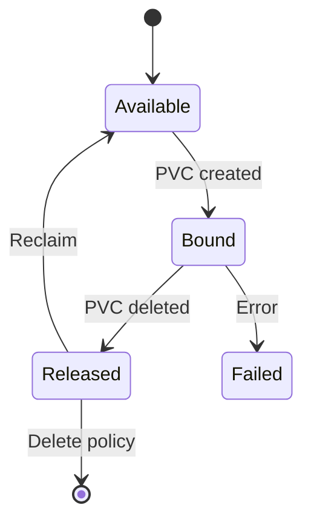

</div>

<div class="grid grid-cols-2 gap-4 mt-6 text-sm">
<!--
METADATA:
sentence: Available: The PV is free and not yet bound to a PVC. It's ready to be claimed.
search_anchor: PV is free and not yet bound
-->
<div v-click="2">
<carbon-checkmark class="inline-block text-2xl text-green-400" /> <strong>Available:</strong> Free, ready to claim
</div>
<!--
METADATA:
sentence: Bound: The PV is bound to a PVC. Storage is in use by an application.
search_anchor: bound to a PVC. Storage is in use
-->
<div v-click="3">
<carbon-locked class="inline-block text-2xl text-blue-400" /> <strong>Bound:</strong> In use by PVC
</div>
<!--
METADATA:
sentence: Released: The PVC has been deleted, but the PV hasn't been reclaimed yet. The data still exists, but the volume cannot be bound to a new claim without administrator intervention.
search_anchor: PVC has been deleted, but the PV hasn't been reclaimed
-->
<div v-click="4">
<carbon-unlocked class="inline-block text-2xl text-yellow-400" /> <strong>Released:</strong> PVC deleted, not reclaimed
</div>
<!--
METADATA:
sentence: Failed: The automatic reclamation process failed. Manual intervention is required.
search_anchor: automatic reclamation process failed
-->
<div v-click="5">
<carbon-close class="inline-block text-2xl text-red-400" /> <strong>Failed:</strong> Reclamation failed
</div>
</div>

---
layout: center
---

# Reclaim Policies

<!--
METADATA:
sentence: Reclaim Policies: When a PVC is deleted, what happens to the PV and its data?
search_anchor: what happens to the PV and its data
-->
<div v-click="1">

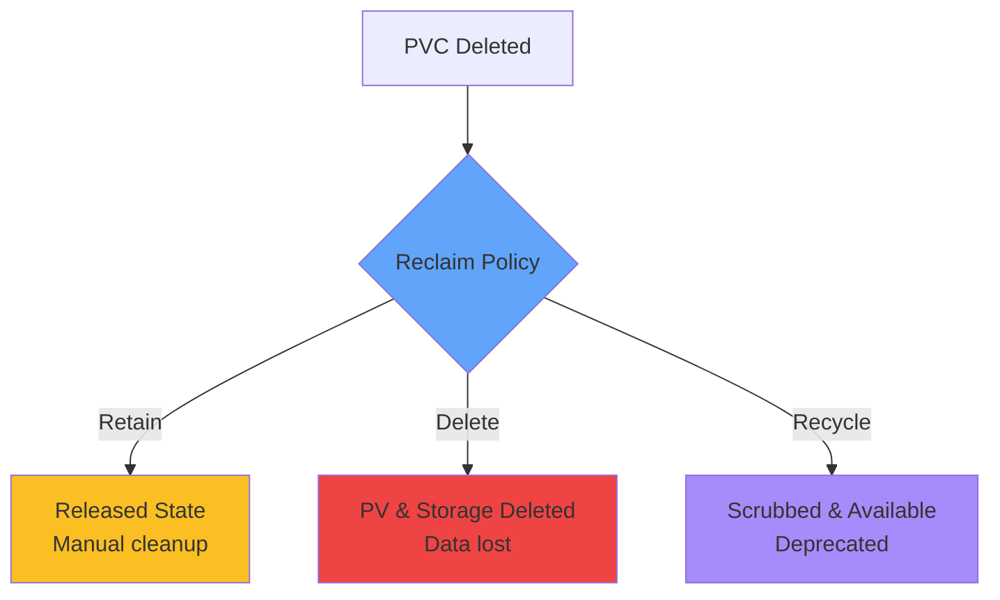

</div>

<div class="grid grid-cols-2 gap-6 mt-6">
<!--
METADATA:
sentence: Retain: The PV remains in "Released" state. Data is preserved. Administrator must manually handle cleanup.
search_anchor: Data is preserved
-->
<div v-click="2">
<carbon-save class="text-4xl text-yellow-400 mb-2" />
<strong>Retain</strong><br/>
<span class="text-sm opacity-80">Data preserved, manual cleanup</span>
</div>
<!--
METADATA:
sentence: Delete: The PV and underlying storage are automatically deleted. Data is lost.
search_anchor: automatically deleted. Data is lost
-->
<div v-click="3">
<carbon-close class="text-4xl text-red-400 mb-2" />
<strong>Delete</strong><br/>
<span class="text-sm opacity-80">Automatic deletion, data lost</span>
</div>
</div>

<!--
METADATA:
sentence: Production environments often use "Retain" for safety, giving administrators control over data deletion.
search_anchor: Production environments often use Retain
-->
<div v-click="4" class="mt-6 text-center text-sm opacity-80">
Production: Use Retain for safety
</div>

---
layout: center
---

# Complete Flow

<!--
METADATA:
sentence: Let's connect all the pieces with a complete example: The Flow: Administrator sets up StorageClasses (often done during cluster installation). Developer creates a PVC requesting 5Gi of storage with ReadWriteOnce access. Kubernetes (via the provisioner) creates a PV matching the PVC requirements. Kubernetes binds the PVC to the PV. Developer references the PVC in a Pod specification, mounting it at /data. Kubelet attaches the volume to the node and mounts it in the container. Application writes data to /data, which persists in the PV.
search_anchor: connect all the pieces
-->
<div v-click="1">

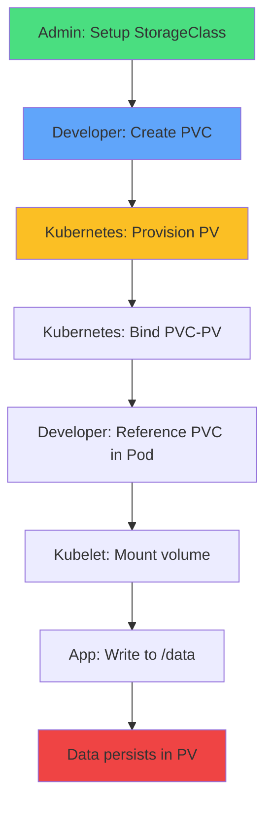

</div>

<!--
METADATA:
sentence: This abstraction means: Developers don't need to know about the underlying storage system. Applications remain portable across different Kubernetes clusters. Storage administration is centralized. The same application manifests work on different infrastructure.
search_anchor: Applications remain portable
-->
<div v-click="2" class="mt-6 text-center text-lg">
Abstraction enables portability and simplicity
</div>

---
layout: center
---

# Mounting PVCs in Pods

<!--
METADATA:
sentence: Developer references the PVC in a Pod specification, mounting it at /data
search_anchor: references the PVC in a Pod specification
-->
<div v-click="1" class="mb-4">

```yaml
apiVersion: v1
kind: Pod
metadata:
  name: app
spec:
  containers:
  - name: app
    image: nginx
    volumeMounts:
    - name: data
      mountPath: /data
  volumes:
  - name: data
    persistentVolumeClaim:
      claimName: data-claim
```

</div>

<!--
METADATA:
sentence: Once a PVC is created and bound to storage, you reference it in your Pod specification just like you reference ConfigMaps or Secrets. The PVC name becomes the link between your application and the underlying storage.
search_anchor: reference it in your Pod specification
-->
<div v-click="2" class="mt-6 text-center text-sm">
Reference PVC by name, mount at path
</div>

---
layout: center
---

# Summary

<!--
METADATA:
sentence: Before we conclude, let's review the key concepts:
search_anchor: review the key concepts
-->
<div v-click="1">

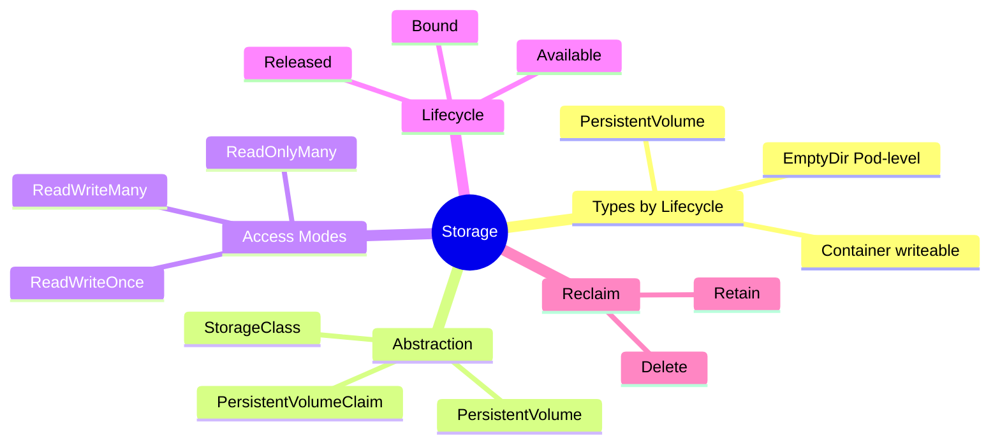

</div>

---
layout: center
---

# Key Takeaways

<div class="grid grid-cols-2 gap-6 mt-6">
<!--
METADATA:
sentence: Storage Types by Lifecycle: Container Writeable Layer: Lifetime of container (seconds to days). EmptyDir: Lifetime of Pod (minutes to weeks). PersistentVolume: Independent lifecycle (weeks to years).
search_anchor: Storage Types by Lifecycle
-->
<div v-click="1">
<carbon-data-volume class="text-4xl text-blue-400 mb-2" />
<strong>Storage types</strong><br/>
<span class="text-sm opacity-80">Container, EmptyDir, PersistentVolume</span>
</div>
<!--
METADATA:
sentence: Storage Abstraction Layers: StorageClass: Defines types of storage available in the cluster. PersistentVolume: Represents actual storage resources. PersistentVolumeClaim: Application's request for storage. Volume Mount: Pod specification linking PVC to container filesystem.
search_anchor: Storage Abstraction Layers
-->
<div v-click="2">
<carbon-settings class="text-4xl text-green-400 mb-2" />
<strong>Abstraction layers</strong><br/>
<span class="text-sm opacity-80">StorageClass, PV, PVC</span>
</div>
<!--
METADATA:
sentence: Critical Decision Factors: Data Importance: How critical is data preservation? Lifecycle Requirements: Must data survive Pod restarts? Deletions? Access Pattern: Single Pod? Multiple Pods? Multiple nodes?
search_anchor: Access Pattern: Single Pod? Multiple Pods?
-->
<div v-click="3">
<carbon-network-3 class="text-4xl text-purple-400 mb-2" />
<strong>Access modes</strong><br/>
<span class="text-sm opacity-80">RWO, ROX, RWX, RWOP</span>
</div>
<!--
METADATA:
sentence: Production environments often use "Retain" for safety, giving administrators control over data deletion.
search_anchor: Retain for safety
-->
<div v-click="4">
<carbon-rule class="text-4xl text-yellow-400 mb-2" />
<strong>Reclaim policies</strong><br/>
<span class="text-sm opacity-80">Retain (safe) vs Delete (auto)</span>
</div>
</div>

<!--
METADATA:
sentence: For CKAD Exam: Know how to create PVCs quickly. Understand access modes and when to use each. Practice mounting PVCs in Pods. Recognize common troubleshooting scenarios.
search_anchor: For CKAD Exam
-->
<div v-click="5" class="mt-8 text-center text-lg">
<carbon-education class="inline-block text-3xl text-blue-400" /> CKAD focus: Create PVCs, mount in Pods, troubleshoot!
</div>
