# Production Readiness

<div class="abs-br m-6 flex gap-2">
  <carbon-health-cross class="text-6xl text-blue-400" />
</div>

<!--
METADATA:
sentence: Making it production-ready requires additional configuration for reliability, security, and observability.
search_anchor: Making it production-ready
-->
<div v-click class="mt-8 text-xl opacity-80">
Making Kubernetes applications production-grade
</div>

---
layout: center
---

# The Production Gap

<!--
METADATA:
sentence: Basic Deployment - apiVersion apps/v1, kind Deployment, metadata name webapp, spec replicas 1, template spec containers - name app, image myapp:latest
search_anchor: Basic Deployment
-->
<div v-click="1">

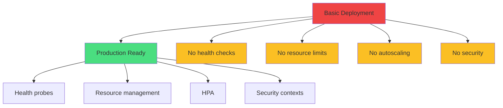

</div>

<div class="grid grid-cols-2 gap-6 mt-8">
<!--
METADATA:
sentence: Problems - No health checks, Kubernetes can't tell if app is healthy.
search_anchor: No health checks
-->
<div v-click="2">
<carbon-close class="inline-block text-3xl text-red-400" />
<strong>Basic:</strong> Works but fragile
</div>
<!--
METADATA:
sentence: Production-Ready Deployment - Health probes configured, Resource requests and limits set, HPA for automatic scaling, Security contexts applied, Multiple replicas for availability.
search_anchor: Production-Ready Deployment
-->
<div v-click="3">
<carbon-checkmark class="inline-block text-3xl text-green-400" />
<strong>Production:</strong> Reliable & secure
</div>
</div>

---
layout: center
---

# Health Probes Overview

<!--
METADATA:
sentence: Three Types of Probes.
search_anchor: Three Types of Probes
-->
<div v-click="1">

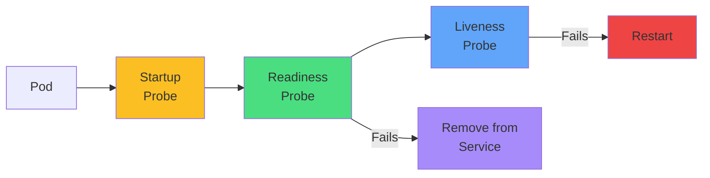

</div>

<div class="grid grid-cols-3 gap-4 mt-8 text-sm">
<!--
METADATA:
sentence: Startup Probe - Purpose, Has the app finished initializing? Action, Delay liveness/readiness checks until passing. Use case, Slow-starting applications (legacy apps, large data loads).
search_anchor: Startup Probe
-->
<div v-click="2" class="text-center">
<carbon-power class="text-5xl text-yellow-400 mb-2" />
<strong>Startup</strong><br/>
Slow initialization
</div>
<!--
METADATA:
sentence: Readiness Probe - Purpose, Is the app ready to receive traffic? Action, Remove from Service endpoints if failing. Use case, App is starting, loading data, or temporarily overloaded.
search_anchor: Readiness Probe - Purpose
-->
<div v-click="3" class="text-center">
<carbon-traffic-flow class="text-5xl text-green-400 mb-2" />
<strong>Readiness</strong><br/>
Ready for traffic
</div>
<!--
METADATA:
sentence: Liveness Probe - Purpose, Is the app alive and functioning? Action, Restart container if failing. Use case, App is deadlocked, hung, or in unrecoverable state.
search_anchor: Liveness Probe - Purpose
-->
<div v-click="4" class="text-center">
<carbon-activity class="text-5xl text-blue-400 mb-2" />
<strong>Liveness</strong><br/>
Healthy & running
</div>
</div>

---
layout: center
---

# Probe Mechanisms

<!--
METADATA:
sentence: Probe Mechanisms.
search_anchor: Probe Mechanisms
-->
<div v-click="1">

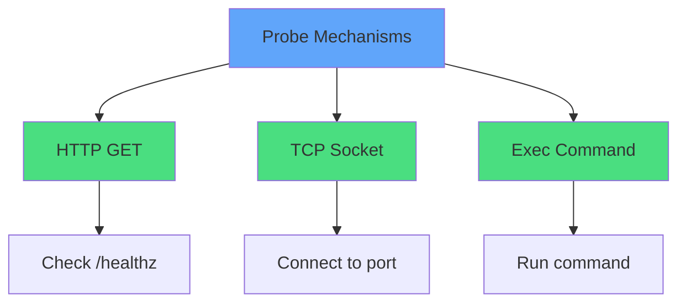

</div>

<div class="mt-8 text-sm">
<!--
METADATA:
sentence: HTTP GET (most common for web apps) - httpGet path /healthz, port 8080.
search_anchor: HTTP GET (most common
-->
<div v-click="2">

```yaml
# HTTP GET - most common
httpGet:
  path: /healthz
  port: 8080
```

</div>
<!--
METADATA:
sentence: TCP Socket (for non-HTTP apps) - tcpSocket port 5432.
search_anchor: TCP Socket (for non-HTTP apps)
-->
<div v-click="3">

```yaml
# TCP Socket - non-HTTP apps
tcpSocket:
  port: 5432
```

</div>
</div>

---
layout: center
---

# Readiness vs Liveness

<!--
METADATA:
sentence: Readiness vs. Liveness.
search_anchor: Readiness vs. Liveness
-->
<div v-click="1">

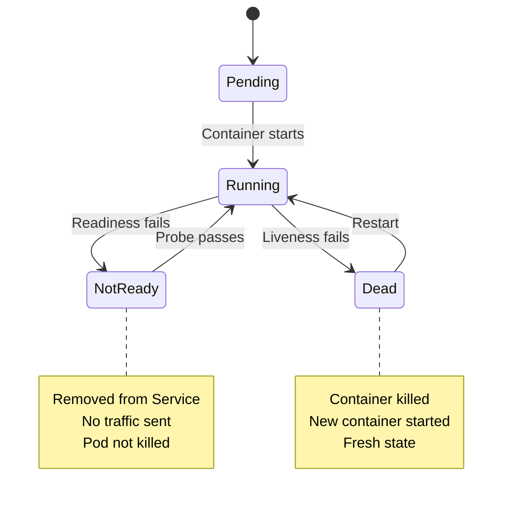

</div>

<div class="grid grid-cols-2 gap-6 mt-8">
<!--
METADATA:
sentence: Key Point - Readiness probe manages traffic routing, not pod lifecycle.
search_anchor: Readiness probe manages traffic routing
-->
<div v-click="2">
<carbon-network-3 class="text-4xl text-green-400 mb-2" />
<strong>Readiness:</strong> Traffic routing
</div>
<!--
METADATA:
sentence: Key Point - Liveness probe triggers restarts, so be careful with configuration!
search_anchor: Liveness probe triggers restarts
-->
<div v-click="3">
<carbon-restart class="text-4xl text-blue-400 mb-2" />
<strong>Liveness:</strong> Container lifecycle
</div>
</div>

---
layout: center
---

# Probe Configuration

<!--
METADATA:
sentence: Timing Parameters - livenessProbe httpGet path /healthz port 8080, initialDelaySeconds 30 (Wait before first check), periodSeconds 10 (How often to check), timeoutSeconds 5 (Request timeout), successThreshold 1 (Consecutive successes to be healthy), failureThreshold 3 (Consecutive failures before action).
search_anchor: Timing Parameters
-->
<div v-click="1" class="mb-4">

```yaml
livenessProbe:
  httpGet:
    path: /healthz
    port: 8080
  initialDelaySeconds: 30   # Wait before first check
  periodSeconds: 10         # How often to check
  timeoutSeconds: 5         # Request timeout
  failureThreshold: 3       # Failures before action
  successThreshold: 1       # Successes to be healthy
```

</div>

<!--
METADATA:
sentence: Configuration Guidelines - initialDelaySeconds, Too short, False positives during startup. Too long, Slow to detect issues. Guideline, Estimate app startup time plus buffer.
search_anchor: Configuration Guidelines
-->
<div v-click="2">

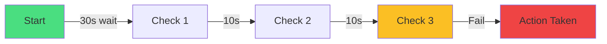

</div>

<!--
METADATA:
sentence: Common Pattern - Readiness, Quick checks, low threshold (fast traffic removal). Liveness, Slower checks, higher threshold (avoid unnecessary restarts).
search_anchor: avoid unnecessary restarts
-->
<div v-click="3" class="mt-6 text-center text-yellow-400">
<carbon-warning class="inline-block text-2xl" /> Configure carefully to avoid false positives!
</div>

---
layout: center
---

# Resource Management

<!--
METADATA:
sentence: Why Resource Management Matters - Without resource limits, One pod can consume all cluster resources, Noisy neighbor problems, Cluster instability, Unpredictable performance.
search_anchor: Why Resource Management Matters
-->
<div v-click="1">

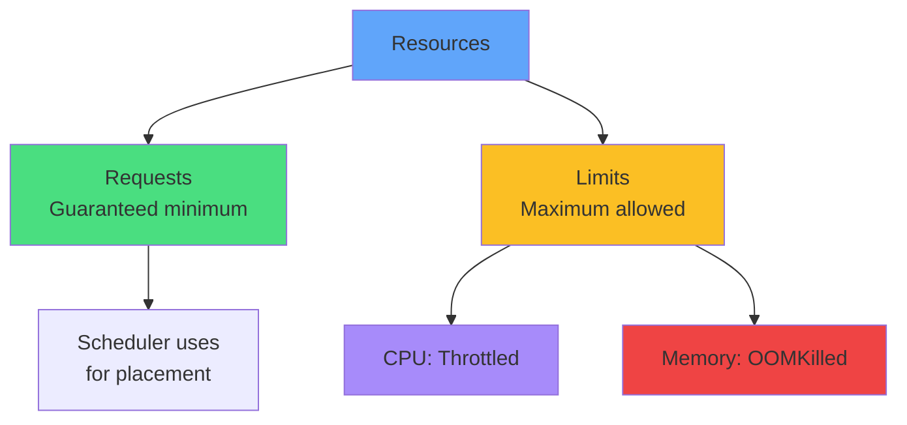

</div>

<!--
METADATA:
sentence: Requests vs. Limits - resources requests cpu 100m (Guaranteed minimum) memory 128Mi, limits cpu 500m (Maximum allowed) memory 256Mi.
search_anchor: Requests vs. Limits
-->
<div v-click="2" class="mt-6">

```yaml
resources:
  requests:
    cpu: 100m        # Guaranteed
    memory: 128Mi
  limits:
    cpu: 500m        # Maximum
    memory: 256Mi
```

</div>

---
layout: center
---

# Quality of Service Classes

<!--
METADATA:
sentence: Quality of Service (QoS) Classes.
search_anchor: Quality of Service (QoS) Classes
-->
<div v-click="1">

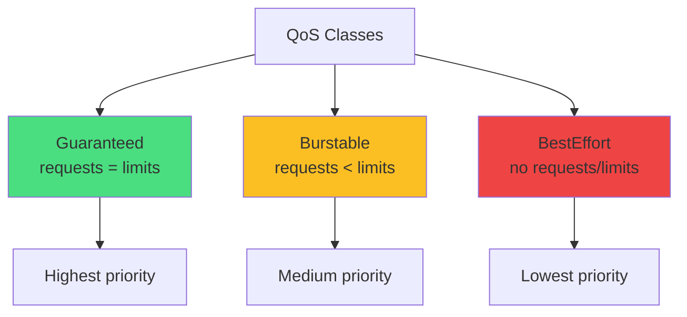

</div>

<div class="grid grid-cols-3 gap-4 mt-8 text-sm">
<!--
METADATA:
sentence: Guaranteed (requests equals limits) - Highest priority, Last to be evicted, Use for critical workloads.
search_anchor: Guaranteed (requests = limits)
-->
<div v-click="2" class="text-center">
<carbon-trophy class="text-5xl text-green-400 mb-2" />
<strong>Guaranteed</strong><br/>
Last to evict
</div>
<!--
METADATA:
sentence: Burstable (requests less than limits) - Medium priority, Can use more when available, Use for most applications.
search_anchor: Burstable (requests < limits)
-->
<div v-click="3" class="text-center">
<carbon-arrow-up-right class="text-5xl text-yellow-400 mb-2" />
<strong>Burstable</strong><br/>
Can use extra
</div>
<!--
METADATA:
sentence: BestEffort (no requests/limits) - Lowest priority, First to be evicted, Use for non-critical jobs only.
search_anchor: BestEffort (no requests/limits)
-->
<div v-click="4" class="text-center">
<carbon-help class="text-5xl text-red-400 mb-2" />
<strong>BestEffort</strong><br/>
First to evict
</div>
</div>

---
layout: center
---

# Horizontal Pod Autoscaler

<!--
METADATA:
sentence: What is HPA? HPA automatically scales pods based on metrics - CPU utilization (most common), Memory utilization, Custom metrics (requests per second, queue depth, etc.).
search_anchor: HPA automatically scales pods
-->
<div v-click="1">

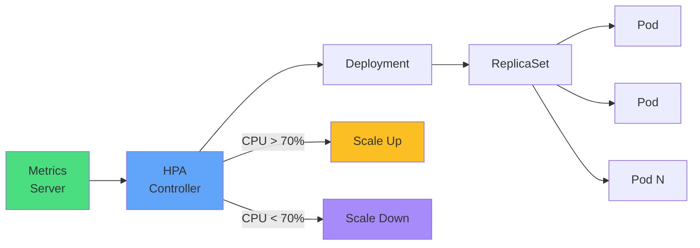

</div>

<!--
METADATA:
sentence: Basic HPA Configuration - apiVersion autoscaling/v2, kind HorizontalPodAutoscaler, metadata name webapp-hpa, spec scaleTargetRef apiVersion apps/v1 kind Deployment name webapp, minReplicas 2, maxReplicas 10, metrics type Resource, resource name cpu, target type Utilization averageUtilization 70.
search_anchor: Basic HPA Configuration
-->
<div v-click="2" class="mt-6">

```yaml
apiVersion: autoscaling/v2
kind: HorizontalPodAutoscaler
spec:
  minReplicas: 2
  maxReplicas: 10
  metrics:
  - type: Resource
    resource:
      name: cpu
      target:
        averageUtilization: 70
```

</div>

---
layout: center
---

# HPA Requirements

<div class="grid grid-cols-2 gap-6 mt-8">
<!--
METADATA:
sentence: Prerequisites - 1. Metrics Server must be installed, 2. Pods must have resource requests, 3. Target must be scalable (Deployment, ReplicaSet, StatefulSet).
search_anchor: Prerequisites
-->
<div v-click="1">
<carbon-checkmark class="text-5xl text-green-400 mb-2" />
<strong>Prerequisites</strong><br/>
<div class="text-sm opacity-80 mt-2">
• Metrics Server installed<br/>
• Resource requests set<br/>
• Scalable target
</div>
</div>
<!--
METADATA:
sentence: Limitations - Can't scale below minReplicas (even at 0% CPU), Default cooldown periods prevent thrashing, Based on average across all pods.
search_anchor: Limitations
-->
<div v-click="2">
<carbon-warning class="text-5xl text-yellow-400 mb-2" />
<strong>Limitations</strong><br/>
<div class="text-sm opacity-80 mt-2">
• Can't scale below min<br/>
• Cooldown periods<br/>
• Average across pods
</div>
</div>
</div>

<!--
METADATA:
sentence: Behavior - Load increases, CPU greater than 70%, Scale up, Load decreases, CPU less than 70%, Scale down, Min 2 pods (high availability), Max 10 pods (cost control).
search_anchor: Load increases
-->
<div v-click="3" class="mt-8">

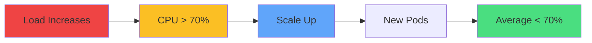

</div>

---
layout: center
---

# Security Contexts

<!--
METADATA:
sentence: Pod and Container Security - Default Kubernetes behavior, Containers often run as root, Full Linux capabilities, Read-write filesystem, Service account token mounted.
search_anchor: Pod and Container Security
-->
<div v-click="1">

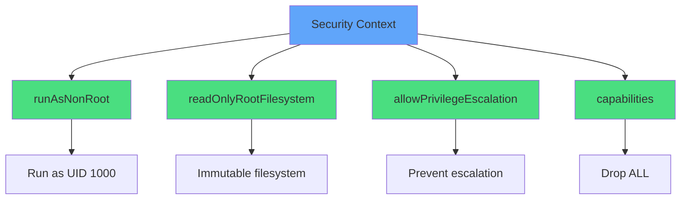

</div>

<!--
METADATA:
sentence: Security Best Practices - spec securityContext (Pod-level security) runAsNonRoot true, runAsUser 1000, runAsGroup 1000, fsGroup 1000, automountServiceAccountToken false (Don't mount SA token unless needed), containers - name app securityContext (Container-level security) allowPrivilegeEscalation false, readOnlyRootFilesystem true, capabilities drop ALL.
search_anchor: Security Best Practices
-->
<div v-click="2" class="mt-6 text-sm">

```yaml
securityContext:
  runAsNonRoot: true
  runAsUser: 1000
  readOnlyRootFilesystem: true
  allowPrivilegeEscalation: false
  capabilities:
    drop: ["ALL"]
```

</div>

---
layout: center
---

# Security Best Practices

<div class="grid grid-cols-2 gap-6 mt-4">
<!--
METADATA:
sentence: Key Practices - 1. Run as non-root user.
search_anchor: Run as non-root user
-->
<div v-click="1">
<carbon-user class="text-5xl text-blue-400 mb-2" />
<strong>Run as non-root</strong><br/>
<span class="text-sm opacity-80">Never run as UID 0</span>
</div>
<!--
METADATA:
sentence: 3. Read-only root filesystem (plus emptyDir for writable paths).
search_anchor: Read-only root filesystem
-->
<div v-click="2">
<carbon-locked class="text-5xl text-green-400 mb-2" />
<strong>Read-only filesystem</strong><br/>
<span class="text-sm opacity-80">Use emptyDir for writes</span>
</div>
<!--
METADATA:
sentence: 2. Drop all capabilities.
search_anchor: Drop all capabilities
-->
<div v-click="3">
<carbon-rule class="text-5xl text-purple-400 mb-2" />
<strong>Drop capabilities</strong><br/>
<span class="text-sm opacity-80">Start with drop: ["ALL"]</span>
</div>
<!--
METADATA:
sentence: 4. Disable privilege escalation.
search_anchor: Disable privilege escalation
-->
<div v-click="4">
<carbon-security class="text-5xl text-yellow-400 mb-2" />
<strong>Prevent escalation</strong><br/>
<span class="text-sm opacity-80">allowPrivilegeEscalation: false</span>
</div>
</div>

<!--
METADATA:
sentence: 5. Disable SA token auto-mount.
search_anchor: Principle of least privilege
-->
<div v-click="5" class="mt-8 text-center text-lg">
<carbon-shield-security class="inline-block text-3xl text-blue-400" /> Principle of least privilege
</div>

---
layout: center
---

# Production Checklist

<div class="grid grid-cols-2 gap-4 text-sm">
<!--
METADATA:
sentence: Health & Reliability - Readiness probe configured.
search_anchor: Readiness probe configured
-->
<div v-click="1">
<carbon-checkmark class="inline-block text-2xl text-green-400" /> Readiness probe configured
</div>
<!--
METADATA:
sentence: Liveness probe configured (carefully!).
search_anchor: Liveness probe configured
-->
<div v-click="2">
<carbon-checkmark class="inline-block text-2xl text-green-400" /> Liveness probe configured
</div>
<!--
METADATA:
sentence: Resource Management - Resource requests set.
search_anchor: Resource requests set
-->
<div v-click="3">
<carbon-checkmark class="inline-block text-2xl text-green-400" /> Resource requests set
</div>
<!--
METADATA:
sentence: Resource limits set.
search_anchor: Resource limits set
-->
<div v-click="4">
<carbon-checkmark class="inline-block text-2xl text-green-400" /> Resource limits set
</div>
<!--
METADATA:
sentence: HPA configured for variable load.
search_anchor: HPA configured
-->
<div v-click="5">
<carbon-checkmark class="inline-block text-2xl text-green-400" /> HPA configured
</div>
<!--
METADATA:
sentence: Multiple replicas (minimum 2).
search_anchor: Multiple replicas
-->
<div v-click="6">
<carbon-checkmark class="inline-block text-2xl text-green-400" /> Multiple replicas (min 2)
</div>
<!--
METADATA:
sentence: Security - Run as non-root user.
search_anchor: Security: Run as non-root
-->
<div v-click="7">
<carbon-checkmark class="inline-block text-2xl text-green-400" /> Run as non-root
</div>
<!--
METADATA:
sentence: Security context configured.
search_anchor: Security context configured
-->
<div v-click="8">
<carbon-checkmark class="inline-block text-2xl text-green-400" /> Security context applied
</div>
<!--
METADATA:
sentence: Observability - Logging configured.
search_anchor: Logging configured
-->
<div v-click="9">
<carbon-checkmark class="inline-block text-2xl text-green-400" /> Logging configured
</div>
<!--
METADATA:
sentence: Graceful shutdown handling.
search_anchor: Graceful shutdown
-->
<div v-click="10">
<carbon-checkmark class="inline-block text-2xl text-green-400" /> Graceful shutdown
</div>
</div>

---
layout: center
---

# Common Anti-Patterns

<div class="grid grid-cols-2 gap-6 mt-6">
<!--
METADATA:
sentence: No health probes - Kubernetes can't tell if app is healthy, Broken pods keep receiving traffic, Manual intervention required.
search_anchor: No health probes
-->
<div v-click="1">
<carbon-close class="text-5xl text-red-400 mb-2" />
<strong>No health probes</strong><br/>
<span class="text-sm opacity-80">Can't detect failures</span>
</div>
<!--
METADATA:
sentence: Aggressive liveness probes - False positives cause restart loops, Transient errors trigger restarts, App never stabilizes.
search_anchor: Aggressive liveness probes
-->
<div v-click="2">
<carbon-close class="text-5xl text-red-400 mb-2" />
<strong>Aggressive liveness</strong><br/>
<span class="text-sm opacity-80">Restart loops</span>
</div>
<!--
METADATA:
sentence: No resource limits - One pod can starve others, Cluster instability, Unpredictable performance.
search_anchor: No resource limits
-->
<div v-click="3">
<carbon-close class="text-5xl text-red-400 mb-2" />
<strong>No resource limits</strong><br/>
<span class="text-sm opacity-80">Noisy neighbors</span>
</div>
<!--
METADATA:
sentence: Running as root - Security risk, Privilege escalation possible, Best practices violation.
search_anchor: Running as root
-->
<div v-click="4">
<carbon-close class="text-5xl text-red-400 mb-2" />
<strong>Running as root</strong><br/>
<span class="text-sm opacity-80">Security risk</span>
</div>
<!--
METADATA:
sentence: Single replica - No high availability, Zero-downtime updates impossible, Single point of failure.
search_anchor: Single replica
-->
<div v-click="5">
<carbon-close class="text-5xl text-red-400 mb-2" />
<strong>Single replica</strong><br/>
<span class="text-sm opacity-80">No high availability</span>
</div>
<!--
METADATA:
sentence: Testing - Health endpoints tested, Resource limits tested (stress testing), HPA tested under load, Failure scenarios tested (kill pods, network issues).
search_anchor: No monitoring
-->
<div v-click="6">
<carbon-close class="text-5xl text-red-400 mb-2" />
<strong>No monitoring</strong><br/>
<span class="text-sm opacity-80">Blind to issues</span>
</div>
</div>

---
layout: center
---

# CKAD Exam Focus

<!--
METADATA:
sentence: CKAD Exam Relevance - What You Must Know.
search_anchor: What You Must Know
-->
<div v-click="1" class="text-center mb-6">
<carbon-certificate class="inline-block text-6xl text-blue-400" />
</div>

<div class="grid grid-cols-2 gap-4 text-sm">
<!--
METADATA:
sentence: Health Probes (Critical) - Configure readiness, liveness, startup probes, Choose appropriate probe mechanism, Set correct timing parameters, Understand the difference between probe types.
search_anchor: Configure readiness, liveness, startup probes
-->
<div v-click="2">
<carbon-health-cross class="inline-block text-2xl text-green-400" /> Configure all probe types
</div>
<!--
METADATA:
sentence: Resources (Critical) - Set requests and limits, Understand QoS classes, Calculate appropriate values, Troubleshoot OOMKilled pods.
search_anchor: Set requests and limits
-->
<div v-click="3">
<carbon-dashboard class="inline-block text-2xl text-green-400" /> Set requests and limits
</div>
<!--
METADATA:
sentence: HPA (Important) - Create basic HPA, Configure CPU/memory targets, Set min/max replicas, Troubleshoot HPA issues.
search_anchor: Create basic HPA
-->
<div v-click="4">
<carbon-rule class="inline-block text-2xl text-green-400" /> Create HPA
</div>
<!--
METADATA:
sentence: Security (Important) - Configure security contexts, Run as non-root, Set capabilities, Understand security implications.
search_anchor: Configure security contexts
-->
<div v-click="5">
<carbon-security class="inline-block text-2xl text-green-400" /> Apply security contexts
</div>
<!--
METADATA:
sentence: Troubleshoot OOMKilled pods.
search_anchor: Troubleshoot OOMKilled
-->
<div v-click="6">
<carbon-debug class="inline-block text-2xl text-green-400" /> Troubleshoot OOMKilled
</div>
<!--
METADATA:
sentence: Practice troubleshooting (OOMKilled, CrashLoopBackOff).
search_anchor: CrashLoopBackOff
-->
<div v-click="7">
<carbon-debug class="inline-block text-2xl text-green-400" /> Debug CrashLoopBackOff
</div>
</div>

<!--
METADATA:
sentence: CKAD Success Formula - Master probe configuration (all three types), Understand resource management (requests vs. limits), Know how to create HPA, Configure basic security contexts, Practice troubleshooting (OOMKilled, CrashLoopBackOff).
search_anchor: Practice for speed
-->
<div v-click="8" class="mt-8 text-center text-lg">
<carbon-timer class="inline-block text-3xl text-red-400" /> Practice for speed!
</div>

---
layout: center
---

# Summary

<!--
METADATA:
sentence: Key Takeaways - Essential Concepts.
search_anchor: Essential Concepts
-->
<div v-click="1">

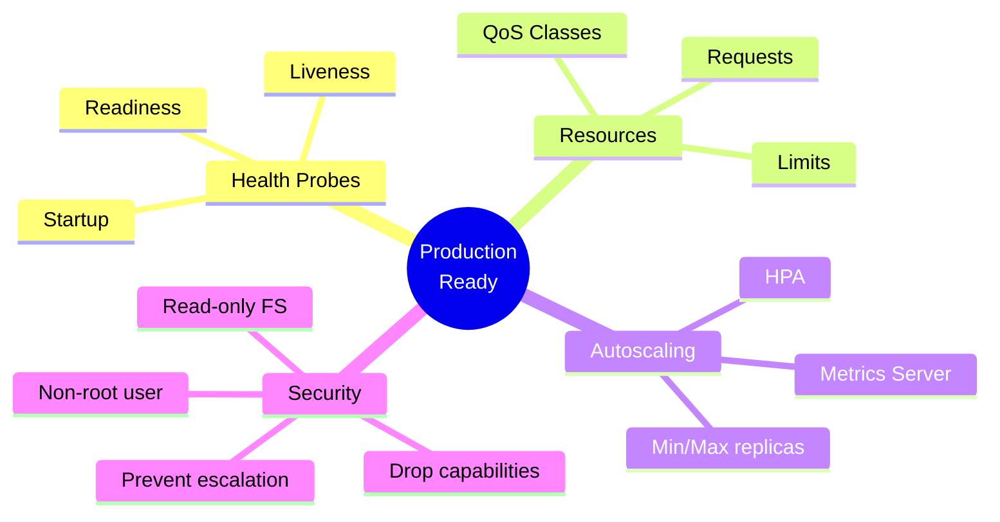

</div>

---
layout: center
---

# Key Takeaways

<div class="grid grid-cols-2 gap-6 mt-6">
<!--
METADATA:
sentence: Production Mindset - Health checks are not optional.
search_anchor: Health checks are not optional
-->
<div v-click="1">
<carbon-health-cross class="text-4xl text-blue-400 mb-2" />
<strong>Health probes</strong><br/>
<span class="text-sm opacity-80">Essential for reliability</span>
</div>
<!--
METADATA:
sentence: Resource limits protect the cluster.
search_anchor: Resource limits protect the cluster
-->
<div v-click="2">
<carbon-dashboard class="text-4xl text-green-400 mb-2" />
<strong>Resource management</strong><br/>
<span class="text-sm opacity-80">Protect the cluster</span>
</div>
<!--
METADATA:
sentence: 6. HPA - Automatic scaling based on metrics.
search_anchor: Automatic scaling based on metrics
-->
<div v-click="3">
<carbon-rule class="text-4xl text-purple-400 mb-2" />
<strong>Autoscaling</strong><br/>
<span class="text-sm opacity-80">Handle variable load</span>
</div>
<!--
METADATA:
sentence: Security contexts reduce risk.
search_anchor: Security contexts reduce risk
-->
<div v-click="4">
<carbon-security class="text-4xl text-yellow-400 mb-2" />
<strong>Security contexts</strong><br/>
<span class="text-sm opacity-80">Reduce attack surface</span>
</div>
</div>

<!--
METADATA:
sentence: Remember - Production readiness is about reliability, security, and observability—not just "making it work"!
search_anchor: reliability, security, and observability
-->
<div v-click="5" class="mt-8 text-center text-xl">
Production readiness is about reliability, security, and observability
</div>

---
layout: center
---

# Next Steps

<!--
METADATA:
sentence: Total Time - 12-15 minutes. Next - Hands-on configuration of production-ready applications.
search_anchor: Hands-on configuration
-->
<div v-click="1" class="text-center mb-8">
<carbon-education class="inline-block text-6xl text-blue-400" />
</div>

<!--
METADATA:
sentence: Flow - Metrics Server, HPA, Deployment, ReplicaSet, Pods.
search_anchor: Concepts to hands-on
-->
<div v-click="2">

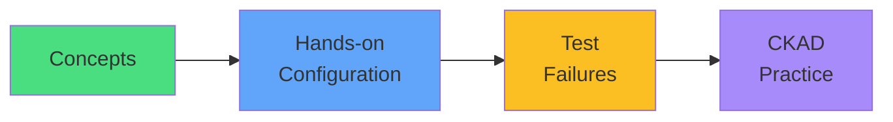

</div>

<!--
METADATA:
sentence: Next - Hands-on configuration of production-ready applications.
search_anchor: configure production-ready apps
-->
<div v-click="3" class="mt-8 text-center text-xl">
Let's configure production-ready apps! <carbon-arrow-right class="inline-block text-2xl" />
</div>
