# Role-Based Access Control

<div class="abs-br m-6 flex gap-2">
  <carbon-locked class="text-6xl text-blue-400" />
</div>

<!--
METADATA:
sentence: In this presentation, we'll explore how Kubernetes implements fine-grained security to control who can do what within your cluster.
search_anchor: fine-grained security
-->
<div v-click class="mt-8 text-xl opacity-80">
Fine-grained security for Kubernetes resources
</div>

---
layout: center
---

# What is RBAC?

<!--
METADATA:
sentence: Kubernetes RBAC is a security framework that controls access to cluster resources. It answers two fundamental questions:
search_anchor: security framework that controls access
-->
<div v-click="1">

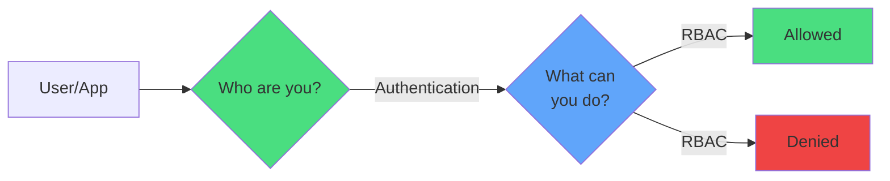

</div>

<div class="grid grid-cols-2 gap-6 mt-8">
<!--
METADATA:
sentence: First: "Who are you?" - This is authentication, handled by ServiceAccounts for applications or external identity providers for users.
search_anchor: Who are you?
-->
<div v-click="2">
<carbon-user-identification class="text-5xl text-green-400 mb-2" />
<strong>Authentication</strong><br/>
<span class="text-sm opacity-80">Who are you?</span>
</div>
<!--
METADATA:
sentence: Second: "What can you do?" - This is authorization, controlled by RBAC rules.
search_anchor: What can you do?
-->
<div v-click="3">
<carbon-locked class="text-5xl text-blue-400 mb-2" />
<strong>Authorization</strong><br/>
<span class="text-sm opacity-80">What can you do?</span>
</div>
</div>

<!--
METADATA:
sentence: By default, Kubernetes follows the principle of least privilege - all users and applications start with no permissions. You must explicitly grant access to resources. This "deny by default" approach is a security best practice that prevents accidental exposure of sensitive cluster operations.
search_anchor: deny by default
-->
<div v-click="4" class="mt-8 text-center text-lg">
<carbon-security class="inline-block text-3xl text-yellow-400" /> Deny by default - least privilege
</div>

---
layout: center
---

# The Two Parts of RBAC

<!--
METADATA:
sentence: RBAC in Kubernetes has an elegant two-part design that separates what permissions exist from who has those permissions.
search_anchor: two-part design
-->
<div v-click="1">

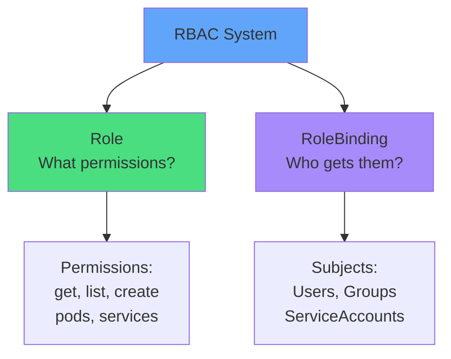

</div>

<div class="grid grid-cols-2 gap-8 mt-8">
<!--
METADATA:
sentence: The first part is the Role - this defines what actions can be performed on which resources. Think of it as a job description that lists specific capabilities, like "can read Pods" or "can create Deployments."
search_anchor: job description
-->
<div v-click="2" class="text-center">
<carbon-document class="text-5xl text-green-400 mb-2" />
<strong>Role</strong><br/>
<span class="text-sm opacity-80">Job description</span>
</div>
<!--
METADATA:
sentence: The second part is the RoleBinding - this connects a Role to a subject, which could be a user, a group, or a ServiceAccount. Think of this as the assignment that says "this person gets this job."
search_anchor: assignment
-->
<div v-click="3" class="text-center">
<carbon-connect class="text-5xl text-purple-400 mb-2" />
<strong>RoleBinding</strong><br/>
<span class="text-sm opacity-80">Assignment</span>
</div>
</div>

---
layout: center
---

# Roles - Defining Permissions

<!--
METADATA:
sentence: Let's dive deeper into Roles. A Role contains one or more rules that define permissions for specific resources within a namespace.
search_anchor: dive deeper into Roles
-->
<div v-click="1">

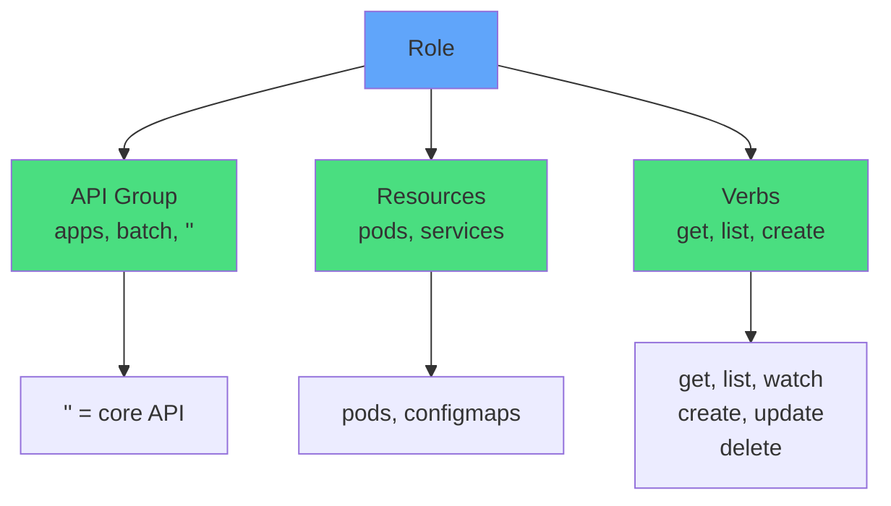

</div>

<!--
METADATA:
sentence: Here's a concrete example. This Role is named "pod-viewer" and it grants permission to get and list Pods in the default namespace.
search_anchor: concrete example
-->
<div v-click="2" class="mt-6 text-sm">

```yaml
apiVersion: rbac.authorization.k8s.io/v1
kind: Role
metadata:
  name: pod-viewer
rules:
- apiGroups: [""]
  resources: ["pods"]
  verbs: ["get", "list"]
```

</div>

---
layout: center
---

# Common Verbs

<div class="grid grid-cols-3 gap-4 mt-8 text-sm">
<!--
METADATA:
sentence: And the Verbs - these are the actions allowed on those resources. Common verbs include get, list, watch for reading; create for new objects; update and patch for modifications; and delete for removal.
search_anchor: Common verbs include get
-->
<div v-click="1" class="text-center">
<carbon-view class="text-4xl text-blue-400 mb-2" />
<strong>get</strong><br/>
Read single resource
</div>
<!--
METADATA:
sentence: And the Verbs - these are the actions allowed on those resources. Common verbs include get, list, watch for reading; create for new objects; update and patch for modifications; and delete for removal.
search_anchor: list, watch for reading
-->
<div v-click="2" class="text-center">
<carbon-list class="text-4xl text-blue-400 mb-2" />
<strong>list</strong><br/>
Read all resources
</div>
<!--
METADATA:
sentence: And the Verbs - these are the actions allowed on those resources. Common verbs include get, list, watch for reading; create for new objects; update and patch for modifications; and delete for removal.
search_anchor: watch for reading
-->
<div v-click="3" class="text-center">
<carbon-view class="text-4xl text-blue-400 mb-2" />
<strong>watch</strong><br/>
Stream changes
</div>
<!--
METADATA:
sentence: And the Verbs - these are the actions allowed on those resources. Common verbs include get, list, watch for reading; create for new objects; update and patch for modifications; and delete for removal.
search_anchor: create for new objects
-->
<div v-click="4" class="text-center">
<carbon-add class="text-4xl text-green-400 mb-2" />
<strong>create</strong><br/>
Create new resources
</div>
<!--
METADATA:
sentence: And the Verbs - these are the actions allowed on those resources. Common verbs include get, list, watch for reading; create for new objects; update and patch for modifications; and delete for removal.
search_anchor: update and patch for modifications
-->
<div v-click="5" class="text-center">
<carbon-edit class="text-4xl text-yellow-400 mb-2" />
<strong>update</strong><br/>
Modify existing
</div>
<!--
METADATA:
sentence: And the Verbs - these are the actions allowed on those resources. Common verbs include get, list, watch for reading; create for new objects; update and patch for modifications; and delete for removal.
search_anchor: patch for modifications
-->
<div v-click="6" class="text-center">
<carbon-edit class="text-4xl text-yellow-400 mb-2" />
<strong>patch</strong><br/>
Partial updates
</div>
<!--
METADATA:
sentence: And the Verbs - these are the actions allowed on those resources. Common verbs include get, list, watch for reading; create for new objects; update and patch for modifications; and delete for removal.
search_anchor: delete for removal
-->
<div v-click="7" class="text-center">
<carbon-trash-can class="text-4xl text-red-400 mb-2" />
<strong>delete</strong><br/>
Remove resources
</div>
<!--
METADATA:
sentence: Each rule has three key components:
search_anchor: deletecollection bulk delete
-->
<div v-click="8" class="text-center">
<carbon-trash-can class="text-4xl text-red-400 mb-2" />
<strong>deletecollection</strong><br/>
Bulk delete
</div>
<!--
METADATA:
sentence: Each rule has three key components:
search_anchor: all verbs wildcard
-->
<div v-click="9" class="text-center">
<carbon-security class="text-4xl text-purple-400 mb-2" />
<strong>*</strong><br/>
All verbs
</div>
</div>

---
layout: center
---

# RoleBindings - Granting Permissions

<!--
METADATA:
sentence: Once you have a Role defined, you need a RoleBinding to apply those permissions to a subject.
search_anchor: need a RoleBinding
-->
<div v-click="1">

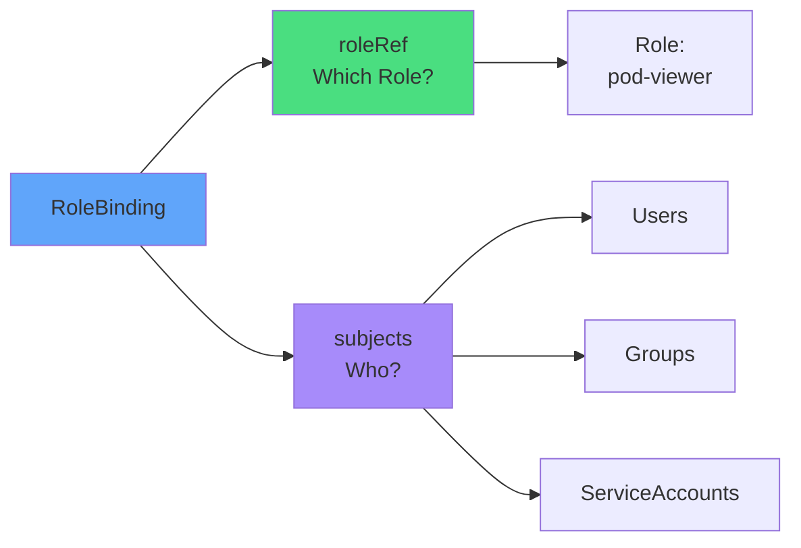

</div>

<!--
METADATA:
sentence: The roleRef section references the Role we want to apply - it specifies the kind as "Role" and the name matches our Role definition.
search_anchor: roleRef section
-->
<div v-click="2" class="mt-6 text-sm">

```yaml
apiVersion: rbac.authorization.k8s.io/v1
kind: RoleBinding
metadata:
  name: viewer-binding
roleRef:
  kind: Role
  name: pod-viewer
subjects:
- kind: User
  name: student@courselabs.co
```

</div>

---
layout: center
---

# ServiceAccounts - App Identity

<!--
METADATA:
sentence: ServiceAccounts are particularly important for the CKAD exam because they provide identity for Pods that need to interact with the Kubernetes API.
search_anchor: provide identity for Pods
-->
<div v-click="1">

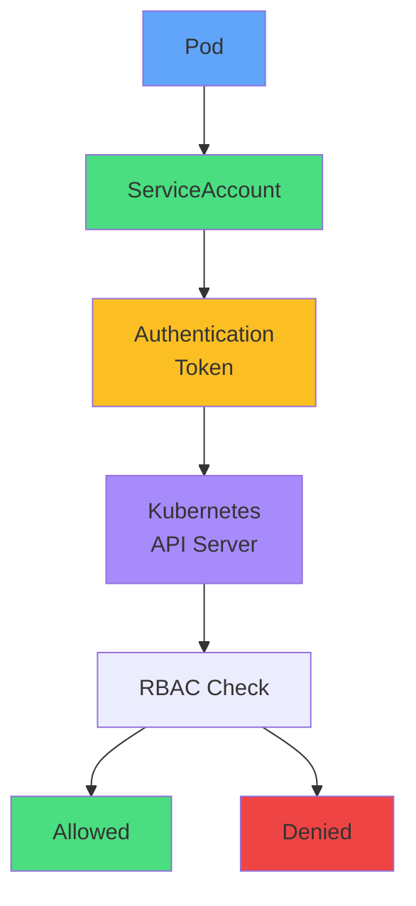

</div>

<div class="grid grid-cols-2 gap-6 mt-8">
<!--
METADATA:
sentence: When you create a ServiceAccount, Kubernetes automatically generates an authentication token.
search_anchor: automatically generates an authentication token
-->
<div v-click="2">
<carbon-user class="text-4xl text-green-400 mb-2" />
<strong>Identity for Pods</strong><br/>
<span class="text-sm opacity-80">Apps accessing API</span>
</div>
<!--
METADATA:
sentence: This token is mounted into any Pod that uses that ServiceAccount, typically at the path /var/run/secrets/kubernetes.io/serviceaccount/token.
search_anchor: token is mounted into any Pod
-->
<div v-click="3">
<carbon-locked class="text-4xl text-blue-400 mb-2" />
<strong>Auto-generated token</strong><br/>
<span class="text-sm opacity-80">Mounted in Pod</span>
</div>
</div>

---
layout: center
---

# ServiceAccount Best Practices

<div class="grid grid-cols-2 gap-6 mt-6">
<!--
METADATA:
sentence: Best practice: create a dedicated ServiceAccount for each application with only the permissions that application needs.
search_anchor: dedicated ServiceAccount for each application
-->
<div v-click="1">
<carbon-checkmark class="text-5xl text-green-400 mb-2" />
<strong>Dedicated per app</strong><br/>
<span class="text-sm opacity-80">One SA per application</span>
</div>
<!--
METADATA:
sentence: Best practice: create a dedicated ServiceAccount for each application with only the permissions that application needs.
search_anchor: only the permissions that application needs
-->
<div v-click="2">
<carbon-checkmark class="text-5xl text-green-400 mb-2" />
<strong>Least privilege</strong><br/>
<span class="text-sm opacity-80">Only required permissions</span>
</div>
<!--
METADATA:
sentence: Never share ServiceAccounts between different applications, and avoid using the default ServiceAccount for applications that access the API.
search_anchor: Never share ServiceAccounts
-->
<div v-click="3">
<carbon-close class="text-5xl text-red-400 mb-2" />
<strong>Don't share SAs</strong><br/>
<span class="text-sm opacity-80">Between different apps</span>
</div>
<!--
METADATA:
sentence: Never share ServiceAccounts between different applications, and avoid using the default ServiceAccount for applications that access the API.
search_anchor: avoid using the default ServiceAccount
-->
<div v-click="4">
<carbon-close class="text-5xl text-red-400 mb-2" />
<strong>Avoid default SA</strong><br/>
<span class="text-sm opacity-80">For apps using API</span>
</div>
</div>

<!--
METADATA:
sentence: Your application can use this token to authenticate API requests to the Kubernetes API server.
search_anchor: authenticate API requests
-->
<div v-click="5" class="mt-8 text-center">

```yaml
spec:
  serviceAccountName: my-app-sa
  automountServiceAccountToken: false  # If no API access
```

</div>

---
layout: center
---

# Namespace vs Cluster Scope

<!--
METADATA:
sentence: So far, we've discussed Roles and RoleBindings, which are namespace-scoped. But what if you need permissions that span multiple namespaces, or access to cluster-wide resources like Nodes?
search_anchor: namespace-scoped
-->
<div v-click="1">

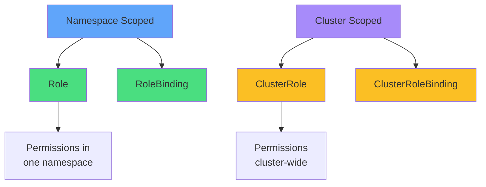

</div>

<div class="grid grid-cols-2 gap-6 mt-8">
<!--
METADATA:
sentence: A ClusterRole defines permissions without a namespace restriction.
search_anchor: without a namespace restriction
-->
<div v-click="2">
<carbon-document class="text-4xl text-blue-400 mb-2" />
<strong>Role + RoleBinding</strong><br/>
<span class="text-sm opacity-80">Single namespace</span>
</div>
<!--
METADATA:
sentence: A ClusterRoleBinding grants those permissions cluster-wide.
search_anchor: grants those permissions cluster-wide
-->
<div v-click="3">
<carbon-network-3 class="text-4xl text-purple-400 mb-2" />
<strong>ClusterRole + CRB</strong><br/>
<span class="text-sm opacity-80">Entire cluster</span>
</div>
</div>

---
layout: center
---

# ClusterRole Patterns

<!--
METADATA:
sentence: Interestingly, you can also use a ClusterRole with a regular RoleBinding to apply cluster-defined permissions to a specific namespace.
search_anchor: ClusterRole with a regular RoleBinding
-->
<div v-click="1">

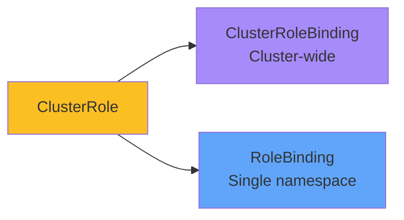

</div>

<!--
METADATA:
sentence: This pattern lets you define standard permission sets once as ClusterRoles, then apply them selectively to different namespaces.
search_anchor: define standard permission sets once
-->
<div v-click="2" class="mt-8 text-center">
<carbon-idea class="inline-block text-4xl text-yellow-400" />
<strong class="ml-2">Pattern:</strong> Define once, apply selectively
</div>

<!--
METADATA:
sentence: This is exactly how Kubernetes' built-in roles like "view," "edit," and "admin" work.
search_anchor: built-in roles like
-->
<div v-click="3" class="mt-6 text-sm">

```yaml
# ClusterRole (reusable definition)
kind: ClusterRole
name: pod-reader
---
# Apply to specific namespace
kind: RoleBinding
roleRef:
  kind: ClusterRole  # Reference ClusterRole
  name: pod-reader
```

</div>

---
layout: center
---

# Built-in ClusterRoles

<div class="grid grid-cols-2 gap-6 mt-6">
<!--
METADATA:
sentence: Kubernetes provides several built-in ClusterRoles that cover common use cases. The "view" role provides read-only access to most resources, but excludes Secrets and ConfigMaps for security reasons.
search_anchor: built-in ClusterRoles
-->
<div v-click="1">
<carbon-view class="text-5xl text-blue-400 mb-2" />
<strong>view</strong><br/>
<span class="text-sm opacity-80">Read-only access<br/>(excludes Secrets)</span>
</div>
<!--
METADATA:
sentence: The "edit" role allows creating and modifying most resources, including Pods and Services, but doesn't grant access to RBAC resources themselves.
search_anchor: "edit" role allows creating
-->
<div v-click="2">
<carbon-edit class="text-5xl text-green-400 mb-2" />
<strong>edit</strong><br/>
<span class="text-sm opacity-80">Create & modify resources<br/>(no RBAC)</span>
</div>
<!--
METADATA:
sentence: The "admin" role provides full access within a namespace, including RBAC management, but can't modify the namespace itself or resource quotas.
search_anchor: "admin" role provides full access
-->
<div v-click="3">
<carbon-settings class="text-5xl text-yellow-400 mb-2" />
<strong>admin</strong><br/>
<span class="text-sm opacity-80">Full namespace access<br/>(includes RBAC)</span>
</div>
<!--
METADATA:
sentence: Finally, "cluster-admin" is the superuser role with unrestricted access to everything in the cluster.
search_anchor: "cluster-admin" is the superuser
-->
<div v-click="4">
<carbon-security class="text-5xl text-red-400 mb-2" />
<strong>cluster-admin</strong><br/>
<span class="text-sm opacity-80">Superuser<br/>(unrestricted)</span>
</div>
</div>

<!--
METADATA:
sentence: For the CKAD exam, you should know when to use these built-in roles versus creating custom ones.
search_anchor: when to use these built-in roles
-->
<div v-click="5" class="mt-8 text-center text-yellow-400">
<carbon-warning class="inline-block text-2xl" /> Use cluster-admin sparingly!
</div>

---
layout: center
---

# Common RBAC Patterns

<!--
METADATA:
sentence: Let me share the most common RBAC patterns you'll encounter in real-world Kubernetes and on the CKAD exam.
search_anchor: most common RBAC patterns
-->
<div v-click="1">

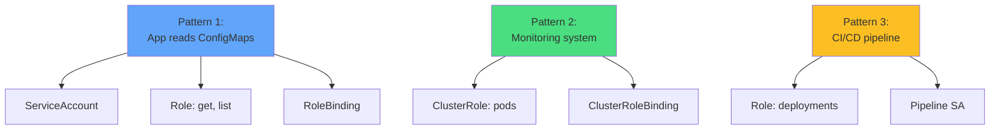

</div>

<!--
METADATA:
sentence: Pattern one: Application accessing ConfigMaps and Secrets. Create a ServiceAccount, grant it a Role with get and list permissions on configmaps and secrets, bind it with a RoleBinding, and configure your Pod to use that ServiceAccount.
search_anchor: Application accessing ConfigMaps and Secrets
-->
<div v-click="2" class="mt-6 text-sm">

```yaml
# Pattern 1: App accessing ConfigMaps
kind: Role
rules:
- apiGroups: [""]
  resources: ["configmaps", "secrets"]
  verbs: ["get", "list"]
```

</div>

---
layout: center
---

# Disabling API Access

<!--
METADATA:
sentence: Pattern four: Disabling API access for security. For Pods that don't need API access, set automountServiceAccountToken to false to reduce your attack surface.
search_anchor: Disabling API access for security
-->
<div v-click="1">

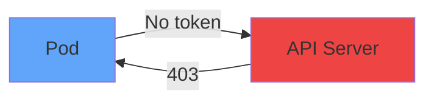

</div>

<!--
METADATA:
sentence: For Pods that don't need API access, set automountServiceAccountToken to false to reduce your attack surface.
search_anchor: automountServiceAccountToken to false
-->
<div v-click="2" class="mt-8">

```yaml
apiVersion: v1
kind: Pod
spec:
  automountServiceAccountToken: false
  containers:
  - name: app
    image: myapp
```

</div>

<!--
METADATA:
sentence: For Pods that don't need API access, set automountServiceAccountToken to false to reduce your attack surface.
search_anchor: reduce your attack surface
-->
<div v-click="3" class="mt-6 text-center">
<carbon-security class="inline-block text-4xl text-green-400" />
<strong class="ml-2">Security best practice:</strong> Disable if not needed
</div>

---
layout: center
---

# Troubleshooting RBAC

<!--
METADATA:
sentence: RBAC issues are common, and you need to know how to diagnose them quickly, especially during the exam.
search_anchor: diagnose them quickly
-->
<div v-click="1">

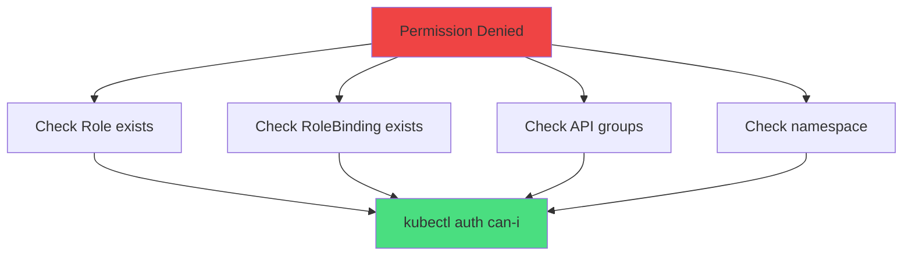

</div>

<!--
METADATA:
sentence: The most important tool is "kubectl auth can-i" - this tests whether a user or ServiceAccount has permission to perform a specific action.
search_anchor: kubectl auth can-i
-->
<div v-click="2" class="mt-6 text-sm">

```bash
# Test permissions
kubectl auth can-i get pods

# Test as another user
kubectl auth can-i create deployments --as=system:serviceaccount:default:myapp

# List permissions
kubectl auth can-i --list
```

</div>

---
layout: center
---

# Common RBAC Issues

<div class="grid grid-cols-2 gap-6 mt-6">
<!--
METADATA:
sentence: Common issues include: missing Roles or RoleBindings, incorrect API groups in Role rules, RoleBindings referencing non-existent Roles, or subjects in the wrong namespace.
search_anchor: Common issues include
-->
<div v-click="1">
<carbon-warning class="text-4xl text-red-400 mb-2" />
<strong>Missing Role</strong><br/>
<span class="text-sm opacity-80">RoleBinding references non-existent Role</span>
</div>
<!--
METADATA:
sentence: Common issues include: missing Roles or RoleBindings, incorrect API groups in Role rules, RoleBindings referencing non-existent Roles, or subjects in the wrong namespace.
search_anchor: incorrect API groups
-->
<div v-click="2">
<carbon-warning class="text-4xl text-yellow-400 mb-2" />
<strong>Wrong API group</strong><br/>
<span class="text-sm opacity-80">"" vs "apps" vs "batch"</span>
</div>
<!--
METADATA:
sentence: Common issues include: missing Roles or RoleBindings, incorrect API groups in Role rules, RoleBindings referencing non-existent Roles, or subjects in the wrong namespace.
search_anchor: wrong namespace
-->
<div v-click="3">
<carbon-warning class="text-4xl text-orange-400 mb-2" />
<strong>Wrong namespace</strong><br/>
<span class="text-sm opacity-80">Role and RoleBinding must match</span>
</div>
<!--
METADATA:
sentence: Always check that your Role and RoleBinding are in the correct namespace, that the roleRef matches your Role name, and that your ServiceAccount exists before creating the binding.
search_anchor: ServiceAccount exists before creating
-->
<div v-click="4">
<carbon-warning class="text-4xl text-purple-400 mb-2" />
<strong>SA doesn't exist</strong><br/>
<span class="text-sm opacity-80">Create before binding</span>
</div>
</div>

<!--
METADATA:
sentence: You can test as yourself, or impersonate other subjects using the "--as" flag.
search_anchor: impersonate other subjects
-->
<div v-click="5" class="mt-8 text-center text-lg">
<carbon-terminal class="inline-block text-3xl text-blue-400" /> kubectl auth can-i is your friend!
</div>

---
layout: center
---

# Security Best Practices

<div class="grid grid-cols-2 gap-6 mt-4">
<!--
METADATA:
sentence: Always follow the principle of least privilege - grant only the minimum permissions required for each application or user to function.
search_anchor: principle of least privilege
-->
<div v-click="1">
<carbon-locked class="text-5xl text-green-400 mb-2" />
<strong>Least privilege</strong><br/>
<span class="text-sm opacity-80">Minimum required permissions</span>
</div>
<!--
METADATA:
sentence: Create dedicated ServiceAccounts for each application - never share ServiceAccounts between different apps or use the default ServiceAccount for applications that access the API.
search_anchor: Create dedicated ServiceAccounts for each application
-->
<div v-click="2">
<carbon-user class="text-5xl text-blue-400 mb-2" />
<strong>Dedicated SAs</strong><br/>
<span class="text-sm opacity-80">One per application</span>
</div>
<!--
METADATA:
sentence: Disable token mounting for Pods that don't need API access using automountServiceAccountToken: false.
search_anchor: Disable token mounting
-->
<div v-click="3">
<carbon-close class="text-5xl text-yellow-400 mb-2" />
<strong>Disable tokens</strong><br/>
<span class="text-sm opacity-80">When API access not needed</span>
</div>
<!--
METADATA:
sentence: Use namespaces to isolate environments like development, staging, and production, with different RBAC rules for each.
search_anchor: Use namespaces to isolate environments
-->
<div v-click="4">
<carbon-network-3 class="text-5xl text-purple-400 mb-2" />
<strong>Use namespaces</strong><br/>
<span class="text-sm opacity-80">Isolate environments</span>
</div>
<!--
METADATA:
sentence: Regularly audit your RBAC configuration to identify overly permissive roles, especially ClusterRoleBindings which grant cluster-wide access.
search_anchor: Regularly audit your RBAC configuration
-->
<div v-click="5">
<carbon-view class="text-5xl text-orange-400 mb-2" />
<strong>Audit regularly</strong><br/>
<span class="text-sm opacity-80">Review permissions</span>
</div>
<!--
METADATA:
sentence: And finally, use resourceNames in Roles when you need to restrict access to specific named resources, like a particular Secret.
search_anchor: use resourceNames in Roles
-->
<div v-click="6">
<carbon-rule class="text-5xl text-red-400 mb-2" />
<strong>Use resourceNames</strong><br/>
<span class="text-sm opacity-80">Restrict to specific resources</span>
</div>
</div>

---
layout: center
---

# CKAD Exam Tips

<!--
METADATA:
sentence: For CKAD exam success, practice creating ServiceAccounts, Roles, and RoleBindings using imperative commands for speed, and always verify permissions with "kubectl auth can-i."
search_anchor: CKAD exam success
-->
<div v-click="1" class="text-center mb-6">
<carbon-certificate class="inline-block text-6xl text-blue-400" />
</div>

<div class="grid grid-cols-2 gap-4 text-sm">
<!--
METADATA:
sentence: For CKAD exam success, practice creating ServiceAccounts, Roles, and RoleBindings using imperative commands for speed, and always verify permissions with "kubectl auth can-i."
search_anchor: creating ServiceAccounts
-->
<div v-click="2">
<carbon-user class="inline-block text-2xl text-green-400" /> Create ServiceAccounts
</div>
<!--
METADATA:
sentence: For CKAD exam success, practice creating ServiceAccounts, Roles, and RoleBindings using imperative commands for speed, and always verify permissions with "kubectl auth can-i."
search_anchor: Roles, and RoleBindings
-->
<div v-click="3">
<carbon-document class="inline-block text-2xl text-green-400" /> Create Roles
</div>
<!--
METADATA:
sentence: For CKAD exam success, practice creating ServiceAccounts, Roles, and RoleBindings using imperative commands for speed, and always verify permissions with "kubectl auth can-i."
search_anchor: RoleBindings using imperative commands
-->
<div v-click="4">
<carbon-connect class="inline-block text-2xl text-green-400" /> Create RoleBindings
</div>
<!--
METADATA:
sentence: For CKAD exam success, practice creating ServiceAccounts, Roles, and RoleBindings using imperative commands for speed, and always verify permissions with "kubectl auth can-i."
search_anchor: verify permissions
-->
<div v-click="5">
<carbon-terminal class="inline-block text-2xl text-green-400" /> Use kubectl auth can-i
</div>
<!--
METADATA:
sentence: For CKAD exam success, practice creating ServiceAccounts, Roles, and RoleBindings using imperative commands for speed, and always verify permissions with "kubectl auth can-i."
search_anchor: imperative commands for speed
-->
<div v-click="6">
<carbon-settings class="inline-block text-2xl text-green-400" /> Assign SA to Pods
</div>
<!--
METADATA:
sentence: For CKAD exam success, practice creating ServiceAccounts, Roles, and RoleBindings using imperative commands for speed, and always verify permissions with "kubectl auth can-i."
search_anchor: always verify permissions
-->
<div v-click="7">
<carbon-debug class="inline-block text-2xl text-green-400" /> Troubleshoot permissions
</div>
</div>

<!--
METADATA:
sentence: For CKAD exam success, practice creating ServiceAccounts, Roles, and RoleBindings using imperative commands for speed, and always verify permissions with "kubectl auth can-i."
search_anchor: practice creating
-->
<div v-click="8" class="mt-8 text-sm">

```bash
# Speed commands
kubectl create serviceaccount myapp
kubectl create role pod-reader --verb=get,list --resource=pods
kubectl create rolebinding read-pods --role=pod-reader --serviceaccount=default:myapp
```

</div>

---
layout: center
---

# Summary

<!--
METADATA:
sentence: To summarize: RBAC provides fine-grained access control in Kubernetes through Roles that define permissions and RoleBindings that grant those permissions to subjects.
search_anchor: To summarize
-->
<div v-click="1">

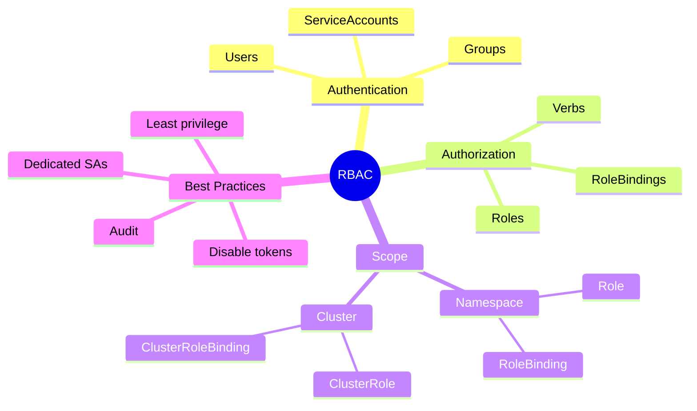

</div>

---
layout: center
---

# Key Takeaways

<div class="grid grid-cols-2 gap-6 mt-6">
<!--
METADATA:
sentence: To summarize: RBAC provides fine-grained access control in Kubernetes through Roles that define permissions and RoleBindings that grant those permissions to subjects.
search_anchor: Roles that define permissions
-->
<div v-click="1">
<carbon-document class="text-4xl text-green-400 mb-2" />
<strong>Role defines permissions</strong><br/>
<span class="text-sm opacity-80">What actions on which resources</span>
</div>
<!--
METADATA:
sentence: To summarize: RBAC provides fine-grained access control in Kubernetes through Roles that define permissions and RoleBindings that grant those permissions to subjects.
search_anchor: grant those permissions to subjects
-->
<div v-click="2">
<carbon-connect class="text-4xl text-blue-400 mb-2" />
<strong>RoleBinding grants access</strong><br/>
<span class="text-sm opacity-80">Connects Role to subjects</span>
</div>
<!--
METADATA:
sentence: ServiceAccounts provide identity for applications, while ClusterRoles and ClusterRoleBindings extend permissions across namespaces.
search_anchor: ServiceAccounts provide identity for applications
-->
<div v-click="3">
<carbon-user class="text-4xl text-purple-400 mb-2" />
<strong>ServiceAccounts for apps</strong><br/>
<span class="text-sm opacity-80">Identity for Pods</span>
</div>
<!--
METADATA:
sentence: ServiceAccounts provide identity for applications, while ClusterRoles and ClusterRoleBindings extend permissions across namespaces.
search_anchor: ClusterRoles and ClusterRoleBindings extend permissions
-->
<div v-click="4">
<carbon-terminal class="text-4xl text-yellow-400 mb-2" />
<strong>kubectl auth can-i</strong><br/>
<span class="text-sm opacity-80">Test permissions quickly</span>
</div>
</div>

<!--
METADATA:
sentence: Now let's move to our hands-on exercises where you'll apply these concepts in real scenarios.
search_anchor: hands-on exercises
-->
<div v-click="5" class="mt-8 text-center text-xl">
Deny by default - grant minimum required <carbon-arrow-right class="inline-block text-2xl" />
</div>
