# Deployment Strategies

<div class="abs-br m-6 flex gap-2">
  <carbon-deploy class="text-6xl text-blue-400" />
</div>

<!--
METADATA:
sentence: Every code change, library update, or OS patch requires a rollout. Understanding deployment strategies is essential for zero-downtime updates in production.
search_anchor: zero-downtime updates in production
-->
<div v-click class="mt-8 text-xl opacity-80">
Rolling out changes with zero downtime
</div>

---
layout: center
---

# The Update Challenge

<!--
METADATA:
sentence: In production Kubernetes environments, you'll constantly deploy updates: New application features, Security patches, Configuration changes, Infrastructure updates.
search_anchor: constantly deploy updates
-->
<div v-click="1">

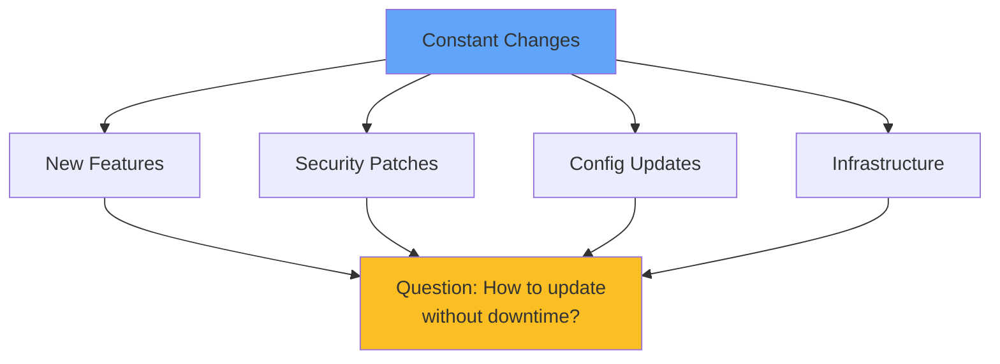

</div>

<div class="grid grid-cols-2 gap-8 mt-8">
<!--
METADATA:
sentence: How do you update running applications without causing downtime or impacting users?
search_anchor: without causing downtime
-->
<div v-click="2">
<carbon-close class="text-5xl text-red-400 mb-2" />
<strong>Traditional</strong><br/>
<span class="text-sm opacity-80">Downtime required</span>
</div>
<!--
METADATA:
sentence: Visual: Show diagram of traditional deployment with downtime vs. Kubernetes zero-downtime deployment.
search_anchor: Kubernetes zero-downtime deployment
-->
<div v-click="3">
<carbon-checkmark class="text-5xl text-green-400 mb-2" />
<strong>Kubernetes</strong><br/>
<span class="text-sm opacity-80">Zero downtime updates</span>
</div>
</div>

---
layout: center
---

# Deployment Strategies Overview

<!--
METADATA:
sentence: Kubernetes supports four main deployment strategies, each with different risk and resource trade-offs.
search_anchor: four main deployment strategies
-->
<div v-click="1">

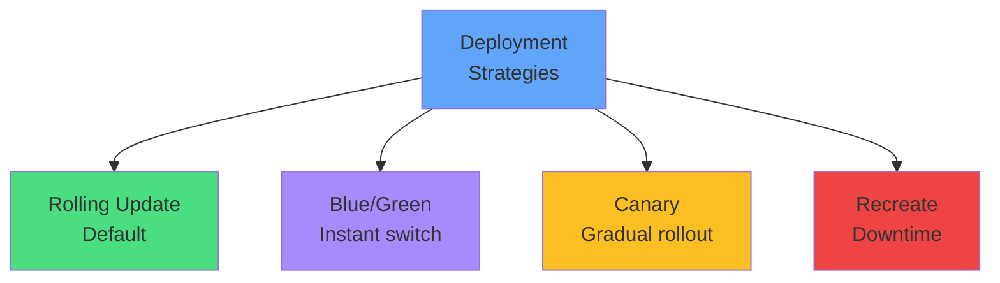

</div>

<div class="grid grid-cols-4 gap-2 mt-8 text-xs">
<!--
METADATA:
sentence: Rolling Update - Low risk, None downtime, Medium resource usage, Most applications.
search_anchor: Rolling Update - Low risk
-->
<div v-click="2" class="text-center">
<carbon-chart-line-smooth class="text-4xl text-green-400 mb-1" />
<strong>Rolling</strong><br/>
Low risk
</div>
<!--
METADATA:
sentence: Blue/Green - Very Low risk, None downtime, High (2x) resource usage, Critical services.
search_anchor: Blue/Green - Very Low risk
-->
<div v-click="3" class="text-center">
<carbon-switch class="text-4xl text-purple-400 mb-1" />
<strong>Blue/Green</strong><br/>
Very low risk
</div>
<!--
METADATA:
sentence: Canary - Low risk, None downtime, Medium resource usage, High-risk changes.
search_anchor: Canary - Low risk
-->
<div v-click="4" class="text-center">
<carbon-test-tool class="text-4xl text-yellow-400 mb-1" />
<strong>Canary</strong><br/>
Gradual
</div>
<!--
METADATA:
sentence: Recreate - High risk, Yes downtime, Low resource usage, Development/testing.
search_anchor: Recreate - High risk
-->
<div v-click="5" class="text-center">
<carbon-warning class="text-4xl text-red-400 mb-1" />
<strong>Recreate</strong><br/>
Downtime
</div>
</div>

---
layout: center
---

# Rolling Updates - Default Strategy

<!--
METADATA:
sentence: Rolling updates are Kubernetes' default deployment strategy, and for good reason.
search_anchor: default deployment strategy
-->
<div v-click="1">

```mermaid
graph LR
    V1A[v1] --> V2A[v2]
    V1B[v1] --> V2B[v2]
    V1C[v1] --> V2C[v2]
    V2A --> DONE[Complete]
    V2B --> DONE
    V2C --> DONE
    style V1A fill:#ef4444
    style V1B fill:#ef4444
    style V1C fill:#ef4444
    style V2A fill:#4ade80
    style V2B fill:#4ade80
    style V2C fill=#4ade80
    style DONE fill:#60a5fa
```

</div>

<!--
METADATA:
sentence: How It Works: Create new pods with updated version, Wait for new pods to become ready, Terminate old pods, Repeat until all pods are updated.
search_anchor: Create new pods with updated version
-->
<div v-click="2" class="mt-8">

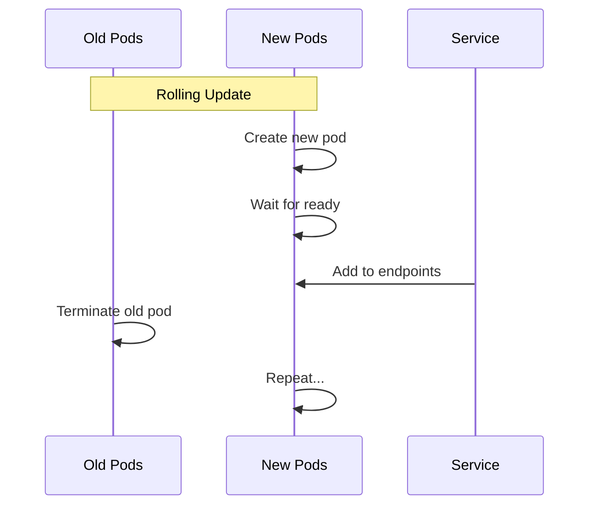

</div>

---
layout: center
---

# Rolling Update Configuration

<!--
METADATA:
sentence: Key Configuration Parameters: maxSurge - Maximum number of extra pods during rollout (default: 25%), maxUnavailable - Maximum pods that can be unavailable (default: 25%).
search_anchor: Key Configuration Parameters
-->
<div v-click="1" class="mb-4">

```yaml
spec:
  strategy:
    type: RollingUpdate
    rollingUpdate:
      maxSurge: 25%          # Extra pods allowed
      maxUnavailable: 25%    # Pods that can be down
```

</div>

<div class="grid grid-cols-2 gap-6 mt-8">
<!--
METADATA:
sentence: maxSurge: Maximum number of extra pods during rollout (default: 25%).
search_anchor: Maximum number of extra pods
-->
<div v-click="2">
<carbon-arrow-up class="text-4xl text-green-400 mb-2" />
<strong>maxSurge</strong><br/>
<span class="text-sm opacity-80">Maximum extra pods during rollout</span>
</div>
<!--
METADATA:
sentence: maxUnavailable: Maximum pods that can be unavailable (default: 25%).
search_anchor: Maximum pods that can be unavailable
-->
<div v-click="3">
<carbon-arrow-down class="text-4xl text-red-400 mb-2" />
<strong>maxUnavailable</strong><br/>
<span class="text-sm opacity-80">Maximum pods that can be down</span>
</div>
</div>

<!--
METADATA:
sentence: Important: Both old and new versions run concurrently during rollout. Your application must support this!
search_anchor: Both old and new versions run concurrently
-->
<div v-click="4" class="mt-8 text-center text-yellow-400">
<carbon-warning class="inline-block text-2xl" /> Both versions run concurrently!
</div>

---
layout: center
---

# Rolling Update Examples

<!--
METADATA:
sentence: Example Scenarios: Fast rollout - maxSurge: 100%, maxUnavailable: 0% - Creates all new pods immediately. Conservative rollout - maxSurge: 1, maxUnavailable: 0 - Updates one pod at a time. Balanced rollout - maxSurge: 25%, maxUnavailable: 25% - Default behavior.
search_anchor: Example Scenarios
-->
<div v-click="1">

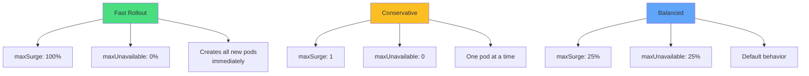

</div>

---
layout: center
---

# Rollback Capabilities

<!--
METADATA:
sentence: Rollout History: Kubernetes maintains revision history for deployments, Each rollout creates a new ReplicaSet, Old ReplicaSets are retained (default: 10 revisions).
search_anchor: Kubernetes maintains revision history
-->
<div v-click="1">

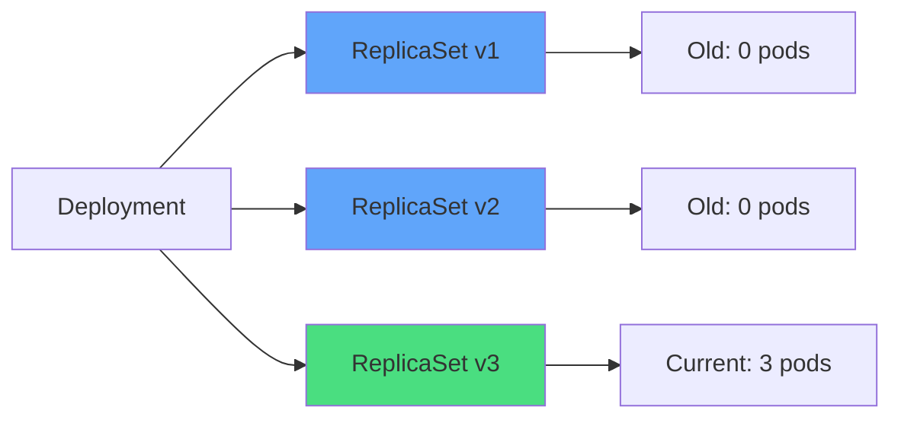

</div>

<!--
METADATA:
sentence: Rollback Commands: kubectl rollout history deployment/myapp, kubectl rollout undo deployment/myapp, kubectl rollout undo deployment/myapp --to-revision=3, kubectl rollout status deployment/myapp.
search_anchor: Rollback Commands
-->
<div v-click="2" class="mt-6 text-sm">

```bash
# View history
kubectl rollout history deployment/myapp

# Rollback to previous version
kubectl rollout undo deployment/myapp

# Rollback to specific revision
kubectl rollout undo deployment/myapp --to-revision=3

# Monitor rollout
kubectl rollout status deployment/myapp
```

</div>

<!--
METADATA:
sentence: Critical CKAD Concept: Kubernetes does NOT automatically rollback failed deployments. You must monitor and manually intervene.
search_anchor: does NOT automatically rollback
-->
<div v-click="3" class="mt-6 text-center text-red-400">
<carbon-warning class="inline-block text-2xl" /> No automatic rollback!
</div>

---
layout: center
---

# Blue/Green Deployments

<!--
METADATA:
sentence: The Concept: Blue = Current production version (e.g., v1), Green = New version being prepared (e.g., v2), Only one version serves traffic at a time, Switch traffic instantly by updating Service selector.
search_anchor: Blue = Current production version
-->
<div v-click="1">

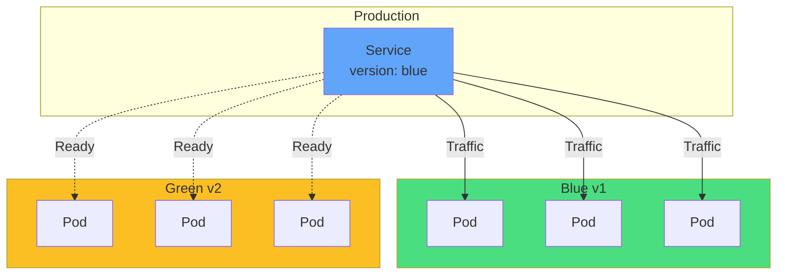

</div>

<!--
METADATA:
sentence: Switch traffic instantly by updating Service selector.
search_anchor: Switch traffic instantly
-->
<div v-click="2" class="mt-6 text-center">
<carbon-switch class="inline-block text-4xl text-purple-400" />
<strong class="ml-2">Instant switchover by changing selector</strong>
</div>

---
layout: center
---

# Blue/Green Implementation

<!--
METADATA:
sentence: How It Works: Deploy green version alongside blue, Test green thoroughly (without affecting users), Switch Service selector from blue to green, Monitor green in production, Keep blue running as instant rollback option, Decommission blue once green is stable.
search_anchor: Deploy green version alongside blue
-->
<div v-click="1" class="mb-4">

```yaml
# Two deployments
apiVersion: apps/v1
kind: Deployment
metadata:
  name: myapp-blue
spec:
  selector:
    matchLabels:
      app: myapp
      version: blue
---
apiVersion: apps/v1
kind: Deployment
metadata:
  name: myapp-green
spec:
  selector:
    matchLabels:
      app: myapp
      version: green
```

</div>

---
layout: center
---

# Switching Traffic

<!--
METADATA:
sentence: Test green thoroughly (without affecting users), Switch Service selector from blue to green.
search_anchor: Test green thoroughly
-->
<div v-click="1">

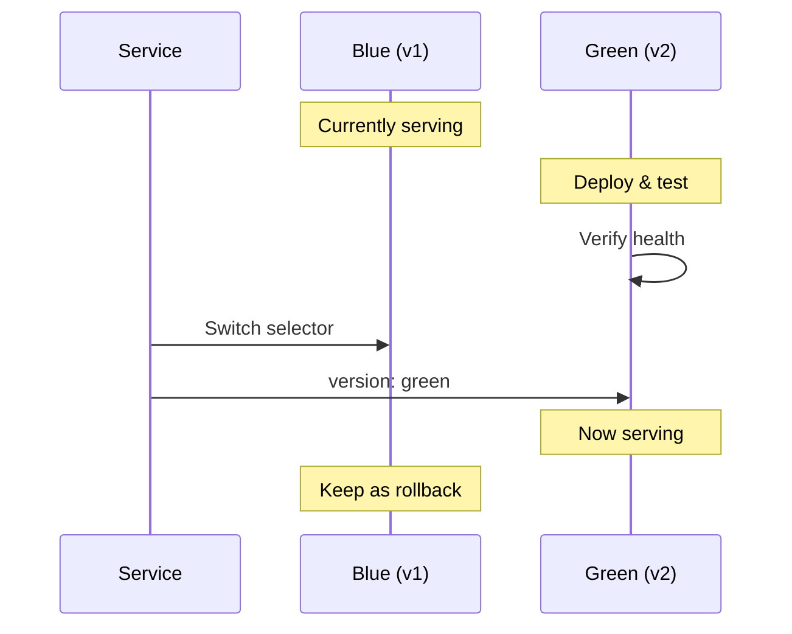

</div>

<!--
METADATA:
sentence: CKAD Implementation: kubectl patch service myapp-svc -p '{"spec":{"selector":{"version":"green"}}}', kubectl patch service myapp-svc -p '{"spec":{"selector":{"version":"blue"}}}'.
search_anchor: CKAD Implementation
-->
<div v-click="2" class="mt-6 text-sm">

```bash
# Switch to green
kubectl patch service myapp -p '{"spec":{"selector":{"version":"green"}}}'

# Instant rollback if needed
kubectl patch service myapp -p '{"spec":{"selector":{"version":"blue"}}}'
```

</div>

---
layout: center
---

# Blue/Green Trade-offs

<div class="grid grid-cols-2 gap-6 mt-6">
<!--
METADATA:
sentence: Advantages: Instant switchover (just update selector), Easy instant rollback, Full production testing before going live, No mixed versions serving traffic.
search_anchor: Instant switchover
-->
<div v-click="1">
<carbon-checkmark class="text-5xl text-green-400 mb-2" />
<strong>Advantages</strong><br/>
<div class="text-sm opacity-80 mt-2">
• Instant switchover<br/>
• Easy rollback<br/>
• Full testing first<br/>
• No mixed versions
</div>
</div>
<!--
METADATA:
sentence: Drawbacks: Requires 2x resources (both versions running), Complex with stateful apps or database migrations, Not suitable for all scenarios.
search_anchor: Requires 2x resources
-->
<div v-click="2">
<carbon-close class="text-5xl text-red-400 mb-2" />
<strong>Drawbacks</strong><br/>
<div class="text-sm opacity-80 mt-2">
• 2x resources needed<br/>
• Complex with databases<br/>
• Not always practical
</div>
</div>
</div>

---
layout: center
---

# Canary Deployments

<!--
METADATA:
sentence: The Concept: Named after "canary in a coal mine" - early warning system for problems. Roll out to a small subset first, then gradually increase.
search_anchor: canary in a coal mine
-->
<div v-click="1">

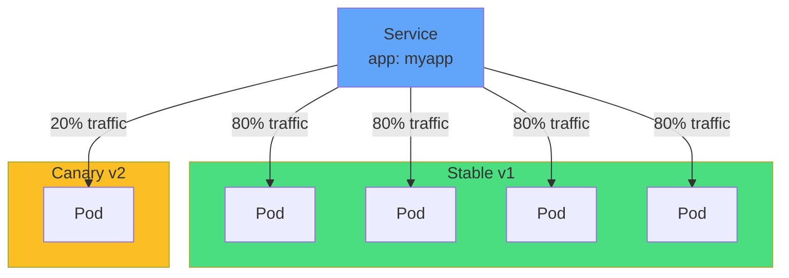

</div>

<!--
METADATA:
sentence: Roll out to a small subset first, then gradually increase.
search_anchor: gradually increase
-->
<div v-click="2" class="mt-6 text-center">
<carbon-test-tool class="inline-block text-4xl text-yellow-400" />
<strong class="ml-2">Gradual exposure to minimize risk</strong>
</div>

---
layout: center
---

# Canary Progression

<!--
METADATA:
sentence: Progression Example: Start - 4 stable (80%) + 1 canary (20%), Step 1 - 3 stable (50%) + 3 canary (50%), Step 2 - 0 stable (0%) + 4 canary (100%), Complete - Remove stable deployment.
search_anchor: 4 stable (80%) + 1 canary (20%)
-->
<div v-click="1">

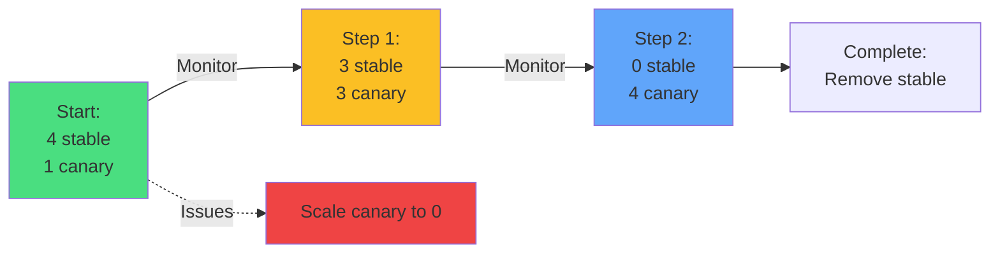

</div>

<!--
METADATA:
sentence: How It Works: Deploy canary version with small pod count (e.g., 1 pod = 20% traffic), Monitor metrics: errors, latency, performance.
search_anchor: Monitor metrics: errors, latency, performance
-->
<div v-click="2" class="mt-8 text-center text-sm">
<carbon-chart-line-smooth class="inline-block text-3xl text-blue-400" />
Monitor metrics at each stage
</div>

---
layout: center
---

# Canary Implementation

<!--
METADATA:
sentence: CKAD Implementation: Two Deployments with same labels, different versions: Stable - 4 replicas (v1) = 80% traffic, Canary - 1 replica (v2) = 20% traffic, Service load-balances across all 5 pods.
search_anchor: Two Deployments with same labels
-->
<div v-click="1" class="text-sm">

```yaml
# Stable deployment
apiVersion: apps/v1
kind: Deployment
metadata:
  name: myapp-stable
spec:
  replicas: 4
  selector:
    matchLabels:
      app: myapp
  template:
    metadata:
      labels:
        app: myapp
        version: stable
---
# Canary deployment
apiVersion: apps/v1
kind: Deployment
metadata:
  name: myapp-canary
spec:
  replicas: 1
  selector:
    matchLabels:
      app: myapp
  template:
    metadata:
      labels:
        app: myapp
        version: canary
```

</div>

---
layout: center
---

# Canary Trade-offs

<div class="grid grid-cols-2 gap-6 mt-6">
<!--
METADATA:
sentence: Advantages: Minimal user impact (only small percentage exposed), Gradual rollout with monitoring at each stage, Easy rollback by scaling down canary, Data-driven deployment decisions.
search_anchor: Minimal user impact
-->
<div v-click="1">
<carbon-checkmark class="text-5xl text-green-400 mb-2" />
<strong>Advantages</strong><br/>
<div class="text-sm opacity-80 mt-2">
• Minimal user impact<br/>
• Gradual rollout<br/>
• Easy rollback<br/>
• Data-driven decisions
</div>
</div>
<!--
METADATA:
sentence: Drawbacks: More complex than rolling updates, Requires good monitoring/metrics, Traffic distribution may not be perfectly equal.
search_anchor: More complex than rolling updates
-->
<div v-click="2">
<carbon-close class="text-5xl text-red-400 mb-2" />
<strong>Drawbacks</strong><br/>
<div class="text-sm opacity-80 mt-2">
• More complex<br/>
• Needs good monitoring<br/>
• Uneven distribution
</div>
</div>
</div>

---
layout: center
---

# Recreate Strategy

<!--
METADATA:
sentence: The Recreate strategy is the simplest but most disruptive approach. How It Works: Terminate ALL existing pods, Wait for termination to complete, Create all new pods.
search_anchor: Terminate ALL existing pods
-->
<div v-click="1">

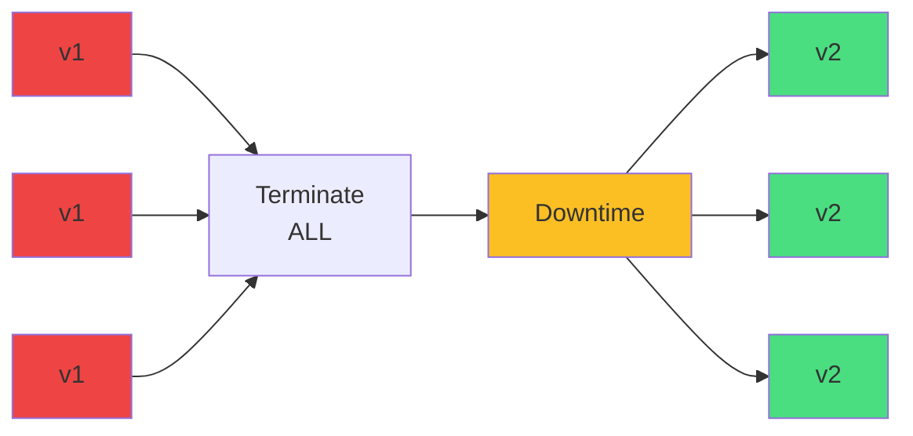

</div>

<!--
METADATA:
sentence: Configuration: spec - strategy - type: Recreate.
search_anchor: type: Recreate
-->
<div v-click="2" class="mt-8">

```yaml
spec:
  strategy:
    type: Recreate
```

</div>

<!--
METADATA:
sentence: Warning: A bad deployment will take your application completely offline. Use with extreme caution in production.
search_anchor: take your application completely offline
-->
<div v-click="3" class="mt-6 text-center text-red-400">
<carbon-warning class="inline-block text-2xl" /> Use with extreme caution in production!
</div>

---
layout: center
---

# When to Use Recreate

<div class="grid grid-cols-2 gap-6 mt-8">
<!--
METADATA:
sentence: When to Use: Development and testing environments, Applications that cannot run multiple versions simultaneously, Database schema changes requiring incompatible versions, When downtime is acceptable.
search_anchor: Development and testing environments
-->
<div v-click="1">
<carbon-checkmark class="text-5xl text-green-400 mb-2" />
<strong>Use when:</strong><br/>
<div class="text-sm opacity-80 mt-2">
• Development/testing<br/>
• Can't run multiple versions<br/>
• Database migrations<br/>
• Downtime acceptable
</div>
</div>
<!--
METADATA:
sentence: Use with extreme caution in production.
search_anchor: extreme caution in production
-->
<div v-click="2">
<carbon-close class="text-5xl text-red-400 mb-2" />
<strong>Avoid when:</strong><br/>
<div class="text-sm opacity-80 mt-2">
• Production workloads<br/>
• Zero downtime required<br/>
• High availability needed
</div>
</div>
</div>

---
layout: center
---

# Choosing the Right Strategy

<!--
METADATA:
sentence: Decision Matrix for CKAD Scenarios: Key Questions to Ask - Can my app run multiple versions simultaneously? How much downtime can I tolerate? What resources are available in my cluster?
search_anchor: Decision Matrix for CKAD
-->
<div v-click="1">

```mermaid
graph TD
    Q1{Can run<br/>multiple versions?}
    Q1 -->|No| REC[Recreate]
    Q1 -->|Yes| Q2{Zero downtime<br/>critical?}
    Q2 -->|Very| Q3{Have 2x<br/>resources?}
    Q3 -->|Yes| BG[Blue/Green]
    Q3 -->|No| CAN[Canary]
    Q2 -->|Moderate| Q4{High risk<br/>change?}
    Q4 -->|Yes| CAN
    Q4 -->|No| ROLL[Rolling Update]
    style REC fill=#ef4444
    style BG fill:#a78bfa
    style CAN fill:#fbbf24
    style ROLL fill:#4ade80
```

</div>

---
layout: center
---

# CKAD Exam Tips

<!--
METADATA:
sentence: What You Must Know: Rolling update configuration - maxSurge, maxUnavailable, Rollback commands - undo, history, status, Blue/Green implementation - Using Service selector patching, Canary implementation - Using multiple Deployments with same labels, Update strategies - When to use each approach.
search_anchor: What You Must Know
-->
<div v-click="1" class="text-center mb-6">
<carbon-certificate class="inline-block text-6xl text-blue-400" />
</div>

<div class="grid grid-cols-2 gap-4 text-sm">
<!--
METADATA:
sentence: Rolling update configuration - maxSurge, maxUnavailable.
search_anchor: Rolling update configuration
-->
<div v-click="2">
<carbon-settings class="inline-block text-2xl text-green-400" /> Configure rolling updates
</div>
<!--
METADATA:
sentence: Rollback commands - undo, history, status.
search_anchor: Rollback commands - undo, history, status
-->
<div v-click="3">
<carbon-restart class="inline-block text-2xl text-green-400" /> Rollback deployments
</div>
<!--
METADATA:
sentence: Rollback commands - undo, history, status.
search_anchor: rollout history
-->
<div v-click="4">
<carbon-view class="inline-block text-2xl text-green-400" /> Check rollout history
</div>
<!--
METADATA:
sentence: Blue/Green implementation - Using Service selector patching.
search_anchor: Using Service selector patching
-->
<div v-click="5">
<carbon-switch class="inline-block text-2xl text-green-400" /> Implement blue/green
</div>
<!--
METADATA:
sentence: Canary implementation - Using multiple Deployments with same labels.
search_anchor: Using multiple Deployments with same labels
-->
<div v-click="6">
<carbon-test-tool class="inline-block text-2xl text-green-400" /> Create canary deployments
</div>
<!--
METADATA:
sentence: Blue/Green implementation - Using Service selector patching.
search_anchor: Service selector patching
-->
<div v-click="7">
<carbon-edit class="inline-block text-2xl text-green-400" /> Patch Service selectors
</div>
</div>

<!--
METADATA:
sentence: Time-Saving Commands: kubectl set image deployment/myapp myapp=myapp:v2, kubectl rollout status deployment/myapp, kubectl rollout undo deployment/myapp.
search_anchor: Time-Saving Commands
-->
<div v-click="8" class="mt-8 text-sm">

```bash
# Quick image update
kubectl set image deployment/myapp myapp=myapp:v2

# Rollback
kubectl rollout undo deployment/myapp

# Monitor
kubectl rollout status deployment/myapp
```

</div>

---
layout: center
---

# Summary

<!--
METADATA:
sentence: Essential Concepts: No automatic rollback - You must monitor and intervene, Choose wisely - Each strategy has trade-offs, Test thoroughly - Before any production rollout, Monitor actively - During and after deployment, Plan for failure - Always have rollback strategy.
search_anchor: Essential Concepts
-->
<div v-click="1">

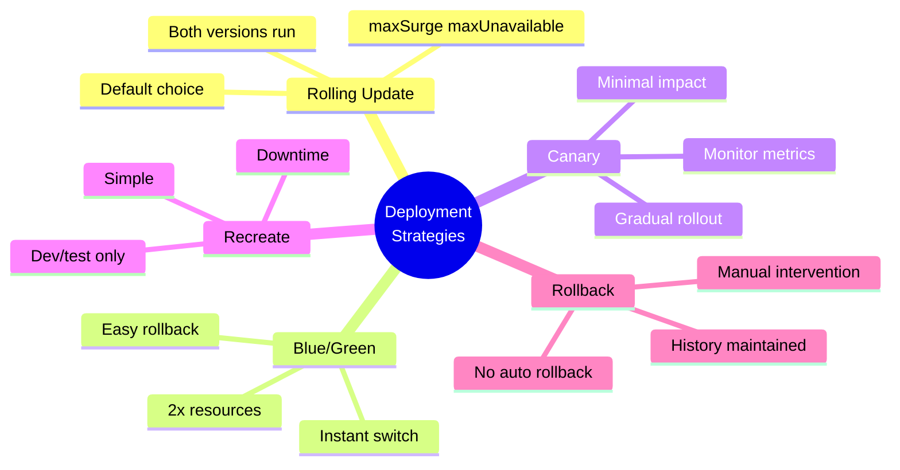

</div>

---
layout: center
---

# Key Takeaways

<div class="grid grid-cols-2 gap-6 mt-6">
<!--
METADATA:
sentence: Choose Rolling Update When: Default choice, app supports multiple versions, moderate risk.
search_anchor: Default for most cases
-->
<div v-click="1">
<carbon-chart-line-smooth class="text-4xl text-green-400 mb-2" />
<strong>Rolling Update</strong><br/>
<span class="text-sm opacity-80">Default for most cases</span>
</div>
<!--
METADATA:
sentence: Choose Blue/Green When: Zero downtime critical, need thorough testing, can afford 2x resources.
search_anchor: Instant switchover
-->
<div v-click="2">
<carbon-switch class="text-4xl text-purple-400 mb-2" />
<strong>Blue/Green</strong><br/>
<span class="text-sm opacity-80">Instant switchover</span>
</div>
<!--
METADATA:
sentence: Choose Canary When: High-risk changes, want to limit user exposure, have good monitoring.
search_anchor: limit user exposure
-->
<div v-click="3">
<carbon-test-tool class="text-4xl text-yellow-400 mb-2" />
<strong>Canary</strong><br/>
<span class="text-sm opacity-80">Minimize risk exposure</span>
</div>
<!--
METADATA:
sentence: No automatic rollback - You must monitor and intervene.
search_anchor: No automatic rollback
-->
<div v-click="4">
<carbon-restart class="text-4xl text-blue-400 mb-2" />
<strong>No auto rollback</strong><br/>
<span class="text-sm opacity-80">Monitor and intervene</span>
</div>
</div>

<!--
METADATA:
sentence: In production, deployment strategy is not just about rolling out changes—it's about managing risk while delivering value.
search_anchor: managing risk while delivering value
-->
<div v-click="5" class="mt-8 text-center text-xl">
Deployment strategy is about managing risk <carbon-arrow-right class="inline-block text-2xl" />
</div>

---
layout: center
---

# Next Steps

<!--
METADATA:
sentence: In the next session, we'll get hands-on experience with: Fast and slow rolling updates, Implementing blue/green deployments, Creating canary rollouts, Handling failed deployments and rollbacks, Using Helm for managed deployments.
search_anchor: hands-on experience with
-->
<div v-click="1" class="text-center mb-8">
<carbon-education class="inline-block text-6xl text-blue-400" />
</div>

<!--
METADATA:
sentence: Fast and slow rolling updates, Implementing blue/green deployments, Creating canary rollouts, Handling failed deployments and rollbacks, Using Helm for managed deployments.
search_anchor: Fast and slow rolling updates
-->
<div v-click="2">

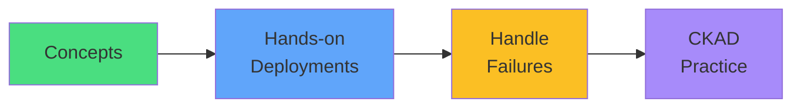

</div>

<!--
METADATA:
sentence: Get ready to apply these concepts in real scenarios!
search_anchor: apply these concepts in real scenarios
-->
<div v-click="3" class="mt-8 text-center text-xl">
Let's deploy and rollback! <carbon-arrow-right class="inline-block text-2xl" />
</div>
