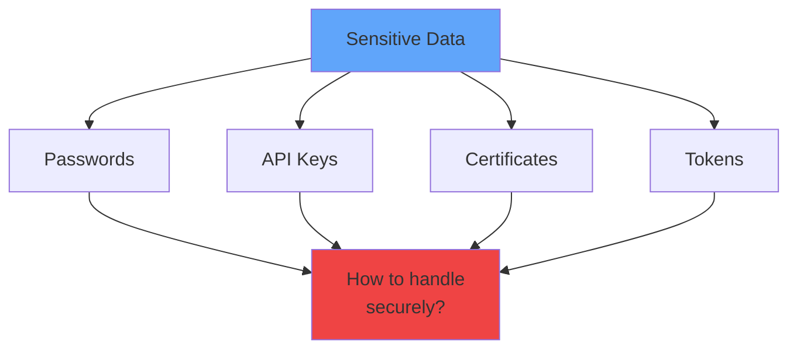
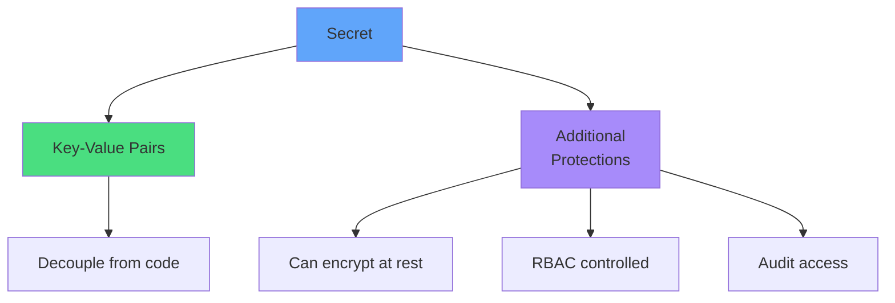
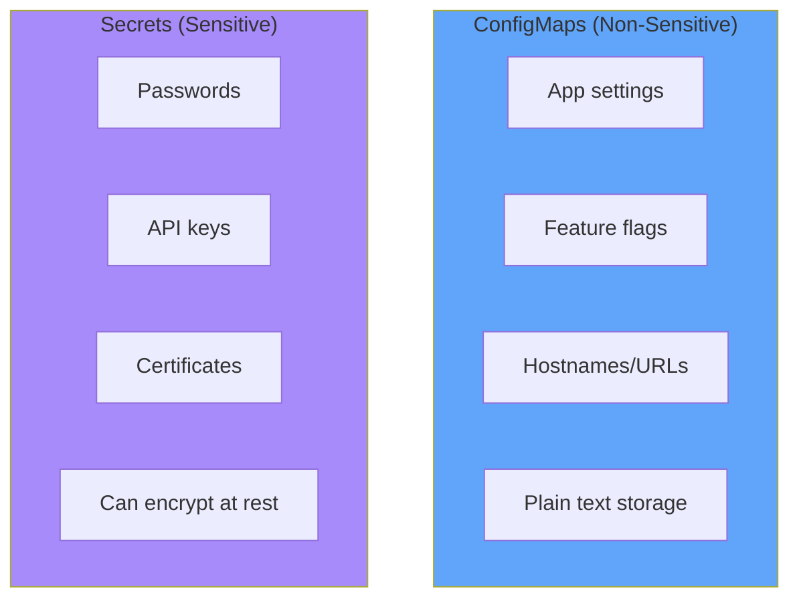
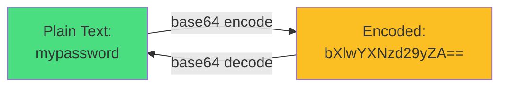
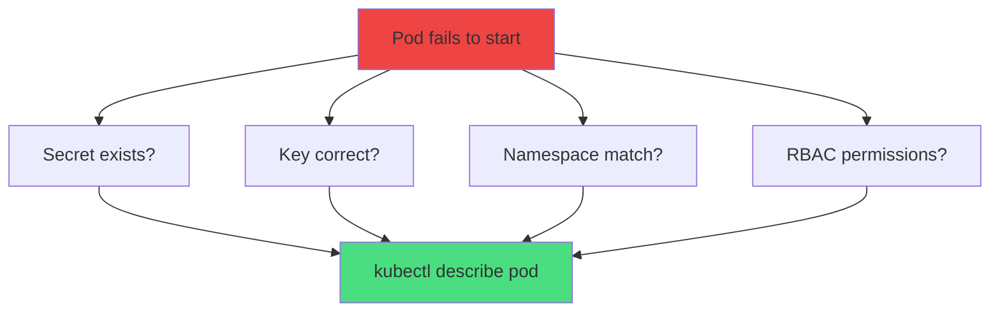
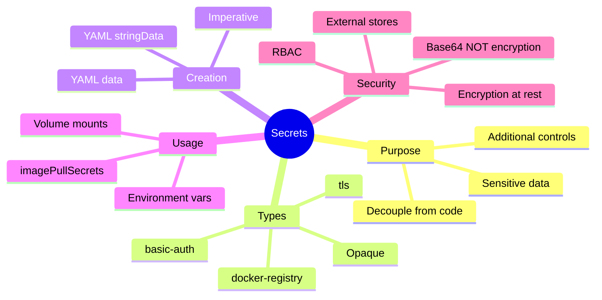
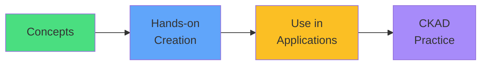

# Kubernetes Secrets

<div class="abs-br m-6 flex gap-2">
  <carbon-locked class="text-6xl text-blue-400" />
</div>

<!--
METADATA:
sentence: Secrets are a core CKAD exam topic and essential for securing sensitive information in production environments.
search_anchor: core CKAD exam topic and essential
-->
<div v-click class="mt-8 text-xl opacity-80">
Securing sensitive data in Kubernetes
</div>

---
layout: center
---

# The Sensitive Data Challenge

<!--
METADATA:
sentence: Let's start with a common problem: how do you handle passwords, API keys, certificates, and other sensitive data in containerized applications?
search_anchor: how do you handle passwords, API keys
-->
<div v-click="1">



</div>

<div class="grid grid-cols-3 gap-4 mt-8">
<!--
METADATA:
sentence: Hardcoding secrets in source code means they're visible in version control history forever.
search_anchor: Hardcoding secrets in source code
-->
<div v-click="2">
<carbon-close class="text-4xl text-red-400 mb-2" />
<strong>Hardcode</strong><br/>
<span class="text-sm opacity-80">Visible in Git</span>
</div>
<!--
METADATA:
sentence: Embedding them in container images means anyone with access to your image registry can extract them.
search_anchor: Embedding them in container images
-->
<div v-click="3">
<carbon-close class="text-4xl text-red-400 mb-2" />
<strong>In images</strong><br/>
<span class="text-sm opacity-80">Anyone can extract</span>
</div>
<!--
METADATA:
sentence: Using plain environment variables exposes them to process listings and logs.
search_anchor: plain environment variables exposes
-->
<div v-click="4">
<carbon-close class="text-4xl text-red-400 mb-2" />
<strong>Plain env vars</strong><br/>
<span class="text-sm opacity-80">Exposed in logs</span>
</div>
</div>

---
layout: center
---

# What Are Secrets?

<!--
METADATA:
sentence: A Secret is a Kubernetes API object that stores sensitive information as key-value pairs.
search_anchor: Secret is a Kubernetes API object
-->
<div v-click="1">



</div>

<!--
METADATA:
sentence: While similar to ConfigMaps in structure, Secrets have additional protections and are handled differently by the Kubernetes system.
search_anchor: additional protections and are handled differently
-->
<div v-click="2" class="mt-8 text-center">
<carbon-locked class="inline-block text-4xl text-blue-400" />
<strong class="ml-2">Kubernetes API object for sensitive information</strong>
</div>

<!--
METADATA:
sentence: It's crucial to understand: Secrets are designed for sensitive data. For non-sensitive configuration like hostnames, feature flags, or application settings, use ConfigMaps instead.
search_anchor: Secrets are designed for sensitive data
-->
<div v-click="3" class="mt-6 text-center text-sm opacity-80">
Similar to ConfigMaps, but with extra security controls
</div>

---
layout: center
---

# Secrets vs ConfigMaps

<!--
METADATA:
sentence: Let's clarify the distinction between Secrets and ConfigMaps, as this is frequently tested on the CKAD exam.
search_anchor: distinction between Secrets and ConfigMaps
-->
<div v-click="1">



</div>

<!--
METADATA:
sentence: The golden rule: if you wouldn't commit it to a public GitHub repository, don't put it in a ConfigMap. Use a Secret instead.
search_anchor: golden rule
-->
<div v-click="2" class="mt-8 text-center text-lg">
<carbon-rule class="inline-block text-3xl text-yellow-400" />
<strong class="ml-2">Golden Rule:</strong> If you wouldn't put it in public Git, use a Secret
</div>

---
layout: center
---

# Secret Types

<div class="grid grid-cols-2 gap-4 mt-4 text-sm">
<!--
METADATA:
sentence: Kubernetes supports multiple Secret types for different use cases. The type field provides metadata that helps validate content and indicates intended usage.
search_anchor: multiple Secret types
-->
<div v-click="1">
<carbon-document class="text-4xl text-blue-400 mb-2" />
<strong>Opaque</strong><br/>
<span class="text-xs opacity-80">Generic key-value data (default)</span>
</div>
<!--
METADATA:
sentence: kubernetes.io/service-account-token - Automatically created for ServiceAccounts, containing tokens for API access.
search_anchor: service-account-token - Automatically created
-->
<div v-click="2">
<carbon-user class="text-4xl text-green-400 mb-2" />
<strong>service-account-token</strong><br/>
<span class="text-xs opacity-80">Auto-created for ServiceAccounts</span>
</div>
<!--
METADATA:
sentence: kubernetes.io/dockerconfigjson - For storing Docker registry credentials, used with imagePullSecrets to pull private images.
search_anchor: dockerconfigjson - For storing Docker registry credentials
-->
<div v-click="3">
<carbon-container-software class="text-4xl text-purple-400 mb-2" />
<strong>dockerconfigjson</strong><br/>
<span class="text-xs opacity-80">Docker registry credentials</span>
</div>
<!--
METADATA:
sentence: kubernetes.io/tls - For storing TLS certificates and keys, commonly used with Ingress resources. Kubernetes validates that tls.crt and tls.key fields are present.
search_anchor: tls - For storing TLS certificates
-->
<div v-click="4">
<carbon-certificate class="text-4xl text-yellow-400 mb-2" />
<strong>tls</strong><br/>
<span class="text-xs opacity-80">TLS certificates and keys</span>
</div>
<!--
METADATA:
sentence: kubernetes.io/basic-auth - For HTTP basic authentication credentials with username and password fields.
search_anchor: basic-auth - For HTTP basic authentication
-->
<div v-click="5">
<carbon-password class="text-4xl text-orange-400 mb-2" />
<strong>basic-auth</strong><br/>
<span class="text-xs opacity-80">Username and password</span>
</div>
<!--
METADATA:
sentence: kubernetes.io/ssh-auth - For SSH private keys, typically used for Git operations.
search_anchor: ssh-auth - For SSH private keys
-->
<div v-click="6">
<carbon-terminal class="text-4xl text-red-400 mb-2" />
<strong>ssh-auth</strong><br/>
<span class="text-xs opacity-80">SSH private keys</span>
</div>
</div>

<!--
METADATA:
sentence: The type is primarily metadata - it doesn't change how the Secret is stored, but Kubernetes can validate that required fields are present.
search_anchor: type is primarily metadata
-->
<div v-click="7" class="mt-8 text-center text-sm opacity-80">
Type provides metadata and validation, not different storage
</div>

---
layout: center
---

# Base64 Encoding - NOT Encryption

<!--
METADATA:
sentence: This is absolutely critical to understand: Base64 encoding is NOT encryption. It's merely an encoding scheme that represents binary data as ASCII text.
search_anchor: Base64 encoding is NOT encryption
-->
<div v-click="1">



</div>

<!--
METADATA:
sentence: Never assume base64 encoding provides security. It's obfuscation at best, not protection.
search_anchor: base64 encoding provides security
-->
<div v-click="2" class="mt-8 text-center text-red-400 text-xl">
<carbon-warning class="inline-block text-4xl" />
<strong>Base64 is NOT encryption!</strong>
</div>

<!--
METADATA:
sentence: When you create a Secret with data fields, values must be base64-encoded. This allows you to store binary data like certificates and images. But anyone with kubectl access can easily decode these values:
search_anchor: anyone with kubectl access can easily decode
-->
<div v-click="3" class="mt-6 text-sm">

```bash
# Anyone with kubectl access can decode
kubectl get secret my-secret -o jsonpath='{.data.password}' | base64 -d
```

</div>

<!--
METADATA:
sentence: Kubernetes provides alternative approaches: Use stringData instead of data in your YAML to store plain text values that Kubernetes will encode for you. Enable encryption at rest in etcd so Secrets are encrypted on disk. Use Role-Based Access Control to limit who can read Secrets. Integrate with external secret management systems like HashiCorp Vault or cloud provider key stores.
search_anchor: Kubernetes provides alternative approaches
-->
<div v-click="4" class="mt-6 text-center text-sm opacity-80">
Base64 is encoding for binary data, not security
</div>

---
layout: center
---

# Real Security Measures

<div class="grid grid-cols-2 gap-6 mt-6">
<!--
METADATA:
sentence: Enable encryption at rest in etcd so Secrets are encrypted on disk.
search_anchor: encryption at rest in etcd
-->
<div v-click="1">
<carbon-locked class="text-5xl text-green-400 mb-2" />
<strong>Encryption at rest</strong><br/>
<span class="text-sm opacity-80">Encrypt in etcd</span>
</div>
<!--
METADATA:
sentence: Use Role-Based Access Control to limit who can read Secrets.
search_anchor: Role-Based Access Control to limit
-->
<div v-click="2">
<carbon-security class="text-5xl text-blue-400 mb-2" />
<strong>RBAC</strong><br/>
<span class="text-sm opacity-80">Limit who can read</span>
</div>
<!--
METADATA:
sentence: Integrate with external secret management systems like HashiCorp Vault or cloud provider key stores.
search_anchor: external secret management systems
-->
<div v-click="3">
<carbon-network-3 class="text-5xl text-purple-400 mb-2" />
<strong>External stores</strong><br/>
<span class="text-sm opacity-80">Vault, cloud KMS</span>
</div>
<!--
METADATA:
sentence: Audit Secret access and usage.
search_anchor: Audit Secret access and usage
-->
<div v-click="4">
<carbon-view class="text-5xl text-yellow-400 mb-2" />
<strong>Audit logs</strong><br/>
<span class="text-sm opacity-80">Track access</span>
</div>
</div>

---
layout: center
---

# Creating Secrets - Multiple Methods

<!--
METADATA:
sentence: Kubernetes provides several ways to create Secrets, each suited to different workflows.
search_anchor: several ways to create Secrets
-->
<div v-click="1">

```mermaid
graph TB
    CS[Create Secret]
    CS --> Y1[YAML with data<br/>base64-encoded]
    CS --> Y2[YAML with stringData<br/>plain text]
    CS --> I1[Imperative<br/>--from-literal]
    CS --> I2[Imperative<br/>--from-file]
    CS --> I3[Imperative<br/>--from-env-file]
    style CS fill:#60a5fa
    style Y1 fill:#4ade80
    style Y2 fill:#4ade80
    style I1 fill:#fbbf24
    style I2 fill:#fbbf24
    style I3 fill=#fbbf24
```

</div>

---
layout: center
---

# YAML with data (Base64)

<!--
METADATA:
sentence: Declarative YAML with base64-encoded data - Production approach for version-controlled manifests. Values must be base64-encoded.
search_anchor: base64-encoded data
-->
<div v-click="1" class="text-sm">

```yaml
apiVersion: v1
kind: Secret
metadata:
  name: my-secret
type: Opaque
data:
  username: YWRtaW4=           # echo -n "admin" | base64
  password: cGFzc3dvcmQxMjM=   # echo -n "password123" | base64
```

</div>

<!--
METADATA:
sentence: When you create a Secret with data fields, values must be base64-encoded.
search_anchor: values must be base64-encoded
-->
<div v-click="2" class="mt-6 text-center">
<carbon-warning class="inline-block text-3xl text-yellow-400" />
<span class="ml-2">Values must be base64-encoded</span>
</div>

---
layout: center
---

# YAML with stringData (Plain Text)

<!--
METADATA:
sentence: Declarative YAML with stringData - Plain text values in YAML. Kubernetes automatically encodes them.
search_anchor: stringData - Plain text values
-->
<div v-click="1" class="text-sm">

```yaml
apiVersion: v1
kind: Secret
metadata:
  name: my-secret
type: Opaque
stringData:
  username: admin
  password: password123
```

</div>

<!--
METADATA:
sentence: Use stringData instead of data in your YAML to store plain text values that Kubernetes will encode for you.
search_anchor: Kubernetes will encode for you
-->
<div v-click="2" class="mt-6 text-center">
<carbon-checkmark class="inline-block text-3xl text-green-400" />
<span class="ml-2">Kubernetes automatically encodes</span>
</div>

<!--
METADATA:
sentence: Useful for human-readable manifests.
search_anchor: human-readable manifests
-->
<div v-click="3" class="mt-4 text-center text-sm opacity-80">
More human-readable, but still shouldn't be in Git!
</div>

---
layout: center
---

# Imperative Creation

<!--
METADATA:
sentence: Imperative from literal values - Fast for testing and exam scenarios.
search_anchor: Imperative from literal values
-->
<div v-click="1" class="text-sm">

```bash
# From literal values
kubectl create secret generic my-secret \
  --from-literal=username=admin \
  --from-literal=password=password123

# From files
kubectl create secret generic app-config \
  --from-file=config.json \
  --from-file=certs/tls.crt

# From env file
kubectl create secret generic env-secrets \
  --from-env-file=.env
```

</div>

<!--
METADATA:
sentence: For the CKAD exam, you'll need speed and flexibility, so practice all methods.
search_anchor: speed and flexibility
-->
<div v-click="2" class="mt-6 text-center">
<carbon-timer class="inline-block text-3xl text-blue-400" />
<strong class="ml-2">Fast for CKAD exam!</strong>
</div>

---
layout: center
---

# Using Secrets - Environment Variables

<!--
METADATA:
sentence: Like ConfigMaps, Secrets can be surfaced in containers as environment variables or as files mounted in the filesystem.
search_anchor: environment variables or as files
-->
<div v-click="1" class="text-sm">

```yaml
apiVersion: v1
kind: Pod
spec:
  containers:
  - name: app
    image: myapp
    env:
    # Single key
    - name: DB_PASSWORD
      valueFrom:
        secretKeyRef:
          name: my-secret
          key: password
    # All keys
    envFrom:
    - secretRef:
        name: my-secret
```

</div>

<!--
METADATA:
sentence: Understanding that environment variables are static but volume mounts update automatically, with caching delays.
search_anchor: environment variables are static
-->
<div v-click="2" class="mt-6 text-center text-yellow-400">
<carbon-warning class="inline-block text-2xl" /> Static - no updates without restart
</div>

---
layout: center
---

# Using Secrets - Volume Mounts

<!--
METADATA:
sentence: Mount Secrets as volumes, not environment variables when possible - Volume mounts support automatic updates. Environment variables are visible to all processes. Files can have restricted permissions.
search_anchor: Mount Secrets as volumes
-->
<div v-click="1" class="text-sm">

```yaml
apiVersion: v1
kind: Pod
spec:
  containers:
  - name: app
    volumeMounts:
    - name: secret-vol
      mountPath: /etc/secrets
      readOnly: true
  volumes:
  - name: secret-vol
    secret:
      secretName: my-secret
```

</div>

<!--
METADATA:
sentence: Each key becomes a separate file in the mount path.
search_anchor: key becomes a separate file
-->
<div v-click="2" class="mt-6">

```mermaid
graph LR
    S[Secret] --> V[Volume]
    V --> F1[/etc/secrets/username]
    V --> F2[/etc/secrets/password]
    style S fill:#60a5fa
    style V fill:#4ade80
```

</div>

---
layout: center
---

# Environment Variables vs Volume Mounts

<div class="grid grid-cols-2 gap-6 mt-6">
<!--
METADATA:
sentence: Consumption patterns - Using Secrets as environment variables with secretRef and secretKeyRef.
search_anchor: secretRef and secretKeyRef
-->
<div v-click="1">
<carbon-list class="text-5xl text-blue-400 mb-2" />
<strong>Environment Variables</strong><br/>
<div class="text-sm opacity-80 mt-2">
✅ Simple to use<br/>
✅ Direct access<br/>
❌ Static (no updates)<br/>
❌ Visible to all processes
</div>
</div>
<!--
METADATA:
sentence: You can create Secrets imperatively or declaratively, and consume them through environment variables or volume mounts, each with different trade-offs.
search_anchor: and as volume mounts
-->
<div v-click="2">
<carbon-data-volume class="text-5xl text-green-400 mb-2" />
<strong>Volume Mounts</strong><br/>
<div class="text-sm opacity-80 mt-2">
✅ Auto-update (cached)<br/>
✅ File permissions<br/>
✅ Multiple keys as files<br/>
❌ Slightly more complex
</div>
</div>
</div>

<!--
METADATA:
sentence: Files can have restricted permissions.
search_anchor: Files can have restricted permissions
-->
<div v-click="3" class="mt-8 text-center text-lg">
<carbon-checkmark class="inline-block text-3xl text-green-400" />
Prefer volume mounts for production
</div>

---
layout: center
---

# Docker Registry Secrets

<!--
METADATA:
sentence: kubernetes.io/dockerconfigjson - For storing Docker registry credentials, used with imagePullSecrets to pull private images.
search_anchor: Docker registry credentials
-->
<div v-click="1" class="text-sm">

```bash
# Create docker-registry secret
kubectl create secret docker-registry regcred \
  --docker-server=registry.example.com \
  --docker-username=user \
  --docker-password=pass \
  --docker-email=user@example.com
```

</div>

<!--
METADATA:
sentence: Secret types - Especially docker-registry Secrets for imagePullSecrets and TLS Secrets for Ingress.
search_anchor: docker-registry Secrets for imagePullSecrets
-->
<div v-click="2" class="mt-6 text-sm">

```yaml
apiVersion: v1
kind: Pod
spec:
  containers:
  - name: app
    image: registry.example.com/myapp:v1
  imagePullSecrets:
  - name: regcred
```

</div>

<!--
METADATA:
sentence: used with imagePullSecrets to pull private images.
search_anchor: imagePullSecrets to pull private images
-->
<div v-click="3" class="mt-6 text-center">
<carbon-container-software class="inline-block text-3xl text-purple-400" />
<strong class="ml-2">Pull images from private registries</strong>
</div>

---
layout: center
---

# TLS Secrets

<!--
METADATA:
sentence: kubernetes.io/tls - For storing TLS certificates and keys, commonly used with Ingress resources.
search_anchor: TLS certificates and keys
-->
<div v-click="1" class="text-sm">

```bash
# Create TLS secret
kubectl create secret tls tls-secret \
  --cert=path/to/tls.crt \
  --key=path/to/tls.key
```

</div>

<!--
METADATA:
sentence: Secret types - Especially docker-registry Secrets for imagePullSecrets and TLS Secrets for Ingress.
search_anchor: commonly used with Ingress resources
-->
<div v-click="2" class="mt-6 text-sm">

```yaml
apiVersion: networking.k8s.io/v1
kind: Ingress
spec:
  tls:
  - hosts:
    - myapp.example.com
    secretName: tls-secret
  rules:
  - host: myapp.example.com
    http:
      paths:
      - path: /
        backend:
          service:
            name: myapp
            port:
              number: 80
```

</div>

---
layout: center
---

# Security Best Practices

<div class="grid grid-cols-2 gap-4 mt-4 text-sm">
<!--
METADATA:
sentence: Never commit Secrets to version control - Base64-encoded or not, Secrets don't belong in Git. Use .gitignore for secret files. Consider tools like Sealed Secrets for GitOps workflows.
search_anchor: Never commit Secrets to version control
-->
<div v-click="1">
<carbon-close class="text-4xl text-red-400 mb-2" />
<strong>Never commit to Git</strong><br/>
<span class="text-xs opacity-80">Use .gitignore</span>
</div>
<!--
METADATA:
sentence: Enable encryption at rest - Configure etcd encryption so Secrets are encrypted on disk. Cloud providers often enable this by default. On-premises clusters require explicit configuration.
search_anchor: Configure etcd encryption
-->
<div v-click="2">
<carbon-locked class="text-4xl text-green-400 mb-2" />
<strong>Enable encryption at rest</strong><br/>
<span class="text-xs opacity-80">Configure etcd encryption</span>
</div>
<!--
METADATA:
sentence: Use RBAC to control access - Create Roles that limit Secret read access. Separate Secret management from application deployment permissions. Follow the principle of least privilege.
search_anchor: Create Roles that limit Secret read access
-->
<div v-click="3">
<carbon-security class="text-4xl text-blue-400 mb-2" />
<strong>Use RBAC</strong><br/>
<span class="text-xs opacity-80">Limit read access</span>
</div>
<!--
METADATA:
sentence: Consider external secret management - External Secrets Operator syncs from external stores. HashiCorp Vault integration for enterprise secret management. Cloud provider services: AWS Secrets Manager, Azure Key Vault, Google Secret Manager.
search_anchor: External Secrets Operator
-->
<div v-click="4">
<carbon-network-3 class="text-4xl text-purple-400 mb-2" />
<strong>External secret stores</strong><br/>
<span class="text-xs opacity-80">Vault, cloud KMS</span>
</div>
<!--
METADATA:
sentence: Rotate Secrets regularly - Use versioned Secret names for zero-downtime rotation. Implement automated rotation where possible. Audit Secret access and usage.
search_anchor: Rotate Secrets regularly
-->
<div v-click="5">
<carbon-restart class="text-4xl text-yellow-400 mb-2" />
<strong>Rotate regularly</strong><br/>
<span class="text-xs opacity-80">Automate rotation</span>
</div>
<!--
METADATA:
sentence: Mount Secrets as volumes, not environment variables when possible - Volume mounts support automatic updates. Environment variables are visible to all processes. Files can have restricted permissions.
search_anchor: Volume mounts support automatic updates
-->
<div v-click="6">
<carbon-data-volume class="text-4xl text-orange-400 mb-2" />
<strong>Mount as volumes</strong><br/>
<span class="text-xs opacity-80">Not env vars when possible</span>
</div>
</div>

---
layout: center
---

# Troubleshooting Secrets

<!--
METADATA:
sentence: Troubleshooting - Debugging Pods that can't find Secrets or reference incorrect keys. The describe and logs commands are essential.
search_anchor: Debugging Pods that can't find Secrets
-->
<div v-click="1">



</div>

<!--
METADATA:
sentence: The describe and logs commands are essential.
search_anchor: kubectl describe and logs
-->
<div v-click="2" class="mt-6 text-sm">

```bash
# Check Secret exists
kubectl get secret my-secret

# View Secret keys (not values)
kubectl describe secret my-secret

# Check Pod events
kubectl describe pod myapp
```

</div>

---
layout: center
---

# CKAD Exam Focus

<!--
METADATA:
sentence: Secrets are a core CKAD exam topic and will appear in multiple questions. The exam tests you on: Creation methods - Both imperative and declarative.
search_anchor: Secrets are a core CKAD exam topic
-->
<div v-click="1" class="text-center mb-6">
<carbon-certificate class="inline-block text-6xl text-blue-400" />
</div>

<div class="grid grid-cols-2 gap-4 text-sm">
<!--
METADATA:
sentence: Know how to create Secrets quickly using kubectl create and from YAML.
search_anchor: create Secrets quickly using kubectl
-->
<div v-click="2">
<carbon-add class="inline-block text-2xl text-green-400" /> Create Secrets quickly
</div>
<!--
METADATA:
sentence: Consumption patterns - Using Secrets as environment variables with secretRef and secretKeyRef, and as volume mounts.
search_anchor: Using Secrets as environment variables
-->
<div v-click="3">
<carbon-list class="inline-block text-2xl text-green-400" /> Use as env variables
</div>
<!--
METADATA:
sentence: and as volume mounts.
search_anchor: consume them through environment variables or volume mounts
-->
<div v-click="4">
<carbon-data-volume class="inline-block text-2xl text-green-400" /> Mount as volumes
</div>
<!--
METADATA:
sentence: Secret types - Especially docker-registry Secrets for imagePullSecrets and TLS Secrets for Ingress.
search_anchor: Especially docker-registry Secrets
-->
<div v-click="5">
<carbon-container-software class="inline-block text-2xl text-green-400" /> Docker registry secrets
</div>
<!--
METADATA:
sentence: and TLS Secrets for Ingress.
search_anchor: and TLS Secrets for Ingress
-->
<div v-click="6">
<carbon-certificate class="inline-block text-2xl text-green-400" /> TLS secrets for Ingress
</div>
<!--
METADATA:
sentence: Troubleshooting - Debugging Pods that can't find Secrets or reference incorrect keys.
search_anchor: can't find Secrets or reference incorrect keys
-->
<div v-click="7">
<carbon-debug class="inline-block text-2xl text-green-400" /> Troubleshoot missing Secrets
</div>
</div>

<!--
METADATA:
sentence: Speed matters in the exam. Practice creating a Secret and using it in a Pod until you can complete the entire process in under three minutes.
search_anchor: complete the entire process in under three minutes
-->
<div v-click="8" class="mt-8 text-center text-lg">
<carbon-timer class="inline-block text-3xl text-red-400" /> Speed matters - practice imperative commands!
</div>

---
layout: center
---

# Summary

<!--
METADATA:
sentence: Let's recap the key concepts.
search_anchor: Let's recap the key concepts
-->
<div v-click="1">



</div>

---
layout: center
---

# Key Takeaways

<div class="grid grid-cols-2 gap-6 mt-6">
<!--
METADATA:
sentence: Secrets are Kubernetes objects for storing sensitive information, providing separation from code and additional security controls compared to ConfigMaps.
search_anchor: storing sensitive information
-->
<div v-click="1">
<carbon-locked class="text-4xl text-blue-400 mb-2" />
<strong>For sensitive data only</strong><br/>
<span class="text-sm opacity-80">Use ConfigMaps for non-sensitive</span>
</div>
<!--
METADATA:
sentence: Base64 encoding provides format compatibility, not security. Real protection comes from encryption at rest, RBAC, and external secret management integration.
search_anchor: format compatibility, not security
-->
<div v-click="2">
<carbon-warning class="text-4xl text-red-400 mb-2" />
<strong>Base64 ≠ encryption</strong><br/>
<span class="text-sm opacity-80">Use real security measures</span>
</div>
<!--
METADATA:
sentence: You can create Secrets imperatively or declaratively, and consume them through environment variables or volume mounts, each with different trade-offs.
search_anchor: different trade-offs
-->
<div v-click="3">
<carbon-data-volume class="text-4xl text-green-400 mb-2" />
<strong>Prefer volume mounts</strong><br/>
<span class="text-sm opacity-80">Support auto-updates</span>
</div>
<!--
METADATA:
sentence: For the CKAD exam, you'll need speed and flexibility, so practice all methods.
search_anchor: practice all methods
-->
<div v-click="4">
<carbon-timer class="text-4xl text-yellow-400 mb-2" />
<strong>Practice imperative</strong><br/>
<span class="text-sm opacity-80">Speed for CKAD exam</span>
</div>
</div>

<!--
METADATA:
sentence: Secrets are Kubernetes objects for storing sensitive information, providing separation from code and additional security controls compared to ConfigMaps.
search_anchor: separation from code
-->
<div v-click="5" class="mt-8 text-center text-xl">
Separate secrets from code, protect with RBAC and encryption
</div>

---
layout: center
---

# Next Steps

<!--
METADATA:
sentence: In the next session, we'll work through hands-on exercises creating Secrets, using them in applications, and exploring the important security distinctions.
search_anchor: hands-on exercises
-->
<div v-click="1" class="text-center mb-8">
<carbon-education class="inline-block text-6xl text-blue-400" />
</div>

<!--
METADATA:
sentence: We'll see real examples of encoded and plaintext Secrets, and practice troubleshooting common issues.
search_anchor: creating Secrets, using them in applications
-->
<div v-click="2">



</div>

<!--
METADATA:
sentence: Thank you for watching. I'll see you in the exercises session.
search_anchor: exercises session
-->
<div v-click="3" class="mt-8 text-center text-xl">
Let's create and use Secrets! <carbon-arrow-right class="inline-block text-2xl" />
</div>
