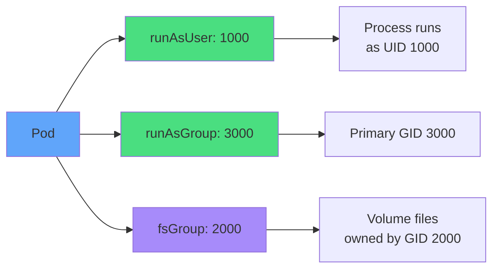
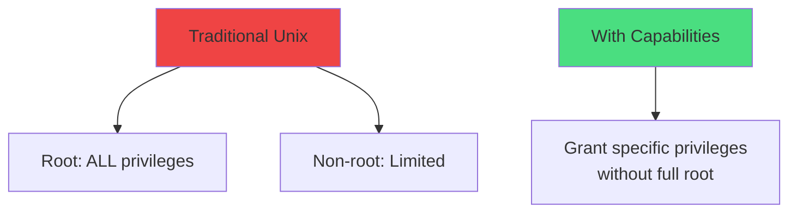
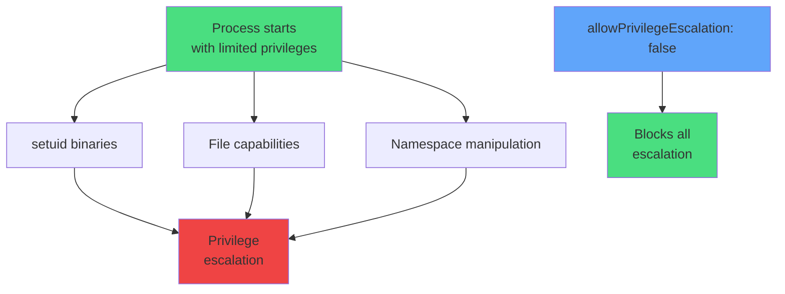
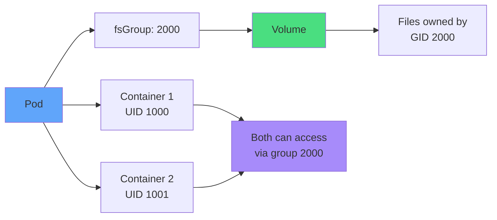
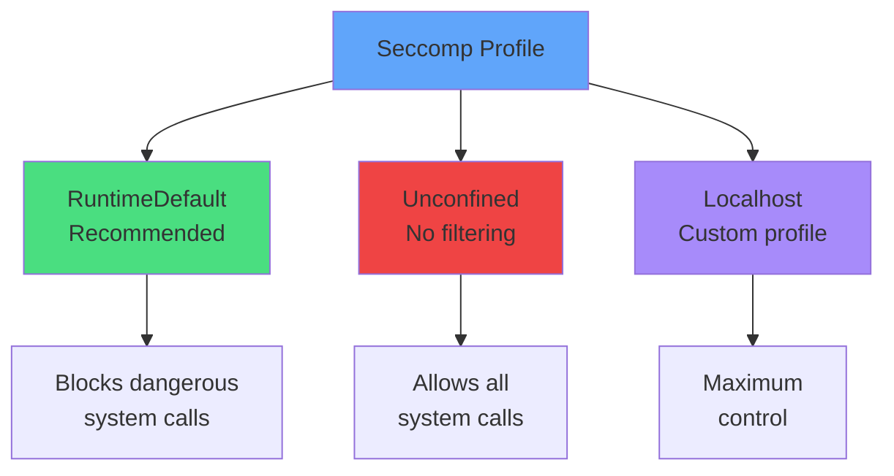
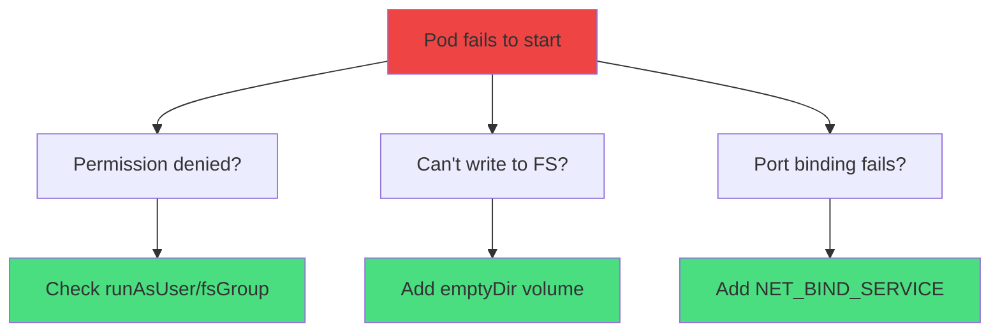
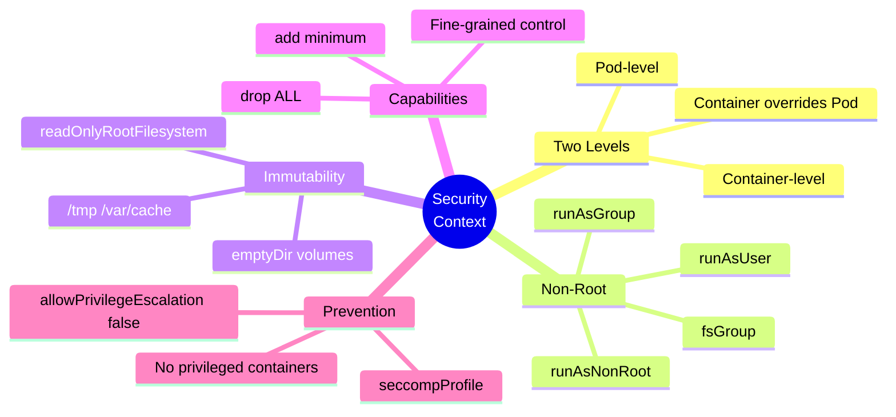
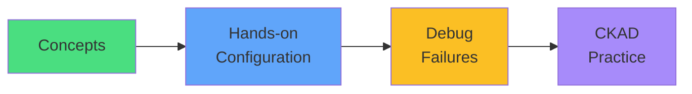

# Security Contexts

<div class="abs-br m-6 flex gap-2">
  <carbon-shield-security class="text-6xl text-blue-400" />
</div>

<!--
METADATA:
sentence: Security is often an afterthought in development, but in Kubernetes, it's a critical part of production readiness.
search_anchor: critical part of production readiness
-->
<div v-click class="mt-8 text-xl opacity-80">
Securing container execution in Kubernetes
</div>

---
layout: center
---

# The Security Problem

<!--
METADATA:
sentence: By default, containers often run as root. Let's understand why this is dangerous: Default behavior: Container processes run as root (UID 0), Full access to container filesystem, Can install packages, modify system files, If compromised, attacker has root privileges.
search_anchor: containers often run as root
-->
<div v-click="1">

```mermaid
graph TB
    D[Default Container]
    D --> R[Runs as root]
    D --> F[Full filesystem access]
    D --> C[All capabilities]
    D --> P[Can escalate privileges]
    ATK[Attacker exploits<br/>vulnerability]
    ATK --> COMP[Full container<br/>compromise]
    style D fill=#ef4444
    style ATK fill:#fbbf24
    style COMP fill:#ef4444
```

</div>

<!--
METADATA:
sentence: Real-world scenario: Imagine a web application with a vulnerability. An attacker exploits it and gains shell access. If the container runs as root: They can modify application code, Install malware or crypto miners, Potentially escape to the host, Access secrets and sensitive data, Pivot to other containers.
search_anchor: web application with a vulnerability
-->
<div v-click="2" class="mt-8 text-center text-red-400 text-xl">
<carbon-warning class="inline-block text-4xl" />
<strong>Default = Insecure</strong>
</div>

<!--
METADATA:
sentence: By default, containers often run as root. Let's understand why this is dangerous: Default behavior: Container processes run as root (UID 0), Full access to container filesystem, Can install packages, modify system files, If compromised, attacker has root privileges.
search_anchor: Full access to container filesystem
-->
<div v-click="3" class="mt-6 text-center text-sm opacity-80">
Containers often run as root with full privileges by default
</div>

---
layout: center
---

# Why Container Security Matters

<!--
METADATA:
sentence: Real-world scenario: Imagine a web application with a vulnerability. An attacker exploits it and gains shell access. If the container runs as root: They can modify application code, Install malware or crypto miners, Potentially escape to the host, Access secrets and sensitive data, Pivot to other containers.
search_anchor: Imagine a web application with a vulnerability
-->
<div v-click="1">

```mermaid
sequenceDiagram
    participant A as Attacker
    participant C as Container (root)
    participant H as Host
    A->>C: Exploit vulnerability
    C->>C: Shell access as root
    C->>C: Modify app code
    C->>C: Install malware
    C->>H: Attempt escape
    C->>H: Access host resources
    style C fill:#ef4444
    style H fill:#fbbf24
```

</div>

<!--
METADATA:
sentence: The solution: SecurityContexts provide fine-grained control over container privileges, implementing the principle of least privilege.
search_anchor: principle of least privilege
-->
<div v-click="2" class="mt-6 text-center">
<carbon-security class="inline-block text-4xl text-blue-400" />
<strong class="ml-2">Principle of least privilege</strong>
</div>

---
layout: center
---

# SecurityContext Architecture

<!--
METADATA:
sentence: Kubernetes provides SecurityContext at two levels: 1. Pod-level SecurityContext - Applied to all containers in the Pod - Defined in spec.securityContext - Controls user/group IDs, filesystem settings - Affects volume permissions - Sets default security posture.
search_anchor: SecurityContext at two levels
-->
<div v-click="1">

```mermaid
graph TB
    SC[SecurityContext]
    SC --> POD[Pod-level<br/>spec.securityContext]
    SC --> CON[Container-level<br/>containers[].securityContext]
    POD --> PF[User/Group IDs<br/>fsGroup<br/>Volume permissions]
    CON --> CF[Capabilities<br/>Privilege escalation<br/>Read-only FS<br/>Overrides Pod settings]
    style SC fill:#60a5fa
    style POD fill:#4ade80
    style CON fill:#a78bfa
```

</div>

<!--
METADATA:
sentence: Hierarchy: Container settings override Pod settings. This allows you to set secure defaults at the Pod level, then make exceptions for specific containers if needed.
search_anchor: Container settings override Pod settings
-->
<div v-click="2" class="mt-6 text-center text-lg">
<carbon-rule class="inline-block text-3xl text-yellow-400" />
Container settings override Pod settings
</div>

---
layout: center
---

# Running as Non-Root

<!--
METADATA:
sentence: One of the most important security practices is ensuring containers don't run as root.
search_anchor: ensuring containers don't run as root
-->
<div v-click="1" class="text-sm">

```yaml
apiVersion: v1
kind: Pod
spec:
  securityContext:
    runAsUser: 1000        # UID
    runAsGroup: 3000       # GID
    fsGroup: 2000          # Volume group
  containers:
  - name: app
    securityContext:
      runAsNonRoot: true   # Enforce non-root
```

</div>

<div class="grid grid-cols-2 gap-6 mt-8">
<!--
METADATA:
sentence: runAsUser (Pod or Container level) - Specifies the User ID (UID) for the container process - Example: runAsUser: 1000 runs as UID 1000 - Overrides the USER directive in the Dockerfile.
search_anchor: Specifies the User ID (UID)
-->
<div v-click="2">
<carbon-user class="text-4xl text-green-400 mb-2" />
<strong>runAsUser</strong><br/>
<span class="text-sm opacity-80">User ID (UID)</span>
</div>
<!--
METADATA:
sentence: runAsGroup (Pod or Container level) - Specifies the primary Group ID (GID) - Example: runAsGroup: 3000 - Files created by the process have this group ownership.
search_anchor: Specifies the primary Group ID (GID)
-->
<div v-click="3">
<carbon-user class="text-4xl text-blue-400 mb-2" />
<strong>runAsGroup</strong><br/>
<span class="text-sm opacity-80">Group ID (GID)</span>
</div>
</div>

---
layout: center
---

# User and Group Management

<!--
METADATA:
sentence: fsGroup (Pod level only) - Sets group ownership for mounted volumes - All files in volumes owned by this group - Allows non-root users to access shared storage.
search_anchor: Sets group ownership for mounted volumes
-->
<div v-click="1">



</div>

<!--
METADATA:
sentence: runAsNonRoot (Container level only) - Boolean field, typically runAsNonRoot: true - Enforces that the container doesn't run as root - If the image tries to run as root, the container fails to start - Acts as a safety check.
search_anchor: Enforces that the container doesn't run as root
-->
<div v-click="2" class="mt-6 text-center">
<carbon-checkmark class="inline-block text-3xl text-green-400" />
<strong>runAsNonRoot: true</strong> enforces non-root execution
</div>

---
layout: center
---

# Read-Only Root Filesystem

<!--
METADATA:
sentence: A powerful security technique is making the container filesystem read-only. readOnlyRootFilesystem: true.
search_anchor: making the container filesystem read-only
-->
<div v-click="1" class="text-sm">

```yaml
spec:
  containers:
  - name: app
    securityContext:
      readOnlyRootFilesystem: true
    volumeMounts:
    - name: tmp
      mountPath: /tmp
    - name: cache
      mountPath: /var/cache
  volumes:
  - name: tmp
    emptyDir: {}
  - name: cache
    emptyDir: {}
```

</div>

<!--
METADATA:
sentence: Challenge: Many applications need to write temporary files. Solution: Mount writable volumes for specific paths.
search_anchor: Mount writable volumes for specific paths
-->
<div v-click="2" class="mt-6">

```mermaid
graph TB
    FS[Filesystem]
    FS --> RO[/ read-only]
    FS --> W1[/tmp writable<br/>emptyDir]
    FS --> W2[/var/cache writable<br/>emptyDir]
    style FS fill:#60a5fa
    style RO fill:#ef4444
    style W1 fill:#4ade80
    style W2 fill:#4ade80
```

</div>

---
layout: center
---

# Read-Only Filesystem Benefits

<div class="grid grid-cols-2 gap-6 mt-6">
<!--
METADATA:
sentence: Benefits: Prevents attackers from modifying application code, Can't install tools or malware, Can't create backdoors, Enforces container immutability, Aligns with cloud-native principles.
search_anchor: Prevents attackers from modifying application code
-->
<div v-click="1">
<carbon-checkmark class="text-5xl text-green-400 mb-2" />
<strong>Benefits</strong><br/>
<div class="text-sm opacity-80 mt-2">
• Can't modify app code<br/>
• Can't install malware<br/>
• Can't create backdoors<br/>
• Immutable containers
</div>
</div>
<!--
METADATA:
sentence: Pattern: 1. Set readOnlyRootFilesystem: true, 2. Identify paths that need writes (logs, cache, temp files), 3. Mount emptyDir volumes for those paths, 4. Application works normally, but filesystem is otherwise immutable.
search_anchor: Identify paths that need writes
-->
<div v-click="2">
<carbon-warning class="text-5xl text-yellow-400 mb-2" />
<strong>Solution</strong><br/>
<div class="text-sm opacity-80 mt-2">
• Mount emptyDir volumes<br/>
• For /tmp, /var/cache<br/>
• For logs, temp files<br/>
• App works normally
</div>
</div>
</div>

---
layout: center
---

# Linux Capabilities

<!--
METADATA:
sentence: Linux capabilities divide root privileges into smaller units. Instead of all-or-nothing root access, you can grant specific capabilities.
search_anchor: divide root privileges into smaller units
-->
<div v-click="1">



</div>

<!--
METADATA:
sentence: With capabilities: Specific privileges can be granted without full root access.
search_anchor: Specific privileges can be granted
-->
<div v-click="2" class="mt-8 text-center">
<carbon-rule class="inline-block text-4xl text-blue-400" />
<strong class="ml-2">Fine-grained privilege control</strong>
</div>

---
layout: center
---

# Capability Management

<!--
METADATA:
sentence: capabilities.drop - Remove capabilities from the container - Best practice: drop: ["ALL"] - start with zero privileges - Then add only what's needed.
search_anchor: Remove capabilities from the container
-->
<div v-click="1" class="text-sm">

```yaml
securityContext:
  capabilities:
    drop: ["ALL"]              # Drop everything
    add: ["NET_BIND_SERVICE"]  # Add only what's needed
```

</div>

<div class="grid grid-cols-2 gap-6 mt-8 text-xs">
<!--
METADATA:
sentence: Best practice: drop: ["ALL"] - start with zero privileges - Then add only what's needed.
search_anchor: start with zero privileges
-->
<div v-click="2">
<carbon-close class="text-4xl text-red-400 mb-2" />
<strong>drop: ["ALL"]</strong><br/>
<span class="text-xs opacity-80">Start with zero privileges</span>
</div>
<!--
METADATA:
sentence: capabilities.add - Grant specific capabilities - Only add the minimum required.
search_anchor: Grant specific capabilities
-->
<div v-click="3">
<carbon-add class="text-4xl text-green-400 mb-2" />
<strong>add: [...]</strong><br/>
<span class="text-xs opacity-80">Grant minimum required</span>
</div>
</div>

<!--
METADATA:
sentence: "Drop everything, add only what's necessary."
search_anchor: Drop everything, add only what's necessary
-->
<div v-click="4" class="mt-8 text-center text-lg">
<carbon-checkmark class="inline-block text-3xl text-blue-400" />
Best practice: Drop all, add only what's necessary
</div>

---
layout: center
---

# Common Capabilities

<div class="grid grid-cols-2 gap-4 mt-4 text-xs">
<!--
METADATA:
sentence: NET_BIND_SERVICE - Bind to ports < 1024 - Web server on port 80/443.
search_anchor: Bind to ports < 1024
-->
<div v-click="1">
<carbon-network-3 class="text-3xl text-blue-400 mb-1" />
<strong>NET_BIND_SERVICE</strong><br/>
Bind to ports < 1024
</div>
<!--
METADATA:
sentence: NET_ADMIN - Configure network - Change routes, firewall rules.
search_anchor: Configure network
-->
<div v-click="2">
<carbon-network-3 class="text-3xl text-purple-400 mb-1" />
<strong>NET_ADMIN</strong><br/>
Configure network
</div>
<!--
METADATA:
sentence: CHOWN - Change file ownership - Backup tools.
search_anchor: Change file ownership
-->
<div v-click="3">
<carbon-document class="text-3xl text-green-400 mb-1" />
<strong>CHOWN</strong><br/>
Change file ownership
</div>
<!--
METADATA:
sentence: DAC_OVERRIDE - Bypass file permissions - Administrative tools.
search_anchor: Bypass file permissions
-->
<div v-click="4">
<carbon-locked class="text-3xl text-yellow-400 mb-1" />
<strong>DAC_OVERRIDE</strong><br/>
Bypass file permissions
</div>
<!--
METADATA:
sentence: SYS_TIME - Change system clock - NTP services.
search_anchor: Change system clock
-->
<div v-click="5">
<carbon-time class="text-3xl text-orange-400 mb-1" />
<strong>SYS_TIME</strong><br/>
Change system clock
</div>
<!--
METADATA:
sentence: SETUID/SETGID - Change user/group - Tools that need to switch users.
search_anchor: Change user/group
-->
<div v-click="6">
<carbon-user class="text-3xl text-red-400 mb-1" />
<strong>SETUID/SETGID</strong><br/>
Change user/group
</div>
</div>

<!--
METADATA:
sentence: Only add the minimum required.
search_anchor: minimum required
-->
<div v-click="7" class="mt-8 text-center text-sm opacity-80">
Grant only the minimum capabilities needed for your application
</div>

---
layout: center
---

# Preventing Privilege Escalation

<!--
METADATA:
sentence: Even if a container starts with limited privileges, certain mechanisms could allow it to gain more privileges. We need to prevent this.
search_anchor: certain mechanisms could allow it to gain more privileges
-->
<div v-click="1">



</div>

<!--
METADATA:
sentence: allowPrivilegeEscalation - Boolean field (true/false) - Controls whether a process can gain more privileges than its parent - Set to false to prevent escalation.
search_anchor: Controls whether a process can gain more privileges
-->
<div v-click="2" class="mt-6 text-sm">

```yaml
securityContext:
  allowPrivilegeEscalation: false
```

</div>

---
layout: center
---

# Privileged Containers

<!--
METADATA:
sentence: Privileged containers have almost all the same access as processes running on the host. privileged: true. What it grants: Access to all host devices (/dev/*), Ability to modify kernel parameters, Mount host filesystems, Bypass most security constraints, Essentially root on the host.
search_anchor: Privileged containers have almost all the same access
-->
<div v-click="1">

```mermaid
graph TB
    PRIV[privileged: true]
    PRIV --> D[Access all host devices]
    PRIV --> K[Modify kernel parameters]
    PRIV --> M[Mount host filesystems]
    PRIV --> B[Bypass security constraints]
    PRIV --> ROOT[Essentially root<br/>on host]
    style PRIV fill:#ef4444
    style ROOT fill=#ef4444
```

</div>

<!--
METADATA:
sentence: Best practice: Treat privileged: true as a red flag. There's almost always a better way using specific capabilities.
search_anchor: Treat privileged: true as a red flag
-->
<div v-click="2" class="mt-8 text-center text-red-400 text-xl">
<carbon-warning class="inline-block text-4xl" />
<strong>Treat as red flag - almost always a better way!</strong>
</div>

---
layout: center
---

# When to Use Privileged

<div class="grid grid-cols-2 gap-6 mt-6">
<!--
METADATA:
sentence: When (rarely) needed: System-level monitoring tools (node agents), Container runtime management, Network plugins (CNI), Storage plugins (CSI), Hardware access requirements.
search_anchor: When (rarely) needed
-->
<div v-click="1">
<carbon-checkmark class="text-5xl text-yellow-400 mb-2" />
<strong>Rarely needed for:</strong><br/>
<div class="text-sm opacity-80 mt-2">
• System monitoring tools<br/>
• Container runtime mgmt<br/>
• Network plugins (CNI)<br/>
• Storage plugins (CSI)
</div>
</div>
<!--
METADATA:
sentence: CKAD perspective: You should understand what privileged containers are, but in the exam, you'll likely be asked to avoid them and use more secure alternatives.
search_anchor: likely be asked to avoid them
-->
<div v-click="2">
<carbon-close class="text-5xl text-red-400 mb-2" />
<strong>Avoid for:</strong><br/>
<div class="text-sm opacity-80 mt-2">
• Application workloads<br/>
• Web services<br/>
• APIs<br/>
• Most use cases
</div>
</div>
</div>

<!--
METADATA:
sentence: Best practice: Treat privileged: true as a red flag. There's almost always a better way using specific capabilities.
search_anchor: better way using specific capabilities
-->
<div v-click="3" class="mt-8 text-center text-lg">
<carbon-rule class="inline-block text-3xl text-blue-400" />
Use specific capabilities instead
</div>

---
layout: center
---

# Filesystem Group (fsGroup)

<!--
METADATA:
sentence: When multiple containers or Pods need to access shared volumes, you need to manage permissions carefully. fsGroup (Pod-level only).
search_anchor: access shared volumes
-->
<div v-click="1">



</div>

<!--
METADATA:
sentence: What it does: Sets group ownership on mounted volumes, All containers in the Pod are part of this group, Files created have this group ownership, Allows coordinated access to shared storage.
search_anchor: All containers in the Pod are part of this group
-->
<div v-click="2" class="mt-6 text-center">
<carbon-data-volume class="inline-block text-4xl text-green-400" />
<strong class="ml-2">Shared volume access for non-root containers</strong>
</div>

---
layout: center
---

# Seccomp Profiles

<!--
METADATA:
sentence: Seccomp (Secure Computing Mode) restricts which system calls a container can make. seccompProfile.
search_anchor: restricts which system calls a container can make
-->
<div v-click="1">



</div>

<!--
METADATA:
sentence: RuntimeDefault (recommended) - Uses the container runtime's default seccomp profile - Blocks dangerous system calls - Good balance of security and compatibility - Works for most applications.
search_anchor: Uses the container runtime's default seccomp profile
-->
<div v-click="2" class="mt-6 text-sm">

```yaml
securityContext:
  seccompProfile:
    type: RuntimeDefault
```

</div>

---
layout: center
---

# Complete Security Baseline

<!--
METADATA:
sentence: Essential security baseline: runAsNonRoot: true, runAsUser: 1000, readOnlyRootFilesystem: true, allowPrivilegeEscalation: false, capabilities drop: ["ALL"], seccompProfile type: RuntimeDefault.
search_anchor: Essential security baseline
-->
<div v-click="1" class="text-sm">

```yaml
apiVersion: v1
kind: Pod
spec:
  securityContext:
    runAsNonRoot: true
    runAsUser: 1000
    fsGroup: 2000
  containers:
  - name: app
    image: myapp
    securityContext:
      allowPrivilegeEscalation: false
      readOnlyRootFilesystem: true
      capabilities:
        drop: ["ALL"]
      seccompProfile:
        type: RuntimeDefault
    volumeMounts:
    - name: tmp
      mountPath: /tmp
  volumes:
  - name: tmp
    emptyDir: {}
```

</div>

---
layout: center
---

# Security Best Practices

<div class="grid grid-cols-2 gap-4 mt-4 text-sm">
<!--
METADATA:
sentence: DO: Always run as non-root, Use read-only filesystems when possible, Drop all capabilities by default, Prevent privilege escalation, Use RuntimeDefault seccomp, Set resource limits (defense in depth).
search_anchor: Always run as non-root
-->
<div v-click="1">
<carbon-checkmark class="text-4xl text-green-400 mb-2" />
<strong>Always run as non-root</strong><br/>
<span class="text-xs opacity-80">Use runAsNonRoot: true</span>
</div>
<!--
METADATA:
sentence: Use read-only filesystems when possible.
search_anchor: Use read-only filesystems when possible
-->
<div v-click="2">
<carbon-checkmark class="text-4xl text-green-400 mb-2" />
<strong>Read-only filesystem</strong><br/>
<span class="text-xs opacity-80">With emptyDir for writes</span>
</div>
<!--
METADATA:
sentence: Drop all capabilities by default.
search_anchor: Drop all capabilities by default
-->
<div v-click="3">
<carbon-checkmark class="text-4xl text-green-400 mb-2" />
<strong>Drop all capabilities</strong><br/>
<span class="text-xs opacity-80">Add only what's needed</span>
</div>
<!--
METADATA:
sentence: Prevent privilege escalation.
search_anchor: Prevent privilege escalation
-->
<div v-click="4">
<carbon-checkmark class="text-4xl text-green-400 mb-2" />
<strong>Prevent escalation</strong><br/>
<span class="text-xs opacity-80">allowPrivilegeEscalation: false</span>
</div>
<!--
METADATA:
sentence: Use RuntimeDefault seccomp.
search_anchor: Use RuntimeDefault seccomp
-->
<div v-click="5">
<carbon-checkmark class="text-4xl text-green-400 mb-2" />
<strong>Use RuntimeDefault seccomp</strong><br/>
<span class="text-xs opacity-80">Block dangerous syscalls</span>
</div>
<!--
METADATA:
sentence: Set resource limits (defense in depth).
search_anchor: Set resource limits (defense in depth)
-->
<div v-click="6">
<carbon-checkmark class="text-4xl text-green-400 mb-2" />
<strong>Set resource limits</strong><br/>
<span class="text-xs opacity-80">Defense in depth</span>
</div>
</div>

---
layout: center
---

# What NOT to Do

<div class="grid grid-cols-2 gap-6 mt-6">
<!--
METADATA:
sentence: DON'T: Run as root, Use privileged containers, Add unnecessary capabilities, Allow privilege escalation, Skip security contexts.
search_anchor: DON'T: Run as root
-->
<div v-click="1">
<carbon-close class="text-5xl text-red-400 mb-2" />
<strong>Run as root</strong><br/>
<span class="text-sm opacity-80">Major security risk</span>
</div>
<!--
METADATA:
sentence: Use privileged containers.
search_anchor: Use privileged containers
-->
<div v-click="2">
<carbon-close class="text-5xl text-red-400 mb-2" />
<strong>Use privileged containers</strong><br/>
<span class="text-sm opacity-80">Almost never needed</span>
</div>
<!--
METADATA:
sentence: Add unnecessary capabilities.
search_anchor: Add unnecessary capabilities
-->
<div v-click="3">
<carbon-close class="text-5xl text-red-400 mb-2" />
<strong>Add unnecessary capabilities</strong><br/>
<span class="text-sm opacity-80">Principle of least privilege</span>
</div>
<!--
METADATA:
sentence: Allow privilege escalation.
search_anchor: Allow privilege escalation
-->
<div v-click="4">
<carbon-close class="text-5xl text-red-400 mb-2" />
<strong>Allow privilege escalation</strong><br/>
<span class="text-sm opacity-80">Opens attack vectors</span>
</div>
<!--
METADATA:
sentence: Skip security contexts.
search_anchor: Skip security contexts
-->
<div v-click="5">
<carbon-close class="text-5xl text-red-400 mb-2" />
<strong>Skip security contexts</strong><br/>
<span class="text-sm opacity-80">Default is insecure</span>
</div>
<!--
METADATA:
sentence: Set readOnlyRootFilesystem: true, Identify paths that need writes (logs, cache, temp files), Mount emptyDir volumes for those paths.
search_anchor: Identify paths that need writes
-->
<div v-click="6">
<carbon-close class="text-5xl text-red-400 mb-2" />
<strong>Writable root filesystem</strong><br/>
<span class="text-sm opacity-80">Allows code modification</span>
</div>
</div>

---
layout: center
---

# CKAD Exam Tips

<!--
METADATA:
sentence: This is essential knowledge for the CKAD exam and for running secure production workloads.
search_anchor: essential knowledge for the CKAD exam
-->
<div v-click="1" class="text-center mb-6">
<carbon-certificate class="inline-block text-6xl text-blue-400" />
</div>

<div class="grid grid-cols-2 gap-4 text-sm">
<!--
METADATA:
sentence: runAsUser (Pod or Container level) - Specifies the User ID (UID) for the container process.
search_anchor: Configure runAsUser/runAsGroup
-->
<div v-click="2">
<carbon-user class="inline-block text-2xl text-green-400" /> Configure runAsUser/runAsGroup
</div>
<!--
METADATA:
sentence: A powerful security technique is making the container filesystem read-only. readOnlyRootFilesystem: true.
search_anchor: readOnlyRootFilesystem: true
-->
<div v-click="3">
<carbon-locked class="inline-block text-2xl text-green-400" /> Set readOnlyRootFilesystem
</div>
<!--
METADATA:
sentence: Best practice: drop: ["ALL"] - start with zero privileges.
search_anchor: drop: ["ALL"]
-->
<div v-click="4">
<carbon-rule class="inline-block text-2xl text-green-400" /> Drop all capabilities
</div>
<!--
METADATA:
sentence: Critical for CKAD: When running as non-root, ALWAYS set allowPrivilegeEscalation: false.
search_anchor: ALWAYS set allowPrivilegeEscalation: false
-->
<div v-click="5">
<carbon-warning class="inline-block text-2xl text-green-400" /> Prevent privilege escalation
</div>
<!--
METADATA:
sentence: CKAD tip: This is a common exam requirement. Practice adding emptyDir volumes for /tmp quickly.
search_anchor: adding emptyDir volumes for /tmp
-->
<div v-click="6">
<carbon-data-volume class="inline-block text-2xl text-green-400" /> Add emptyDir for /tmp
</div>
<!--
METADATA:
sentence: CKAD tip: If a question involves shared volumes with non-root containers, you'll likely need fsGroup.
search_anchor: you'll likely need fsGroup
-->
<div v-click="7">
<carbon-debug class="inline-block text-2xl text-green-400" /> Troubleshoot permission errors
</div>
</div>

<!--
METADATA:
sentence: Essential security baseline: runAsNonRoot: true, runAsUser: 1000, readOnlyRootFilesystem: true, allowPrivilegeEscalation: false, capabilities drop: ["ALL"], seccompProfile type: RuntimeDefault.
search_anchor: Practice the complete security baseline
-->
<div v-click="8" class="mt-8 text-center text-lg">
<carbon-timer class="inline-block text-3xl text-red-400" />
Practice the complete security baseline!
</div>

---
layout: center
---

# Troubleshooting Security Issues

<!--
METADATA:
sentence: If the image tries to run as root, the container fails to start.
search_anchor: container fails to start
-->
<div v-click="1">



</div>

<!--
METADATA:
sentence: Check Pod events using kubectl describe pod, Check logs using kubectl logs.
search_anchor: Check Pod events
-->
<div v-click="2" class="mt-6 text-sm">

```bash
# Check Pod events
kubectl describe pod myapp

# Check logs
kubectl logs myapp

# Common errors: Permission denied, Read-only file system
```

</div>

---
layout: center
---

# Summary

<!--
METADATA:
sentence: Key takeaways participants should understand: Two levels: Pod-level and container-level SecurityContexts, Container settings override Pod settings, runAsNonRoot enforces non-root execution, readOnlyRootFilesystem creates immutable containers, Capabilities provide fine-grained privilege control, allowPrivilegeEscalation: false prevents escalation, fsGroup manages volume permissions for non-root users, Privileged containers should be avoided, RuntimeDefault seccomp is the recommended baseline.
search_anchor: Key takeaways participants should understand
-->
<div v-click="1">



</div>

---
layout: center
---

# Key Takeaways

<div class="grid grid-cols-2 gap-6 mt-6">
<!--
METADATA:
sentence: Key takeaways participants should understand: Two levels: Pod-level and container-level SecurityContexts.
search_anchor: Two levels: Pod-level and container-level
-->
<div v-click="1">
<carbon-user class="text-4xl text-blue-400 mb-2" />
<strong>Always non-root</strong><br/>
<span class="text-sm opacity-80">Use runAsNonRoot: true</span>
</div>
<!--
METADATA:
sentence: readOnlyRootFilesystem creates immutable containers.
search_anchor: creates immutable containers
-->
<div v-click="2">
<carbon-locked class="text-4xl text-green-400 mb-2" />
<strong>Read-only filesystem</strong><br/>
<span class="text-sm opacity-80">Immutable containers</span>
</div>
<!--
METADATA:
sentence: Capabilities provide fine-grained privilege control.
search_anchor: fine-grained privilege control
-->
<div v-click="3">
<carbon-rule class="text-4xl text-purple-400 mb-2" />
<strong>Drop all capabilities</strong><br/>
<span class="text-sm opacity-80">Add only what's needed</span>
</div>
<!--
METADATA:
sentence: allowPrivilegeEscalation: false prevents escalation.
search_anchor: allowPrivilegeEscalation: false prevents escalation
-->
<div v-click="4">
<carbon-warning class="text-4xl text-yellow-400 mb-2" />
<strong>Prevent escalation</strong><br/>
<span class="text-sm opacity-80">allowPrivilegeEscalation: false</span>
</div>
</div>

<!--
METADATA:
sentence: Security is often an afterthought in development, but in Kubernetes, it's a critical part of production readiness.
search_anchor: essential for production
-->
<div v-click="5" class="mt-8 text-center text-xl">
Security is not optional - it's essential for production
</div>

---
layout: center
---

# Next Steps

<!--
METADATA:
sentence: Now that we understand SecurityContext concepts, let's see them in action.
search_anchor: let's see them in action
-->
<div v-click="1" class="text-center mb-8">
<carbon-education class="inline-block text-6xl text-blue-400" />
</div>

<!--
METADATA:
sentence: In the exercises section, we'll: Compare root vs non-root containers, Implement read-only filesystems with writable volumes, Work with Linux capabilities, Debug security-related Pod failures, Build a secure nginx deployment from scratch.
search_anchor: Compare root vs non-root containers
-->
<div v-click="2">



</div>

<!--
METADATA:
sentence: Let's make these concepts practical!
search_anchor: Let's make these concepts practical
-->
<div v-click="3" class="mt-8 text-center text-xl">
Let's secure our applications! <carbon-arrow-right class="inline-block text-2xl" />
</div>
