# Kubernetes Services

<div class="abs-br m-6 flex gap-2">
  <carbon-network-3 class="text-6xl text-blue-400" />
</div>

<!--
METADATA:
sentence: Services are one of the core concepts in Kubernetes and absolutely essential for the CKAD exam.
search_anchor: core concepts in Kubernetes
-->
<div v-click class="mt-8 text-xl opacity-80">
Stable networking for ephemeral Pods
</div>

---
layout: center
---

# The Pod Networking Challenge

<!--
METADATA:
sentence: In Kubernetes, every Pod gets its own IP address.
search_anchor: every Pod gets its own IP address
-->
<div v-click="1">

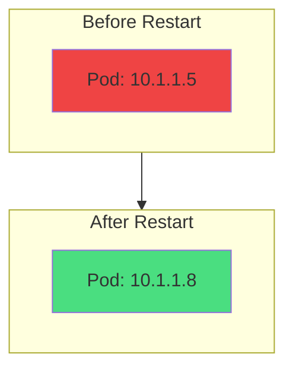

</div>

<!--
METADATA:
sentence: That sounds great for networking, but there's a significant challenge - Pod IP addresses are ephemeral.
search_anchor: Pod IP addresses are ephemeral
-->
<div v-click="2" class="mt-8 text-center">
<carbon-warning class="inline-block text-4xl text-yellow-400" />
<strong class="ml-2">Pod IP addresses are ephemeral</strong>
</div>

<div class="grid grid-cols-2 gap-4 mt-6 text-sm">
<!--
METADATA:
sentence: When a Pod is deleted and recreated, it gets a completely new IP address.
search_anchor: gets a completely new IP address
-->
<div v-click="3">
<carbon-restart class="inline-block text-2xl text-red-400" /> Pods restart → New IP
</div>
<!--
METADATA:
sentence: If you have multiple replicas of your backend, each has a different IP address.
search_anchor: multiple replicas of your backend
-->
<div v-click="4">
<carbon-categories class="inline-block text-2xl text-blue-400" /> Multiple replicas → Different IPs
</div>
</div>

<!--
METADATA:
sentence: How does your frontend know which Pod to talk to?
search_anchor: which Pod to talk to
-->
<div v-click="5" class="mt-6 text-center text-lg">
How do clients reliably connect to Pods?
</div>

---
layout: center
---

# What is a Service?

<!--
METADATA:
sentence: A Service is a Kubernetes resource that provides a stable IP address and DNS name for accessing a set of Pods.
search_anchor: stable IP address and DNS name
-->
<div v-click="1">

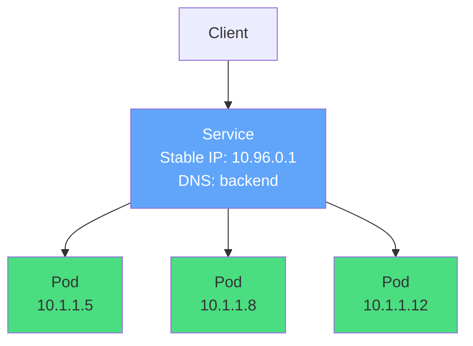

</div>

<div class="grid grid-cols-2 gap-6 mt-8">
<!--
METADATA:
sentence: Think of a Service as an internal load balancer.
search_anchor: internal load balancer
-->
<div v-click="2">
<carbon-network-3 class="text-4xl text-blue-400 mb-2" />
<strong>Stable IP & DNS</strong><br/>
<span class="text-sm opacity-80">Never changes</span>
</div>
<!--
METADATA:
sentence: Traffic comes into the Service through its stable IP address and DNS name, and the Service routes that traffic to one of the matching Pods.
search_anchor: routes that traffic to one of the matching Pods
-->
<div v-click="3">
<carbon-flow class="text-4xl text-green-400 mb-2" />
<strong>Load Balancer</strong><br/>
<span class="text-sm opacity-80">Routes to healthy Pods</span>
</div>
</div>

<!--
METADATA:
sentence: Services and Pods are loosely coupled through label selectors.
search_anchor: loosely coupled through label selectors
-->
<div v-click="4" class="mt-6 text-center text-lg">
<carbon-tag class="inline-block text-2xl text-purple-400" /> Loosely coupled via label selectors
</div>

---
layout: center
---

# Service Discovery Through DNS

<!--
METADATA:
sentence: One of the most powerful features of Services is automatic DNS integration.
search_anchor: automatic DNS integration
-->
<div v-click="1">

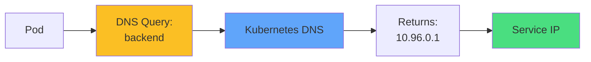

</div>

<div class="grid grid-cols-2 gap-6 mt-8 text-sm">
<!--
METADATA:
sentence: Kubernetes runs a DNS server inside the cluster.
search_anchor: DNS server inside the cluster
-->
<div v-click="2">
<carbon-document class="inline-block text-3xl text-green-400" />
<strong>Same Namespace:</strong><br/>
<code>http://backend</code>
</div>
<!--
METADATA:
sentence: Every time you create a Service, Kubernetes automatically creates a DNS entry for it.
search_anchor: automatically creates a DNS entry
-->
<div v-click="3">
<carbon-network-overlay class="inline-block text-3xl text-blue-400" />
<strong>Other Namespace:</strong><br/>
<code>http://backend.prod</code>
</div>
</div>

<!--
METADATA:
sentence: This means your applications can use simple DNS names like "backend" or "database" instead of IP addresses.
search_anchor: simple DNS names like
-->
<div v-click="4" class="mt-8 text-center text-lg">
<carbon-checkmark class="inline-block text-2xl text-green-400" /> No IPs in application code!
</div>

<!--
METADATA:
sentence: The same application code works in development, staging, and production without changes.
search_anchor: same application code works
-->
<div v-click="5" class="mt-4 text-center text-sm opacity-80">
Same code works in dev, staging, and production
</div>

---
layout: center
---

# ClusterIP Services

<!--
METADATA:
sentence: Let's talk about the first Service type - ClusterIP. This is the default type and it's for internal cluster communication.
search_anchor: default type and it's for internal cluster communication
-->
<div v-click="1">

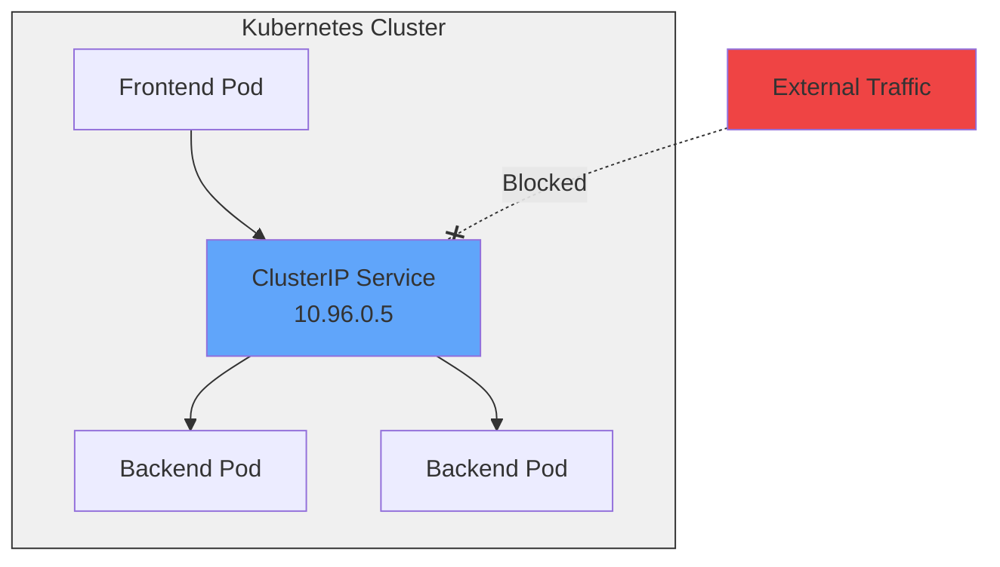

</div>

<div class="grid grid-cols-2 gap-6 mt-8">
<!--
METADATA:
sentence: A ClusterIP Service gets an IP address that's only accessible from within the cluster.
search_anchor: only accessible from within the cluster
-->
<div v-click="2">
<carbon-locked class="text-4xl text-blue-400 mb-2" />
<strong>Internal Only</strong><br/>
<span class="text-sm opacity-80">Only accessible within cluster</span>
</div>
<!--
METADATA:
sentence: No external traffic can reach it - it's purely for Pod-to-Pod communication.
search_anchor: purely for Pod-to-Pod communication
-->
<div v-click="3">
<carbon-deployment-pattern class="text-4xl text-green-400 mb-2" />
<strong>Default Type</strong><br/>
<span class="text-sm opacity-80">Most common service type</span>
</div>
</div>

<!--
METADATA:
sentence: This is what you use for backend services, databases, internal APIs, and any component that should only be accessible internally.
search_anchor: backend services, databases, internal APIs
-->
<div v-click="4" class="mt-6 text-center text-sm">
<carbon-database class="inline-block text-2xl text-purple-400" /> Perfect for: databases, internal APIs, backend services
</div>

---
layout: center
---

# NodePort Services

<!--
METADATA:
sentence: When you need to expose an application to external traffic, you have two main options. Let's start with NodePort Services.
search_anchor: expose an application to external traffic
-->
<div v-click="1">

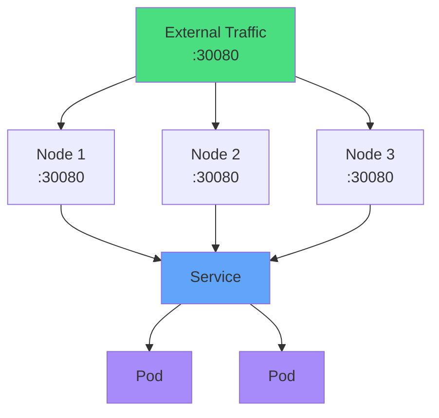

</div>

<div class="grid grid-cols-2 gap-6 mt-6 text-sm">
<!--
METADATA:
sentence: A NodePort Service opens a specific port on every node in your cluster.
search_anchor: specific port on every node
-->
<div v-click="2">
<carbon-network-public class="inline-block text-3xl text-green-400" />
<strong>External Access</strong><br/>
Port 30000-32767 on every node
</div>
<!--
METADATA:
sentence: NodePort Services work on any Kubernetes cluster, which makes them very portable.
search_anchor: work on any Kubernetes cluster
-->
<div v-click="3">
<carbon-portable class="inline-block text-3xl text-blue-400" />
<strong>Universal</strong><br/>
Works on any Kubernetes cluster
</div>
</div>

<!--
METADATA:
sentence: However, they're not ideal for production because users need to know the node IP addresses and remember port numbers like 30080.
search_anchor: not ideal for production
-->
<div v-click="4" class="mt-6 text-center text-yellow-400 text-sm">
<carbon-warning class="inline-block text-2xl" /> Users need to know node IPs and weird ports
</div>

---
layout: center
---

# LoadBalancer Services

<!--
METADATA:
sentence: LoadBalancer Services are the preferred way to expose applications externally, when your cluster supports them.
search_anchor: preferred way to expose applications externally
-->
<div v-click="1">

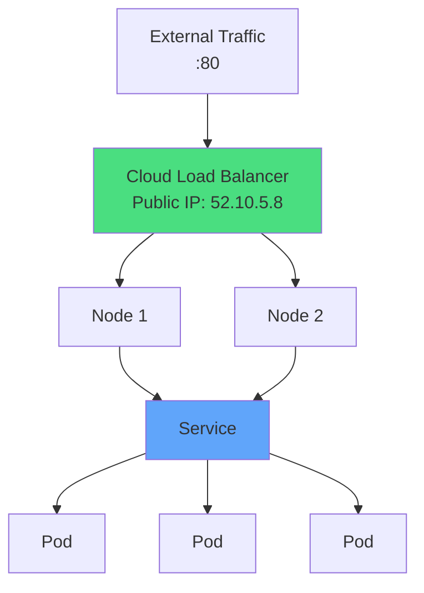

</div>

<div class="grid grid-cols-2 gap-6 mt-6 text-sm">
<!--
METADATA:
sentence: When you create a LoadBalancer Service, Kubernetes integrates with the underlying cloud platform to provision an actual load balancer.
search_anchor: integrates with the underlying cloud platform
-->
<div v-click="2">
<carbon-cloud class="text-4xl text-green-400 mb-2" />
<strong>Cloud Integration</strong><br/>
AWS ELB, Azure LB, GCP Load Balancer
</div>
<!--
METADATA:
sentence: LoadBalancers are much more user-friendly than NodePorts. Users just connect to a normal IP address on standard ports like 80 or 443.
search_anchor: much more user-friendly than NodePorts
-->
<div v-click="3">
<carbon-user class="text-4xl text-blue-400 mb-2" />
<strong>User Friendly</strong><br/>
Standard ports, no node IPs
</div>
</div>

<!--
METADATA:
sentence: However, LoadBalancers have two limitations. First, they only work in environments that support them - cloud platforms and some local environments like Docker Desktop. Second, each LoadBalancer Service typically gets its own public IP, which can be expensive in cloud environments.
search_anchor: LoadBalancers have two limitations
-->
<div v-click="4" class="mt-6 text-center text-sm text-yellow-400">
<carbon-warning class="inline-block text-2xl" /> Each service gets its own IP (can be expensive)
</div>

---
layout: center
---

# ExternalName Services

<!--
METADATA:
sentence: There's one more Service type that's less commonly used but important to know for the CKAD exam - ExternalName.
search_anchor: less commonly used but important
-->
<div v-click="1">

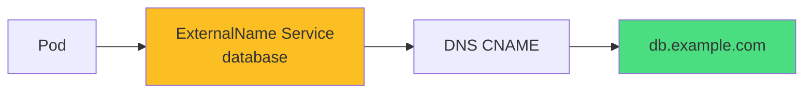

</div>

<!--
METADATA:
sentence: An ExternalName Service doesn't route to Pods at all. Instead, it creates a DNS CNAME record that points to an external DNS name.
search_anchor: creates a DNS CNAME record
-->
<div v-click="2" class="mt-8 text-center">
<carbon-link class="inline-block text-4xl text-purple-400" />
<strong class="ml-2">Creates DNS alias to external service</strong>
</div>

<!--
METADATA:
sentence: This is useful for gradually migrating services into Kubernetes, or for referencing external services in a way that's easy to change later.
search_anchor: gradually migrating services
-->
<div v-click="3" class="mt-6">

```yaml
kind: Service
spec:
  type: ExternalName
  externalName: db.example.com
```

</div>

<!--
METADATA:
sentence: If you want to move that database into your cluster, you just change the Service from ExternalName to ClusterIP - your application code doesn't change at all.
search_anchor: application code doesn't change
-->
<div v-click="4" class="mt-6 text-center text-sm">
<carbon-migration class="inline-block text-2xl text-blue-400" /> Useful for gradual migrations
</div>

<!--
METADATA:
sentence: This is useful for gradually migrating services into Kubernetes, or for referencing external services in a way that's easy to change later.
search_anchor: Switch from external to internal
-->
<div v-click="5" class="text-center text-xs opacity-80">
Switch from external to internal without changing app code
</div>

---
layout: center
---

# How Services Work: Endpoints

<!--
METADATA:
sentence: When you create a Service with a label selector, Kubernetes automatically creates an Endpoints object.
search_anchor: automatically creates an Endpoints object
-->
<div v-click="1">

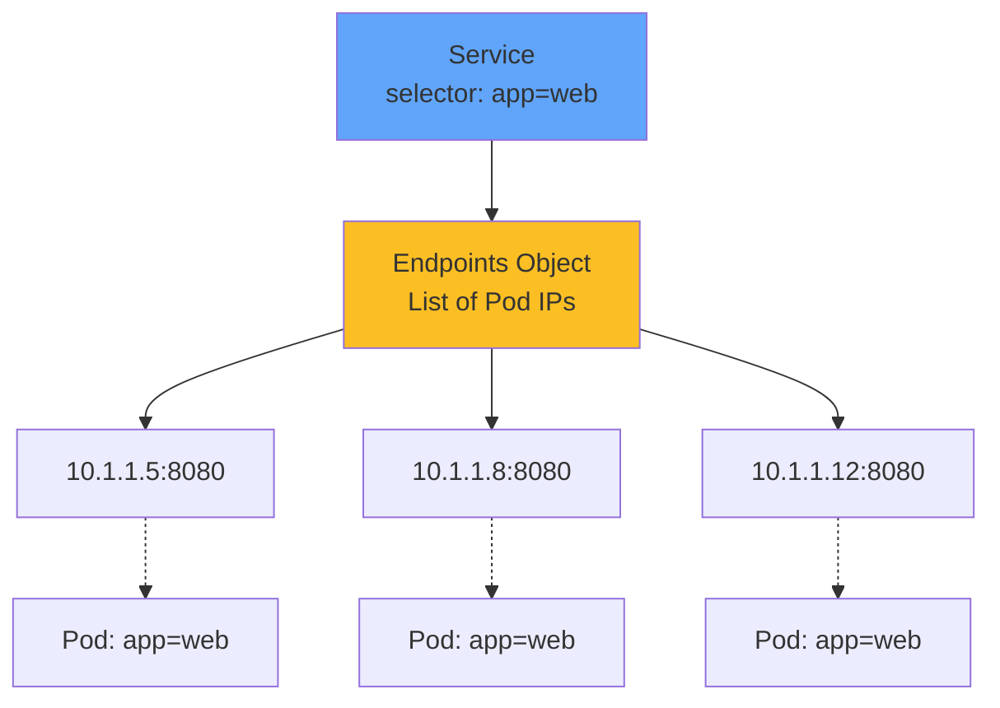

</div>

<div class="grid grid-cols-2 gap-6 mt-8 text-sm">
<!--
METADATA:
sentence: As Pods are created and destroyed, the Endpoints object is automatically updated.
search_anchor: Endpoints object is automatically updated
-->
<div v-click="2">
<carbon-automatic class="inline-block text-3xl text-green-400" />
<strong>Automatic Updates</strong><br/>
Endpoints track matching Pods
</div>
<!--
METADATA:
sentence: For the CKAD exam, you should know how to check endpoints to troubleshoot Service issues.
search_anchor: check endpoints to troubleshoot
-->
<div v-click="3">
<carbon-search class="inline-block text-3xl text-blue-400" />
<strong>Troubleshooting</strong><br/>
Check endpoints to debug
</div>
</div>

<!--
METADATA:
sentence: If a Service isn't working, checking the endpoints will tell you if any Pods matched the selector.
search_anchor: endpoints will tell you if any Pods matched
-->
<div v-click="4" class="mt-6 text-center">

```bash
kubectl get endpoints my-service
```

</div>

<!--
METADATA:
sentence: If a Service isn't working, checking the endpoints will tell you if any Pods matched the selector.
search_anchor: Check label selectors
-->
<div v-click="5" class="text-center text-sm opacity-80">
No endpoints? Check label selectors!
</div>

---
layout: center
---

# Label Selectors

<!--
METADATA:
sentence: The connection between Services and Pods is entirely based on label selectors.
search_anchor: entirely based on label selectors
-->
<div v-click="1">

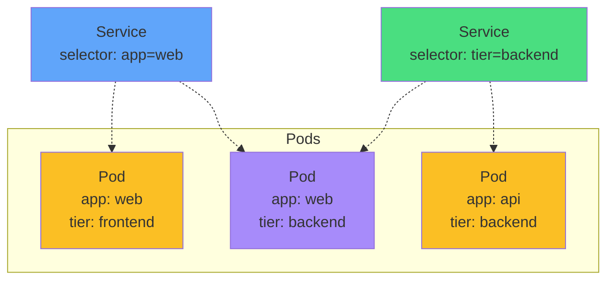

</div>

<!--
METADATA:
sentence: In your Service spec, you define a selector with one or more labels - for example, "app: whoami" and "tier: frontend". Kubernetes continuously queries for Pods with matching labels and updates the Service endpoints accordingly.
search_anchor: continuously queries for Pods with matching labels
-->
<div v-click="2" class="mt-8 text-center text-lg">
<carbon-tag class="inline-block text-3xl text-blue-400" /> Service → Pods via labels
</div>

<!--
METADATA:
sentence: If your Pod labels don't match the Service selector, traffic won't reach them.
search_anchor: Pod labels don't match the Service selector
-->
<div v-click="3" class="mt-6 text-center text-yellow-400 text-sm">
<carbon-warning class="inline-block text-2xl" /> Most common issue: label mismatch!
</div>

<!--
METADATA:
sentence: For the CKAD exam, you'll frequently need to create Services that match existing Pods, or troubleshoot why a Service can't find its Pods.
search_anchor: troubleshoot why a Service can't find its Pods
-->
<div v-click="4" class="mt-4 text-center text-xs opacity-80">
Service selector must match Pod labels exactly
</div>

---
layout: center
---

# Service Ports Configuration

<!--
METADATA:
sentence: Let's talk about how ports work with Services. There are three different port numbers to understand.
search_anchor: three different port numbers
-->
<div v-click="1">

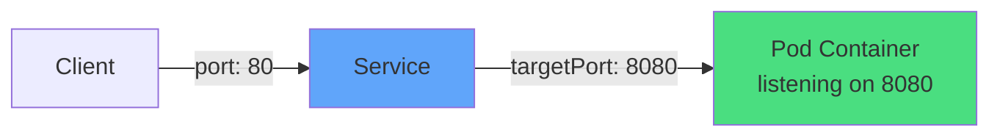

</div>

<div class="grid grid-cols-3 gap-4 mt-8 text-sm">
<!--
METADATA:
sentence: The port is what the Service listens on. This is what clients use to connect to the Service.
search_anchor: port is what the Service listens on
-->
<div v-click="2" class="text-center">
<carbon-port class="text-4xl text-blue-400 mb-2" />
<strong>port</strong><br/>
Service listens on
</div>
<!--
METADATA:
sentence: The targetPort is the port on the Pod where traffic actually gets sent. This must match the port your container is listening on.
search_anchor: targetPort is the port on the Pod
-->
<div v-click="3" class="text-center">
<carbon-container-software class="text-4xl text-green-400 mb-2" />
<strong>targetPort</strong><br/>
Pod container port
</div>
<!--
METADATA:
sentence: The nodePort only applies to NodePort and LoadBalancer Services. This is the port opened on every node for external access.
search_anchor: nodePort only applies to NodePort
-->
<div v-click="4" class="text-center">
<carbon-network-public class="text-4xl text-purple-400 mb-2" />
<strong>nodePort</strong><br/>
External port (30000+)
</div>
</div>

<!--
METADATA:
sentence: You can have a Service that listens on port 80, forwards to targetPort 8080 on the Pods, and is externally accessible on nodePort 30080.
search_anchor: listens on port 80, forwards to targetPort 8080
-->
<div v-click="5" class="mt-8">

```yaml
ports:
- port: 80          # Service port
  targetPort: 8080  # Container port
  nodePort: 30080   # External port (optional)
```

</div>

---
layout: center
---

# Session Affinity

<!--
METADATA:
sentence: By default, Services load balance requests randomly across all matching Pods. Each request might go to a different Pod.
search_anchor: load balance requests randomly
-->
<div v-click="1">

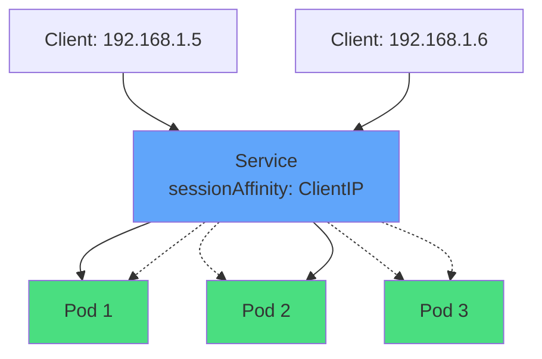

</div>

<!--
METADATA:
sentence: But what if your application stores session state in memory? What if you need requests from the same client to go to the same Pod? That's where session affinity comes in.
search_anchor: where session affinity comes in
-->
<div v-click="2" class="mt-8 text-center">
<carbon-user-identification class="inline-block text-4xl text-purple-400" />
<strong class="ml-2">Sticky Sessions</strong>
</div>

<div class="grid grid-cols-2 gap-6 mt-6 text-sm">
<!--
METADATA:
sentence: You can configure sessionAffinity: ClientIP on your Service. This tells Kubernetes to route all requests from a particular client IP address to the same Pod.
search_anchor: route all requests from a particular client IP
-->
<div v-click="3">
<carbon-checkmark class="inline-block text-2xl text-green-400" /> Same client IP → same Pod
</div>
<!--
METADATA:
sentence: The session is maintained for a configurable timeout period - by default, 3 hours.
search_anchor: configurable timeout period
-->
<div v-click="4">
<carbon-time class="inline-block text-2xl text-blue-400" /> Default timeout: 3 hours
</div>
</div>

<!--
METADATA:
sentence: You can configure sessionAffinity: ClientIP on your Service.
search_anchor: configure sessionAffinity: ClientIP
-->
<div v-click="5" class="mt-6">

```yaml
spec:
  sessionAffinity: ClientIP
```

</div>

<!--
METADATA:
sentence: Session affinity is useful, but it's not a perfect solution for stateful applications.
search_anchor: not a perfect solution for stateful applications
-->
<div v-click="6" class="mt-4 text-center text-xs opacity-80">
Use with caution - not ideal for truly stateful apps
</div>

---
layout: center
---

# Headless Services

<!--
METADATA:
sentence: There's a special type of Service called a headless Service, created by setting clusterIP: None.
search_anchor: headless Service, created by setting clusterIP: None
-->
<div v-click="1">

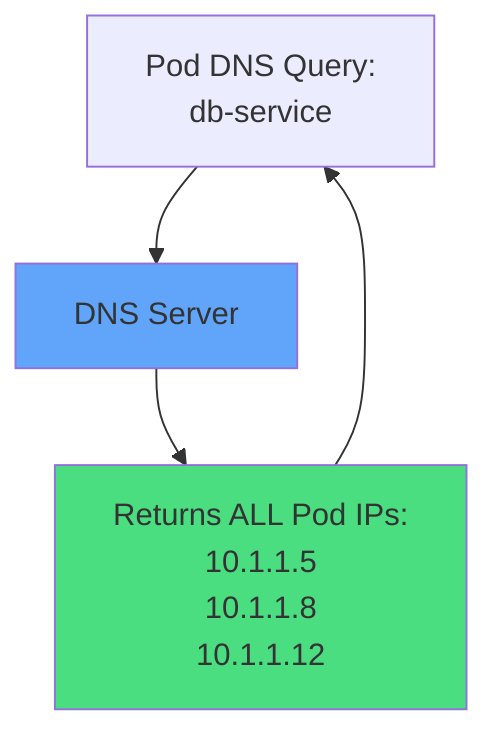

</div>

<!--
METADATA:
sentence: There's a special type of Service called a headless Service, created by setting clusterIP: None.
search_anchor: clusterIP: None
-->
<div v-click="2" class="mt-8">

```yaml
spec:
  clusterIP: None  # Headless!
```

</div>

<div class="grid grid-cols-2 gap-6 mt-8 text-sm">
<!--
METADATA:
sentence: Headless Services don't do load balancing. Instead, when you do a DNS lookup for the Service name, DNS returns all the Pod IP addresses directly.
search_anchor: DNS returns all the Pod IP addresses directly
-->
<div v-click="3">
<carbon-close class="text-4xl text-red-400 mb-2" />
<strong>No Load Balancing</strong><br/>
Client gets all Pod IPs
</div>
<!--
METADATA:
sentence: Your client application then decides which Pod to connect to.
search_anchor: client application then decides which Pod
-->
<div v-click="4">
<carbon-network-1 class="text-4xl text-blue-400 mb-2" />
<strong>Direct Pod Access</strong><br/>
Client chooses Pod
</div>
</div>

<!--
METADATA:
sentence: StatefulSets use headless Services so that each Pod can be addressed individually by name.
search_anchor: StatefulSets use headless Services
-->
<div v-click="5" class="mt-6 text-center text-sm">
<carbon-data-base class="inline-block text-2xl text-purple-400" /> Used by StatefulSets for individual Pod DNS
</div>

---
layout: center
---

# Services Without Selectors

<!--
METADATA:
sentence: Here's an interesting capability - you can create a Service without a label selector.
search_anchor: Service without a label selector
-->
<div v-click="1">

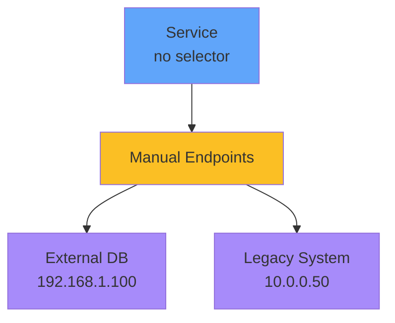

</div>

<!--
METADATA:
sentence: When you do this, Kubernetes doesn't automatically create endpoints. Instead, you manually create an Endpoints object with the IP addresses you want.
search_anchor: manually create an Endpoints object
-->
<div v-click="2" class="mt-8 text-center">
<carbon-edit class="inline-block text-4xl text-yellow-400" />
<strong class="ml-2">Manual endpoint management</strong>
</div>

<div class="grid grid-cols-2 gap-6 mt-8 text-sm">
<!--
METADATA:
sentence: This lets you create Services that route to external systems, databases outside your cluster, or services in other clusters.
search_anchor: route to external systems
-->
<div v-click="3">
<carbon-data-base class="inline-block text-2xl text-blue-400" /> External databases
</div>
<!--
METADATA:
sentence: This is useful for gradual migrations - you can create a Service name that your applications use, but initially point it at an external system.
search_anchor: useful for gradual migrations
-->
<div v-click="4">
<carbon-cloud class="inline-block text-2xl text-green-400" /> Services in other clusters
</div>
<!--
METADATA:
sentence: This lets you create Services that route to external systems, databases outside your cluster, or services in other clusters.
search_anchor: Services in other clusters
-->
<div v-click="5">
<carbon-migration class="inline-block text-2xl text-purple-400" /> Gradual migrations
</div>
<!--
METADATA:
sentence: For the CKAD exam, you might need to create Services for external databases or APIs using this pattern.
search_anchor: Services for external databases or APIs
-->
<div v-click="6">
<carbon-enterprise class="inline-block text-2xl text-yellow-400" /> Legacy systems
</div>
</div>

---
layout: center
---

# CKAD Exam Focus

<!--
METADATA:
sentence: Let's talk specifically about what you need to know about Services for the CKAD exam.
search_anchor: what you need to know about Services for the CKAD exam
-->
<div v-click="1" class="text-center mb-6">
<carbon-certificate class="inline-block text-6xl text-blue-400" />
</div>

<div class="grid grid-cols-2 gap-4 text-sm">
<!--
METADATA:
sentence: You absolutely must be able to create Services quickly using both declarative YAML and imperative kubectl commands.
search_anchor: create Services quickly
-->
<div v-click="2">
<carbon-flash class="inline-block text-2xl text-green-400" /> Create Services quickly
</div>
<!--
METADATA:
sentence: Practice using "kubectl expose" to create Services from existing Pods or Deployments.
search_anchor: kubectl expose
-->
<div v-click="3">
<carbon-list class="inline-block text-2xl text-green-400" /> kubectl expose command
</div>
<!--
METADATA:
sentence: You need to understand all the Service types - ClusterIP, NodePort, LoadBalancer, ExternalName, and headless.
search_anchor: understand all the Service types
-->
<div v-click="4">
<carbon-categories class="inline-block text-2xl text-green-400" /> All service types
</div>
<!--
METADATA:
sentence: Troubleshooting is critical. You should be able to quickly check if a Service has endpoints, verify DNS resolution, test connectivity, and fix mismatched labels.
search_anchor: check if a Service has endpoints
-->
<div v-click="5">
<carbon-debug class="inline-block text-2xl text-green-400" /> Check endpoints
</div>
<!--
METADATA:
sentence: Troubleshooting is critical. You should be able to quickly check if a Service has endpoints, verify DNS resolution, test connectivity, and fix mismatched labels.
search_anchor: fix mismatched labels
-->
<div v-click="6">
<carbon-tag class="inline-block text-2xl text-green-400" /> Label selector matching
</div>
<!--
METADATA:
sentence: Finally, understand Service networking concepts like multi-port Services, session affinity, and DNS naming across namespaces.
search_anchor: DNS naming across namespaces
-->
<div v-click="7">
<carbon-port class="inline-block text-2xl text-green-400" /> Port configuration
</div>
<!--
METADATA:
sentence: Troubleshooting is critical.
search_anchor: Troubleshoot connectivity
-->
<div v-click="8">
<carbon-search class="inline-block text-2xl text-green-400" /> DNS naming patterns
</div>
<div v-click="9">
<carbon-tools class="inline-block text-2xl text-green-400" /> Troubleshoot connectivity
</div>
</div>

<!--
METADATA:
sentence: Practice using "kubectl expose" to create Services from existing Pods or Deployments.
search_anchor: Practice kubectl expose
-->
<div v-click="10" class="mt-8 text-center text-lg">
<carbon-terminal class="inline-block text-3xl text-purple-400" /> Practice kubectl expose!
</div>

---
layout: center
---

# Summary

<!--
METADATA:
sentence: Let's recap what we've covered:
search_anchor: Let's recap what we've covered
-->
<div v-click="1">

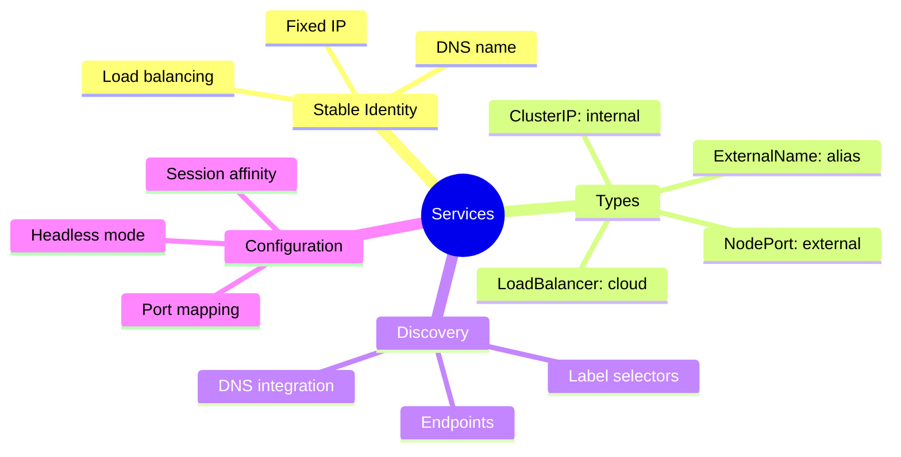

</div>

---
layout: center
---

# Key Takeaways

<div class="grid grid-cols-2 gap-6 mt-6">
<!--
METADATA:
sentence: Services provide stable IP addresses and DNS names for accessing Pods
search_anchor: stable IP addresses and DNS names
-->
<div v-click="1">
<carbon-network-3 class="text-4xl text-blue-400 mb-2" />
<strong>Stable networking</strong><br/>
<span class="text-sm opacity-80">For ephemeral Pods</span>
</div>
<!--
METADATA:
sentence: Services find Pods using label selectors, creating loose coupling
search_anchor: Services find Pods using label selectors
-->
<div v-click="2">
<carbon-flow class="text-4xl text-green-400 mb-2" />
<strong>Label selectors</strong><br/>
<span class="text-sm opacity-80">Loose coupling with Pods</span>
</div>
<!--
METADATA:
sentence: One of the most powerful features of Services is automatic DNS integration.
search_anchor: DNS integration
-->
<div v-click="3">
<carbon-dns-services class="text-4xl text-purple-400 mb-2" />
<strong>DNS integration</strong><br/>
<span class="text-sm opacity-80">Automatic service discovery</span>
</div>
<!--
METADATA:
sentence: You should be able to quickly check if a Service has endpoints
search_anchor: Check endpoints first
-->
<div v-click="4">
<carbon-debug class="text-4xl text-yellow-400 mb-2" />
<strong>Check endpoints</strong><br/>
<span class="text-sm opacity-80">First troubleshooting step</span>
</div>
</div>

<!--
METADATA:
sentence: Services are essential for the CKAD exam
search_anchor: Services are essential for CKAD
-->
<div v-click="5" class="mt-8 text-center text-lg">
Services are essential for CKAD - master them! <carbon-arrow-right class="inline-block text-2xl" />
</div>
