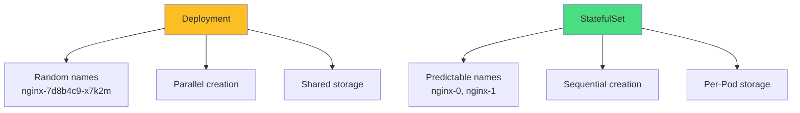
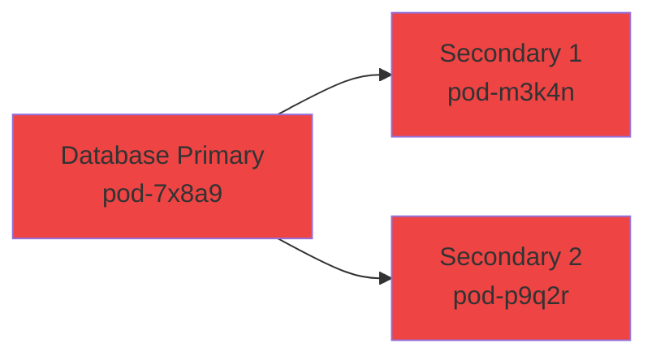
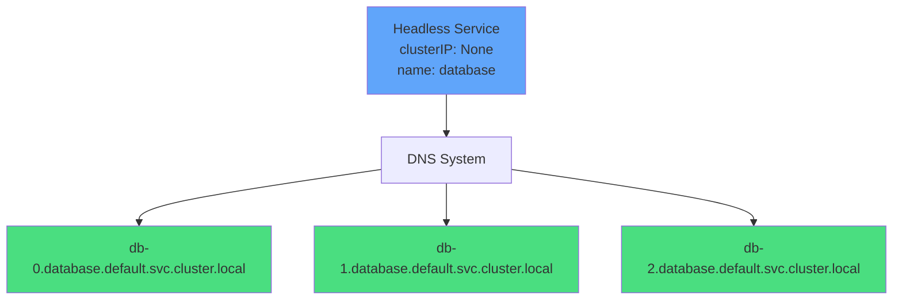
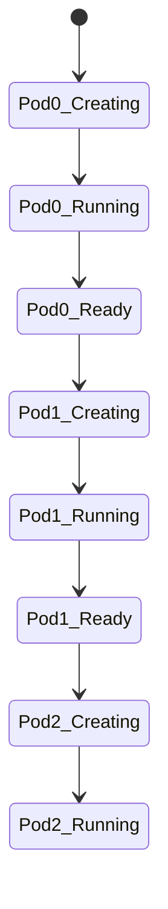
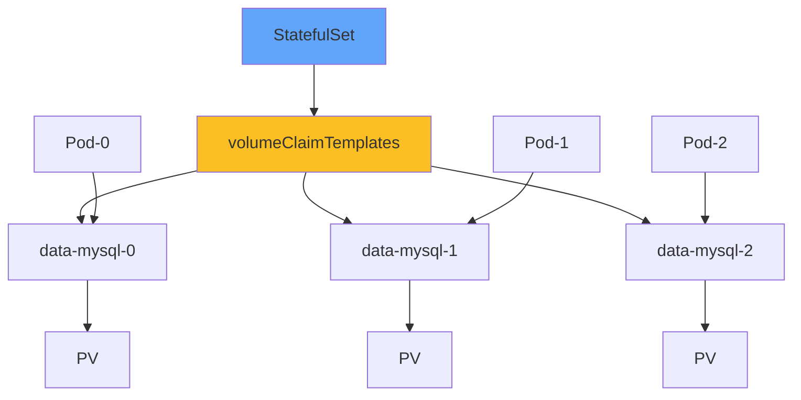
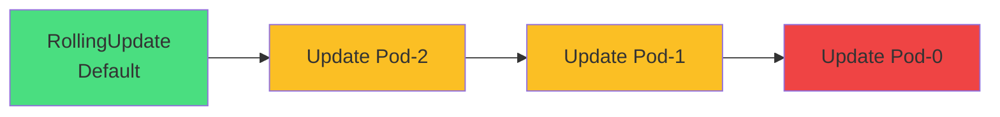
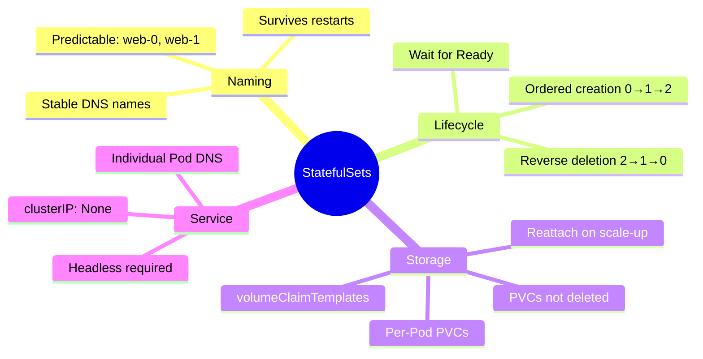

# StatefulSets

<div class="abs-br m-6 flex gap-2">
  <carbon-ordinal class="text-6xl text-blue-400" />
</div>

<!--
METADATA:
sentence: Today, we'll explore how StatefulSets enable you to run stateful applications in Kubernetes with stable network identities, ordered deployment, and persistent storage per replica.
search_anchor: stable network identities, ordered deployment, and persistent storage
-->
<div v-click class="mt-8 text-xl opacity-80">
Stable identities, ordered deployment, and persistent storage
</div>

---
layout: center
---

# What StatefulSets Solve

<!--
METADATA:
sentence: Let's understand why StatefulSets exist. Kubernetes is inherently dynamic - when you create a Deployment, Pods get random names like `nginx-7d8b4c9-x7k2m`, they start in parallel, and they can be scheduled on any node. This works perfectly for stateless applications.
search_anchor: Kubernetes is inherently dynamic
-->
<div v-click="1">



</div>

<div class="grid grid-cols-2 gap-6 mt-8 text-sm">
<!--
METADATA:
sentence: Let's understand why StatefulSets exist. Kubernetes is inherently dynamic - when you create a Deployment, Pods get random names like `nginx-7d8b4c9-x7k2m`, they start in parallel, and they can be scheduled on any node.
search_anchor: Pods get random names
-->
<div v-click="2">
<carbon-deployment-pattern class="text-4xl text-yellow-400 mb-2" />
<strong>Deployment</strong><br/>
Dynamic, stateless applications
</div>
<!--
METADATA:
sentence: However, some applications need a stable environment:
search_anchor: applications need a stable environment
-->
<div v-click="3">
<carbon-ordinal class="text-4xl text-green-400 mb-2" />
<strong>StatefulSet</strong><br/>
Stable, stateful applications
</div>
</div>

<!--
METADATA:
sentence: StatefulSets solve this by providing **stable names, ordered deployment, and persistent storage per Pod**.
search_anchor: stability and predictability
-->
<div v-click="4" class="mt-8 text-center">
<carbon-checkmark class="inline-block text-2xl text-blue-400" /> Use when you need stability and predictability
</div>

---
layout: center
---

# The Problem

<!--
METADATA:
sentence: Imagine deploying PostgreSQL with replication. Pod-0 needs to be the primary, and Pod-1 and Pod-2 need to configure themselves as secondaries pointing to Pod-0. With Deployments, this would be extremely difficult because Pod names are unpredictable.
search_anchor: deploying PostgreSQL with replication
-->
<div v-click="1">



</div>

<!--
METADATA:
sentence: With Deployments, this would be extremely difficult because Pod names are unpredictable.
search_anchor: Pod names are unpredictable
-->
<div v-click="2" class="mt-8 text-center text-red-400 text-xl">
<carbon-close class="inline-block text-3xl" /> Random names make it impossible to configure replication!
</div>

<!--
METADATA:
sentence: A **replicated database** with one primary and multiple secondaries - The secondaries depend on the primary starting first - They need to know how to find the primary by a predictable name - Each replica needs its own persistent storage that survives Pod restarts
search_anchor: replicated database needs
-->
<div v-click="3" class="mt-6">

**Replicated database needs:**
- Primary starts first (ordered deployment)
- Secondaries know how to find primary (stable naming)
- Each replica has its own data (persistent storage per Pod)

</div>

<!--
METADATA:
sentence: StatefulSets solve this by providing **stable names, ordered deployment, and persistent storage per Pod**.
search_anchor: StatefulSets provide stable names
-->
<div v-click="4" class="mt-6 text-center text-green-400">
<carbon-checkmark class="inline-block text-2xl" /> StatefulSets provide stable names, ordered deployment, persistent storage
</div>

---
layout: center
---

# StatefulSets vs Deployments

<div class="text-xs">

| Aspect | Deployment | StatefulSet |
|--------|------------|-------------|
<!--
METADATA:
sentence: **Pod Naming**: - Deployment: `nginx-7d8b4c9-x7k2m` (random) - StatefulSet: `nginx-0`, `nginx-1`, `nginx-2` (predictable ordinal index)
search_anchor: Pod Naming
-->
| <span v-click="1">**Pod Naming**</span> | <span v-click="1">nginx-7d8b4c9-x7k2m (random)</span> | <span v-click="1">nginx-0, nginx-1, nginx-2 (ordinal)</span> |
<!--
METADATA:
sentence: **Creation Order**: - Deployment: All Pods start simultaneously (parallel) - StatefulSet: Pods start one at a time, in sequence (Pod-1 waits for Pod-0 to be Ready)
search_anchor: Creation Order
-->
| <span v-click="2">**Creation Order**</span> | <span v-click="2">Parallel (all at once)</span> | <span v-click="2">Sequential (0→1→2)</span> |
<!--
METADATA:
sentence: **Deletion Order**: - Deployment: All Pods terminate simultaneously - StatefulSet: Reverse sequential deletion (Pod-2, then Pod-1, then Pod-0)
search_anchor: Deletion Order
-->
| <span v-click="3">**Deletion Order**</span> | <span v-click="3">Parallel</span> | <span v-click="3">Reverse sequential (2→1→0)</span> |
<!--
METADATA:
sentence: **Network Identity**: - Deployment: Load-balanced through Service, no individual DNS names - StatefulSet: Each Pod gets its own DNS name like `nginx-0.nginx.default.svc.cluster.local`
search_anchor: Network Identity
-->
| <span v-click="4">**Network Identity**</span> | <span v-click="4">Load-balanced via Service</span> | <span v-click="4">Individual DNS per Pod</span> |
<!--
METADATA:
sentence: **Storage**: - Deployment: Shared PVCs or emptyDir volumes - StatefulSet: Dedicated PVC per Pod using volumeClaimTemplates
search_anchor: Storage
-->
| <span v-click="5">**Storage**</span> | <span v-click="5">Shared PVCs or emptyDir</span> | <span v-click="5">Dedicated PVC per Pod</span> |
<!--
METADATA:
sentence: **Use Cases**: - Deployment: Stateless applications, web servers, APIs - StatefulSet: Databases, message queues, distributed coordination systems
search_anchor: Use Cases
-->
| <span v-click="6">**Use Cases**</span> | <span v-click="6">Web servers, APIs</span> | <span v-click="6">Databases, message queues</span> |

</div>

<!--
METADATA:
sentence: Let's compare StatefulSets with Deployments side by side.
search_anchor: compare StatefulSets with Deployments
-->
<div v-click="7" class="mt-8 text-center text-lg">
<carbon-idea class="inline-block text-2xl text-yellow-400" /> StatefulSets = Deployments + Stability
</div>

---
layout: center
---

# Stable Network Identity

<!--
METADATA:
sentence: One of StatefulSet's most powerful features is stable network identity. Let me explain how this works.
search_anchor: stable network identity
-->
<div v-click="1">



</div>

<!--
METADATA:
sentence: Each Pod gets its own predictable DNS name: - Format: `<pod-name>.<service-name>.<namespace>.svc.cluster.local`
search_anchor: DNS Name Format
-->
<div v-click="2" class="mt-8">

**DNS Name Format:** `<pod-name>.<service-name>.<namespace>.svc.cluster.local`

</div>

<div class="grid grid-cols-2 gap-6 mt-6 text-sm">
<!--
METADATA:
sentence: **1. Individual Pod DNS Names**: Each Pod gets its own predictable DNS name
search_anchor: Individual Pod DNS Names
-->
<div v-click="3">
<carbon-dns-services class="text-4xl text-blue-400 mb-2" />
<strong>Individual DNS</strong><br/>
Each Pod has its own DNS name
</div>
<!--
METADATA:
sentence: **3. Persistent Identity**: If Pod-1 is deleted and recreated, it retains the name `db-1` and the same DNS name. This allows other Pods to maintain stable connections.
search_anchor: Persistent Identity
-->
<div v-click="4">
<carbon-renew class="text-4xl text-green-400 mb-2" />
<strong>Persistent Identity</strong><br/>
Name survives Pod restarts
</div>
</div>

<!--
METADATA:
sentence: When you create a StatefulSet, you must also create a **headless Service** - a Service with `clusterIP: None`. This is mandatory for StatefulSets.
search_anchor: headless Service
-->
<div v-click="5" class="mt-8 text-center text-red-400 text-sm">
<carbon-warning class="inline-block text-2xl" /> Requires headless Service (clusterIP: None)
</div>

---
layout: center
---

# The Mandatory Headless Service

<!--
METADATA:
sentence: Understanding headless Services is crucial for working with StatefulSets. Let me explain why they're required and how to create them.
search_anchor: headless Services is crucial
-->
<div v-click="1">

```yaml
# Standard Service (NOT for StatefulSets)
apiVersion: v1
kind: Service
spec:
  clusterIP: 10.96.0.10  # Gets a cluster IP
  selector:
    app: web
```

</div>

<!--
METADATA:
sentence: Setting `clusterIP: None` tells Kubernetes:
search_anchor: clusterIP: None
-->
<div v-click="2">

```yaml
# Headless Service (REQUIRED for StatefulSets)
apiVersion: v1
kind: Service
metadata:
  name: web
spec:
  clusterIP: None  # Key difference!
  selector:
    app: web
```

</div>

<!--
METADATA:
sentence: The StatefulSet references the headless Service by name in the `serviceName` field:
search_anchor: StatefulSet references the headless Service
-->
<div v-click="3">

```yaml
# StatefulSet references it
apiVersion: apps/v1
kind: StatefulSet
spec:
  serviceName: web  # Must match headless Service
```

</div>

<!--
METADATA:
sentence: **Common Mistake**: Forgetting to create the headless Service or not setting `clusterIP: None` will prevent the StatefulSet from working correctly. This is a frequent exam pitfall.
search_anchor: common exam pitfall
-->
<div v-click="4" class="mt-6 text-center text-red-400">
<carbon-warning class="inline-block text-2xl" /> Forgetting headless Service is a common exam pitfall!
</div>

---
layout: center
---

# Ordered Deployment and Scaling

<!--
METADATA:
sentence: StatefulSets manage Pod lifecycle with a strict ordering guarantee. Let me walk through how this works.
search_anchor: strict ordering guarantee
-->
<div v-click="1">



</div>

<!--
METADATA:
sentence: **Initial Deployment with 3 Replicas**: 1. Pod-0 is created first 2. Kubernetes waits for Pod-0 to be Running AND Ready
search_anchor: Initial Deployment with 3 Replicas
-->
<div v-click="2" class="mt-8">

**Initial Deployment (3 replicas):**
1. Pod-0 created → Wait for Running AND Ready
2. Pod-1 created → Wait for Running AND Ready
3. Pod-2 created

</div>

<!--
METADATA:
sentence: **Scaling Down** from 5 to 2 replicas: - Pod-4 is deleted first - Then Pod-3 is deleted - Then Pod-2 is deleted - **Reverse order protects the primary** (Pod-0)
search_anchor: Scaling Down
-->
<div v-click="3" class="mt-6">

**Scaling Down (5→2):**
- Pod-4 deleted
- Pod-3 deleted
- Pod-2 deleted
- **Reverse order protects primary (Pod-0)**

</div>

<!--
METADATA:
sentence: **Important Note**: You can override this with `podManagementPolicy: Parallel` when you need faster startup and Pods don't depend on each other, but this is less common.
search_anchor: podManagementPolicy: Parallel
-->
<div v-click="4" class="mt-6 text-center text-sm opacity-80">
Override with podManagementPolicy: Parallel (less common)
</div>

---
layout: center
---

# Persistent Storage with volumeClaimTemplates

<!--
METADATA:
sentence: StatefulSets have a special relationship with persistent storage through the `volumeClaimTemplates` field.
search_anchor: volumeClaimTemplates field
-->
<div v-click="1">



</div>

<div class="grid grid-cols-2 gap-6 mt-8 text-sm">
<!--
METADATA:
sentence: **1. Automatic Creation**: When Pod-0 is created, so is `data-mysql-0`. When Pod-1 starts, `data-mysql-1` is created.
search_anchor: Automatic Creation
-->
<div v-click="2">
<carbon-automatic class="text-4xl text-green-400 mb-2" />
<strong>Automatic Creation</strong><br/>
One PVC per Pod created automatically
</div>
<!--
METADATA:
sentence: **2. Stable Binding**: Pod-0 always uses `data-mysql-0`, Pod-1 always uses `data-mysql-1`. This binding persists across Pod restarts.
search_anchor: Stable Binding
-->
<div v-click="3">
<carbon-locked class="text-4xl text-blue-400 mb-2" />
<strong>Stable Binding</strong><br/>
Pod-0 always uses data-mysql-0
</div>
<!--
METADATA:
sentence: **3. PVC Retention**: When you scale down or delete a StatefulSet, the PVCs are **NOT automatically deleted**. This is a safety feature - your data is preserved.
search_anchor: PVC Retention
-->
<div v-click="4">
<carbon-data-base class="text-4xl text-purple-400 mb-2" />
<strong>PVC Retention</strong><br/>
PVCs NOT deleted with StatefulSet
</div>
<!--
METADATA:
sentence: **4. Reattachment on Scale-Up**: If you scale from 1 to 3 replicas, Pod-1 and Pod-2 reattach to their existing PVCs (`data-mysql-1` and `data-mysql-2`), preserving all data.
search_anchor: Reattachment on Scale-Up
-->
<div v-click="5">
<carbon-renew class="text-4xl text-yellow-400 mb-2" />
<strong>Reattachment</strong><br/>
Scale up reuses existing PVCs
</div>
</div>

---
layout: center
---

# Update Strategies

<!--
METADATA:
sentence: StatefulSets handle updates differently than Deployments. Understanding this is critical for exam scenarios.
search_anchor: handle updates differently than Deployments
-->
<div v-click="1">



</div>

<!--
METADATA:
sentence: **Default: RollingUpdate** When you update a StatefulSet's Pod template: 1. Updates happen in **reverse order** (highest ordinal first)
search_anchor: RollingUpdate
-->
<div v-click="2" class="mt-8">

**RollingUpdate (default):**
- Updates in reverse order (2→1→0)
- Waits for each Pod to be Ready
- Protects primary by updating it last

</div>

<!--
METADATA:
sentence: **Alternative: OnDelete Strategy** With `updateStrategy.type: OnDelete`: - Updating the StatefulSet spec doesn't trigger any Pod changes
search_anchor: OnDelete Strategy
-->
<div v-click="3" class="mt-6">

**OnDelete Strategy:**
- Update only when Pod manually deleted
- Complete control over timing and order

</div>

<!--
METADATA:
sentence: **Partition Updates** (Advanced): You can set a partition value to do canary-style rollouts:
search_anchor: Partition Updates
-->
<div v-click="4" class="mt-6">

**Partition Updates (canary):**
```yaml
updateStrategy:
  rollingUpdate:
    partition: 2  # Only Pods >= 2 are updated
```

</div>

<!--
METADATA:
sentence: **Why Reverse Order?** This protects the primary (Pod-0) in leader-follower architectures. You test the update on secondaries before touching the primary.
search_anchor: test the update on secondaries
-->
<div v-click="5" class="mt-6 text-center text-blue-400">
<carbon-idea class="inline-block text-2xl" /> Test updates on secondaries before primary
</div>

---
layout: center
---

# StatefulSet Use Cases

<div class="grid grid-cols-2 gap-6 mt-6">
<!--
METADATA:
sentence: **1. Relational Databases**: - PostgreSQL, MySQL with primary-replica replication
search_anchor: Relational Databases
-->
<div v-click="1">
<carbon-data-base class="text-4xl text-blue-400 mb-2" />
<strong>Relational Databases</strong><br/>
<span class="text-sm opacity-80">PostgreSQL, MySQL with replication</span>
</div>
<!--
METADATA:
sentence: **2. NoSQL Databases**: - MongoDB replica sets - Cassandra clusters - Elasticsearch clusters with master/data/client node roles
search_anchor: NoSQL Databases
-->
<div v-click="2">
<carbon-document-multiple-01 class="text-4xl text-green-400 mb-2" />
<strong>NoSQL Databases</strong><br/>
<span class="text-sm opacity-80">MongoDB, Cassandra, Elasticsearch</span>
</div>
<!--
METADATA:
sentence: **3. Message Queues**: - RabbitMQ clusters - Kafka with ordered broker IDs - Redis with sentinel configurations
search_anchor: Message Queues
-->
<div v-click="3">
<carbon-data-share class="text-4xl text-purple-400 mb-2" />
<strong>Message Queues</strong><br/>
<span class="text-sm opacity-80">RabbitMQ, Kafka, Redis</span>
</div>
<!--
METADATA:
sentence: **4. Distributed Coordination**: - Zookeeper ensembles - etcd clusters - Consul servers
search_anchor: Distributed Coordination
-->
<div v-click="4">
<carbon-network-cluster class="text-4xl text-yellow-400 mb-2" />
<strong>Distributed Systems</strong><br/>
<span class="text-sm opacity-80">Zookeeper, etcd, Consul</span>
</div>
</div>

<!--
METADATA:
sentence: **Common Anti-Pattern**: Don't use StatefulSets just because your app has state.
search_anchor: Common Anti-Pattern
-->
<div v-click="5" class="mt-8 text-center text-red-400">
<carbon-warning class="inline-block text-2xl" /> Don't use StatefulSets just because your app has state!
</div>

<!--
METADATA:
sentence: Use them when you need: - Stable network identities - Ordered operations - Per-Pod persistent storage
search_anchor: Use them when you need
-->
<div v-click="6" class="mt-6 text-center text-sm">
Use when you need: Stable identities • Ordered operations • Per-Pod storage
</div>

---
layout: center
---

# Init Containers with StatefulSets

<!--
METADATA:
sentence: Init containers are commonly used with StatefulSets to implement leader-follower logic.
search_anchor: Init containers are commonly used
-->
<div v-click="1">

```yaml
initContainers:
- name: wait-for-primary
  image: busybox
  command:
  - sh
  - -c
  - |
    if [ "$(hostname)" != "postgres-0" ]; then
      until nslookup postgres-0.postgres; do
        echo "Waiting for primary..."
        sleep 2
      done
    fi
```

</div>

<!--
METADATA:
sentence: **How This Works**: 1. **Pod-0**: Hostname is `postgres-0`, so the if-condition is false, init container exits immediately
search_anchor: How This Works
-->
<div v-click="2" class="mt-8">

**How It Works:**
- **Pod-0**: hostname = postgres-0, exits immediately
- **Pod-1/2**: Wait for DNS resolution of postgres-0.postgres

</div>

<!--
METADATA:
sentence: **Other Init Container Uses**: - Configure replication settings based on Pod ordinal
search_anchor: Other Init Container Uses
-->
<div v-click="3" class="mt-6">

**Other Init Container Uses:**
- Configure replication based on ordinal
- Download configuration for Pod's role
- Initialize schemas (Pod-0 only)
- Set up directories and permissions

</div>

<!--
METADATA:
sentence: **Key Insight**: The Pod's hostname matches its StatefulSet ordinal name, allowing init containers to implement conditional logic based on the Pod's identity.
search_anchor: Pod's hostname matches
-->
<div v-click="4" class="mt-6 text-center text-blue-400">
<carbon-idea class="inline-block text-2xl" /> Pod hostname matches ordinal name for conditional logic
</div>

---
layout: center
---

# CKAD Exam Relevance

<div class="grid grid-cols-2 gap-6 mt-6">
<!--
METADATA:
sentence: StatefulSets appear in the CKAD exam as supplementary material. While not a core focus, understanding them is valuable and they may appear in exam scenarios.
search_anchor: CKAD exam as supplementary material
-->
<div v-click="1">
<carbon-education class="text-4xl text-blue-400 mb-2" />
<strong>Core Concepts</strong><br/>
<span class="text-sm opacity-80">Differences, headless Service, naming</span>
</div>
<!--
METADATA:
sentence: **2. Practical Skills**: - Create a StatefulSet from scratch
search_anchor: Practical Skills
-->
<div v-click="2">
<carbon-terminal class="text-4xl text-green-400 mb-2" />
<strong>Practical Skills</strong><br/>
<span class="text-sm opacity-80">Create from scratch, volumeClaimTemplates</span>
</div>
<!--
METADATA:
sentence: **3. Common Exam Scenarios**: - Deploy a stateful application requiring persistent storage per Pod
search_anchor: Common Exam Scenarios
-->
<div v-click="3">
<carbon-document class="text-4xl text-purple-400 mb-2" />
<strong>Exam Scenarios</strong><br/>
<span class="text-sm opacity-80">Stateful apps, multi-replica databases</span>
</div>
<!--
METADATA:
sentence: **4. Time Management**: - StatefulSets take longer to create due to sequential Pod startup
search_anchor: Time Management
-->
<div v-click="4">
<carbon-time class="text-4xl text-yellow-400 mb-2" />
<strong>Time Management</strong><br/>
<span class="text-sm opacity-80">Sequential startup takes longer</span>
</div>
</div>

<!--
METADATA:
sentence: Use `--watch` to monitor progress without constantly re-running commands
search_anchor: Use `--watch` to monitor
-->
<div v-click="5" class="mt-8 text-center">
<carbon-warning class="inline-block text-2xl text-yellow-400" /> Use --watch to monitor without re-running commands
</div>

<!--
METADATA:
sentence: **Exam Weight**: Approximately 1-2 questions may involve StatefulSets, typically in the context of application deployment or storage configuration.
search_anchor: Exam Weight
-->
<div v-click="6" class="mt-6 text-center text-sm opacity-80">
Exam weight: 1-2 questions, typically deployment or storage context
</div>

---
layout: center
---

# Summary

<!--
METADATA:
sentence: Let's recap the essential concepts about StatefulSets:
search_anchor: recap the essential concepts
-->
<div v-click="1">



</div>

---
layout: center
---

# Key Takeaways

<div class="grid grid-cols-2 gap-6 mt-6">
<!--
METADATA:
sentence: **What Makes StatefulSets Special**: 1. **Predictable Pod names** with ordinal indices (web-0, web-1, web-2)
search_anchor: Predictable Pod names
-->
<div v-click="1">
<carbon-tag class="text-4xl text-blue-400 mb-2" />
<strong>Predictable names</strong><br/>
<span class="text-sm opacity-80">Ordinal indices: web-0, web-1, web-2</span>
</div>
<!--
METADATA:
sentence: 2. **Ordered lifecycle** - sequential creation and reverse deletion
search_anchor: Ordered lifecycle
-->
<div v-click="2">
<carbon-order-details class="text-4xl text-green-400 mb-2" />
<strong>Ordered lifecycle</strong><br/>
<span class="text-sm opacity-80">Sequential creation, reverse deletion</span>
</div>
<!--
METADATA:
sentence: 3. **Stable network identities** - each Pod gets its own DNS name
search_anchor: Stable network identities
-->
<div v-click="3">
<carbon-dns-services class="text-4xl text-purple-400 mb-2" />
<strong>Stable identities</strong><br/>
<span class="text-sm opacity-80">Individual Pod DNS names</span>
</div>
<!--
METADATA:
sentence: 4. **Per-Pod persistent storage** - volumeClaimTemplates create dedicated PVCs
search_anchor: Per-Pod persistent storage
-->
<div v-click="4">
<carbon-data-volume class="text-4xl text-yellow-400 mb-2" />
<strong>Per-Pod storage</strong><br/>
<span class="text-sm opacity-80">volumeClaimTemplates create PVCs</span>
</div>
</div>

<!--
METADATA:
sentence: **Important Gotchas**: - PVCs are not deleted when StatefulSets are deleted - Sequential startup means slower deployment times
search_anchor: Important Gotchas
-->
<div v-click="5" class="mt-8 text-center text-xl">
<strong>Important Gotchas:</strong>
<div class="text-sm mt-4 opacity-80">
PVCs not deleted • Sequential = slower • Headless Service mandatory • Label selectors must match
</div>
</div>

<!--
METADATA:
sentence: **Next Steps**: In the practical exercises session, we'll deploy real StatefulSet applications and work through hands-on scenarios to reinforce these concepts.
search_anchor: Next Steps
-->
<div v-click="6" class="mt-8 text-center">
<carbon-certificate class="inline-block text-3xl text-green-400" /> Next: Hands-on StatefulSet deployments <carbon-arrow-right class="inline-block text-2xl" />
</div>
