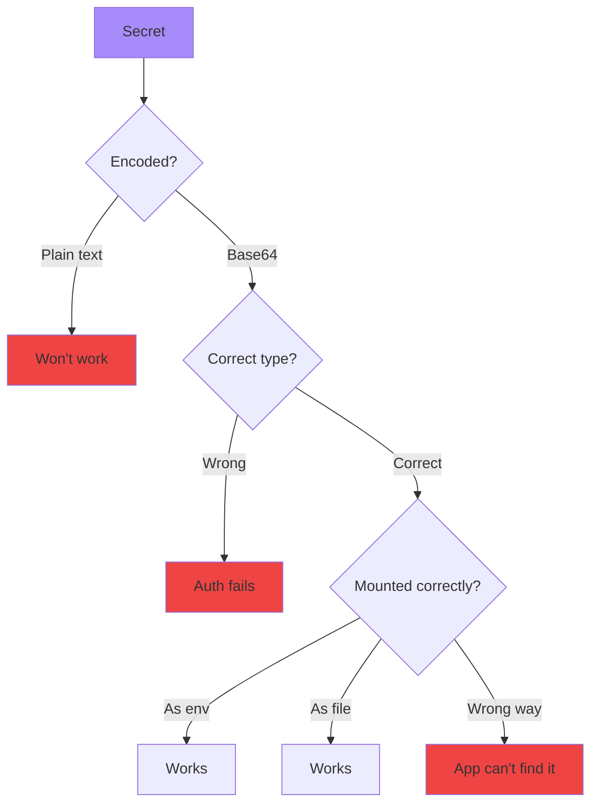

# Troubleshooting Application Modeling

<div class="abs-br m-6 flex gap-2">
  <carbon-application class="text-6xl text-blue-400" />
</div>

<!--
METADATA:
sentence: This builds on basic troubleshooting by adding complexity: multiple resources working together.
search_anchor: multiple resources working together
-->
<div v-click class="mt-8 text-xl opacity-80">
Multi-resource dependencies and configuration
</div>

---
layout: center
---

# The Application Modeling Challenge

<!--
METADATA:
sentence: A basic web application typically requires - Pod/Deployment - The application container, Service - Network access to the app, ConfigMap - Application configuration, Secret - Database credentials, PersistentVolume - Data storage, Namespace - Resource isolation.
search_anchor: basic web application typically requires
-->
<div v-click="1">


</div>

<!--
METADATA:
sentence: The Problem - Each resource can fail independently, but symptoms often appear elsewhere.
search_anchor: symptoms often appear elsewhere
-->
<div v-click="2" class="mt-8 text-center">
<carbon-warning class="inline-block text-3xl text-yellow-400" />
<strong class="ml-2">Any single failure breaks the chain</strong>
</div>

<!--
METADATA:
sentence: A basic web application typically requires - Pod/Deployment - The application container, Service - Network access to the app, ConfigMap - Application configuration, Secret - Database credentials, PersistentVolume - Data storage, Namespace - Resource isolation.
search_anchor: ConfigMap, Secret, PersistentVolume
-->
<div v-click="3" class="grid grid-cols-3 gap-4 mt-8 text-sm">
<div>
<carbon-settings class="inline-block text-2xl text-blue-400" /> ConfigMap
</div>
<div>
<carbon-locked class="inline-block text-2xl text-purple-400" /> Secret
</div>
<div>
<carbon-data-volume class="inline-block text-2xl text-green-400" /> PVC
</div>
</div>

<!--
METADATA:
sentence: The Problem - Each resource can fail independently, but symptoms often appear elsewhere.
search_anchor: Each resource can fail independently
-->
<div v-click="4" class="mt-6 text-center text-sm opacity-80">
Symptoms often appear far from the root cause
</div>

---
layout: center
---

# Configuration Resources

<!--
METADATA:
sentence: ConfigMaps - Non-Sensitive Configuration. Purpose - Store configuration data as key-value pairs or files.
search_anchor: ConfigMaps - Non-Sensitive Configuration
-->
<div v-click="1">


</div>

<div class="grid grid-cols-3 gap-4 mt-8 text-sm">
<!--
METADATA:
sentence: Purpose - Store configuration data as key-value pairs or files.
search_anchor: Store configuration data as key-value pairs or files
-->
<div v-click="2">
<carbon-document class="text-3xl text-green-400 mb-2" />
<strong>ConfigMap</strong><br/>
Key-value pairs or files
</div>
<!--
METADATA:
sentence: Secrets - Sensitive Data. Purpose - Store sensitive information (base64 encoded).
search_anchor: Secrets - Sensitive Data
-->
<div v-click="3">
<carbon-security class="text-3xl text-purple-400 mb-2" />
<strong>Secret</strong><br/>
Base64 encoded data
</div>
<!--
METADATA:
sentence: PersistentVolumes - Durable Storage. Purpose - Provide persistent data storage beyond pod lifecycle.
search_anchor: PersistentVolumes - Durable Storage
-->
<div v-click="4">
<carbon-data-base class="text-3xl text-blue-400 mb-2" />
<strong>PVC</strong><br/>
Storage claims
</div>
</div>

---
layout: center
---

# ConfigMap Issues

<!--
METADATA:
sentence: Issue 1 - ConfigMap Doesn't Exist. Symptom - Pod Status - CreateContainerConfigError, Events - configmap "app-config" not found.
search_anchor: ConfigMap Doesn't Exist
-->
<div v-click="1">


</div>

<div class="grid grid-cols-2 gap-4 mt-6 text-xs">
<!--
METADATA:
sentence: Symptom - Pod Status - CreateContainerConfigError, Events - configmap "app-config" not found.
search_anchor: CreateContainerConfigError
-->
<div v-click="2">
<carbon-close class="inline-block text-2xl text-red-400" /> <strong>Missing ConfigMap</strong><br/>
Pod status: CreateContainerConfigError
</div>
<!--
METADATA:
sentence: Issue 2 - Key Name Mismatch.
search_anchor: Key Name Mismatch
-->
<div v-click="3">
<carbon-tag class="inline-block text-2xl text-yellow-400" /> <strong>Key Mismatch</strong><br/>
database-url vs database_url
</div>
<!--
METADATA:
sentence: Issue 3 - Namespace Mismatch. Problem - ConfigMap in default namespace, Pod in app namespace.
search_anchor: Namespace Mismatch
-->
<div v-click="4">
<carbon-folder class="inline-block text-2xl text-blue-400" /> <strong>Wrong Namespace</strong><br/>
ConfigMap in default, Pod in app
</div>
<!--
METADATA:
sentence: Issue 4 - Volume Mount Conflicts. Problem - Multiple ConfigMaps mounting to same path.
search_anchor: Volume Mount Conflicts
-->
<div v-click="5">
<carbon-warning class="inline-block text-2xl text-purple-400" /> <strong>Mount Conflicts</strong><br/>
Multiple mounts to same path
</div>
</div>

<!--
METADATA:
sentence: Diagnosis - kubectl get configmap, kubectl get configmap -A (All namespaces), kubectl describe pod (Check error message).
search_anchor: kubectl get configmap
-->
<div v-click="6" class="mt-8">

```bash
kubectl get configmap app-config
kubectl get configmap app-config -o yaml  # Check keys
```

</div>

---
layout: center
---

# ConfigMap Key Mismatch

<!--
METADATA:
sentence: Problem - ConfigMap has database-url (Key has hyphen), Pod references database_url (Looking for underscore!).
search_anchor: database-url
-->
<div v-click="1">

```yaml
# ConfigMap has
data:
  database-url: postgres://...  # hyphen

# Pod references
env:
- name: DATABASE_URL
  valueFrom:
    configMapKeyRef:
      key: database_url  # underscore!
```

</div>

<!--
METADATA:
sentence: Result - Pod starts but application fails due to missing config.
search_anchor: application fails due to missing config
-->
<div v-click="2" class="mt-8 text-center text-red-400">
<carbon-close class="inline-block text-3xl" /> Key names must match exactly!
</div>

<!--
METADATA:
sentence: Diagnosis - kubectl get configmap app-config -o yaml (Check actual keys), kubectl describe pod (May show key not found), kubectl logs (App error about missing config).
search_anchor: kubectl get configmap app-config -o yaml
-->
<div v-click="3" class="mt-6">

```bash
# Diagnose
kubectl get cm app-config -o yaml  # Check actual keys
kubectl describe pod <name>  # May show "key not found"
kubectl logs <name>  # App error about missing config
```

</div>

---
layout: center
---

# Secret Issues

<!--
METADATA:
sentence: Similar to ConfigMaps but with additional considerations - Issue 1 - Secret Encoding Problems. Problem - Secrets must be base64 encoded.
search_anchor: Similar to ConfigMaps but with additional considerations
-->
<div v-click="1">



</div>

<!--
METADATA:
sentence: Creating properly - kubectl create secret generic db-secret --from-literal=password=mypassword. Kubernetes handles encoding automatically.
search_anchor: kubectl create secret generic db-secret
-->
<div v-click="2" class="mt-6 text-sm">

```bash
# Create Secret properly (auto-encodes)
kubectl create secret generic db-secret \
  --from-literal=password=mypassword

# Check if mounted
kubectl exec <pod> -- env | grep SECRET
kubectl exec <pod> -- ls /path/to/secret
```

</div>

---
layout: center
---

# Secret Types

<div class="grid grid-cols-2 gap-6 mt-6 text-sm">
<!--
METADATA:
sentence: Types - Opaque (default) - arbitrary data.
search_anchor: Opaque (default) - arbitrary data
-->
<div v-click="1">
<carbon-locked class="text-4xl text-gray-400 mb-2" />
<strong>Opaque</strong><br/>
Generic arbitrary data
</div>
<!--
METADATA:
sentence: kubernetes.io/dockerconfigjson - Docker registry auth.
search_anchor: Docker registry auth
-->
<div v-click="2">
<carbon-container-software class="text-4xl text-blue-400 mb-2" />
<strong>dockerconfigjson</strong><br/>
Docker registry auth
</div>
<!--
METADATA:
sentence: kubernetes.io/tls - TLS certificates.
search_anchor: TLS certificates
-->
<div v-click="3">
<carbon-certificate class="text-4xl text-green-400 mb-2" />
<strong>tls</strong><br/>
TLS certificates
</div>
<!--
METADATA:
sentence: kubernetes.io/basic-auth - Basic auth credentials.
search_anchor: Basic auth credentials
-->
<div v-click="4">
<carbon-user class="text-4xl text-purple-400 mb-2" />
<strong>basic-auth</strong><br/>
Basic auth credentials
</div>
</div>

<!--
METADATA:
sentence: Problem - Using wrong type causes authentication failures.
search_anchor: Using wrong type causes authentication failures
-->
<div v-click="5" class="mt-8 text-center text-yellow-400">
<carbon-warning class="inline-block text-2xl" /> Wrong type causes authentication failures
</div>

---
layout: center
---

# PersistentVolume Issues

<!--
METADATA:
sentence: The PV/PVC Lifecycle. States - Available - PV ready for binding, Bound - PVC successfully bound to PV, Released - PVC deleted but PV not reclaimed, Failed - Reclamation failed.
search_anchor: The PV/PVC Lifecycle
-->
<div v-click="1">


</div>

<div class="grid grid-cols-2 gap-6 mt-8 text-sm">
<!--
METADATA:
sentence: Issue 1 - PVC Pending (Not Bound). Symptom - PVC Status - Pending.
search_anchor: PVC Pending (Not Bound)
-->
<div v-click="2">
<carbon-warning class="text-4xl text-yellow-400 mb-2" />
<strong>PVC Pending</strong><br/>
No matching PV available
</div>
<!--
METADATA:
sentence: Pod Status - Pending (or ContainerCreating), Events - waiting for volume to be created.
search_anchor: Pod Status - Pending (or ContainerCreating)
-->
<div v-click="3">
<carbon-pending class="text-4xl text-red-400 mb-2" />
<strong>Pod Pending</strong><br/>
Waiting for PVC to bind
</div>
</div>

<!--
METADATA:
sentence: Diagnosis - kubectl get pvc (Shows - STATUS - Pending), kubectl describe pvc (Events show why binding failed), kubectl get pv (Check available PVs and their specs).
search_anchor: kubectl get pvc
-->
<div v-click="4" class="mt-6 text-center">

```bash
kubectl get pvc  # Check STATUS
kubectl describe pvc <name>  # Check events
```

</div>

---
layout: center
---

# PVC Binding Mismatches

<!--
METADATA:
sentence: Common Mismatches - PVC requests ReadWriteMany (Needs RWX), storage 10Gi (Needs 10Gi). Available PV has ReadWriteOnce (Only RWO!), capacity 5Gi (Only 5Gi!).
search_anchor: Common Mismatches
-->
<div v-click="1">

```yaml
# PVC requests
spec:
  accessModes:
  - ReadWriteMany  # Needs RWX
  resources:
    requests:
      storage: 10Gi  # Needs 10Gi

# Available PV has
spec:
  accessModes:
  - ReadWriteOnce  # Only RWO!
  capacity:
    storage: 5Gi    # Only 5Gi!
```

</div>

<!--
METADATA:
sentence: PVC will stay Pending if requirements don't match available PV.
search_anchor: PVC will stay Pending
-->
<div v-click="2" class="mt-8 text-center text-red-400">
<carbon-close class="inline-block text-3xl" /> PVC will stay Pending!
</div>

<!--
METADATA:
sentence: Fix - Create PV with matching access modes and storage capacity.
search_anchor: Create PV with matching
-->
<div v-click="3" class="mt-6 text-center text-sm">
<carbon-checkmark class="inline-block text-2xl text-green-400" /> Fix: Create PV with matching specs
</div>

---
layout: center
---

# ReadWriteOnce Conflicts

<!--
METADATA:
sentence: Issue 3 - Multiple Pods Claiming RWO Volume. Problem - ReadWriteOnce volume can only be used by one pod on one node.
search_anchor: Multiple Pods Claiming RWO Volume
-->
<div v-click="1">


</div>

<!--
METADATA:
sentence: Problem - ReadWriteOnce volume can only be used by one pod on one node. Scenario - Deployment with 3 replicas tries to use RWO volume.
search_anchor: ReadWriteOnce volume can only be used by one pod
-->
<div v-click="2" class="mt-8 text-center text-yellow-400">
<carbon-warning class="inline-block text-3xl" /> RWO = Only ONE Pod per node can use it!
</div>

<!--
METADATA:
sentence: Solution - Use ReadWriteMany or change to StatefulSet with per-pod volumes.
search_anchor: Use ReadWriteMany or change to StatefulSet
-->
<div v-click="3" class="mt-6 text-center text-sm">
<carbon-checkmark class="inline-block text-2xl text-green-400" /> Solution: Use ReadWriteMany or StatefulSet with per-Pod PVCs
</div>

---
layout: center
---

# Namespace Issues

<!--
METADATA:
sentence: Issue 1 - Resources in Wrong Namespace. Problem - Resources referencing each other across namespaces.
search_anchor: Resources in Wrong Namespace
-->
<div v-click="1">


</div>

<!--
METADATA:
sentence: Rule - Resources can only reference other resources in the same namespace (with some exceptions like PV, Nodes).
search_anchor: Resources can only reference other resources in the same namespace
-->
<div v-click="2" class="mt-8 text-center text-xl text-red-400">
Resources can only reference resources in same namespace!
</div>

<!--
METADATA:
sentence: Diagnosis - kubectl get cm -A, kubectl auth can-i get pods --as=system:serviceaccount:app:default.
search_anchor: kubectl get cm -A
-->
<div v-click="3" class="mt-6 text-sm">

```bash
# Check resource namespace
kubectl get cm -A  # All namespaces
kubectl get cm -n app  # Specific namespace

# Verify pod's namespace
kubectl get pod <name> -o yaml | grep namespace
```

</div>

<!--
METADATA:
sentence: Rule - Resources can only reference other resources in the same namespace (with some exceptions like PV, Nodes).
search_anchor: exceptions like PV, Nodes
-->
<div v-click="4" class="mt-6 text-center text-sm opacity-80">
Exceptions: PV, Nodes, StorageClass (cluster-wide)
</div>

---
layout: center
---

# Cross-Namespace Service DNS

<!--
METADATA:
sentence: Issue 2 - Service DNS Across Namespaces.
search_anchor: Service DNS Across Namespaces
-->
<div v-click="1">


</div>

<div class="grid grid-cols-2 gap-6 mt-8 text-sm">
<!--
METADATA:
sentence: Within Namespace - curl http://api-service (Works).
search_anchor: Within Namespace
-->
<div v-click="2">
<carbon-checkmark class="inline-block text-2xl text-green-400" /> <strong>Same namespace:</strong><br/>
<code>http://service</code>
</div>
<!--
METADATA:
sentence: Cross-Namespace (requires FQDN) - curl http://api-service.other-namespace.svc.cluster.local.
search_anchor: Cross-Namespace (requires FQDN)
-->
<div v-click="3">
<carbon-network-3 class="inline-block text-2xl text-blue-400" /> <strong>Cross-namespace:</strong><br/>
<code>http://service.namespace</code>
</div>
</div>

---
layout: center
---

# Multi-Resource Troubleshooting

<!--
METADATA:
sentence: Troubleshooting Strategy. 1. Start at the Pod (middle of chain) - kubectl get pods, kubectl describe pod.
search_anchor: Troubleshooting Strategy
-->
<div v-click="1">


</div>

<!--
METADATA:
sentence: 1. Start at the Pod (middle of chain) - kubectl get pods, kubectl describe pod.
search_anchor: Start at the Pod (middle of chain)
-->
<div v-click="2" class="mt-8 text-center text-lg">
<carbon-flow class="inline-block text-2xl text-blue-400" /> Work backwards from Pod to dependencies
</div>

---
layout: center
---

# Common Error Messages

<div class="text-xs">

| Error | Root Cause | First Check |
|-------|------------|-------------|
<!--
METADATA:
sentence: CreateContainerConfigError - ConfigMap/Secret issue - kubectl describe pod.
search_anchor: CreateContainerConfigError
-->
| <span v-click="1">CreateContainerConfigError</span> | <span v-click="1">ConfigMap/Secret issue</span> | <span v-click="1">kubectl get cm,secret</span> |
<!--
METADATA:
sentence: configmap "X" not found - Missing ConfigMap - kubectl get cm.
search_anchor: configmap "X" not found
-->
| <span v-click="2">configmap "X" not found</span> | <span v-click="2">Missing ConfigMap</span> | <span v-click="2">Check namespace</span> |
<!--
METADATA:
sentence: secret "X" not found - Missing Secret - kubectl get secret.
search_anchor: secret "X" not found
-->
| <span v-click="3">secret "X" not found</span> | <span v-click="3">Missing Secret</span> | <span v-click="3">Check namespace</span> |
<!--
METADATA:
sentence: persistentvolumeclaim not bound - PVC pending - kubectl get pvc; kubectl get pv.
search_anchor: persistentvolumeclaim not bound
-->
| <span v-click="4">persistentvolumeclaim not bound</span> | <span v-click="4">PVC pending</span> | <span v-click="4">kubectl get pv,pvc</span> |
<!--
METADATA:
sentence: key "X" not found in ConfigMap - Wrong key name - kubectl get cm -o yaml.
search_anchor: key "X" not found in ConfigMap
-->
| <span v-click="5">key "X" not found in ConfigMap</span> | <span v-click="5">Wrong key name</span> | <span v-click="5">kubectl get cm -o yaml</span> |
<!--
METADATA:
sentence: Volume is already attached by pod - RWO conflict - Check volume access mode.
search_anchor: Volume is already attached by pod
-->
| <span v-click="6">Volume already attached</span> | <span v-click="6">RWO conflict</span> | <span v-click="6">Check access mode</span> |

</div>

<!--
METADATA:
sentence: Error messages in Kubernetes are very descriptive and tell you exactly what's wrong.
search_anchor: Error messages tell you exactly what's wrong
-->
<div v-click="7" class="mt-8 text-center">
<carbon-idea class="inline-block text-2xl text-yellow-400" /> Error messages tell you exactly what's wrong!
</div>

---
layout: center
---

# CKAD Troubleshooting Methodology

<!--
METADATA:
sentence: Phase 1 - Assess the Situation (30 seconds). Get overview - kubectl get all,cm,secret,pvc -n namespace.
search_anchor: Phase 1 - Assess the Situation
-->
<div v-click="1">


</div>

<!--
METADATA:
sentence: Get overview - kubectl get all,cm,secret,pvc -n namespace. Check recent events - kubectl get events --sort-by='.lastTimestamp' -n namespace.
search_anchor: Get overview
-->
<div v-click="2" class="mt-6 text-sm">

```bash
# Phase 1: Assess (30s)
kubectl get all,cm,secret,pvc -n <namespace>
kubectl get events --sort-by='.lastTimestamp' -n <namespace>

# Phase 2: Diagnose (1-2 min)
kubectl describe pod <name>
kubectl get cm <name> -o yaml
kubectl get pvc <name>

# Phase 3: Verify (1 min)
# Check all referenced resources exist
# Check key names match
# Check namespace alignment

# Phase 4: Fix (1-2 min)
kubectl create configmap ...
kubectl edit deployment ...
kubectl delete pod ...  # Force restart
```

</div>

---
layout: center
---

# CKAD Exam Tips

<div class="grid grid-cols-2 gap-6 mt-6">
<!--
METADATA:
sentence: Quick Diagnostics. ConfigMap/Secret Issues - Fast check - kubectl get cm,secret -n namespace.
search_anchor: Quick Diagnostics
-->
<div v-click="1">
<carbon-flash class="text-4xl text-green-400 mb-2" />
<strong>Create quickly</strong><br/>
<span class="text-sm opacity-80">kubectl create cm/secret</span>
</div>
<!--
METADATA:
sentence: Namespace Issues - Check current namespace - kubectl config view --minify | grep namespace.
search_anchor: Namespace Issues
-->
<div v-click="2">
<carbon-folder class="text-4xl text-blue-400 mb-2" />
<strong>Check namespace</strong><br/>
<span class="text-sm opacity-80">Always verify alignment</span>
</div>
<!--
METADATA:
sentence: Verify key names in ConfigMaps and Secrets match references.
search_anchor: Verify key names
-->
<div v-click="3">
<carbon-view class="text-4xl text-purple-400 mb-2" />
<strong>Verify keys</strong><br/>
<span class="text-sm opacity-80">-o yaml to check names</span>
</div>
<!--
METADATA:
sentence: PVC Issues - Fast check - kubectl get pvc -n namespace.
search_anchor: PVC Issues
-->
<div v-click="4">
<carbon-data-volume class="text-4xl text-yellow-400 mb-2" />
<strong>PVC status</strong><br/>
<span class="text-sm opacity-80">Must be Bound</span>
</div>
</div>

<!--
METADATA:
sentence: Time-Saving Commands. Create ConfigMap quickly - kubectl create cm app-config --from-literal=key=value -n namespace.
search_anchor: Time-Saving Commands
-->
<div v-click="5" class="mt-8 text-center">

```bash
# Fast ConfigMap creation
kubectl create cm app-config --from-literal=key=value

# Fast Secret creation
kubectl create secret generic db-secret --from-literal=pass=secret
```

</div>

---
layout: center
---

# Verification Checklist

<!--
METADATA:
sentence: Verification Checklist - All ConfigMaps exist in correct namespace, All Secrets exist in correct namespace, All PVCs are Bound, Key names match in ConfigMaps/Secrets, Volume mount paths are correct, Pods are Running and Ready.
search_anchor: Verification Checklist
-->
<div v-click="1" class="grid grid-cols-2 gap-4 text-sm mt-6">
<div>
<carbon-checkmark class="inline-block text-2xl text-green-400" /> ConfigMaps exist in correct namespace
</div>
<div>
<carbon-checkmark class="inline-block text-2xl text-green-400" /> Secrets exist in correct namespace
</div>
<div>
<carbon-checkmark class="inline-block text-2xl text-green-400" /> All PVCs are Bound
</div>
<div>
<carbon-checkmark class="inline-block text-2xl text-green-400" /> Key names match exactly
</div>
<div>
<carbon-checkmark class="inline-block text-2xl text-green-400" /> Volume mount paths correct
</div>
<div>
<carbon-checkmark class="inline-block text-2xl text-green-400" /> Pods are Running and Ready
</div>
</div>

<!--
METADATA:
sentence: Always verify dependencies before fixing pods.
search_anchor: verify dependencies before fixing pods
-->
<div v-click="2" class="mt-8 text-center text-lg">
<carbon-idea class="inline-block text-2xl text-yellow-400" /> Check dependencies BEFORE fixing Pods!
</div>

---
layout: center
---

# Summary

<!--
METADATA:
sentence: Summary of application modeling troubleshooting concepts.
search_anchor: Summary
-->
<div v-click="1">


</div>

---
layout: center
---

# Key Takeaways

<div class="grid grid-cols-2 gap-6 mt-6">
<!--
METADATA:
sentence: Essential Concepts - ConfigMaps and Secrets must exist in same namespace as Pods.
search_anchor: same namespace as Pods
-->
<div v-click="1">
<carbon-folder class="text-4xl text-blue-400 mb-2" />
<strong>Same namespace</strong><br/>
<span class="text-sm opacity-80">ConfigMaps, Secrets, PVCs</span>
</div>
<!--
METADATA:
sentence: Key names must match exactly between ConfigMap/Secret and Pod references.
search_anchor: Key names must match exactly
-->
<div v-click="2">
<carbon-tag class="text-4xl text-green-400 mb-2" />
<strong>Exact key names</strong><br/>
<span class="text-sm opacity-80">Must match references</span>
</div>
<!--
METADATA:
sentence: PVCs must be Bound before Pods can use them.
search_anchor: PVCs must be Bound before Pods can use them
-->
<div v-click="3">
<carbon-data-volume class="text-4xl text-purple-400 mb-2" />
<strong>PVC bound</strong><br/>
<span class="text-sm opacity-80">Before Pods can use them</span>
</div>
<!--
METADATA:
sentence: Check kubectl describe pod for CreateContainerConfigError.
search_anchor: kubectl describe pod for CreateContainerConfigError
-->
<div v-click="4">
<carbon-search class="text-4xl text-yellow-400 mb-2" />
<strong>describe pod</strong><br/>
<span class="text-sm opacity-80">Shows dependency errors</span>
</div>
</div>

<!--
METADATA:
sentence: Always verify dependencies before fixing pods.
search_anchor: Always verify dependencies before fixing pods
-->
<div v-click="5" class="mt-8 text-center text-xl">
<carbon-certificate class="inline-block text-3xl text-green-400" /> Check dependencies first! <carbon-arrow-right class="inline-block text-2xl" />
</div>
