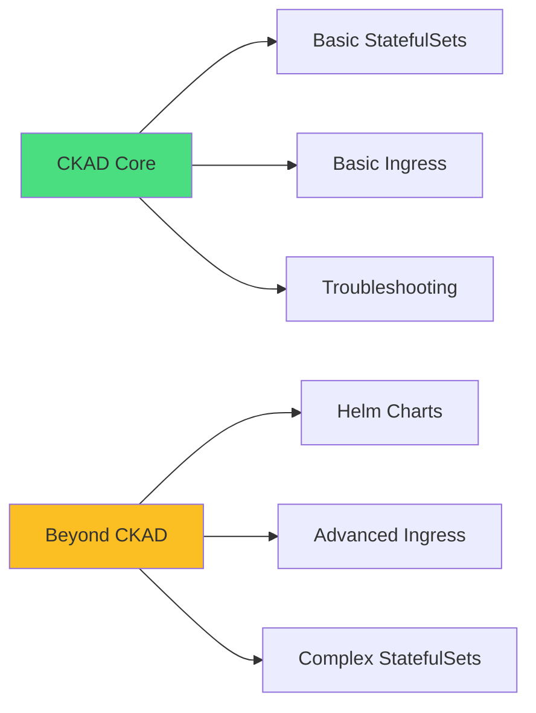
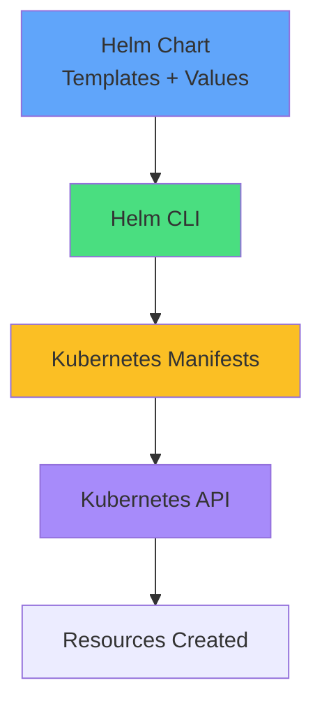
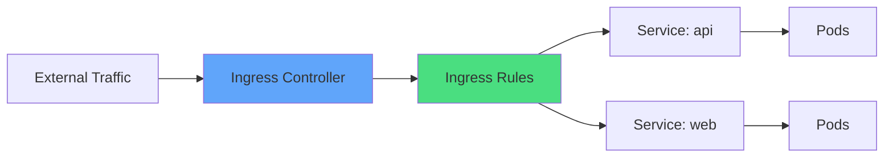
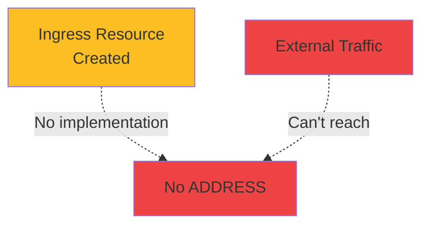
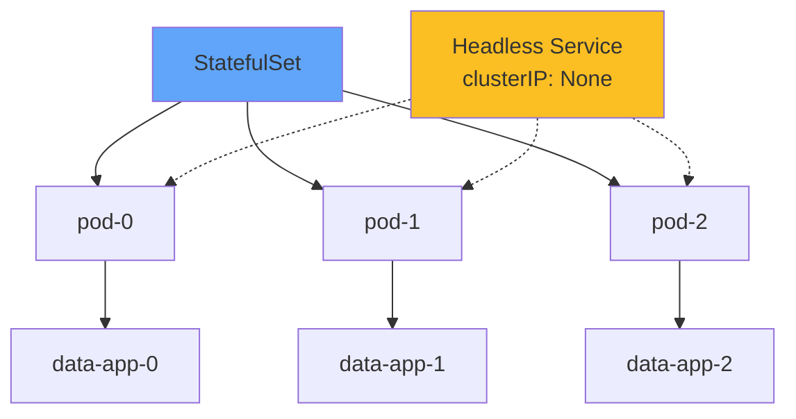
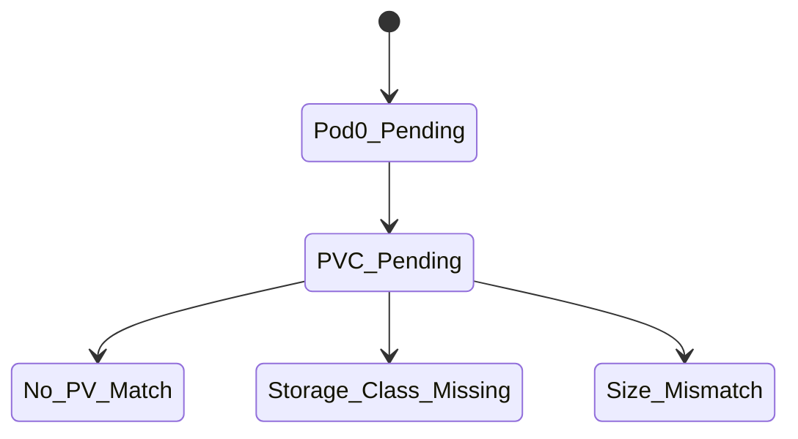
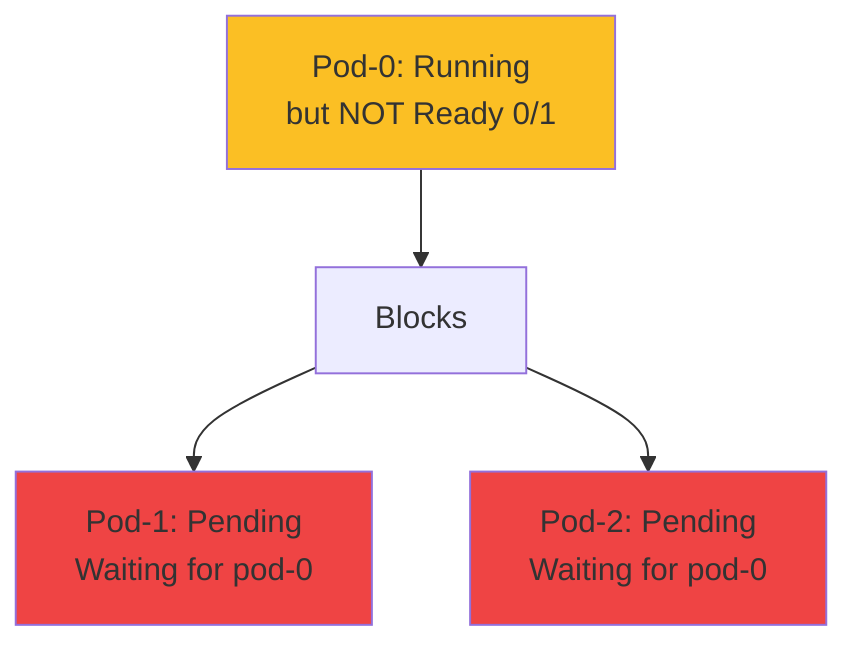
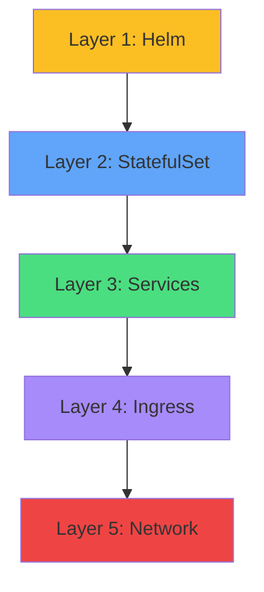
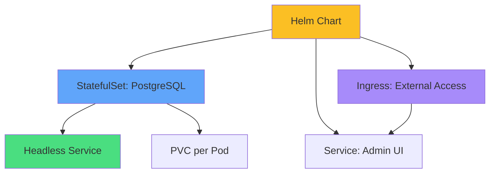
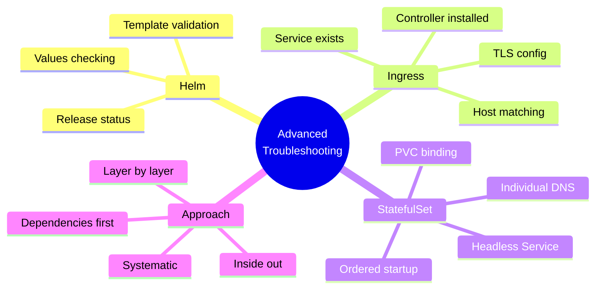

# Troubleshooting Advanced Components

<div class="abs-br m-6 flex gap-2">
  <carbon-tool-kit class="text-6xl text-blue-400" />
</div>

<!--
METADATA:
sentence: This session covers Helm charts, Ingress controllers, and StatefulSets—topics that extend beyond core CKAD but are valuable for real-world Kubernetes work.
search_anchor: Helm charts, Ingress controllers, and StatefulSets
-->
<div v-click class="mt-8 text-xl opacity-80">
Helm, Ingress, and StatefulSets
</div>

---
layout: center
---

# Scope and CKAD Relevance

<!--
METADATA:
sentence: While StatefulSets and basic Ingress concepts appear in CKAD, this lab focuses on advanced troubleshooting with Helm packaging, which is beyond CKAD scope.
search_anchor: StatefulSets and basic Ingress concepts appear in CKAD
-->
<div v-click="1">



</div>

<div class="grid grid-cols-2 gap-6 mt-8 text-sm">
<!--
METADATA:
sentence: Basic StatefulSet concepts (covered in core CKAD)
search_anchor: Basic StatefulSet concepts
-->
<div v-click="2">
<carbon-checkmark class="text-4xl text-green-400 mb-2" />
<strong>In CKAD Scope</strong><br/>
Basic concepts and troubleshooting
</div>
<!--
METADATA:
sentence: Helm chart creation and templates
search_anchor: Helm chart creation and templates
-->
<div v-click="3">
<carbon-education class="text-4xl text-yellow-400 mb-2" />
<strong>Beyond CKAD</strong><br/>
Helm, advanced patterns
</div>
</div>

<!--
METADATA:
sentence: Recommendation: Focus on core CKAD topics first, then return to this as enrichment.
search_anchor: Focus on core CKAD topics first
-->
<div v-click="4" class="mt-8 text-center text-sm opacity-80">
Learn foundational skills that transfer to advanced scenarios
</div>

---
layout: center
---

# Helm Overview

<!--
METADATA:
sentence: Helm is a package manager for Kubernetes - think "apt" or "yum" for Kubernetes applications.
search_anchor: package manager for Kubernetes
-->
<div v-click="1">



</div>

<div class="grid grid-cols-3 gap-4 mt-8 text-sm">
<!--
METADATA:
sentence: Chart - Package of Kubernetes resources
search_anchor: Chart - Package of Kubernetes resources
-->
<div v-click="2">
<carbon-package class="text-3xl text-blue-400 mb-2" />
<strong>Chart</strong><br/>
Package of resources
</div>
<!--
METADATA:
sentence: Release - Installed instance of a chart
search_anchor: Release - Installed instance of a chart
-->
<div v-click="3">
<carbon-deployment-pattern class="text-3xl text-green-400 mb-2" />
<strong>Release</strong><br/>
Installed instance
</div>
<!--
METADATA:
sentence: Values - Configuration parameters for charts
search_anchor: Values - Configuration parameters for charts
-->
<div v-click="4">
<carbon-settings class="text-3xl text-purple-400 mb-2" />
<strong>Values</strong><br/>
Configuration parameters
</div>
</div>

<!--
METADATA:
sentence: Helm is a package manager for Kubernetes - think "apt" or "yum" for Kubernetes applications.
search_anchor: think "apt" or "yum" for Kubernetes
-->
<div v-click="5" class="mt-6 text-center text-lg">
<carbon-idea class="inline-block text-2xl text-yellow-400" /> Think "apt" or "yum" for Kubernetes
</div>

---
layout: center
---

# Helm Issues: Template Rendering

<!--
METADATA:
sentence: Invalid Go template syntax breaks chart installation.
search_anchor: Invalid Go template syntax breaks chart installation
-->
<div v-click="1">

```yaml
# Wrong - unclosed template
replicas: {{ .Values.replicaCount

# Right - properly closed
replicas: {{ .Values.replicaCount }}
```

</div>

<!--
METADATA:
sentence: Error: parse error at (deployment.yaml:10): unclosed action
search_anchor: parse error at (deployment.yaml:10): unclosed action
-->
<div v-click="2" class="mt-8">

```bash
# Error message
Error: parse error at (deployment.yaml:10): unclosed action
```

</div>

<!--
METADATA:
sentence: Dry-run to test templates
search_anchor: Dry-run to test templates
-->
<div v-click="3" class="mt-8">

```bash
# Diagnose with dry-run
helm install myapp ./chart --dry-run --debug

# Check rendered output
helm template myapp ./chart
```

</div>

<!--
METADATA:
sentence: Dry-run to test templates
search_anchor: test templates
-->
<div v-click="4" class="mt-6 text-center text-green-400">
<carbon-checkmark class="inline-block text-2xl" /> Always test templates before installing
</div>

---
layout: center
---

# Helm Issues: Missing Values

<!--
METADATA:
sentence: Chart expects values that aren't provided.
search_anchor: Chart expects values that aren't provided
-->
<div v-click="1">

```yaml
# values.yaml missing tag
image:
  repository: myapp
  # tag is missing!

# Template uses
image: {{ .Values.image.repository }}:{{ .Values.image.tag }}
# Results in: myapp:<no value>
```

</div>

<!--
METADATA:
sentence: ImagePullBackOff (if tag is missing)
search_anchor: ImagePullBackOff (if tag is missing)
-->
<div v-click="2" class="mt-8 text-center text-red-400">
<carbon-close class="inline-block text-3xl" /> Results in ImagePullBackOff!
</div>

<!--
METADATA:
sentence: helm get values <release-name>
search_anchor: helm get values
-->
<div v-click="3" class="mt-6">

```bash
# Check what values were used
helm get values <release-name>

# Check full manifest
helm get manifest <release-name>
```

</div>

---
layout: center
---

# Helm Troubleshooting Commands

<!--
METADATA:
sentence: List releases
search_anchor: List releases
-->
<div v-click="1" class="text-sm">

```bash
# List releases
helm list --all-namespaces

# Show release status
helm status <release-name>

# Show values used
helm get values <release-name>

# Show deployed manifests
helm get manifest <release-name>

# Show release history
helm history <release-name>

# Uninstall stuck release
helm uninstall <release-name>
```

</div>

<!--
METADATA:
sentence: Start with "helm status" for quick overview
search_anchor: Start with "helm status" for quick overview
-->
<div v-click="2" class="mt-8 text-center">
<carbon-idea class="inline-block text-2xl text-yellow-400" /> Start with "helm status" for quick overview
</div>

---
layout: center
---

# Ingress Controller Overview

<!--
METADATA:
sentence: Ingress manages external HTTP/HTTPS access to services in a cluster.
search_anchor: Ingress manages external HTTP/HTTPS access
-->
<div v-click="1">



</div>

<div class="grid grid-cols-2 gap-6 mt-8 text-sm">
<!--
METADATA:
sentence: Ingress Resource - Rules for routing traffic
search_anchor: Ingress Resource - Rules for routing traffic
-->
<div v-click="2">
<carbon-network-3 class="text-4xl text-blue-400 mb-2" />
<strong>Ingress Resource</strong><br/>
Rules for routing
</div>
<!--
METADATA:
sentence: Ingress Controller - Implements the rules (nginx, traefik, etc.)
search_anchor: Ingress Controller - Implements the rules
-->
<div v-click="3">
<carbon-server class="text-4xl text-green-400 mb-2" />
<strong>Ingress Controller</strong><br/>
Implements rules (nginx, traefik)
</div>
</div>

<!--
METADATA:
sentence: Layer 7 (HTTP/HTTPS)
search_anchor: Layer 7 (HTTP/HTTPS)
-->
<div v-click="4" class="mt-6 text-center text-lg">
Layer 7 (HTTP/HTTPS) routing through single IP
</div>

---
layout: center
---

# Ingress Issues: No Controller

<!--
METADATA:
sentence: Ingress resource created but no controller to implement it.
search_anchor: Ingress resource created but no controller
-->
<div v-click="1">



</div>

<!--
METADATA:
sentence: Ingress created but no ADDRESS
search_anchor: Ingress created but no ADDRESS
-->
<div v-click="2" class="mt-8 text-center text-red-400 text-xl">
<carbon-warning class="inline-block text-3xl" /> Ingress without controller does nothing!
</div>

<!--
METADATA:
sentence: Check if ingress controller pods exist
search_anchor: Check if ingress controller pods exist
-->
<div v-click="3" class="mt-6">

```bash
# Check if controller installed
kubectl get pods -n ingress-nginx
kubectl get pods -A | grep ingress

# Ingress shows no ADDRESS if no controller
kubectl get ingress
```

</div>

---
layout: center
---

# Ingress Issues: Service Not Found

<!--
METADATA:
sentence: Ingress references service that doesn't exist or is in wrong namespace.
search_anchor: Ingress references service that doesn't exist
-->
<div v-click="1">

```yaml
apiVersion: networking.k8s.io/v1
kind: Ingress
spec:
  rules:
  - host: app.local
    http:
      paths:
      - path: /
        backend:
          service:
            name: webapp  # Must exist!
            port:
              number: 80
```

</div>

<!--
METADATA:
sentence: kubectl get svc webapp  # Does it exist?
search_anchor: kubectl get svc webapp
-->
<div v-click="2" class="mt-8">

```bash
kubectl get svc webapp  # Does it exist?
kubectl describe ingress myapp  # Check backend status
```

</div>

<!--
METADATA:
sentence: Service must exist!
search_anchor: Service must exist
-->
<div v-click="3" class="mt-6 text-center text-yellow-400">
<carbon-warning class="inline-block text-2xl" /> Service must exist in same namespace!
</div>

---
layout: center
---

# Ingress Issues: Host/Path Matching

<!--
METADATA:
sentence: Requests don't match ingress rules.
search_anchor: Requests don't match ingress rules
-->
<div v-click="1">

```yaml
# Ingress expects
host: whoami.local
path: /

# Request without host header
curl http://localhost:8000  # Doesn't match!
```

</div>

<!--
METADATA:
sentence: Include host header
search_anchor: Include host header
-->
<div v-click="2" class="mt-8">

```bash
# Fix: Include host header
curl -H "Host: whoami.local" http://localhost:8000

# Or add to /etc/hosts
echo "127.0.0.1 whoami.local" >> /etc/hosts
curl http://whoami.local:8000
```

</div>

<!--
METADATA:
sentence: Host header must match Ingress rule
search_anchor: Host header must match Ingress rule
-->
<div v-click="3" class="mt-6 text-center text-green-400">
<carbon-checkmark class="inline-block text-2xl" /> Host header must match Ingress rule
</div>

---
layout: center
---

# StatefulSet Recap

<!--
METADATA:
sentence: Stateful applications (databases, message queues)
search_anchor: Stateful applications
-->
<div v-click="1">



</div>

<div class="grid grid-cols-3 gap-4 mt-8 text-sm text-center">
<!--
METADATA:
sentence: Ordered creation and deletion
search_anchor: Ordered creation and deletion
-->
<div v-click="2">
<carbon-order-details class="text-3xl text-blue-400 mb-2" />
<strong>Ordered</strong><br/>
Sequential startup
</div>
<!--
METADATA:
sentence: Stable network identity - pod-0.service.namespace.svc.cluster.local
search_anchor: Stable network identity
-->
<div v-click="3">
<carbon-dns-services class="text-3xl text-green-400 mb-2" />
<strong>Stable DNS</strong><br/>
pod-0.service
</div>
<!--
METADATA:
sentence: Each pod gets its own PVC
search_anchor: Each pod gets its own PVC
-->
<div v-click="4">
<carbon-data-volume class="text-3xl text-purple-400 mb-2" />
<strong>Per-Pod PVC</strong><br/>
Dedicated storage
</div>
</div>

---
layout: center
---

# StatefulSet Issues: PVC Not Binding

<!--
METADATA:
sentence: StatefulSet pod can't start because PVC isn't bound.
search_anchor: StatefulSet pod can't start because PVC isn't bound
-->
<div v-click="1">



</div>

<!--
METADATA:
sentence: Check pods
search_anchor: Check pods
-->
<div v-click="2" class="mt-8">

```bash
# Check pods
kubectl get pods
# Shows: pod-0 Pending

# Check PVCs
kubectl get pvc
# Shows: data-pod-0 Pending

# Check why
kubectl describe pvc data-pod-0
```

</div>

<!--
METADATA:
sentence: Fix: Create PV or adjust storage class
search_anchor: Fix: Create PV or adjust storage class
-->
<div v-click="3" class="mt-6 text-center text-green-400">
<carbon-checkmark class="inline-block text-2xl" /> Fix: Create matching PV or configure StorageClass
</div>

---
layout: center
---

# StatefulSet Issues: Ordered Startup Blocking

<!--
METADATA:
sentence: Pod-1 won't start because pod-0 isn't ready.
search_anchor: Pod-1 won't start because pod-0 isn't ready
-->
<div v-click="1">



</div>

<!--
METADATA:
sentence: pod-0: Running but not Ready (0/1)
search_anchor: pod-0: Running but not Ready
-->
<div v-click="2" class="mt-8 text-center text-yellow-400 text-lg">
<carbon-warning class="inline-block text-2xl" /> Pod-1 won't start until Pod-0 is Ready!
</div>

<!--
METADATA:
sentence: Check why pod-0 isn't ready
search_anchor: Check why pod-0 isn't ready
-->
<div v-click="3" class="mt-6">

```bash
# Check why pod-0 isn't ready
kubectl describe pod pod-0
kubectl logs pod-0

# Fix pod-0 first, then others will start
```

</div>

---
layout: center
---

# StatefulSet Issues: Missing Headless Service

<!--
METADATA:
sentence: StatefulSet requires headless service for DNS.
search_anchor: StatefulSet requires headless service for DNS
-->
<div v-click="1">

```yaml
# Required: Headless service
apiVersion: v1
kind: Service
metadata:
  name: database
spec:
  clusterIP: None  # This makes it headless!
  selector:
    app: postgres
```

</div>

<!--
METADATA:
sentence: clusterIP: None  # This makes it headless!
search_anchor: This makes it headless
-->
<div v-click="2">

```yaml
# StatefulSet references it
apiVersion: apps/v1
kind: StatefulSet
metadata:
  name: postgres
spec:
  serviceName: database  # Must match
```

</div>

<!--
METADATA:
sentence: Without headless service: Pod DNS doesn't work.
search_anchor: Without headless service
-->
<div v-click="3" class="mt-6 text-center text-red-400">
<carbon-close class="inline-block text-2xl" /> Without headless service, individual Pod DNS doesn't work!
</div>

---
layout: center
---

# Layer-by-Layer Troubleshooting

<!--
METADATA:
sentence: Layer-by-Layer Approach
search_anchor: Layer-by-Layer Approach
-->
<div v-click="1">



</div>

<!--
METADATA:
sentence: helm list  # Is release installed?
search_anchor: helm list
-->
<div v-click="2" class="mt-8 text-sm">

```bash
# Layer 1: Helm
helm list && helm status <release>

# Layer 2: StatefulSet
kubectl get statefulset && kubectl get pods

# Layer 3: Services
kubectl get svc && kubectl get endpoints

# Layer 4: Ingress
kubectl get ingress && kubectl describe ingress <name>

# Layer 5: Network
kubectl run test --image=busybox -it --rm -- wget -O- http://svc
```

</div>

---
layout: center
---

# Complex System Example

<!--
METADATA:
sentence: Helm chart deploying PostgreSQL (StatefulSet) with Ingress for admin UI.
search_anchor: Helm chart deploying PostgreSQL
-->
<div v-click="1">



</div>

<!--
METADATA:
sentence: Troubleshoot from inside out
search_anchor: Troubleshoot from inside out
-->
<div v-click="2" class="mt-8 text-center">
<strong class="text-lg">Troubleshoot from inside out</strong>
</div>

<!--
METADATA:
sentence: Check Helm release status
search_anchor: Check Helm release status
-->
<div v-click="3" class="grid grid-cols-2 gap-4 mt-6 text-xs">
<div>
1. Check Helm release status
</div>
<div>
2. Verify StatefulSet pods running
</div>
<div>
3. Check PVCs bound
</div>
<div>
4. Verify services have endpoints
</div>
<div>
5. Test Ingress routing
</div>
<div>
6. Check network connectivity
</div>
</div>

---
layout: center
---

# CKAD Candidates: Focus Areas

<div class="grid grid-cols-2 gap-6 mt-6">
<!--
METADATA:
sentence: Master these first:
search_anchor: Master these first
-->
<div v-click="1">
<carbon-checkmark class="text-4xl text-green-400 mb-2" />
<strong>Priority: Core CKAD</strong><br/>
<span class="text-sm opacity-80">Deployments, Services, basic Ingress</span>
</div>
<!--
METADATA:
sentence: Learn later:
search_anchor: Learn later
-->
<div v-click="2">
<carbon-education class="text-4xl text-blue-400 mb-2" />
<strong>Later: Advanced</strong><br/>
<span class="text-sm opacity-80">Helm, complex StatefulSets</span>
</div>
<!--
METADATA:
sentence: Systematic debugging approach transfers
search_anchor: Systematic debugging approach transfers
-->
<div v-click="3">
<carbon-flow class="text-4xl text-purple-400 mb-2" />
<strong>Transferable: Approach</strong><br/>
<span class="text-sm opacity-80">Systematic debugging works everywhere</span>
</div>
<!--
METADATA:
sentence: kubectl commands work for all resource types
search_anchor: kubectl commands work for all resource types
-->
<div v-click="4">
<carbon-tools class="text-4xl text-yellow-400 mb-2" />
<strong>Universal: kubectl</strong><br/>
<span class="text-sm opacity-80">Same commands for all resources</span>
</div>
</div>

<!--
METADATA:
sentence: Master fundamentals first, then explore advanced topics
search_anchor: Master fundamentals first
-->
<div v-click="5" class="mt-8 text-center text-sm opacity-80">
Master fundamentals first, then explore advanced topics
</div>

---
layout: center
---

# Key Troubleshooting Commands

<!--
METADATA:
sentence: helm list
search_anchor: Troubleshooting Commands
-->
<div v-click="1" class="text-sm">

```bash
# Helm
helm list
helm status <release>
helm get values <release>
helm get manifest <release>

# StatefulSet
kubectl get statefulset
kubectl describe statefulset <name>
kubectl get pvc  # Check volumes

# Ingress
kubectl get ingress
kubectl describe ingress <name>
kubectl get pods -n ingress-nginx  # Check controller

# Network Testing
kubectl run debug --image=busybox -it --rm -- wget -O- http://svc
```

</div>

---
layout: center
---

# Common Pitfalls

<div class="grid grid-cols-2 gap-4 text-sm">
<!--
METADATA:
sentence: Ingress without controller to be installed
search_anchor: Ingress without controller
-->
<div v-click="1">
<carbon-close class="inline-block text-2xl text-red-400" /> Ingress without controller
</div>
<!--
METADATA:
sentence: StatefulSet without headless Service
search_anchor: StatefulSet without headless Service
-->
<div v-click="2">
<carbon-close class="inline-block text-2xl text-red-400" /> StatefulSet without headless Service
</div>
<!--
METADATA:
sentence: Helm values not propagating
search_anchor: Helm values not propagating
-->
<div v-click="3">
<carbon-close class="inline-block text-2xl text-red-400" /> Helm values not propagating
</div>
<!--
METADATA:
sentence: PVC not binding for StatefulSet
search_anchor: PVC not binding for StatefulSet
-->
<div v-click="4">
<carbon-close class="inline-block text-2xl text-red-400" /> PVC not binding for StatefulSet
</div>
<!--
METADATA:
sentence: Ingress host header mismatch
search_anchor: Ingress host header mismatch
-->
<div v-click="5">
<carbon-close class="inline-block text-2xl text-red-400" /> Ingress host header mismatch
</div>
<!--
METADATA:
sentence: Service in wrong namespace
search_anchor: Service in wrong namespace
-->
<div v-click="6">
<carbon-close class="inline-block text-2xl text-red-400" /> Service in wrong namespace
</div>
<!--
METADATA:
sentence: Port configuration errors
search_anchor: Port configuration errors
-->
<div v-click="7">
<carbon-close class="inline-block text-2xl text-red-400" /> Port configuration errors
</div>
<!--
METADATA:
sentence: Pod-0 blocking StatefulSet startup
search_anchor: Pod-0 blocking StatefulSet startup
-->
<div v-click="8">
<carbon-close class="inline-block text-2xl text-red-400" /> Pod-0 blocking StatefulSet startup
</div>
</div>

<!--
METADATA:
sentence: Check dependencies before assuming resource issues
search_anchor: Check dependencies before assuming resource issues
-->
<div v-click="9" class="mt-8 text-center">
<carbon-idea class="inline-block text-2xl text-yellow-400" /> Check dependencies before assuming resource issues
</div>

---
layout: center
---

# Summary

<!--
METADATA:
sentence: Let's recap what we've covered.
search_anchor: Let's recap
-->
<div v-click="1">



</div>

---
layout: center
---

# Key Takeaways

<div class="grid grid-cols-2 gap-6 mt-6">
<!--
METADATA:
sentence: Helm troubleshooting starts with template validation
search_anchor: Helm troubleshooting starts with template validation
-->
<div v-click="1">
<antml-package class="text-4xl text-blue-400 mb-2" />
<strong>Helm troubleshooting</strong><br/>
<span class="text-sm opacity-80">Start with template validation</span>
</div>
<!--
METADATA:
sentence: Ingress requires controller to be installed
search_anchor: Ingress requires controller to be installed
-->
<div v-click="2">
<carbon-network-3 class="text-4xl text-green-400 mb-2" />
<strong>Ingress requires controller</strong><br/>
<span class="text-sm opacity-80">Check installation first</span>
</div>
<!--
METADATA:
sentence: StatefulSets have ordered startup/shutdown
search_anchor: StatefulSets have ordered startup/shutdown
-->
<div v-click="3">
<carbon-order-details class="text-4xl text-purple-400 mb-2" />
<strong>StatefulSet ordering</strong><br/>
<span class="text-sm opacity-80">Sequential startup/shutdown</span>
</div>
<!--
METADATA:
sentence: Complex systems need layer-by-layer debugging
search_anchor: Complex systems need layer-by-layer debugging
-->
<div v-click="4">
<carbon-debug class="text-4xl text-yellow-400 mb-2" />
<strong>Layer-by-layer</strong><br/>
<span class="text-sm opacity-80">Systematic debugging</span>
</div>
</div>

<!--
METADATA:
sentence: Remember: Advanced troubleshooting builds on foundational skills. Master the basics first!
search_anchor: Master the basics first
-->
<div v-click="5" class="mt-8 text-center text-lg">
<carbon-certificate class="inline-block text-3xl text-green-400" /> Master fundamentals, then explore advanced! <carbon-arrow-right class="inline-block text-2xl" />
</div>
