# Troubleshooting Kubernetes Apps

<div class="abs-br m-6 flex gap-2">
  <carbon-debug class="text-6xl text-blue-400" />
</div>

<!--
METADATA:
sentence: This is a critical CKAD exam skill that spans multiple domains and can make the difference between passing and failing.
search_anchor: critical CKAD exam skill
-->
<div v-click class="mt-8 text-xl opacity-80">
Essential CKAD skill for diagnosing and fixing issues
</div>

---
layout: center
---

# The Troubleshooting Challenge

<!--
METADATA:
sentence: Kubernetes validates YAML syntax but doesn't guarantee your app will work.
search_anchor: validates YAML syntax
-->
<div v-click="1">

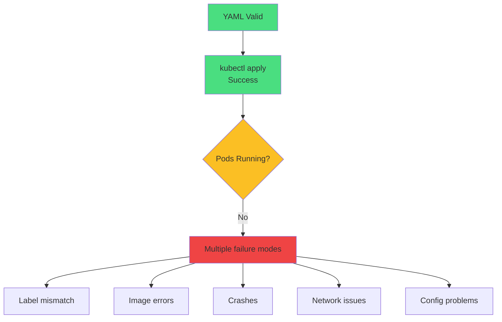

</div>

<!--
METADATA:
sentence: Kubernetes validates YAML syntax but doesn't guarantee your app will work.
search_anchor: validates YAML syntax but doesn't guarantee
-->
<div v-click="2" class="mt-8 text-center text-yellow-400">
<carbon-warning class="inline-block text-3xl" /> Kubernetes validates syntax, not functionality!
</div>

<!--
METADATA:
sentence: Objects are loosely coupled. A typo in a label breaks everything, but Kubernetes won't tell you until you investigate.
search_anchor: Objects are loosely coupled
-->
<div v-click="3" class="text-center text-sm opacity-80">
Objects are loosely coupled - typos break everything silently
</div>

---
layout: center
---

# Systematic Troubleshooting

<!--
METADATA:
sentence: The 5-Step Debugging Process.
search_anchor: 5-Step Debugging Process
-->
<div v-click="1">

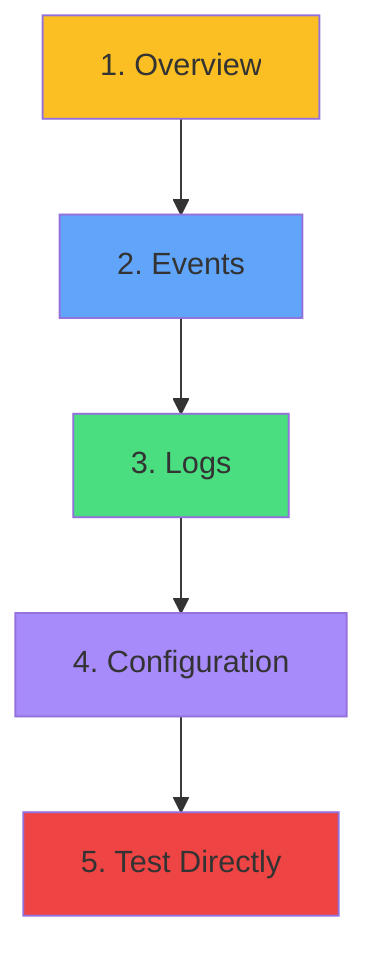

</div>

<div class="grid grid-cols-3 gap-4 mt-8 text-sm">
<!--
METADATA:
sentence: Get Overview - kubectl get to see resource status.
search_anchor: Get Overview - kubectl get
-->
<div v-click="2">
<carbon-view class="text-3xl text-yellow-400 mb-2" />
<strong>Get Overview</strong><br/>
kubectl get
</div>
<!--
METADATA:
sentence: Check Events - kubectl describe for recent events and errors.
search_anchor: Check Events - kubectl describe
-->
<div v-click="3">
<carbon-event class="text-3xl text-blue-400 mb-2" />
<strong>Check Events</strong><br/>
kubectl describe
</div>
<!--
METADATA:
sentence: Review Logs - kubectl logs for application-level issues.
search_anchor: Review Logs - kubectl logs
-->
<div v-click="4">
<carbon-document class="text-3xl text-green-400 mb-2" />
<strong>Review Logs</strong><br/>
kubectl logs
</div>
<!--
METADATA:
sentence: Verify Configuration - Check selectors, labels, ports, names.
search_anchor: Verify Configuration - Check selectors
-->
<div v-click="5">
<carbon-settings class="text-3xl text-purple-400 mb-2" />
<strong>Verify Config</strong><br/>
Check selectors
</div>
<!--
METADATA:
sentence: Test Directly - Use port-forward or exec to bypass layers.
search_anchor: Test Directly - Use port-forward
-->
<div v-click="6">
<carbon-test-tool class="text-3xl text-red-400 mb-2" />
<strong>Test Direct</strong><br/>
port-forward, exec
</div>
</div>

<!--
METADATA:
sentence: In the CKAD exam, you should identify most issues within 2-3 minutes using this approach.
search_anchor: identify most issues within 2-3 minutes
-->
<div v-click="7" class="mt-8 text-center text-lg">
<carbon-time class="inline-block text-2xl text-yellow-400" /> CKAD: Identify issues in 2-3 minutes
</div>

---
layout: center
---

# Essential Troubleshooting Commands

<!--
METADATA:
sentence: Level 1: Overview Commands.
search_anchor: Level 1: Overview Commands
-->
<div v-click="1" class="mb-4 text-sm">

```bash
# Level 1: Overview
kubectl get pods
kubectl get pods -o wide
kubectl get all
kubectl get events --sort-by='.lastTimestamp'
```

</div>

<!--
METADATA:
sentence: Level 2: Detailed Investigation.
search_anchor: Level 2: Detailed Investigation
-->
<div v-click="2" class="mb-4 text-sm">

```bash
# Level 2: Detailed Investigation
kubectl describe pod <pod-name>
kubectl logs <pod-name>
kubectl logs <pod-name> --previous  # Previous crash!
kubectl logs <pod-name> -c <container>  # Multi-container
```

</div>

<!--
METADATA:
sentence: Level 3: Interactive Debugging.
search_anchor: Level 3: Interactive Debugging
-->
<div v-click="3" class="text-sm">

```bash
# Level 3: Interactive Debugging
kubectl exec -it <pod-name> -- sh
kubectl port-forward <pod-name> 8080:80
kubectl run debug --image=busybox -it --rm -- sh
```

</div>

<!--
METADATA:
sentence: Memorize these commands! They're your primary diagnostic tools.
search_anchor: Memorize these commands
-->
<div v-click="4" class="mt-6 text-center text-red-400">
<carbon-warning class="inline-block text-2xl" /> Memorize these for the exam!
</div>

---
layout: center
---

# ImagePullBackOff

<!--
METADATA:
sentence: Common Pod Failure #1 - ImagePullBackOff.
search_anchor: Common Pod Failure #1 - ImagePullBackOff
-->
<div v-click="1">

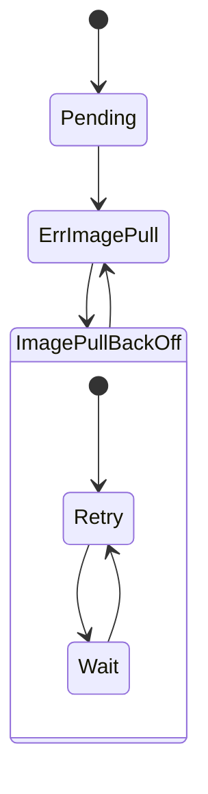

</div>

<div class="grid grid-cols-2 gap-4 mt-6 text-sm">
<!--
METADATA:
sentence: Symptoms: Pod status: ImagePullBackOff or ErrImagePull.
search_anchor: Symptoms: ImagePullBackOff or ErrImagePull
-->
<div v-click="2">
<carbon-warning class="inline-block text-2xl text-yellow-400" /> <strong>Symptoms:</strong><br/>
Pod stuck in ImagePullBackOff
</div>
<!--
METADATA:
sentence: Root Causes: Typo in image name or tag (most common), image doesn't exist in registry, private registry authentication failure.
search_anchor: Root Causes: Typo in image name
-->
<div v-click="3">
<carbon-close class="inline-block text-2xl text-red-400" /> <strong>Root Causes:</strong><br/>
Image name typo, doesn't exist, auth failure
</div>
</div>

<!--
METADATA:
sentence: Diagnosis: kubectl describe pod shows "Failed to pull image" with details.
search_anchor: Diagnosis: kubectl describe pod
-->
<div v-click="4" class="mt-6">

```bash
kubectl describe pod <name>
# Events: "Failed to pull image" with details
```

</div>

<!--
METADATA:
sentence: Common Fixes: Fix wrong image name or add image pull secret for private registry.
search_anchor: Fix: Correct image name or add imagePullSecret
-->
<div v-click="5" class="mt-4 text-center text-green-400">
<carbon-checkmark class="inline-block text-2xl" /> Fix: Correct image name or add imagePullSecret
</div>

---
layout: center
---

# CrashLoopBackOff

<!--
METADATA:
sentence: Common Pod Failure #2 - CrashLoopBackOff.
search_anchor: Common Pod Failure #2 - CrashLoopBackOff
-->
<div v-click="1">

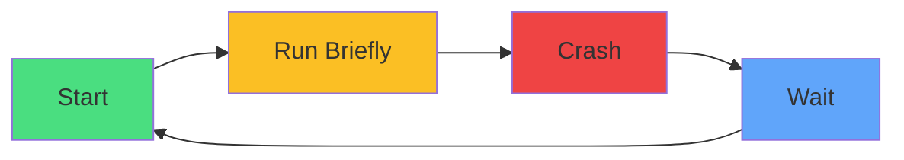

</div>

<div class="grid grid-cols-2 gap-4 mt-6 text-sm">
<!--
METADATA:
sentence: Symptoms: Pod status: CrashLoopBackOff, restart count increases continuously.
search_anchor: Symptoms: CrashLoopBackOff
-->
<div v-click="2">
<carbon-restart class="inline-block text-2xl text-yellow-400" /> <strong>Symptoms:</strong><br/>
RESTARTS count increasing
</div>
<!--
METADATA:
sentence: Root Causes: Application error at startup (missing config, bad code), missing dependencies, incorrect command or arguments, failed liveness probe (too aggressive settings), resource constraints (OOMKilled).
search_anchor: Root Causes: Application error at startup
-->
<div v-click="3">
<carbon-close class="inline-block text-2xl text-red-400" /> <strong>Root Causes:</strong><br/>
App error, missing config, failed probe, OOMKilled
</div>
</div>

<!--
METADATA:
sentence: Diagnosis: kubectl logs <pod-name> --previous - CRITICAL! Check logs from crashed container.
search_anchor: Diagnosis: kubectl logs --previous
-->
<div v-click="4" class="mt-6">

```bash
kubectl logs <pod-name> --previous  # CRITICAL!
kubectl describe pod <name>
# Check: Last State: Terminated (Exit Code)
```

</div>

<!--
METADATA:
sentence: Always check --previous logs! Current logs show the RESTART, not the original crash.
search_anchor: Always check --previous logs
-->
<div v-click="5" class="mt-4 text-center text-red-400 text-sm">
<carbon-warning class="inline-block text-2xl" /> Always check --previous logs for crashes!
</div>

---
layout: center
---

# Pending State

<!--
METADATA:
sentence: Common Pod Failure #3 - Pending State.
search_anchor: Common Pod Failure #3 - Pending State
-->
<div v-click="1">

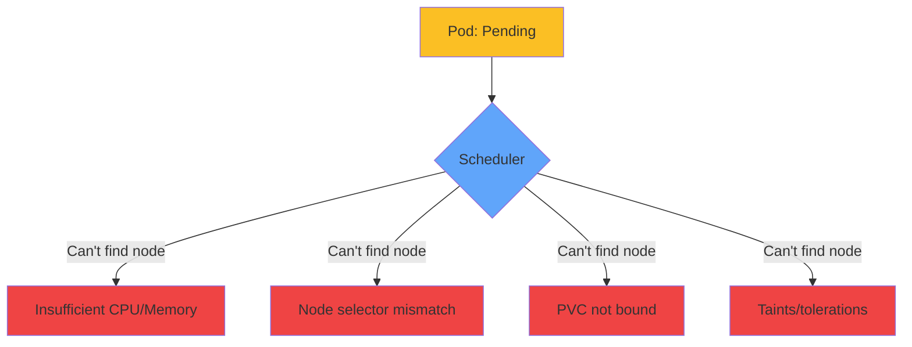

</div>

<!--
METADATA:
sentence: Diagnosis: kubectl describe pod shows scheduling errors like "Insufficient cpu", "Insufficient memory", "No nodes available that match selector", "PersistentVolumeClaim not bound".
search_anchor: Diagnosis: kubectl describe pod for scheduling errors
-->
<div v-click="2" class="mt-8">

```bash
kubectl describe pod <name>
# Events show:
# - "Insufficient cpu" or "Insufficient memory"
# - "No nodes available that match selector"
# - "persistentvolumeclaim not bound"
```

</div>

<!--
METADATA:
sentence: Common Fixes: Reduce resource requests, fix node selector, or create PersistentVolume if missing.
search_anchor: Fix: Reduce requests, fix selector, create PV
-->
<div v-click="3" class="mt-6 text-center text-green-400">
<carbon-checkmark class="inline-block text-2xl" /> Fix: Reduce requests, fix selector, create PV
</div>

---
layout: center
---

# Service Not Finding Pods

<!--
METADATA:
sentence: The Most Common Kubernetes Problem: Service can't find pods!
search_anchor: Most Common Kubernetes Problem
-->
<div v-click="1">

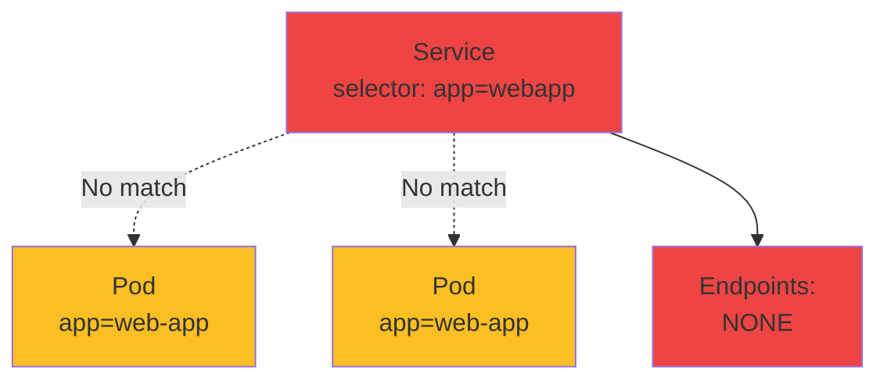

</div>

<!--
METADATA:
sentence: The Most Common Kubernetes Problem: Service can't find pods!
search_anchor: Most common Kubernetes problem
-->
<div v-click="2" class="mt-8 text-center text-xl text-red-400">
<carbon-warning class="inline-block text-3xl" /> Most common Kubernetes problem!
</div>

<!--
METADATA:
sentence: Diagnosis: kubectl get endpoints shows <none>, kubectl get pods --show-labels finds label mismatch.
search_anchor: kubectl get endpoints
-->
<div v-click="3" class="mt-6">

```bash
kubectl get endpoints <service-name>
# Shows: <none>  ← Problem!

kubectl get pods --show-labels
# Find label mismatch
```

</div>

<!--
METADATA:
sentence: Service selector must match Pod labels exactly.
search_anchor: Service selector must match Pod labels
-->
<div v-click="4" class="mt-4 text-center text-sm opacity-80">
Service selector must match Pod labels exactly
</div>

---
layout: center
---

# Port Mismatch

<!--
METADATA:
sentence: Issue 2: Port Mismatch - Service targetPort doesn't match container port.
search_anchor: Issue 2: Port Mismatch
-->
<div v-click="1">

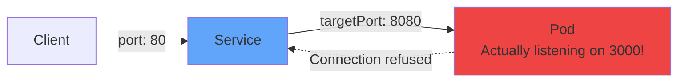

</div>

<!--
METADATA:
sentence: Problem: Service targetPort doesn't match container port.
search_anchor: targetPort doesn't match container port
-->
<div v-click="2" class="mt-8">

```yaml
# Service expects
targetPort: 8080

# Container actually uses
containerPort: 3000  # Mismatch!
```

</div>

<!--
METADATA:
sentence: Diagnosis: Test directly with port-forward - if this works but service doesn't, it's a port mismatch.
search_anchor: Test directly with port-forward
-->
<div v-click="3" class="mt-6">

```bash
# Test directly with port-forward
kubectl port-forward pod/webapp-xxxx 8080:3000
# If this works but service doesn't → port mismatch
```

</div>

<!--
METADATA:
sentence: Fix: Match targetPort to containerPort.
search_anchor: Match targetPort to containerPort
-->
<div v-click="4" class="mt-6 text-center text-green-400">
<carbon-checkmark class="inline-block text-2xl" /> Fix: Match targetPort to containerPort
</div>

---
layout: center
---

# Container Not Ready

<!--
METADATA:
sentence: Container Not Ready - Pod status: Running but not Ready.
search_anchor: Container Not Ready
-->
<div v-click="1">

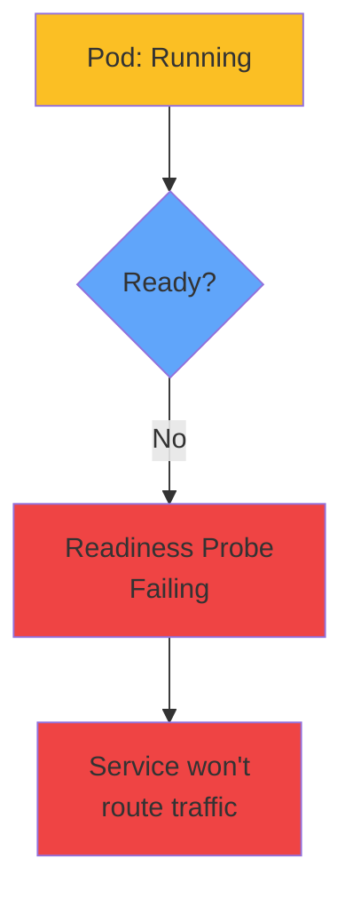

</div>

<div class="grid grid-cols-2 gap-6 mt-8 text-sm">
<!--
METADATA:
sentence: Symptoms: Pod status: Running but not Ready, shows as 0/1 or 0/2 in READY column.
search_anchor: Symptoms: Running but not Ready
-->
<div v-click="2">
<carbon-warning class="inline-block text-2xl text-yellow-400" /> <strong>Symptoms:</strong><br/>
READY shows 0/1, STATUS: Running
</div>
<!--
METADATA:
sentence: Root Causes: Readiness probe failing, application slow to start, incorrect readiness probe configuration.
search_anchor: Root Causes: Readiness probe failing
-->
<div v-click="3">
<carbon-health-cross class="inline-block text-2xl text-red-400" /> <strong>Root Cause:</strong><br/>
Readiness probe failing or too aggressive
</div>
</div>

<!--
METADATA:
sentence: Diagnosis: kubectl describe pod shows "Readiness probe failed: HTTP probe failed".
search_anchor: Diagnosis: Readiness probe failed
-->
<div v-click="4" class="mt-6">

```bash
kubectl describe pod <name>
# Events: "Readiness probe failed: HTTP probe failed"
```

</div>

<!--
METADATA:
sentence: Common Fixes: Increase readiness probe timing - increase initialDelaySeconds, periodSeconds, failureThreshold - or fix readiness probe path.
search_anchor: Fix: Increase initialDelaySeconds, fix probe path
-->
<div v-click="5" class="mt-4 text-center text-green-400">
<carbon-checkmark class="inline-block text-2xl" /> Fix: Increase initialDelaySeconds, fix probe path
</div>

---
layout: center
---

# Configuration Issues

<!--
METADATA:
sentence: Configuration Issues - ConfigMap and Secret Problems.
search_anchor: Configuration Issues
-->
<div v-click="1">

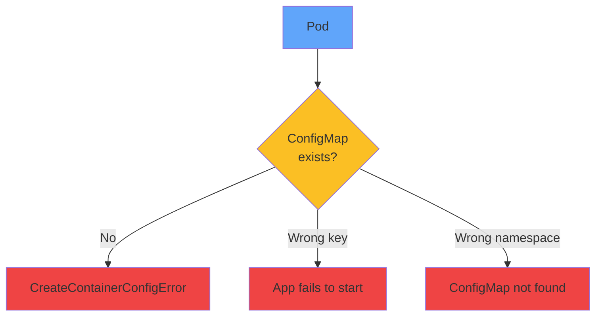

</div>

<!--
METADATA:
sentence: Diagnosis: Check ConfigMap exists - kubectl get configmap app-config - if not found, that's your problem!
search_anchor: Check ConfigMap exists
-->
<div v-click="2" class="mt-8">

```bash
# Check ConfigMap exists
kubectl get configmap app-config
# If not found → Problem!

# Check ConfigMap keys
kubectl get configmap app-config -o yaml
```

</div>

<!--
METADATA:
sentence: ConfigMap/Secret must exist in same namespace!
search_anchor: ConfigMap must exist in same namespace
-->
<div v-click="3" class="mt-6 text-center text-red-400 text-sm">
<carbon-warning class="inline-block text-2xl" /> ConfigMap/Secret must exist in same namespace!
</div>

---
layout: center
---

# CKAD Troubleshooting Strategy

<!--
METADATA:
sentence: CKAD Troubleshooting Strategy - Exam Time Management.
search_anchor: CKAD Troubleshooting Strategy
-->
<div v-click="1">

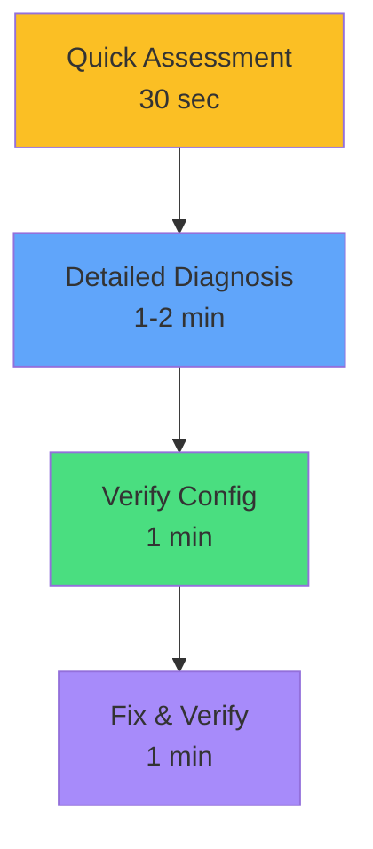

</div>

<!--
METADATA:
sentence: Phase 1: Quick Assessment (30 seconds), Phase 2: Detailed Diagnosis (1-2 minutes), Phase 3: Verify Configuration (1 minute), Phase 4: Fix and Verify (1 minute).
search_anchor: Phase 1: Quick Assessment
-->
<div v-click="2" class="mt-6 text-sm">

```bash
# Phase 1: Quick Assessment
kubectl get all && kubectl get events --sort-by='.lastTimestamp' | tail

# Phase 2: Detailed Diagnosis
kubectl describe pod <failing-pod> && kubectl logs <pod>

# Phase 3: Verify Configuration
kubectl get endpoints <svc> && kubectl get pods --show-labels

# Phase 4: Fix and Verify
kubectl edit ... && kubectl get pods
```

</div>

<!--
METADATA:
sentence: Total Time Budget: 4-5 minutes per troubleshooting question.
search_anchor: Total time budget: 4-5 minutes
-->
<div v-click="3" class="mt-6 text-center text-yellow-400">
<carbon-time class="inline-block text-2xl" /> Total time budget: 4-5 minutes per question
</div>

---
layout: center
---

# Common Error Patterns

<div class="text-xs">

| Error | Root Cause | First Action |
|-------|------------|--------------|
<!--
METADATA:
sentence: ImagePullBackOff → Check image name in describe.
search_anchor: ImagePullBackOff → Check image name
-->
| <span v-click="1">ImagePullBackOff</span> | <span v-click="1">Image name or auth</span> | <span v-click="1"><carbon-search class="inline-block"/> describe pod</span> |
<!--
METADATA:
sentence: CrashLoopBackOff → Check logs with --previous.
search_anchor: CrashLoopBackOff → Check logs with --previous
-->
| <span v-click="2">CrashLoopBackOff</span> | <span v-click="2">App error</span> | <span v-click="2"><carbon-document class="inline-block"/> logs --previous</span> |
<!--
METADATA:
sentence: Pending → Check resources and scheduling in describe.
search_anchor: Pending → Check resources and scheduling
-->
| <span v-click="3">Pending</span> | <span v-click="3">Resources/scheduling</span> | <span v-click="3"><carbon-search class="inline-block"/> describe pod</span> |
<!--
METADATA:
sentence: Running but not Ready → Check readiness probe.
search_anchor: Running but not Ready → Check readiness probe
-->
| <span v-click="4">Running not Ready</span> | <span v-click="4">Readiness probe</span> | <span v-click="4"><carbon-health-cross class="inline-block"/> check probe</span> |
<!--
METADATA:
sentence: Service not routing → Check endpoints.
search_anchor: Service not routing → Check endpoints
-->
| <span v-click="5">Service no endpoints</span> | <span v-click="5">Label mismatch</span> | <span v-click="5"><carbon-tag class="inline-block"/> check labels</span> |
<!--
METADATA:
sentence: CreateContainerConfigError - ConfigMap/Secret doesn't exist.
search_anchor: CreateContainerConfigError
-->
| <span v-click="6">CreateContainerConfigError</span> | <span v-click="6">ConfigMap/Secret missing</span> | <span v-click="6"><carbon-settings class="inline-block"/> get cm,secret</span> |

</div>

<!--
METADATA:
sentence: Learn to recognize patterns quickly!
search_anchor: Learn to recognize patterns quickly
-->
<div v-click="7" class="mt-8 text-center text-lg">
<carbon-idea class="inline-block text-2xl text-yellow-400" /> Learn to recognize patterns quickly!
</div>

---
layout: center
---

# Troubleshooting Decision Tree

<!--
METADATA:
sentence: Troubleshooting Decision Tree - systematic approach to diagnose issues.
search_anchor: Troubleshooting Decision Tree
-->
<div v-click="1">

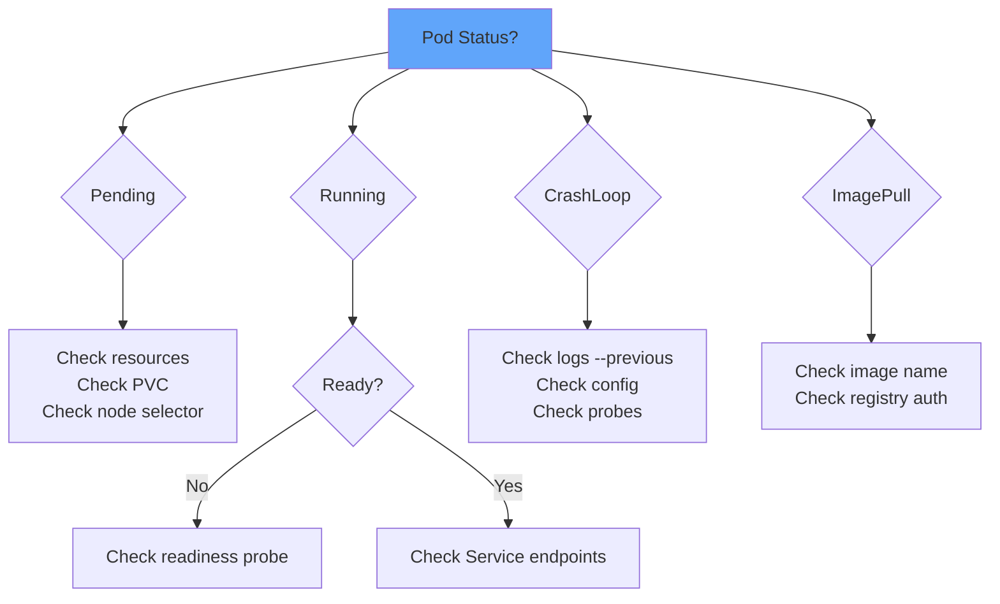

</div>

---
layout: center
---

# Summary

<!--
METADATA:
sentence: Summary - reviewing key troubleshooting concepts.
search_anchor: Summary mindmap
-->
<div v-click="1">

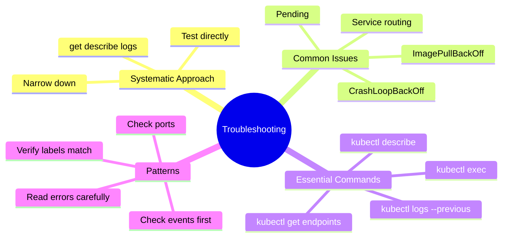

</div>

---
layout: center
---

# Key Takeaways

<div class="grid grid-cols-2 gap-6 mt-6">
<!--
METADATA:
sentence: Master describe and logs - Your primary diagnostic tools.
search_anchor: Master describe and logs
-->
<div v-click="1">
<carbon-search class="text-4xl text-blue-400 mb-2" />
<strong>Master describe</strong><br/>
<span class="text-sm opacity-80">Primary diagnostic tool</span>
</div>
<!--
METADATA:
sentence: Use --previous - Essential for CrashLoopBackOff.
search_anchor: Use --previous - Essential for CrashLoopBackOff
-->
<div v-click="2">
<carbon-document class="text-4xl text-green-400 mb-2" />
<strong>Check --previous</strong><br/>
<span class="text-sm opacity-80">Essential for crashes</span>
</div>
<!--
METADATA:
sentence: Check endpoints - First thing to verify for service issues.
search_anchor: Check endpoints - First thing to verify
-->
<div v-click="3">
<carbon-network-3 class="text-4xl text-purple-400 mb-2" />
<strong>Verify endpoints</strong><br/>
<span class="text-sm opacity-80">First step for services</span>
</div>
<!--
METADATA:
sentence: Verify labels and selectors - Most common source of problems.
search_anchor: Verify labels and selectors
-->
<div v-click="4">
<carbon-tag class="text-4xl text-yellow-400 mb-2" />
<strong>Label matching</strong><br/>
<span class="text-sm opacity-80">Most common issue</span>
</div>
</div>

<!--
METADATA:
sentence: Follow systematic approach - Don't guess!
search_anchor: Follow systematic approach - don't guess
-->
<div v-click="5" class="mt-8 text-center text-xl">
<carbon-certificate class="inline-block text-3xl text-green-400" /> Follow systematic approach - don't guess! <carbon-arrow-right class="inline-block text-2xl" />
</div>
